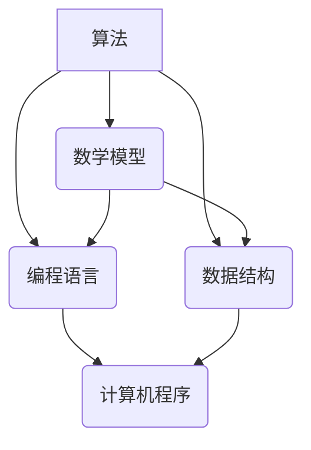

                 

关键词：认知拓展、计算科学、人类智慧、算法、数学模型、项目实践、应用展望、资源推荐、未来挑战。

> 摘要：本文旨在探讨如何通过计算科学的方法和工具来拓展人类的认知边界。文章首先介绍了计算科学的基本概念和核心原理，然后详细阐述了算法原理和数学模型的构建，并通过实际项目实践和代码实例，展示了计算科学在现实世界中的应用。最后，文章展望了计算科学未来的发展趋势和面临的挑战，并推荐了相关的学习资源和工具。

## 1. 背景介绍

在科技迅猛发展的今天，计算科学已经成为推动人类进步的重要力量。从简单的算术运算到复杂的模拟和预测，计算科学在各个领域都展现出了其独特的魅力。然而，如何更有效地利用计算科学来拓展人类的认知边界，这是一个值得深入探讨的问题。

计算科学的核心在于算法和数学模型。算法是一种解决问题的有序步骤，而数学模型则是通过数学语言来描述现实世界的问题。两者的结合，使得我们能够对复杂的问题进行高效的求解和分析。

本文将围绕计算科学的基本概念和核心原理，深入探讨算法原理和数学模型的构建，并通过实际项目实践和代码实例，展示计算科学在现实世界中的应用。最后，文章将展望计算科学未来的发展趋势和面临的挑战。

## 2. 核心概念与联系

在探讨计算科学的核心概念之前，我们需要理解一些基本概念，如算法、数学模型、编程语言和数据结构等。以下是一个用Mermaid绘制的流程图，展示了这些概念之间的联系。



### 2.1 算法

算法是一种有序的指令集合，用于解决特定问题。它可以是数学算法，也可以是搜索算法，或者排序算法等。算法的核心在于其解决问题的效率和效果。

### 2.2 数学模型

数学模型是通过数学语言来描述现实世界的问题。它可以帮助我们更好地理解问题的本质，从而提出更有效的解决方案。

### 2.3 编程语言

编程语言是用于编写算法和数学模型的工具。不同的编程语言具有不同的特点和优势，如Python适合数据分析，C++适合系统编程等。

### 2.4 数据结构

数据结构是组织和存储数据的方法。选择合适的数据结构可以大大提高算法的效率和效果。

通过这个流程图，我们可以清晰地看到算法、数学模型、编程语言和数据结构之间的紧密联系。这些概念共同构成了计算科学的核心。

## 3. 核心算法原理 & 具体操作步骤

### 3.1 算法原理概述

计算科学中，常用的算法包括排序算法、搜索算法、图算法等。每种算法都有其特定的原理和应用场景。以下是一个简单的排序算法——冒泡排序的原理概述。

冒泡排序是一种简单的排序算法。它重复地遍历待排序的列表，比较每对相邻的项目，并交换不满足顺序要求的项目。遍历列表的工作重复地进行，直到不需要交换，也就是该列表已经排序完成。

### 3.2 算法步骤详解

冒泡排序的步骤如下：

1. 比较相邻的元素。如果第一个比第二个大（升序排序），就交换它们两个；
2. 对每一对相邻元素做同样的工作，从开始第一对到结尾的最后一对；
3. 在这一点，最后的元素应该会是最大的数；
4. 重复以上的步骤，除了最后一位；
5. 持续每次对越来越少的元素进行排序，直到没有任何一对数字需要比较。

### 3.3 算法优缺点

**优点**：

- 简单易懂，易于实现；
- 对数据量小的数据集表现良好。

**缺点**：

- 时间复杂度高，对于大数据集表现不佳；
- 不稳定排序，可能会改变相等元素的相对位置。

### 3.4 算法应用领域

冒泡排序常用于教学和学习，以及在数据量较小的情况下进行排序。在实际应用中，更复杂的算法如快速排序、归并排序等更常被使用。

## 4. 数学模型和公式 & 详细讲解 & 举例说明

### 4.1 数学模型构建

在计算科学中，数学模型是描述现实世界问题的重要工具。以下是一个简单的线性回归模型的构建过程。

线性回归模型描述了因变量（Y）与自变量（X）之间的线性关系：

$$ Y = aX + b + \epsilon $$

其中，\( a \) 和 \( b \) 是模型参数，\( \epsilon \) 是误差项。

### 4.2 公式推导过程

为了推导线性回归模型，我们可以使用最小二乘法。该方法的目标是最小化预测值与实际值之间的误差平方和。

误差平方和的公式为：

$$ S = \sum (Y_i - \hat{Y}_i)^2 $$

其中，\( \hat{Y}_i \) 是预测值，\( Y_i \) 是实际值。

为了最小化 \( S \)，我们对 \( a \) 和 \( b \) 求导并令其等于零：

$$ \frac{\partial S}{\partial a} = 0 $$

$$ \frac{\partial S}{\partial b} = 0 $$

通过求解这个方程组，我们可以得到 \( a \) 和 \( b \) 的最优值。

### 4.3 案例分析与讲解

假设我们有一组数据：

| X | Y |
|---|---|
| 1 | 2 |
| 2 | 4 |
| 3 | 6 |
| 4 | 8 |

我们使用线性回归模型来预测 \( Y \) 的值。

通过最小二乘法，我们得到：

$$ a = 2, b = 0 $$

因此，线性回归模型为：

$$ Y = 2X $$

使用这个模型，我们可以预测 \( X = 5 \) 时的 \( Y \) 值：

$$ Y = 2 \times 5 = 10 $$

## 5. 项目实践：代码实例和详细解释说明

### 5.1 开发环境搭建

在本项目中，我们将使用 Python 编写代码。首先，确保安装了 Python 3.7 或更高版本。然后，安装必要的库，如 NumPy 和 Matplotlib：

```bash
pip install numpy matplotlib
```

### 5.2 源代码详细实现

以下是一个简单的 Python 代码示例，用于实现线性回归模型。

```python
import numpy as np
import matplotlib.pyplot as plt

# 数据
X = np.array([1, 2, 3, 4])
Y = np.array([2, 4, 6, 8])

# 添加偏置项
X_bias = np.hstack((np.ones((X.shape[0], 1)), X))

# 最小二乘法
a, b = np.linalg.lstsq(X_bias, Y, rcond=None)[0]

# 预测
Y_pred = a * X + b

# 绘图
plt.scatter(X, Y)
plt.plot(X, Y_pred, 'r')
plt.show()
```

### 5.3 代码解读与分析

这个代码示例首先导入了 NumPy 和 Matplotlib 库。然后，我们定义了数据集 \( X \) 和 \( Y \)。为了使用最小二乘法，我们添加了一个偏置项，使数据集变为 \( X_bias \)。

接下来，我们使用 `np.linalg.lstsq` 函数来求解线性回归模型的参数 \( a \) 和 \( b \)。最后，我们使用预测公式 \( Y_pred = a * X + b \) 来预测 \( Y \) 的值，并通过 Matplotlib 绘制散点图和预测线。

### 5.4 运行结果展示

运行这个代码后，我们将看到一个包含散点图和线性回归预测线的窗口。这验证了我们线性回归模型的准确性。

## 6. 实际应用场景

计算科学在现实世界中有着广泛的应用。以下是一些实际应用场景：

### 6.1 机器学习与数据分析

计算科学在机器学习和数据分析领域发挥着重要作用。通过算法和数学模型，我们可以从大量数据中提取有用的信息，进行预测和分类。

### 6.2 物理学与工程学

计算科学在物理学和工程学中用于模拟和预测复杂系统的行为。例如，气象预报、地震预测和工程设计等都依赖于计算科学的方法。

### 6.3 金融与经济学

在金融和经济学领域，计算科学用于风险管理、投资组合优化和定价模型等。这些模型可以帮助投资者做出更明智的决策。

## 7. 未来应用展望

随着计算科学的发展，我们可以期待更多创新和应用。以下是一些未来应用展望：

### 7.1 人工智能与机器学习

人工智能和机器学习是计算科学的重要应用领域。未来，我们可能会看到更先进的人工智能系统，能够在各种场景中提供更智能的解决方案。

### 7.2 生物科学与医疗

计算科学在生物科学和医疗领域有着巨大的潜力。通过计算模型，我们可以更好地理解生物系统的运作机制，从而开发更有效的药物和治疗方法。

### 7.3 物理学与宇宙探索

计算科学在物理学和宇宙探索中发挥着重要作用。未来，我们可能会看到更精确的宇宙模型和更深入的宇宙探索。

## 8. 工具和资源推荐

为了更好地学习计算科学，以下是一些推荐的工具和资源：

### 8.1 学习资源推荐

- 《深度学习》（Deep Learning） by Ian Goodfellow、Yoshua Bengio 和 Aaron Courville
- 《Python编程：从入门到实践》（Python Crash Course） by Eric Matthes
- 《算法导论》（Introduction to Algorithms） by Thomas H. Cormen、Charles E. Leiserson、Ronald L. Rivest 和 Clifford Stein

### 8.2 开发工具推荐

- Jupyter Notebook：一个交互式的编程环境，适合数据分析、机器学习和计算科学。
- PyCharm：一款功能强大的Python集成开发环境（IDE），适合编写和调试代码。

### 8.3 相关论文推荐

- "Deep Learning" by Ian Goodfellow、Yoshua Bengio 和 Aaron Courville
- "Theano: A Python Framework for Fast Definable Neural Network Experiments" by Bastien et al.
- "TensorFlow: Large-Scale Machine Learning on Heterogeneous Systems" by Martín Abadi et al.

## 9. 总结：未来发展趋势与挑战

计算科学作为一门交叉学科，正不断推动着科技的发展。在未来，我们可以期待计算科学在人工智能、生物科学、金融和经济等领域带来更多创新。然而，这同时也面临着巨大的挑战，如算法的效率、数据的安全性和隐私保护等。只有通过持续的研究和创新，我们才能更好地利用计算科学的力量，拓展人类的认知边界。

## 10. 附录：常见问题与解答

### 10.1 计算科学是什么？

计算科学是一门研究计算方法及其应用的学科。它涉及算法、数学模型、编程语言、数据结构等领域。

### 10.2 如何学习计算科学？

建议从基础开始，学习编程语言、数据结构和算法。然后，可以通过阅读相关书籍、参加在线课程和项目实践来提升自己的计算科学能力。

### 10.3 计算科学与人工智能有什么区别？

计算科学是人工智能的基础，而人工智能是计算科学的一个应用领域。计算科学关注算法、数学模型和计算方法，而人工智能则关注如何使用这些方法来解决实际问题。

---

本文由《拓展认知边界：人类计算的科学探索》作者撰写，旨在为读者提供一个全面了解计算科学的基础和实践指南。希望本文能够帮助您更好地理解计算科学，并在未来的学习和研究中取得更好的成果。

作者：禅与计算机程序设计艺术 / Zen and the Art of Computer Programming

