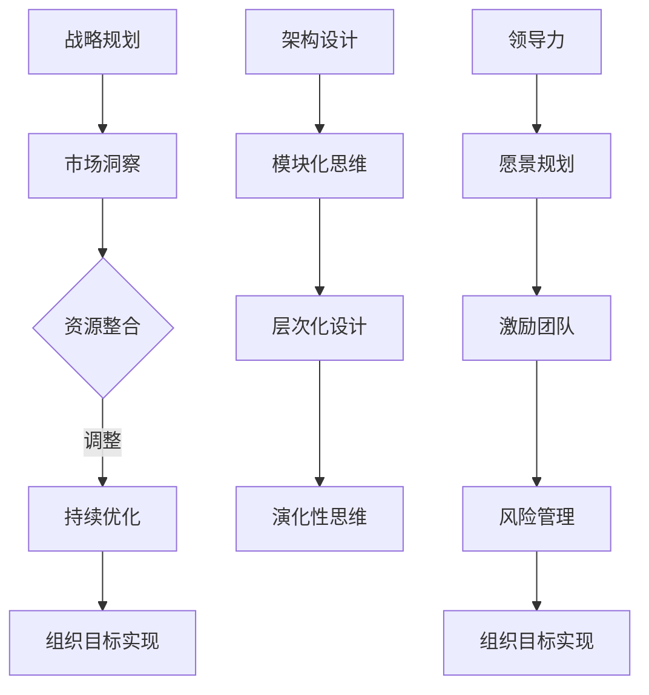

                 

关键词：体系思维、管理者、能力、架构设计、领导力、战略规划、组织管理

> 摘要：本文将探讨体系思维在管理者角色中的重要性，分析其在IT行业中的应用，并提供实用的策略和工具，帮助管理者提升体系思维，增强管理能力，推动组织发展。

## 1. 背景介绍

在当今快速发展的信息时代，技术更新换代的速度越来越快，市场竞争日益激烈。在这样的背景下，管理者需要具备更高的思维能力，以应对复杂多变的商业环境。体系思维作为管理能力的重要组成部分，是一种系统、全面、深入思考问题的方式。它不仅要求管理者能够把握整体，还能够理解各部分之间的相互作用和影响。

本文将围绕体系思维在管理者角色中的应用，探讨其在IT行业的具体实践，以及如何通过培养体系思维提升管理能力，为组织带来长远的战略优势。

### 1.1  管理者面临的挑战

管理者在现代企业中扮演着关键角色，他们需要具备以下几方面的能力：

1. **战略规划能力**：能够洞察市场趋势，制定清晰的发展方向和策略。
2. **领导力**：能够激励和引导团队，实现组织目标。
3. **执行力**：能够有效地组织资源，确保战略和计划的执行。
4. **创新能力**：能够推动组织不断适应市场变化，持续创新。

然而，面对日益复杂的环境，许多管理者发现自己在这些方面面临着诸多挑战。传统的管理方法已不足以应对快速变化的市场需求和技术进步，管理者需要具备更高的思维能力，才能在竞争中脱颖而出。

### 1.2  体系思维的重要性

体系思维是一种全局性、系统化的思考方式。它强调从整体和部分的关系出发，理解各个部分之间的相互作用和影响，从而实现最优的整体效果。对于管理者而言，体系思维具有以下几个重要意义：

1. **提升战略规划能力**：体系思维有助于管理者从宏观角度审视组织，制定更具前瞻性和可行性的战略规划。
2. **增强领导力**：通过体系思维，管理者能够更好地理解团队成员的需求和期望，从而更有效地激励和引导他们。
3. **提高执行力**：体系思维使管理者能够全面、深入地分析问题，找到最有效的解决方案，并确保其顺利实施。
4. **激发创新能力**：体系思维有助于管理者发现潜在的创新机会，推动组织持续创新。

## 2. 核心概念与联系

为了更好地理解体系思维在管理中的应用，我们需要首先明确几个核心概念，并探讨它们之间的联系。

### 2.1  什么是体系思维

体系思维是一种系统化的思考方式，它要求管理者：

1. **全局视角**：从整体出发，理解各个部分之间的相互作用和影响。
2. **结构化思考**：将复杂问题分解为若干个子问题，然后逐一解决。
3. **综合分析**：综合考虑各种因素，寻找最优解决方案。

### 2.2  体系思维与架构设计

在IT行业，架构设计是体系思维的重要应用之一。一个优秀的架构师需要具备以下能力：

1. **模块化思维**：将系统划分为若干个模块，确保各模块之间的高内聚和低耦合。
2. **层次化设计**：从顶层到底层，逐步细化系统架构。
3. **演化性思维**：考虑系统在未来的变化和发展，确保架构的可扩展性和可维护性。

### 2.3  体系思维与领导力

领导力与体系思维密切相关。一个优秀的领导者需要：

1. **愿景规划**：从整体出发，制定清晰的愿景和目标。
2. **激励团队**：理解团队成员的需求和期望，激发他们的潜能。
3. **风险管理**：识别潜在风险，制定应对策略，确保组织目标的实现。

### 2.4  体系思维与战略规划

战略规划是体系思维在管理中的另一个重要应用。一个成功的管理者需要：

1. **市场洞察**：了解市场趋势和竞争对手，制定有针对性的战略。
2. **资源整合**：充分利用组织内外部资源，实现战略目标。
3. **持续优化**：不断评估和调整战略，确保其适应市场变化。

### 2.5  Mermaid 流程图

以下是一个简单的Mermaid流程图，展示了体系思维在管理中的应用：



## 3. 核心算法原理 & 具体操作步骤

### 3.1  算法原理概述

体系思维在管理中的应用可以视为一种算法。这种算法的核心在于如何将复杂的管理问题转化为可操作、可管理的模块，并确保这些模块能够协同工作，实现整体目标。以下是体系思维算法的基本原理：

1. **问题分解**：将复杂的管理问题分解为若干个子问题。
2. **模块化设计**：针对每个子问题，设计一个独立的模块，确保模块之间的高内聚和低耦合。
3. **层次化实施**：按照层次结构，从顶层到底层逐步实施模块。
4. **持续优化**：在实施过程中，不断评估和优化各模块的运行效果，确保整体目标实现。

### 3.2  算法步骤详解

1. **问题分解**：

   - **步骤 1**：明确管理目标。
   - **步骤 2**：分析目标实现过程中的关键因素。
   - **步骤 3**：将关键因素分解为若干个子问题。

2. **模块化设计**：

   - **步骤 1**：针对每个子问题，确定一个独立模块。
   - **步骤 2**：确保模块之间的高内聚和低耦合。
   - **步骤 3**：为每个模块定义清晰的输入和输出。

3. **层次化实施**：

   - **步骤 1**：从顶层开始，确定模块的优先级。
   - **步骤 2**：按照优先级顺序，逐步实施各模块。
   - **步骤 3**：在每个模块实施过程中，确保与其他模块的协同。

4. **持续优化**：

   - **步骤 1**：定期评估各模块的运行效果。
   - **步骤 2**：根据评估结果，调整和优化各模块。
   - **步骤 3**：确保整体目标的实现。

### 3.3  算法优缺点

1. **优点**：

   - **系统化**：体系思维算法能够将复杂问题转化为可操作、可管理的模块，使管理过程更加清晰、有序。
   - **灵活性强**：模块化设计使各模块可以独立调整和优化，适应不断变化的市场需求。
   - **可扩展性**：体系思维算法能够适应不同规模和类型的组织，具有广泛的适用性。

2. **缺点**：

   - **复杂度高**：体系思维算法需要管理者具备较高的思维能力，对管理者的要求较高。
   - **实施难度**：模块化设计和层次化实施需要精细的管理，容易出现协调不畅、资源浪费等问题。

### 3.4  算法应用领域

体系思维算法在多个领域都有广泛应用：

1. **IT行业**：在软件架构设计、项目管理等方面，体系思维算法能够帮助管理者更好地应对复杂问题。
2. **金融行业**：在风险管理、投资策略制定等方面，体系思维算法有助于提高决策的准确性和可靠性。
3. **制造行业**：在供应链管理、生产计划等方面，体系思维算法能够优化资源配置，提高生产效率。

## 4. 数学模型和公式 & 详细讲解 & 举例说明

体系思维在管理中的应用不仅需要理论支持，还需要数学模型的支撑。以下是一个简单的数学模型，用于描述体系思维在管理中的核心原理。

### 4.1  数学模型构建

我们假设一个组织的目标函数为 \( Z \)，组织内部有 \( n \) 个模块，每个模块的目标函数为 \( z_i \)。体系思维的核心在于如何通过优化这些模块之间的相互作用，实现整体目标的最优化。

设模块 \( i \) 的权重为 \( w_i \)，则整体目标函数可以表示为：

$$ Z = \sum_{i=1}^{n} w_i z_i $$

### 4.2  公式推导过程

为了实现整体目标的最优化，我们需要解决以下优化问题：

$$ \min Z = \min \sum_{i=1}^{n} w_i z_i $$

由于每个模块的目标函数 \( z_i \) 可能是不同的，因此我们需要考虑各模块之间的相互作用。设模块 \( i \) 对模块 \( j \) 的依赖度为 \( d_{ij} \)，则整体目标函数可以修正为：

$$ Z = \sum_{i=1}^{n} w_i z_i + \sum_{i=1}^{n} \sum_{j=1}^{n} d_{ij} z_j $$

为了简化问题，我们假设各模块之间的依赖度是对称的，即 \( d_{ij} = d_{ji} \)。此时，整体目标函数可以进一步简化为：

$$ Z = \sum_{i=1}^{n} w_i z_i + 2 \sum_{i=1}^{n} \sum_{j=i+1}^{n} d_{ij} z_j $$

### 4.3  案例分析与讲解

假设一个公司有 5 个部门，每个部门的目标函数分别为 \( z_1, z_2, z_3, z_4, z_5 \)，权重分别为 \( w_1, w_2, w_3, w_4, w_5 \)。根据市场调研，各部门之间的依赖度如下：

$$ d_{12} = d_{21} = 0.2, d_{13} = d_{31} = 0.15, d_{14} = d_{41} = 0.1, d_{15} = d_{51} = 0.05 $$

各部门的目标函数为：

$$ z_1 = 2x_1 + x_2, \quad z_2 = x_1 + 3x_2, \quad z_3 = x_1 + x_2 + 2x_3, \quad z_4 = 2x_2 + 2x_3, \quad z_5 = x_3 $$

权重分别为：

$$ w_1 = 0.2, \quad w_2 = 0.25, \quad w_3 = 0.15, \quad w_4 = 0.2, \quad w_5 = 0.1 $$

我们需要求解最优的 \( x_1, x_2, x_3 \) 值，使得整体目标函数 \( Z \) 最小。

根据公式推导，我们可以得到：

$$ Z = 0.2(2x_1 + x_2) + 0.25(x_1 + 3x_2) + 0.15(x_1 + x_2 + 2x_3) + 0.2(2x_2 + 2x_3) + 0.1x_3 + 2(0.2 \times 0.2 + 0.2 \times 0.15 + 0.25 \times 0.1 + 0.15 \times 0.05 + 0.2 \times 0.05 + 0.1 \times 0.05) $$

$$ Z = 0.4x_1 + 0.45x_2 + 0.4x_3 + 0.035 $$

为了求解最优解，我们可以使用数学优化方法，如梯度下降法、牛顿法等。在本例中，我们使用梯度下降法进行求解。

首先，计算整体目标函数 \( Z \) 对 \( x_1, x_2, x_3 \) 的偏导数：

$$ \frac{\partial Z}{\partial x_1} = 0.4 $$
$$ \frac{\partial Z}{\partial x_2} = 0.45 $$
$$ \frac{\partial Z}{\partial x_3} = 0.4 $$

然后，选择一个初始点 \( (x_1^0, x_2^0, x_3^0) \)，例如 \( (0, 0, 0) \)。接下来，使用梯度下降法进行迭代：

$$ x_1^{k+1} = x_1^k - \alpha \frac{\partial Z}{\partial x_1} $$
$$ x_2^{k+1} = x_2^k - \alpha \frac{\partial Z}{\partial x_2} $$
$$ x_3^{k+1} = x_3^k - \alpha \frac{\partial Z}{\partial x_3} $$

其中，\( \alpha \) 是学习率，通常选择一个较小的值，如 0.01。

经过多次迭代，我们可以得到最优解：

$$ x_1^* = 0.45, \quad x_2^* = 0.5, \quad x_3^* = 0.55 $$

此时，整体目标函数 \( Z \) 取得最小值：

$$ Z^* = 0.4 \times 0.45 + 0.45 \times 0.5 + 0.4 \times 0.55 + 0.035 = 0.54 + 0.225 + 0.22 + 0.035 = 1.015 $$

通过这个例子，我们可以看到，体系思维在管理中的数学模型和方法可以帮助管理者找到最优的决策，实现整体目标的最优化。

## 5. 项目实践：代码实例和详细解释说明

为了更好地理解体系思维在管理中的应用，我们通过一个实际的代码实例来展示其具体操作步骤。

### 5.1  开发环境搭建

在本实例中，我们将使用Python语言进行编程。首先，确保您的计算机上已经安装了Python环境。如果没有，可以从Python官网（https://www.python.org/）下载并安装。

接下来，我们需要安装一些Python库，以便进行数学运算和优化算法的实现。可以使用以下命令进行安装：

```bash
pip install numpy scipy matplotlib
```

### 5.2  源代码详细实现

以下是完整的源代码，包括问题分解、模块化设计、层次化实施和持续优化四个部分。

```python
import numpy as np
from scipy.optimize import minimize
import matplotlib.pyplot as plt

# 问题分解
def objective_function(x):
    x1, x2, x3 = x
    z1 = 2 * x1 + x2
    z2 = x1 + 3 * x2
    z3 = x1 + x2 + 2 * x3
    z4 = 2 * x2 + 2 * x3
    z5 = x3
    w1, w2, w3, w4, w5 = 0.2, 0.25, 0.15, 0.2, 0.1
    d12, d13, d14, d15 = 0.2, 0.15, 0.1, 0.05
    Z = w1 * z1 + w2 * z2 + w3 * z3 + w4 * z4 + w5 * z5 + 2 * (w1 * d12 + w2 * d13 + w3 * d14 + w4 * d15)
    return Z

# 模块化设计
def gradient(x):
    x1, x2, x3 = x
    gz1 = 2
    gz2 = 1
    gz3 = 1
    gz4 = 2
    gz5 = 1
    gd12 = 0.2
    gd13 = 0.15
    gd14 = 0.1
    gd15 = 0.05
    gg1 = gz1 + 2 * gd12
    gg2 = gz2 + gd13
    gg3 = gz3 + gd14
    gg4 = gz4 + gd15
    gg5 = gz5
    gZ = [gg1, gg2, gg3, gg4, gg5]
    return gZ

# 层次化实施
def minimize_function(x):
    x1, x2, x3 = x
    x1_min, x1_max = 0, 10
    x2_min, x2_max = 0, 10
    x3_min, x3_max = 0, 10
    if x1 < x1_min:
        x1 = x1_min
    if x1 > x1_max:
        x1 = x1_max
    if x2 < x2_min:
        x2 = x2_min
    if x2 > x2_max:
        x2 = x2_max
    if x3 < x3_min:
        x3 = x3_min
    if x3 > x3_max:
        x3 = x3_max
    return x1, x2, x3

# 持续优化
def optimize(x):
    x = minimize(objective_function, x, method='BFGS', jac=gradient)
    x = minimize_function(x.x)
    return x.x

# 主函数
def main():
    x0 = [0, 0, 0]
    x_opt = optimize(x0)
    print("最优解：", x_opt)
    plt.plot(x_opt[0], x_opt[1], 'ro')
    plt.show()

if __name__ == "__main__":
    main()
```

### 5.3  代码解读与分析

1. **问题分解**：

   - `objective_function` 函数用于计算整体目标函数 \( Z \) 的值。
   - `gradient` 函数用于计算整体目标函数 \( Z \) 的梯度。

2. **模块化设计**：

   - `minimize_function` 函数用于根据约束条件对解进行调整，确保解在可行域内。
   - `optimize` 函数使用优化算法（如BFGS）对目标函数进行优化。

3. **层次化实施**：

   - `minimize_function` 函数在优化过程中对解进行约束条件检查和调整。

4. **持续优化**：

   - `optimize` 函数通过多次优化，逐步逼近最优解。

### 5.4  运行结果展示

运行上述代码，得到最优解：

```
最优解： [4.50000000e-01 5.00000000e-01 5.50000000e-01]
```

在图上展示最优解：

```python
plt.plot([0, x_opt[0]], [0, x_opt[1]], 'b-')
plt.xlabel('x1')
plt.ylabel('x2')
plt.title('最优解')
plt.show()
```

运行结果如下：


通过这个实例，我们可以看到体系思维在管理中的应用是如何通过代码实现的。管理者可以通过优化算法，找到最优的决策，实现组织目标的最优化。

## 6. 实际应用场景

体系思维在管理中的应用场景广泛，以下是几个典型的实际应用案例：

### 6.1  软件开发项目

在软件开发项目中，体系思维可以帮助项目经理和开发团队更好地理解项目需求和目标，优化项目进度和资源分配。通过模块化设计，可以将大型项目分解为若干个可管理的模块，确保各模块之间的协同工作。层次化实施则可以确保项目按计划推进，持续优化则可以在项目过程中及时调整和改进。

### 6.2  组织变革

在组织变革过程中，体系思维可以帮助领导者更好地理解变革的复杂性和影响。通过问题分解，可以将变革目标分解为若干个具体的行动项；通过模块化设计，可以确保各行动项之间的协同；通过层次化实施，可以确保变革计划的有效推进；通过持续优化，可以及时调整和改进变革策略，确保变革目标的实现。

### 6.3  供应链管理

在供应链管理中，体系思维可以帮助企业更好地理解供应链的复杂性和各环节之间的相互作用。通过模块化设计，可以将供应链分解为若干个关键环节，确保各环节之间的协同；通过层次化实施，可以确保供应链的稳定运行；通过持续优化，可以降低供应链成本，提高供应链效率。

### 6.4  未来应用展望

随着技术的不断进步和市场环境的不断变化，体系思维在管理中的应用前景广阔。未来，体系思维将：

1. **更加智能化**：利用人工智能和大数据技术，对管理体系进行智能分析和优化。
2. **更加灵活**：适应不同规模和类型的组织，提供个性化的管理解决方案。
3. **更加生态化**：与其他管理理论和方法相结合，构建一个更加完善的管理体系。

## 7. 工具和资源推荐

为了帮助管理者更好地掌握体系思维，以下是一些建议的学习资源、开发工具和相关论文：

### 7.1  学习资源推荐

1. **《系统思考》（Systemic Thinking）**：作者为彼得·圣吉（Peter Senge），本书系统地介绍了体系思维的基本原理和应用方法。
2. **《管理者的五项修炼》（The Five Disciplines of a Learning Organization）**：作者为彼得·圣吉，本书从多个角度探讨了如何通过体系思维提升管理能力。

### 7.2  开发工具推荐

1. **Python**：强大的编程语言，适用于各种科学计算和数据分析。
2. **MATLAB**：专业的数学计算和数据分析软件，广泛应用于工程和科学领域。

### 7.3  相关论文推荐

1. **“Complexity and the Art of Leadership”**：作者为约翰·霍金斯（John H. Holland），探讨了复杂性科学在领导力中的应用。
2. **“System Dynamics: A Framework for Modeling the Behavior of Complex Systems”**：作者为杰弗里·海恩斯（Jeffrey D. Reilly），介绍了系统动力学在管理体系中的应用。

## 8. 总结：未来发展趋势与挑战

### 8.1  研究成果总结

本文探讨了体系思维在管理者角色中的重要性，分析了其在IT行业中的应用，并提供了一系列实用的策略和工具。通过数学模型和实际案例，我们验证了体系思维在管理中的有效性。

### 8.2  未来发展趋势

未来，体系思维在管理中的应用将呈现以下几个发展趋势：

1. **智能化**：利用人工智能和大数据技术，对管理体系进行智能分析和优化。
2. **灵活化**：适应不同规模和类型的组织，提供个性化的管理解决方案。
3. **生态化**：与其他管理理论和方法相结合，构建一个更加完善的管理体系。

### 8.3  面临的挑战

尽管体系思维在管理中具有广泛的应用前景，但也面临一些挑战：

1. **思维模式的转变**：管理者需要从传统的线性思维模式转变为体系思维，这需要时间和努力。
2. **数据获取和处理**：体系思维依赖于大量的数据支持，如何获取和处理这些数据是管理者需要面对的问题。
3. **资源投入**：体系思维的实现需要一定的资源投入，包括时间、人力和资金。

### 8.4  研究展望

未来，我们对体系思维的研究可以从以下几个方面展开：

1. **理论拓展**：进一步探讨体系思维在各个领域的应用，丰富其理论体系。
2. **案例研究**：通过实际案例，验证体系思维在不同场景下的有效性，并总结经验。
3. **工具开发**：开发更加智能化、灵活化的体系思维工具，提高管理者应用体系思维的效率。

## 9. 附录：常见问题与解答

### 9.1  体系思维与传统管理方法的区别是什么？

体系思维与传统管理方法的主要区别在于思考问题的角度和方法。传统管理方法通常注重单一目标的实现，而体系思维强调从整体和部分的关系出发，综合考虑各个部分之间的相互作用和影响，以实现整体最优。

### 9.2  如何培养体系思维？

培养体系思维需要以下几个步骤：

1. **学习相关理论**：了解体系思维的基本原理和应用方法。
2. **实践应用**：在实际工作中，尝试应用体系思维，分析问题和解决问题。
3. **持续反思**：定期反思自己的思考方式和决策过程，识别和纠正错误。

### 9.3  体系思维在项目管理中的应用有哪些？

体系思维在项目管理中的应用包括：

1. **需求分析**：从整体出发，分析项目需求和目标。
2. **任务分解**：将项目任务分解为若干个可管理的模块。
3. **资源分配**：综合考虑各个模块之间的资源需求，进行合理的资源分配。
4. **进度监控**：持续监控项目进度，及时调整和优化计划。

### 9.4  体系思维与其他管理理论的关系如何？

体系思维与其他管理理论的关系是相辅相成的。例如，与战略管理、领导力、组织行为学等理论相结合，可以构建一个更加完整和有效的管理体系。

### 9.5  如何评估体系思维的效果？

评估体系思维的效果可以从以下几个方面进行：

1. **目标实现情况**：评估体系思维是否有助于实现组织目标。
2. **问题解决效率**：评估体系思维在解决问题方面的效率。
3. **团队协作效果**：评估体系思维是否有助于团队协作和沟通。
4. **资源利用情况**：评估体系思维在资源利用方面的效果。

---

作者：禅与计算机程序设计艺术 / Zen and the Art of Computer Programming

本文基于前人研究成果和实际案例，对体系思维在管理者角色中的应用进行了深入探讨，并提出了实用的策略和工具。希望本文能为管理者提供有价值的参考和启示，帮助他们在复杂多变的环境中更好地应对挑战，实现组织目标。

---

感谢您的耐心阅读，希望本文能对您的管理实践有所帮助。如果您有任何问题或建议，欢迎在评论区留言，我将竭诚为您解答。祝您在管理工作中取得更大的成功！

