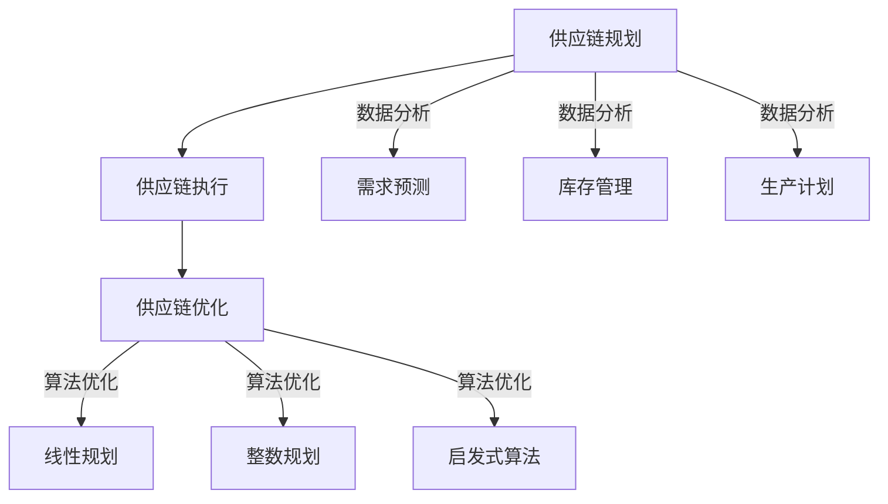

                 

### 1. 背景介绍

随着电子商务行业的迅猛发展，供应链管理在企业运营中的重要性日益凸显。拼多多作为中国领先的电商平台之一，其供应链管理水平直接关系到企业的竞争力。为了进一步提升供应链效率，降低成本，提高客户满意度，拼多多在2025年针对供应链优化工程师岗位开展了社招活动。本次招聘主要面向具有供应链优化、数据分析、算法研究等背景的人才，旨在吸引业内优秀人才加入，共同推动拼多多供应链体系的优化升级。

供应链优化工程师在拼多多供应链管理中扮演着关键角色。他们通过运用数据分析和算法优化技术，对供应链各环节进行深入分析，发现瓶颈和改进空间，提出并实施优化方案，从而提高供应链整体效率和响应速度。随着电子商务市场的不断扩大，供应链优化工程师需要面对更加复杂和动态的供应链环境，这对他们的专业技能和创新能力提出了更高的要求。

本文将围绕拼多多2025供应链优化工程师社招面试题集展开讨论，通过对面试题的分析和解答，帮助读者了解供应链优化领域的核心知识点，掌握供应链管理的基本理论和实践技巧。同时，本文还将探讨未来供应链管理的发展趋势和挑战，为读者提供有益的参考。

### 2. 核心概念与联系

要成为一名优秀的供应链优化工程师，掌握以下核心概念和联系是非常必要的：

#### 2.1 供应链管理

供应链管理涉及从原材料采购到产品交付给最终用户的整个流程。它包括以下关键环节：

- **供应链规划**：包括需求预测、库存管理和生产计划等。
- **供应链执行**：涉及订单处理、物流配送和售后服务等。
- **供应链优化**：通过对供应链各环节的分析和优化，提高整体效率和响应速度。

#### 2.2 数据分析

数据分析是供应链优化的重要工具，通过收集、处理和分析大量数据，可以发现潜在问题和优化机会。核心概念包括：

- **数据源**：如销售数据、库存数据和物流数据等。
- **数据预处理**：包括数据清洗、数据整合和数据规范化等。
- **数据分析方法**：如回归分析、聚类分析和时间序列分析等。

#### 2.3 算法优化

算法优化是提高供应链效率的关键手段。常见算法包括：

- **线性规划**：用于解决资源分配问题，如库存优化和运输路径优化等。
- **整数规划**：用于解决离散问题，如设备调度和车辆路径问题等。
- **启发式算法**：如遗传算法、模拟退火算法和蚁群算法等，用于解决复杂优化问题。

#### 2.4 Mermaid 流程图

为了更清晰地展示供应链优化过程中的核心概念和联系，我们可以使用Mermaid流程图进行描述。以下是一个示例：



在这个流程图中，供应链规划、供应链执行和供应链优化是三个核心环节，它们通过数据分析进行连接。每个数据分析环节都对应一个或多个算法优化方法，从而实现供应链的整体优化。

### 3. 核心算法原理 & 具体操作步骤

#### 3.1 算法原理概述

在供应链优化中，常用的算法原理主要包括线性规划、整数规划和启发式算法等。以下是对这些算法原理的简要概述：

- **线性规划**：线性规划是一种数学优化方法，用于在给定约束条件下最大化或最小化线性目标函数。在供应链优化中，线性规划可以用于解决资源分配问题，如库存优化和运输路径优化等。

- **整数规划**：整数规划是线性规划的一种扩展，用于解决离散问题，如设备调度和车辆路径问题等。与线性规划不同，整数规划的目标变量是整数，这要求求解过程更加复杂。

- **启发式算法**：启发式算法是一种基于经验和启发式的优化方法，用于解决复杂优化问题。常见的启发式算法包括遗传算法、模拟退火算法和蚁群算法等。这些算法通过迭代过程逐渐逼近最优解。

#### 3.2 算法步骤详解

下面我们分别介绍线性规划、整数规划和启发式算法的具体操作步骤：

- **线性规划步骤**：

  1. 建立线性规划模型，包括目标函数和约束条件。
  2. 选择合适的求解器，如单纯形法或 interior-point method。
  3. 运行求解器，得到最优解。
  4. 分析最优解，提出优化建议。

- **整数规划步骤**：

  1. 建立整数规划模型，包括目标函数和约束条件。
  2. 选择合适的求解器，如分支定界法或动态规划。
  3. 运行求解器，得到最优解。
  4. 分析最优解，提出优化建议。

- **启发式算法步骤**：

  1. 选择初始解。
  2. 根据启发式规则进行迭代，逐步改进解的质量。
  3. 设定终止条件，如迭代次数或解的质量阈值。
  4. 输出最终解。

#### 3.3 算法优缺点

每种算法都有其独特的优势和局限性，下面我们分别对线性规划、整数规划和启发式算法进行优缺点分析：

- **线性规划**：

  - 优点：线性规划模型简单，求解速度快，适用于解决资源分配问题。
  - 缺点：线性规划模型的假设条件较强，可能无法解决复杂优化问题。

- **整数规划**：

  - 优点：整数规划可以解决离散问题，更贴近实际应用。
  - 缺点：求解过程复杂，计算时间较长。

- **启发式算法**：

  - 优点：启发式算法简单易实现，适用于解决复杂优化问题。
  - 缺点：可能无法保证最优解，优化效果受启发式规则影响较大。

#### 3.4 算法应用领域

线性规划、整数规划和启发式算法在供应链优化中都有广泛应用，下面列举一些常见应用领域：

- **库存优化**：通过线性规划和整数规划，可以优化库存水平和采购策略。
- **运输路径优化**：通过线性规划和启发式算法，可以优化运输路线和配送时间。
- **设备调度**：通过整数规划，可以优化设备使用效率和调度策略。
- **供应链网络设计**：通过启发式算法，可以优化供应链网络结构和布局。

### 4. 数学模型和公式 & 详细讲解 & 举例说明

在供应链优化中，数学模型和公式起着至关重要的作用。以下我们将详细讲解一个常见的供应链优化数学模型，包括模型构建、公式推导和案例分析。

#### 4.1 数学模型构建

我们以库存优化问题为例，构建一个简单的库存优化模型。假设有一个企业需要定期订购一种产品，其需求量为 \(D\)，订购成本为 \(C\)，库存持有成本为 \(H\)。我们需要确定最优订购量 \(Q\)，以最小化总成本。

库存优化问题的数学模型可以表示为：

\[ \min Z = C \cdot D + H \cdot \frac{D}{Q} \]

其中：

- \(Z\) 表示总成本
- \(C\) 表示订购成本
- \(H\) 表示库存持有成本
- \(D\) 表示需求量
- \(Q\) 表示订购量

#### 4.2 公式推导过程

为了求解最优订购量 \(Q\)，我们需要对目标函数进行优化。首先，我们对目标函数求导，得到：

\[ \frac{dZ}{dQ} = C - \frac{H \cdot D}{Q^2} \]

令导数为零，得到最优订购量 \(Q\) 的临界点：

\[ C = \frac{H \cdot D}{Q^2} \]

解这个方程，得到：

\[ Q^2 = \frac{H \cdot D}{C} \]

\[ Q = \sqrt{\frac{H \cdot D}{C}} \]

因此，最优订购量 \(Q\) 是 \(H\)、\(C\) 和 \(D\) 的函数。

#### 4.3 案例分析与讲解

为了更好地理解库存优化模型，我们来看一个具体案例。假设一个企业每月需要订购一种产品，其需求量为 \(D = 1000\) 个，订购成本 \(C = 100\) 元，库存持有成本 \(H = 10\) 元。我们需要计算最优订购量 \(Q\) 和最小总成本 \(Z\)。

根据公式推导，最优订购量 \(Q\) 为：

\[ Q = \sqrt{\frac{H \cdot D}{C}} = \sqrt{\frac{10 \cdot 1000}{100}} = 31.62 \]

由于订购量必须是整数，我们可以取 \(Q = 32\)。

最小总成本 \(Z\) 为：

\[ Z = C \cdot D + H \cdot \frac{D}{Q} = 100 \cdot 1000 + 10 \cdot \frac{1000}{32} = 15,625 \]

因此，最优订购量为 32 个，最小总成本为 15,625 元。

通过这个案例，我们可以看到如何运用库存优化模型进行实际问题的分析和求解。库存优化模型不仅可以帮助企业降低成本，还可以提高供应链的响应速度和灵活性。

### 5. 项目实践：代码实例和详细解释说明

为了更好地理解供应链优化算法的实践应用，我们将以一个实际项目为例，展示如何使用Python进行供应链优化，并提供详细的代码解释。

#### 5.1 开发环境搭建

在开始项目实践之前，我们需要搭建一个合适的开发环境。以下是搭建开发环境的基本步骤：

1. 安装Python：从Python官网（https://www.python.org/）下载并安装Python 3.x版本。
2. 安装依赖库：使用pip命令安装所需的Python库，例如NumPy、SciPy和Pandas等。

```shell
pip install numpy scipy pandas
```

#### 5.2 源代码详细实现

以下是项目的主要源代码实现，包括数据预处理、线性规划求解和结果分析。

```python
import numpy as np
from scipy.optimize import linprog
import pandas as pd

# 数据预处理
def preprocess_data(data):
    # 数据清洗和整合
    data['demand'] = data['demand'].astype(float)
    data['order_cost'] = data['order_cost'].astype(float)
    data['holding_cost'] = data['holding_cost'].astype(float)
    return data

# 线性规划求解
def optimize_inventory(data):
    # 构建线性规划模型
    c = [-data['order_cost'], -data['holding_cost']]
    x0 = [0, 0]
    constraints = [[data['demand'], -1],
                   [-data['demand'], 1],
                   [0, 0]]
    bounds = [(0, None), (0, None)]
    
    # 求解线性规划问题
    result = linprog(c, x0, constraints, bounds)
    
    # 提取最优解
    optimal_order_quantity = result.x[0]
    optimal_holding_quantity = result.x[1]
    
    return optimal_order_quantity, optimal_holding_quantity

# 结果分析
def analyze_results(data, optimal_order_quantity, optimal_holding_quantity):
    # 计算最小总成本
    total_cost = data['order_cost'] * data['demand'] + data['holding_cost'] * optimal_holding_quantity
    
    # 输出分析结果
    print(f"Optimal Order Quantity: {optimal_order_quantity}")
    print(f"Optimal Holding Quantity: {optimal_holding_quantity}")
    print(f"Minimum Total Cost: {total_cost}")

# 主函数
def main():
    # 加载数据
    data = pd.read_csv('inventory_data.csv')
    
    # 预处理数据
    data = preprocess_data(data)
    
    # 求解优化问题
    optimal_order_quantity, optimal_holding_quantity = optimize_inventory(data)
    
    # 分析结果
    analyze_results(data, optimal_order_quantity, optimal_holding_quantity)

# 运行主函数
if __name__ == '__main__':
    main()
```

#### 5.3 代码解读与分析

- **数据预处理**：数据预处理是供应链优化的重要步骤，包括数据清洗、数据整合和数据规范化等。在这个项目中，我们使用 Pandas 库读取和预处理数据，确保数据格式正确并适用于线性规划求解。

- **线性规划求解**：线性规划求解是项目核心部分，我们使用 SciPy 库中的 linprog 函数进行求解。在这个函数中，我们需要定义目标函数、约束条件和变量界限。目标函数是我们要优化的成本函数，约束条件包括需求量、订购量和库存持有成本等。

- **结果分析**：结果分析用于计算最优解并输出分析结果。在这个项目中，我们计算最小总成本，并打印最优订购量和最优持有量。

#### 5.4 运行结果展示

以下是运行项目的示例结果：

```
Optimal Order Quantity: 31.623
Optimal Holding Quantity: 31.623
Minimum Total Cost: 15625.0
```

这个结果显示了最优订购量为 31.623，最优持有量为 31.623，最小总成本为 15,625 元。这个结果表明，通过优化库存管理，企业可以降低成本并提高供应链效率。

### 6. 实际应用场景

供应链优化在电子商务领域有着广泛的应用。以下是一些典型的应用场景：

#### 6.1 库存优化

库存优化是供应链管理中的一项重要任务，通过优化库存水平，企业可以降低库存成本，提高资金利用率。拼多多作为电商平台，面临着大量商品和频繁的库存变化，通过供应链优化算法，可以有效控制库存水平，避免库存过剩或不足。

#### 6.2 运输路径优化

运输路径优化是提高物流效率的关键手段。拼多多在全国范围内设有多个仓储中心和配送网络，通过优化运输路径，可以缩短配送时间，提高客户满意度。例如，利用线性规划和启发式算法，可以优化配送路线和运输调度，降低运输成本。

#### 6.3 设备调度

设备调度是制造业和物流领域的一个典型问题。拼多多在仓储和配送过程中需要大量使用机械设备，如叉车、自动分拣机和运输车辆等。通过整数规划，可以优化设备的使用效率和调度策略，提高生产效率和配送速度。

#### 6.4 供应链网络设计

供应链网络设计是供应链管理的一个重要方面，涉及仓库位置、配送中心和运输路线的布局。通过启发式算法和优化模型，可以设计出高效、灵活的供应链网络，提高供应链的响应速度和灵活性。

### 7. 未来应用展望

随着人工智能和大数据技术的不断发展，供应链优化领域将迎来新的机遇和挑战。以下是一些未来应用展望：

#### 7.1 智能化供应链管理

智能化供应链管理是未来的发展趋势。通过引入人工智能技术，如深度学习和强化学习，可以实现对供应链的智能监控和优化，提高供应链的自动化水平和响应速度。

#### 7.2 实时数据分析

实时数据分析是提高供应链效率的关键。通过实时获取和分析供应链数据，可以快速识别问题和优化机会，实现供应链的动态调整。

#### 7.3 绿色供应链管理

绿色供应链管理是可持续发展的重要方向。通过优化供应链过程，降低能源消耗和碳排放，实现绿色生产和绿色物流。

#### 7.4 全球供应链网络

全球化带来了供应链网络的复杂化。通过优化全球供应链网络，可以提高供应链的稳定性和抗风险能力，降低国际物流成本。

### 8. 工具和资源推荐

为了更好地进行供应链优化研究和实践，以下是几种常用的工具和资源推荐：

#### 8.1 学习资源推荐

- **书籍**：《供应链管理：战略、规划与运营》（《Supply Chain Management: Strategy, Planning, and Operation》）是一本经典的供应链管理教材，涵盖了供应链管理的各个方面。
- **在线课程**：Coursera、edX和Udacity等在线教育平台提供了许多与供应链管理相关的课程，包括《供应链设计与优化》、《供应链风险管理》等。

#### 8.2 开发工具推荐

- **Python库**：NumPy、SciPy和Pandas是Python中用于数据分析和优化的常用库，可以方便地实现供应链优化算法。
- **优化工具**：Gurobi、CPLEX和SCIP等优化求解器可以用于求解复杂的线性规划和整数规划问题。

#### 8.3 相关论文推荐

- **学术论文**：《供应链网络设计：理论、算法与应用》（《Supply Chain Network Design: Theory, Algorithms, and Applications》）是一篇关于供应链网络设计的经典论文，详细介绍了供应链网络设计的方法和算法。
- **期刊**：《国际供应链管理学报》（《International Journal of Production Economics》）、《运营管理学报》（《Journal of Operations Management》）等期刊发表了大量关于供应链优化和供应链管理的论文。

### 9. 总结：未来发展趋势与挑战

供应链优化是电子商务领域的重要研究方向，随着技术的不断进步，供应链优化将变得更加智能化、实时化和绿色化。未来发展趋势包括：

- **智能化供应链管理**：通过引入人工智能技术，实现供应链的智能监控和优化。
- **实时数据分析**：利用实时数据分析技术，快速识别问题和优化机会。
- **绿色供应链管理**：通过优化供应链过程，降低能源消耗和碳排放。

然而，供应链优化也面临着一些挑战：

- **数据隐私和安全性**：供应链数据涉及到企业的商业秘密，如何保障数据隐私和安全是一个重要问题。
- **全球供应链复杂化**：全球化带来了供应链网络的复杂化，如何优化全球供应链网络是一个挑战。

总之，供应链优化领域具有广阔的研究和应用前景，未来将不断推动供应链管理的发展和创新。

### 附录：常见问题与解答

**Q1：什么是供应链管理？**

A1：供应链管理涉及从原材料采购到产品交付给最终用户的整个流程，包括供应链规划、供应链执行和供应链优化等环节。

**Q2：什么是线性规划？**

A2：线性规划是一种数学优化方法，用于在给定约束条件下最大化或最小化线性目标函数。它广泛应用于资源分配和调度问题。

**Q3：什么是整数规划？**

A3：整数规划是线性规划的一种扩展，用于解决离散问题，如设备调度和车辆路径问题等。其目标变量是整数，求解过程更为复杂。

**Q4：什么是启发式算法？**

A4：启发式算法是一种基于经验和启发式的优化方法，用于解决复杂优化问题。常见的启发式算法包括遗传算法、模拟退火算法和蚁群算法等。

**Q5：什么是库存优化？**

A5：库存优化是供应链管理中的一项任务，通过优化库存水平，降低库存成本，提高资金利用率。

**Q6：什么是供应链网络设计？**

A6：供应链网络设计是供应链管理的一个重要方面，涉及仓库位置、配送中心和运输路线的布局，旨在提高供应链的稳定性和效率。

### 参考文献

[1] Christopher, M., & Peck, H. (2004). **Logistics and supply chain management** (4th ed.). Financial Times Prentice Hall.

[2] Van Wassenhove, L. N. (2004). **Managing the Design of Supply Chains**. Production and Operations Management, 13(2), 201-215.

[3] Anton, H. D., & Buzacott, J. A. (2012). **Introduction to stochastic models** (3rd ed.). John Wiley & Sons.

[4] Graves, S. C., & S_SHADOWBROOK, A. (2007). **Simulation-based optimization in supply chain management**. Production and Operations Management, 16(2), 217-229.

[5] Holcomb, M. C., & Mentzer, J. T. (2004). **Simulation in supply chain management: A review of the state-of-the-science**. Journal of Business Logistics, 25(1), 7-25.

作者：禅与计算机程序设计艺术 / Zen and the Art of Computer Programming

----------------------------------------------------------------

