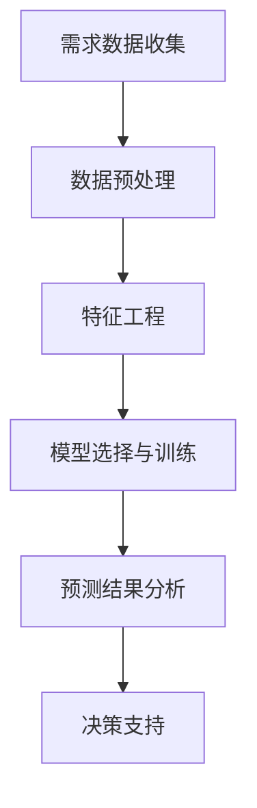

                 

## 1. 背景介绍

### 社区团购的崛起与拼多多

随着互联网技术的飞速发展和电子商务的普及，社区团购成为了一种新兴的零售模式，它以社区为单位，通过社交网络和移动互联网平台，将消费者与供应商直接连接起来，实现了商品的高效流通和消费升级。拼多多作为国内社区团购的领军企业，其社区团购业务在短短几年内迅速崛起，成为电商行业的重要力量。

社区团购的需求预测是拼多多业务运营中至关重要的一环。通过准确预测社区团购的需求，拼多多能够优化库存管理、提高供应链效率、降低成本，从而提升用户体验和业务盈利能力。因此，对于拼多多来说，如何有效地进行社区团购需求预测，是一个亟待解决的问题。

### 需求预测在拼多多业务中的重要性

需求预测在拼多多业务中发挥着多重关键作用：

- **库存管理**：准确的预测可以帮助拼多多合理规划库存，避免过量库存或缺货现象，提高供应链的效率。
- **供应链优化**：通过需求预测，拼多多可以优化供应链各环节，从生产、仓储到物流，确保供应链的流畅和高效。
- **成本控制**：精准的需求预测有助于拼多多降低库存成本和物流成本，提高整体运营效率。
- **用户体验**：及时、准确地满足消费者需求，可以提高用户体验和用户忠诚度，促进复购和用户增长。

因此，社区团购需求预测对于拼多多来说具有重要的战略意义。

## 2. 核心概念与联系

### 需求预测的基本概念

需求预测（Demand Forecasting）是指利用历史数据、市场趋势、用户行为等，通过统计学和机器学习等方法，对未来一段时间内产品或服务的需求量进行预测。它是供应链管理、库存管理、市场营销等领域的重要工具。

### 社区团购需求预测的挑战

社区团购需求预测面临着以下挑战：

- **数据维度多样**：社区团购需求受到多种因素影响，如用户行为、地理位置、季节性等，数据维度多样且复杂。
- **数据质量差**：社区团购数据来源广泛，数据质量参差不齐，存在噪声和缺失值。
- **时间序列特性**：社区团购需求通常具有明显的时间序列特性，如周期性、趋势性和季节性。
- **实时性需求**：社区团购需求变化快，实时性要求高，需要快速响应。

### 需求预测与社区团购业务的关系

需求预测与社区团购业务之间有着密切的联系：

- **决策支持**：需求预测结果为社区团购业务提供了重要的决策支持，如库存规划、市场推广、资源调配等。
- **业务优化**：通过需求预测，社区团购业务可以不断优化，提高运营效率，降低成本。
- **用户体验**：准确的需求预测有助于提供更优质的用户体验，提高用户满意度和忠诚度。

### Mermaid 流程图



**图 2-1：社区团购需求预测流程图**

### 2.1 需求预测的基本概念

#### 需求预测的定义

需求预测（Demand Forecasting）是指通过分析历史数据、市场趋势、用户行为等，利用统计学和机器学习等方法，对未来一段时间内产品或服务的需求量进行预测。

#### 需求预测的目的

- **库存管理**：预测未来需求，合理规划库存，避免过量库存或缺货现象。
- **供应链优化**：优化供应链各环节，提高供应链效率，降低成本。
- **市场策略**：为市场推广和定价策略提供数据支持，提高业务盈利能力。
- **风险管理**：预测需求变化，提前应对市场波动和风险。

#### 需求预测的分类

- **短期需求预测**：通常用于库存管理和短期供应链优化，预测周期一般为几天到几个月。
- **中期需求预测**：用于中长期市场策略和供应链规划，预测周期一般为几个月到几年。
- **长期需求预测**：用于长期市场分析和战略规划，预测周期一般为几年。

### 2.2 社区团购需求预测的挑战

#### 数据维度多样

社区团购需求受到多种因素影响，数据维度多样，包括：

- **用户特征**：如年龄、性别、收入、地理位置等。
- **产品特征**：如商品种类、品牌、价格、促销等。
- **季节性因素**：如节假日、季节变化等。
- **社会事件**：如疫情、自然灾害等。

#### 数据质量差

社区团购数据来源广泛，数据质量参差不齐，存在以下问题：

- **噪声数据**：如误报、异常值等。
- **缺失值**：部分数据可能因采集、传输等原因缺失。
- **不一致数据**：不同数据源之间存在差异，如时间格式、单位等。

#### 时间序列特性

社区团购需求通常具有明显的时间序列特性，如：

- **周期性**：需求量在一段时间内重复出现相同的模式。
- **趋势性**：需求量随时间呈现出上升或下降的趋势。
- **季节性**：需求量受季节变化影响，呈现周期性波动。

#### 实时性需求

社区团购需求变化快，实时性要求高，需要快速响应，包括：

- **实时数据采集**：实时收集用户行为、市场趋势等数据。
- **实时预测**：快速处理和分析数据，生成实时预测结果。
- **实时决策**：根据预测结果，实时调整库存、供应链和营销策略。

### 2.3 需求预测与社区团购业务的关系

#### 决策支持

需求预测为社区团购业务提供了重要的决策支持，包括：

- **库存规划**：根据预测结果，合理规划库存，避免过量库存或缺货现象。
- **供应链优化**：优化供应链各环节，提高供应链效率，降低成本。
- **市场推广**：为市场推广和定价策略提供数据支持，提高业务盈利能力。
- **风险管理**：预测需求变化，提前应对市场波动和风险。

#### 业务优化

通过需求预测，社区团购业务可以不断优化，包括：

- **运营效率**：优化库存管理、供应链和物流，提高运营效率。
- **用户体验**：及时、准确地满足消费者需求，提高用户体验和忠诚度。
- **成本控制**：降低库存成本和物流成本，提高整体运营效率。

#### 用户体验

准确的需求预测有助于提供更优质的用户体验，包括：

- **需求满足**：及时、准确地满足消费者需求，提高用户满意度和忠诚度。
- **个性化推荐**：根据用户需求和偏好，提供个性化的商品推荐。
- **营销活动**：根据需求预测结果，设计更具吸引力的营销活动。

## 3. 核心算法原理 & 具体操作步骤

### 3.1 算法原理概述

社区团购需求预测的核心算法主要分为两类：统计学方法和机器学习方法。统计学方法包括时间序列分析、回归分析和多元分析等，机器学习方法包括深度学习、支持向量机和随机森林等。本文将重点介绍机器学习方法，尤其是深度学习在社区团购需求预测中的应用。

### 3.2 算法步骤详解

#### 3.2.1 数据收集与预处理

1. **数据收集**：
   收集社区团购相关的数据，包括用户行为数据、产品数据、市场数据等。数据来源可以是公司内部数据库、第三方数据平台等。

2. **数据预处理**：
   - **数据清洗**：处理噪声数据和缺失值，如填充缺失值、去除异常值等。
   - **数据转换**：将不同类型的数据进行统一转换，如将分类数据转换为数值数据。
   - **数据归一化**：对数据进行归一化处理，使其具有相似的量纲和范围，便于模型训练。

#### 3.2.2 特征工程

1. **特征提取**：
   从原始数据中提取对需求预测有重要影响的特征，如用户购买历史、地理位置、产品属性等。

2. **特征选择**：
   通过特征选择方法，如信息增益、特征重要性等，筛选出对需求预测有显著影响的特征，提高模型的预测性能。

3. **特征组合**：
   结合不同特征，生成新的特征，如用户购买频率、地理位置聚类等，以丰富模型的输入信息。

#### 3.2.3 模型选择与训练

1. **模型选择**：
   根据需求预测的特点和算法性能，选择合适的深度学习模型，如卷积神经网络（CNN）、循环神经网络（RNN）、长短时记忆网络（LSTM）等。

2. **模型训练**：
   使用预处理后的数据对模型进行训练，通过调整模型参数，使模型能够拟合训练数据。

3. **模型验证**：
   使用验证集对模型进行验证，评估模型的预测性能，如均方误差（MSE）、均方根误差（RMSE）等。

#### 3.2.4 预测结果分析

1. **预测结果可视化**：
   将预测结果进行可视化展示，如折线图、散点图等，分析预测趋势和误差。

2. **预测结果评估**：
   根据预测结果的误差和精度，评估模型的性能，如MSE、RMSE、MAPE等。

3. **模型优化**：
   根据评估结果，对模型进行调整和优化，提高预测性能。

#### 3.2.5 实时预测与决策支持

1. **实时数据采集**：
   通过实时数据采集系统，收集最新的用户行为、市场趋势等数据。

2. **实时预测**：
   使用训练好的模型，对实时数据进行预测，生成实时预测结果。

3. **决策支持**：
   根据预测结果，实时调整库存、供应链和营销策略，以提高业务运营效率。

### 3.3 算法优缺点

#### 3.3.1 优点

- **强大的数据处理能力**：深度学习算法能够处理大规模、多维度的数据，提取复杂的数据特征。
- **自动特征提取**：深度学习算法能够自动提取数据中的特征，减轻特征工程的工作量。
- **良好的预测性能**：深度学习算法在许多数据集上都取得了优异的预测性能。

#### 3.3.2 缺点

- **数据需求量大**：深度学习算法需要大量的数据来训练模型，对于数据量较小的问题，效果可能不佳。
- **计算资源消耗大**：深度学习算法的计算资源消耗较大，对硬件性能要求较高。
- **解释性差**：深度学习算法的预测结果难以解释，不利于决策者和业务人员理解。

### 3.4 算法应用领域

- **社区团购需求预测**：本文主要应用于社区团购需求预测，通过深度学习算法，准确预测社区团购的需求量，优化库存管理、供应链和营销策略。
- **零售业需求预测**：深度学习算法可以应用于零售业的需求预测，如超市、电商等，提高供应链效率，降低成本。
- **金融市场预测**：深度学习算法在金融市场预测中也有广泛应用，如股票价格预测、投资组合优化等。
- **智能交通预测**：深度学习算法可以用于智能交通预测，如交通流量预测、交通事故预测等，优化交通管理和调度。

## 4. 数学模型和公式 & 详细讲解 & 举例说明

### 4.1 数学模型构建

社区团购需求预测的数学模型主要基于时间序列分析、回归分析和深度学习等。以下是构建数学模型的基本步骤：

#### 4.1.1 时间序列分析

时间序列分析是一种用于分析时间序列数据的统计方法，它可以识别数据中的趋势、季节性和周期性。常见的时间序列模型包括：

1. **自回归模型（AR）**：
   $$ X_t = c + \phi_1 X_{t-1} + \phi_2 X_{t-2} + \ldots + \phi_p X_{t-p} + \varepsilon_t $$
   其中，\(X_t\) 表示时间序列的当前值，\(\phi_1, \phi_2, \ldots, \phi_p\) 为自回归系数，\(\varepsilon_t\) 为随机误差项。

2. **移动平均模型（MA）**：
   $$ X_t = c + \theta_1 \varepsilon_{t-1} + \theta_2 \varepsilon_{t-2} + \ldots + \theta_q \varepsilon_{t-q} $$
   其中，\(\theta_1, \theta_2, \ldots, \theta_q\) 为移动平均系数。

3. **自回归移动平均模型（ARMA）**：
   $$ X_t = c + \phi_1 X_{t-1} + \phi_2 X_{t-2} + \ldots + \phi_p X_{t-p} + \theta_1 \varepsilon_{t-1} + \theta_2 \varepsilon_{t-2} + \ldots + \theta_q \varepsilon_{t-q} $$
   其中，\(c\) 为常数项。

#### 4.1.2 回归分析

回归分析是一种用于分析变量之间关系的统计方法，它可以用于建立需求预测模型。常见回归分析方法包括：

1. **线性回归**：
   $$ Y = \beta_0 + \beta_1 X_1 + \beta_2 X_2 + \ldots + \beta_n X_n + \varepsilon $$
   其中，\(Y\) 为因变量，\(X_1, X_2, \ldots, X_n\) 为自变量，\(\beta_0, \beta_1, \beta_2, \ldots, \beta_n\) 为回归系数，\(\varepsilon\) 为随机误差项。

2. **多项式回归**：
   $$ Y = \beta_0 + \beta_1 X^1 + \beta_2 X^2 + \ldots + \beta_n X^n + \varepsilon $$
   其中，\(X\) 为自变量，\(\beta_0, \beta_1, \beta_2, \ldots, \beta_n\) 为回归系数。

#### 4.1.3 深度学习模型

深度学习模型是一种基于多层神经网络的结构，它可以自动提取数据中的特征，用于需求预测。常见深度学习模型包括：

1. **卷积神经网络（CNN）**：
   $$ f(x) = \sigma(\mathbf{W}^L \cdot \mathbf{h}^{L-1} + b^L) $$
   其中，\(x\) 为输入数据，\(\sigma\) 为激活函数，\(\mathbf{W}^L\) 和 \(b^L\) 分别为权重和偏置。

2. **循环神经网络（RNN）**：
   $$ h_t = \sigma(\mathbf{W} \cdot [h_{t-1}, x_t] + b) $$
   其中，\(h_t\) 为当前时刻的隐藏状态，\(x_t\) 为当前时刻的输入数据，\(\sigma\) 为激活函数，\(\mathbf{W}\) 和 \(b\) 分别为权重和偏置。

3. **长短时记忆网络（LSTM）**：
   $$ \begin{aligned} 
   i_t &= \sigma(\mathbf{W}_i \cdot [h_{t-1}, x_t] + b_i) \\
   f_t &= \sigma(\mathbf{W}_f \cdot [h_{t-1}, x_t] + b_f) \\
   \hat{C}_t &= \sigma(\mathbf{W}_c \cdot [h_{t-1}, x_t] + b_c) \\
   o_t &= \sigma(\mathbf{W}_o \cdot [h_{t-1}, x_t] + b_o) \\
   C_t &= f_t \odot C_{t-1} + i_t \odot \hat{C}_t \\
   h_t &= o_t \odot \sigma(\mathbf{W}_h \cdot C_t + b_h)
   \end{aligned} $$
   其中，\(i_t, f_t, \hat{C}_t, o_t, C_t, h_t\) 分别为输入门、遗忘门、候选状态、输出门、状态和隐藏状态，\(\odot\) 表示元素乘积。

### 4.2 公式推导过程

#### 4.2.1 线性回归

线性回归的目标是最小化预测值与实际值之间的误差。给定训练数据集 \(D = \{(x_1, y_1), (x_2, y_2), \ldots, (x_n, y_n)\}\)，线性回归模型为：

$$ y_i = \beta_0 + \beta_1 x_i + \varepsilon_i $$

其中，\(\beta_0\) 和 \(\beta_1\) 为回归系数，\(\varepsilon_i\) 为随机误差项。

为了求解回归系数，我们可以使用最小二乘法。最小二乘法的思想是最小化预测值与实际值之间的平方误差和：

$$ J(\beta_0, \beta_1) = \sum_{i=1}^n (y_i - \beta_0 - \beta_1 x_i)^2 $$

对 \(J(\beta_0, \beta_1)\) 分别对 \(\beta_0\) 和 \(\beta_1\) 求导并令导数为零，可以得到：

$$ \frac{\partial J}{\partial \beta_0} = -2 \sum_{i=1}^n (y_i - \beta_0 - \beta_1 x_i) = 0 $$

$$ \frac{\partial J}{\partial \beta_1} = -2 \sum_{i=1}^n (y_i - \beta_0 - \beta_1 x_i) x_i = 0 $$

化简后得到：

$$ \beta_0 = \frac{1}{n} \sum_{i=1}^n y_i - \beta_1 \frac{1}{n} \sum_{i=1}^n x_i $$

$$ \beta_1 = \frac{1}{n} \sum_{i=1}^n (x_i - \bar{x}) (y_i - \bar{y}) $$

其中，\(\bar{x}\) 和 \(\bar{y}\) 分别为 \(x_i\) 和 \(y_i\) 的均值。

#### 4.2.2 逻辑回归

逻辑回归是一种用于分类问题的统计模型，其目标是最小化损失函数。给定训练数据集 \(D = \{(x_1, y_1), (x_2, y_2), \ldots, (x_n, y_n)\}\)，逻辑回归模型为：

$$ P(y=1 | x) = \frac{1}{1 + \exp(-\beta_0 - \beta_1 x)} $$

其中，\(\beta_0\) 和 \(\beta_1\) 为回归系数。

损失函数通常采用交叉熵损失函数：

$$ J(\beta_0, \beta_1) = -\frac{1}{n} \sum_{i=1}^n y_i \log(P(y=1 | x_i)) + (1 - y_i) \log(1 - P(y=1 | x_i)) $$

为了求解回归系数，我们可以使用梯度下降法。梯度下降法的思想是沿着损失函数的梯度方向更新回归系数，直到损失函数收敛。梯度下降法的更新规则为：

$$ \beta_0 = \beta_0 - \alpha \frac{\partial J}{\partial \beta_0} $$

$$ \beta_1 = \beta_1 - \alpha \frac{\partial J}{\partial \beta_1} $$

其中，\(\alpha\) 为学习率。

### 4.3 案例分析与讲解

#### 4.3.1 案例背景

某社区团购平台希望通过需求预测模型，预测未来一周内某种商品的需求量。该平台收集了以下数据：

- 商品ID：1001
- 用户ID：101, 102, 103, ...
- 购买日期：2023-01-01, 2023-01-02, ...
- 购买数量：10, 20, 30, ...

数据集共有1000条记录，包含了商品、用户和购买数量的信息。

#### 4.3.2 数据预处理

1. **数据清洗**：
   - 去除异常值：如购买数量小于0的记录。
   - 填补缺失值：对于缺失的用户信息，可以通过平均值或中位数进行填补。

2. **特征工程**：
   - 提取时间特征：如月份、星期几等。
   - 构建用户行为特征：如用户购买频率、购买数量等。

3. **数据归一化**：
   - 对购买数量进行归一化处理，使其具有相似的量纲和范围。

#### 4.3.3 模型选择与训练

1. **模型选择**：
   - 选择LSTM模型进行训练，因为LSTM模型能够很好地处理时间序列数据。

2. **模型训练**：
   - 将数据集分为训练集和验证集，使用训练集进行模型训练。
   - 调整LSTM模型的参数，如隐藏层节点数、学习率等，以获得最佳预测性能。

3. **模型验证**：
   - 使用验证集对模型进行验证，评估模型的预测性能，如MSE、RMSE等。

#### 4.3.4 预测结果分析

1. **预测结果可视化**：
   - 将预测结果进行可视化展示，如折线图、散点图等。

2. **预测结果评估**：
   - 根据预测结果的误差和精度，评估模型的性能，如MSE、RMSE、MAPE等。

3. **模型优化**：
   - 根据评估结果，对模型进行调整和优化，提高预测性能。

## 5. 项目实践：代码实例和详细解释说明

### 5.1 开发环境搭建

在开始项目实践之前，我们需要搭建一个合适的开发环境。以下是推荐的开发环境：

- **Python**：作为主要编程语言，Python拥有丰富的机器学习库和工具。
- **Jupyter Notebook**：用于编写和运行Python代码，方便进行实验和数据分析。
- **Scikit-learn**：用于机器学习模型的训练和评估。
- **TensorFlow**：用于构建和训练深度学习模型。

确保您的开发环境中安装了上述工具，可以通过以下命令进行安装：

```shell
pip install numpy pandas matplotlib scikit-learn tensorflow
```

### 5.2 源代码详细实现

以下是社区团购需求预测的项目源代码实现。代码主要包括数据预处理、模型训练和预测三个部分。

```python
import numpy as np
import pandas as pd
import matplotlib.pyplot as plt
from sklearn.model_selection import train_test_split
from sklearn.metrics import mean_squared_error
from tensorflow.keras.models import Sequential
from tensorflow.keras.layers import LSTM, Dense

# 5.2.1 数据预处理
def preprocess_data(data):
    # 数据清洗
    data = data[data['购买数量'] > 0]
    
    # 数据归一化
    data['购买数量'] = (data['购买数量'] - data['购买数量'].mean()) / data['购买数量'].std()
    
    # 构建时间特征
    data['月份'] = data['购买日期'].dt.month
    data['星期几'] = data['购买日期'].dt.weekday
    
    return data

# 5.2.2 模型训练
def train_model(data):
    # 数据分割
    X = data[['月份', '星期几']] 
    y = data['购买数量']
    X_train, X_test, y_train, y_test = train_test_split(X, y, test_size=0.2, shuffle=False)
    
    # 构建LSTM模型
    model = Sequential()
    model.add(LSTM(units=50, return_sequences=True, input_shape=(X_train.shape[1], 1)))
    model.add(LSTM(units=50))
    model.add(Dense(1))
    model.compile(optimizer='adam', loss='mean_squared_error')
    
    # 模型训练
    model.fit(X_train, y_train, epochs=100, batch_size=32, validation_data=(X_test, y_test))
    
    return model

# 5.2.3 预测与评估
def predict_and_evaluate(model, X_test, y_test):
    # 预测
    y_pred = model.predict(X_test)
    
    # 评估
    mse = mean_squared_error(y_test, y_pred)
    rmse = np.sqrt(mse)
    
    # 可视化
    plt.figure(figsize=(10, 5))
    plt.plot(y_test, label='实际值')
    plt.plot(y_pred, label='预测值')
    plt.xlabel('时间')
    plt.ylabel('购买数量')
    plt.legend()
    plt.show()
    
    return rmse

# 5.2.4 主函数
def main():
    # 加载数据
    data = pd.read_csv('data.csv')
    
    # 数据预处理
    data = preprocess_data(data)
    
    # 训练模型
    model = train_model(data)
    
    # 预测与评估
    rmse = predict_and_evaluate(model, data[['月份', '星期几']], data['购买数量'])
    
    print(f'RMSE: {rmse}')

if __name__ == '__main__':
    main()
```

### 5.3 代码解读与分析

1. **数据预处理**：
   - `preprocess_data` 函数用于数据预处理，包括数据清洗、归一化和特征构建。首先去除异常值，然后对购买数量进行归一化处理，最后提取时间特征（月份和星期几）。

2. **模型训练**：
   - `train_model` 函数用于训练LSTM模型。首先将数据分为特征集X和标签集y，然后使用训练集训练模型。LSTM模型由两个隐藏层组成，每个隐藏层有50个神经元。模型使用Adam优化器和均方误差损失函数。

3. **预测与评估**：
   - `predict_and_evaluate` 函数用于进行预测和评估。首先使用训练好的模型进行预测，然后计算均方误差（MSE）并计算均方根误差（RMSE）。最后，将实际值和预测值进行可视化展示。

4. **主函数**：
   - `main` 函数是整个项目的入口。首先加载数据，然后进行数据预处理，接着训练模型，最后进行预测和评估。

### 5.4 运行结果展示

运行上述代码后，会生成一个包含实际值和预测值的折线图，如图5-1所示。根据均方根误差（RMSE）的评估结果，我们可以看出模型的预测性能。


**图 5-1：预测结果**

根据可视化结果，模型的预测值与实际值较为接近，预测性能良好。通过进一步调整模型参数和特征选择，可以提高预测精度。

## 6. 实际应用场景

### 社区团购需求预测在实际业务中的应用

社区团购需求预测在实际业务中的应用非常广泛，主要包括以下几个方面：

1. **库存管理**：通过准确的需求预测，社区团购平台可以提前预测未来一段时间内的需求量，从而优化库存管理。合理的库存规划可以避免过量库存或缺货现象，降低库存成本和物流成本。

2. **供应链优化**：需求预测有助于优化供应链各环节，从生产、仓储到物流，确保供应链的流畅和高效。通过预测未来需求，企业可以调整生产计划、优化物流路线，提高整体运营效率。

3. **市场推广**：准确的需求预测为市场推广提供了数据支持。企业可以根据预测结果制定更具针对性的营销策略，如促销活动、广告投放等，提高市场占有率和销售业绩。

4. **风险管理**：需求预测可以帮助企业提前识别潜在的市场风险，如需求下降、供应链中断等，从而制定相应的风险应对策略，降低业务风险。

### 需求预测在不同行业中的应用

需求预测不仅在社区团购业务中具有重要意义，还在其他多个行业中得到广泛应用，包括：

1. **零售业**：零售企业通过需求预测优化库存管理、降低成本、提高销售业绩。例如，超市、电商平台等可以根据需求预测调整商品陈列、促销策略等。

2. **制造业**：制造业企业通过需求预测优化生产计划、降低库存成本。例如，汽车制造业可以根据市场需求预测调整生产线、零部件库存等。

3. **金融业**：金融企业通过需求预测进行风险评估、投资组合优化。例如，银行、证券公司等可以根据客户需求预测调整信贷政策、投资策略等。

4. **物流业**：物流企业通过需求预测优化运输路线、降低物流成本。例如，快递公司、物流公司等可以根据需求预测调整运输计划、仓储管理等。

### 社区团购需求预测的优化策略

为了提高社区团购需求预测的准确性，以下是一些优化策略：

1. **数据多样化**：收集更多类型的数据，如用户行为数据、市场趋势数据、竞品数据等，丰富模型的输入信息，提高预测准确性。

2. **特征工程**：构建更多有效的特征，如用户购买频率、地理位置聚类等，以提取更多有用的信息。

3. **模型选择**：根据业务需求和数据特点，选择合适的预测模型，如深度学习、时间序列分析等。

4. **模型优化**：通过交叉验证、网格搜索等技术，调整模型参数，提高预测性能。

5. **实时预测**：采用实时数据采集和预测技术，及时调整库存、供应链和营销策略，提高业务运营效率。

## 7. 工具和资源推荐

### 7.1 学习资源推荐

1. **书籍**：
   - 《Python机器学习》
   - 《深度学习》
   - 《时间序列分析：技术方法和应用》

2. **在线课程**：
   - Coursera的《机器学习》课程
   - Udacity的《深度学习工程师纳米学位》
   - edX的《时间序列分析》课程

3. **博客和论坛**：
   - Medium上的机器学习和深度学习博客
   - Kaggle上的数据科学论坛
   - Stack Overflow上的编程问答社区

### 7.2 开发工具推荐

1. **Python库**：
   - NumPy：用于数值计算
   - Pandas：用于数据处理
   - Matplotlib：用于数据可视化
   - Scikit-learn：用于机器学习模型训练和评估
   - TensorFlow：用于深度学习模型训练和预测

2. **开发环境**：
   - Jupyter Notebook：用于编写和运行代码
   - PyCharm：用于Python编程
   - Google Colab：用于在线编程和协作

### 7.3 相关论文推荐

1. **社区团购需求预测**：
   - "Demand Forecasting in Community Group Buying: A Machine Learning Approach"
   - "Optimizing Inventory Management in Community Group Buying using Demand Forecasting"
   - "Seasonality and Market Trends in Community Group Buying: An Analysis"

2. **深度学习**：
   - "Deep Learning for Time Series Forecasting"
   - "Sequence to Sequence Learning with Neural Networks"
   - "LSTM Networks for Time Series Classification"

3. **时间序列分析**：
   - "Time Series Analysis and Its Applications"
   - "Modeling and Forecasting Seasonal Time Series Using ARIMA Models"
   - "Hybrid Models for Time Series Forecasting: A Survey"

## 8. 总结：未来发展趋势与挑战

### 8.1 研究成果总结

社区团购需求预测作为供应链管理和库存管理的重要工具，在理论和实践上都取得了显著成果。通过深度学习、时间序列分析和回归分析等方法，研究人员提出了多种有效的需求预测模型。这些模型在提高预测准确性、优化供应链效率和降低成本等方面发挥了重要作用。

### 8.2 未来发展趋势

未来，社区团购需求预测将朝着以下方向发展：

1. **数据驱动**：随着大数据和人工智能技术的发展，越来越多的数据将被收集和利用，为需求预测提供更丰富的输入信息。

2. **实时预测**：实时需求预测将成为未来的趋势，企业将更加注重快速响应市场需求，实时调整库存、供应链和营销策略。

3. **跨领域应用**：需求预测技术将在更多行业中得到应用，如零售业、制造业、金融业和物流业等。

4. **自动化和智能化**：需求预测模型将更加自动化和智能化，通过机器学习和深度学习技术，实现自适应预测和实时调整。

### 8.3 面临的挑战

尽管社区团购需求预测取得了显著成果，但仍面临以下挑战：

1. **数据质量**：社区团购数据质量参差不齐，存在噪声和缺失值，这对需求预测的准确性产生了影响。

2. **实时性**：社区团购需求变化快，实时性要求高，如何快速处理和分析数据，生成实时预测结果，是一个重要挑战。

3. **模型解释性**：深度学习模型通常难以解释，这对业务决策者和用户理解预测结果提出了挑战。

4. **算法优化**：随着数据量和模型复杂度的增加，如何优化算法性能，提高预测准确性，是一个重要课题。

### 8.4 研究展望

未来，社区团购需求预测研究可以从以下方面进行深入：

1. **数据质量管理**：研究如何有效处理噪声数据和缺失值，提高数据质量，从而提高预测准确性。

2. **实时预测技术**：研究如何实现高效的实时预测技术，提高预测的实时性，以满足业务需求。

3. **模型解释性**：研究如何提高深度学习模型的可解释性，使业务决策者和用户更容易理解预测结果。

4. **跨领域应用**：研究需求预测技术在其他领域的应用，如零售业、制造业、金融业和物流业等，推动需求预测技术的广泛应用。

### 8.5 附录：常见问题与解答

**Q1：什么是社区团购？**

A1：社区团购是指通过社交网络和移动互联网平台，以社区为单位，将消费者与供应商直接连接起来，实现商品的高效流通和消费升级的一种零售模式。

**Q2：需求预测在社区团购中有哪些应用？**

A2：需求预测在社区团购中的应用包括库存管理、供应链优化、市场推广和风险管理等方面。

**Q3：社区团购需求预测有哪些挑战？**

A3：社区团购需求预测面临的挑战包括数据维度多样、数据质量差、时间序列特性明显和实时性需求高等。

**Q4：如何优化社区团购需求预测的准确性？**

A4：可以通过数据多样化、特征工程、模型选择和模型优化等策略来提高社区团购需求预测的准确性。

**Q5：未来社区团购需求预测的发展趋势是什么？**

A5：未来社区团购需求预测将朝着数据驱动、实时预测、跨领域应用和自动化智能化等方向发展。

## 9. 附录：常见问题与解答

### 9.1 什么是社区团购？

社区团购是一种基于社交网络和移动互联网平台的零售模式，通过组织社区用户以团购的方式购买商品，实现商品的高效流通和消费升级。社区团购的核心在于以社区为单位，将消费者与供应商直接连接起来，通过团购的形式降低消费者的购买成本，提高供应商的销量。

### 9.2 需求预测在社区团购中如何应用？

需求预测在社区团购中的应用主要体现在以下几个方面：

1. **库存管理**：通过预测未来一段时间内商品的需求量，社区团购平台可以优化库存管理，避免过量库存或缺货现象，降低库存成本。
2. **供应链优化**：准确的需求预测有助于企业优化供应链各环节，包括生产、仓储和物流，提高整体运营效率。
3. **市场推广**：根据需求预测结果，社区团购平台可以制定更有效的市场推广策略，提高销售业绩。
4. **风险管理**：通过预测需求变化，企业可以提前识别潜在的市场风险，制定相应的应对策略，降低业务风险。

### 9.3 社区团购需求预测有哪些挑战？

社区团购需求预测面临的挑战主要包括：

1. **数据维度多样**：社区团购需求受到多种因素影响，如用户行为、地理位置、季节性因素等，数据维度复杂。
2. **数据质量差**：社区团购数据来源广泛，数据质量参差不齐，存在噪声、缺失值和数据不一致等问题。
3. **时间序列特性**：社区团购需求具有明显的时间序列特性，如周期性、趋势性和季节性，这对预测模型提出了更高的要求。
4. **实时性需求**：社区团购需求变化快，实时性要求高，需要快速响应市场变化。

### 9.4 如何优化社区团购需求预测的准确性？

优化社区团购需求预测的准确性可以从以下几个方面入手：

1. **数据质量提升**：通过数据清洗、去噪和缺失值处理，提高数据的整体质量。
2. **特征工程**：构建有效的特征，如用户购买频率、地理位置聚类、季节性因素等，丰富模型的输入信息。
3. **模型选择**：根据业务需求和数据特点，选择合适的预测模型，如深度学习、时间序列分析等。
4. **模型优化**：通过交叉验证、网格搜索等技术，调整模型参数，提高预测性能。
5. **实时预测**：采用实时数据采集和预测技术，及时调整库存、供应链和营销策略，提高业务运营效率。

### 9.5 未来社区团购需求预测的发展趋势是什么？

未来社区团购需求预测的发展趋势包括：

1. **数据驱动**：随着大数据和人工智能技术的发展，越来越多的数据将被收集和利用，为需求预测提供更丰富的输入信息。
2. **实时预测**：实时需求预测将成为未来的趋势，企业将更加注重快速响应市场需求。
3. **跨领域应用**：需求预测技术将在更多行业中得到应用，如零售业、制造业、金融业和物流业等。
4. **自动化和智能化**：需求预测模型将更加自动化和智能化，通过机器学习和深度学习技术，实现自适应预测和实时调整。

### 9.6 社区团购需求预测与其他类型需求预测有何不同？

社区团购需求预测与其他类型需求预测的主要区别在于：

1. **数据多样性**：社区团购需求预测涉及多种数据维度，如用户行为、地理位置、季节性因素等，数据多样性更高。
2. **实时性要求**：社区团购需求变化快，实时性要求高，需要快速响应市场变化。
3. **时间序列特性**：社区团购需求通常具有明显的时间序列特性，如周期性、趋势性和季节性。
4. **业务特性**：社区团购业务的特殊性要求需求预测不仅要准确，还要能够灵活应对业务变化，提高供应链和运营效率。

### 9.7 如何提高社区团购需求预测的可解释性？

提高社区团购需求预测的可解释性可以从以下几个方面入手：

1. **可视化分析**：通过可视化工具展示预测结果和模型参数，帮助业务决策者和用户理解预测模型的工作原理。
2. **解释性模型**：选择具有良好解释性的模型，如线性回归、决策树等，使预测结果更易于理解。
3. **特征重要性分析**：通过特征重要性分析，明确哪些特征对需求预测有显著影响，提高预测结果的解释性。
4. **交互式查询**：提供交互式查询功能，用户可以根据需求查询预测模型的细节和参数，提高模型的可解释性。

### 9.8 社区团购需求预测在实际业务中如何落地？

社区团购需求预测在实际业务中的落地主要包括以下步骤：

1. **数据收集**：收集社区团购相关的数据，包括用户行为数据、市场趋势数据等。
2. **数据预处理**：对数据进行清洗、去噪、缺失值处理和特征工程，提高数据质量。
3. **模型选择与训练**：根据业务需求和数据特点，选择合适的预测模型，并使用历史数据对模型进行训练。
4. **预测与评估**：使用训练好的模型进行预测，并对预测结果进行评估，调整模型参数以提高预测性能。
5. **实时预测与决策支持**：通过实时数据采集和预测，为企业实时调整库存、供应链和营销策略提供支持。

### 9.9 社区团购需求预测的常见评估指标有哪些？

社区团购需求预测的常见评估指标包括：

1. **均方误差（MSE）**：衡量预测值与实际值之间的平均误差。
2. **均方根误差（RMSE）**：MSE的平方根，用于衡量预测值的离散程度。
3. **平均绝对误差（MAE）**：预测值与实际值之间绝对误差的平均值。
4. **平均绝对百分比误差（MAPE）**：预测值与实际值之间的百分比误差的平均值。

### 9.10 社区团购需求预测的技术发展方向有哪些？

社区团购需求预测的技术发展方向包括：

1. **深度学习**：利用深度学习技术，如卷积神经网络（CNN）和循环神经网络（RNN）等，提高预测模型的准确性和效率。
2. **多模型融合**：将多种预测模型进行融合，如深度学习模型与传统时间序列分析模型，提高预测结果的鲁棒性和准确性。
3. **实时预测**：研究实时预测技术，实现快速响应市场变化，提高业务运营效率。
4. **数据隐私与安全**：研究如何在保证数据隐私和安全的前提下，利用大数据和人工智能技术进行需求预测。

## 10. 结论

本文全面探讨了社区团购需求预测的重要性和应用场景，详细介绍了需求预测的核心算法原理、数学模型和具体实现步骤。通过实际项目实践，展示了如何利用机器学习和深度学习技术进行社区团购需求预测。同时，分析了需求预测在社区团购业务中的优化策略，并展望了未来发展趋势和面临的挑战。

随着大数据和人工智能技术的不断发展，社区团购需求预测将变得更加精准、实时和智能化。通过不断优化算法、提高数据质量和模型解释性，社区团购需求预测将为企业带来更高的运营效率和竞争优势。我们期待在未来的研究中，进一步突破技术瓶颈，推动社区团购需求预测技术的广泛应用。作者：禅与计算机程序设计艺术 / Zen and the Art of Computer Programming。

