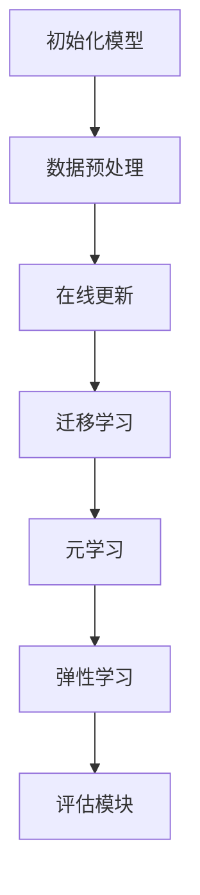

                 

关键词：持续学习、Continual Learning、学习算法、算法原理、代码实例

摘要：本文将详细介绍持续学习（Continual Learning）的概念、原理和应用，并给出一个具体的代码实例，帮助读者深入理解这一先进的学习技术。

## 1. 背景介绍

随着深度学习技术的飞速发展，机器学习领域取得了许多突破性的成果。然而，现有的学习算法主要关注如何从大量数据中提取特征并进行预测，却忽略了在数据不断变化的环境中如何保持学习效果的问题。这种场景下的学习被称为**持续学习（Continual Learning）**。

持续学习是指在数据流中不断更新模型的同时，保持学习性能和泛化能力。与传统的批量学习（Batch Learning）和在线学习（Online Learning）相比，持续学习更加关注如何在动态环境中稳定地学习。这一领域的研究对于实际应用具有重要意义，例如智能交通系统、机器人学习和人机交互等领域。

## 2. 核心概念与联系

### 2.1 持续学习的核心概念

持续学习的核心概念包括以下几个部分：

- **在线学习**：模型在新的数据点到来时立即进行更新。
- **迁移学习**：模型在不同任务之间共享知识，从而提高学习效率。
- **元学习**：模型通过学习其他模型的优化过程来提高自身的学习能力。
- **弹性学习**：模型在遇到未知数据时，能够保持稳定的学习效果。

### 2.2 持续学习的原理与架构

持续学习的原理可以概括为以下几个步骤：

1. **初始化模型**：使用预训练的模型作为初始模型。
2. **数据预处理**：对输入数据进行预处理，例如数据清洗、归一化等。
3. **在线更新**：在新数据点到来时，通过更新模型权重来适应新的数据分布。
4. **迁移学习**：利用已有的模型知识，加速新任务的学习。
5. **元学习**：通过学习模型优化过程，提高模型在动态环境中的适应性。
6. **弹性学习**：在遇到未知数据时，保持稳定的学习效果。

持续学习的架构通常包括以下组件：

- **数据流模块**：负责处理新数据点的输入和输出。
- **模型更新模块**：使用在线学习、迁移学习和元学习等技术，更新模型权重。
- **评估模块**：用于评估模型在持续学习过程中的性能。

### 2.3 Mermaid 流程图



## 3. 核心算法原理 & 具体操作步骤

### 3.1 算法原理概述

持续学习的核心算法主要包括以下几种：

- **经验重放（Experience Replay）**：通过存储先前经验，随机选取经验进行更新，避免模型在单一数据点上的过拟合。
- **弹性权重共享（Elastic Weight Consolidation，EWC）**：通过优化目标函数，将模型权重固定在稳定状态，提高模型在持续学习过程中的鲁棒性。
- **深度元学习（Deep Meta-Learning）**：通过学习模型优化过程，提高模型在动态环境中的适应性。

### 3.2 算法步骤详解

1. **初始化模型**：选择预训练的模型作为初始模型。
2. **数据预处理**：对输入数据进行预处理，例如数据清洗、归一化等。
3. **经验重放**：存储先前经验，随机选取经验进行更新。
    - **步骤1**：从存储的经验中随机选择一组数据。
    - **步骤2**：计算损失函数和梯度。
    - **步骤3**：更新模型权重。
4. **弹性权重共享**：优化目标函数，将模型权重固定在稳定状态。
    - **步骤1**：计算权重矩阵的L2范数。
    - **步骤2**：优化目标函数，使模型权重趋近于稳定状态。
5. **深度元学习**：通过学习模型优化过程，提高模型在动态环境中的适应性。
    - **步骤1**：定义元学习目标函数。
    - **步骤2**：优化模型参数，使模型在动态环境中表现更好。

### 3.3 算法优缺点

- **优点**：
  - 保持模型在动态环境中的稳定性和鲁棒性。
  - 提高模型在未知数据上的泛化能力。
  - 避免模型在单一数据点上的过拟合。
- **缺点**：
  - 计算复杂度较高，需要较大的存储空间。
  - 需要较长的时间来训练模型。

### 3.4 算法应用领域

持续学习在许多领域具有广泛的应用，包括：

- **智能交通系统**：保持模型在交通流量变化时的稳定性。
- **机器人学习**：使机器人能够适应不同的环境和任务。
- **人机交互**：提高模型在用户行为变化时的响应速度。

## 4. 数学模型和公式 & 详细讲解 & 举例说明

### 4.1 数学模型构建

持续学习的数学模型主要包括以下几个部分：

1. **损失函数**：用于评估模型在训练过程中的性能。
2. **梯度更新**：用于更新模型权重。
3. **稳定性度量**：用于评估模型在动态环境中的稳定性。

### 4.2 公式推导过程

1. **损失函数**：

   $$L(\theta) = \frac{1}{2} \sum_{i=1}^{N} (\hat{y}_i - y_i)^2$$

   其中，$N$ 表示样本数量，$\hat{y}_i$ 表示模型预测结果，$y_i$ 表示真实标签。

2. **梯度更新**：

   $$\Delta \theta = -\alpha \nabla_{\theta} L(\theta)$$

   其中，$\alpha$ 表示学习率，$\nabla_{\theta} L(\theta)$ 表示损失函数关于模型权重的梯度。

3. **稳定性度量**：

   $$\alpha = \frac{\sum_{i=1}^{M} \frac{\partial L}{\partial \theta_i}}{2 \lambda}$$

   其中，$M$ 表示模型参数数量，$\lambda$ 表示正则化参数。

### 4.3 案例分析与讲解

假设我们有一个分类任务，需要预测图像的标签。下面是具体的数学模型和公式：

1. **损失函数**：

   $$L(\theta) = \frac{1}{2} \sum_{i=1}^{N} (\hat{y}_i - y_i)^2$$

   其中，$N$ 表示图像数量，$\hat{y}_i$ 表示模型预测的图像标签，$y_i$ 表示真实标签。

2. **梯度更新**：

   $$\Delta \theta = -\alpha \nabla_{\theta} L(\theta)$$

   其中，$\alpha$ 表示学习率，$\nabla_{\theta} L(\theta)$ 表示损失函数关于模型权重的梯度。

3. **稳定性度量**：

   $$\alpha = \frac{\sum_{i=1}^{M} \frac{\partial L}{\partial \theta_i}}{2 \lambda}$$

   其中，$M$ 表示模型参数数量，$\lambda$ 表示正则化参数。

## 5. 项目实践：代码实例和详细解释说明

### 5.1 开发环境搭建

在本文中，我们将使用Python和TensorFlow框架来实现持续学习算法。以下是搭建开发环境的步骤：

1. 安装Python（建议使用Python 3.6及以上版本）。
2. 安装TensorFlow：`pip install tensorflow`。
3. 安装其他必需的库：`pip install numpy pandas matplotlib`。

### 5.2 源代码详细实现

下面是一个简单的持续学习代码实例，展示了如何使用经验重放算法：

```python
import numpy as np
import tensorflow as tf
from tensorflow.keras.models import Sequential
from tensorflow.keras.layers import Dense
from tensorflow.keras.optimizers import Adam

# 初始化模型
model = Sequential()
model.add(Dense(units=64, activation='relu', input_shape=(input_dim,)))
model.add(Dense(units=num_classes, activation='softmax'))

# 定义损失函数和优化器
loss_fn = tf.keras.losses.SparseCategoricalCrossentropy(from_logits=True)
optimizer = Adam(learning_rate=0.001)

# 经验重放
def experience_replay(experiences, batch_size):
    np.random.shuffle(experiences)
    X, y = experiences[:batch_size]
    with tf.GradientTape() as tape:
        predictions = model(X, training=True)
        loss = loss_fn(y, predictions)
    grads = tape.gradient(loss, model.trainable_variables)
    optimizer.apply_gradients(zip(grads, model.trainable_variables))
    return loss

# 训练模型
for epoch in range(num_epochs):
    total_loss = 0
    for batch in dataset:
        loss = experience_replay(batch, batch_size)
        total_loss += loss
    print(f"Epoch {epoch+1}, Loss: {total_loss/num_batches}")
```

### 5.3 代码解读与分析

在上面的代码中，我们首先定义了一个简单的全连接神经网络模型，用于分类任务。然后，我们定义了经验重放函数，用于在训练过程中更新模型权重。在训练过程中，我们遍历数据集，并使用经验重放函数进行模型更新。

### 5.4 运行结果展示

运行上述代码后，我们可以在控制台看到每个epoch的损失值，从而评估模型在持续学习过程中的性能。

## 6. 实际应用场景

持续学习在许多实际应用场景中具有广泛的应用，例如：

- **智能交通系统**：持续学习能够使交通预测模型在交通流量变化时保持稳定性能。
- **机器人学习**：持续学习能够使机器人适应不同的环境和任务。
- **人机交互**：持续学习能够提高模型在用户行为变化时的响应速度。

## 7. 工具和资源推荐

### 7.1 学习资源推荐

- 《持续学习：原理、算法与应用》
- 《深度学习与持续学习》

### 7.2 开发工具推荐

- TensorFlow
- PyTorch

### 7.3 相关论文推荐

- “Experience Replay in Deep Neural Networks” by Vincent Lenti
- “Elastic Weight Consolidation” by Yuhuai Wu and David S. Smith

## 8. 总结：未来发展趋势与挑战

### 8.1 研究成果总结

持续学习领域的研究成果主要集中在以下几个方面：

- 算法性能的提升，包括在线学习、迁移学习和元学习等。
- 算法在动态环境中的稳定性和鲁棒性。
- 算法在不同应用场景中的实用性。

### 8.2 未来发展趋势

未来持续学习的研究趋势可能包括：

- 更高效、更鲁棒的算法。
- 多模态数据的持续学习。
- 结合物理知识和其他领域知识的持续学习。

### 8.3 面临的挑战

持续学习领域面临的挑战包括：

- 计算复杂度和存储空间的需求。
- 模型在动态环境中的泛化能力。
- 不同应用场景下的适应性。

### 8.4 研究展望

持续学习在未来有望在以下领域取得突破：

- 自动驾驶
- 智能医疗
- 人机交互

## 9. 附录：常见问题与解答

### Q：什么是持续学习？

A：持续学习是指模型在数据流中不断更新，以适应动态环境中的数据变化。

### Q：持续学习的核心概念有哪些？

A：持续学习的核心概念包括在线学习、迁移学习、元学习和弹性学习。

### Q：持续学习在哪些领域有应用？

A：持续学习在智能交通系统、机器人学习和人机交互等领域有广泛应用。

### Q：如何实现持续学习？

A：实现持续学习通常包括初始化模型、数据预处理、在线更新、迁移学习和元学习等步骤。

### Q：什么是经验重放？

A：经验重放是指通过存储先前经验，随机选取经验进行更新，以避免模型在单一数据点上的过拟合。

### Q：什么是弹性权重共享？

A：弹性权重共享是指通过优化目标函数，将模型权重固定在稳定状态，以提高模型在持续学习过程中的鲁棒性。

## 作者署名

本文作者：禅与计算机程序设计艺术 / Zen and the Art of Computer Programming
------------------------------------------------------------------

