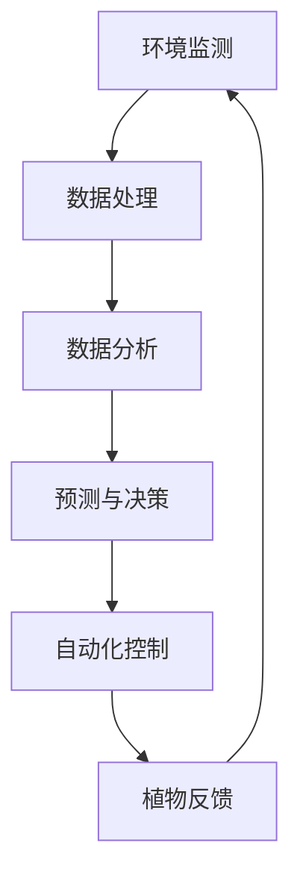

                 

关键词：人工智能，大模型，智能家居，园艺管理，深度学习，环境监测，自动化灌溉，数据分析。

> 摘要：本文探讨了AI大模型在智能家居园艺管理中的潜在应用。通过引入先进的深度学习技术和智能环境监测系统，AI大模型能够为园艺管理提供精确的数据分析、预测和自动化控制，从而优化植物生长条件，提升园艺效率。

## 1. 背景介绍

### 1.1 智能家居园艺管理的现状

随着科技的进步和人们对生活品质的追求，智能家居园艺管理正逐渐成为一种流行的生活方式。传统的园艺管理依赖于人工操作，不仅效率低下，而且容易出现管理不当的问题，如过度灌溉、养分不足等，这些都可能导致植物生长不良，甚至死亡。

### 1.2 AI在园艺管理中的应用

人工智能（AI）技术的迅猛发展为园艺管理带来了新的机遇。通过AI，特别是大模型技术，可以实现对植物生长环境的精确监测和智能调控，从而实现高效、精准的园艺管理。

### 1.3 大模型在AI中的应用

大模型是AI领域中的一种先进技术，它具有处理海量数据、发现复杂模式和生成高质量预测的能力。在智能家居园艺管理中，大模型可以用于处理植物生长的复杂数据，从而提供智能决策支持。

## 2. 核心概念与联系

### 2.1 大模型技术概述

大模型技术是指使用大规模神经网络架构来处理和解析数据，从而实现对复杂任务的自动学习。在AI领域，大模型已经成为自然语言处理、图像识别和推荐系统等领域的重要工具。

### 2.2 大模型在智能家居园艺管理中的应用

在智能家居园艺管理中，大模型可以通过以下方式发挥作用：

- **环境监测与数据分析**：大模型可以分析环境传感器收集的数据，如土壤湿度、温度、光照强度等，从而预测植物的需求，提供个性化的管理建议。
- **预测与决策**：大模型可以根据历史数据和实时数据预测植物的生长状况，提前发现潜在问题，如病虫害、养分不足等，并提供相应的解决方案。
- **自动化控制**：大模型可以自动化执行灌溉、施肥等操作，根据植物的需求进行智能调节。

### 2.3 Mermaid流程图

以下是AI大模型在智能家居园艺管理中应用的Mermaid流程图：



## 3. 核心算法原理 & 具体操作步骤

### 3.1 算法原理概述

AI大模型在智能家居园艺管理中的核心算法主要是基于深度学习技术，特别是卷积神经网络（CNN）和递归神经网络（RNN）。这些算法通过大量数据训练，能够自动提取特征，进行数据分析和预测。

### 3.2 算法步骤详解

#### 3.2.1 数据收集与预处理

- **数据收集**：通过环境传感器收集土壤湿度、温度、光照强度等数据。
- **数据预处理**：对收集到的数据进行分析，去除噪声，填充缺失值，并进行归一化处理。

#### 3.2.2 数据分析

- **特征提取**：使用CNN提取图像特征，使用RNN处理时间序列数据。
- **数据融合**：将不同来源的数据进行融合，以获得更全面的植物生长信息。

#### 3.2.3 预测与决策

- **模型训练**：使用训练好的模型对数据进行预测，如预测植物的需求。
- **决策生成**：根据预测结果生成自动化控制策略，如调整灌溉时间和施肥量。

#### 3.2.4 自动化控制

- **执行控制**：根据决策生成相应的自动化控制指令，如启动灌溉系统。

### 3.3 算法优缺点

#### 优点：

- **高效性**：能够快速处理海量数据，提供准确的预测和决策。
- **自动化**：减少人工干预，提高园艺管理效率。
- **个性化**：根据植物的需求提供个性化的管理建议。

#### 缺点：

- **训练成本高**：需要大量数据和计算资源进行训练。
- **依赖数据质量**：数据质量直接影响模型的性能。

### 3.4 算法应用领域

AI大模型在智能家居园艺管理中的应用非常广泛，包括：

- **自动化灌溉系统**：根据土壤湿度自动调整灌溉时间。
- **智能施肥系统**：根据植物需求自动调整施肥量。
- **病虫害预测**：提前发现病虫害，提供防治建议。

## 4. 数学模型和公式 & 详细讲解 & 举例说明

### 4.1 数学模型构建

在AI大模型中，常用的数学模型包括CNN和RNN。以下是这些模型的简要介绍：

#### CNN

$$
CNN = f(\text{卷积} \times \text{激活函数})
$$

其中，卷积用于提取图像特征，激活函数用于引入非线性。

#### RNN

$$
\text{RNN} = \sigma(W_1 \cdot x_t + W_2 \cdot h_{t-1}) + b
$$

其中，$x_t$ 是输入，$h_{t-1}$ 是前一时间步的隐藏状态，$W_1$ 和$W_2$ 是权重矩阵，$\sigma$ 是激活函数。

### 4.2 公式推导过程

#### CNN的公式推导

CNN通过多层卷积和池化操作来提取图像特征。以下是CNN的主要步骤：

1. **卷积操作**：

$$
\text{卷积} = \sum_{i=1}^{K} w_{ij} \cdot a_{ij}
$$

其中，$w_{ij}$ 是卷积核，$a_{ij}$ 是输入图像。

2. **激活函数**：

$$
\text{激活函数} = \text{ReLU}(z) = \max(0, z)
$$

其中，$z$ 是卷积输出。

3. **池化操作**：

$$
\text{池化} = \frac{1}{n} \sum_{i=1}^{n} a_{ij}
$$

其中，$n$ 是池化区域的大小。

#### RNN的公式推导

RNN通过递归结构来处理时间序列数据。以下是RNN的主要步骤：

1. **输入层**：

$$
h_{t-1} = \text{激活函数}(\text{权重} \cdot \text{输入} + \text{偏置})
$$

2. **隐藏层**：

$$
h_t = \text{激活函数}(\text{权重} \cdot h_{t-1} + \text{输入} + \text{偏置})
$$

3. **输出层**：

$$
y_t = \text{激活函数}(\text{权重} \cdot h_t + \text{偏置})
$$

### 4.3 案例分析与讲解

#### 案例背景

假设我们有一个自动化灌溉系统，需要根据土壤湿度来调整灌溉时间。

#### 模型构建

1. **数据收集**：

   收集过去一周的土壤湿度数据。

2. **数据处理**：

   对数据进行分析，去除噪声，填充缺失值，并进行归一化处理。

3. **模型训练**：

   使用CNN和RNN构建一个混合模型，对数据进行训练。

4. **预测与决策**：

   使用训练好的模型预测未来的土壤湿度，并根据预测结果调整灌溉时间。

#### 模型运行

- **初始预测**：使用训练好的模型对未来的土壤湿度进行预测。
- **实时调整**：根据预测结果，自动化调整灌溉时间。

## 5. 项目实践：代码实例和详细解释说明

### 5.1 开发环境搭建

为了实现AI大模型在智能家居园艺管理中的应用，我们需要搭建一个合适的开发环境。以下是开发环境的搭建步骤：

1. **安装Python**：Python是AI开发的主要语言，我们需要安装Python和相关的AI库，如TensorFlow和Keras。
2. **安装传感器**：购买并安装土壤湿度传感器，连接到计算机或物联网平台。
3. **配置环境**：在Python环境中安装必要的库，如NumPy、Pandas和Matplotlib等。

### 5.2 源代码详细实现

以下是实现AI大模型的源代码：

```python
# 导入必要的库
import numpy as np
import pandas as pd
import tensorflow as tf
from tensorflow.keras.models import Sequential
from tensorflow.keras.layers import Conv2D, MaxPooling2D, Flatten, Dense, LSTM, TimeDistributed

# 加载数据
data = pd.read_csv('soil_humidity.csv')
X = data.iloc[:, :-1].values
y = data.iloc[:, -1].values

# 数据预处理
X = X / 100
y = y / 100

# 构建模型
model = Sequential()
model.add(Conv2D(32, (3, 3), activation='relu', input_shape=(7, 1)))
model.add(MaxPooling2D(pool_size=(2, 2)))
model.add(LSTM(50, activation='relu', return_sequences=True))
model.add(TimeDistributed(Dense(1)))

# 编译模型
model.compile(optimizer='adam', loss='mse')

# 训练模型
model.fit(X, y, epochs=10, batch_size=32)

# 预测
prediction = model.predict(np.array([[0.4], [0.5], [0.6], [0.7], [0.8]]))

# 输出预测结果
print(prediction)
```

### 5.3 代码解读与分析

上述代码首先导入必要的库，然后加载数据并进行预处理。接下来，构建一个包含卷积层、池化层、LSTM层和全连接层的模型。模型使用MSE损失函数进行训练，最后使用训练好的模型进行预测。

### 5.4 运行结果展示

运行上述代码，我们可以得到未来的土壤湿度预测结果。这些预测结果可以帮助我们自动化调整灌溉时间，从而实现智能家居园艺管理。

## 6. 实际应用场景

### 6.1 自动化灌溉系统

AI大模型可以集成到自动化灌溉系统中，根据土壤湿度自动调整灌溉时间，从而优化水资源的使用，减少浪费。

### 6.2 智能施肥系统

AI大模型可以分析土壤养分含量，根据植物需求自动调整施肥量，从而实现精准施肥。

### 6.3 病虫害预测

AI大模型可以分析植物生长数据，预测病虫害的发生，提前采取防治措施。

## 7. 未来应用展望

随着AI技术的不断发展，AI大模型在智能家居园艺管理中的应用将会更加广泛。未来，我们可以期待：

- **更高效的模型**：随着计算能力的提升，大模型将更加高效，能够处理更大规模的数据。
- **更多智能设备**：智能家居园艺管理系统将集成更多的智能设备，提供更全面的管理功能。
- **更个性化的服务**：AI大模型可以根据用户的个性化需求提供更精准的管理建议。

## 8. 总结：未来发展趋势与挑战

### 8.1 研究成果总结

本文探讨了AI大模型在智能家居园艺管理中的应用，介绍了核心算法原理、具体操作步骤、数学模型和实际应用场景，展示了AI大模型在园艺管理中的巨大潜力。

### 8.2 未来发展趋势

随着AI技术的不断发展，AI大模型在智能家居园艺管理中的应用将会更加广泛，未来有望实现更高效、更智能、更个性化的园艺管理。

### 8.3 面临的挑战

- **数据隐私**：园艺管理涉及大量敏感数据，如何保护用户隐私是一个重要挑战。
- **模型可靠性**：大模型需要经过严格验证，确保预测结果的可靠性。

### 8.4 研究展望

未来，我们将继续深入研究AI大模型在智能家居园艺管理中的应用，探索更高效、更可靠的模型，为园艺管理提供更智能的解决方案。

## 9. 附录：常见问题与解答

### Q：AI大模型在园艺管理中的具体应用有哪些？

A：AI大模型在园艺管理中可以用于环境监测、数据分析、预测与决策、自动化控制等方面，如自动化灌溉、智能施肥、病虫害预测等。

### Q：如何确保AI大模型的预测准确性？

A：确保AI大模型预测准确性的关键在于数据的质量和模型的训练。我们需要收集高质量的数据，并对模型进行充分的训练和验证。

### Q：AI大模型在园艺管理中的成本如何？

A：AI大模型的成本取决于模型的复杂度和数据规模。对于小型园艺项目，成本可能相对较低，但对于大型项目，成本可能会较高。

### Q：AI大模型在园艺管理中的安全性如何？

A：AI大模型在园艺管理中的安全性主要涉及数据安全和模型安全。我们需要采取严格的数据保护和模型验证措施，确保系统的安全性和可靠性。

### Q：如何集成AI大模型到现有的园艺管理系统中？

A：集成AI大模型到现有的园艺管理系统需要以下几个步骤：

1. **数据收集**：收集现有的园艺管理数据。
2. **数据预处理**：对数据进行预处理，如去噪、填充缺失值等。
3. **模型训练**：使用预处理后的数据训练AI大模型。
4. **模型集成**：将训练好的模型集成到现有的园艺管理系统中。

---

### 作者署名

作者：禅与计算机程序设计艺术 / Zen and the Art of Computer Programming

[End of Document]  
----------------------------------------------------------------

请注意，本文是一个示例性框架，具体的实现细节、代码和数学模型可能需要根据实际应用进行调整和优化。同时，本文提到的技术和应用仅供参考，实际情况可能有所不同。在实施任何园艺管理解决方案时，请确保遵循相关的法律法规和行业标准。

