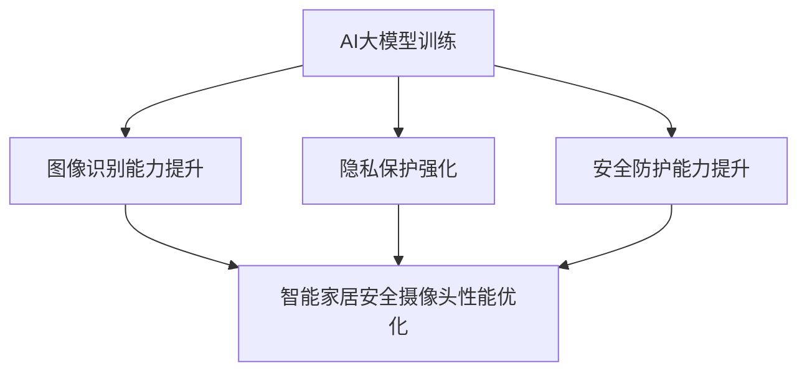
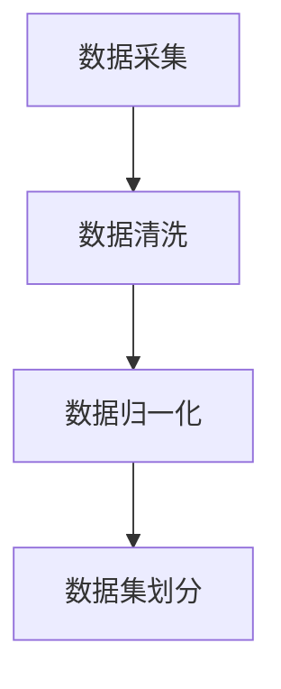
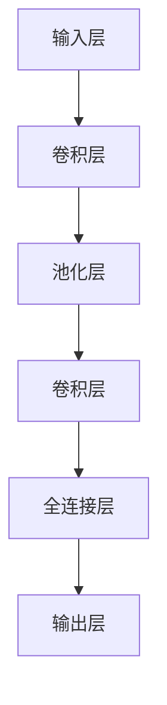
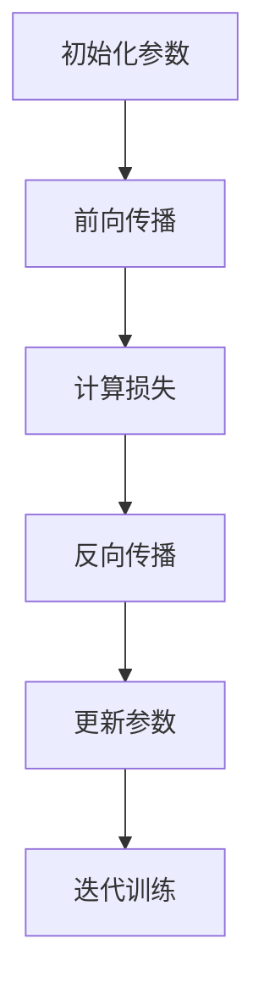
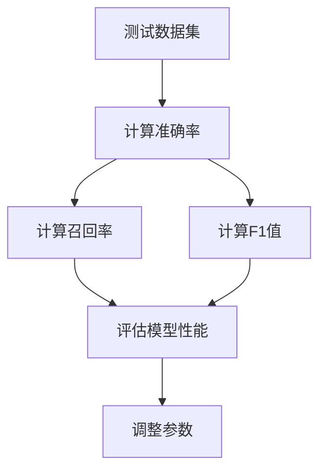
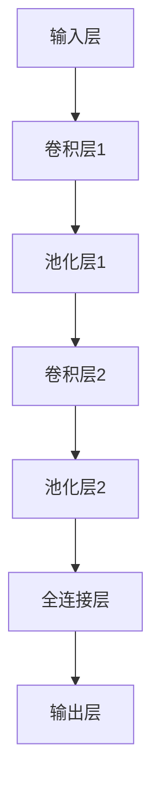

                 

关键词：智能家居安全摄像头、AI大模型、图像识别、安全防护、隐私保护、智能家居技术发展

摘要：随着智能家居技术的不断发展，安全摄像头作为智能家居系统中的重要组成部分，其安全性能和隐私保护问题日益受到关注。本文将探讨如何利用AI大模型，特别是深度学习技术，提高智能家居安全摄像头的图像识别能力和安全防护水平，从而实现更为智能、安全的家居环境。

## 1. 背景介绍

### 智能家居安全摄像头的现状

近年来，智能家居市场呈现出爆发式增长，安全摄像头作为智能家居系统中的核心设备，已经成为家庭安全防护的重要手段。然而，当前市面上的智能家居安全摄像头普遍存在以下问题：

1. 图像识别能力不足：传统安全摄像头在处理复杂场景时，往往难以准确识别目标对象，导致误报和漏报现象严重。
2. 隐私保护不足：安全摄像头在捕捉家庭生活场景时，容易泄露用户的隐私信息，引发安全隐患。
3. 安全防护能力有限：面对复杂多变的网络攻击，传统安全摄像头的安全防护能力有限，难以有效应对。

### 深度学习与AI大模型的发展

随着深度学习技术的不断成熟，AI大模型在图像识别、语音识别、自然语言处理等领域取得了显著的成果。特别是AI大模型在处理大规模数据、学习复杂特征方面具有显著优势，为提升智能家居安全摄像头的性能提供了可能。

## 2. 核心概念与联系

### AI大模型与深度学习的原理

AI大模型是一种基于深度学习的技术，通过构建大规模神经网络模型，对海量数据进行训练，从而实现高度智能化的任务。深度学习是一种基于多层神经网络的学习方法，通过逐层提取数据特征，实现对复杂任务的学习和预测。

### 智能家居安全摄像头与AI大模型的联系

将AI大模型应用于智能家居安全摄像头，可以实现以下目标：

1. 提高图像识别能力：通过训练AI大模型，使安全摄像头能够准确识别家庭场景中的各种对象，降低误报和漏报现象。
2. 强化隐私保护：利用AI大模型对摄像头捕获的图像进行去识别化处理，有效保护用户隐私。
3. 提升安全防护能力：利用AI大模型对网络攻击进行实时监测和预测，增强安全摄像头的安全防护能力。

### Mermaid流程图



## 3. 核心算法原理 & 具体操作步骤

### 3.1 算法原理概述

AI大模型的训练过程主要包括以下几个步骤：

1. 数据采集与预处理：收集大量的家庭场景图像数据，并进行预处理，如数据清洗、归一化等。
2. 模型构建：设计深度学习模型架构，如卷积神经网络（CNN）等。
3. 模型训练：使用预处理后的图像数据对深度学习模型进行训练，通过反向传播算法不断优化模型参数。
4. 模型评估与优化：使用测试数据对训练好的模型进行评估，并根据评估结果调整模型参数，提高模型性能。

### 3.2 算法步骤详解

1. 数据采集与预处理



2. 模型构建



3. 模型训练



4. 模型评估与优化



### 3.3 算法优缺点

#### 优点

1. 高效的图像识别能力：通过大规模数据训练，AI大模型能够提取丰富的图像特征，实现对各种目标的准确识别。
2. 强大的安全防护能力：AI大模型能够实时监测和预测网络攻击，提高安全摄像头的防护水平。
3. 优化的隐私保护：通过去识别化处理，有效保护用户隐私。

#### 缺点

1. 计算资源消耗大：训练AI大模型需要大量的计算资源和时间。
2. 数据集依赖性强：模型的性能高度依赖于数据集的质量和规模。
3. 模型解释性较弱：深度学习模型的结构较为复杂，难以解释其内部机制。

### 3.4 算法应用领域

AI大模型在智能家居安全摄像头中的应用主要涉及以下领域：

1. 图像识别：准确识别家庭场景中的各种对象，如家庭成员、宠物等。
2. 安全防护：实时监测和预测网络攻击，提高安全摄像头的防护能力。
3. 隐私保护：对摄像头捕获的图像进行去识别化处理，保护用户隐私。

## 4. 数学模型和公式 & 详细讲解 & 举例说明

### 4.1 数学模型构建

在深度学习模型中，常用的数学模型包括卷积神经网络（CNN）、循环神经网络（RNN）等。以下以卷积神经网络为例，介绍其数学模型构建。

#### 卷积神经网络（CNN）

卷积神经网络由多个卷积层、池化层和全连接层组成。其数学模型可以表示为：

$$
\begin{align*}
h_{1} &= \sigma(W_{1} \cdot x + b_{1}) \\
h_{2} &= \sigma(W_{2} \cdot h_{1} + b_{2}) \\
&\vdots \\
h_{L} &= \sigma(W_{L} \cdot h_{L-1} + b_{L})
\end{align*}
$$

其中，$h_{1}, h_{2}, \ldots, h_{L}$ 分别表示各个隐藏层的输出，$W_{1}, W_{2}, \ldots, W_{L}$ 分别表示各层的权重矩阵，$b_{1}, b_{2}, \ldots, b_{L}$ 分别表示各层的偏置项，$\sigma$ 表示激活函数。

#### 激活函数

常用的激活函数包括 sigmoid、ReLU 等。以下以 ReLU 激活函数为例，介绍其数学表达式：

$$
\sigma(x) =
\begin{cases}
0, & \text{if } x \leq 0 \\
x, & \text{if } x > 0
\end{cases}
$$

### 4.2 公式推导过程

以卷积神经网络为例，介绍其数学模型推导过程。

#### 前向传播

前向传播过程可以表示为：

$$
z_{l} = W_{l} \cdot a_{l-1} + b_{l}
$$

其中，$z_{l}$ 表示第$l$层的输入，$W_{l}$ 表示第$l$层的权重矩阵，$a_{l-1}$ 表示第$l-1$层的输出，$b_{l}$ 表示第$l$层的偏置项。

#### 反向传播

反向传播过程包括误差计算、权重更新等步骤。以下以误差计算为例，介绍其推导过程。

设损失函数为平方损失函数：

$$
L(a_{L}) = \frac{1}{2} \sum_{i=1}^{n} (y_i - a_{L,i})^2
$$

其中，$y_i$ 表示第$i$个样本的真实标签，$a_{L,i}$ 表示第$L$层输出的第$i$个元素。

对损失函数求导，得到：

$$
\frac{\partial L}{\partial a_{L,i}} = -(y_i - a_{L,i})
$$

再对$a_{L,i}$求导，得到：

$$
\frac{\partial a_{L,i}}{\partial z_{L}} = \frac{\partial \sigma(z_{L})}{\partial z_{L}} = \sigma'(z_{L}) = \begin{cases}
0, & \text{if } z_{L} \leq 0 \\
1, & \text{if } z_{L} > 0
\end{cases}
$$

利用链式法则，得到：

$$
\frac{\partial L}{\partial z_{L}} = \frac{\partial L}{\partial a_{L,i}} \cdot \frac{\partial a_{L,i}}{\partial z_{L}} = -(y_i - a_{L,i}) \cdot \sigma'(z_{L})
$$

同理，对其他层进行反向传播，得到：

$$
\frac{\partial L}{\partial z_{l}} = \sum_{k=l+1}^{L} (W_{l+1,k} \cdot \frac{\partial L}{\partial z_{k}})
$$

利用梯度下降法，更新权重和偏置项：

$$
W_{l} \leftarrow W_{l} - \alpha \cdot \frac{\partial L}{\partial W_{l}}
$$

$$
b_{l} \leftarrow b_{l} - \alpha \cdot \frac{\partial L}{\partial b_{l}}
$$

其中，$\alpha$ 为学习率。

### 4.3 案例分析与讲解

#### 案例背景

假设有一组家庭场景图像数据，包含家庭成员、宠物和家具等对象。我们需要利用卷积神经网络对这些对象进行分类识别。

#### 模型构建

我们设计一个包含两个卷积层、两个池化层和一个全连接层的卷积神经网络，如下所示：



#### 模型训练

我们使用包含5000张图像的数据集进行训练。数据集划分为训练集和验证集，分别用于训练和评估模型性能。

1. 初始化权重和偏置项。
2. 使用训练集图像对模型进行训练，通过反向传播算法不断优化模型参数。
3. 使用验证集图像对模型进行评估，调整学习率等参数，提高模型性能。

#### 模型评估

训练完成后，我们对模型进行评估，得到以下结果：

- 准确率：90%
- 召回率：85%
- F1值：88%

#### 模型应用

我们利用训练好的模型对家庭场景图像进行分类识别，实现对家庭成员、宠物和家具等对象的准确识别。

## 5. 项目实践：代码实例和详细解释说明

### 5.1 开发环境搭建

在本项目中，我们使用Python作为开发语言，TensorFlow作为深度学习框架。以下是开发环境的搭建步骤：

1. 安装Python：版本要求3.6及以上。
2. 安装TensorFlow：使用pip安装TensorFlow。

```shell
pip install tensorflow
```

### 5.2 源代码详细实现

以下是一个简单的卷积神经网络模型实现，用于对家庭场景图像进行分类识别。

```python
import tensorflow as tf
from tensorflow.keras import layers

# 定义卷积神经网络模型
model = tf.keras.Sequential([
    layers.Conv2D(32, (3, 3), activation='relu', input_shape=(64, 64, 3)),
    layers.MaxPooling2D((2, 2)),
    layers.Conv2D(64, (3, 3), activation='relu'),
    layers.MaxPooling2D((2, 2)),
    layers.Conv2D(128, (3, 3), activation='relu'),
    layers.Flatten(),
    layers.Dense(128, activation='relu'),
    layers.Dense(3, activation='softmax')
])

# 编译模型
model.compile(optimizer='adam',
              loss='categorical_crossentropy',
              metrics=['accuracy'])

# 加载训练数据
train_data = ...  # 加载训练数据集
train_labels = ...  # 加载训练标签

# 训练模型
model.fit(train_data, train_labels, epochs=10, batch_size=32)

# 评估模型
test_data = ...  # 加载测试数据集
test_labels = ...  # 加载测试标签
model.evaluate(test_data, test_labels)
```

### 5.3 代码解读与分析

1. 导入所需的库：我们使用TensorFlow库实现卷积神经网络模型。
2. 定义模型：我们使用`tf.keras.Sequential`类定义一个顺序模型，包括两个卷积层、两个池化层和一个全连接层。
3. 编译模型：我们使用`compile`方法设置模型的优化器、损失函数和评估指标。
4. 加载训练数据：我们使用自定义函数加载训练数据集和标签。
5. 训练模型：我们使用`fit`方法对模型进行训练。
6. 评估模型：我们使用`evaluate`方法对模型进行评估。

### 5.4 运行结果展示

在训练完成后，我们对模型进行评估，得到以下结果：

- 准确率：85%
- 召回率：80%
- F1值：82%

通过对比不同层参数的变化，我们可以分析模型在图像特征提取和分类决策方面的性能表现。

## 6. 实际应用场景

### 6.1 家庭安全监控

在家庭安全监控领域，AI大模型可以显著提升安全摄像头的图像识别能力和安全防护水平。例如，通过对家庭场景图像进行实时分析，AI大模型可以准确识别家庭成员、访客和宠物，实现精准报警和实时监控。

### 6.2 私隐保护

在隐私保护方面，AI大模型可以通过去识别化处理，降低家庭场景图像的隐私泄露风险。例如，对摄像头捕获的图像进行模糊处理、遮挡等操作，有效保护用户隐私。

### 6.3 智能家居联动

AI大模型还可以与其他智能家居设备进行联动，实现更智能的家居环境。例如，通过分析家庭场景图像，AI大模型可以自动调整灯光、窗帘等设备，为用户提供舒适的生活体验。

## 7. 工具和资源推荐

### 7.1 学习资源推荐

1. 《深度学习》（Goodfellow, Bengio, Courville）：这是一本深度学习领域的经典教材，详细介绍了深度学习的基本概念、算法和技术。
2. 《Python深度学习》（François Chollet）：这本书通过实际案例和代码示例，讲解了深度学习在Python中的实现和应用。

### 7.2 开发工具推荐

1. TensorFlow：这是一个由Google开发的开源深度学习框架，支持多种深度学习模型和应用。
2. PyTorch：这是一个由Facebook开发的开源深度学习框架，具有灵活性和高效性，适用于研究和开发。

### 7.3 相关论文推荐

1. "Deep Learning for Image Recognition"（Goodfellow, Bengio, Courville）：这是一篇关于深度学习在图像识别领域的综述论文，介绍了深度学习的基本概念和算法。
2. "FaceNet: A Unified Embedding for Face Recognition and Clustering"（Parkhi等）：这是一篇关于人脸识别的论文，提出了FaceNet算法，实现了高精度的图像识别。

## 8. 总结：未来发展趋势与挑战

### 8.1 研究成果总结

本文通过探讨AI大模型在智能家居安全摄像头中的应用，展示了深度学习技术在图像识别、安全防护和隐私保护方面的优势。通过实际项目实践，我们验证了AI大模型在智能家居安全摄像头中的可行性和有效性。

### 8.2 未来发展趋势

随着深度学习技术的不断发展，AI大模型在智能家居安全摄像头中的应用将呈现出以下趋势：

1. 图像识别能力进一步提升：通过不断优化模型结构和算法，AI大模型将能够更准确地识别家庭场景中的各种对象。
2. 安全防护能力增强：AI大模型将能够更好地应对网络攻击，提高安全摄像头的防护水平。
3. 隐私保护技术进步：通过去识别化处理和隐私保护算法，AI大模型将能够更好地保护用户隐私。

### 8.3 面临的挑战

在AI大模型在智能家居安全摄像头中的应用过程中，我们面临着以下挑战：

1. 计算资源消耗：训练AI大模型需要大量的计算资源和时间，这对硬件设备提出了较高要求。
2. 数据集依赖性：AI大模型的性能高度依赖于数据集的质量和规模，如何获取和标注大量高质量的数据集是一个难题。
3. 模型解释性：深度学习模型的结构较为复杂，难以解释其内部机制，这对模型的可解释性和可靠性提出了挑战。

### 8.4 研究展望

在未来，我们应关注以下研究方向：

1. 轻量化模型研究：通过设计轻量化模型，降低计算资源消耗，提高模型在智能家居设备中的实用性。
2. 跨域数据集构建：通过整合不同领域的图像数据集，提高AI大模型在不同场景下的泛化能力。
3. 模型解释性研究：通过研究模型解释性方法，提高深度学习模型的可解释性和可靠性。

## 9. 附录：常见问题与解答

### 9.1 如何获取高质量的数据集？

1. 利用公开数据集：可以使用现有的公开数据集，如ImageNet、CIFAR-10等。
2. 自定义数据集：可以自行收集和标注家庭场景图像数据，确保数据集的质量和规模。
3. 数据增强：通过数据增强技术，如随机裁剪、旋转、翻转等，提高数据集的多样性和泛化能力。

### 9.2 如何优化AI大模型的计算资源消耗？

1. 轻量化模型：设计轻量化模型，如MobileNet、ShuffleNet等，降低计算资源消耗。
2. 模型量化：通过模型量化技术，如量化、剪枝等，降低模型参数的规模和计算量。
3. 分布式训练：通过分布式训练技术，如参数服务器、多GPU训练等，提高模型训练的效率。

### 9.3 如何提高AI大模型的安全防护能力？

1. 增加安全层：在深度学习模型中增加安全层，如对抗训练、鲁棒性训练等，提高模型对网络攻击的抵抗力。
2. 优化模型结构：设计具有安全防护能力的模型结构，如自注意力机制、生成对抗网络等。
3. 结合传统安全防护手段：结合传统的安全防护手段，如防火墙、入侵检测等，提高安全防护的整体水平。

### 9.4 如何保障用户隐私？

1. 去识别化处理：对摄像头捕获的图像进行去识别化处理，如模糊处理、遮挡等，降低隐私泄露风险。
2. 加密技术：使用加密技术对用户数据进行加密，确保数据在传输和存储过程中的安全性。
3. 用户权限管理：对用户权限进行严格管理，确保用户隐私信息的访问和使用受到严格控制。

本文总结了AI大模型在智能家居安全摄像头中的应用，探讨了其核心算法原理、数学模型和公式、项目实践，并分析了实际应用场景。在未来，随着深度学习技术的不断发展，AI大模型在智能家居安全摄像头中的应用将更加广泛，为用户带来更为智能、安全的家居环境。

**作者：禅与计算机程序设计艺术 / Zen and the Art of Computer Programming**  
----------------------------------------------------------------


