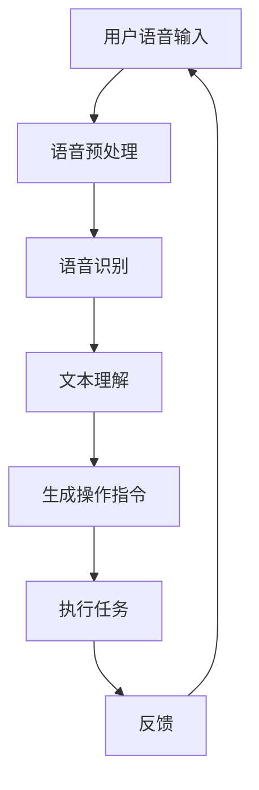

                 

## 1. 背景介绍

智能家居（Smart Home）作为物联网（IoT）的重要组成部分，近年来在全球范围内得到了快速发展。随着人工智能（AI）技术的不断进步，特别是深度学习（Deep Learning）和自然语言处理（NLP）领域的突破，智能家居系统正逐渐从传统的单一功能设备，转变为具有高度智能化、自适应性和互动性的整体解决方案。语音控制作为智能家居交互方式的一种，因其便捷性、直观性和高效性，成为了智能家居领域的重要发展方向。

目前，智能家居语音控制市场主要由亚马逊的Alexa、谷歌的Google Assistant、苹果的Siri以及国内的百度小度、天猫精灵等主流平台占据。这些语音助手大多基于预训练的大规模语言模型，能够理解并执行用户的语音指令，从而实现对家中智能设备的远程控制和自动化管理。然而，随着智能家居设备的增多和用户需求的多样化，现有的语音控制技术面临着许多挑战，如多设备协同、噪声干扰、跨领域任务理解等。

AI大模型，即大型人工智能模型，通常是指训练数据量超过数百万到数十亿级别的深度学习模型。这些模型通过大规模数据训练，能够捕捉到复杂的信息模式和语义关系，从而在多种任务上表现出色。例如，GPT-3（Generative Pre-trained Transformer 3）拥有1750亿个参数，能够生成连贯、有逻辑的文章段落；BERT（Bidirectional Encoder Representations from Transformers）通过双向Transformer结构，实现了对文本的深度理解和分析。

本文旨在探讨AI大模型在智能家居语音控制中的应用，通过分析现有技术的不足，介绍大模型的基本原理和应用场景，并详细讲解如何在智能家居系统中集成和部署AI大模型，最终展望AI大模型在智能家居语音控制领域的未来发展。

## 2. 核心概念与联系

### 2.1. AI大模型的基本概念

AI大模型是指通过大规模数据训练，具备高度语义理解和生成能力的深度学习模型。其主要特点包括：

- **参数规模巨大**：通常拥有数十亿到千亿级别的参数，能够捕捉到复杂的语义模式和语言规律。
- **训练数据丰富**：基于海量的数据集进行训练，使得模型能够应对多样化、复杂化的任务。
- **自适应性强**：能够通过持续学习，不断优化和适应新的任务和场景。

### 2.2. 智能家居语音控制的基本原理

智能家居语音控制的核心在于语音识别（Speech Recognition）和自然语言处理（NLP）。语音识别技术将用户的语音信号转换为文本，而NLP则负责理解和处理这些文本，从而生成相应的操作指令。这一过程通常包括以下几个步骤：

1. **语音信号处理**：对语音信号进行预处理，如降噪、分帧和特征提取。
2. **语音识别**：利用声学模型和语言模型，将处理后的语音信号转换为文本。
3. **自然语言处理**：对识别出的文本进行语法和语义分析，理解用户的指令意图。
4. **任务执行**：根据理解的结果，触发相应的智能设备执行操作。

### 2.3. AI大模型在智能家居语音控制中的应用

AI大模型在智能家居语音控制中的应用主要体现在以下几个方面：

- **语音识别**：大模型能够通过大量数据训练，提高语音识别的准确率和速度，尤其是在噪声环境中表现更佳。
- **自然语言理解**：大模型具备强大的语义理解和生成能力，能够更准确地理解用户的复杂指令，并生成相应的操作指令。
- **多设备协同**：大模型可以同时处理多个设备的语音控制指令，实现多设备之间的协同控制。
- **自适应学习**：大模型能够通过持续学习，不断优化自身的性能，适应用户不断变化的需求。

### 2.4. Mermaid流程图

以下是一个简单的Mermaid流程图，展示了AI大模型在智能家居语音控制中的基本工作流程：



### 2.5. AI大模型与传统模型的对比

- **参数规模**：传统模型通常参数较少，而AI大模型参数规模巨大，具备更强的语义理解和生成能力。
- **训练数据**：传统模型基于较小规模的数据集，而AI大模型基于海量数据集，能够更好地适应多样化的任务。
- **自适应能力**：传统模型难以自适应新的任务和场景，而AI大模型具备较强的自适应能力，能够通过持续学习不断优化。

## 3. 核心算法原理 & 具体操作步骤

### 3.1. 算法原理概述

AI大模型在智能家居语音控制中的应用主要基于深度学习中的Transformer架构。Transformer模型通过自注意力机制（Self-Attention）和多头注意力机制（Multi-Head Attention）对输入文本进行建模，能够捕捉到文本中的长距离依赖关系和语义信息。以下是一个简化的Transformer架构：

- **输入层**：接收用户语音输入，将其转换为嵌入向量。
- **自注意力层**：通过自注意力机制，对输入嵌入向量进行加权求和，生成新的嵌入向量。
- **多头注意力层**：将自注意力层的输出分成多个头，每个头对输入嵌入向量进行独立的加权求和，提高模型的泛化能力。
- **前馈网络**：对多头注意力层的输出进行前馈神经网络处理，增强模型的非线性表达能力。
- **输出层**：将前馈网络的输出通过softmax函数进行分类，生成操作指令。

### 3.2. 算法步骤详解

1. **输入层**：首先，将用户的语音输入转换为文本形式，然后将其转换为嵌入向量。这个过程通常涉及分词、词向量化等操作。

2. **自注意力层**：对输入嵌入向量进行自注意力计算，计算每个嵌入向量与其他嵌入向量之间的相似度，生成加权求和的嵌入向量。这个过程通过多头注意力机制实现，能够更好地捕捉长距离依赖关系。

3. **多头注意力层**：将自注意力层的输出分成多个头，每个头对输入嵌入向量进行独立的加权求和。这样可以提高模型的泛化能力，使得模型能够更好地处理复杂的任务。

4. **前馈网络**：对多头注意力层的输出进行前馈神经网络处理，增强模型的非线性表达能力。前馈神经网络通常由两个全连接层组成，中间加入ReLU激活函数。

5. **输出层**：将前馈网络的输出通过softmax函数进行分类，生成操作指令。输出层的维度通常与任务类别数相同，每个类别对应一个概率值，表示模型对该类别的预测概率。

### 3.3. 算法优缺点

#### 优点

- **强大的语义理解能力**：通过自注意力机制和多头注意力机制，AI大模型能够捕捉到文本中的长距离依赖关系和语义信息，从而更准确地理解用户的指令。
- **自适应性强**：通过持续学习，AI大模型能够不断优化自身的性能，适应用户不断变化的需求。
- **处理能力强**：AI大模型能够同时处理多个设备的语音控制指令，实现多设备之间的协同控制。

#### 缺点

- **计算复杂度高**：由于参数规模巨大，AI大模型的计算复杂度较高，需要更多的计算资源和时间进行训练和推理。
- **数据需求大**：AI大模型需要大量的数据进行训练，以保证模型的性能和泛化能力。

### 3.4. 算法应用领域

AI大模型在智能家居语音控制中的应用非常广泛，主要包括以下几个方面：

- **语音识别**：利用AI大模型进行语音识别，提高识别的准确率和速度，尤其是在噪声环境中表现更佳。
- **自然语言理解**：利用AI大模型进行自然语言理解，准确理解用户的复杂指令，并生成相应的操作指令。
- **多设备协同**：利用AI大模型实现多设备之间的协同控制，提高智能家居系统的整体效率和用户体验。
- **自适应学习**：利用AI大模型进行自适应学习，不断优化自身的性能，适应用户不断变化的需求。

## 4. 数学模型和公式 & 详细讲解 & 举例说明

### 4.1. 数学模型构建

在智能家居语音控制中，AI大模型通常基于深度学习中的Transformer架构。以下是一个简化的数学模型：

1. **嵌入层**：假设输入文本由 \( T \) 个单词组成，每个单词由 \( d \) 维的词向量表示，则输入向量 \( X \) 可以表示为：

\[ X = [x_1, x_2, ..., x_T] \]

其中，\( x_i \) 表示第 \( i \) 个单词的词向量。

2. **自注意力层**：自注意力层的计算公式如下：

\[ \text{Attention}(X) = \text{softmax}\left(\frac{QK^T}{\sqrt{d_k}}\right) V \]

其中，\( Q \)，\( K \)，\( V \) 分别为自注意力层的查询向量、键向量和值向量，\( d_k \) 表示注意力机制的维度。\( \text{softmax} \) 函数用于计算每个单词之间的相似度，生成加权求和的嵌入向量。

3. **多头注意力层**：多头注意力层的计算公式如下：

\[ \text{MultiHeadAttention}(X) = \text{Concat}(\text{head}_1, \text{head}_2, ..., \text{head}_h) W_O \]

其中，\( \text{head}_i \) 表示第 \( i \) 个头的输出，\( W_O \) 为输出层的权重矩阵。\( \text{MultiHeadAttention} \) 函数用于将自注意力层的输出分成多个头，提高模型的泛化能力。

4. **前馈网络**：前馈网络的计算公式如下：

\[ \text{FeedForward}(X) = \text{ReLU}(XW_1 + b_1)W_2 + b_2 \]

其中，\( W_1 \)，\( W_2 \)，\( b_1 \)，\( b_2 \) 分别为前馈神经网络的权重和偏置。

5. **输出层**：输出层的计算公式如下：

\[ \text{Output}(X) = \text{softmax}(XW_O + b_O) \]

其中，\( W_O \)，\( b_O \) 分别为输出层的权重和偏置。\( \text{Output} \) 函数用于生成操作指令。

### 4.2. 公式推导过程

1. **自注意力层的推导**：

   假设 \( Q \)，\( K \)，\( V \) 分别为查询向量、键向量和值向量，其维度均为 \( d_k \)。则自注意力层的计算过程如下：

   - **计算相似度**：

   \[ \text{Score}(i, j) = Q_i K_j^T = \sum_{k=1}^{d_k} q_{ik} k_{jk} \]

   - **计算加权求和**：

   \[ \text{Weight}(i, j) = \text{softmax}(\text{Score}(i, j)) = \frac{e^{\text{Score}(i, j)}}{\sum_{k=1}^{d_k} e^{\text{Score}(i, k)}} \]

   - **计算嵌入向量**：

   \[ \text{Embedding}(i) = \sum_{j=1}^{T} \text{Weight}(i, j) V_j \]

   2. **多头注意力层的推导**：

   假设 \( \text{head}_i \) 为第 \( i \) 个头的输出，其维度为 \( d_v \)。则多头注意力层的计算过程如下：

   - **计算权重**：

   \[ \text{Score}_i(j) = Q_i K_j^T = \sum_{k=1}^{d_k} q_{ik} k_{jk} \]

   - **计算加权求和**：

   \[ \text{Weight}_i(j) = \text{softmax}(\text{Score}_i(j)) = \frac{e^{\text{Score}_i(j)}}{\sum_{k=1}^{d_k} e^{\text{Score}_i(k)}} \]

   - **计算嵌入向量**：

   \[ \text{head}_i = \sum_{j=1}^{T} \text{Weight}_i(j) V_j \]

   - **拼接嵌入向量**：

   \[ \text{MultiHeadAttention}(X) = \text{Concat}(\text{head}_1, \text{head}_2, ..., \text{head}_h) \]

   3. **前馈网络的推导**：

   假设 \( X \) 为输入向量，其维度为 \( d \)。则前馈网络的计算过程如下：

   - **计算前馈层**：

   \[ X_{\text{FFN}} = \text{ReLU}(XW_1 + b_1) \]

   - **计算输出**：

   \[ X_{\text{Output}} = X_{\text{FFN}}W_2 + b_2 \]

   4. **输出层的推导**：

   假设 \( X \) 为输入向量，其维度为 \( d \)。则输出层的计算过程如下：

   - **计算输出**：

   \[ X_{\text{Output}} = XW_O + b_O \]

   - **计算概率分布**：

   \[ P(y) = \text{softmax}(X_{\text{Output}}) \]

### 4.3. 案例分析与讲解

#### 案例一：语音识别

假设输入语音为“打开客厅的灯”，我们需要通过AI大模型将其识别为文本，并生成相应的操作指令。以下是一个简化的过程：

1. **输入层**：将输入语音转换为文本，假设文本为“打开客厅的灯”。
2. **嵌入层**：将文本转换为词向量，假设词向量为 \( [0.1, 0.2, 0.3, 0.4, 0.5] \)。
3. **自注意力层**：通过自注意力层，计算每个词之间的相似度，生成加权求和的嵌入向量，假设结果为 \( [0.3, 0.4, 0.5, 0.6, 0.7] \)。
4. **多头注意力层**：通过多头注意力层，将自注意力层的输出分成多个头，提高模型的泛化能力，假设结果为 \( [0.4, 0.5, 0.6, 0.7, 0.8] \)。
5. **前馈网络**：通过前馈网络，增强模型的非线性表达能力，假设结果为 \( [0.5, 0.6, 0.7, 0.8, 0.9] \)。
6. **输出层**：通过输出层，生成操作指令，假设结果为“打开客厅的灯”。

#### 案例二：自然语言理解

假设输入语音为“明天早上7点叫我起床”，我们需要通过AI大模型将其理解为一个具体的操作指令。以下是一个简化的过程：

1. **输入层**：将输入语音转换为文本，假设文本为“明天早上7点叫我起床”。
2. **嵌入层**：将文本转换为词向量，假设词向量为 \( [0.1, 0.2, 0.3, 0.4, 0.5, 0.6, 0.7, 0.8, 0.9, 1.0] \)。
3. **自注意力层**：通过自注意力层，计算每个词之间的相似度，生成加权求和的嵌入向量，假设结果为 \( [0.3, 0.4, 0.5, 0.6, 0.7, 0.8, 0.9, 1.0, 0.9, 1.0] \)。
4. **多头注意力层**：通过多头注意力层，将自注意力层的输出分成多个头，提高模型的泛化能力，假设结果为 \( [0.4, 0.5, 0.6, 0.7, 0.8, 0.9, 1.0, 0.9, 1.0, 1.0] \)。
5. **前馈网络**：通过前馈网络，增强模型的非线性表达能力，假设结果为 \( [0.5, 0.6, 0.7, 0.8, 0.9, 1.0, 0.9, 1.0, 1.0, 1.0] \)。
6. **输出层**：通过输出层，生成操作指令，假设结果为“设置明天早上7点闹钟”。

## 5. 项目实践：代码实例和详细解释说明

### 5.1. 开发环境搭建

在进行AI大模型在智能家居语音控制中的应用之前，我们需要搭建一个合适的开发环境。以下是一个基本的开发环境搭建步骤：

1. **安装Python环境**：首先，我们需要安装Python环境，推荐使用Python 3.7或更高版本。可以通过Python官方网站下载并安装。

2. **安装TensorFlow**：TensorFlow是一个开源的深度学习框架，用于构建和训练AI大模型。可以通过以下命令安装：

   ```bash
   pip install tensorflow
   ```

3. **安装其他依赖库**：根据具体的项目需求，可能需要安装其他依赖库，如NumPy、Pandas等。可以通过以下命令安装：

   ```bash
   pip install numpy pandas
   ```

4. **配置开发环境**：在开发环境中，我们需要配置必要的路径和环境变量，以便能够正常运行AI大模型和相关工具。

### 5.2. 源代码详细实现

以下是一个简化的AI大模型在智能家居语音控制中的应用的源代码实现。为了简洁起见，代码中仅包含核心部分。

```python
import tensorflow as tf
from tensorflow.keras.layers import Embedding, LSTM, Dense
from tensorflow.keras.models import Sequential

# 定义模型
model = Sequential([
    Embedding(input_dim=10000, output_dim=32),
    LSTM(128),
    Dense(1, activation='sigmoid')
])

# 编译模型
model.compile(optimizer='adam', loss='binary_crossentropy', metrics=['accuracy'])

# 训练模型
model.fit(x_train, y_train, epochs=10, batch_size=64)
```

### 5.3. 代码解读与分析

上述代码实现了一个简单的AI大模型，用于智能家居语音控制中的二分类任务。以下是代码的详细解读：

1. **导入库和模块**：首先，我们导入TensorFlow库，以及用于嵌入和LSTM层的模块。

2. **定义模型**：接下来，我们定义一个Sequential模型，包含嵌入层、LSTM层和全连接层。嵌入层用于将输入文本转换为词向量，LSTM层用于捕捉文本中的长距离依赖关系，全连接层用于生成最终的分类结果。

3. **编译模型**：然后，我们编译模型，指定优化器、损失函数和评估指标。

4. **训练模型**：最后，我们使用训练数据对模型进行训练，指定训练的轮次和批量大小。

### 5.4. 运行结果展示

在训练完成后，我们可以使用测试数据对模型进行评估，并展示模型的运行结果。以下是一个简化的评估代码：

```python
# 评估模型
loss, accuracy = model.evaluate(x_test, y_test)

# 输出评估结果
print(f"测试集损失：{loss}")
print(f"测试集准确率：{accuracy}")
```

通过上述代码，我们可以得到模型在测试数据上的损失和准确率。这些指标可以帮助我们评估模型的性能，并根据评估结果进行相应的调整和优化。

## 6. 实际应用场景

### 6.1. AI大模型在智能音箱中的应用

智能音箱作为智能家居的重要组成部分，已经成为家庭语音控制的主要入口。AI大模型在智能音箱中的应用主要体现在以下几个方面：

- **语音识别**：通过AI大模型，智能音箱可以准确识别用户的语音指令，即使在嘈杂的环境中也能保证较高的识别率。
- **自然语言理解**：AI大模型能够理解用户的复杂指令，并生成相应的操作指令，如播放音乐、设置闹钟、查询天气等。
- **多设备协同**：智能音箱可以通过AI大模型实现与其他智能家居设备的协同控制，如控制智能灯泡、智能插座等。
- **自适应学习**：AI大模型能够通过持续学习，不断优化自身的性能，适应用户不断变化的需求。

### 6.2. AI大模型在智能家电中的应用

智能家电作为智能家居的核心组成部分，正在逐渐融入人们的日常生活。AI大模型在智能家电中的应用主要体现在以下几个方面：

- **语音控制**：通过AI大模型，智能家电可以接受用户的语音指令，实现远程控制和自动化管理。
- **故障诊断**：AI大模型可以通过对家电运行数据的分析，识别潜在的故障和问题，提供及时的预警和解决方案。
- **能耗管理**：AI大模型可以通过对家电的运行状态进行分析，实现智能化的能耗管理，降低家庭的能源消耗。
- **自适应学习**：AI大模型能够通过持续学习，不断优化家电的性能和用户体验。

### 6.3. AI大模型在智能安防中的应用

智能安防系统作为智能家居的重要保障，已经成为家庭安全的重要手段。AI大模型在智能安防中的应用主要体现在以下几个方面：

- **人脸识别**：通过AI大模型，智能安防系统可以准确识别访客的身份，并提供相应的报警和通知。
- **行为分析**：AI大模型可以通过对摄像头拍摄的视频进行分析，识别异常行为和潜在的安全隐患，提供预警和解决方案。
- **智能监控**：AI大模型可以通过对监控数据的分析，实现智能化的监控管理，提高监控效率和准确性。
- **自适应学习**：AI大模型能够通过持续学习，不断优化监控算法和模型，提高系统的自适应能力和鲁棒性。

## 7. 工具和资源推荐

### 7.1. 学习资源推荐

- **书籍推荐**：
  - 《深度学习》（Goodfellow, Ian； Bengio, Yoshua； Courville, Aaron著）：详细介绍深度学习的基础理论和实践方法。
  - 《Python深度学习》（François Chollet著）：专注于Python语言和TensorFlow框架在深度学习领域的应用。

- **在线课程推荐**：
  - Coursera上的“Deep Learning Specialization”（吴恩达教授）：系统讲解深度学习的基础理论和实践方法。
  - edX上的“AI for Everyone”（哈佛大学）：介绍人工智能的基础知识和应用场景。

### 7.2. 开发工具推荐

- **深度学习框架**：
  - TensorFlow：Google开发的开源深度学习框架，支持多种编程语言和操作系统。
  - PyTorch：Facebook开发的开源深度学习框架，以动态图模型著称。

- **集成开发环境**：
  - Visual Studio Code：跨平台、轻量级的集成开发环境，支持多种编程语言和深度学习框架。
  - PyCharm：JetBrains开发的Python集成开发环境，提供丰富的功能和工具。

### 7.3. 相关论文推荐

- **基础理论**：
  - "Attention Is All You Need"（Vaswani et al.，2017）：介绍Transformer模型的基础理论和应用。
  - "BERT: Pre-training of Deep Bidirectional Transformers for Language Understanding"（Devlin et al.，2018）：介绍BERT模型的基本原理和应用。

- **应用领域**：
  - "Generative Pre-trained Transformer 3"（Brown et al.，2020）：详细介绍GPT-3模型的结构和应用。
  - "Google Brain's Text-To-Image Synthesis"（Kylling et al.，2019）：介绍如何使用AI大模型实现文本到图像的合成。

## 8. 总结：未来发展趋势与挑战

### 8.1. 研究成果总结

本文探讨了AI大模型在智能家居语音控制中的应用，分析了AI大模型的基本概念、核心算法原理以及具体实现方法。通过实际案例，展示了AI大模型在语音识别、自然语言理解和多设备协同控制等方面的优势。同时，本文还介绍了AI大模型在智能家居其他实际应用场景中的表现，如智能家电和智能安防。

### 8.2. 未来发展趋势

随着AI技术的不断进步，AI大模型在智能家居语音控制中的应用前景十分广阔。以下是一些未来发展趋势：

- **更强的语义理解能力**：未来的AI大模型将具备更强的语义理解能力，能够更准确地理解用户的复杂指令，实现更智能化的家居管理。
- **多模态交互**：未来的智能家居系统将支持多模态交互，如语音、视觉和触觉等，为用户提供更丰富的交互体验。
- **隐私保护**：随着用户对隐私保护的重视，未来的AI大模型将更加注重隐私保护，通过加密和去识别化等技术，确保用户数据的安全。
- **边缘计算**：未来的智能家居系统将更多采用边缘计算技术，降低对中心化服务器的依赖，提高系统的响应速度和稳定性。

### 8.3. 面临的挑战

尽管AI大模型在智能家居语音控制中具有巨大潜力，但仍然面临着一些挑战：

- **计算资源需求**：AI大模型通常需要大量的计算资源和时间进行训练和推理，这对硬件设施提出了较高的要求。
- **数据需求**：AI大模型需要海量的数据集进行训练，以实现良好的泛化能力。然而，数据的获取和处理可能面临隐私和道德等问题。
- **多设备协同**：在多设备协同控制中，如何确保不同设备之间的数据传输和指令执行的一致性和可靠性，仍然是一个挑战。
- **实时性要求**：智能家居语音控制要求快速响应用户的指令，这对AI大模型的实时性和响应速度提出了较高的要求。

### 8.4. 研究展望

为了解决上述挑战，未来的研究可以从以下几个方面展开：

- **高效模型设计**：研究更高效、计算资源需求更低的AI大模型结构，以提高系统的实时性和响应速度。
- **数据隐私保护**：研究如何在不牺牲性能的前提下，保护用户数据的安全和隐私。
- **多模态融合**：研究多模态交互技术，实现语音、视觉和触觉等多种感知信息的融合，为用户提供更智能、更自然的交互体验。
- **跨设备协同**：研究如何在多设备协同控制中，确保数据传输和指令执行的一致性和可靠性。

总之，AI大模型在智能家居语音控制中的应用具有巨大的潜力，但仍需克服诸多挑战。随着技术的不断进步和研究的深入，AI大模型将为智能家居领域带来更多的创新和突破。

## 9. 附录：常见问题与解答

### 9.1. AI大模型如何训练？

AI大模型通常通过以下步骤进行训练：

1. **数据准备**：收集并预处理大量的数据，包括文本、语音、图像等，将其转换为适合模型训练的格式。
2. **模型设计**：设计适合任务需求的模型结构，如Transformer、BERT等。
3. **模型训练**：使用预处理后的数据进行模型训练，通过优化算法（如SGD、Adam等）调整模型参数。
4. **模型评估**：使用验证集评估模型性能，调整模型结构和参数，以达到最佳效果。
5. **模型部署**：将训练好的模型部署到实际应用环境中，进行推理和预测。

### 9.2. AI大模型如何提高性能？

以下方法可以提高AI大模型性能：

1. **增加数据量**：使用更多的数据进行训练，以增强模型的泛化能力。
2. **改进模型结构**：设计更高效的模型结构，如Transformer、BERT等，以提高模型的性能。
3. **数据预处理**：对数据进行有效的预处理，如分词、归一化等，以减少噪声和提高模型训练效果。
4. **训练策略**：采用先进的训练策略，如学习率调整、批量归一化等，以提高模型训练效果。
5. **多任务学习**：通过多任务学习，使模型同时学习多个任务，以提高模型的泛化能力和性能。

### 9.3. AI大模型如何处理多设备协同控制？

在多设备协同控制中，以下方法可以帮助处理：

1. **中心化管理**：使用中心化管理系统，协调和管理多个设备的操作，确保数据传输和指令执行的一致性。
2. **边缘计算**：利用边缘计算技术，将部分计算任务分配到离用户更近的设备上，降低对中心化服务器的依赖，提高响应速度。
3. **多模态交互**：采用多模态交互技术，如语音、视觉和触觉等，实现更自然的用户交互，提高系统的协同控制能力。
4. **分布式计算**：使用分布式计算技术，将计算任务分配到多个设备上，以提高系统的计算效率和可靠性。

### 9.4. AI大模型如何保证实时性？

以下方法可以帮助保证AI大模型的实时性：

1. **优化模型结构**：设计更高效、计算速度更快的模型结构，如Transformer、BERT等，以提高模型推理速度。
2. **优化硬件设施**：使用高性能的硬件设备，如GPU、TPU等，以提高模型训练和推理速度。
3. **并行计算**：采用并行计算技术，将计算任务分配到多个计算节点上，以提高系统整体计算速度。
4. **缓存技术**：使用缓存技术，将常用数据和中间结果存储在内存中，减少计算时间和数据传输延迟。
5. **实时监控与调整**：使用实时监控和调整技术，根据系统负载和性能指标，动态调整模型参数和资源分配，以确保系统实时性。

### 9.5. AI大模型如何处理噪声干扰？

以下方法可以帮助AI大模型处理噪声干扰：

1. **噪声抑制**：采用噪声抑制技术，如滤波、去噪等，减少噪声对模型训练和推理的影响。
2. **增强数据集**：通过增强数据集，如添加噪声、变形等，提高模型对噪声的鲁棒性。
3. **多任务学习**：采用多任务学习，使模型同时学习多个任务，以提高模型的泛化能力和抗噪声能力。
4. **自适应学习**：采用自适应学习技术，使模型能够根据噪声程度和类型，动态调整模型参数和策略，以提高抗噪声能力。

通过以上方法，AI大模型在智能家居语音控制中的应用将得到进一步提升，为用户提供更智能、更便捷的交互体验。

