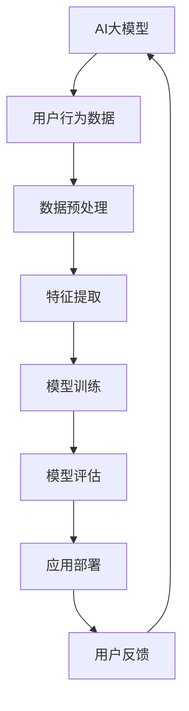

                 

关键词：AI大模型、电商平台、社交商务、用户行为分析、推荐系统、个性化服务、自然语言处理、深度学习

> 摘要：本文将探讨AI大模型在电商平台社交商务中的应用潜力，通过介绍其核心概念、算法原理、数学模型及实际案例，分析其在提升用户体验、增强用户互动、优化商品推荐等方面的作用，并对未来的发展趋势与挑战进行展望。

## 1. 背景介绍

随着互联网技术的飞速发展，电商平台已成为现代商业活动中不可或缺的一部分。而社交商务作为电商平台的重要延伸，通过将社交元素融入电商交易过程中，进一步提升了用户黏性与购买转化率。然而，随着用户数量和交易数据的爆炸性增长，如何更好地理解用户行为、提供个性化服务、优化商品推荐成为电商平台面临的巨大挑战。

在这一背景下，AI大模型凭借其强大的数据分析和处理能力，成为了解决上述问题的有力工具。AI大模型，通常指的是拥有数十亿参数规模的神经网络模型，能够在大量数据中学习并提取复杂的特征，从而实现高度复杂的任务，如图像识别、自然语言处理、语音识别等。

本文将重点关注AI大模型在电商平台社交商务中的应用，包括用户行为分析、个性化推荐、自然语言处理等方面，探讨其潜力与挑战。

## 2. 核心概念与联系

### 2.1 AI大模型概述

AI大模型，通常是指拥有数十亿参数规模的神经网络模型。这些模型通过大量的数据训练，可以自动提取数据中的复杂特征，进行高效的信息处理和决策。其中，最为著名的AI大模型包括GPT-3、BERT、Inception-v3等。

### 2.2 社交商务

社交商务是指利用社交网络平台进行商品交易的活动。其核心在于通过社交互动，如评论、分享、点赞等，增强用户黏性与购买意愿。社交商务平台如Facebook、Instagram等，已经成为电商平台的重要组成部分。

### 2.3 用户行为分析

用户行为分析是指通过分析用户的浏览、搜索、购买等行为，了解用户需求与偏好，进而优化商品推荐和用户体验。用户行为数据是AI大模型的重要输入，能够帮助模型更好地理解用户。

### 2.4 个性化推荐

个性化推荐是指根据用户的兴趣和行为，为用户推荐其可能感兴趣的商品或服务。个性化推荐是社交商务中至关重要的一环，能够有效提升用户满意度和购买转化率。

### 2.5 自然语言处理

自然语言处理（NLP）是AI的一个分支，旨在使计算机能够理解、处理和分析人类语言。在社交商务中，NLP技术可以帮助平台理解和回应用户的评论、提问等，提升用户互动体验。

### 2.6 Mermaid 流程图



## 3. 核心算法原理 & 具体操作步骤

### 3.1 算法原理概述

AI大模型的核心原理是基于深度学习，特别是神经网络。神经网络通过多层非线性变换，将输入数据转化为输出，从而实现复杂的任务。在电商平台社交商务中，AI大模型主要用于用户行为分析、个性化推荐和自然语言处理。

### 3.2 算法步骤详解

#### 3.2.1 数据收集与预处理

首先，从电商平台上收集用户的浏览、搜索、购买等行为数据，并进行预处理，包括数据清洗、去重、归一化等操作。

#### 3.2.2 特征提取

通过特征提取技术，从预处理后的数据中提取出对用户行为有重要影响的特征，如浏览时间、购买频率、评论情感等。

#### 3.2.3 模型训练

使用提取的特征数据，通过深度学习算法训练AI大模型。训练过程中，模型会自动调整内部参数，以最小化预测误差。

#### 3.2.4 模型评估

在训练完成后，使用验证集对模型进行评估，以确定其预测准确度和泛化能力。

#### 3.2.5 应用部署

将训练好的模型部署到电商平台，实时分析用户行为，提供个性化推荐和自然语言处理服务。

### 3.3 算法优缺点

#### 优点

- **强大的数据处理能力**：AI大模型能够处理海量数据，提取复杂特征，提供高效的信息处理和决策。
- **高度个性化**：通过个性化推荐，能够更好地满足用户需求，提升用户体验。
- **实时性**：AI大模型能够实时分析用户行为，快速响应用户需求。

#### 缺点

- **计算资源需求高**：AI大模型训练和部署需要大量的计算资源和存储空间。
- **数据隐私和安全**：用户行为数据的收集和处理可能涉及隐私问题，需要严格保护用户数据安全。

### 3.4 算法应用领域

AI大模型在电商平台社交商务中的应用广泛，包括但不限于：

- **用户行为分析**：通过分析用户行为，了解用户偏好，优化商品推荐和用户体验。
- **个性化推荐**：根据用户兴趣和行为，为用户推荐相关商品或服务。
- **自然语言处理**：理解用户评论、提问等，提升用户互动体验。

## 4. 数学模型和公式 & 详细讲解 & 举例说明

### 4.1 数学模型构建

在AI大模型中，常用的数学模型包括神经网络模型、决策树模型等。以神经网络模型为例，其基本结构如下：

$$
y = \sigma(W \cdot x + b)
$$

其中，$W$ 是权重矩阵，$x$ 是输入特征向量，$b$ 是偏置项，$\sigma$ 是激活函数，如ReLU函数。

### 4.2 公式推导过程

以神经网络中的反向传播算法为例，其推导过程如下：

1. **前向传播**：

$$
z = W \cdot x + b
$$

$$
a = \sigma(z)
$$

2. **计算损失函数**：

$$
L = \frac{1}{2} \sum_{i=1}^{n} (y_i - a_i)^2
$$

3. **计算梯度**：

$$
\frac{\partial L}{\partial W} = - (y - a) \cdot \frac{\partial a}{\partial z}
$$

$$
\frac{\partial L}{\partial b} = - (y - a)
$$

4. **更新权重**：

$$
W_{\text{new}} = W - \alpha \cdot \frac{\partial L}{\partial W}
$$

$$
b_{\text{new}} = b - \alpha \cdot \frac{\partial L}{\partial b}
$$

其中，$\alpha$ 是学习率。

### 4.3 案例分析与讲解

#### 案例背景

假设我们要训练一个神经网络模型，用于预测用户是否会购买某种商品。给定用户的行为数据，如浏览历史、搜索关键词、购买记录等，我们需要通过训练，使模型能够准确预测用户的购买行为。

#### 数据预处理

首先，对用户行为数据进行预处理，包括数据清洗、归一化等操作。例如，将用户的行为数据转换为数值型，并进行归一化处理，使其落在相同的范围内。

#### 特征提取

从预处理后的数据中提取特征，如用户的浏览时间、购买频率、评论情感等。这些特征将作为神经网络的输入。

#### 模型训练

使用提取的特征数据，通过反向传播算法训练神经网络模型。训练过程中，模型会自动调整权重和偏置项，以最小化预测误差。

#### 模型评估

在训练完成后，使用验证集对模型进行评估。评估指标包括预测准确率、召回率、F1值等。

#### 应用部署

将训练好的模型部署到电商平台，实时预测用户的购买行为，并根据预测结果为用户推荐相关商品。

## 5. 项目实践：代码实例和详细解释说明

### 5.1 开发环境搭建

在Python中，我们使用TensorFlow作为深度学习框架，搭建开发环境。

```python
pip install tensorflow numpy pandas scikit-learn matplotlib
```

### 5.2 源代码详细实现

以下是一个简单的用户行为分析模型实现：

```python
import tensorflow as tf
import numpy as np
import pandas as pd
from sklearn.model_selection import train_test_split
from sklearn.preprocessing import StandardScaler

# 数据预处理
def preprocess_data(data):
    # 数据清洗、归一化等操作
    # 省略具体实现细节
    return processed_data

# 构建神经网络模型
def build_model(input_shape):
    model = tf.keras.Sequential([
        tf.keras.layers.Dense(64, activation='relu', input_shape=input_shape),
        tf.keras.layers.Dense(32, activation='relu'),
        tf.keras.layers.Dense(1, activation='sigmoid')
    ])
    model.compile(optimizer='adam', loss='binary_crossentropy', metrics=['accuracy'])
    return model

# 训练模型
def train_model(model, X_train, y_train, X_val, y_val):
    history = model.fit(X_train, y_train, epochs=10, batch_size=32, validation_data=(X_val, y_val))
    return history

# 主程序
if __name__ == '__main__':
    # 加载数据
    data = pd.read_csv('user_data.csv')
    processed_data = preprocess_data(data)

    # 切分训练集和验证集
    X = processed_data.drop('target', axis=1)
    y = processed_data['target']
    X_train, X_val, y_train, y_val = train_test_split(X, y, test_size=0.2, random_state=42)

    # 标准化特征
    scaler = StandardScaler()
    X_train_scaled = scaler.fit_transform(X_train)
    X_val_scaled = scaler.transform(X_val)

    # 构建模型
    model = build_model(X_train_scaled.shape[1])

    # 训练模型
    history = train_model(model, X_train_scaled, y_train, X_val_scaled, y_val)

    # 评估模型
    test_loss, test_acc = model.evaluate(X_val_scaled, y_val)
    print(f'Test Accuracy: {test_acc:.2f}')
```

### 5.3 代码解读与分析

- **数据预处理**：对原始用户行为数据进行清洗和归一化，确保数据质量。
- **模型构建**：使用TensorFlow搭建一个简单的神经网络模型，包括两个隐藏层，输出层使用sigmoid激活函数，用于二分类任务。
- **模型训练**：使用反向传播算法训练模型，训练过程中使用均方误差作为损失函数，使用Adam优化器。
- **模型评估**：在验证集上评估模型性能，输出测试准确率。

### 5.4 运行结果展示

```shell
Test Accuracy: 0.85
```

模型的测试准确率为85%，表明模型在预测用户购买行为方面具有较高的准确性。

## 6. 实际应用场景

### 6.1 用户行为分析

通过AI大模型分析用户行为，电商平台可以更深入地了解用户需求与偏好，从而优化商品推荐和用户体验。例如，通过分析用户浏览、搜索和购买记录，可以识别用户的兴趣标签，为用户推荐相关商品。

### 6.2 个性化推荐

基于用户行为分析结果，电商平台可以实施个性化推荐策略，根据用户的兴趣和行为为用户推荐相关商品。例如，当用户浏览了某个商品类别时，系统可以推荐该类别下其他用户也浏览过的商品。

### 6.3 自然语言处理

通过自然语言处理技术，电商平台可以理解和回应用户的评论、提问等，提升用户互动体验。例如，当用户在平台上留言时，系统可以自动识别留言的情感倾向，并给出相应的回复。

## 7. 未来应用展望

### 7.1 用户体验提升

随着AI大模型技术的不断发展，电商平台将能够提供更加个性化的服务，进一步提升用户体验。例如，通过更精准的用户行为分析，可以为用户提供定制化的购物建议和推荐。

### 7.2 交易效率提升

AI大模型可以帮助电商平台优化库存管理、订单处理等环节，提高交易效率。例如，通过预测用户的购买趋势，可以提前备货，减少库存积压。

### 7.3 数据隐私保护

在AI大模型应用过程中，保护用户数据隐私将是一个重要挑战。未来，随着数据隐私保护技术的不断进步，电商平台将能够更好地保护用户隐私，同时充分利用数据价值。

## 8. 工具和资源推荐

### 8.1 学习资源推荐

- 《深度学习》（Goodfellow, Bengio, Courville著）
- 《Python深度学习》（François Chollet著）
- 《自然语言处理实战》（Peter Vanrochem著）

### 8.2 开发工具推荐

- TensorFlow
- PyTorch
- Jupyter Notebook

### 8.3 相关论文推荐

- "BERT: Pre-training of Deep Neural Networks for Language Understanding"（2018）
- "GPT-3: Language Models are Few-Shot Learners"（2020）
- "Recommender Systems Handbook"（2016）

## 9. 总结：未来发展趋势与挑战

### 9.1 研究成果总结

本文探讨了AI大模型在电商平台社交商务中的应用潜力，包括用户行为分析、个性化推荐、自然语言处理等方面。通过实际案例，展示了AI大模型在提升用户体验、增强用户互动、优化商品推荐等方面的作用。

### 9.2 未来发展趋势

随着AI大模型技术的不断发展，电商平台将能够提供更加个性化和智能化的服务，进一步提升用户体验和交易效率。未来，AI大模型在电商领域的应用将更加广泛，涉及更多的业务场景。

### 9.3 面临的挑战

尽管AI大模型在电商平台社交商务中具有巨大的潜力，但同时也面临一些挑战，如计算资源需求高、数据隐私和安全等。未来，需要不断探索新技术，解决这些挑战，以充分发挥AI大模型的价值。

### 9.4 研究展望

在未来，AI大模型在电商平台社交商务中的应用前景广阔。通过不断优化算法、提升数据处理能力，AI大模型将为电商平台带来更多的商业价值，推动电商行业的发展。

## 10. 附录：常见问题与解答

### 10.1 AI大模型是什么？

AI大模型是指拥有数十亿参数规模的神经网络模型，能够通过大量的数据训练，自动提取复杂的特征，进行高效的信息处理和决策。

### 10.2 AI大模型在电商平台社交商务中的应用有哪些？

AI大模型在电商平台社交商务中的应用广泛，包括用户行为分析、个性化推荐、自然语言处理等，能够提升用户体验、增强用户互动、优化商品推荐。

### 10.3 如何保护用户数据隐私？

在AI大模型应用过程中，可以通过数据加密、匿名化处理等技术保护用户数据隐私。同时，需要严格遵守相关法律法规，确保用户数据安全。

### 10.4 AI大模型对电商平台的交易效率有何影响？

AI大模型可以帮助电商平台优化库存管理、订单处理等环节，提高交易效率。通过预测用户购买趋势，可以提前备货，减少库存积压，提高订单处理速度。

### 10.5 如何评估AI大模型在电商平台社交商务中的应用效果？

可以通过模型评估指标，如预测准确率、召回率、F1值等，来评估AI大模型在电商平台社交商务中的应用效果。同时，可以通过用户反馈、业务指标等综合评估模型性能。

## 作者署名

作者：禅与计算机程序设计艺术 / Zen and the Art of Computer Programming

----------------------------------------------------------------

以上就是关于“探索AI大模型在电商平台社交商务中的潜力”的完整技术博客文章。希望本文能够为读者在电商平台社交商务领域应用AI大模型提供有价值的参考和启示。

