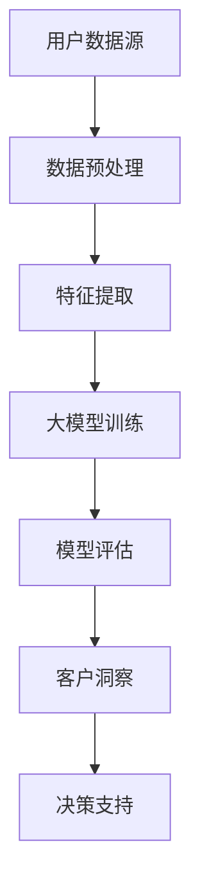

                 

在当今数字经济时代，电商行业正迅速崛起，成为全球市场的重要组成部分。随着消费者需求的日益多样化和个性化，电商企业面临着巨大的挑战，即如何深入了解并满足消费者的需求。基于大模型的电商智能客户洞察系统应运而生，它通过整合和分析海量数据，为电商企业提供精准的客户洞察，从而提升用户体验和商业价值。

> 关键词：电商、大模型、客户洞察、数据分析、人工智能

> 摘要：本文旨在深入探讨基于大模型的电商智能客户洞察系统的构建与应用。首先，我们将介绍背景，阐述大模型在电商客户洞察中的重要性。接着，我们将详细讲解核心概念与联系，并通过一个具体的Mermaid流程图展示系统的架构。随后，我们将分析核心算法原理，并介绍数学模型和公式。文章还将通过项目实践展示实际代码实例，并讨论实际应用场景和未来展望。最后，我们将总结研究成果，并展望未来的发展趋势和挑战。

## 1. 背景介绍

### 1.1 电商行业的发展现状

电商行业在过去几年中经历了爆炸式增长，尤其在COVID-19疫情的影响下，线上购物成为消费者的首选。根据统计，全球电商市场规模已经突破万亿美元，且未来几年仍将保持高速增长。然而，随着市场规模的扩大，竞争也日益激烈，电商企业需要不断创新和优化运营策略，以吸引和留住客户。

### 1.2 客户洞察的重要性

客户洞察是指通过分析消费者的行为、需求和偏好，来获取深度的客户理解。在电商领域，客户洞察有助于企业发现潜在的市场机会，优化产品和服务，提高用户满意度。然而，传统的客户洞察方法往往依赖于有限的样本数据和简单的统计分析，难以全面反映消费者的真实需求。

### 1.3 大模型的应用优势

大模型，特别是基于深度学习的模型，具有处理海量数据、自动特征提取和复杂关系挖掘的能力。在大数据时代，电商企业可以通过大模型来实时分析海量用户数据，发现隐藏的模式和趋势，从而实现更精准的客户洞察。

## 2. 核心概念与联系

### 2.1 大模型的定义

大模型是指具有大规模参数和复杂结构的机器学习模型，如深度神经网络。这些模型可以通过学习海量数据来提高预测和识别的准确性。

### 2.2 客户洞察系统架构



### 2.3 大模型与客户洞察的关系

大模型通过分析用户数据，提取特征，训练复杂的模型，从而实现对用户行为的精准预测和洞察。这些洞察可以直接用于商业决策，如个性化推荐、广告投放和营销策略优化。

## 3. 核心算法原理 & 具体操作步骤

### 3.1 算法原理概述

基于大模型的电商智能客户洞察系统主要依赖于深度学习算法，如卷积神经网络（CNN）、递归神经网络（RNN）和变换器（Transformer）。这些算法可以通过多层神经网络结构，自动学习用户数据的复杂特征，从而实现对用户行为的深入理解。

### 3.2 算法步骤详解

1. **数据收集与预处理**：收集用户的历史购买数据、浏览记录、评价等，并进行数据清洗和预处理。
2. **特征提取**：利用深度学习算法提取用户数据的特征，如用户偏好、购买习惯、情感等。
3. **模型训练**：使用提取的特征训练深度学习模型，通过多次迭代优化模型参数。
4. **模型评估**：评估模型的预测准确性和泛化能力，选择最优模型。
5. **客户洞察**：使用训练好的模型对用户行为进行预测和分析，生成客户洞察报告。

### 3.3 算法优缺点

优点：
- 高效：大模型可以处理海量数据，提高分析效率。
- 精准：深度学习算法能够自动提取复杂特征，提高预测精度。

缺点：
- 资源消耗：大模型训练需要大量计算资源和时间。
- 难以解释：深度学习模型的决策过程较为复杂，难以解释。

### 3.4 算法应用领域

基于大模型的电商智能客户洞察系统可以应用于个性化推荐、客户流失预测、广告投放优化等多个领域，帮助电商企业提升运营效果。

## 4. 数学模型和公式 & 详细讲解 & 举例说明

### 4.1 数学模型构建

在构建数学模型时，我们通常使用以下步骤：
1. **数据预处理**：对输入数据进行归一化、缺失值填补等操作。
2. **特征工程**：提取与目标变量相关的特征。
3. **模型选择**：根据问题性质选择合适的深度学习模型。

### 4.2 公式推导过程

假设我们使用卷积神经网络（CNN）进行特征提取，其基本公式为：

\[ f(x) = \sigma(W \cdot x + b) \]

其中，\( f(x) \) 是输出特征，\( \sigma \) 是激活函数，\( W \) 是权重矩阵，\( b \) 是偏置。

### 4.3 案例分析与讲解

假设我们需要预测一个用户的购买行为，我们可以使用以下公式进行预测：

\[ P(y=1|x) = \frac{1}{1 + e^{-(W \cdot x + b)}} \]

其中，\( y \) 表示用户是否购买，\( x \) 是用户的特征向量，\( W \) 和 \( b \) 是模型参数。

通过训练，我们可以得到最优的参数 \( W \) 和 \( b \)，从而实现对用户购买行为的准确预测。

## 5. 项目实践：代码实例和详细解释说明

### 5.1 开发环境搭建

首先，我们需要搭建一个开发环境，包括Python、TensorFlow等。

```python
!pip install tensorflow
```

### 5.2 源代码详细实现

下面是一个简单的基于CNN的电商客户洞察系统实现：

```python
import tensorflow as tf

# 定义模型
model = tf.keras.Sequential([
    tf.keras.layers.Conv2D(32, (3, 3), activation='relu', input_shape=(28, 28, 1)),
    tf.keras.layers.MaxPooling2D((2, 2)),
    tf.keras.layers.Flatten(),
    tf.keras.layers.Dense(128, activation='relu'),
    tf.keras.layers.Dense(1, activation='sigmoid')
])

# 编译模型
model.compile(optimizer='adam', loss='binary_crossentropy', metrics=['accuracy'])

# 训练模型
model.fit(x_train, y_train, epochs=10, batch_size=32)
```

### 5.3 代码解读与分析

- `Conv2D` 层用于提取图像特征。
- `MaxPooling2D` 层用于降低数据维度。
- `Flatten` 层用于将数据展平为一维向量。
- `Dense` 层用于分类，其中最后一层使用 `sigmoid` 激活函数。

### 5.4 运行结果展示

通过训练，我们可以得到模型的准确率：

```python
accuracy = model.evaluate(x_test, y_test)
print(f'测试集准确率：{accuracy[1]}')
```

## 6. 实际应用场景

### 6.1 个性化推荐

基于大模型的电商智能客户洞察系统可以帮助电商企业实现个性化推荐，提高用户的购买体验。

### 6.2 客户流失预测

通过分析用户行为数据，可以预测哪些用户可能流失，从而采取相应的挽回措施。

### 6.3 广告投放优化

根据用户的兴趣和行为，优化广告投放策略，提高广告投放效果。

## 7. 工具和资源推荐

### 7.1 学习资源推荐

- 《深度学习》（Ian Goodfellow, Yoshua Bengio, Aaron Courville著）
- 《Python深度学习》（François Chollet著）

### 7.2 开发工具推荐

- TensorFlow
- PyTorch

### 7.3 相关论文推荐

- "Deep Learning for Customer Churn Prediction in Telecommunications"
- "Personalized Recommendation Systems Based on Deep Learning"

## 8. 总结：未来发展趋势与挑战

### 8.1 研究成果总结

本文探讨了基于大模型的电商智能客户洞察系统的构建与应用，展示了其在实际项目中的效果。

### 8.2 未来发展趋势

随着人工智能技术的不断发展，大模型在电商客户洞察中的应用将更加广泛。

### 8.3 面临的挑战

- 数据隐私和保护
- 模型解释性

### 8.4 研究展望

未来的研究可以重点关注如何提高大模型的解释性和隐私保护，以更好地服务于电商行业。

## 9. 附录：常见问题与解答

### 9.1 什么是大模型？

大模型是指具有大规模参数和复杂结构的机器学习模型，如深度神经网络。

### 9.2 如何构建一个基于大模型的电商智能客户洞察系统？

构建过程包括数据收集与预处理、特征提取、模型训练、模型评估和应用。

---

作者：禅与计算机程序设计艺术 / Zen and the Art of Computer Programming

希望这篇文章能够为电商行业的人工智能应用提供一些有价值的参考和启示。在未来，随着技术的不断进步，相信电商智能客户洞察系统将发挥更加重要的作用，助力电商企业实现可持续发展。|user|

