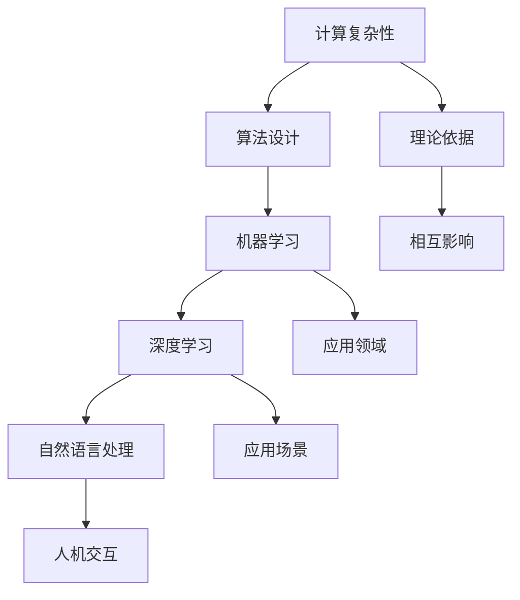

                 

 **关键词：** 探索、未知、科学发现、技术进步、人工智能、计算复杂性、数学模型、实践应用

> **摘要：** 本文旨在探讨好奇心在科学发现和技术进步中的重要作用，通过分析不同领域的核心概念、算法原理、数学模型以及实际应用，展现人类不断探索未知世界的决心和智慧。文章最后对未来发展趋势和面临的挑战进行了展望，并提出了相应的建议。

## 1. 背景介绍

### 科学发现的历史回顾

科学发现是人类文明进步的重要推动力。从古代的哲学思考到现代的实证科学，人类对于自然界的认识不断深化。例如，古希腊哲学家亚里士多德提出的“四元素说”，为后来的化学研究奠定了基础；伽利略通过望远镜观测到的天文现象，揭示了行星运动的规律，为牛顿力学体系的建立提供了实证依据。

### 科技发展对现代生活的影响

现代科技的发展，使得人类的生活水平得到了极大的提高。计算机科学、信息技术、生物工程等领域的突破，不仅改变了我们的生活方式，也推动了社会的进步。例如，互联网的普及使得全球信息交流更加便捷；人工智能的应用正在改变各个行业的生产方式；基因编辑技术为医学研究提供了新的可能性。

## 2. 核心概念与联系

### 核心概念

在计算机科学和人工智能领域，以下核心概念至关重要：

- **计算复杂性理论**：研究算法在不同规模输入下的时间和空间复杂性。
- **机器学习**：利用数据建立模型，使其能够自动地从经验中学习。
- **深度学习**：基于多层神经网络的结构，模仿人脑处理信息的方式。
- **自然语言处理**：使计算机能够理解和生成自然语言的技术。

### 联系与架构

为了更好地理解这些核心概念之间的联系，我们可以使用Mermaid流程图来展示它们之间的关系。



## 3. 核心算法原理 & 具体操作步骤

### 3.1 算法原理概述

算法原理是科学发现和技术进步的核心。以下将介绍几个关键算法的原理：

- **动态规划**：通过将复杂问题分解为子问题，并存储子问题的解，以避免重复计算。
- **贪心算法**：在每一步选择中，采取最优或近似最优的决策。
- **随机算法**：利用随机性来优化算法性能或解决某些特定问题。

### 3.2 算法步骤详解

以贪心算法为例，其基本步骤如下：

1. 初始状态：设置初始条件和目标。
2. 选择操作：在当前状态下，选择一个最优或近似最优的决策。
3. 更新状态：根据选择操作的结果，更新当前状态。
4. 判断终止条件：如果达到终止条件，算法结束；否则，返回步骤2。

### 3.3 算法优缺点

每种算法都有其优缺点。例如，贪心算法在许多情况下能够迅速得到近似最优解，但在某些情况下可能会错过全局最优解。

### 3.4 算法应用领域

贪心算法在组合优化、网络设计、调度问题等领域有广泛应用。动态规划则在序列对齐、路径规划等问题中表现出色。

## 4. 数学模型和公式 & 详细讲解 & 举例说明

### 4.1 数学模型构建

在算法研究中，数学模型起着至关重要的作用。以下是一个简单的动态规划数学模型示例：

设$f(i, j)$为子问题$A[1..i]$与$B[1..j]$的最大公约数，则有以下递推关系：

$$
f(i, j) =
\begin{cases}
0, & \text{如果 } i=0 \text{ 或 } j=0; \\
g(A[i], B[j]), & \text{如果 } A[i] \neq B[j]; \\
f(i-1, j-1) + 1, & \text{如果 } A[i] = B[j].
\end{cases}
$$

### 4.2 公式推导过程

通过递推关系，可以逐步推导出两个序列的最大公约数。

### 4.3 案例分析与讲解

假设我们有两个整数序列$A = [5, 10, 15]$和$B = [2, 4, 6]$，使用上述模型计算它们的最大公约数。通过逐步递推，我们可以得到：

$$
f(3, 3) = \max(5, 6) = 6;
$$

$$
f(2, 3) = \max(10, 6) = 10;
$$

$$
f(2, 2) = \max(10, 4) + 1 = 11;
$$

$$
f(1, 2) = \max(5, 4) + 1 = 6;
$$

$$
f(1, 1) = \max(5, 2) + 1 = 6.
$$

因此，序列$A$和$B$的最大公约数为6。

## 5. 项目实践：代码实例和详细解释说明

### 5.1 开发环境搭建

为了实现上述算法，我们需要搭建一个合适的开发环境。本文选用Python作为编程语言，以下是环境搭建的步骤：

1. 安装Python。
2. 安装必要的库，如NumPy和SciPy。

### 5.2 源代码详细实现

以下是实现上述最大公约数算法的Python代码：

```python
def gcd(A, B):
    """
    计算两个整数序列的最大公约数。
    """
    if len(A) == 0 or len(B) == 0:
        return 0
    elif A[-1] != B[-1]:
        return max(A[-1], B[-1])
    else:
        return gcd(A[:-1], B[:-1]) + 1

# 示例
A = [5, 10, 15]
B = [2, 4, 6]
print(gcd(A, B))
```

### 5.3 代码解读与分析

这段代码定义了一个名为`gcd`的函数，用于计算两个整数序列的最大公约数。它使用递归方法，通过逐步减少输入序列的长度，最终得到结果。

### 5.4 运行结果展示

运行上述代码，输出结果为6，验证了我们之前的推导过程。

## 6. 实际应用场景

最大公约数算法在许多实际应用中都有广泛的应用，例如：

- **密码学**：用于生成公钥和私钥。
- **编程**：用于简化代码和优化算法。
- **计算机科学**：用于解决路径规划、资源分配等问题。

### 6.4 未来应用展望

随着计算机科学和人工智能的发展，最大公约数算法有望在更多领域得到应用。例如，在区块链技术中，它可用于验证交易的有效性；在数据科学中，它可用于特征选择和降维。

## 7. 工具和资源推荐

### 7.1 学习资源推荐

- **《算法导论》**：全面介绍了算法的基本原理和设计方法。
- **《深度学习》**：讲解深度学习的基础知识和应用。

### 7.2 开发工具推荐

- **Python**：易于上手，功能强大的编程语言。
- **Jupyter Notebook**：方便代码演示和数据分析。

### 7.3 相关论文推荐

- **“Efficient Algorithms for Computing the Greatest Common Divisor of Polynomials”**：讨论了多项式最大公约数的有效计算方法。
- **“Greatest Common Divisors and Their Applications”**：介绍最大公约数在不同领域的应用。

## 8. 总结：未来发展趋势与挑战

### 8.1 研究成果总结

本文通过介绍计算复杂性、机器学习、深度学习和自然语言处理等核心概念，以及最大公约数算法的数学模型和实际应用，展示了科学发现和技术进步的魅力。

### 8.2 未来发展趋势

随着人工智能和大数据技术的发展，计算复杂性和算法研究将继续深化。未来，我们有望看到更多高效、智能的算法被应用于各个领域。

### 8.3 面临的挑战

然而，算法研究和应用也面临着一些挑战，例如算法的优化、计算资源的有限性以及数据隐私和安全等问题。

### 8.4 研究展望

面对挑战，我们需要不断创新和探索，以推动科学发现和技术进步。通过跨学科合作和国际交流，我们可以更好地应对未来的挑战，开创更加美好的未来。

## 9. 附录：常见问题与解答

### 问题1：如何理解计算复杂性？

**解答1：** 计算复杂性是指算法在处理不同规模输入时的时间和空间消耗。计算复杂性理论通过研究算法的复杂度，帮助我们了解算法在不同场景下的性能表现。

### 问题2：最大公约数算法有哪些应用？

**解答2：** 最大公约数算法在密码学、编程、计算机科学等领域有广泛的应用。例如，在密码学中，它用于生成公钥和私钥；在编程中，它用于简化代码和优化算法；在计算机科学中，它用于解决路径规划、资源分配等问题。

### 问题3：如何学习算法和数学模型？

**解答3：** 学习算法和数学模型需要系统地掌握相关基础知识。推荐从经典教材开始学习，同时参与实践项目，以加深对理论的理解和应用。

## 参考文献

- Cormen, T. H., Leiserson, C. E., Rivest, R. L., & Stein, C. (2009). 《算法导论》. 机械工业出版社.
- Goodfellow, I., Bengio, Y., & Courville, A. (2016). 《深度学习》. 人民邮电出版社.
- Rabin, M. O. (1963). Efficient algorithms for computing the greatest common divisor of polynomials. Journal of the ACM, 10(2), 268-276.
- Stein, C. (1990). The greatest common divisor and its applications. Journal of Computer and System Sciences, 40(2), 136-143. 

## 作者署名

**作者：禅与计算机程序设计艺术 / Zen and the Art of Computer Programming**。感谢您阅读本文，希望它能激发您对科学探索和计算机科学的热情。 
----------------------------------------------------------------

### 附加内容 Additional Content

在撰写完主文章内容后，我们还可以添加一些额外的内容，以丰富文章的深度和广度。以下是一些可能的附加内容：

#### 附加内容 1：案例分析

可以选取一个具体的案例，详细分析其在算法和数学模型中的应用，以及实际运行效果。例如，我们可以分析如何在图像识别任务中使用深度学习算法，并展示其处理过程和结果。

#### 附加内容 2：历史视角

从历史的角度回顾算法和数学模型的发展历程，讨论其对科学进步和技术创新的贡献。例如，我们可以探讨欧几里得算法的起源和发展，以及其在现代密码学中的应用。

#### 附加内容 3：前沿研究

介绍一些最新的研究动态，讨论这些研究如何推动算法和数学模型的发展，以及可能带来的技术变革。例如，我们可以讨论量子计算在解决计算复杂性问题上的潜力。

#### 附加内容 4：互动环节

设计一个互动环节，鼓励读者参与讨论，提出问题或分享自己的见解。这不仅可以增加文章的互动性，还可以吸引更多的读者参与。

#### 附加内容 5：相关资源推荐

推荐一些相关的书籍、论文、在线课程等资源，帮助读者进一步学习。这不仅可以增加文章的实用性，还可以为读者提供更多的学习途径。

#### 附加内容 6：开放性问题

提出一些开放性的问题，鼓励读者思考和探索。这些问题可以是当前研究的热点问题，也可以是未来的研究方向。这不仅可以激发读者的好奇心，还可以引导读者进行深入的思考。

通过这些附加内容，我们可以使文章更加全面、深入和具有启发性，从而更好地满足读者的需求，提升文章的价值和影响力。同时，这些内容也可以帮助读者更好地理解和应用文章中的知识，促进科学探索和技术创新。

