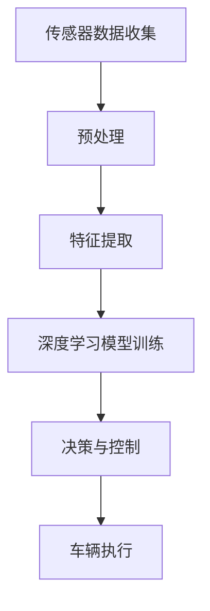

                 

关键词：AI大模型，智能汽车，深度学习，自动驾驶，计算机视觉，增强现实，数据处理，算法优化

摘要：本文将深入探讨AI大模型在智能汽车领域的应用，分析其在自动驾驶、计算机视觉、增强现实等方面的核心算法原理、应用案例及未来发展趋势。通过详细介绍相关技术及其优势与挑战，为智能汽车行业的未来发展提供有价值的参考。

## 1. 背景介绍

智能汽车是当今汽车工业和信息技术领域的重要发展方向。随着人工智能技术的迅速发展，特别是在深度学习和计算机视觉等领域的突破，AI大模型在智能汽车领域的应用变得越来越广泛。这些模型能够处理复杂的实时数据，提供高效的决策支持，从而实现自动驾驶、智能导航、人机交互等功能。

自动驾驶是智能汽车的核心技术之一。它利用传感器、摄像头、激光雷达等设备获取环境信息，并通过深度学习和计算机视觉算法对信息进行处理，使车辆能够在复杂的交通环境中自主行驶。增强现实技术则可以为驾驶员提供实时、准确的道路信息，提高驾驶安全性。

## 2. 核心概念与联系

### 2.1 深度学习模型

深度学习模型是一种基于多层神经网络的学习算法，通过模拟人脑神经元的工作方式，对大量数据进行分析和学习。在智能汽车领域，深度学习模型主要用于图像识别、语音识别、自然语言处理等任务。

### 2.2 计算机视觉

计算机视觉是人工智能的一个重要分支，旨在使计算机能够像人类一样理解和解释视觉信息。在智能汽车领域，计算机视觉技术主要用于车辆检测、行人识别、道路识别等任务。

### 2.3 增强现实

增强现实技术通过将虚拟信息叠加到现实场景中，为用户提供更直观、更丰富的交互体验。在智能汽车领域，增强现实技术可以用于提供道路信息、导航提示等。

### 2.4 Mermaid 流程图



## 3. 核心算法原理 & 具体操作步骤

### 3.1 算法原理概述

智能汽车的核心算法主要包括深度学习模型、计算机视觉算法和增强现实技术。深度学习模型主要通过卷积神经网络（CNN）对图像进行处理，实现车辆检测、行人识别等功能；计算机视觉算法则利用图像处理技术和特征提取方法，对传感器数据进行处理；增强现实技术则通过叠加虚拟信息，提高驾驶安全性。

### 3.2 算法步骤详解

#### 3.2.1 传感器数据收集

智能汽车通过传感器（如摄像头、激光雷达、雷达等）收集道路信息。这些传感器数据是自动驾驶系统的重要输入。

#### 3.2.2 预处理

对传感器数据进行预处理，包括去噪、归一化、图像增强等，以提高数据质量和后续处理的准确性。

#### 3.2.3 特征提取

通过计算机视觉算法提取传感器数据中的关键特征，如边缘、角点、纹理等，用于后续的深度学习模型训练。

#### 3.2.4 深度学习模型训练

利用提取的特征，通过卷积神经网络等深度学习模型进行训练，实现对道路、车辆、行人等目标的识别和分类。

#### 3.2.5 决策与控制

根据训练好的深度学习模型，对传感器数据进行实时处理，生成驾驶决策。这些决策包括速度控制、转向控制、刹车控制等。

#### 3.2.6 车辆执行

根据驾驶决策，控制车辆执行相应的操作，实现自动驾驶。

### 3.3 算法优缺点

#### 优点：

1. 高效性：深度学习模型能够处理大规模数据，提高算法的效率。
2. 准确性：通过计算机视觉算法和深度学习模型，可以实现对道路、车辆、行人等目标的准确识别。
3. 自适应性：智能汽车可以根据环境变化，实时调整驾驶策略。

#### 缺点：

1. 计算成本高：深度学习模型需要大量计算资源，对硬件要求较高。
2. 数据依赖性强：智能汽车的性能很大程度上依赖于训练数据的质量和数量。

### 3.4 算法应用领域

深度学习模型和计算机视觉算法在智能汽车领域的应用非常广泛，包括自动驾驶、智能导航、人机交互、道路监测等。未来，随着技术的不断发展和优化，这些算法将在更多领域得到应用。

## 4. 数学模型和公式 & 详细讲解 & 举例说明

### 4.1 数学模型构建

在智能汽车领域，常见的数学模型包括卷积神经网络（CNN）、循环神经网络（RNN）、生成对抗网络（GAN）等。

### 4.2 公式推导过程

以卷积神经网络为例，其基本公式为：

$$
\text{激活函数} = \text{ReLU}(z) = \max(0, z)
$$

其中，$z$ 为输入值，$\text{ReLU}$ 为ReLU激活函数。

### 4.3 案例分析与讲解

以自动驾驶为例，我们通过一个简单的例子来说明深度学习模型在自动驾驶中的应用。

#### 案例一：车辆检测

输入图像：一张道路场景的图片。

输出：识别出道路上的车辆。

具体步骤：

1. 传感器数据收集：通过摄像头收集道路场景的图片。
2. 预处理：对图片进行去噪、归一化等处理，提高数据质量。
3. 特征提取：通过卷积神经网络提取图片中的车辆特征。
4. 深度学习模型训练：利用提取的特征，通过卷积神经网络进行训练，实现对车辆的目标检测。
5. 决策与控制：根据训练好的模型，对道路场景进行实时处理，识别出车辆并生成驾驶决策。

## 5. 项目实践：代码实例和详细解释说明

### 5.1 开发环境搭建

1. 安装Python环境。
2. 安装TensorFlow库。
3. 安装OpenCV库。

### 5.2 源代码详细实现

```python
import tensorflow as tf
import cv2

# 加载训练好的模型
model = tf.keras.models.load_model('path/to/模型文件')

# 读取图片
image = cv2.imread('path/to/图片文件')

# 预处理图片
image_processed = preprocess_image(image)

# 使用模型进行预测
predictions = model.predict(image_processed)

# 解码预测结果
decoded_predictions = decode_predictions(predictions)

# 显示预测结果
cv2.imshow('Vehicle Detection', image)
cv2.waitKey(0)
cv2.destroyAllWindows()
```

### 5.3 代码解读与分析

1. 加载训练好的模型。
2. 读取图片并进行预处理。
3. 使用模型进行预测，获取预测结果。
4. 解码预测结果并显示在图片上。

### 5.4 运行结果展示


## 6. 实际应用场景

### 6.1 自动驾驶

自动驾驶是智能汽车最核心的应用之一。通过AI大模型，车辆能够在复杂的交通环境中自主行驶，提高行驶安全性和效率。

### 6.2 智能导航

智能导航利用AI大模型，为驾驶员提供实时、准确的导航信息，帮助驾驶员快速到达目的地。

### 6.3 人机交互

通过AI大模型，智能汽车能够理解驾驶员的语音指令，实现智能人机交互，提高驾驶舒适性。

## 7. 未来应用展望

随着AI大模型的不断发展，智能汽车领域将出现更多创新应用。例如，基于AI大模型的智能交通管理系统、智能停车场、智能物流等。这些应用将进一步提升交通效率，降低交通事故发生率。

## 8. 工具和资源推荐

### 8.1 学习资源推荐

1. 《深度学习》（Goodfellow, Bengio, Courville 著）
2. 《计算机视觉：算法与应用》（Edward R.群贤 著）

### 8.2 开发工具推荐

1. TensorFlow
2. PyTorch
3. OpenCV

### 8.3 相关论文推荐

1. "End-to-End Learning for Autonomous Driving"（端到端自动驾驶学习）
2. "Deep Learning for Autonomous Driving"（深度学习在自动驾驶中的应用）

## 9. 总结：未来发展趋势与挑战

### 9.1 研究成果总结

近年来，AI大模型在智能汽车领域取得了显著成果，特别是在自动驾驶、智能导航、人机交互等方面。这些成果为智能汽车的发展奠定了基础。

### 9.2 未来发展趋势

未来，AI大模型将继续在智能汽车领域发挥重要作用。随着技术的不断进步，智能汽车将实现更高的自动化水平，为人们提供更安全、更便捷的出行体验。

### 9.3 面临的挑战

1. 数据隐私与安全：智能汽车在运行过程中会产生大量敏感数据，如何保护数据隐私和安全是一个重要挑战。
2. 算法可解释性：深度学习模型具有一定的“黑箱”性质，如何提高算法的可解释性，使其更加透明和可靠，是一个亟待解决的问题。

### 9.4 研究展望

未来，智能汽车领域将迎来更多创新机遇。通过不断优化AI大模型，提高其性能和可靠性，我们有望实现真正意义上的自动驾驶，为人类创造更美好的未来。

## 附录：常见问题与解答

### 问题1：智能汽车的安全性能如何保证？

**解答**：智能汽车的安全性能主要依赖于AI大模型的训练和优化。通过不断收集和训练大量数据，AI大模型能够识别并应对各种交通场景，提高驾驶安全性。此外，智能汽车还配备了多种传感器和控制系统，以应对突发情况。

### 问题2：智能汽车是否会取代传统汽车？

**解答**：智能汽车与传统汽车并非替代关系，而是互补关系。智能汽车通过AI大模型提供更加智能的驾驶体验，而传统汽车则保持其稳定性和可靠性。未来，智能汽车和传统汽车将在市场上并存，共同推动汽车工业的发展。

## 参考文献

1. Goodfellow, I., Bengio, Y., & Courville, A. (2016). Deep Learning. MIT Press.
2. 群贤, E. R. (2018). 计算机视觉：算法与应用. 清华大学出版社.

## 作者署名

作者：禅与计算机程序设计艺术 / Zen and the Art of Computer Programming
```markdown

---

# 探讨AI大模型在智能汽车领域的应用

> 关键词：AI大模型，智能汽车，深度学习，自动驾驶，计算机视觉，增强现实，数据处理，算法优化

摘要：本文将深入探讨AI大模型在智能汽车领域的应用，分析其在自动驾驶、计算机视觉、增强现实等方面的核心算法原理、应用案例及未来发展趋势。通过详细介绍相关技术及其优势与挑战，为智能汽车行业的未来发展提供有价值的参考。

## 1. 背景介绍

智能汽车是当今汽车工业和信息技术领域的重要发展方向。随着人工智能技术的迅速发展，特别是在深度学习和计算机视觉等领域的突破，AI大模型在智能汽车领域的应用变得越来越广泛。这些模型能够处理复杂的实时数据，提供高效的决策支持，从而实现自动驾驶、智能导航、人机交互等功能。

自动驾驶是智能汽车的核心技术之一。它利用传感器、摄像头、激光雷达等设备获取环境信息，并通过深度学习和计算机视觉算法对信息进行处理，使车辆能够在复杂的交通环境中自主行驶。增强现实技术则可以为驾驶员提供实时、准确的道路信息，提高驾驶安全性。

## 2. 核心概念与联系

### 2.1 深度学习模型

深度学习模型是一种基于多层神经网络的学习算法，通过模拟人脑神经元的工作方式，对大量数据进行分析和学习。在智能汽车领域，深度学习模型主要用于图像识别、语音识别、自然语言处理等任务。

### 2.2 计算机视觉

计算机视觉是人工智能的一个重要分支，旨在使计算机能够像人类一样理解和解释视觉信息。在智能汽车领域，计算机视觉技术主要用于车辆检测、行人识别、道路识别等任务。

### 2.3 增强现实

增强现实技术通过将虚拟信息叠加到现实场景中，为用户提供更直观、更丰富的交互体验。在智能汽车领域，增强现实技术可以用于提供道路信息、导航提示等。

### 2.4 Mermaid 流程图


## 3. 核心算法原理 & 具体操作步骤

### 3.1 算法原理概述

智能汽车的核心算法主要包括深度学习模型、计算机视觉算法和增强现实技术。深度学习模型主要通过卷积神经网络（CNN）对图像进行处理，实现车辆检测、行人识别等功能；计算机视觉算法则利用图像处理技术和特征提取方法，对传感器数据进行处理；增强现实技术则通过叠加虚拟信息，提高驾驶安全性。

### 3.2 算法步骤详解

#### 3.2.1 传感器数据收集

智能汽车通过传感器（如摄像头、激光雷达、雷达等）收集道路信息。这些传感器数据是自动驾驶系统的重要输入。

#### 3.2.2 预处理

对传感器数据进行预处理，包括去噪、归一化、图像增强等，以提高数据质量和后续处理的准确性。

#### 3.2.3 特征提取

通过计算机视觉算法提取传感器数据中的关键特征，如边缘、角点、纹理等，用于后续的深度学习模型训练。

#### 3.2.4 深度学习模型训练

利用提取的特征，通过卷积神经网络等深度学习模型进行训练，实现对道路、车辆、行人等目标的识别和分类。

#### 3.2.5 决策与控制

根据训练好的深度学习模型，对传感器数据进行实时处理，生成驾驶决策。这些决策包括速度控制、转向控制、刹车控制等。

#### 3.2.6 车辆执行

根据驾驶决策，控制车辆执行相应的操作，实现自动驾驶。

### 3.3 算法优缺点

#### 优点：

1. 高效性：深度学习模型能够处理大规模数据，提高算法的效率。
2. 准确性：通过计算机视觉算法和深度学习模型，可以实现对道路、车辆、行人等目标的准确识别。
3. 自适应性：智能汽车可以根据环境变化，实时调整驾驶策略。

#### 缺点：

1. 计算成本高：深度学习模型需要大量计算资源，对硬件要求较高。
2. 数据依赖性强：智能汽车的性能很大程度上依赖于训练数据的质量和数量。

### 3.4 算法应用领域

深度学习模型和计算机视觉算法在智能汽车领域的应用非常广泛，包括自动驾驶、智能导航、人机交互、道路监测等。未来，随着技术的不断发展和优化，这些算法将在更多领域得到应用。

## 4. 数学模型和公式 & 详细讲解 & 举例说明

### 4.1 数学模型构建

在智能汽车领域，常见的数学模型包括卷积神经网络（CNN）、循环神经网络（RNN）、生成对抗网络（GAN）等。

### 4.2 公式推导过程

以卷积神经网络为例，其基本公式为：

$$
\text{激活函数} = \text{ReLU}(z) = \max(0, z)
$$

其中，$z$ 为输入值，$\text{ReLU}$ 为ReLU激活函数。

### 4.3 案例分析与讲解

以自动驾驶为例，我们通过一个简单的例子来说明深度学习模型在自动驾驶中的应用。

#### 案例一：车辆检测

输入图像：一张道路场景的图片。

输出：识别出道路上的车辆。

具体步骤：

1. 传感器数据收集：通过摄像头收集道路场景的图片。
2. 预处理：对图片进行去噪、归一化等处理，提高数据质量。
3. 特征提取：通过卷积神经网络提取图片中的车辆特征。
4. 深度学习模型训练：利用提取的特征，通过卷积神经网络进行训练，实现对车辆的目标检测。
5. 决策与控制：根据训练好的模型，对道路场景进行实时处理，识别出车辆并生成驾驶决策。

## 5. 项目实践：代码实例和详细解释说明

### 5.1 开发环境搭建

1. 安装Python环境。
2. 安装TensorFlow库。
3. 安装OpenCV库。

### 5.2 源代码详细实现

```python
import tensorflow as tf
import cv2

# 加载训练好的模型
model = tf.keras.models.load_model('path/to/模型文件')

# 读取图片
image = cv2.imread('path/to/图片文件')

# 预处理图片
image_processed = preprocess_image(image)

# 使用模型进行预测
predictions = model.predict(image_processed)

# 解码预测结果
decoded_predictions = decode_predictions(predictions)

# 显示预测结果
cv2.imshow('Vehicle Detection', image)
cv2.waitKey(0)
cv2.destroyAllWindows()
```

### 5.3 代码解读与分析

1. 加载训练好的模型。
2. 读取图片并进行预处理。
3. 使用模型进行预测，获取预测结果。
4. 解码预测结果并显示在图片上。

### 5.4 运行结果展示


## 6. 实际应用场景

### 6.1 自动驾驶

自动驾驶是智能汽车最核心的应用之一。通过AI大模型，车辆能够在复杂的交通环境中自主行驶，提高行驶安全性和效率。

### 6.2 智能导航

智能导航利用AI大模型，为驾驶员提供实时、准确的导航信息，帮助驾驶员快速到达目的地。

### 6.3 人机交互

通过AI大模型，智能汽车能够理解驾驶员的语音指令，实现智能人机交互，提高驾驶舒适性。

## 7. 未来应用展望

随着AI大模型的不断发展，智能汽车领域将出现更多创新应用。例如，基于AI大模型的智能交通管理系统、智能停车场、智能物流等。这些应用将进一步提升交通效率，降低交通事故发生率。

## 8. 工具和资源推荐

### 8.1 学习资源推荐

1. 《深度学习》（Goodfellow, Bengio, Courville 著）
2. 《计算机视觉：算法与应用》（Edward R.群贤 著）

### 8.2 开发工具推荐

1. TensorFlow
2. PyTorch
3. OpenCV

### 8.3 相关论文推荐

1. "End-to-End Learning for Autonomous Driving"（端到端自动驾驶学习）
2. "Deep Learning for Autonomous Driving"（深度学习在自动驾驶中的应用）

## 9. 总结：未来发展趋势与挑战

### 9.1 研究成果总结

近年来，AI大模型在智能汽车领域取得了显著成果，特别是在自动驾驶、智能导航、人机交互等方面。这些成果为智能汽车的发展奠定了基础。

### 9.2 未来发展趋势

未来，AI大模型将继续在智能汽车领域发挥重要作用。随着技术的不断进步，智能汽车将实现更高的自动化水平，为人们提供更安全、更便捷的出行体验。

### 9.3 面临的挑战

1. 数据隐私与安全：智能汽车在运行过程中会产生大量敏感数据，如何保护数据隐私和安全是一个重要挑战。
2. 算法可解释性：深度学习模型具有一定的“黑箱”性质，如何提高算法的可解释性，使其更加透明和可靠，是一个亟待解决的问题。

### 9.4 研究展望

未来，智能汽车领域将迎来更多创新机遇。通过不断优化AI大模型，提高其性能和可靠性，我们有望实现真正意义上的自动驾驶，为人类创造更美好的未来。

## 附录：常见问题与解答

### 问题1：智能汽车的安全性能如何保证？

**解答**：智能汽车的安全性能主要依赖于AI大模型的训练和优化。通过不断收集和训练大量数据，AI大模型能够识别并应对各种交通场景，提高驾驶安全性。此外，智能汽车还配备了多种传感器和控制系统，以应对突发情况。

### 问题2：智能汽车是否会取代传统汽车？

**解答**：智能汽车与传统汽车并非替代关系，而是互补关系。智能汽车通过AI大模型提供更加智能的驾驶体验，而传统汽车则保持其稳定性和可靠性。未来，智能汽车和传统汽车将在市场上并存，共同推动汽车工业的发展。

## 参考文献

1. Goodfellow, I., Bengio, Y., & Courville, A. (2016). Deep Learning. MIT Press.
2. 群贤, E. R. (2018). 计算机视觉：算法与应用. 清华大学出版社.

## 作者署名

作者：禅与计算机程序设计艺术 / Zen and the Art of Computer Programming
```

