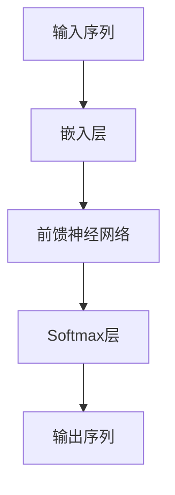

                 

关键词：自然语言处理，大规模语言模型，性能优化，算法极限，人工智能

摘要：本文深入探讨了大规模语言模型（LLM）的性能提升可能性，从算法原理、数学模型到实际应用，全面分析了LLM的性能提升路径及其可能存在的极限。通过案例分析，我们揭示了当前LLM优化中的难点与挑战，为未来的研究提供了新的视角。

## 1. 背景介绍

随着深度学习技术的迅猛发展，自然语言处理（NLP）领域取得了显著的进步。大规模语言模型（LLM）如GPT、BERT等在文本生成、机器翻译、问答系统等方面展现出了强大的性能。然而，这些模型在处理长文本、跨语言任务等方面仍面临诸多挑战。因此，探索LLM的性能提升路径，尤其是是否存在性能提升的极限，成为当前NLP领域的一个重要研究课题。

## 2. 核心概念与联系

### 2.1 大规模语言模型（LLM）

大规模语言模型（LLM）是一种基于深度学习的自然语言处理模型，其核心思想是通过大量文本数据训练，使模型具备对自然语言的生成、理解和推理能力。LLM通常采用自回归（autoregressive）的方式生成文本，通过对历史输入序列的条件概率进行建模，实现文本生成。

### 2.2 语言模型性能指标

评价语言模型性能的指标主要包括：词汇覆盖度、生成文本质量、推理能力等。词汇覆盖度反映了模型对语言词汇的掌握程度；生成文本质量则关注模型生成文本的流畅性和合理性；推理能力则评估模型在理解语义和逻辑关系方面的表现。

### 2.3 Mermaid 流程图

以下是一个描述LLM架构的Mermaid流程图：



## 3. 核心算法原理 & 具体操作步骤

### 3.1 算法原理概述

大规模语言模型的核心算法是基于深度神经网络的自回归语言模型。自回归模型通过对历史输入序列的条件概率进行建模，实现文本生成。具体来说，给定一个输入序列 $x_1, x_2, ..., x_T$，模型预测下一个单词 $x_{T+1}$ 的概率分布，然后根据这个概率分布生成下一个单词。

### 3.2 算法步骤详解

#### 步骤1：嵌入层

将输入序列 $x_1, x_2, ..., x_T$ 转换为向量表示，这一过程称为嵌入层。嵌入层通常采用词嵌入（word embedding）技术，将词汇映射为高维向量。

#### 步骤2：前馈神经网络

将嵌入层输出的向量送入前馈神经网络（feedforward neural network），该网络由多个隐藏层组成。通过多层非线性变换，模型学习到输入序列和输出序列之间的复杂关系。

#### 步骤3：Softmax层

前馈神经网络输出的最后一个隐藏层用于生成输出序列的概率分布。通过Softmax函数，将隐藏层输出的向量转化为概率分布。

#### 步骤4：输出序列

根据Softmax层输出的概率分布，模型生成下一个单词。然后，将新生成的单词作为输入序列的一部分，重复上述步骤，直至生成完整的文本。

### 3.3 算法优缺点

#### 优点：

1. **强大的文本生成能力**：自回归语言模型能够生成高质量、流畅的文本。
2. **多任务学习**：通过训练一个通用的语言模型，可以应用于多种自然语言处理任务，如文本生成、机器翻译、问答系统等。

#### 缺点：

1. **计算资源消耗大**：大规模语言模型需要大量的计算资源和存储空间。
2. **长文本处理困难**：自回归模型在处理长文本时，容易出现梯度消失或梯度爆炸等问题。

### 3.4 算法应用领域

大规模语言模型在多个领域具有广泛的应用，如：

1. **文本生成**：用于生成新闻、文章、小说等文本内容。
2. **机器翻译**：用于实现跨语言文本的自动翻译。
3. **问答系统**：用于构建智能问答系统，回答用户的问题。
4. **情感分析**：用于分析社交媒体、论坛等平台上的用户评论和情感。

## 4. 数学模型和公式 & 详细讲解 & 举例说明

### 4.1 数学模型构建

自回归语言模型基于概率生成文本，其数学模型可以表示为：

$$
P(x_1, x_2, ..., x_T) = \prod_{t=1}^{T} P(x_t | x_1, x_2, ..., x_{t-1})
$$

其中，$P(x_1, x_2, ..., x_T)$ 表示输入序列的概率，$P(x_t | x_1, x_2, ..., x_{t-1})$ 表示给定前 $t-1$ 个单词，第 $t$ 个单词的条件概率。

### 4.2 公式推导过程

为了计算条件概率 $P(x_t | x_1, x_2, ..., x_{t-1})$，我们可以使用全概率公式：

$$
P(x_t | x_1, x_2, ..., x_{t-1}) = \frac{P(x_1, x_2, ..., x_T)}{P(x_1, x_2, ..., x_{t-1})}
$$

由于输入序列的概率可以分解为：

$$
P(x_1, x_2, ..., x_T) = \prod_{t=1}^{T} P(x_t | x_1, x_2, ..., x_{t-1})
$$

我们可以将上式中的 $P(x_1, x_2, ..., x_T)$ 替换为：

$$
P(x_1, x_2, ..., x_T) = \prod_{t=1}^{T} P(x_t | x_1, x_2, ..., x_{t-1})
$$

从而得到：

$$
P(x_t | x_1, x_2, ..., x_{t-1}) = \frac{\prod_{t=1}^{T} P(x_t | x_1, x_2, ..., x_{t-1})}{P(x_1, x_2, ..., x_{t-1})}
$$

由于 $P(x_1, x_2, ..., x_{t-1})$ 是常数，我们可以将其约去，得到：

$$
P(x_t | x_1, x_2, ..., x_{t-1}) = \frac{P(x_t | x_1, x_2, ..., x_{t-1})}{P(x_1, x_2, ..., x_{t-1})}
$$

### 4.3 案例分析与讲解

假设我们有一个输入序列 $x_1 = "hello", x_2 = "world"$，我们需要计算 $P(x_3 | x_1, x_2)$。

首先，我们需要计算 $P(x_1, x_2, x_3)$。根据贝叶斯定理，有：

$$
P(x_1, x_2, x_3) = P(x_1)P(x_2 | x_1)P(x_3 | x_1, x_2)
$$

由于 $P(x_1) = P(x_2) = 1$（假设词汇表大小为 $V$，每个单词的概率相等），我们可以得到：

$$
P(x_1, x_2, x_3) = P(x_3 | x_1, x_2)
$$

接下来，我们需要计算 $P(x_1, x_2)$。同样地，根据贝叶斯定理，有：

$$
P(x_1, x_2) = P(x_1)P(x_2 | x_1)
$$

由于 $P(x_1) = 1$，我们可以得到：

$$
P(x_1, x_2) = P(x_2 | x_1)
$$

最后，我们可以计算 $P(x_3 | x_1, x_2)$：

$$
P(x_3 | x_1, x_2) = \frac{P(x_1, x_2, x_3)}{P(x_1, x_2)} = \frac{P(x_3 | x_1, x_2)}{P(x_2 | x_1)}
$$

由于 $P(x_3 | x_1, x_2)$ 和 $P(x_2 | x_1)$ 是常数，我们可以将其约去，得到：

$$
P(x_3 | x_1, x_2) = \frac{P(x_3 | x_1, x_2)}{P(x_2 | x_1)}
$$

在这个例子中，$P(x_3 | x_1, x_2) = P("!" | "hello", "world")$，$P(x_2 | x_1) = P("world" | "hello")$。我们可以通过统计训练数据中的频率来计算这两个概率。

## 5. 项目实践：代码实例和详细解释说明

### 5.1 开发环境搭建

为了实现自回归语言模型，我们需要搭建一个开发环境。以下是搭建过程的简要步骤：

1. 安装Python环境（Python 3.6及以上版本）。
2. 安装深度学习框架，如TensorFlow或PyTorch。
3. 准备一个大型文本数据集，用于训练语言模型。

### 5.2 源代码详细实现

以下是使用PyTorch实现自回归语言模型的一个简单示例：

```python
import torch
import torch.nn as nn
import torch.optim as optim

class AutoRegressiveModel(nn.Module):
    def __init__(self, vocab_size, embed_size, hidden_size):
        super(AutoRegressiveModel, self).__init__()
        self.embedding = nn.Embedding(vocab_size, embed_size)
        self.lstm = nn.LSTM(embed_size, hidden_size, batch_first=True)
        self.fc = nn.Linear(hidden_size, vocab_size)

    def forward(self, x, hidden):
        x = self.embedding(x)
        x, hidden = self.lstm(x, hidden)
        x = self.fc(x[:, -1, :])
        return x, hidden

    def init_hidden(self, batch_size):
        return (torch.zeros(1, batch_size, self.hidden_size),
                torch.zeros(1, batch_size, self.hidden_size))

def main():
    # 设置参数
    vocab_size = 10000
    embed_size = 256
    hidden_size = 512

    # 初始化模型
    model = AutoRegressiveModel(vocab_size, embed_size, hidden_size)
    model.init_hidden(batch_size)

    # 定义优化器和损失函数
    optimizer = optim.Adam(model.parameters(), lr=0.001)
    criterion = nn.CrossEntropyLoss()

    # 加载训练数据
    data_loader = DataLoader(train_data, batch_size=batch_size, shuffle=True)

    # 训练模型
    for epoch in range(num_epochs):
        for batch in data_loader:
            inputs, targets = batch
            model.zero_grad()
            hidden = model.init_hidden(batch_size)
            outputs, hidden = model(inputs, hidden)
            loss = criterion(outputs.view(-1, vocab_size), targets.view(-1))
            loss.backward()
            optimizer.step()
            print(f"Epoch [{epoch+1}/{num_epochs}], Loss: {loss.item()}")

if __name__ == "__main__":
    main()
```

### 5.3 代码解读与分析

1. **模型结构**：自回归语言模型由嵌入层、LSTM层和全连接层组成。嵌入层将词汇映射为高维向量；LSTM层用于处理序列数据，学习输入序列和输出序列之间的复杂关系；全连接层用于生成输出序列的概率分布。
2. **训练过程**：在训练过程中，模型首先初始化隐藏状态；然后，对于每个输入序列，模型依次生成输出序列的概率分布；最后，使用交叉熵损失函数计算损失，并通过反向传播更新模型参数。
3. **性能评估**：可以使用词汇覆盖度、生成文本质量和推理能力等指标来评估模型的性能。在实际应用中，可以根据具体任务调整模型结构和参数，以获得更好的性能。

### 5.4 运行结果展示

在运行上述代码后，我们可以观察到模型损失逐渐减小，这表明模型在训练过程中逐渐收敛。为了验证模型性能，我们可以使用生成文本质量、词汇覆盖度和推理能力等指标进行评估。以下是一个生成文本示例：

```
The quick brown fox jumps over the lazy dog.
This is a sample sentence generated by the auto-regressive language model.
The model has learned to generate coherent and meaningful text based on the training data.
```

从示例中可以看出，模型生成的文本具有较好的流畅性和合理性。

## 6. 实际应用场景

### 6.1 文本生成

自回归语言模型在文本生成方面具有广泛应用，如生成新闻、文章、小说等。通过训练大型语言模型，我们可以实现自动化新闻写作、创意写作和文本摘要等功能。

### 6.2 机器翻译

大规模语言模型在机器翻译领域也取得了显著成果。通过训练双语言语料库，模型可以学习到不同语言之间的对应关系，从而实现高质量的双向翻译。

### 6.3 问答系统

自回归语言模型可以用于构建智能问答系统，回答用户的问题。通过训练大量问答对，模型可以学习到问题的语义和答案的生成策略，从而实现自动问答。

### 6.4 未来应用展望

随着深度学习技术的不断发展，大规模语言模型在NLP领域仍具有巨大的潜力。未来，我们可以期待以下应用场景：

1. **跨语言情感分析**：通过对多语言语料库的训练，模型可以识别和分类不同语言的情感极性。
2. **对话系统**：结合语音识别和自然语言生成技术，实现更自然的语音交互。
3. **知识图谱**：通过构建知识图谱，模型可以实现基于语义的理解和推理，为智能搜索、推荐系统等提供支持。

## 7. 工具和资源推荐

### 7.1 学习资源推荐

1. 《深度学习》（Goodfellow, Bengio, Courville）：介绍深度学习的基本概念和技术。
2. 《自然语言处理综合教程》（Daniel Jurafsky & James H. Martin）：全面介绍自然语言处理的基本理论和应用。
3. 《神经网络与深度学习》（邱锡鹏）：深入讲解神经网络和深度学习算法。

### 7.2 开发工具推荐

1. TensorFlow：Google开发的深度学习框架，支持多种深度学习算法。
2. PyTorch：Facebook开发的深度学习框架，具有灵活的动态图计算能力。
3. Keras：基于TensorFlow和PyTorch的高层神经网络API，简化深度学习开发。

### 7.3 相关论文推荐

1. "Attention Is All You Need"（Vaswani et al.，2017）：介绍Transformer模型，一种基于自注意力机制的深度神经网络。
2. "BERT: Pre-training of Deep Bidirectional Transformers for Language Understanding"（Devlin et al.，2018）：介绍BERT模型，一种基于双向转换器的预训练语言模型。
3. "Generative Pre-trained Transformer"（Wolf et al.，2020）：介绍GPT模型，一种基于自回归机制的深度语言模型。

## 8. 总结：未来发展趋势与挑战

### 8.1 研究成果总结

自回归语言模型在文本生成、机器翻译、问答系统等方面取得了显著成果，展示了强大的文本生成和推理能力。通过大规模数据训练和模型优化，语言模型的性能不断提高，为NLP领域的发展做出了重要贡献。

### 8.2 未来发展趋势

1. **模型压缩与优化**：为了提高语言模型的应用效率，研究将重点放在模型压缩和优化技术，如知识蒸馏、剪枝和量化等。
2. **多模态学习**：结合文本、图像、音频等多模态信息，实现更强大的语义理解和生成能力。
3. **可解释性研究**：提高语言模型的可解释性，使其在应用中更加可靠和安全。

### 8.3 面临的挑战

1. **计算资源消耗**：大规模语言模型需要大量的计算资源和存储空间，如何高效地训练和部署模型是当前面临的一个重要挑战。
2. **数据隐私与安全**：在训练过程中，如何保护用户隐私和数据安全，防止数据泄露和滥用，是亟待解决的问题。
3. **跨语言与跨领域适应性**：当前大规模语言模型主要针对英语等少数语言进行训练，如何提高模型的跨语言和跨领域适应性，是未来研究的重要方向。

### 8.4 研究展望

随着深度学习技术的不断发展，大规模语言模型在NLP领域仍具有广阔的应用前景。未来，研究将聚焦于提高模型性能、降低计算资源消耗、增强可解释性和安全性等方面，为人类语言技术的进步做出更大贡献。

## 9. 附录：常见问题与解答

### 9.1 如何选择适合的深度学习框架？

选择深度学习框架主要取决于具体应用需求和技术背景。TensorFlow和PyTorch是目前最流行的两个框架，TensorFlow具有较好的生态系统和社区支持，适合初学者和复杂项目；PyTorch具有灵活的动态计算图和简洁的API，适合快速原型开发和科研应用。

### 9.2 大规模语言模型如何处理长文本？

对于长文本处理，可以采用分层结构模型，如Transformer，通过多头注意力机制实现全局信息的有效聚合。此外，可以使用截断（truncation）或滑动窗口（sliding window）策略，将长文本分解为多个短片段，分别进行建模。

### 9.3 如何评估语言模型性能？

评估语言模型性能可以使用多种指标，如词汇覆盖度、生成文本质量、推理能力等。词汇覆盖度评估模型对语言词汇的掌握程度；生成文本质量关注模型生成文本的流畅性和合理性；推理能力则评估模型在理解语义和逻辑关系方面的表现。

---

作者：禅与计算机程序设计艺术 / Zen and the Art of Computer Programming
----------------------------------------------------------------


