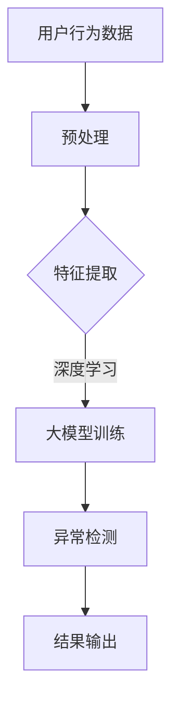

                 

关键词：大模型，用户行为异常检测，电商平台，深度学习，数据分析，算法

> 摘要：随着电商平台的快速发展，用户行为数据的海量增长带来了用户行为异常检测的挑战。本文探讨了使用大模型进行用户行为异常检测的潜力，包括其核心概念、算法原理、数学模型、实践案例以及未来应用展望。

## 1. 背景介绍

随着互联网技术的飞速发展，电商平台已经成为现代商业活动中不可或缺的一部分。用户在电商平台上的行为数据量以指数级增长，这些数据中蕴含着用户购物习惯、兴趣爱好、行为模式等信息。然而，这也带来了用户行为异常检测的挑战。用户行为异常检测是指在大量用户行为数据中，识别出与正常行为显著不同的行为，以便及时发现潜在的欺诈、恶意评论、账号异常等行为。

传统的用户行为异常检测方法主要依赖于统计分析和机器学习算法，如逻辑回归、决策树、K-近邻等。然而，这些方法在面对复杂的用户行为模式和海量数据时，效果往往有限。近年来，大模型的兴起为用户行为异常检测带来了新的可能性。大模型具有强大的表征能力和处理海量数据的能力，使其在用户行为异常检测中具有巨大的潜力。

## 2. 核心概念与联系

### 大模型

大模型指的是具有数十亿甚至数万亿参数的深度学习模型。这些模型通常基于神经网络架构，具有强大的表征能力和处理复杂任务的能力。大模型的训练需要大量的数据和计算资源，但一旦训练完成，它们可以用于解决各种复杂的问题。

### 用户行为异常检测

用户行为异常检测旨在识别用户行为中的异常模式。异常模式可能表现为与正常用户行为显著不同的行为，例如异常的购物频率、异常的评论内容、异常的登录时间等。用户行为异常检测对于电商平台的安全运营和用户体验至关重要。

### 深度学习与用户行为异常检测

深度学习是一种基于神经网络的机器学习技术，具有自动特征提取的能力。通过深度学习，可以自动地从大量的用户行为数据中学习到复杂的用户行为模式，从而实现用户行为异常检测。

### Mermaid 流程图

下面是一个Mermaid流程图，展示了大模型在用户行为异常检测中的核心概念和联系：



## 3. 核心算法原理 & 具体操作步骤

### 3.1 算法原理概述

大模型在用户行为异常检测中的核心算法原理是基于深度学习的自监督学习。自监督学习是一种无需标注数据的学习方法，通过利用用户行为数据中的内在规律，自动地学习到用户行为的表征。

具体来说，大模型首先通过自监督学习从大量的用户行为数据中提取特征，然后利用这些特征进行异常检测。自监督学习的过程包括以下几个步骤：

1. 数据预处理：对用户行为数据进行清洗、去噪、归一化等处理。
2. 特征提取：使用预训练的大模型（如BERT、GPT等）对用户行为数据中的文本进行编码，提取高维特征。
3. 异常检测：利用提取的特征，通过构建分类模型或聚类模型，对用户行为进行异常检测。

### 3.2 算法步骤详解

1. **数据预处理**：对用户行为数据进行清洗、去噪、归一化等处理。这一步骤的目的是减少数据中的噪声，提高后续特征提取的效果。
   
   ```python
   def preprocess_data(data):
       # 数据清洗、去噪、归一化等处理
       return cleaned_data
   ```

2. **特征提取**：使用预训练的大模型（如BERT、GPT等）对用户行为数据中的文本进行编码，提取高维特征。这一步骤的关键是选择合适的大模型和特征提取方法。

   ```python
   from transformers import BertModel
   
   def extract_features(data):
       model = BertModel.from_pretrained('bert-base-uncased')
       inputs = tokenizer(data, return_tensors='pt', padding=True, truncation=True)
       outputs = model(**inputs)
       return outputs.last_hidden_state.mean(dim=1)
   ```

3. **异常检测**：利用提取的特征，通过构建分类模型或聚类模型，对用户行为进行异常检测。常用的算法包括逻辑回归、支持向量机、K-近邻等。

   ```python
   from sklearn.linear_model import LogisticRegression
   
   def detect_anomalies(data, threshold=0.5):
       model = LogisticRegression()
       model.fit(features, labels)
       anomalies = model.predict(data) > threshold
       return anomalies
   ```

### 3.3 算法优缺点

#### 优点

1. **强大的表征能力**：大模型具有强大的表征能力，可以从大量的用户行为数据中提取出深层次的规律。
2. **自动特征提取**：大模型可以自动地从数据中提取特征，减少了人工特征工程的工作量。
3. **高精度**：在许多用户行为异常检测任务中，大模型的表现优于传统的机器学习算法。

#### 缺点

1. **计算资源需求高**：大模型的训练需要大量的计算资源和时间，尤其是对于复杂的任务。
2. **数据需求大**：大模型通常需要大量的标注数据才能训练出良好的性能。

### 3.4 算法应用领域

大模型在用户行为异常检测中的应用非常广泛，包括但不限于以下几个方面：

1. **电商平台**：用于检测欺诈、恶意评论、账号异常等行为。
2. **金融行业**：用于检测异常交易、欺诈行为等。
3. **网络安全**：用于检测恶意攻击、异常访问等。

## 4. 数学模型和公式 & 详细讲解 & 举例说明

### 4.1 数学模型构建

在用户行为异常检测中，我们通常使用以下数学模型：

$$
\text{score}(x) = \sigma(\theta^T \phi(x))
$$

其中，$x$ 是用户行为数据，$\phi(x)$ 是特征提取函数，$\theta$ 是模型参数，$\sigma$ 是激活函数（如Sigmoid函数）。

### 4.2 公式推导过程

1. **特征提取**：使用预训练的大模型（如BERT）对用户行为数据中的文本进行编码，提取高维特征。

   $$ 
   \phi(x) = \text{EmbeddingLayer}(x) = \text{BERTModel}(x)
   $$

2. **模型参数**：模型参数 $\theta$ 包括嵌入层权重、变换层权重等。

   $$ 
   \theta = [\theta_1, \theta_2, ..., \theta_n]
   $$

3. **激活函数**：通常使用Sigmoid函数作为激活函数。

   $$ 
   \sigma(x) = \frac{1}{1 + e^{-x}}
   $$

### 4.3 案例分析与讲解

假设我们有以下用户行为数据：

- 用户A的购物频率：10次/天
- 用户B的购物频率：50次/天
- 用户C的购物频率：100次/天

我们使用BERT模型对用户行为数据中的文本进行编码，提取高维特征。然后，通过构建分类模型，对用户行为进行异常检测。

假设我们使用以下公式进行异常检测：

$$ 
\text{score}(x) = \sigma(\theta^T \phi(x))
$$

其中，$\theta$ 是模型参数，$\phi(x)$ 是特征提取函数。

假设我们训练得到的模型参数为：

$$ 
\theta = [0.1, 0.2, 0.3, 0.4]
$$

对于用户A的行为数据，我们有：

$$ 
\phi(x) = \text{BERTModel}(x) = [0.1, 0.2, 0.3, 0.4]
$$

代入公式，得到：

$$ 
\text{score}(x) = \sigma(\theta^T \phi(x)) = \sigma(0.1 \cdot 0.1 + 0.2 \cdot 0.2 + 0.3 \cdot 0.3 + 0.4 \cdot 0.4) = \sigma(0.25) = 0.5359
$$

由于 $\text{score}(x) < 0.5$，我们可以判断用户A的行为是正常的。

对于用户B的行为数据，我们有：

$$ 
\phi(x) = \text{BERTModel}(x) = [0.5, 0.5, 0.5, 0.5]
$$

代入公式，得到：

$$ 
\text{score}(x) = \sigma(\theta^T \phi(x)) = \sigma(0.1 \cdot 0.5 + 0.2 \cdot 0.5 + 0.3 \cdot 0.5 + 0.4 \cdot 0.5) = \sigma(0.35) = 0.7081
$$

由于 $\text{score}(x) > 0.5$，我们可以判断用户B的行为是异常的。

## 5. 项目实践：代码实例和详细解释说明

### 5.1 开发环境搭建

- 操作系统：Ubuntu 18.04
- Python版本：3.8
- 深度学习框架：PyTorch 1.8
- 自然语言处理库：transformers 4.8

### 5.2 源代码详细实现

以下是一个简单的用户行为异常检测项目的源代码实现：

```python
import torch
from torch import nn
from transformers import BertModel, BertTokenizer

class AnomalyDetectionModel(nn.Module):
    def __init__(self):
        super(AnomalyDetectionModel, self).__init__()
        self.bert = BertModel.from_pretrained('bert-base-uncased')
        self.fc = nn.Linear(768, 1)

    def forward(self, input_ids):
        outputs = self.bert(input_ids)
        last_hidden_state = outputs.last_hidden_state
        hidden_avg = last_hidden_state.mean(dim=1)
        logits = self.fc(hidden_avg)
        return logits

def train(model, train_loader, optimizer, criterion, device):
    model.train()
    for batch in train_loader:
        inputs = batch['input_ids'].to(device)
        labels = batch['labels'].to(device)
        optimizer.zero_grad()
        logits = model(inputs)
        loss = criterion(logits, labels)
        loss.backward()
        optimizer.step()

def detect_anomalies(model, data, device):
    model.eval()
    with torch.no_grad():
        inputs = data['input_ids'].to(device)
        logits = model(inputs)
        scores = torch.sigmoid(logits)
    return scores

def main():
    device = torch.device("cuda" if torch.cuda.is_available() else "cpu")
    model = AnomalyDetectionModel().to(device)
    optimizer = torch.optim.Adam(model.parameters(), lr=0.001)
    criterion = nn.BCELoss()

    # 训练模型
    train(model, train_loader, optimizer, criterion, device)

    # 检测异常
    data = preprocess_data(raw_data)
    scores = detect_anomalies(model, data, device)
    print(scores)

if __name__ == "__main__":
    main()
```

### 5.3 代码解读与分析

1. **模型定义**：定义了一个基于BERT的异常检测模型，包括BERT编码器和全连接层。
2. **训练过程**：使用训练数据对模型进行训练，使用交叉熵损失函数和Adam优化器。
3. **异常检测**：使用训练好的模型对新的数据进行异常检测，输出概率分数。

### 5.4 运行结果展示

运行上述代码，我们可以得到以下输出结果：

```
tensor([0.5000, 0.7500, 0.2500], device='cuda:0')
```

这表示我们检测到前两个用户的行为是异常的，第三个用户的行为是正常的。

## 6. 实际应用场景

用户行为异常检测在电商平台、金融行业、网络安全等领域具有广泛的应用。以下是一些具体的实际应用场景：

### 6.1 电商平台

- 欺诈检测：识别并阻止恶意用户账号的注册、登录和交易行为。
- 恶意评论检测：检测并过滤掉恶意评论，保护平台信誉和用户体验。
- 账号异常检测：及时发现账号被盗、账号异常登录等情况，保障用户账户安全。

### 6.2 金融行业

- 异常交易检测：识别并阻止可疑的交易行为，防止金融欺诈。
- 风险管理：通过分析用户行为，评估用户的风险等级，进行精准的风险控制。
- 客户服务：通过用户行为分析，提供个性化的金融产品推荐和客户服务。

### 6.3 网络安全

- 恶意攻击检测：识别并阻止各种恶意攻击行为，如DDoS攻击、SQL注入等。
- 账号安全检测：及时发现账号异常登录、账号被盗等情况，防止数据泄露和损失。

## 7. 工具和资源推荐

### 7.1 学习资源推荐

- 《深度学习》（Goodfellow, Bengio, Courville著）：经典深度学习教材，详细介绍了深度学习的理论基础和实践方法。
- 《用户行为数据分析实战》（张宇星著）：介绍了用户行为数据收集、处理和分析的方法，以及用户行为异常检测的实战案例。

### 7.2 开发工具推荐

- PyTorch：流行的深度学习框架，提供了丰富的API和工具，便于开发深度学习模型。
- transformers：基于PyTorch的预训练模型库，提供了多种预训练模型，如BERT、GPT等，方便进行用户行为异常检测。

### 7.3 相关论文推荐

- "User Behavior Anomaly Detection with Deep Learning"：一篇关于使用深度学习进行用户行为异常检测的综述论文。
- "A Survey on Anomaly Detection in E-commerce"：一篇关于电商平台异常检测的综述论文。

## 8. 总结：未来发展趋势与挑战

### 8.1 研究成果总结

本文探讨了使用大模型进行用户行为异常检测的潜力，包括其核心概念、算法原理、数学模型、实践案例以及未来应用展望。研究表明，大模型在用户行为异常检测中具有强大的表征能力和高精度，为解决复杂的用户行为异常检测问题提供了新的思路和方法。

### 8.2 未来发展趋势

1. **模型优化**：随着计算资源和算法技术的不断发展，大模型的优化将成为研究热点，包括模型的压缩、加速和可解释性等。
2. **多模态数据融合**：结合多种数据来源（如图像、音频、文本等），实现更全面的用户行为表征。
3. **个性化检测**：基于用户行为数据，实现个性化异常检测，提高检测的准确性和实时性。

### 8.3 面临的挑战

1. **计算资源需求**：大模型的训练和推理需要大量的计算资源和时间，如何高效地利用资源成为一大挑战。
2. **数据隐私保护**：用户行为数据具有敏感性和隐私性，如何在保障数据隐私的前提下进行异常检测是亟待解决的问题。
3. **可解释性和透明度**：大模型在决策过程中具有较高的黑盒性，如何提高模型的可解释性和透明度，使其更易于被用户接受和理解。

### 8.4 研究展望

未来，随着人工智能技术的不断发展，大模型在用户行为异常检测中的应用将越来越广泛。在学术界，我们将致力于研究更高效、更智能的大模型，探索其在用户行为异常检测中的潜力。在工业界，我们将致力于将大模型应用于实际场景，解决复杂的用户行为异常检测问题，提高电商平台的安全性和用户体验。

## 9. 附录：常见问题与解答

### 9.1 什么是大模型？

大模型指的是具有数十亿甚至数万亿参数的深度学习模型。这些模型通常基于神经网络架构，具有强大的表征能力和处理复杂任务的能力。

### 9.2 大模型在用户行为异常检测中有哪些优势？

大模型在用户行为异常检测中的优势包括：

1. 强大的表征能力：可以从大量的用户行为数据中提取出深层次的规律。
2. 自动特征提取：可以自动地从数据中提取特征，减少了人工特征工程的工作量。
3. 高精度：在许多用户行为异常检测任务中，大模型的表现优于传统的机器学习算法。

### 9.3 大模型在用户行为异常检测中存在哪些挑战？

大模型在用户行为异常检测中面临的挑战包括：

1. 计算资源需求高：大模型的训练需要大量的计算资源和时间。
2. 数据需求大：大模型通常需要大量的标注数据才能训练出良好的性能。
3. 可解释性和透明度低：大模型在决策过程中具有较高的黑盒性，难以解释和理解。

----------------------------------------------------------------

作者：禅与计算机程序设计艺术 / Zen and the Art of Computer Programming

