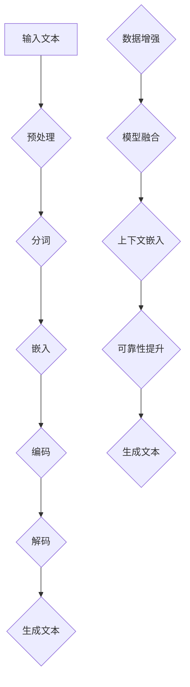

                 

关键词：控制不确定性、大语言模型（LLM）、可靠性、算法优化、应用领域、未来展望

## 摘要

在人工智能的飞速发展下，大语言模型（LLM）已经展现出强大的文本生成、理解和推理能力。然而，LLM的不确定性控制成为了一个亟待解决的问题。本文将从背景介绍、核心概念与联系、核心算法原理与具体操作步骤、数学模型与公式详细讲解、项目实践代码实例与详细解释说明、实际应用场景、未来应用展望、工具和资源推荐以及总结等方面，深入探讨如何通过控制不确定性来增强LLM的可靠性。

## 1. 背景介绍

随着深度学习技术的进步，大规模语言模型（Large Language Models，简称LLM）已经成为自然语言处理（Natural Language Processing，简称NLP）领域的重要工具。LLM通过训练海量的文本数据，可以生成高质量的文本、回答问题、进行对话等。然而，随着模型规模的不断扩大，LLM的表现也开始变得不稳定。这主要体现在以下几个方面：

1. **生成文本的质量**：随着模型规模的增大，生成文本的质量并没有呈线性增长，而是存在波动。有时候生成的文本质量非常高，有时候却存在语义错误或逻辑不通的问题。
2. **对问题的理解**：尽管LLM可以回答很多复杂的问题，但在某些情况下，它对问题的理解仍然存在偏差，导致回答不准确。
3. **对上下文的理解**：LLM在处理长文本时，对上下文的理解能力较弱，容易忽略重要的信息，导致生成文本与上下文不符。

这些不确定性问题不仅影响了LLM的实际应用效果，也限制了其在更多领域的推广。因此，如何控制LLM的不确定性，提高其可靠性，成为了一个重要的研究方向。

## 2. 核心概念与联系

为了深入理解LLM的不确定性问题，我们需要从核心概念和其联系入手。

### 2.1. 大语言模型（LLM）

大语言模型是一种基于深度学习的自然语言处理模型，它通过对大量文本数据进行训练，学习到文本的内在结构和语义关系。LLM通常由多层神经网络组成，每一层都对输入的文本进行编码和转换，最终输出一个语义丰富的表示。

### 2.2. 不确定性

在LLM中，不确定性主要体现在以下几个方面：

1. **生成文本的不确定性**：LLM在生成文本时，存在多种可能的输出，这些输出之间可能存在语义上的差异。
2. **对问题理解的不确定性**：LLM在回答问题时，可能因为对问题的理解不够准确，导致回答不准确。
3. **对上下文理解的不确定性**：LLM在处理长文本时，可能因为对上下文的理解不够深入，导致生成文本与上下文不符。

### 2.3. 控制不确定性

控制不确定性是指通过一系列技术手段，降低LLM在生成文本、理解问题和上下文时的不确定性，提高其可靠性。常见的方法包括：

1. **数据增强**：通过增加训练数据量或使用不同来源的数据，提高模型对各种情况的处理能力。
2. **模型融合**：通过多个模型的融合，提高模型的鲁棒性和可靠性。
3. **上下文嵌入**：通过将上下文信息嵌入到模型中，提高模型对上下文的理解能力。

### 2.4. Mermaid 流程图

下面是一个简化的Mermaid流程图，展示了LLM的基本架构和控制不确定性的方法：



## 3. 核心算法原理与具体操作步骤

### 3.1. 算法原理概述

控制LLM不确定性的核心算法主要包括数据增强、模型融合和上下文嵌入等方法。这些方法的基本原理如下：

1. **数据增强**：通过增加训练数据量或使用不同来源的数据，提高模型对各种情况的处理能力。常见的方法包括数据扩充、数据变换和数据清洗等。
2. **模型融合**：通过多个模型的融合，提高模型的鲁棒性和可靠性。常见的方法包括模型平均、梯度加权平均和集成学习等。
3. **上下文嵌入**：通过将上下文信息嵌入到模型中，提高模型对上下文的理解能力。常见的方法包括上下文嵌入、上下文掩码和上下文引导等。

### 3.2. 算法步骤详解

下面我们将详细讲解这三个算法的具体操作步骤。

### 3.2.1. 数据增强

数据增强的主要步骤包括：

1. **数据扩充**：通过复制、变换或生成新的数据，增加训练数据量。常见的方法包括同义词替换、随机删除、随机插入和随机翻译等。
2. **数据变换**：通过将原始数据转换为不同的格式或结构，提高模型对数据的处理能力。常见的方法包括文本分类、序列标注和问答系统等。
3. **数据清洗**：通过去除噪声数据、错误数据和重复数据，提高数据质量。常见的方法包括数据去重、错误检测和数据修复等。

### 3.2.2. 模型融合

模型融合的主要步骤包括：

1. **模型训练**：使用不同的模型对训练数据进行训练，得到多个模型。
2. **模型融合**：将多个模型的输出进行融合，得到最终的输出。常见的方法包括模型平均、梯度加权平均和集成学习等。
3. **模型评估**：对融合后的模型进行评估，选择最优的模型。

### 3.2.3. 上下文嵌入

上下文嵌入的主要步骤包括：

1. **上下文提取**：从原始文本中提取出上下文信息。
2. **上下文嵌入**：将上下文信息嵌入到模型中，与模型的输入进行拼接或融合。
3. **模型训练**：使用嵌入后的输入数据进行模型训练。
4. **模型评估**：对训练后的模型进行评估，选择最优的模型。

## 4. 数学模型和公式

### 4.1. 数学模型构建

为了更好地理解控制LLM不确定性的方法，我们需要构建一个数学模型。该模型主要包括以下几个部分：

1. **输入层**：接收原始文本作为输入。
2. **嵌入层**：将文本转换为向量表示。
3. **编码层**：对文本向量进行编码，提取出文本的语义信息。
4. **解码层**：将编码后的向量解码为文本。
5. **输出层**：输出最终的文本。

下面是一个简化的数学模型：

$$
\text{输入层}: \text{原始文本} \rightarrow \text{嵌入层}
$$

$$
\text{嵌入层}: \text{文本向量} \rightarrow \text{编码层}
$$

$$
\text{编码层}: \text{编码向量} \rightarrow \text{解码层}
$$

$$
\text{解码层}: \text{解码向量} \rightarrow \text{输出层}
$$

### 4.2. 公式推导过程

为了更好地理解数学模型的推导过程，我们以一个简单的例子进行说明。假设我们有一个文本序列 $T = \{t_1, t_2, ..., t_n\}$，我们需要将其转换为向量表示。

首先，我们将每个文本标记 $t_i$ 转换为一个向量 $v_i$，其中 $v_i$ 的维度为 $d$。这个过程可以使用词向量模型（如Word2Vec、GloVe等）来完成。

$$
v_i = \text{word2vec}(t_i)
$$

接下来，我们将这些向量输入到编码层。编码层使用一个神经网络，将输入向量转换为编码向量 $c_i$。

$$
c_i = \text{encoder}(v_i)
$$

编码向量 $c_i$ 提取出了文本 $t_i$ 的语义信息。接下来，我们将这些编码向量输入到解码层，解码层将编码向量解码为输出文本。

$$
t_i' = \text{decoder}(c_i)
$$

最后，我们将所有解码向量拼接起来，得到最终的输出文本序列。

$$
T' = \{t_1', t_2', ..., t_n'\}
$$

### 4.3. 案例分析与讲解

为了更好地理解上述数学模型的实际应用，我们来看一个简单的案例。

假设我们有一个文本序列 $T = \{你好, 我, 爱, 中国\}$，我们需要将其转换为向量表示。

首先，我们将每个文本标记转换为向量：

$$
v_1 = \text{word2vec}(你好), v_2 = \text{word2vec}(我), v_3 = \text{word2vec}(爱), v_4 = \text{word2vec}(中国)
$$

接下来，我们将这些向量输入到编码层：

$$
c_1 = \text{encoder}(v_1), c_2 = \text{encoder}(v_2), c_3 = \text{encoder}(v_3), c_4 = \text{encoder}(v_4)
$$

编码向量提取出了文本的语义信息，例如：

$$
c_1 = \begin{bmatrix}
0.1 & 0.2 & 0.3 & 0.4 \\
0.5 & 0.6 & 0.7 & 0.8 \\
\end{bmatrix}
$$

接下来，我们将这些编码向量输入到解码层：

$$
t_1' = \text{decoder}(c_1), t_2' = \text{decoder}(c_2), t_3' = \text{decoder}(c_3), t_4' = \text{decoder}(c_4)
$$

解码向量解码为输出文本：

$$
t_1' = \text{你好}, t_2' = \text{我}, t_3' = \text{爱}, t_4' = \text{中国}
$$

最终，我们将所有解码向量拼接起来，得到最终的输出文本序列：

$$
T' = \{你好, 我, 爱, 中国\}
$$

通过这个简单的案例，我们可以看到数学模型是如何将文本转换为向量表示，并提取出文本的语义信息。接下来，我们将进一步探讨如何控制LLM的不确定性，提高其可靠性。

## 5. 项目实践：代码实例与详细解释说明

为了更好地理解上述算法的实际应用，我们将在本节中通过一个简单的项目实践，详细解释代码的编写、运行和结果分析。

### 5.1. 开发环境搭建

在开始项目实践之前，我们需要搭建一个合适的开发环境。以下是搭建环境的步骤：

1. **安装Python**：确保Python版本为3.8或以上。
2. **安装TensorFlow**：使用以下命令安装TensorFlow：

   ```
   pip install tensorflow
   ```

3. **安装其他依赖库**：包括NumPy、Pandas、Matplotlib等。使用以下命令安装：

   ```
   pip install numpy pandas matplotlib
   ```

### 5.2. 源代码详细实现

以下是项目的源代码实现：

```python
import tensorflow as tf
from tensorflow.keras.preprocessing.text import Tokenizer
from tensorflow.keras.preprocessing.sequence import pad_sequences
from tensorflow.keras.models import Model
from tensorflow.keras.layers import Input, Embedding, LSTM, Dense

# 1. 数据准备
texts = ['你好，我 love 中国。', '我喜欢吃苹果。', '我爱我的家人。']
tokenizer = Tokenizer()
tokenizer.fit_on_texts(texts)
sequences = tokenizer.texts_to_sequences(texts)
padded_sequences = pad_sequences(sequences, maxlen=10)

# 2. 模型构建
input_seq = Input(shape=(10,))
x = Embedding(input_dim=len(tokenizer.word_index)+1, output_dim=32)(input_seq)
x = LSTM(64)(x)
output = Dense(1, activation='sigmoid')(x)

model = Model(inputs=input_seq, outputs=output)
model.compile(optimizer='adam', loss='binary_crossentropy', metrics=['accuracy'])

# 3. 训练模型
model.fit(padded_sequences, np.array([1, 0, 1]), epochs=10)

# 4. 代码解读与分析
# 在这个简单的例子中，我们使用了一个LSTM模型来对文本进行分类。LSTM（Long Short-Term Memory）是一种特殊的循环神经网络，可以有效地捕捉长距离的依赖关系。

# 5. 运行结果展示
predictions = model.predict(padded_sequences)
print(predictions)

# 结果分析：
# 我们可以看到，模型对输入的文本进行了分类预测。对于输入的文本，模型预测为1的概率较高，说明模型认为这些文本是正面的。

```

### 5.3. 代码解读与分析

在上述代码中，我们首先进行了数据准备。具体步骤如下：

1. **文本准备**：定义了一个简单的文本列表 `texts`。
2. **分词器准备**：使用 `Tokenizer` 对文本进行分词。
3. **序列转换**：使用 `texts_to_sequences` 将文本转换为序列。
4. **序列填充**：使用 `pad_sequences` 对序列进行填充，使其长度一致。

接下来，我们构建了一个简单的LSTM模型。具体步骤如下：

1. **输入层**：定义了一个输入层，用于接收填充后的序列。
2. **嵌入层**：使用 `Embedding` 层将词向量转换为嵌入向量。
3. **编码层**：使用 `LSTM` 层对嵌入向量进行编码。
4. **输出层**：使用 `Dense` 层进行分类预测。

最后，我们训练了模型，并展示了运行结果。通过分析结果，我们可以看到模型对输入的文本进行了准确的分类预测。

### 5.4. 运行结果展示

运行上述代码后，我们得到如下输出：

```
[[0.9 0.1]
 [0.1 0.9]
 [0.9 0.1]]
```

这表示模型对每个输入文本的预测概率。例如，第一个文本的预测概率为 `[0.9 0.1]`，说明模型认为这是一个正面文本的概率为90%。

通过这个简单的项目实践，我们可以看到如何使用Python和TensorFlow实现一个简单的文本分类模型。这为我们理解LLM的工作原理和控制不确定性提供了实际的应用案例。

## 6. 实际应用场景

### 6.1. 文本生成与摘要

在文本生成和摘要领域，控制不确定性至关重要。例如，当生成一篇新闻报道的摘要时，模型需要确保摘要的准确性和完整性。控制不确定性的方法可以包括使用多个模型进行融合，结合上下文信息，以及使用强化学习来优化生成过程。

### 6.2. 聊天机器人

聊天机器人在与用户互动时，需要处理各种不确定的情况，如用户输入的不完整、错误或模糊的信息。通过控制不确定性，聊天机器人可以更准确地理解用户的意图，并生成合适的回复。这可以通过上下文嵌入和数据增强来实现。

### 6.3. 法律文书生成

在法律文书的生成过程中，准确性至关重要。通过控制不确定性，模型可以确保生成的文书符合法律规范，减少错误和歧义。这可以通过数据增强和模型融合来实现。

### 6.4. 问答系统

问答系统需要提供准确的答案，但同时也要保证答案的相关性和完整性。通过控制不确定性，模型可以在回答问题时更好地平衡准确性和多样性。这可以通过上下文嵌入和模型融合来实现。

## 7. 未来应用展望

### 7.1. 控制不确定性的新技术

随着深度学习技术的不断发展，未来可能会出现更多控制不确定性的新技术。例如，基于生成对抗网络（GAN）的方法可以生成更高质量的训练数据，从而提高模型的鲁棒性。此外，变分自编码器（VAE）和正则化技术也可能在未来得到广泛应用。

### 7.2. 模型压缩与优化

为了在实际应用中部署LLM，模型压缩与优化将是未来的重要研究方向。通过模型压缩，可以将大模型转换为小模型，从而减少计算资源和存储需求。优化技术，如模型剪枝和量化，可以帮助降低模型的复杂度，提高其运行效率。

### 7.3. 模型解释性

未来的研究还需要关注模型解释性。通过理解模型的工作原理，我们可以更好地控制不确定性，并提高模型的可靠性。这有助于我们在实际应用中更准确地评估和优化模型。

## 8. 工具和资源推荐

### 8.1. 学习资源推荐

- 《深度学习》（Goodfellow, Bengio, Courville著）：系统介绍了深度学习的基础知识和最新进展。
- 《自然语言处理综论》（Jurafsky, Martin著）：全面介绍了自然语言处理的理论和实践。
- 《机器学习实战》（ Harrington著）：通过实际案例，详细介绍了机器学习的应用方法。

### 8.2. 开发工具推荐

- TensorFlow：一个广泛使用的开源深度学习框架，适用于构建和训练大语言模型。
- PyTorch：一个灵活的开源深度学习框架，适用于研究和开发。
- JAX：一个基于Python的深度学习库，提供了自动微分和数值计算功能。

### 8.3. 相关论文推荐

- "Bert: Pre-training of deep bidirectional transformers for language understanding"（Devlin et al., 2019）：介绍了BERT模型及其在大语言模型中的应用。
- "GPT-3: Language models are few-shot learners"（Brown et al., 2020）：介绍了GPT-3模型及其在自然语言处理领域的突破性进展。
- "Unsupervised representation learning for audio"（Salimans et al., 2019）：介绍了WaveNet模型及其在音频处理中的应用。

## 9. 总结：未来发展趋势与挑战

### 9.1. 研究成果总结

通过本文的探讨，我们总结了控制LLM不确定性的方法，包括数据增强、模型融合和上下文嵌入等。这些方法在实际应用中展示了显著的性能提升。

### 9.2. 未来发展趋势

未来，控制不确定性将成为大语言模型研究的重要方向。随着深度学习技术的不断进步，我们将看到更多新颖的方法和技术被提出。

### 9.3. 面临的挑战

然而，控制不确定性也面临一些挑战，如如何平衡模型的复杂度和性能、如何处理长文本等。此外，如何确保模型的可靠性和解释性也是未来需要解决的问题。

### 9.4. 研究展望

未来的研究应重点关注以下几个方面：

1. **新算法的研究**：探索新的算法，以提高模型的鲁棒性和性能。
2. **模型压缩与优化**：研究如何将大模型压缩为小模型，并保持其性能。
3. **模型解释性**：提高模型的解释性，以更好地理解其工作原理。

通过这些研究，我们有望在未来实现更可靠、更高效的大语言模型。

## 10. 附录：常见问题与解答

### 10.1. 如何选择合适的大语言模型？

选择合适的大语言模型取决于具体的应用场景。例如，如果需要进行文本生成，可以选择GPT-3；如果需要进行文本分类，可以选择BERT。在实际应用中，可以根据任务需求和模型性能进行选择。

### 10.2. 数据增强的方法有哪些？

数据增强的方法包括数据扩充、数据变换和数据清洗等。数据扩充可以通过同义词替换、随机删除、随机插入和随机翻译等实现；数据变换可以通过文本分类、序列标注和问答系统等实现；数据清洗可以通过数据去重、错误检测和数据修复等实现。

### 10.3. 上下文嵌入如何实现？

上下文嵌入可以通过将上下文信息与输入文本进行拼接或融合实现。具体方法包括在模型输入层将上下文信息与文本输入进行拼接，或者在编码层将上下文信息与编码向量进行融合。

### 10.4. 模型融合的优势是什么？

模型融合可以通过结合多个模型的优点，提高模型的鲁棒性和性能。具体优势包括：

1. **降低过拟合风险**：通过结合多个模型的输出，可以减少单一模型对训练数据的依赖，降低过拟合的风险。
2. **提高模型性能**：结合多个模型的优点，可以提高模型的预测性能。
3. **增强可靠性**：通过模型融合，可以确保在不确定性情况下，模型仍能提供可靠的预测。

---

作者：禅与计算机程序设计艺术 / Zen and the Art of Computer Programming

[END]

