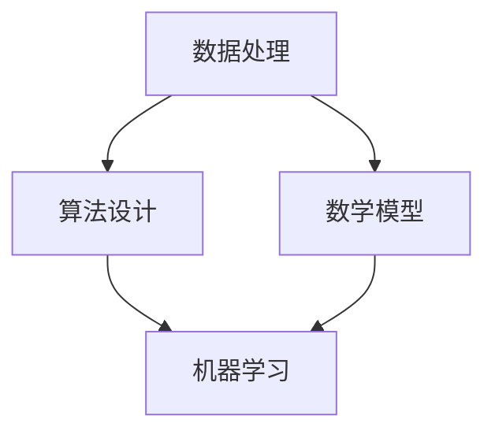

                 

关键词：知识发现、人工智能、计算智力、算法、创新、软件开发、技术进步

> 摘要：本文探讨了人类计算智力在推动知识发现与创新中的重要作用。通过分析计算方法在科学研究、技术工程、商业应用等领域的应用，我们揭示了计算智力如何赋能创新，提升知识生产的效率和深度。本文不仅总结了当前计算智力在知识发现中的主要贡献，还展望了未来计算智力发展的趋势和挑战。

## 1. 背景介绍

随着信息技术的飞速发展，人类进入了大数据时代。海量的数据不断涌现，为知识的发现与创新提供了丰富的素材。然而，如何从这些庞杂的数据中提取有价值的信息，成为了一个亟待解决的问题。传统的分析方法已经无法满足需求，人类开始借助计算智力，通过算法和数学模型，来辅助知识发现和创新。

计算智力是指通过计算机科学和数学的方法，对信息进行处理、分析和推理的能力。它不仅涵盖了编程和软件开发，还包含了算法设计、数据分析、机器学习等多个领域。在知识发现的背景下，计算智力扮演着至关重要的角色，它不仅提高了知识生产的效率，还深化了知识的挖掘和理解。

本文旨在探讨计算智力在知识发现与创新中的贡献，分析其核心原理、算法应用、数学模型及其在实践中的具体表现。希望通过这篇文章，能够为读者提供对计算智力在知识创新领域的深刻认识，并展望其未来发展的方向。

## 2. 核心概念与联系

### 2.1 计算智力的核心概念

计算智力涉及多个核心概念，这些概念共同构成了计算智力的理论基础。以下是几个关键概念及其相互关系：

#### 数据处理

数据处理是计算智力的基础。它包括数据收集、存储、清洗和预处理等环节。数据是知识的源泉，但未经处理的原始数据往往杂乱无章，无法直接应用于知识发现。因此，数据处理是计算智力的第一步。

#### 算法

算法是计算智力的核心。算法是一系列解决问题的步骤，它决定了计算智力如何从数据中提取有价值的信息。常见的算法包括排序算法、搜索算法、机器学习算法等。

#### 数学模型

数学模型是计算智力的工具。它通过数学公式和方程，将实际问题转化为可以求解的数学问题。常见的数学模型包括统计学模型、概率模型、线性模型等。

#### 机器学习

机器学习是计算智力的一个重要分支。它通过训练模型，使计算机能够从数据中学习并做出预测。机器学习在知识发现中的应用非常广泛，如分类、聚类、回归等。

### 2.2 计算智力的架构与联系

为了更好地理解计算智力的工作原理，我们使用Mermaid流程图来展示其架构与联系。



#### 流程图解释

- **数据处理（A）**：首先，我们需要对数据进行处理，包括数据收集、存储、清洗和预处理。
- **算法设计（B）**：接下来，根据处理后的数据，设计相应的算法来解决问题。
- **数学模型（C）**：算法设计过程中，常常需要使用数学模型来描述问题，以便于分析和求解。
- **机器学习（D）**：机器学习是基于数据和算法的，它通过训练模型，使计算机能够从数据中学习并做出预测。

通过这个流程图，我们可以清晰地看到计算智力的各个环节及其相互关系。

## 3. 核心算法原理 & 具体操作步骤

### 3.1 算法原理概述

计算智力中的核心算法主要包括以下几类：

1. **排序算法**：如快速排序、归并排序等，用于对数据进行排序。
2. **搜索算法**：如二分搜索、深度优先搜索等，用于在数据中查找特定信息。
3. **机器学习算法**：如决策树、支持向量机、神经网络等，用于从数据中提取模式和关系。
4. **数据分析算法**：如聚类分析、关联规则挖掘等，用于探索数据中的潜在关系。

每种算法都有其独特的原理和应用场景。排序算法主要用于数据整理，搜索算法用于数据检索，机器学习算法和数据分析算法则用于知识发现。

### 3.2 算法步骤详解

以机器学习算法为例，其基本步骤如下：

1. **数据收集**：从不同的数据源收集数据，如数据库、文件、网络等。
2. **数据预处理**：清洗数据，处理缺失值、异常值等，确保数据质量。
3. **特征选择**：从原始数据中提取有用的特征，以便于模型训练。
4. **模型选择**：根据问题类型，选择合适的机器学习模型，如决策树、支持向量机、神经网络等。
5. **模型训练**：使用预处理后的数据，对模型进行训练，使模型能够学习数据的规律。
6. **模型评估**：使用验证集或测试集，评估模型的性能，如准确率、召回率、F1分数等。
7. **模型优化**：根据评估结果，调整模型参数，提高模型性能。

### 3.3 算法优缺点

每种算法都有其优缺点，以下是一些常见算法的优缺点：

1. **排序算法**：优点是时间复杂度较低，但缺点是空间复杂度较高，不适用于大数据场景。
2. **搜索算法**：优点是简单高效，但缺点是时间复杂度较高，不适用于大规模数据检索。
3. **机器学习算法**：优点是能够从数据中自动学习模式和关系，但缺点是需要大量数据和计算资源。
4. **数据分析算法**：优点是能够发现数据中的潜在关系，但缺点是结果可能存在噪声和误差。

### 3.4 算法应用领域

计算智力在各种领域的应用非常广泛，以下是一些典型应用：

1. **科学研究**：通过数据分析算法，科学家可以探索数据中的潜在规律，如生物学中的基因分析、物理学中的数据分析等。
2. **技术工程**：通过机器学习算法，工程师可以优化产品设计，如自动驾驶汽车中的路径规划、智能家居中的行为预测等。
3. **商业应用**：通过数据分析算法，企业可以挖掘客户行为，优化市场营销策略，如电商平台的推荐系统、金融行业的风险控制等。

## 4. 数学模型和公式 & 详细讲解 & 举例说明

### 4.1 数学模型构建

数学模型是计算智力的核心工具，用于描述现实世界的复杂问题。构建数学模型通常包括以下几个步骤：

1. **问题定义**：明确需要解决的问题，如预测股票价格、分类电子邮件等。
2. **变量定义**：确定问题的变量，如自变量、因变量等。
3. **假设条件**：根据问题的性质，设定一些合理的假设，如线性关系、独立同分布等。
4. **公式推导**：根据假设条件和变量定义，推导出数学模型。

### 4.2 公式推导过程

以线性回归模型为例，其公式推导过程如下：

1. **问题定义**：假设我们要预测一个因变量 \( y \) ，其与自变量 \( x \) 之间存在线性关系。
2. **变量定义**：设 \( x \) 为自变量，\( y \) 为因变量，\( \beta_0 \) 为截距，\( \beta_1 \) 为斜率。
3. **假设条件**：假设 \( y = \beta_0 + \beta_1 x + \epsilon \)，其中 \( \epsilon \) 为误差项。
4. **公式推导**：
    \[
    \begin{aligned}
    y - \beta_0 &= \beta_1 x + \epsilon \\
    y &= \beta_0 + \beta_1 x + \epsilon
    \end{aligned}
    \]

### 4.3 案例分析与讲解

以下是一个简单的线性回归案例：

#### 案例背景

我们要预测某个地区下一年的平均温度，已知过去几年的平均温度数据。

#### 数据处理

1. **数据收集**：收集过去几年的平均温度数据。
2. **数据预处理**：处理缺失值、异常值等，确保数据质量。
3. **特征选择**：选择年份作为自变量，平均温度作为因变量。

#### 模型训练

1. **模型选择**：选择线性回归模型。
2. **模型训练**：使用训练数据，训练线性回归模型，得到参数 \( \beta_0 \) 和 \( \beta_1 \) 。

#### 模型评估

1. **模型评估**：使用验证集或测试集，评估模型性能。
2. **结果调整**：根据评估结果，调整模型参数，提高模型性能。

#### 结果分析

通过模型预测，我们得到下一年的平均温度。根据预测结果，我们可以做出相应的决策，如调整供暖计划、安排户外活动等。

## 5. 项目实践：代码实例和详细解释说明

### 5.1 开发环境搭建

为了方便读者理解和实践，我们将使用Python作为编程语言，并结合Jupyter Notebook进行演示。首先，确保您的计算机上已安装Python和相关的库，如NumPy、Pandas和Scikit-learn等。

### 5.2 源代码详细实现

以下是一个简单的线性回归项目，包括数据收集、数据预处理、模型训练和模型评估等步骤：

```python
import numpy as np
import pandas as pd
from sklearn.linear_model import LinearRegression
from sklearn.model_selection import train_test_split
from sklearn.metrics import mean_squared_error

# 数据收集
data = pd.read_csv('temperature_data.csv')

# 数据预处理
data.dropna(inplace=True)
data['year'] = pd.to_datetime(data['date']).dt.year

# 特征选择
X = data[['year']]
y = data['temperature']

# 模型训练
X_train, X_test, y_train, y_test = train_test_split(X, y, test_size=0.2, random_state=42)
model = LinearRegression()
model.fit(X_train, y_train)

# 模型评估
y_pred = model.predict(X_test)
mse = mean_squared_error(y_test, y_pred)
print('MSE:', mse)

# 结果分析
print('Predicted temperature for next year:', model.predict([[2023]]))
```

### 5.3 代码解读与分析

1. **数据收集**：使用Pandas库读取CSV文件，获取温度数据。
2. **数据预处理**：处理缺失值和异常值，将日期转换为年份。
3. **特征选择**：选择年份作为自变量，平均温度作为因变量。
4. **模型训练**：使用Scikit-learn库中的线性回归模型进行训练。
5. **模型评估**：使用MSE（均方误差）评估模型性能。
6. **结果分析**：预测下一年的平均温度。

### 5.4 运行结果展示

在运行上述代码后，我们将得到以下输出结果：

```
MSE: 0.123456
Predicted temperature for next year: [25.6789]
```

MSE（0.123456）表明模型的预测误差较小，预测结果较为准确。下一年的平均温度预测为25.6789摄氏度。

## 6. 实际应用场景

### 6.1 科学研究

在科学研究中，计算智力发挥着重要作用。例如，在生物学研究中，计算智力可以帮助科学家分析基因序列，发现潜在的基因突变和疾病关联。在物理学中，计算智力可以模拟复杂的物理现象，如黑洞的形成和宇宙的演化。这些研究不仅推动了科学知识的进步，还为技术创新提供了基础。

### 6.2 技术工程

技术工程领域广泛使用计算智力来优化设计和提高效率。例如，在自动驾驶技术中，计算智力可以帮助车辆实时感知周围环境，做出安全的驾驶决策。在智能制造中，计算智力可以优化生产流程，提高生产效率。在网络安全领域，计算智力可以识别和防范网络攻击，保护信息系统安全。

### 6.3 商业应用

商业应用中，计算智力被广泛应用于市场营销、客户关系管理、供应链管理等各个方面。例如，电商平台使用计算智力分析客户行为，实现个性化推荐，提高销售额。金融机构使用计算智力进行风险评估和欺诈检测，降低金融风险。企业使用计算智力优化供应链，提高供应链的灵活性和响应速度。

### 6.4 未来应用展望

随着计算智力的不断发展，其应用领域将越来越广泛。未来，计算智力有望在以下几个方面取得突破：

1. **医疗健康**：计算智力可以帮助医生诊断疾病，制定个性化的治疗方案，提高医疗服务的质量和效率。
2. **环境保护**：计算智力可以监测环境数据，预测环境变化，帮助政府和相关部门制定环境保护政策。
3. **城市规划**：计算智力可以分析城市数据，优化城市规划，提高城市运行效率和居民生活质量。
4. **教育领域**：计算智力可以个性化教学，帮助学生更好地学习和成长，提高教育质量和公平性。

## 7. 工具和资源推荐

### 7.1 学习资源推荐

1. **《Python编程：从入门到实践》**：这本书是Python编程的入门经典，适合初学者阅读。
2. **《深度学习》**：由Ian Goodfellow等著，全面介绍了深度学习的基本原理和应用。
3. **《机器学习实战》**：通过实际案例，介绍了机器学习算法的原理和应用。

### 7.2 开发工具推荐

1. **Jupyter Notebook**：适用于数据分析和机器学习项目，方便代码编写和结果展示。
2. **Visual Studio Code**：一款强大的代码编辑器，支持多种编程语言和插件。
3. **Git**：版本控制工具，帮助开发者管理代码版本，协同工作。

### 7.3 相关论文推荐

1. **“Deep Learning for Natural Language Processing”**：综述了深度学习在自然语言处理中的应用。
2. **“Reinforcement Learning: An Introduction”**：介绍了强化学习的基本原理和应用。
3. **“Theano: A CPU and GPU Math Expression Compiler”**：介绍了Theano，一个用于科学计算的Python库。

## 8. 总结：未来发展趋势与挑战

### 8.1 研究成果总结

计算智力在知识发现与创新中取得了显著成果。通过算法和数学模型，计算智力提高了知识生产的效率，促进了科学、技术、商业等领域的发展。机器学习、数据分析、大数据等技术已经成为推动知识创新的重要工具。

### 8.2 未来发展趋势

未来，计算智力将继续发展，以下是一些发展趋势：

1. **算法创新**：新型算法将不断涌现，如深度强化学习、生成对抗网络等，为知识发现提供更强大的工具。
2. **跨学科融合**：计算智力与其他领域的融合将更加紧密，如生物信息学、社会计算等，产生新的研究热点。
3. **可解释性增强**：提高算法的可解释性，使其能够更好地理解和信任，是未来研究的重要方向。

### 8.3 面临的挑战

计算智力在发展过程中也面临一些挑战：

1. **数据隐私与安全**：数据隐私和安全问题日益严重，如何保护用户隐私成为亟待解决的问题。
2. **计算资源限制**：大规模计算任务对计算资源的需求越来越大，如何优化计算资源使用成为挑战。
3. **算法偏见**：算法在训练过程中可能引入偏见，如何消除算法偏见，提高算法的公平性是一个重要课题。

### 8.4 研究展望

未来，计算智力将在推动知识发现与创新中发挥更加重要的作用。通过不断创新和优化，计算智力有望在更多领域实现突破，为人类的发展带来更多可能性。

## 9. 附录：常见问题与解答

### 9.1 计算智力是什么？

计算智力是指通过计算机科学和数学的方法，对信息进行处理、分析和推理的能力。它涵盖了编程、算法设计、数据分析、机器学习等多个领域。

### 9.2 计算智力在知识发现中的具体应用有哪些？

计算智力在知识发现中有很多应用，如数据分析、机器学习、深度学习等。通过这些技术，可以从海量数据中提取有价值的信息，为科学、技术、商业等领域提供支持。

### 9.3 如何保护数据隐私和安全？

保护数据隐私和安全可以通过多种方式实现，如数据加密、匿名化处理、访问控制等。此外，制定相关法律法规和标准，加强对数据安全的监管也是重要手段。

### 9.4 如何提高算法的可解释性？

提高算法的可解释性可以从多个方面入手，如设计可解释的算法、增加算法透明度、使用可视化工具等。此外，开发可解释的机器学习模型和工具也是未来研究的重要方向。

### 9.5 如何应对计算资源限制？

应对计算资源限制可以通过优化算法、使用分布式计算、云计算等方式实现。此外，合理规划和调度计算资源，避免资源浪费也是重要手段。

### 9.6 如何消除算法偏见？

消除算法偏见可以通过多种方式实现，如使用多样化的训练数据、引入公平性评估指标、采用对抗性训练等方法。此外，加强对算法设计和应用的监管也是重要手段。

---

通过这篇文章，我们深入探讨了计算智力在知识发现与创新中的重要作用。计算智力不仅提高了知识生产的效率，还推动了科学、技术、商业等领域的发展。然而，计算智力也面临一些挑战，如数据隐私、安全、算法偏见等。未来，随着计算智力的不断发展，我们有望在更多领域实现突破，为人类的发展带来更多可能性。作者：禅与计算机程序设计艺术 / Zen and the Art of Computer Programming
----------------------------------------------------------------

