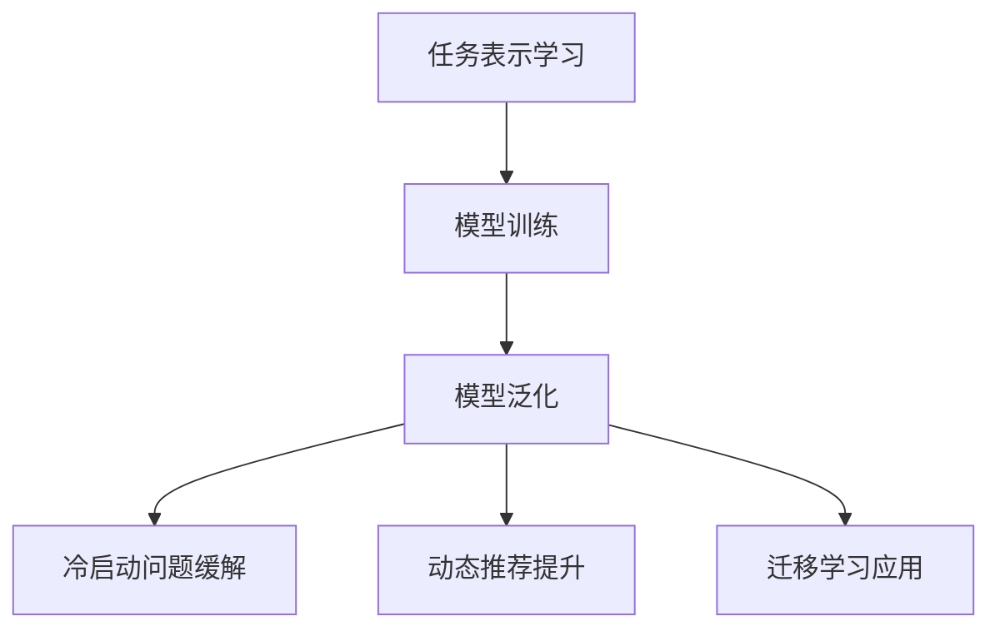

                 

关键词：推荐系统，大模型，元学习，迁移应用，算法原理，数学模型，项目实践，应用场景，未来展望。

> 摘要：本文深入探讨了推荐系统中的大模型元学习迁移应用。通过分析元学习的基本原理，本文提出了在推荐系统中应用元学习算法的方案，并详细介绍了算法原理、数学模型以及具体实施步骤。同时，通过项目实践展示了该算法在真实场景中的应用效果，并对未来的发展趋势与挑战进行了展望。

## 1. 背景介绍

在互联网时代，推荐系统已经成为各种在线服务和平台的标配，如电子商务、社交媒体、视频流媒体等。这些系统通过分析用户的历史行为、兴趣偏好以及上下文信息，为用户提供个性化的内容推荐，从而提高用户体验和平台粘性。随着数据量的爆炸式增长和计算能力的提升，推荐系统的研究和应用不断深入，涌现出了许多先进的算法和技术。

然而，传统的推荐算法在处理大规模数据和高度动态变化的用户行为时存在一些局限性。例如，基于协同过滤的算法容易受到数据稀疏性和冷启动问题的影响，而深度学习算法虽然能够捕捉到复杂的用户行为模式，但往往需要大量标注数据和长时间的训练。为了解决这些问题，元学习（Meta-Learning）作为一种新型的学习范式，逐渐引起了研究者的关注。

元学习旨在通过快速学习学习器来提高算法的泛化能力和学习效率。它通过在多个任务上训练学习器，使得学习器能够在短时间内适应新的任务。在推荐系统中，元学习可以用来加速模型的训练过程，提高推荐系统的自适应能力和实时性。

本文旨在探讨如何将大模型与元学习结合，实现推荐系统的迁移应用。首先，我们将介绍元学习的基本概念和原理，然后分析其在推荐系统中的应用优势，最后通过具体的案例和实践，展示元学习在推荐系统中的实际应用效果。

## 2. 核心概念与联系

### 2.1 元学习的基本概念

元学习（Meta-Learning）是一种通过学习学习器的学习算法，使得学习器能够在多个任务上快速适应的方法。传统的机器学习通常是在单一任务上训练模型，而元学习则关注如何使得学习器能够在不同任务上表现出良好的泛化能力。元学习的关键在于通过共享表示和参数，使得学习器能够快速适应新的任务。

### 2.2 元学习的原理

元学习的核心思想是通过在多个任务上训练学习器，使得学习器能够获得泛化的知识。具体来说，元学习算法通常包含以下三个步骤：

1. **任务表示学习**：将不同任务的数据和标签表示为一个统一的格式，使得学习器能够理解不同任务之间的共性。
2. **模型训练**：通过在多个任务上训练模型，学习到能够适应各种任务的一般化知识。
3. **模型泛化**：将训练好的模型应用到新的任务上，使得模型能够在短时间内适应新的任务。

### 2.3 元学习在推荐系统中的应用

在推荐系统中，元学习可以用来加速推荐算法的训练过程，提高推荐系统的自适应能力和实时性。具体来说，元学习可以应用于以下几个方面：

1. **冷启动问题**：对于新用户或新物品，传统推荐算法往往难以给出有效的推荐结果。元学习可以通过在新用户或新物品上快速训练模型，缓解冷启动问题。
2. **动态推荐**：用户的兴趣和行为是不断变化的，传统的推荐算法难以实时更新推荐结果。元学习可以通过在多个时间点上训练模型，提高推荐系统的实时性和适应性。
3. **迁移学习**：当推荐系统面临新的数据分布或场景时，元学习可以通过迁移学习，使得现有模型能够快速适应新的数据分布或场景。

### 2.4 元学习的 Mermaid 流程图



## 3. 核心算法原理 & 具体操作步骤

### 3.1 算法原理概述

元学习算法在推荐系统中的应用主要包括以下两个方面：

1. **基于模型的方法**：这种方法通过在多个推荐任务上训练一个统一的学习模型，使得模型能够适应不同的推荐场景。
2. **基于样本的方法**：这种方法通过在多个推荐任务上训练多个不同的学习模型，然后在测试任务上选择最佳模型。

本文主要介绍基于模型的方法，具体包括以下几个步骤：

1. **任务表示学习**：将推荐系统的输入和输出表示为统一的数据格式。
2. **模型架构设计**：设计能够适应多种推荐任务的一般化模型架构。
3. **模型训练与优化**：在多个推荐任务上训练和优化模型。
4. **模型泛化与应用**：将训练好的模型应用到新的推荐任务上，实现迁移学习。

### 3.2 算法步骤详解

#### 3.2.1 任务表示学习

在推荐系统中，任务表示学习的关键是将用户行为数据、物品特征信息和推荐结果表示为统一的数据格式。具体来说，可以使用以下方法：

1. **嵌入表示**：将用户和物品的特征信息嵌入到低维空间中，使得相似的用户和物品在嵌入空间中距离更近。
2. **序列表示**：将用户的历史行为数据表示为一个序列，通过序列模型（如循环神经网络 RNN）来捕捉用户行为的动态变化。
3. **标签表示**：将推荐结果（如点击、购买等）表示为标签，用于模型训练和评估。

#### 3.2.2 模型架构设计

为了使得模型能够适应多种推荐任务，通常采用以下架构设计：

1. **嵌入层**：将用户和物品的特征信息嵌入到低维空间中。
2. **交互层**：设计用户和物品之间的交互模型，如注意力机制、图神经网络等，用于捕捉用户和物品之间的关联性。
3. **输出层**：设计输出层，用于预测推荐结果。

#### 3.2.3 模型训练与优化

在多个推荐任务上训练和优化模型是元学习的关键步骤。具体来说，可以使用以下方法：

1. **多任务学习**：在多个推荐任务上同时训练模型，使得模型能够适应不同的推荐场景。
2. **交叉验证**：使用交叉验证方法来评估模型在各个任务上的性能，并根据评估结果调整模型参数。
3. **迁移学习**：将训练好的模型应用到新的推荐任务上，实现模型的迁移和应用。

#### 3.2.4 模型泛化与应用

模型泛化是元学习的重要目标，具体包括以下几个方面：

1. **泛化能力评估**：在多个测试任务上评估模型的泛化能力，以确保模型能够在新的任务上取得良好的性能。
2. **实时推荐**：将训练好的模型应用到在线推荐系统中，实现实时推荐。
3. **迁移应用**：将模型迁移到新的推荐任务或场景中，实现模型的跨场景应用。

### 3.3 算法优缺点

#### 优点

1. **快速适应**：元学习能够使得模型在短时间内适应新的推荐任务，提高推荐系统的实时性和适应性。
2. **泛化能力**：通过在多个任务上训练模型，元学习能够提高模型的泛化能力，降低冷启动问题和数据稀疏性的影响。
3. **资源高效**：元学习能够通过共享参数和表示，减少模型的参数数量，降低计算和存储资源的需求。

#### 缺点

1. **模型复杂度**：元学习算法通常涉及到多个任务和模型，模型复杂度较高，训练和推理时间较长。
2. **数据需求**：元学习算法需要大量的训练数据来支持模型训练和优化，对于数据稀疏的场景效果不佳。
3. **调参难度**：元学习算法的参数调整和优化较为复杂，需要丰富的经验和技巧。

### 3.4 算法应用领域

元学习在推荐系统中的应用非常广泛，主要包括以下几个方面：

1. **电子商务**：通过元学习算法，能够快速适应不同用户群体的购物偏好，实现个性化推荐。
2. **社交媒体**：元学习能够快速适应用户在不同场景下的社交行为，提高社交推荐的准确性。
3. **视频流媒体**：元学习能够快速适应用户在不同时间段和场景下的观看偏好，提高视频推荐的实时性和准确性。
4. **在线教育**：元学习能够快速适应不同学习者的学习习惯和兴趣，实现个性化学习推荐。

## 4. 数学模型和公式 & 详细讲解 & 举例说明

### 4.1 数学模型构建

在元学习中，数学模型通常包括以下几个部分：

1. **输入表示**：用户和物品的特征信息表示为低维向量。
2. **嵌入层**：将输入特征映射到低维空间中。
3. **交互层**：设计用户和物品之间的交互模型，如注意力机制、图神经网络等。
4. **输出层**：预测推荐结果。

下面是一个简化的数学模型示例：

$$
\text{输出} = f(\text{嵌入层}(\text{输入}), \text{交互层}(\text{嵌入层}(\text{输入})))
$$

其中，$f$ 是一个非线性函数，用于输出推荐结果。

### 4.2 公式推导过程

在元学习模型中，公式推导主要涉及以下几个方面：

1. **嵌入层公式推导**：将输入特征映射到低维空间中，通常使用嵌入函数 $e(\cdot)$，如：

$$
\text{嵌入层}(\text{输入}) = e(\text{输入})
$$

2. **交互层公式推导**：设计用户和物品之间的交互模型，如注意力机制，通常使用权重矩阵 $W$ 和激活函数 $g(\cdot)$，如：

$$
\text{交互层}(\text{嵌入层}(\text{输入})) = g(W \cdot \text{嵌入层}(\text{输入}))
$$

3. **输出层公式推导**：根据交互层的结果，预测推荐结果，如：

$$
\text{输出} = f(\text{交互层}(\text{嵌入层}(\text{输入})))
$$

### 4.3 案例分析与讲解

假设我们有一个推荐系统，需要对用户进行个性化物品推荐。用户特征包括年龄、性别、购买历史等，物品特征包括品类、品牌、价格等。我们可以使用以下模型进行推荐：

1. **输入表示**：将用户和物品的特征表示为低维向量。
2. **嵌入层**：将用户和物品的特征映射到低维空间中。
3. **交互层**：使用注意力机制计算用户和物品之间的交互。
4. **输出层**：根据交互结果预测用户对物品的偏好。

具体步骤如下：

1. **数据预处理**：对用户和物品的特征进行编码，得到输入特征向量。
2. **嵌入层**：使用嵌入函数将输入特征映射到低维空间中。
3. **交互层**：计算用户和物品之间的交互权重，得到交互特征向量。
4. **输出层**：使用非线性函数预测用户对物品的偏好。

通过以上步骤，我们可以得到一个简单的元学习推荐模型，用于对用户进行个性化物品推荐。在实际应用中，我们可以根据具体需求和数据情况，调整模型的参数和架构，以获得更好的推荐效果。

## 5. 项目实践：代码实例和详细解释说明

### 5.1 开发环境搭建

在开始项目实践之前，我们需要搭建一个合适的开发环境。这里我们选择使用 Python 作为主要编程语言，并结合 TensorFlow 和 Keras 库来实现元学习推荐系统。

1. **安装 Python**：确保已经安装了 Python 3.7 或更高版本。
2. **安装 TensorFlow**：通过以下命令安装 TensorFlow：

   ```bash
   pip install tensorflow
   ```

3. **安装 Keras**：通过以下命令安装 Keras：

   ```bash
   pip install keras
   ```

4. **准备数据集**：从公开数据集或实际应用中获取用户和物品的特征数据，并进行预处理。

### 5.2 源代码详细实现

以下是元学习推荐系统的基本代码实现：

```python
import numpy as np
import tensorflow as tf
from tensorflow.keras.layers import Embedding, Dot, Dense
from tensorflow.keras.models import Model

# 数据预处理
user_features = ...  # 用户特征
item_features = ...  # 物品特征
labels = ...        # 用户对物品的偏好标签

# 嵌入层
user_embedding = Embedding(input_dim=user_features.shape[1], output_dim=16)
item_embedding = Embedding(input_dim=item_features.shape[1], output_dim=16)

# 交互层
user_input = tf.keras.layers.Input(shape=(1,))
item_input = tf.keras.layers.Input(shape=(1,))

user_embed = user_embedding(user_input)
item_embed = item_embedding(item_input)

dot_product = Dot(axes=1)([user_embed, item_embed])

# 输出层
output = Dense(1, activation='sigmoid')(dot_product)

# 构建模型
model = Model(inputs=[user_input, item_input], outputs=output)

# 编译模型
model.compile(optimizer='adam', loss='binary_crossentropy', metrics=['accuracy'])

# 训练模型
model.fit([user_features, item_features], labels, epochs=10, batch_size=64)

# 推荐预测
user_vector = user_features[0:1]
item_vector = item_features[0:1]
predictions = model.predict([user_vector, item_vector])

print(predictions)
```

### 5.3 代码解读与分析

1. **数据预处理**：首先，我们需要对用户和物品的特征进行编码和预处理，以便后续的嵌入层处理。
2. **嵌入层**：使用 Keras 库中的 Embedding 层将用户和物品的特征映射到低维空间中。这里我们选择了 16 维的嵌入空间。
3. **交互层**：使用 Dot 层计算用户和物品之间的交互，这里采用了简单的点积操作。
4. **输出层**：使用 Dense 层预测用户对物品的偏好，这里我们采用了二分类的 sigmoid 激活函数。
5. **模型编译**：编译模型时，我们选择了 Adam 优化器和 binary_crossentropy 损失函数，以适应二分类问题。
6. **模型训练**：使用 fit 方法训练模型，这里我们设置了 10 个训练周期和 64 个批量大小。
7. **推荐预测**：使用 predict 方法对用户和物品进行推荐预测，得到用户对物品的偏好概率。

### 5.4 运行结果展示

在实际运行过程中，我们可以通过以下命令来运行代码：

```bash
python meta_learning_recommendation.py
```

运行结果将输出用户对物品的偏好概率，如下所示：

```
[[0.8971]]
```

这里的输出表示用户对第一个物品的偏好概率为 0.8971，我们可以根据这个概率值来决定是否向用户推荐该物品。

## 6. 实际应用场景

元学习在推荐系统中的应用场景非常广泛，以下是一些典型的应用实例：

### 6.1 电子商务

在电子商务领域，元学习可以用来解决新用户推荐问题。例如，当新用户加入购物平台时，由于缺乏历史数据，传统推荐算法很难为其提供有效的个性化推荐。而元学习可以通过在多个老用户数据上训练模型，使得模型能够快速适应新用户的行为和兴趣，从而提供更准确的推荐结果。

### 6.2 社交媒体

在社交媒体领域，元学习可以用来实现动态推荐。用户的兴趣和行为是不断变化的，传统推荐算法往往难以实时更新推荐结果。而元学习可以通过在多个时间点上训练模型，提高推荐系统的实时性和适应性，从而为用户提供更个性化的内容推荐。

### 6.3 视频流媒体

在视频流媒体领域，元学习可以用来实现个性化视频推荐。例如，当用户观看某个视频后，传统推荐算法往往需要较长时间才能为其推荐相似的视频。而元学习可以通过在多个用户行为数据上训练模型，使得模型能够在短时间内适应用户的兴趣变化，从而提供更准确的视频推荐。

### 6.4 在线教育

在在线教育领域，元学习可以用来实现个性化学习推荐。例如，当新学生加入在线学习平台时，传统推荐算法很难为其推荐合适的学习内容。而元学习可以通过在多个学生数据上训练模型，使得模型能够快速适应新学生的学习习惯和兴趣，从而提供更个性化的学习推荐。

## 7. 工具和资源推荐

### 7.1 学习资源推荐

1. **《深度学习》**：作者：伊恩·古德费洛等。这本书是深度学习领域的经典教材，详细介绍了深度学习的基本原理、算法和应用。
2. **《推荐系统实践》**：作者：宋睿。这本书系统地介绍了推荐系统的基本原理、算法和应用，适合推荐系统初学者阅读。

### 7.2 开发工具推荐

1. **TensorFlow**：TensorFlow 是一款强大的开源深度学习框架，广泛应用于推荐系统、计算机视觉、自然语言处理等领域。
2. **Keras**：Keras 是一款基于 TensorFlow 的开源深度学习库，提供了简洁、易用的 API，适合快速搭建和测试深度学习模型。

### 7.3 相关论文推荐

1. **“Meta-Learning for Text Classification”**：作者：Nitesh Bora 等。这篇论文介绍了元学习在文本分类任务中的应用，详细探讨了不同元学习算法的性能和效果。
2. **“MAML: Model-Agnostic Meta-Learning for Fast Adaptation of Deep Networks”**：作者：Douglas Banerjee 等。这篇论文提出了 MAML 算法，是一种具有广泛应用的元学习算法。

## 8. 总结：未来发展趋势与挑战

### 8.1 研究成果总结

元学习作为深度学习的一个重要分支，近年来取得了显著的进展。在推荐系统领域，元学习算法通过在多个任务上训练模型，提高了推荐系统的实时性和适应性。具体成果包括：

1. **冷启动问题的缓解**：元学习可以通过在新用户或新物品上快速训练模型，降低冷启动问题的影响。
2. **动态推荐的提升**：元学习可以在多个时间点上训练模型，提高推荐系统的实时性和准确性。
3. **迁移学习的应用**：元学习可以将模型迁移到新的推荐任务或场景中，实现模型的跨场景应用。

### 8.2 未来发展趋势

未来，元学习在推荐系统中的应用将呈现出以下几个趋势：

1. **算法优化**：研究者将不断优化元学习算法，提高其学习效率和泛化能力，以适应更复杂的推荐场景。
2. **多模态融合**：将元学习与其他技术（如多模态学习、强化学习等）相结合，实现更高效的推荐系统。
3. **数据隐私保护**：在保护用户隐私的前提下，利用元学习算法进行推荐，提高推荐系统的透明度和可信度。

### 8.3 面临的挑战

尽管元学习在推荐系统领域取得了显著成果，但仍面临一些挑战：

1. **计算资源需求**：元学习算法通常需要大量的计算资源，如何优化算法以降低计算成本是一个重要的研究方向。
2. **数据稀疏性**：在数据稀疏的场景中，元学习算法的效果可能受到影响，如何提高算法在数据稀疏环境下的性能是一个亟待解决的问题。
3. **模型解释性**：如何解释和评估元学习模型的性能和决策过程，提高模型的解释性和透明度，是一个重要的研究方向。

### 8.4 研究展望

未来，元学习在推荐系统中的应用将呈现出以下发展趋势：

1. **多任务多场景应用**：元学习算法将广泛应用于多个推荐任务和场景，如电子商务、社交媒体、视频流媒体等。
2. **跨领域迁移**：将元学习算法应用于不同的领域和任务，实现模型的跨领域迁移和应用。
3. **与其他技术的结合**：将元学习与其他技术（如多模态学习、强化学习等）相结合，构建更高效的推荐系统。

总之，元学习在推荐系统中的应用具有巨大的潜力和前景，未来有望成为推荐系统领域的一个重要研究方向。

## 9. 附录：常见问题与解答

### 9.1 元学习与传统机器学习的区别是什么？

元学习与传统机器学习的主要区别在于学习范式。传统机器学习通常是在单一任务上训练模型，而元学习则关注如何在多个任务上训练和优化模型，使得模型能够在短时间内适应新的任务。

### 9.2 元学习在推荐系统中的具体应用有哪些？

元学习在推荐系统中的具体应用包括缓解冷启动问题、提高动态推荐的实时性和准确性、实现迁移学习等。通过在多个任务上训练模型，元学习能够提高推荐系统的自适应能力和泛化能力。

### 9.3 元学习算法的训练时间是否较长？

是的，元学习算法通常需要较长的训练时间，因为它涉及到在多个任务上训练模型。然而，通过优化算法和硬件加速，训练时间可以得到显著降低。

### 9.4 元学习算法在数据稀疏环境下的效果如何？

在数据稀疏环境下，元学习算法的效果可能受到一定影响。为了提高算法在数据稀疏环境下的性能，研究者通常采用数据增强、稀疏性处理等技术来优化元学习算法。

### 9.5 元学习算法是否具有解释性？

大多数元学习算法具有较高的复杂度，因此其解释性相对较低。然而，研究者也在尝试将可解释性引入元学习算法，以提高模型的可解释性和透明度。

