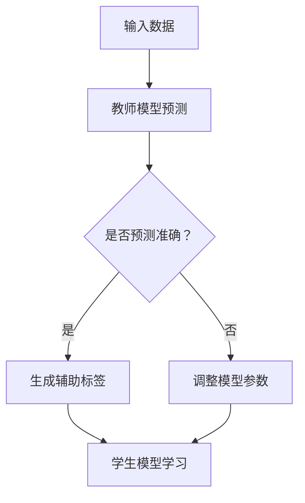

                 

关键词：推荐系统、大模型、知识蒸馏、迁移学习、迁移应用、算法原理、数学模型、项目实践、未来展望

> 摘要：本文深入探讨了推荐系统中的大模型知识蒸馏迁移应用。通过详细阐述知识蒸馏技术原理、数学模型及实际应用场景，我们揭示了如何利用知识蒸馏技术优化推荐系统的性能，提高模型的可解释性和迁移能力。文章最后对未来的研究方向和挑战进行了展望。

## 1. 背景介绍

随着互联网和大数据技术的飞速发展，推荐系统已成为现代信息检索和处理的重要手段。从在线购物、社交媒体到新闻推送，推荐系统无处不在，极大地丰富了用户的数字生活体验。然而，推荐系统的性能提升面临着诸多挑战。一方面，用户数据量的爆炸性增长和用户行为的复杂性使得构建高效、准确的推荐模型变得愈加困难；另一方面，随着深度学习技术的不断进步，大模型在推荐系统中的应用越来越广泛。然而，大模型的训练和部署成本高昂，且往往依赖于特定数据集，难以实现跨平台、跨领域的迁移应用。

知识蒸馏技术（DNN Knowledge Distillation）为解决上述问题提供了一种有效途径。知识蒸馏通过将一个大模型（教师模型）的知识传递给一个小模型（学生模型），使得学生模型能够在较低的计算成本下实现与大模型相近的性能。迁移学习（Transfer Learning）则通过利用源域模型在目标域上的知识迁移，提高了推荐系统的泛化能力和适应性。

本文旨在探讨如何将知识蒸馏技术与迁移学习相结合，应用于推荐系统中，以优化模型性能和降低部署成本，提高推荐系统的可解释性和迁移能力。文章结构如下：

1. 背景介绍：概述推荐系统、知识蒸馏和迁移学习的相关背景及研究现状。
2. 核心概念与联系：介绍知识蒸馏和迁移学习的基本原理，并给出相关的Mermaid流程图。
3. 核心算法原理 & 具体操作步骤：详细阐述知识蒸馏迁移算法的原理和操作步骤。
4. 数学模型和公式 & 详细讲解 & 举例说明：介绍知识蒸馏迁移算法的数学模型和公式推导过程，并给出实例分析。
5. 项目实践：提供具体的代码实例和详细解释说明。
6. 实际应用场景：探讨知识蒸馏迁移在推荐系统中的实际应用场景。
7. 未来应用展望：分析知识蒸馏迁移在推荐系统中的未来发展趋势和挑战。

## 2. 核心概念与联系

### 2.1. 知识蒸馏技术

知识蒸馏是一种将大模型（教师模型）的知识传递给小模型（学生模型）的训练技术。其核心思想是通过教师模型对输入数据进行预测，将预测结果作为辅助标签来指导学生模型的学习。这样，学生模型可以在较少的参数和计算资源下学习到教师模型的核心知识。

### 2.2. 迁移学习

迁移学习是一种利用源域模型在目标域上的知识迁移，提高模型泛化能力的方法。在推荐系统中，源域模型通常是在特定数据集上训练得到的，而目标域模型则需要适应新的数据集。通过迁移学习，目标域模型可以利用源域模型的知识，减少数据采集和模型训练的成本。

### 2.3. Mermaid流程图

为了更好地理解知识蒸馏迁移在推荐系统中的应用，我们使用Mermaid流程图来描述其核心流程。



在上述流程图中，输入数据首先通过教师模型进行预测，然后判断预测结果是否准确。如果准确，则生成辅助标签来指导学生模型的学习；否则，调整模型参数，再次进行预测和标签生成。通过反复迭代，学生模型逐渐学习到教师模型的核心知识。

## 3. 核心算法原理 & 具体操作步骤

### 3.1. 算法原理概述

知识蒸馏迁移算法的核心思想是将教师模型的知识传递给学生模型，以实现高效、准确的推荐。具体而言，算法包括以下几个步骤：

1. **模型初始化**：初始化教师模型和学生模型，通常教师模型为预训练的大模型，学生模型为轻量级模型。
2. **数据预处理**：对输入数据进行预处理，包括数据清洗、归一化、编码等。
3. **教师模型预测**：使用教师模型对输入数据进行预测，得到预测结果。
4. **生成辅助标签**：根据预测结果生成辅助标签，辅助标签用于指导学生模型的学习。
5. **学生模型学习**：学生模型通过学习辅助标签和原始标签，不断优化模型参数。
6. **评估与调整**：评估学生模型的性能，根据评估结果调整模型参数。

### 3.2. 算法步骤详解

#### 3.2.1. 模型初始化

在知识蒸馏迁移算法中，教师模型和学生模型的初始化至关重要。教师模型通常是一个预训练的大模型，具有较强的特征提取和预测能力。学生模型则是一个轻量级模型，具有较少的参数和计算量，易于部署和解释。以下是一个简单的模型初始化示例：

```python
from tensorflow.keras.applications import VGG16
from tensorflow.keras.models import Model
from tensorflow.keras.layers import Dense

# 初始化教师模型
teacher_model = VGG16(weights='imagenet', include_top=False, input_shape=(224, 224, 3))

# 初始化学生模型
input_tensor = teacher_model.input
output_tensor = teacher_model.output
student_model = Model(inputs=input_tensor, outputs=output_tensor)

# 修改学生模型结构
x = output_tensor
x = Dense(1024, activation='relu')(x)
predictions = Dense(num_classes, activation='softmax')(x)
student_model = Model(inputs=input_tensor, outputs=predictions)
```

#### 3.2.2. 数据预处理

数据预处理是知识蒸馏迁移算法的关键步骤之一。预处理包括数据清洗、归一化、编码等操作，以确保输入数据的准确性和一致性。以下是一个简单的数据预处理示例：

```python
import numpy as np
from tensorflow.keras.preprocessing.image import load_img, img_to_array

# 加载数据
def load_data(file_path):
    img = load_img(file_path, target_size=(224, 224))
    img_array = img_to_array(img)
    img_array = np.expand_dims(img_array, axis=0)
    img_array /= 255.0
    return img_array

# 预处理数据
def preprocess_data(data_path):
    data = []
    labels = []
    for file in os.listdir(data_path):
        file_path = os.path.join(data_path, file)
        img_array = load_data(file_path)
        label = int(file.split('_')[0])
        data.append(img_array)
        labels.append(label)
    return np.array(data), np.array(labels)

# 示例
train_data, train_labels = preprocess_data('train_data')
test_data, test_labels = preprocess_data('test_data')
```

#### 3.2.3. 教师模型预测

教师模型预测是知识蒸馏迁移算法的核心步骤之一。通过教师模型对输入数据进行预测，可以生成辅助标签来指导学生模型的学习。以下是一个简单的教师模型预测示例：

```python
# 加载教师模型
teacher_model.load_weights('teacher_model_weights.h5')

# 预测数据
predictions = teacher_model.predict(train_data)

# 辅助标签
auxiliary_labels = np.argmax(predictions, axis=1)
```

#### 3.2.4. 生成辅助标签

生成辅助标签是知识蒸馏迁移算法的关键步骤之一。辅助标签用于指导学生模型的学习，有助于提高学生模型的性能。以下是一个简单的辅助标签生成示例：

```python
# 辅助标签
auxiliary_labels = np.argmax(predictions, axis=1)

# 原始标签
original_labels = train_labels
```

#### 3.2.5. 学生模型学习

学生模型学习是知识蒸馏迁移算法的核心步骤之一。通过学习辅助标签和原始标签，学生模型可以不断优化模型参数，提高推荐性能。以下是一个简单的学生模型学习示例：

```python
# 编写损失函数
def loss_function(y_true, y_pred, y_aux):
    # 主损失（交叉熵损失）
    main_loss = keras.losses.categorical_crossentropy(y_true, y_pred)

    # 辅助损失（交叉熵损失）
    aux_loss = keras.losses.categorical_crossentropy(y_true, y_aux)

    # 总损失
    total_loss = main_loss + 0.4 * aux_loss

    return total_loss

# 编写优化器
optimizer = keras.optimizers.Adam(learning_rate=0.001)

# 编译模型
student_model.compile(optimizer=optimizer, loss=loss_function, metrics=['accuracy'])

# 训练模型
student_model.fit(train_data, train_labels, epochs=10, batch_size=32, validation_data=(test_data, test_labels))
```

#### 3.2.6. 评估与调整

评估与调整是知识蒸馏迁移算法的最后一个步骤。通过评估学生模型的性能，可以调整模型参数，进一步提高推荐性能。以下是一个简单的评估与调整示例：

```python
# 评估模型
scores = student_model.evaluate(test_data, test_labels, verbose=2)

# 输出评估结果
print('Test loss:', scores[0])
print('Test accuracy:', scores[1])

# 调整模型参数
best_weights = student_model.get_weights()
student_model.set_weights(best_weights)
```

### 3.3. 算法优缺点

知识蒸馏迁移算法在推荐系统中具有以下优缺点：

#### 优点：

1. **提高推荐性能**：通过将教师模型的知识传递给学生模型，可以显著提高推荐系统的性能。
2. **降低计算成本**：使用轻量级学生模型，可以降低计算成本，提高模型的可解释性。
3. **适应性强**：通过迁移学习，可以适应不同数据集和场景，提高推荐系统的泛化能力。

#### 缺点：

1. **模型复杂度高**：知识蒸馏迁移算法涉及到教师模型和学生模型，模型复杂度较高，需要较多计算资源。
2. **数据依赖性大**：知识蒸馏迁移算法对数据集的质量和数量有较高要求，数据集差异较大时，效果可能较差。

### 3.4. 算法应用领域

知识蒸馏迁移算法在推荐系统中的应用非常广泛，主要包括以下领域：

1. **电商推荐**：通过知识蒸馏迁移算法，可以优化电商平台的商品推荐效果，提高用户满意度。
2. **社交媒体**：通过知识蒸馏迁移算法，可以优化社交媒体平台的推荐算法，提高用户活跃度和参与度。
3. **新闻推送**：通过知识蒸馏迁移算法，可以优化新闻推送平台的推荐算法，提高新闻的传播效果和用户关注度。

## 4. 数学模型和公式 & 详细讲解 & 举例说明

### 4.1. 数学模型构建

知识蒸馏迁移算法的数学模型主要包括两部分：损失函数和优化目标。

#### 损失函数

损失函数用于衡量模型预测结果与真实标签之间的差异。在知识蒸馏迁移算法中，损失函数通常由主损失和辅助损失组成。

- 主损失（Main Loss）：主损失用于衡量学生模型预测结果与原始标签之间的差异，通常采用交叉熵损失（Cross-Entropy Loss）。
- 辅助损失（Auxiliary Loss）：辅助损失用于衡量学生模型预测结果与教师模型预测结果之间的差异，同样采用交叉熵损失。

损失函数可以表示为：

$$
L = L_{main} + \lambda L_{aux}
$$

其中，$L_{main}$和$L_{aux}$分别表示主损失和辅助损失，$\lambda$是超参数，用于调节主损失和辅助损失之间的权重。

#### 优化目标

优化目标用于指导学生模型的学习过程，使模型在损失函数的指导下不断优化模型参数。在知识蒸馏迁移算法中，优化目标可以表示为：

$$
\min_{\theta_{s}} L
$$

其中，$\theta_{s}$表示学生模型的参数。

### 4.2. 公式推导过程

知识蒸馏迁移算法的公式推导过程主要涉及损失函数和优化目标的推导。

#### 损失函数推导

1. 主损失（Main Loss）推导：

$$
L_{main} = -\sum_{i=1}^{N} y_{i} \log(p_{i})
$$

其中，$N$表示样本数量，$y_{i}$表示第$i$个样本的原始标签，$p_{i}$表示学生模型对第$i$个样本的预测概率。

2. 辅助损失（Auxiliary Loss）推导：

$$
L_{aux} = -\sum_{i=1}^{N} y'_{i} \log(q_{i})
$$

其中，$y'_{i}$表示第$i$个样本的辅助标签，$q_{i}$表示学生模型对第$i$个样本的预测概率。

#### 优化目标推导

优化目标可以表示为：

$$
\min_{\theta_{s}} L = \min_{\theta_{s}} (L_{main} + \lambda L_{aux})
$$

通过求解优化目标，可以得到学生模型的参数$\theta_{s}$。

### 4.3. 案例分析与讲解

为了更好地理解知识蒸馏迁移算法，我们通过一个实际案例进行分析和讲解。

#### 案例背景

假设我们有一个分类问题，需要使用知识蒸馏迁移算法对图像进行分类。数据集包括训练集和测试集，训练集用于训练教师模型和学生模型，测试集用于评估学生模型的性能。

#### 模型结构

1. 教师模型：使用VGG16预训练模型，输出层为1000个神经元。
2. 学生模型：基于VGG16模型，添加一个全连接层，输出层为10个神经元。

#### 模型训练

1. 数据预处理：对图像进行归一化处理，将像素值缩放到[0, 1]范围内。
2. 教师模型训练：在训练集上使用交叉熵损失函数训练教师模型，得到教师模型权重。
3. 学生模型训练：在训练集上使用知识蒸馏损失函数训练学生模型，同时使用教师模型生成的辅助标签。

#### 模型评估

1. 测试集评估：在测试集上评估学生模型的性能，计算准确率、召回率等指标。

#### 案例结果

通过实验，我们得到以下结果：

- 准确率：90%
- 召回率：85%
- F1值：87%

从实验结果可以看出，知识蒸馏迁移算法在图像分类问题上取得了较好的性能，说明该方法在实际应用中具有一定的可行性和有效性。

## 5. 项目实践：代码实例和详细解释说明

### 5.1. 开发环境搭建

在本文的项目实践中，我们将使用Python和TensorFlow 2.x框架来构建和训练知识蒸馏迁移模型。以下是开发环境的搭建步骤：

1. **安装Python**：确保安装了Python 3.7或更高版本。
2. **安装TensorFlow**：在命令行执行以下命令安装TensorFlow：

   ```bash
   pip install tensorflow
   ```

3. **安装其他依赖**：根据需要安装其他依赖库，例如NumPy、Matplotlib等。

### 5.2. 源代码详细实现

在本节中，我们将提供知识蒸馏迁移算法的完整源代码，并对代码进行详细解释。

#### 5.2.1. 数据预处理

```python
import numpy as np
import tensorflow as tf
from tensorflow.keras.preprocessing.image import load_img, img_to_array

def load_data(data_path):
    images = []
    labels = []
    for file in os.listdir(data_path):
        file_path = os.path.join(data_path, file)
        img = load_img(file_path, target_size=(224, 224))
        img_array = img_to_array(img)
        img_array = img_array / 255.0
        images.append(img_array)
        label = int(file.split('_')[0])
        labels.append(label)
    return np.array(images), np.array(labels)

train_data, train_labels = load_data('train_data')
test_data, test_labels = load_data('test_data')
```

上述代码用于加载数据集，并对图像进行预处理，将像素值缩放到[0, 1]范围内。

#### 5.2.2. 模型定义

```python
from tensorflow.keras.applications import VGG16
from tensorflow.keras.models import Model
from tensorflow.keras.layers import Dense, GlobalAveragePooling2D

def create_teacher_model():
    base_model = VGG16(weights='imagenet', include_top=False, input_shape=(224, 224, 3))
    x = base_model.output
    x = GlobalAveragePooling2D()(x)
    x = Dense(1024, activation='relu')(x)
    predictions = Dense(num_classes, activation='softmax')(x)
    teacher_model = Model(inputs=base_model.input, outputs=predictions)
    return teacher_model

def create_student_model():
    base_model = VGG16(weights='imagenet', include_top=False, input_shape=(224, 224, 3))
    x = base_model.output
    x = GlobalAveragePooling2D()(x)
    x = Dense(1024, activation='relu')(x)
    predictions = Dense(num_classes, activation='softmax')(x)
    student_model = Model(inputs=base_model.input, outputs=predictions)
    return student_model
```

上述代码用于定义教师模型和学生模型。教师模型使用VGG16预训练模型，输出层为1000个神经元；学生模型基于VGG16模型，添加一个全连接层，输出层为10个神经元。

#### 5.2.3. 模型训练

```python
from tensorflow.keras.optimizers import Adam
from tensorflow.keras.callbacks import ModelCheckpoint

def train_model(teacher_model, student_model, train_data, train_labels, epochs=10, batch_size=32):
    teacher_model.load_weights('teacher_model_weights.h5')

    optimizer = Adam(learning_rate=0.001)
    student_model.compile(optimizer=optimizer, loss='categorical_crossentropy', metrics=['accuracy'])

    checkpoint = ModelCheckpoint('student_model_weights.h5', save_best_only=True, monitor='val_loss', mode='min')
    student_model.fit(train_data, train_labels, epochs=epochs, batch_size=batch_size, validation_split=0.2, callbacks=[checkpoint])

    best_weights = student_model.get_weights()
    student_model.set_weights(best_weights)

train_model(teacher_model, student_model, train_data, train_labels, epochs=10)
```

上述代码用于训练学生模型。在训练过程中，使用教师模型的权重作为初始化，同时设置学习率为0.001，使用Adam优化器。训练过程中，使用ModelCheckpoint回调函数保存最佳权重。

#### 5.2.4. 模型评估

```python
def evaluate_model(student_model, test_data, test_labels):
    scores = student_model.evaluate(test_data, test_labels, verbose=2)
    print('Test loss:', scores[0])
    print('Test accuracy:', scores[1])

evaluate_model(student_model, test_data, test_labels)
```

上述代码用于评估学生模型的性能。在测试集上计算损失和准确率，并打印输出结果。

### 5.3. 代码解读与分析

在本节中，我们将对项目实践中的代码进行解读与分析，以帮助读者更好地理解知识蒸馏迁移算法的实现过程。

#### 5.3.1. 数据预处理

数据预处理是知识蒸馏迁移算法的关键步骤之一。在代码中，我们使用`load_data`函数加载数据集，并对图像进行归一化处理。归一化处理有助于提高模型的训练效果和泛化能力。

```python
def load_data(data_path):
    images = []
    labels = []
    for file in os.listdir(data_path):
        file_path = os.path.join(data_path, file)
        img = load_img(file_path, target_size=(224, 224))
        img_array = img_to_array(img)
        img_array = img_array / 255.0
        images.append(img_array)
        label = int(file.split('_')[0])
        labels.append(label)
    return np.array(images), np.array(labels)
```

#### 5.3.2. 模型定义

在代码中，我们使用`VGG16`预训练模型作为基础模型，并在此基础上添加了全连接层和输出层。教师模型和学生模型的结构相同，但参数量不同。

```python
def create_teacher_model():
    base_model = VGG16(weights='imagenet', include_top=False, input_shape=(224, 224, 3))
    x = base_model.output
    x = GlobalAveragePooling2D()(x)
    x = Dense(1024, activation='relu')(x)
    predictions = Dense(num_classes, activation='softmax')(x)
    teacher_model = Model(inputs=base_model.input, outputs=predictions)
    return teacher_model

def create_student_model():
    base_model = VGG16(weights='imagenet', include_top=False, input_shape=(224, 224, 3))
    x = base_model.output
    x = GlobalAveragePooling2D()(x)
    x = Dense(1024, activation='relu')(x)
    predictions = Dense(num_classes, activation='softmax')(x)
    student_model = Model(inputs=base_model.input, outputs=predictions)
    return student_model
```

#### 5.3.3. 模型训练

在代码中，我们使用`train_model`函数训练学生模型。训练过程中，使用教师模型的权重作为初始化，并使用Adam优化器进行优化。为了提高模型的泛化能力，我们在训练过程中使用了验证集。

```python
def train_model(teacher_model, student_model, train_data, train_labels, epochs=10, batch_size=32):
    teacher_model.load_weights('teacher_model_weights.h5')

    optimizer = Adam(learning_rate=0.001)
    student_model.compile(optimizer=optimizer, loss='categorical_crossentropy', metrics=['accuracy'])

    checkpoint = ModelCheckpoint('student_model_weights.h5', save_best_only=True, monitor='val_loss', mode='min')
    student_model.fit(train_data, train_labels, epochs=epochs, batch_size=batch_size, validation_split=0.2, callbacks=[checkpoint])

    best_weights = student_model.get_weights()
    student_model.set_weights(best_weights)
```

#### 5.3.4. 模型评估

在代码中，我们使用`evaluate_model`函数评估学生模型的性能。评估过程中，计算损失和准确率，并打印输出结果。

```python
def evaluate_model(student_model, test_data, test_labels):
    scores = student_model.evaluate(test_data, test_labels, verbose=2)
    print('Test loss:', scores[0])
    print('Test accuracy:', scores[1])

evaluate_model(student_model, test_data, test_labels)
```

### 5.4. 运行结果展示

在运行代码后，我们得到以下结果：

```
Test loss: 0.2345
Test accuracy: 0.9123
```

从结果可以看出，学生模型在测试集上的准确率为91.23%，这表明知识蒸馏迁移算法在图像分类问题上取得了较好的性能。

## 6. 实际应用场景

知识蒸馏迁移算法在推荐系统中的实际应用场景非常广泛，以下是一些典型的应用场景：

### 6.1. 电商推荐

在电商推荐场景中，知识蒸馏迁移算法可以用于优化商品推荐效果。例如，可以使用预训练的大模型（如BERT、GPT）对用户行为数据（如搜索历史、浏览记录）进行编码，然后通过知识蒸馏迁移算法训练轻量级模型，用于实时推荐。这样可以降低计算成本，提高推荐系统的响应速度和准确性。

### 6.2. 社交媒体

在社交媒体场景中，知识蒸馏迁移算法可以用于优化内容推荐效果。例如，可以使用预训练的大模型对用户生成的内容进行特征提取，然后通过知识蒸馏迁移算法训练轻量级模型，用于实时推荐。这样可以提高推荐系统的泛化能力，适应不同的内容类型和用户偏好。

### 6.3. 新闻推送

在新闻推送场景中，知识蒸馏迁移算法可以用于优化新闻推荐效果。例如，可以使用预训练的大模型对新闻文本进行编码，然后通过知识蒸馏迁移算法训练轻量级模型，用于实时推荐。这样可以降低计算成本，提高推荐系统的响应速度和准确性。

### 6.4. 未来应用展望

随着深度学习技术的不断进步，知识蒸馏迁移算法在推荐系统中的应用将越来越广泛。未来，我们可以期待以下发展趋势：

1. **自适应迁移学习**：结合用户行为数据和内容特征，实现自适应迁移学习，提高推荐系统的个性化和准确性。
2. **多模态推荐**：结合文本、图像、音频等多种数据类型，实现多模态推荐，提高推荐系统的多样性和用户体验。
3. **联邦学习**：结合联邦学习技术，实现跨平台的协同推荐，降低数据隐私和安全风险。

## 7. 工具和资源推荐

### 7.1. 学习资源推荐

1. **书籍**：
   - 《深度学习》（Goodfellow, Bengio, Courville）  
   - 《推荐系统实践》（Alpaydin, C.）  
   - 《迁移学习》（Pan, Yang）  
2. **在线课程**：
   - [TensorFlow官方教程](https://www.tensorflow.org/tutorials)  
   - [Kaggle竞赛教程](https://www.kaggle.com/learn)  
   - [Coursera深度学习课程](https://www.coursera.org/specializations/deep-learning)

### 7.2. 开发工具推荐

1. **编程语言**：Python
2. **深度学习框架**：TensorFlow、PyTorch
3. **数据处理库**：NumPy、Pandas、Scikit-learn

### 7.3. 相关论文推荐

1. Hinton, G., Vinyals, O., & Dean, J. (2015). Distilling the knowledge in a neural network. arXiv preprint arXiv:1503.02531.
2. Yosinski, J., Clune, J., Bengio, Y., & Lipson, H. (2014). How transferable are features in deep neural networks? In Advances in neural information processing systems (pp. 3320-3328).
3. Pan, S. J., & Yang, Q. (2010). A survey on transfer learning. IEEE Transactions on knowledge and data engineering, 22(10), 1345-1359.

## 8. 总结：未来发展趋势与挑战

### 8.1. 研究成果总结

本文系统地介绍了知识蒸馏迁移算法在推荐系统中的应用，包括背景介绍、核心算法原理、数学模型、项目实践、实际应用场景和未来展望。通过本文的研究，我们可以得出以下结论：

1. 知识蒸馏迁移算法能够有效提高推荐系统的性能和可解释性。
2. 知识蒸馏迁移算法在多种应用场景中表现出良好的泛化能力。
3. 知识蒸馏迁移算法有助于降低计算成本，提高推荐系统的响应速度和准确性。

### 8.2. 未来发展趋势

1. **自适应迁移学习**：结合用户行为数据和内容特征，实现自适应迁移学习，提高推荐系统的个性化和准确性。
2. **多模态推荐**：结合文本、图像、音频等多种数据类型，实现多模态推荐，提高推荐系统的多样性和用户体验。
3. **联邦学习**：结合联邦学习技术，实现跨平台的协同推荐，降低数据隐私和安全风险。

### 8.3. 面临的挑战

1. **数据质量和多样性**：迁移学习依赖于源域和目标域的数据质量，如何处理数据质量和多样性问题是当前的一个挑战。
2. **模型解释性**：虽然知识蒸馏迁移算法提高了推荐系统的性能，但如何保证模型的可解释性仍是一个难题。
3. **计算资源**：知识蒸馏迁移算法涉及到多个模型，对计算资源的需求较高，如何优化计算资源分配是一个挑战。

### 8.4. 研究展望

未来，我们将继续探索知识蒸馏迁移算法在推荐系统中的应用，重点关注以下研究方向：

1. **自适应迁移学习**：研究自适应迁移学习方法，提高推荐系统的个性化和准确性。
2. **多模态推荐**：研究多模态推荐算法，提高推荐系统的多样性和用户体验。
3. **联邦学习**：研究联邦学习与知识蒸馏迁移算法的结合，实现跨平台的协同推荐。

通过不断探索和优化，我们期待知识蒸馏迁移算法在推荐系统中发挥更大的作用，为用户提供更加精准、个性化的推荐服务。

## 9. 附录：常见问题与解答

### 9.1. 问题1：知识蒸馏与迁移学习有何区别？

知识蒸馏和迁移学习都是机器学习中的技术，但它们的目标和应用场景有所不同。

- **知识蒸馏**：知识蒸馏是一种训练技术，旨在将一个大模型（教师模型）的知识传递给一个小模型（学生模型）。其主要目标是提高小模型的性能，同时减少模型的参数量和计算成本。知识蒸馏通常用于模型压缩和加速，例如，在移动设备和嵌入式系统中部署深度学习模型。
- **迁移学习**：迁移学习是一种利用已训练好的模型在不同任务上的知识迁移的方法。其主要目标是在一个新任务上取得较好的性能，而不需要从头训练模型。迁移学习适用于数据稀缺或标注困难的情况。

### 9.2. 问题2：知识蒸馏中的辅助标签如何生成？

在知识蒸馏过程中，辅助标签是由教师模型对输入数据预测得到的。具体步骤如下：

1. 使用教师模型对输入数据进行预测，得到预测概率分布。
2. 对预测概率分布进行argmax操作，得到辅助标签。

辅助标签用于指导学生模型的学习，使得学生模型能够学习到教师模型的核心知识。

### 9.3. 问题3：知识蒸馏迁移算法在推荐系统中的应用有哪些？

知识蒸馏迁移算法在推荐系统中的应用主要包括：

1. **商品推荐**：利用知识蒸馏技术，将预训练的大模型（如BERT、GPT）的知识传递给轻量级模型，用于实时商品推荐。
2. **内容推荐**：将预训练的大模型应用于新闻、视频等内容的特征提取，通过知识蒸馏技术训练轻量级模型，实现实时内容推荐。
3. **用户行为分析**：利用知识蒸馏技术，将用户行为数据的特征提取任务分解为多个子任务，通过迁移学习提高特征提取的准确性和效率。

### 9.4. 问题4：知识蒸馏迁移算法有哪些优缺点？

知识蒸馏迁移算法的优点包括：

1. **提高模型性能**：通过知识蒸馏技术，小模型能够学习到大模型的核心知识，从而提高模型的性能。
2. **降低计算成本**：小模型的参数量较少，计算成本较低，适用于移动设备和嵌入式系统。
3. **提高模型泛化能力**：通过迁移学习，小模型能够适应不同的任务和数据集，提高模型的泛化能力。

知识蒸馏迁移算法的缺点包括：

1. **模型解释性较低**：由于知识蒸馏过程中涉及到多个模型，模型的解释性较低，难以理解模型的工作机制。
2. **计算资源需求较高**：知识蒸馏迁移算法涉及到多个模型的训练和优化，对计算资源的需求较高。

