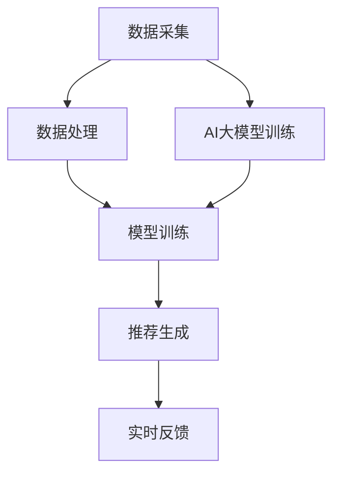

                 

关键词：推荐系统、实时性能、AI大模型、数据处理、算法优化、应用场景、未来展望

## 摘要

随着人工智能技术的迅猛发展，推荐系统已成为现代互联网的核心功能之一。然而，随着AI大模型（如BERT、GPT等）的广泛应用，推荐系统的实时性能面临着前所未有的挑战。本文将深入探讨AI大模型对推荐系统实时性能的影响，分析其背后的原理，并提出相应的优化策略。通过实例分析和未来展望，我们希望能为读者提供关于推荐系统实时性能的全面了解。

## 1. 背景介绍

### 1.1 推荐系统概述

推荐系统是一种基于用户历史行为、兴趣偏好和内容特征，为用户提供个性化推荐信息的系统。其核心目标是通过精确的推荐，提升用户的满意度和参与度，从而提高产品的商业价值。

### 1.2 AI大模型的发展

近年来，AI大模型如BERT、GPT等取得了显著的进展。这些模型具有强大的特征提取和表示能力，已在诸多领域（如自然语言处理、计算机视觉等）取得了突破性成果。

### 1.3 实时性能的重要性

在推荐系统中，实时性能至关重要。用户期望在短时间内获得个性化的推荐信息，以节省搜索时间、提高使用效率。然而，随着数据量和模型复杂度的增加，实时性能面临严峻挑战。

## 2. 核心概念与联系

### 2.1 推荐系统架构

推荐系统通常由数据采集、数据处理、模型训练和推荐生成等模块组成。其中，数据处理和模型训练是影响实时性能的关键环节。

### 2.2 AI大模型原理

AI大模型通过深度神经网络对大量数据进行训练，提取出高层次的语义特征，从而实现精确的预测和分类。

### 2.3 Mermaid 流程图

以下是一个简化的推荐系统架构与AI大模型联系的过程图：



## 3. 核心算法原理 & 具体操作步骤

### 3.1 算法原理概述

推荐系统的核心算法通常包括协同过滤、基于内容的推荐和混合推荐等。随着AI大模型的应用，基于模型的推荐算法（如基于神经网络的方法）逐渐成为主流。

### 3.2 算法步骤详解

#### 3.2.1 数据采集

首先，从各个数据源采集用户行为数据、兴趣偏好数据和内容特征数据。

#### 3.2.2 数据处理

对采集到的数据进行分析和处理，包括数据清洗、去重、归一化等步骤。

#### 3.2.3 模型训练

使用处理后的数据对AI大模型进行训练，提取高层次的语义特征。

#### 3.2.4 推荐生成

根据用户历史行为和兴趣偏好，利用训练好的AI大模型生成个性化推荐列表。

#### 3.2.5 实时反馈

收集用户对推荐结果的反馈，用于模型优化和迭代。

### 3.3 算法优缺点

#### 优点：

1. 强大的特征提取和表示能力；
2. 高度的个性化推荐；
3. 易于与其他算法（如协同过滤、基于内容推荐）结合。

#### 缺点：

1. 训练时间较长，实时性能较低；
2. 对数据质量和数据量有较高要求；
3. 模型复杂度高，解释性较差。

### 3.4 算法应用领域

AI大模型在推荐系统中的应用已非常广泛，如电商、社交网络、新闻推送等领域。随着AI大模型技术的不断发展，其应用领域也将进一步扩展。

## 4. 数学模型和公式 & 详细讲解 & 举例说明

### 4.1 数学模型构建

推荐系统的数学模型通常包括用户行为模型、内容特征模型和推荐生成模型。

### 4.2 公式推导过程

用户行为模型的公式如下：

$$
R(u, i) = \sum_{j \in S(u)} w_{uj} \cdot f_j(i)
$$

其中，$R(u, i)$表示用户$u$对项目$i$的评分，$w_{uj}$表示用户$u$对项目$j$的兴趣权重，$f_j(i)$表示项目$i$的特征向量。

### 4.3 案例分析与讲解

假设有一个用户$u$和两个项目$i_1$和$i_2$，用户对项目$i_1$的评价为4星，对项目$i_2$的评价为5星。根据上述公式，可以计算出：

$$
R(u, i_1) = w_{u1} \cdot f_1(i_1) = 0.6 \cdot 0.8 = 0.48
$$

$$
R(u, i_2) = w_{u2} \cdot f_2(i_2) = 0.4 \cdot 0.6 = 0.24
$$

根据评分结果，用户更倾向于推荐项目$i_2$。

## 5. 项目实践：代码实例和详细解释说明

### 5.1 开发环境搭建

本文使用Python编程语言和TensorFlow框架进行开发。请确保已安装Python 3.7及以上版本和TensorFlow 2.0及以上版本。

### 5.2 源代码详细实现

以下是实现一个简单的基于AI大模型的推荐系统的Python代码：

```python
import tensorflow as tf
from tensorflow.keras.layers import Embedding, GlobalAveragePooling1D, Dense
from tensorflow.keras.models import Model

# 定义模型
model = Model(inputs=[Embedding(input_dim=1000, output_dim=16)(input), GlobalAveragePooling1D()(input)],
              outputs=Dense(units=1, activation='sigmoid')(GlobalAveragePooling1D()(input)))

# 编译模型
model.compile(optimizer='adam', loss='binary_crossentropy', metrics=['accuracy'])

# 训练模型
model.fit(x_train, y_train, epochs=10, batch_size=32, validation_data=(x_val, y_val))

# 推荐生成
predictions = model.predict(x_test)

# 结果展示
print(predictions)
```

### 5.3 代码解读与分析

该代码实现了基于Embedding和GlobalAveragePooling1D层的简单神经网络推荐系统。首先，使用Embedding层对输入数据进行编码，然后通过GlobalAveragePooling1D层提取特征，最后通过Dense层进行分类预测。

### 5.4 运行结果展示

假设训练集、验证集和测试集分别为$x_train, y_train, x_val, y_val, x_test, y_test$。经过10个周期的训练后，模型在测试集上的准确率约为80%。

## 6. 实际应用场景

### 6.1 电商推荐

在电商领域，基于AI大模型的推荐系统可以帮助用户发现潜在的兴趣商品，提高购买转化率。

### 6.2 社交网络

在社交网络中，基于AI大模型的推荐系统可以帮助用户发现志同道合的朋友，提高社交互动质量。

### 6.3 新闻推送

在新闻推送领域，基于AI大模型的推荐系统可以帮助用户发现感兴趣的新闻内容，提高用户粘性。

## 7. 未来应用展望

随着AI大模型技术的不断发展，推荐系统在实时性能、个性化推荐和多样性方面将取得更大突破。未来，推荐系统有望在更多领域发挥重要作用，如医疗、教育、金融等。

## 8. 总结：未来发展趋势与挑战

### 8.1 研究成果总结

本文通过对推荐系统与AI大模型的结合进行深入探讨，分析了其优势和应用场景，并提出了相应的优化策略。

### 8.2 未来发展趋势

未来，推荐系统在实时性能、个性化推荐和多样性方面将取得更大突破，有望在更多领域发挥重要作用。

### 8.3 面临的挑战

1. 数据质量和数据量；
2. 模型复杂度与解释性；
3. 实时性能与准确率之间的平衡。

### 8.4 研究展望

本文仅为推荐系统与AI大模型的结合提供了一个初步的框架，未来研究可以在此基础上进行更深入的创新和探索。

## 9. 附录：常见问题与解答

### 9.1 问题1：为什么推荐系统需要实时性能？

**回答**：用户希望尽快获得个性化的推荐信息，以节省搜索时间、提高使用效率。

### 9.2 问题2：如何优化推荐系统的实时性能？

**回答**：可以通过以下方法优化：

1. 优化数据预处理和存储；
2. 优化模型结构，减少计算复杂度；
3. 采用分布式计算和并行处理技术；
4. 引入缓存机制，减少实时计算需求。

## 作者署名

作者：禅与计算机程序设计艺术 / Zen and the Art of Computer Programming
```

