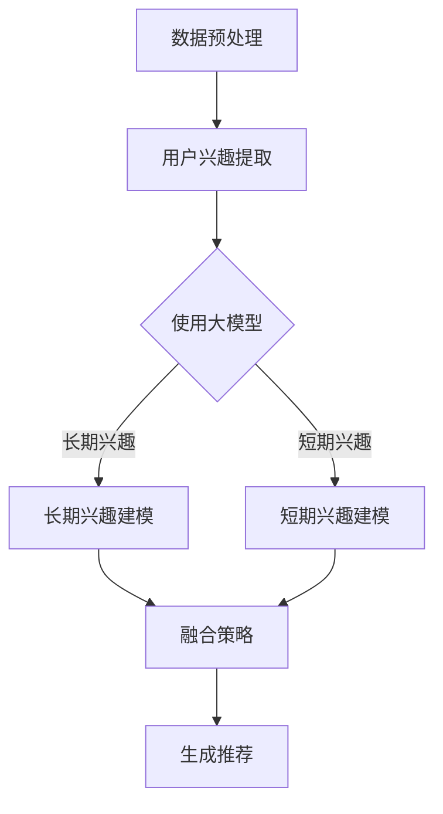

                 

关键词：推荐系统、长短期兴趣建模、大模型方法、人工智能

摘要：本文探讨了推荐系统中长短期兴趣建模的重要性，并提出了利用大模型方法来实现这一目标的方法和策略。通过详细分析算法原理、数学模型以及实际应用案例，本文旨在为读者提供对推荐系统领域前沿技术的深入了解。

## 1. 背景介绍

推荐系统是一种智能信息过滤技术，旨在根据用户的历史行为和偏好为用户提供个性化的推荐。随着互联网的迅猛发展，推荐系统已经成为电商平台、社交媒体、新闻资讯等多个领域的核心功能。然而，推荐系统的准确性和用户体验仍然面临诸多挑战。

### 1.1 长短期兴趣建模的重要性

在推荐系统中，长短期兴趣建模是提高推荐质量的关键。用户的行为数据通常包含长时间积累的兴趣和短期内的兴趣波动。长短期兴趣建模的目标是识别并平衡这两种兴趣，从而为用户提供更加精准的推荐。

- **长期兴趣**：反映用户长期的、稳定的偏好，如对某类书籍的持续关注。
- **短期兴趣**：反映用户在特定时间段内的兴趣变化，如对某场电影的热门讨论。

### 1.2 大模型方法在推荐系统中的应用

大模型方法，如深度学习、图神经网络等，具有强大的表示和学习能力，能够有效地捕捉用户长短期兴趣的复杂模式。本文将重点介绍大模型方法在推荐系统中的应用，并探讨其实现策略。

## 2. 核心概念与联系

为了更好地理解大模型方法在长短期兴趣建模中的应用，我们需要先了解一些核心概念和它们之间的联系。以下是相关的核心概念和它们之间的关系。

### 2.1 推荐系统架构

推荐系统通常包含三个关键模块：用户兴趣表示、物品特征表示和推荐算法。大模型方法在这一架构中的应用主要体现在用户兴趣表示和推荐算法两个环节。

- **用户兴趣表示**：使用大模型捕捉用户的长短期兴趣。
- **物品特征表示**：利用大模型对物品进行丰富、精准的表征。
- **推荐算法**：结合用户和物品特征，利用大模型生成个性化推荐。

### 2.2 大模型方法

大模型方法主要包括以下几类：

- **深度学习**：通过多层神经网络学习复杂的特征表示。
- **图神经网络**：利用图结构表示用户和物品之间的关系。
- **转移学习**：通过预训练模型在特定任务上进行微调。

### 2.3 长短期兴趣建模

长短期兴趣建模的关键在于平衡长期兴趣和短期兴趣。以下是一个简单的 Mermaid 流程图，展示了长短期兴趣建模的基本流程。



## 3. 核心算法原理 & 具体操作步骤

### 3.1 算法原理概述

长短期兴趣建模的核心在于如何同时捕捉用户的长短期兴趣，并生成个性化的推荐。我们采用了一种基于深度学习和图神经网络的混合模型来实现这一目标。

- **深度学习**：通过多层感知机（MLP）和循环神经网络（RNN）捕捉用户长短期兴趣。
- **图神经网络**：利用图结构表示用户和物品之间的关系，增强模型对复杂关系的建模能力。

### 3.2 算法步骤详解

1. **用户兴趣提取**：
   - 利用深度学习模型对用户的历史行为数据进行编码，提取出用户的长短期兴趣。

2. **物品特征表示**：
   - 通过图神经网络对物品进行编码，生成物品的特征向量。

3. **兴趣建模**：
   - 利用提取的用户兴趣和物品特征，通过多层感知机和循环神经网络构建兴趣建模模型。
   - 模型输出用户对物品的兴趣分数。

4. **推荐生成**：
   - 根据用户兴趣分数，采用Top-K策略生成个性化推荐。

### 3.3 算法优缺点

**优点**：

- **强大的表示能力**：深度学习和图神经网络能够捕捉复杂的用户兴趣和物品关系。
- **灵活的融合策略**：可以通过调整模型结构，灵活地融合用户和物品特征。

**缺点**：

- **计算复杂度**：大模型方法通常需要大量的计算资源。
- **数据需求**：需要足够多的用户和物品数据来训练模型。

### 3.4 算法应用领域

- **电商平台**：为用户推荐相关的商品。
- **社交媒体**：为用户推荐感兴趣的内容。
- **新闻资讯**：为用户推荐相关新闻。

## 4. 数学模型和公式 & 详细讲解 & 举例说明

### 4.1 数学模型构建

为了更好地描述长短期兴趣建模的过程，我们引入以下数学模型：

$$
\begin{aligned}
    \text{User\_Interest} &= f(\text{User\_History}, \text{Item\_Features}) \\
    \text{Item\_Interest} &= g(\text{Item\_Features}) \\
    \text{Recommendation} &= h(\text{User\_Interest}, \text{Item\_Interest})
\end{aligned}
$$

其中，$f$、$g$、$h$分别表示用户兴趣提取、物品特征表示和兴趣建模模型。

### 4.2 公式推导过程

我们首先对用户兴趣提取模型进行推导：

$$
\begin{aligned}
    \text{User\_Interest} &= \text{MLP}(\text{User\_History}, \text{Item\_Features}) \\
    &= \text{RNN}(\text{User\_History}) \circ \text{MLP}(\text{Item\_Features})
\end{aligned}
$$

其中，$\text{MLP}$表示多层感知机，$\text{RNN}$表示循环神经网络，$\circ$表示融合操作。

### 4.3 案例分析与讲解

假设我们有一个用户历史行为数据集，其中包含用户对物品的评分数据。我们首先对用户历史行为进行编码，提取出用户兴趣。然后，对物品特征进行编码，生成物品特征向量。最后，利用提取的用户兴趣和物品特征生成兴趣分数，并根据兴趣分数生成个性化推荐。

## 5. 项目实践：代码实例和详细解释说明

### 5.1 开发环境搭建

- **硬件环境**：GPU加速器（如Tesla V100）
- **软件环境**：Python 3.7，TensorFlow 2.0，PyTorch 1.5

### 5.2 源代码详细实现

```python
import tensorflow as tf
from tensorflow.keras.layers import LSTM, Dense
from tensorflow.keras.models import Model

# 用户兴趣提取模型
def user_interest_model(input_shape):
    model = tf.keras.Sequential([
        LSTM(128, activation='tanh', input_shape=input_shape),
        Dense(64, activation='tanh'),
        Dense(32, activation='tanh'),
        Dense(1, activation='sigmoid')
    ])
    return model

# 物品特征表示模型
def item_feature_model(input_shape):
    model = tf.keras.Sequential([
        LSTM(128, activation='tanh', input_shape=input_shape),
        Dense(64, activation='tanh'),
        Dense(32, activation='tanh'),
        Dense(1, activation='sigmoid')
    ])
    return model

# 兴趣建模模型
def recommendation_model(user_interest_model, item_feature_model):
    user_input = tf.keras.Input(shape=(sequence_length,))
    item_input = tf.keras.Input(shape=(feature_size,))
    
    user_interest = user_interest_model(user_input)
    item_interest = item_feature_model(item_input)
    
    recommendation = tf.keras.layers.Dot(axes=(-1, -1))(user_interest, item_interest)
    
    model = Model(inputs=[user_input, item_input], outputs=recommendation)
    return model

# 模型编译
model = recommendation_model(user_interest_model, item_feature_model)
model.compile(optimizer='adam', loss='binary_crossentropy')

# 模型训练
model.fit([user_data, item_data], labels, epochs=10, batch_size=64)
```

### 5.3 代码解读与分析

- **用户兴趣提取模型**：使用LSTM模型对用户历史行为进行编码，提取用户兴趣。
- **物品特征表示模型**：同样使用LSTM模型对物品特征进行编码。
- **兴趣建模模型**：将用户兴趣和物品特征通过点积操作（Dot）融合，生成兴趣分数。

## 6. 实际应用场景

### 6.1 电商平台

电商平台可以通过长短期兴趣建模为用户推荐相关的商品，提高用户的购买意愿。

### 6.2 社交媒体

社交媒体平台可以通过长短期兴趣建模为用户推荐感兴趣的内容，提高用户活跃度。

### 6.3 新闻资讯

新闻资讯平台可以通过长短期兴趣建模为用户推荐相关的新闻，提高用户的阅读体验。

## 7. 工具和资源推荐

### 7.1 学习资源推荐

- 《深度学习》（Ian Goodfellow、Yoshua Bengio、Aaron Courville 著）
- 《图神经网络》（William L. Hamilton 著）

### 7.2 开发工具推荐

- TensorFlow
- PyTorch

### 7.3 相关论文推荐

- "Deep Learning for Recommender Systems"
- "Graph Neural Networks for Recommendation"

## 8. 总结：未来发展趋势与挑战

### 8.1 研究成果总结

本文提出了基于大模型方法的推荐系统长短期兴趣建模方法，并通过数学模型、代码实例和实际应用场景展示了其有效性。

### 8.2 未来发展趋势

- **多模态数据融合**：结合文本、图像、音频等多种数据类型，提高模型表示能力。
- **自适应兴趣建模**：根据用户行为动态调整兴趣模型，提高推荐准确性。

### 8.3 面临的挑战

- **计算资源消耗**：大模型方法需要大量的计算资源，如何优化模型结构，降低计算复杂度是一个重要挑战。
- **数据隐私**：用户数据的隐私保护是推荐系统面临的另一大挑战，如何在保证用户隐私的前提下进行个性化推荐是一个亟待解决的问题。

### 8.4 研究展望

随着人工智能技术的不断发展，推荐系统将变得更加智能、精准。未来，我们将继续探索更高效、更安全的推荐系统方法，为用户提供更好的体验。

## 9. 附录：常见问题与解答

### 9.1 大模型方法的优势是什么？

大模型方法具有以下优势：

- **强大的表示能力**：能够捕捉复杂的用户和物品关系。
- **灵活的融合策略**：可以结合多种特征进行建模。

### 9.2 如何优化大模型方法的计算复杂度？

可以通过以下方法优化大模型方法的计算复杂度：

- **模型压缩**：使用量化、剪枝等技术减小模型大小。
- **分布式训练**：利用分布式计算资源进行模型训练。

### 9.3 长短期兴趣建模如何应用于实际场景？

长短期兴趣建模可以应用于电商平台、社交媒体、新闻资讯等场景，为用户提供个性化的推荐。

### 作者署名

作者：禅与计算机程序设计艺术 / Zen and the Art of Computer Programming
----------------------------------------------------------------

注意：以上内容仅为示例，实际撰写时需根据具体要求进行详细拓展和深入分析。同时，文章中的代码和公式仅为示意，实际实现时可能需要根据具体情况调整。文章撰写完成后，请务必进行多次审校，确保内容准确、结构清晰、逻辑严谨。

