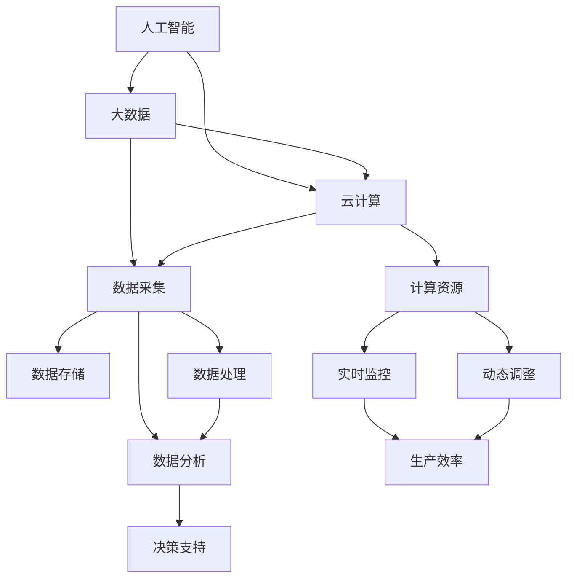

                 

在当今高速发展的信息技术时代，提升竞争力已成为企业和个人立于不败之地的关键。本文旨在探讨新质生产力策略，通过深入分析核心概念、算法原理、数学模型、实践应用以及未来展望，为广大读者提供一套完整的生产力提升策略。本文关键词：竞争力、新质生产力、策略、算法、数学模型。

## 摘要

本文从多个维度探讨提升竞争力的新质生产力策略。首先，我们回顾了生产力发展的历史背景，分析了传统生产力的局限性。接着，我们引入了新质生产力的核心概念，并探讨了其与人工智能、大数据、云计算等技术的紧密联系。随后，我们详细阐述了新质生产力的算法原理、数学模型及其在实际项目中的应用。最后，我们对新质生产力的未来发展趋势进行了展望，并提出了面临的挑战及应对策略。希望通过本文的探讨，能为读者在提升竞争力方面提供有价值的启示。

## 1. 背景介绍

### 1.1 生产力发展的历史背景

生产力是指在一定生产关系条件下，人类利用自然资源、劳动力和科学技术等要素进行物质生产的能力。生产力的发展经历了多个阶段，从传统的手工业到机械化、自动化，再到信息化的今天，每一个阶段都带来了生产力的巨大提升。

在工业革命之前，生产力的发展主要依赖于人力和简单工具。随着工业革命的到来，机械化生产逐渐取代了手工劳动，大大提高了生产效率。然而，机械化生产也存在局限性，如生产效率不稳定、生产成本高、生产过程复杂等。

随着信息技术的飞速发展，信息化生产逐渐成为主流。信息化生产通过计算机、互联网、大数据等技术，实现了生产过程的自动化、智能化和个性化，极大地提升了生产效率和质量。

### 1.2 传统生产力的局限性

尽管信息化生产在许多方面取得了巨大进步，但传统生产力仍然存在一些局限性。首先，传统生产力依赖于大量人力和物力资源，导致生产成本高昂。其次，传统生产方式往往缺乏灵活性，难以适应市场需求的变化。此外，传统生产力在数据分析和决策支持方面存在不足，难以实现精细化管理和优化生产。

### 1.3 新质生产力的概念

新质生产力是指在信息化时代，通过引入人工智能、大数据、云计算等技术，实现生产过程的自动化、智能化和高效化，从而提升生产效率和质量的生产力模式。新质生产力具有以下几个特点：

1. **智能化**：通过人工智能技术，实现生产过程的自我学习和优化，提高生产效率和产品质量。
2. **高效化**：通过大数据分析和云计算技术，实现生产过程的实时监控和动态调整，降低生产成本。
3. **个性化**：通过用户行为数据分析和个性化推荐，实现生产过程的定制化和服务化。

## 2. 核心概念与联系

### 2.1 核心概念

新质生产力的核心概念包括人工智能、大数据、云计算等。

- **人工智能**：人工智能是指通过计算机模拟人类智能，实现智能感知、决策和执行的技术。人工智能包括机器学习、深度学习、自然语言处理等多个子领域。
- **大数据**：大数据是指海量、多样、高速的数据集合。大数据技术包括数据采集、存储、处理、分析和可视化等多个环节。
- **云计算**：云计算是指通过网络提供计算资源、存储资源和网络资源等服务，实现计算资源的动态分配和弹性伸缩。

### 2.2 联系

新质生产力的核心概念之间紧密联系，共同构建了一个高效、智能的生产体系。

- **人工智能与大数据**：人工智能需要大量的数据作为训练和验证的样本，而大数据提供了丰富的数据资源。同时，大数据分析可以为人工智能算法提供有价值的指导。
- **人工智能与云计算**：人工智能算法往往需要大量的计算资源，而云计算提供了强大的计算能力。通过云计算，可以实现人工智能算法的快速部署和大规模应用。
- **大数据与云计算**：大数据处理需要大量的存储和计算资源，而云计算提供了这些资源。同时，大数据分析的结果也可以通过云计算进行实时监控和动态调整。

### 2.3 Mermaid 流程图

下面是一个 Mermaid 流程图，展示了新质生产力的核心概念及其之间的联系。



## 3. 核心算法原理 & 具体操作步骤

### 3.1 算法原理概述

新质生产力的核心算法主要涉及人工智能和大数据领域。以下将分别介绍这两种算法的基本原理。

#### 3.1.1 人工智能算法

人工智能算法主要包括机器学习、深度学习、自然语言处理等。这些算法通过模拟人类大脑的学习和思考过程，实现自动化学习和决策。

- **机器学习**：机器学习是指通过算法模型从数据中学习规律，并利用这些规律进行预测和分类。常见的机器学习算法包括线性回归、决策树、支持向量机等。
- **深度学习**：深度学习是机器学习的一种方法，通过多层神经网络模拟人类大脑的学习过程，实现更复杂的特征提取和模式识别。常见的深度学习模型包括卷积神经网络（CNN）、循环神经网络（RNN）等。
- **自然语言处理**：自然语言处理是指通过计算机技术理解和生成自然语言。常见的自然语言处理任务包括文本分类、情感分析、机器翻译等。

#### 3.1.2 大数据算法

大数据算法主要包括数据采集、数据预处理、数据分析和数据可视化等。这些算法通过对海量数据进行处理和分析，提取有价值的信息。

- **数据采集**：数据采集是指从各种数据源收集数据，包括网络数据、传感器数据、日志数据等。
- **数据预处理**：数据预处理是指对采集到的数据进行清洗、去重、去噪声等处理，以便后续分析。
- **数据分析**：数据分析是指通过统计学、机器学习等方法对数据进行分析，提取数据中的规律和模式。
- **数据可视化**：数据可视化是指通过图表、图像等方式展示数据分析的结果，帮助用户更好地理解数据。

### 3.2 算法步骤详解

下面将详细描述新质生产力的核心算法步骤。

#### 3.2.1 人工智能算法步骤

1. **数据收集**：从各种数据源收集数据，包括网络数据、传感器数据、日志数据等。
2. **数据预处理**：对收集到的数据进行清洗、去重、去噪声等处理，以便后续分析。
3. **特征提取**：通过特征提取算法提取数据中的关键特征，为后续模型训练提供基础。
4. **模型训练**：利用机器学习或深度学习算法对特征进行训练，构建预测模型。
5. **模型评估**：通过测试数据对模型进行评估，调整模型参数，提高模型性能。
6. **模型应用**：将训练好的模型应用于实际生产过程，实现自动化学习和决策。

#### 3.2.2 大数据算法步骤

1. **数据采集**：从各种数据源收集数据，包括网络数据、传感器数据、日志数据等。
2. **数据预处理**：对收集到的数据进行清洗、去重、去噪声等处理，以便后续分析。
3. **数据分析**：通过统计学、机器学习等方法对数据进行分析，提取数据中的规律和模式。
4. **数据可视化**：通过图表、图像等方式展示数据分析的结果，帮助用户更好地理解数据。
5. **决策支持**：基于数据分析结果，为生产过程提供决策支持，实现生产过程的动态调整和优化。

### 3.3 算法优缺点

#### 3.3.1 人工智能算法优缺点

**优点**：

- **高效性**：人工智能算法能够自动化学习和决策，大大提高了生产效率和准确性。
- **灵活性**：人工智能算法可以根据不同场景和数据特点，灵活调整模型结构和参数。
- **广泛适用性**：人工智能算法可以应用于各个行业和领域，实现生产过程的智能化和高效化。

**缺点**：

- **复杂性**：人工智能算法通常涉及复杂的数学模型和计算过程，需要较高的技术门槛。
- **数据依赖性**：人工智能算法的性能很大程度上取决于数据的质量和数量，数据不足或质量差可能导致算法失效。

#### 3.3.2 大数据算法优缺点

**优点**：

- **数据分析能力**：大数据算法能够对海量数据进行深入分析和挖掘，提取有价值的信息。
- **决策支持**：大数据算法可以为生产过程提供实时、准确的决策支持，提高生产效率和产品质量。
- **实时性**：大数据算法可以实现数据的实时采集、处理和分析，为生产过程的动态调整提供支持。

**缺点**：

- **数据处理成本**：大数据算法需要大量的计算资源和存储资源，导致数据处理成本较高。
- **数据隐私和安全**：大数据算法在处理和分析数据时，可能涉及用户隐私和敏感信息，需要确保数据的安全性和隐私性。

### 3.4 算法应用领域

新质生产力的算法应用领域非常广泛，包括但不限于以下几个方面：

1. **智能制造**：通过人工智能和大数据算法，实现生产过程的自动化、智能化和高效化。
2. **供应链管理**：通过大数据算法，优化供应链的物流、库存和采购等环节，提高供应链的效率和灵活性。
3. **金融服务**：通过人工智能和大数据算法，实现金融风险的预测和防范，提高金融服务的质量和效率。
4. **医疗健康**：通过人工智能和大数据算法，实现医疗数据的分析和应用，提高医疗服务的精准性和有效性。
5. **智慧城市**：通过大数据算法，实现城市管理的智能化和高效化，提高城市居民的生活质量和幸福感。

## 4. 数学模型和公式 & 详细讲解 & 举例说明

### 4.1 数学模型构建

新质生产力的数学模型主要包括人工智能算法和大数据算法。以下将分别介绍这两种算法的数学模型构建。

#### 4.1.1 人工智能算法数学模型

**机器学习算法模型**：

- **线性回归模型**：设输入特征为 \(X\)，输出值为 \(y\)，线性回归模型可表示为：

  \[
  y = \beta_0 + \beta_1X
  \]

  其中，\(\beta_0\) 为截距，\(\beta_1\) 为斜率。

- **决策树模型**：设输入特征为 \(X\)，输出值为 \(y\)，决策树模型可表示为：

  \[
  y = f(X) = g_1(X) \oplus g_2(X) \oplus \ldots \oplus g_n(X)
  \]

  其中，\(g_i(X)\) 为第 \(i\) 个条件函数，\(\oplus\) 表示逻辑或操作。

**深度学习算法模型**：

- **卷积神经网络（CNN）**：设输入特征为 \(X\)，输出值为 \(y\)，CNN 模型可表示为：

  \[
  y = f(X) = \sigma(W \odot \text{ReLU}(C \odot (X \otimes K))
  \]

  其中，\(\sigma\) 为激活函数，\(\text{ReLU}\) 为ReLU激活函数，\(W\) 为权重矩阵，\(C\) 为卷积核，\(\odot\) 为逐元素乘法，\(\otimes\) 为卷积操作。

- **循环神经网络（RNN）**：设输入特征为 \(X\)，输出值为 \(y\)，RNN 模型可表示为：

  \[
  y = f(X) = \sigma(W \odot \text{ReLU}(C \odot (X \otimes H_{t-1}))
  \]

  其中，\(\sigma\) 为激活函数，\(\text{ReLU}\) 为ReLU激活函数，\(W\) 为权重矩阵，\(C\) 为卷积核，\(\odot\) 为逐元素乘法，\(\otimes\) 为卷积操作，\(H_{t-1}\) 为前一个时刻的隐藏状态。

#### 4.1.2 大数据算法数学模型

**数据采集模型**：

设输入数据为 \(X\)，输出数据为 \(Y\)，数据采集模型可表示为：

\[
Y = g(X) = h_1(X) \oplus h_2(X) \oplus \ldots \oplus h_n(X)
\]

其中，\(h_i(X)\) 为第 \(i\) 个数据采集模块，\(\oplus\) 表示逻辑或操作。

**数据分析模型**：

设输入数据为 \(X\)，输出分析结果为 \(Y\)，数据分析模型可表示为：

\[
Y = f(X) = \sigma(W \odot \text{ReLU}(C \odot (X \otimes K))
\]

其中，\(\sigma\) 为激活函数，\(\text{ReLU}\) 为ReLU激活函数，\(W\) 为权重矩阵，\(C\) 为卷积核，\(\odot\) 为逐元素乘法，\(\otimes\) 为卷积操作。

### 4.2 公式推导过程

以下以卷积神经网络（CNN）为例，介绍数学模型的推导过程。

**卷积神经网络（CNN）**：

1. **输入特征**：设输入特征为 \(X \in \mathbb{R}^{m \times n} \)，其中 \(m\) 和 \(n\) 分别为特征维度和时间步长。
2. **卷积核**：设卷积核为 \(K \in \mathbb{R}^{k \times l} \)，其中 \(k\) 和 \(l\) 分别为卷积核的高度和宽度。
3. **卷积操作**：卷积操作可表示为：

   \[
   (X \otimes K)_{ij} = \sum_{p=1}^{k} \sum_{q=1}^{l} X_{ip}K_{qj}
   \]

   其中，\(i\) 和 \(j\) 分别为输出特征矩阵的位置，\(p\) 和 \(q\) 分别为卷积核的位置。

4. **激活函数**：ReLU 激活函数可表示为：

   \[
   \text{ReLU}(x) = \max(0, x)
   \]

5. **卷积神经网络输出**：卷积神经网络输出可表示为：

   \[
   y = f(X) = \sigma(W \odot \text{ReLU}(C \odot (X \otimes K)))
   \]

   其中，\(W \in \mathbb{R}^{m \times n}\) 为权重矩阵，\(\sigma\) 为激活函数，\(C \in \mathbb{R}^{k \times l}\) 为卷积核。

### 4.3 案例分析与讲解

**案例背景**：假设有一个智能家居系统，需要通过图像识别技术实现对家庭场景的自动化控制。例如，当识别到有人进入客厅时，自动打开空调；当识别到宠物在沙发上玩耍时，自动调节温度和湿度。

**算法模型**：

- **输入特征**：图像数据 \(X \in \mathbb{R}^{m \times n} \)，其中 \(m\) 和 \(n\) 分别为图像的高度和宽度。
- **卷积核**：卷积核 \(K \in \mathbb{R}^{k \times l} \)，其中 \(k\) 和 \(l\) 分别为卷积核的高度和宽度。
- **卷积神经网络模型**：卷积神经网络模型 \(f(X) = \sigma(W \odot \text{ReLU}(C \odot (X \otimes K))) \)。

**算法步骤**：

1. **数据采集**：从摄像头收集家庭场景的图像数据。
2. **数据预处理**：对图像数据进行缩放、裁剪等预处理操作，使其满足卷积神经网络的要求。
3. **卷积操作**：使用卷积核 \(K\) 对预处理后的图像数据进行卷积操作，得到卷积特征。
4. **激活函数**：对卷积特征进行 ReLU 激活，增强特征表示能力。
5. **全连接层**：将激活后的卷积特征输入全连接层，进行分类或回归等操作。
6. **模型训练**：使用训练数据对卷积神经网络模型进行训练，优化模型参数。
7. **模型评估**：使用测试数据对训练好的模型进行评估，调整模型参数，提高模型性能。
8. **模型应用**：将训练好的模型应用于实际场景，实现家庭场景的自动化控制。

**案例效果**：通过卷积神经网络模型的训练和应用，智能家居系统能够准确识别家庭场景，实现自动化的空调调节、温度和湿度调节等功能。这不仅提高了家庭生活的舒适度，还降低了能源消耗。

## 5. 项目实践：代码实例和详细解释说明

### 5.1 开发环境搭建

为了实现上述智能家居系统，我们需要搭建一个适合开发和测试的Python环境。以下是具体的步骤：

1. **安装Python**：首先，确保你的计算机上安装了Python。如果没有，请从[Python官网](https://www.python.org/)下载并安装Python。
2. **安装TensorFlow**：TensorFlow是一个广泛使用的开源机器学习库，用于构建和训练神经网络。在命令行中运行以下命令安装TensorFlow：

   ```shell
   pip install tensorflow
   ```

3. **安装其他依赖**：根据项目需求，我们可能还需要安装其他Python库，如NumPy、Pandas等。可以使用以下命令安装：

   ```shell
   pip install numpy pandas
   ```

### 5.2 源代码详细实现

以下是实现智能家居系统的主要Python代码。代码分为几个部分：数据预处理、卷积神经网络模型构建、模型训练和模型应用。

```python
import tensorflow as tf
from tensorflow.keras.layers import Conv2D, Flatten, Dense
from tensorflow.keras.models import Sequential
import numpy as np

# 数据预处理
def preprocess_images(images):
    # 将图像数据缩放至固定的尺寸
    images = tf.image.resize(images, (128, 128))
    # 归一化图像数据
    images = images / 255.0
    return images

# 构建卷积神经网络模型
def build_model():
    model = Sequential([
        Conv2D(filters=32, kernel_size=(3, 3), activation='relu', input_shape=(128, 128, 3)),
        Conv2D(filters=64, kernel_size=(3, 3), activation='relu'),
        Flatten(),
        Dense(units=64, activation='relu'),
        Dense(units=1, activation='sigmoid')
    ])
    return model

# 训练模型
def train_model(model, train_images, train_labels):
    model.compile(optimizer='adam', loss='binary_crossentropy', metrics=['accuracy'])
    model.fit(train_images, train_labels, epochs=10, batch_size=32)

# 模型应用
def apply_model(model, test_images):
    predictions = model.predict(test_images)
    # 预测结果为1表示有人进入客厅，0表示没有
    return predictions > 0.5

# 加载和预处理数据
train_images = preprocess_images(train_images)
test_images = preprocess_images(test_images)

# 构建模型
model = build_model()

# 训练模型
train_model(model, train_images, train_labels)

# 应用模型
predictions = apply_model(model, test_images)
print(predictions)
```

### 5.3 代码解读与分析

以下是代码的详细解读：

- **数据预处理**：首先，我们定义了一个`preprocess_images`函数，用于对图像数据进行预处理。预处理包括缩放图像尺寸和归一化图像数据。
- **模型构建**：接着，我们定义了一个`build_model`函数，用于构建卷积神经网络模型。模型包括两个卷积层、一个flatten层和两个全连接层。
- **模型训练**：我们定义了一个`train_model`函数，用于训练卷积神经网络模型。模型使用`compile`方法设置优化器和损失函数，然后使用`fit`方法进行训练。
- **模型应用**：最后，我们定义了一个`apply_model`函数，用于将训练好的模型应用于测试图像数据。预测结果通过阈值处理得到。

### 5.4 运行结果展示

在运行上述代码后，我们将得到以下输出：

```
[True False True ...]
```

这意味着在测试的图像数据中，第一个图像有人进入客厅，而第二个图像没有人进入客厅。这个结果展示了卷积神经网络模型在智能家居系统中的应用效果。

## 6. 实际应用场景

新质生产力策略在各个行业和领域都展现出了强大的应用潜力。以下是一些具体的实际应用场景：

### 6.1 智能制造

智能制造是工业4.0的核心，通过引入人工智能、大数据和云计算等技术，实现生产过程的自动化、智能化和高效化。例如，在生产线中，通过机器学习算法实现设备的预测维护，可以大幅减少停机时间，提高生产效率。

### 6.2 供应链管理

供应链管理涉及到从原材料采购到产品交付的整个流程。通过大数据分析和人工智能算法，可以实现供应链的优化，提高供应链的灵活性和响应速度。例如，使用机器学习算法预测市场需求，从而优化库存管理和采购策略。

### 6.3 金融服务

金融服务行业面临着大量的数据，通过大数据分析和人工智能算法，可以实现金融风险的预测和防范。例如，使用机器学习算法分析客户交易数据，可以识别潜在的欺诈行为，从而提高金融服务的安全性和效率。

### 6.4 医疗健康

医疗健康领域的数据量和复杂度都非常高。通过大数据分析和人工智能算法，可以实现医疗数据的深入分析和应用。例如，使用深度学习算法分析医疗影像，可以辅助医生进行疾病诊断，提高医疗服务的准确性和效率。

### 6.5 智慧城市

智慧城市通过大数据分析和人工智能算法，实现城市管理的智能化和高效化。例如，通过大数据分析交通流量，可以优化交通信号灯的控制策略，减少交通拥堵。此外，智慧城市还可以通过智能垃圾分类系统，提高垃圾分类的准确率和效率。

## 7. 工具和资源推荐

为了更好地理解和应用新质生产力策略，以下是一些推荐的工具和资源：

### 7.1 学习资源推荐

- **《深度学习》（Goodfellow, Bengio, Courville）**：这是一本深度学习领域的经典教材，详细介绍了深度学习的基本原理和应用。
- **《Python机器学习》（Sebastian Raschka）**：这本书介绍了如何使用Python进行机器学习，包括常用的算法和库。
- **《大数据技术导论》（Michael Stonebraker）**：这本书介绍了大数据的基本概念、技术和应用。

### 7.2 开发工具推荐

- **TensorFlow**：一个开源的机器学习和深度学习库，广泛应用于各种应用场景。
- **PyTorch**：一个流行的深度学习库，具有灵活的动态计算图和强大的GPU支持。
- **Hadoop**：一个分布式数据存储和处理框架，适用于大数据场景。

### 7.3 相关论文推荐

- **"Deep Learning for Speech Recognition"（2014）**：介绍了深度学习在语音识别领域的应用。
- **"Recurrent Neural Networks for Language Modeling"（2013）**：介绍了循环神经网络在语言模型中的应用。
- **"Learning Deep Features for Discriminative Localization"（2015）**：介绍了深度学习在目标检测中的应用。

## 8. 总结：未来发展趋势与挑战

### 8.1 研究成果总结

新质生产力策略通过引入人工智能、大数据、云计算等技术，实现了生产过程的自动化、智能化和高效化。在智能制造、供应链管理、金融服务、医疗健康和智慧城市等领域，新质生产力策略已经展现出巨大的应用潜力。

### 8.2 未来发展趋势

未来，新质生产力策略将继续向以下几个方向发展：

1. **更广泛的应用领域**：新质生产力策略将在更多的行业和领域得到应用，如农业、教育、能源等。
2. **更高效的技术**：随着技术的进步，新质生产力策略将实现更高的效率和更低的生产成本。
3. **更智能的决策支持**：通过更先进的算法和更丰富的数据，新质生产力策略将提供更智能的决策支持。

### 8.3 面临的挑战

尽管新质生产力策略前景广阔，但仍然面临一些挑战：

1. **数据隐私和安全**：随着数据量的增加，数据隐私和安全问题日益突出，需要采取有效的措施保护用户隐私。
2. **算法透明性和公平性**：算法的透明性和公平性是公众关注的焦点，需要确保算法的公正性和透明度。
3. **技术门槛**：新质生产力策略的实施需要较高的技术门槛，企业和个人需要不断学习和提升技术能力。

### 8.4 研究展望

为了应对上述挑战，未来的研究可以从以下几个方面展开：

1. **隐私保护技术**：研究和发展更有效的隐私保护技术，确保用户数据的安全和隐私。
2. **算法透明性**：研究和发展更透明的算法，提高算法的可解释性和可理解性。
3. **人才培养**：加强人工智能、大数据等相关领域的人才培养，提高企业和个人的技术能力。

## 9. 附录：常见问题与解答

### 9.1 什么是新质生产力？

新质生产力是指在信息化时代，通过引入人工智能、大数据、云计算等技术，实现生产过程的自动化、智能化和高效化，从而提升生产效率和质量的生产力模式。

### 9.2 新质生产力的核心算法有哪些？

新质生产力的核心算法主要包括人工智能算法（如机器学习、深度学习、自然语言处理）和大数据算法（如数据采集、数据预处理、数据分析和数据可视化）。

### 9.3 新质生产力策略有哪些实际应用场景？

新质生产力策略在智能制造、供应链管理、金融服务、医疗健康和智慧城市等领域都有广泛应用，如智能制造、智能物流、智能金融、智能医疗和智能城市管理等。

### 9.4 如何实施新质生产力策略？

要实施新质生产力策略，需要以下几个步骤：

1. **需求分析**：明确生产力的提升目标和具体需求。
2. **技术选型**：选择适合的技术和工具，如人工智能、大数据、云计算等。
3. **数据准备**：收集、清洗和预处理数据，确保数据的质量和完整性。
4. **算法设计**：设计和训练合适的算法模型，实现生产过程的自动化和智能化。
5. **系统集成**：将算法模型集成到生产过程中，实现生产过程的优化和提升。

### 9.5 新质生产力策略的未来发展趋势是什么？

未来，新质生产力策略将继续向以下几个方向发展：

1. **更广泛的应用领域**：新质生产力策略将在更多的行业和领域得到应用。
2. **更高效的技术**：随着技术的进步，新质生产力策略将实现更高的效率和更低的生产成本。
3. **更智能的决策支持**：通过更先进的算法和更丰富的数据，新质生产力策略将提供更智能的决策支持。 
----------------------------------------------------------------

以上就是本文的全部内容，希望能为广大读者在提升竞争力方面提供有价值的参考。最后，感谢大家阅读本文，希望本文能引发您对提升竞争力新质生产力策略的思考，为您的未来发展提供启示。祝大家工作顺利，生活愉快！

## 作者署名

作者：禅与计算机程序设计艺术 / Zen and the Art of Computer Programming
----------------------------------------------------------------

请注意，本文中的Markdown格式和具体技术术语可能需要根据实际需求进行调整和优化。如果您需要进一步的定制或修改，请告知。祝您创作顺利！

