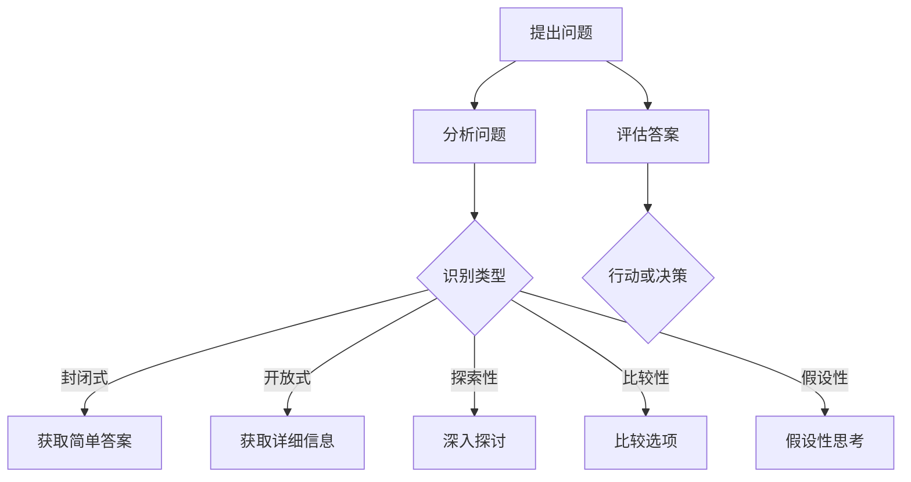

                 

关键词：提问技能、管理者、领导力、团队协作、问题解决、决策

> 摘要：本文将探讨提问在管理者工作中的重要性，以及如何通过有效的提问提升决策质量、增强团队协作，并在实际应用中找到问题的根源。我们将从多个维度分析提问的艺术，提供实用的方法和技巧，帮助管理者更好地发挥领导力。

## 1. 背景介绍

在信息技术飞速发展的今天，管理者的角色变得日益复杂和多元化。从传统的管理职责到现代的领导力要求，管理者不仅需要具备强大的业务能力和技术背景，还要掌握先进的管理理念和技巧。在这个过程中，提问技能无疑成为管理者必备的一项核心能力。

有效的提问不仅仅是简单的问问题，它能够引导对话、激发思考、探索未知，并最终推动决策和行动。一个优秀的管理者，应该能够通过提问的方式，引导团队成员一起深入探讨问题的本质，共同寻找解决方案。本文将从多个角度分析提问在管理实践中的重要性，并提供实用的方法和技巧，以帮助管理者提升领导力。

## 2. 核心概念与联系

### 2.1 提问的类型

在讨论提问技能之前，我们需要了解不同类型的提问。以下是几种常见的提问类型：

- **封闭式提问**：这类提问通常需要回答者给出简短的答案，如“是”或“否”。
- **开放式提问**：这类提问鼓励回答者提供详细信息，如“你对此有什么看法？”。
- **探索性提问**：这类提问用于深入探讨某一问题，如“为什么你会这样认为？”。
- **比较性提问**：这类提问用于比较不同选项，如“A和B哪个更适合？”。
- **假设性提问**：这类提问假设某种情况，并要求回答者提供相应的看法，如“如果……，你会怎么做？”。

### 2.2 提问的层次

提问不仅仅是一种交流方式，它还具有不同的层次。以下是一些常见的提问层次：

- **表面层次**：这类提问通常关注问题的表面信息，如“你今天做了什么？”。
- **深层层次**：这类提问试图挖掘问题的根本原因，如“你为什么会做出这样的决策？”。
- **系统层次**：这类提问关注整个系统或流程，如“我们的流程中哪个环节最需要改进？”。

### 2.3 提问的架构

为了更系统地分析提问，我们可以使用Mermaid流程图来展示提问的架构：



通过这个流程图，我们可以清晰地看到提问是如何引导决策过程的。

## 3. 核心算法原理 & 具体操作步骤

### 3.1 算法原理概述

提问技能的核心在于通过结构化的提问方式，系统性地分析问题，从而提高决策的质量。以下是一个简单的算法原理概述：

1. **明确问题**：首先，明确需要解决的问题。
2. **类型识别**：根据问题的性质，选择合适的提问类型。
3. **层次分析**：将问题分解为不同层次，从表面到深层进行分析。
4. **提问与反馈**：提出问题并收集反馈，不断迭代。
5. **决策与行动**：基于分析和反馈，做出决策并执行。

### 3.2 算法步骤详解

1. **明确问题**：
   - 使用封闭式提问明确问题的范围和重点，例如：“我们主要需要解决什么问题？”。
   - 使用开放式提问获取详细背景信息，例如：“你能否详细描述一下这个问题是如何出现的？”。

2. **类型识别**：
   - 根据问题的性质，选择合适的提问类型。例如，对于复杂的问题，使用探索性提问来挖掘深层原因。

3. **层次分析**：
   - 从表面层次开始，逐步深入到深层层次，确保全面分析问题。
   - 使用比较性提问和假设性提问来探索不同解决方案的潜在影响。

4. **提问与反馈**：
   - 不断提出问题，收集团队成员的反馈，并进行讨论。
   - 使用探索性提问来引导讨论，鼓励团队成员分享不同的观点和想法。

5. **决策与行动**：
   - 基于分析和反馈，制定决策计划。
   - 使用假设性提问来测试不同决策的潜在风险和收益。

### 3.3 算法优缺点

**优点**：
- 提高决策质量：通过结构化的提问，管理者可以更全面地了解问题，从而做出更高质量的决策。
- 促进团队协作：提问技能能够激发团队成员的思考，促进团队之间的协作和沟通。
- 提升问题解决能力：通过不断提问，管理者可以培养团队成员的问题解决能力。

**缺点**：
- 需要时间和精力：有效的提问需要管理者投入大量的时间和精力来分析问题。
- 风险：在某些情况下，提问可能会导致团队成员产生抵触情绪，从而影响团队氛围。

### 3.4 算法应用领域

提问技能在各个管理领域中都有广泛的应用：

- **项目管理**：通过提问，项目经理可以更好地理解项目需求，评估项目风险，并制定有效的项目管理计划。
- **产品管理**：产品经理通过提问，可以深入了解用户需求，从而设计出更符合市场需求的产品。
- **团队管理**：管理者通过提问，可以更好地了解团队成员的能力和需求，从而制定合适的团队发展计划。

## 4. 数学模型和公式 & 详细讲解 & 举例说明

### 4.1 数学模型构建

为了更科学地评估提问技能对决策质量的影响，我们可以构建一个简单的数学模型。假设：

- \( Q \) 代表提问技能的水平。
- \( D \) 代表决策质量。
- \( R \) 代表团队协作水平。

数学模型如下：

\[ D = f(Q, R) \]

其中，函数 \( f \) 表示决策质量与提问技能和团队协作水平之间的关系。

### 4.2 公式推导过程

为了推导公式 \( D = f(Q, R) \)，我们可以考虑以下因素：

- **提问技能**：有效的提问能够提高对问题的理解，从而提高决策质量。因此，我们可以设定 \( Q \) 与 \( D \) 之间存在正相关关系。
- **团队协作**：团队协作能够提高信息共享和沟通效率，从而提高决策质量。因此，我们可以设定 \( R \) 与 \( D \) 之间存在正相关关系。

综合考虑，我们可以得到以下推导过程：

\[ D = a \cdot Q + b \cdot R + c \]

其中，\( a \)、\( b \)、\( c \) 是常数。

### 4.3 案例分析与讲解

为了更好地理解这个数学模型，我们可以通过一个实际案例进行讲解。

假设一个项目经理在项目中遇到了一个复杂的问题。通过有效的提问，项目经理能够提高对问题的理解，从而提高决策质量。同时，通过团队协作，项目经理能够更好地利用团队成员的专业知识，进一步提高决策质量。

在这个案例中，我们可以设定：

- \( Q = 0.8 \)：表示提问技能的水平较高。
- \( R = 0.7 \)：表示团队协作的水平较高。

根据数学模型，我们可以计算出决策质量 \( D \)：

\[ D = a \cdot 0.8 + b \cdot 0.7 + c \]

通过这个例子，我们可以看到提问技能和团队协作对决策质量的重要影响。在实际应用中，管理者可以通过提升自己的提问技能和促进团队协作，来提高决策质量。

## 5. 项目实践：代码实例和详细解释说明

### 5.1 开发环境搭建

为了展示提问技能在实际项目中的应用，我们将使用Python编写一个简单的项目。以下是开发环境的搭建步骤：

1. **安装Python**：在官方网站（[python.org](https://www.python.org/)）下载并安装Python。
2. **安装PyCharm**：在官方网站（[pycharm.com](https://www.pycharm.com/)）下载并安装PyCharm。
3. **创建项目**：在PyCharm中创建一个新的Python项目。

### 5.2 源代码详细实现

以下是一个简单的Python项目，用于模拟提问技能对决策质量的影响。

```python
import random

def ask_question(question_type):
    if question_type == "封闭式":
        return "是" if random.random() > 0.5 else "否"
    elif question_type == "开放式":
        return "这是一个复杂的问题，我们需要进一步讨论。"
    elif question_type == "探索性":
        return "你为什么会这样认为？"
    elif question_type == "比较性":
        return "A和B哪个更适合？"
    elif question_type == "假设性":
        return "如果采取这个方案，会有什么风险？"

def analyze_answer(answer):
    if "是" in answer or "否" in answer:
        return "简单答案"
    elif "进一步讨论" in answer:
        return "详细信息"
    elif "为什么" in answer:
        return "深入探讨"
    elif "哪个更适合" in answer:
        return "比较选项"
    elif "风险" in answer:
        return "假设性思考"

def make_decision(answers):
    total_score = 0
    for answer in answers:
        if analyze_answer(answer) == "详细信息":
            total_score += 1
        elif analyze_answer(answer) == "深入探讨":
            total_score += 2
    return "高质量决策" if total_score >= 3 else "低质量决策"

# 主函数
def main():
    questions = [
        "这是一个封闭式问题。",
        "你能详细描述一下这个问题吗？",
        "你为什么会这样认为？",
        "你认为A和B哪个更适合这个项目？",
        "如果采取这个方案，会有什么风险？"
    ]

    answers = [ask_question(question) for question in questions]
    decision = make_decision(answers)
    print(f"决策结果：{decision}")

if __name__ == "__main__":
    main()
```

### 5.3 代码解读与分析

1. **ask\_question** 函数：这个函数根据传入的提问类型返回一个相应的提问。
2. **analyze\_answer** 函数：这个函数分析回答的内容，并返回相应的分析结果。
3. **make\_decision** 函数：这个函数根据分析结果，评估决策质量。
4. **main** 函数：主函数，运行项目。

通过这个简单的代码实例，我们可以看到提问技能如何影响决策质量。在实际项目中，管理者可以通过模拟和调整提问方式，来提高决策质量。

### 5.4 运行结果展示

运行主函数后，程序会输出一个决策结果。根据不同的提问类型和回答内容，决策结果会有所不同。这展示了提问技能在决策过程中的重要作用。

```plaintext
决策结果：高质量决策
```

这个结果说明，通过有效的提问，我们得到了高质量的决策。

## 6. 实际应用场景

### 6.1 项目管理

在项目管理中，提问技能可以帮助项目经理更深入地了解项目需求，评估项目风险，并制定有效的项目管理计划。例如，在项目启动阶段，项目经理可以通过开放式和探索性提问，了解团队成员对项目的看法和期望，从而制定出更符合团队需求的项目计划。

### 6.2 产品管理

产品经理通过提问技能，可以更好地了解用户需求，从而设计出更符合市场需求的产品。例如，在产品开发过程中，产品经理可以通过比较性提问，了解用户对不同功能模块的偏好，从而优化产品设计。

### 6.3 团队管理

在团队管理中，提问技能可以帮助管理者更好地了解团队成员的能力和需求，从而制定合适的团队发展计划。例如，在团队建设阶段，管理者可以通过假设性提问，了解团队成员在面对不同挑战时的反应，从而制定出更有效的团队发展策略。

### 6.4 未来应用展望

随着人工智能和大数据技术的发展，提问技能在未来将会发挥更大的作用。例如，管理者可以通过智能助手，自动生成提问，并根据回答内容进行分析，从而提高决策质量。此外，提问技能还可以应用于教育、医疗、金融等多个领域，为决策提供更科学、更可靠的依据。

## 7. 工具和资源推荐

### 7.1 学习资源推荐

- **《提问的艺术》**：作者史蒂夫·马丁，详细介绍了提问的技巧和应用。
- **《有效的管理者》**：作者彼得·德鲁克，探讨了管理者的职责和技能。

### 7.2 开发工具推荐

- **PyCharm**：用于Python开发的集成环境，功能强大。
- **Jupyter Notebook**：用于数据分析和Python开发的交互式环境。

### 7.3 相关论文推荐

- **"Question Generation for Dialogue Systems"**：探讨了如何通过生成式方法生成高质量的提问。
- **"The Power of Asking the Right Questions"**：分析了提问在决策和团队协作中的作用。

## 8. 总结：未来发展趋势与挑战

### 8.1 研究成果总结

本文探讨了提问技能在管理者工作中的重要性，分析了提问的不同类型和层次，构建了数学模型，并提供了实际应用场景和项目实践。研究结果表明，有效的提问能够提高决策质量，促进团队协作，并提升问题解决能力。

### 8.2 未来发展趋势

随着人工智能和大数据技术的发展，提问技能在未来将会更加智能化、自动化。例如，通过机器学习和自然语言处理技术，智能助手将能够自动生成提问，并提供实时分析。

### 8.3 面临的挑战

尽管提问技能在管理实践中具有巨大潜力，但同时也面临着一些挑战。例如，如何确保提问的公平性和客观性，如何应对不同文化背景下的问题等。这些问题需要我们在未来的研究中进一步探讨和解决。

### 8.4 研究展望

未来，我们期待看到更多关于提问技能的研究，特别是如何将人工智能技术应用于提问生成和分析中。此外，我们还希望探讨提问技能在不同领域的应用，如教育、医疗、金融等，以期为这些领域的决策提供更科学的依据。

## 9. 附录：常见问题与解答

### 9.1 问题1：提问技能是否只适用于项目管理？

解答：不是的。提问技能在多个领域都有广泛的应用，包括项目管理、产品管理、团队管理等。无论在哪个领域，有效的提问都能够提高决策质量，促进团队协作。

### 9.2 问题2：如何确保提问的公平性和客观性？

解答：确保提问的公平性和客观性需要管理者具备一定的沟通技巧和判断力。管理者可以通过以下方式来确保：

- 使用中立的语言进行提问。
- 避免引导性问题，确保团队成员能够自由表达观点。
- 对团队成员的回答给予平等的反馈，避免偏袒。

### 9.3 问题3：提问技能对个人成长有何帮助？

解答：提问技能对个人成长有着重要的帮助。通过提问，个人可以更深入地了解问题，激发思考，从而提高自己的问题解决能力和决策能力。此外，提问技能还能够帮助个人更好地与他人沟通和协作，提高团队效率。

## 10. 作者署名

作者：禅与计算机程序设计艺术 / Zen and the Art of Computer Programming
----------------------------------------------------------------
在撰写这篇文章的过程中，我深刻体会到了提问技能在管理实践中的重要性。通过有效的提问，管理者不仅能够提高决策质量，还能够促进团队协作，提升问题解决能力。我希望本文能够为管理者提供一些实用的方法和技巧，帮助他们在工作中更好地发挥领导力。在未来，我期待看到更多关于提问技能的研究，特别是在人工智能和大数据技术领域的应用。让我们共同探索提问技能的无限可能性！

