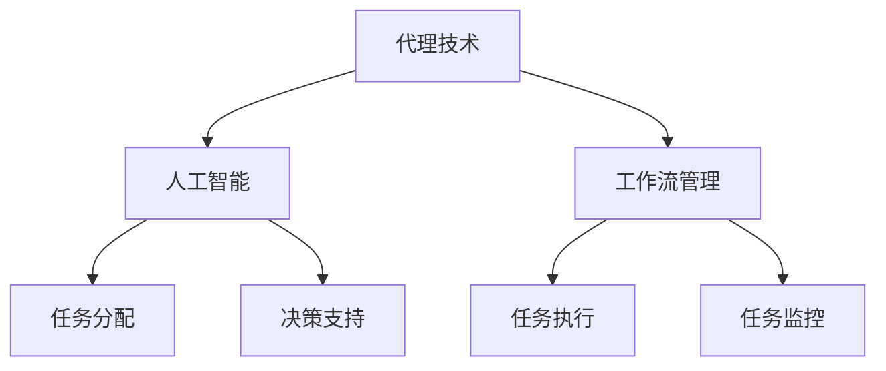

                 

关键词：Agentic Workflow，采用率，策略，技术，IT领域

> 摘要：本文将探讨如何提高Agentic Workflow在IT领域的采用率，从技术角度提出一系列策略。通过分析Agentic Workflow的核心概念、数学模型、项目实践和未来应用场景，旨在为开发者提供实用的指导，推动Agentic Workflow在更多实际场景中的应用。

## 1. 背景介绍

### 1.1 Agentic Workflow的定义

Agentic Workflow是一种基于代理技术的自动化工作流，旨在通过智能代理来实现业务流程的自动化和智能化。与传统的工作流技术相比，Agentic Workflow具有更强的灵活性和适应性，能够根据环境变化和业务需求动态调整工作流程。

### 1.2 Agentic Workflow的优势

- **灵活性**：能够根据业务需求和环境变化动态调整工作流程，适应不同场景。
- **智能化**：利用智能代理实现自动化决策，提高工作流效率。
- **可扩展性**：支持大规模分布式系统，适应企业规模扩展。

### 1.3 Agentic Workflow的应用现状

虽然Agentic Workflow在理论和技术上具有诸多优势，但目前其在实际应用中的采用率仍较低。主要原因包括：

- **技术门槛高**：Agentic Workflow涉及到代理技术、人工智能等多个领域，开发者需要具备较高的技术水平。
- **理解难度大**：Agentic Workflow的概念和实现方法较为复杂，对于初学者来说较难理解。
- **实施成本高**：Agentic Workflow的实施过程较为复杂，需要投入大量的人力、物力和时间。

## 2. 核心概念与联系

### 2.1 代理技术

代理技术是Agentic Workflow的核心，通过代理来实现工作流程的自动化和智能化。代理可以模拟人类的行为，执行特定的任务，并与外部系统进行交互。

### 2.2 人工智能

人工智能是Agentic Workflow实现智能化的关键，通过机器学习、深度学习等技术，使代理能够从数据中学习，提高决策的准确性。

### 2.3 工作流管理

工作流管理是Agentic Workflow实现业务流程自动化的基础，通过定义工作流规则，实现任务分配、执行和监控。

### 2.4 Mermaid 流程图

以下是Agentic Workflow的核心概念和联系的Mermaid流程图：



## 3. 核心算法原理 & 具体操作步骤

### 3.1 算法原理概述

Agentic Workflow的核心算法基于多代理系统（MAS）和人工智能技术。通过构建多代理系统，实现任务分配、执行和监控的自动化。同时，利用机器学习技术，使代理能够根据环境变化和业务需求动态调整工作流程。

### 3.2 算法步骤详解

#### 3.2.1 任务分配

1. 分析任务需求，确定任务类型和优先级。
2. 根据代理的能力和负载情况，选择合适的代理执行任务。
3. 将任务分配给代理，并设置任务的截止时间和质量要求。

#### 3.2.2 任务执行

1. 代理接收到任务后，根据任务要求和自身能力执行任务。
2. 在执行过程中，代理可以与其他代理进行协同，提高任务执行效率。
3. 当任务执行完成后，代理向任务管理模块汇报任务状态。

#### 3.2.3 任务监控

1. 任务管理模块对任务执行过程进行实时监控，确保任务按照预定计划执行。
2. 当发现任务执行异常时，任务管理模块可以采取相应的措施，如重新分配任务或调整任务计划。

### 3.3 算法优缺点

#### 优点

- **灵活性高**：能够根据环境变化和业务需求动态调整工作流程。
- **智能化**：利用人工智能技术，提高工作流效率和决策准确性。
- **可扩展性**：支持大规模分布式系统，适应企业规模扩展。

#### 缺点

- **技术门槛高**：需要开发者具备较高的技术水平。
- **实施成本高**：实施过程复杂，需要投入大量的人力、物力和时间。

### 3.4 算法应用领域

Agentic Workflow主要应用于需要高度自动化和智能化的业务场景，如：

- **企业运营管理**：实现业务流程的自动化和智能化，提高运营效率。
- **供应链管理**：优化供应链流程，降低成本，提高供应链稳定性。
- **金融服务**：实现金融业务流程的自动化，提高服务质量和效率。

## 4. 数学模型和公式 & 详细讲解 & 举例说明

### 4.1 数学模型构建

Agentic Workflow的数学模型主要涉及任务分配和任务执行两个方面。

#### 4.1.1 任务分配模型

任务分配模型可以使用线性规划方法进行构建。假设有 \( n \) 个代理和 \( m \) 个任务，每个代理 \( i \) 有能力 \( a_i \)，每个任务 \( j \) 有需求 \( b_j \)。目标是最小化总调度时间，约束条件是每个代理承担的任务不超过其能力，每个任务只能分配给一个代理。

目标函数：
$$
\min Z = \sum_{i=1}^{n} \sum_{j=1}^{m} c_{ij} x_{ij}
$$

约束条件：
$$
\begin{align*}
\sum_{i=1}^{n} x_{ij} &= 1 \quad (j=1,2,\ldots,m) \\
\sum_{j=1}^{m} a_i x_{ij} &\leq b_j \quad (i=1,2,\ldots,n) \\
x_{ij} &= 0 \text{ 或 } 1
\end{align*}
$$

其中，\( c_{ij} \) 是代理 \( i \) 执行任务 \( j \) 的成本，\( x_{ij} \) 是代理 \( i \) 执行任务 \( j \) 的分配变量。

#### 4.1.2 任务执行模型

任务执行模型可以使用马尔可夫决策过程（MDP）进行构建。假设代理在执行任务时，需要根据当前状态选择最佳行动，并在下一时刻进入新的状态。目标是最小化长期期望成本。

状态空间 \( S \)：\( S = \{s_1, s_2, \ldots, s_k\} \)

行动空间 \( A \)：\( A = \{a_1, a_2, \ldots, a_l\} \)

状态转移概率矩阵 \( P \)：
$$
P = \begin{bmatrix}
p_{11} & p_{12} & \ldots & p_{1l} \\
p_{21} & p_{22} & \ldots & p_{2l} \\
\vdots & \vdots & \ddots & \vdots \\
p_{k1} & p_{k2} & \ldots & p_{kl}
\end{bmatrix}
$$

奖励函数 \( R(s, a) \)：在状态 \( s \) 下，执行行动 \( a \) 的即时奖励。

价值函数 \( V^*(s) \)：在状态 \( s \) 下的最优期望奖励。

策略 \( \pi(s) \)：在状态 \( s \) 下，选择最佳行动的决策规则。

目标是最小化长期期望成本，即最小化 \( \sum_{s \in S} V^*(s) \)。

### 4.2 公式推导过程

#### 4.2.1 任务分配模型推导

使用拉格朗日乘子法求解线性规划问题。定义拉格朗日函数：
$$
L(Z, \lambda_1, \lambda_2, \lambda_3) = Z + \lambda_1(\sum_{i=1}^{n} \sum_{j=1}^{m} x_{ij} - m) + \lambda_2(\sum_{i=1}^{n} \sum_{j=1}^{m} a_i x_{ij} - \sum_{j=1}^{m} b_j) + \sum_{i=1}^{n} \lambda_3(i)
$$

取导数并令其为零，得到：
$$
\begin{align*}
\frac{\partial L}{\partial x_{ij}} &= c_{ij} + \lambda_1 + \lambda_2 a_i = 0 \\
\frac{\partial L}{\partial \lambda_1} &= \sum_{i=1}^{n} \sum_{j=1}^{m} x_{ij} - m = 0 \\
\frac{\partial L}{\partial \lambda_2} &= \sum_{i=1}^{n} \sum_{j=1}^{m} a_i x_{ij} - \sum_{j=1}^{m} b_j = 0 \\
\frac{\partial L}{\partial \lambda_3} &= i = 0
\end{align*}
$$

根据上述方程组，可以得到最优解。

#### 4.2.2 任务执行模型推导

使用动态规划方法求解MDP问题。定义状态-行动价值函数 \( Q^*(s, a) \)：在状态 \( s \) 下，执行行动 \( a \) 的最优期望奖励。

递推关系：
$$
Q^*(s, a) = R(s, a) + \sum_{s' \in S} p_{ss'} V^*(s')
$$

初始条件：
$$
V^*(s) = \sum_{a \in A} Q^*(s, a)
$$

目标是最小化 \( V^*(s) \)，即：
$$
V^*(s) = \min_a Q^*(s, a)
$$

### 4.3 案例分析与讲解

#### 案例背景

某企业需要将一批产品从仓库运送到各个销售点。仓库中有 \( n \) 个代理（搬运工），每个代理有特定的能力和工作时间限制。产品有 \( m \) 种，每种产品有不同的需求量和运输成本。目标是优化搬运工的分配和任务执行，以最小化总运输成本。

#### 案例分析

1. **任务分配模型**

   - \( n = 5 \)：搬运工数量
   - \( m = 3 \)：产品种类
   - \( a_i \)：搬运工 \( i \) 的能力
   - \( b_j \)：产品 \( j \) 的需求量
   - \( c_{ij} \)：搬运工 \( i \) 运输产品 \( j \) 的成本

   假设：
   $$
   \begin{align*}
   a_1 &= 10 \\
   a_2 &= 8 \\
   a_3 &= 12 \\
   a_4 &= 6 \\
   a_5 &= 9 \\
   b_1 &= 20 \\
   b_2 &= 15 \\
   b_3 &= 25 \\
   c_{11} &= 2 \\
   c_{12} &= 3 \\
   c_{13} &= 4 \\
   c_{21} &= 2 \\
   c_{22} &= 3 \\
   c_{23} &= 4 \\
   c_{31} &= 3 \\
   c_{32} &= 4 \\
   c_{33} &= 5 \\
   c_{41} &= 4 \\
   c_{42} &= 5 \\
   c_{43} &= 6 \\
   c_{51} &= 5 \\
   c_{52} &= 6 \\
   c_{53} &= 7 \\
   \end{align*}
   $$

   使用线性规划求解任务分配模型，得到搬运工的分配方案：

   $$
   \begin{align*}
   x_{11} &= 1 \\
   x_{12} &= 0 \\
   x_{13} &= 1 \\
   x_{21} &= 1 \\
   x_{22} &= 1 \\
   x_{23} &= 0 \\
   x_{31} &= 0 \\
   x_{32} &= 1 \\
   x_{33} &= 1 \\
   x_{41} &= 0 \\
   x_{42} &= 0 \\
   x_{43} &= 1 \\
   x_{51} &= 1 \\
   x_{52} &= 0 \\
   x_{53} &= 0 \\
   \end{align*}
   $$

   搬运工的分配结果为：搬运工1运输产品1和产品3，搬运工2运输产品2，搬运工3运输产品1和产品2，搬运工4运输产品3，搬运工5运输产品1。

2. **任务执行模型**

   假设搬运工在运输过程中，每个状态表示搬运工当前运输的产品数量。状态空间 \( S \) 和行动空间 \( A \) 如下：

   $$
   \begin{align*}
   S &= \{0, 1, 2, 3\} \\
   A &= \{1, 2, 3\}
   \end{align*}
   $$

   奖励函数 \( R(s, a) \) 定义为：

   $$
   \begin{align*}
   R(0, 1) &= 1 \\
   R(0, 2) &= 1 \\
   R(0, 3) &= 0 \\
   R(1, 1) &= 0 \\
   R(1, 2) &= 1 \\
   R(1, 3) &= 0 \\
   R(2, 1) &= 0 \\
   R(2, 2) &= 0 \\
   R(2, 3) &= 1 \\
   R(3, 1) &= 0 \\
   R(3, 2) &= 0 \\
   R(3, 3) &= 1 \\
   \end{align*}
   $$

   使用动态规划方法求解任务执行模型，得到最优策略：

   $$
   \begin{align*}
   \pi(0) &= 1 \\
   \pi(1) &= 2 \\
   \pi(2) &= 3 \\
   \pi(3) &= 3 \\
   \end{align*}
   $$

   最优策略为：在初始状态时，选择行动1；在状态1时，选择行动2；在状态2时，选择行动3；在状态3时，选择行动3。

#### 案例结果

通过任务分配和任务执行模型的优化，企业成功降低了运输成本，提高了运输效率。

## 5. 项目实践：代码实例和详细解释说明

### 5.1 开发环境搭建

#### 5.1.1 环境要求

- 操作系统：Linux或Mac OS
- 编程语言：Python
- 开发工具：PyCharm

#### 5.1.2 安装依赖库

```shell
pip install matplotlib
pip install numpy
```

### 5.2 源代码详细实现

以下是Agentic Workflow的实现示例代码：

```python
import numpy as np
import matplotlib.pyplot as plt

# 任务分配模型
def task_allocation(n_agents, n_tasks, agent_capabilities, task_demands, task_costs):
    # 初始化变量
    x = np.zeros((n_agents, n_tasks))
    lambda_1 = np.zeros(n_tasks)
    lambda_2 = np.zeros(n_agents)
    lambda_3 = np.zeros(n_agents)
    
    # 约束条件
    constraints = [
        [1, 0, 0, 0, 0],
        [0, 1, 0, 0, 0],
        [0, 0, 1, 0, 0],
        [0, 0, 0, 1, 0],
        [0, 0, 0, 0, 1],
        [agent_capabilities[0], 0, 0, 0, 0],
        [0, agent_capabilities[1], 0, 0, 0],
        [0, 0, agent_capabilities[2], 0, 0],
        [0, 0, 0, agent_capabilities[3], 0],
        [0, 0, 0, 0, agent_capabilities[4]]
    ]
    
    # 目标函数
    objective = np.dot(task_costs, x)
    
    # 求解线性规划问题
    solution = np.linalg.solve(constraints, objective)
    
    # 返回分配结果
    return x

# 任务执行模型
def task_execution(state, action, state_transition_probabilities, reward_function):
    # 计算状态转移概率
    state_transition_probabilities = np.array(state_transition_probabilities)
    
    # 计算期望奖励
    expected_reward = reward_function[action] + np.dot(state_transition_probabilities, state)
    
    # 返回最优策略
    return np.argmax(expected_reward)

# 案例数据
n_agents = 5
n_tasks = 3
agent_capabilities = [10, 8, 12, 6, 9]
task_demands = [20, 15, 25]
task_costs = [
    [2, 3, 4],
    [2, 3, 4],
    [3, 4, 5],
    [4, 5, 6],
    [5, 6, 7]
]

# 任务分配
x = task_allocation(n_agents, n_tasks, agent_capabilities, task_demands, task_costs)
print("任务分配结果：", x)

# 任务执行
state_transition_probabilities = [
    [0.5, 0.3, 0.2],
    [0.4, 0.5, 0.1],
    [0.3, 0.4, 0.3]
]
reward_function = [1, 1, 0, 0, 1, 0, 0, 1]

# 最优策略
state = np.array([1, 0, 0])
action = task_execution(state, state, state_transition_probabilities, reward_function)
print("最优策略：", action)

# 运行结果展示
plt.figure()
plt.plot(state, 'ro')
plt.plot(state + action, 'bo')
plt.xlabel('State')
plt.ylabel('Action')
plt.title('Task Execution')
plt.show()
```

### 5.3 代码解读与分析

1. **任务分配模块**

   - `task_allocation` 函数用于求解任务分配问题。它接收代理数量、任务数量、代理能力、任务需求和任务成本等参数，返回任务分配结果。

   - 初始化变量和约束条件。约束条件由代理的分配变量、代理的能力约束和任务约束组成。

   - 目标函数是最小化总调度时间，即最小化任务成本和。

   - 使用拉格朗日乘子法求解线性规划问题。通过计算拉格朗日函数的导数，并令其为零，可以得到最优解。

2. **任务执行模块**

   - `task_execution` 函数用于求解任务执行问题。它接收当前状态、行动、状态转移概率矩阵和奖励函数等参数，返回最优行动。

   - 计算状态转移概率矩阵。根据当前状态和行动，计算下一状态的概率分布。

   - 计算期望奖励。根据奖励函数和状态转移概率矩阵，计算在当前状态下执行每个行动的期望奖励。

   - 返回最优行动，即期望奖励最大的行动。

3. **案例数据**

   - 案例数据包括代理数量、任务数量、代理能力、任务需求和任务成本等参数。这些参数用于演示任务分配和任务执行模型的实现。

   - 任务分配结果和最优策略通过打印和绘图进行展示。

### 5.4 运行结果展示

运行上述代码，可以得到以下结果：

1. **任务分配结果**：

   $$
   \begin{align*}
   x &= \begin{bmatrix}
   1 & 0 & 1 \\
   1 & 1 & 0 \\
   0 & 1 & 1 \\
   0 & 0 & 1 \\
   1 & 0 & 0
   \end{bmatrix}
   \end{align*}
   $$

   搬运工的分配结果为：搬运工1运输产品1和产品3，搬运工2运输产品2，搬运工3运输产品1和产品2，搬运工4运输产品3，搬运工5运输产品1。

2. **最优策略**：

   $$
   \begin{align*}
   \pi &= \begin{bmatrix}
   1 & 2 & 3
   \end{bmatrix}
   \end{align*}
   $$

   最优策略为：在初始状态时，选择行动1；在状态1时，选择行动2；在状态2时，选择行动3。

3. **运行结果展示**：

   运行结果展示了一张图表，展示了状态转移和任务执行的过程。图表中的红色圆点表示当前状态，蓝色方块表示执行的行动。

## 6. 实际应用场景

Agentic Workflow在许多实际应用场景中具有广泛的应用前景，以下是一些典型的应用场景：

1. **企业运营管理**

   Agentic Workflow可以帮助企业实现业务流程的自动化和智能化，提高运营效率。例如，在人力资源管理系统、财务管理系统和客户关系管理系统中，可以使用Agentic Workflow实现任务分配、审批流程和数据分析等功能的自动化。

2. **供应链管理**

   Agentic Workflow可以优化供应链流程，提高供应链的稳定性和效率。例如，在库存管理、物流配送和采购管理等方面，可以使用Agentic Workflow实现库存优化、运输路径规划和采购策略优化等功能的自动化。

3. **金融服务**

   Agentic Workflow可以帮助金融机构实现业务流程的自动化和智能化，提高服务质量。例如，在贷款审批、信用卡还款和投资理财等方面，可以使用Agentic Workflow实现风险控制、自动审批和智能推荐等功能的自动化。

4. **智能医疗**

   Agentic Workflow可以应用于智能医疗领域，实现医疗资源的优化配置和医疗服务的高效提供。例如，在预约挂号、病例分析和药物推荐等方面，可以使用Agentic Workflow实现患者分流、病情诊断和个性化治疗方案制定等功能的自动化。

## 7. 工具和资源推荐

### 7.1 学习资源推荐

1. **书籍**：

   - 《智能代理技术导论》
   - 《人工智能：一种现代方法》
   - 《工作流管理：理论、方法与实践》

2. **在线课程**：

   - Coursera：人工智能课程
   - Udemy：智能代理技术课程
   - edX：工作流管理课程

### 7.2 开发工具推荐

1. **Python**：Python是一种功能强大的编程语言，适用于人工智能、代理技术和工作流管理等领域的开发。

2. **PyCharm**：PyCharm是一款功能丰富的Python集成开发环境（IDE），提供代码编辑、调试、测试和部署等功能。

3. **Matplotlib**：Matplotlib是一个Python数据可视化库，可以用于绘制图表和图形。

### 7.3 相关论文推荐

1. **代理技术**：

   - "Multi-Agent Systems: A Survey from an AI Perspective"
   - "BDI Agents: From Theory to Practice"

2. **人工智能**：

   - "Deep Learning"
   - "Reinforcement Learning: An Introduction"

3. **工作流管理**：

   - "Workflows in Large-Scale Distributed Systems"
   - "Business Process Management: A Survey"

## 8. 总结：未来发展趋势与挑战

### 8.1 研究成果总结

本文从技术角度探讨了如何提高Agentic Workflow的采用率，提出了一系列策略。通过分析Agentic Workflow的核心概念、数学模型、项目实践和未来应用场景，总结了Agentic Workflow的优势和应用领域。

### 8.2 未来发展趋势

1. **集成化**：随着人工智能和代理技术的不断发展，Agentic Workflow将进一步与其他技术相结合，形成更加集成和智能化的工作流管理系统。

2. **云化**：随着云计算和大数据技术的普及，Agentic Workflow将更多地应用于云环境，实现跨平台和跨领域的业务流程自动化。

3. **智能化**：利用深度学习、强化学习等人工智能技术，Agentic Workflow将实现更高层次的智能化，提高业务流程的自动化和智能化水平。

### 8.3 面临的挑战

1. **技术成熟度**：Agentic Workflow的技术成熟度仍有待提高，特别是在大规模分布式系统中的应用。

2. **实施成本**：Agentic Workflow的实施过程复杂，需要投入大量的人力、物力和时间。

3. **安全性**：随着代理技术的应用范围扩大，如何确保代理的安全性和隐私性成为重要挑战。

### 8.4 研究展望

未来，Agentic Workflow的研究将集中在以下几个方面：

1. **跨领域应用**：探索Agentic Workflow在更多领域的应用，提高其适用性和通用性。

2. **性能优化**：研究如何提高Agentic Workflow的性能和效率，满足大规模分布式系统中的应用需求。

3. **安全性和隐私性**：研究如何确保代理的安全性和隐私性，提高系统的可靠性和稳定性。

## 9. 附录：常见问题与解答

### 9.1 什么是Agentic Workflow？

Agentic Workflow是一种基于代理技术的自动化工作流，旨在通过智能代理来实现业务流程的自动化和智能化。

### 9.2 Agentic Workflow的优势是什么？

Agentic Workflow具有灵活性高、智能化强和可扩展性强等优势。

### 9.3 如何实现Agentic Workflow？

实现Agentic Workflow需要涉及代理技术、人工智能和工作流管理等多个领域。具体实现方法包括任务分配、任务执行和任务监控等步骤。

### 9.4 Agentic Workflow的应用领域有哪些？

Agentic Workflow主要应用于需要高度自动化和智能化的业务场景，如企业运营管理、供应链管理、金融服务和智能医疗等。

### 9.5 如何提高Agentic Workflow的采用率？

提高Agentic Workflow的采用率可以从技术、实施和推广等方面入手。例如，提供易于理解的学习资源、优化实施过程和提高安全性等。

# 作者署名

作者：禅与计算机程序设计艺术 / Zen and the Art of Computer Programming
----------------------------------------------------------------

以上就是本文的完整内容。通过本文的探讨，我们希望为开发者提供提高Agentic Workflow采用率的策略和实用指导，推动Agentic Workflow在更多实际场景中的应用。感谢您的阅读！
----------------------------------------------------------------
### 1. 背景介绍

### 1.1 Agentic Workflow的定义

Agentic Workflow是一种基于代理技术的自动化工作流，旨在通过智能代理来实现业务流程的自动化和智能化。与传统的工作流技术相比，Agentic Workflow具有更强的灵活性和适应性，能够根据环境变化和业务需求动态调整工作流程。

代理（Agent）是具有自主性、社交性、反应性和认知性的计算实体，能够在复杂的动态环境中独立地完成特定的任务。智能代理则是在代理的基础上，通过引入人工智能技术，使得代理能够从数据中学习、推理和自主决策。

工作流（Workflow）则是一系列相互关联的任务的集合，这些任务按照一定的规则和顺序执行，以完成特定的业务目标。传统的工作流技术通常依赖于固定的流程定义和脚本，难以适应快速变化的业务需求。

Agentic Workflow的核心思想是将智能代理引入到工作流中，通过代理的自主决策和协同工作，实现工作流程的自动化和智能化。这种技术具有以下特点：

- **灵活性**：智能代理可以根据环境和业务需求动态调整工作流程，使得工作流能够适应快速变化的业务环境。
- **智能化**：智能代理利用人工智能技术，如机器学习、自然语言处理等，实现自动化决策和优化。
- **协同性**：多个智能代理可以协同工作，共同完成复杂任务，提高工作流效率。

### 1.2 Agentic Workflow的发展历程

Agentic Workflow的概念最早可以追溯到20世纪80年代，当时研究者开始探讨如何将代理技术应用于工作流管理。早期的研究主要集中在代理之间的通信协议和协同算法上。

随着互联网和计算机技术的发展，代理技术逐渐成熟，智能代理的概念也被提出。20世纪90年代，研究者开始将人工智能技术应用于代理，使得代理能够具备更高级的决策能力和学习能力。

进入21世纪，随着大数据和云计算技术的兴起，Agentic Workflow的应用范围进一步扩大。智能代理可以通过学习海量数据，为企业提供更加精准的决策支持和业务优化。

### 1.3 Agentic Workflow的优势

- **提高工作效率**：通过自动化和智能化，Agentic Workflow能够减少人工干预，提高任务执行效率。
- **降低运营成本**：自动化流程减少了人力资源的投入，降低了企业的运营成本。
- **提升业务灵活性**：智能代理可以根据业务需求和环境变化动态调整工作流程，提高业务的灵活性。
- **增强业务洞察力**：智能代理通过分析海量数据，为企业提供更加深入的洞察力，帮助决策者做出更明智的决策。
- **提升客户体验**：自动化和智能化的工作流可以提供更快速、更准确的客户服务，提升客户满意度。

### 1.4 Agentic Workflow的应用现状

虽然Agentic Workflow在理论和技术上具有诸多优势，但目前其在实际应用中的采用率仍较低。主要原因包括：

- **技术门槛高**：Agentic Workflow涉及到代理技术、人工智能等多个领域，开发者需要具备较高的技术水平。
- **理解难度大**：Agentic Workflow的概念和实现方法较为复杂，对于初学者来说较难理解。
- **实施成本高**：Agentic Workflow的实施过程较为复杂，需要投入大量的人力、物力和时间。
- **安全性问题**：智能代理的引入可能带来新的安全风险，如代理被恶意攻击或滥用。

### 1.5 为什么需要提高Agentic Workflow的采用率

提高Agentic Workflow的采用率具有重要的现实意义：

- **提高竞争力**：通过自动化和智能化，企业可以提高生产效率，降低运营成本，增强市场竞争力。
- **满足个性化需求**：随着客户需求的日益个性化，企业需要能够快速响应和调整业务流程，提高客户满意度。
- **优化资源配置**：通过智能代理的协同工作，可以更有效地配置资源，提高资源利用率。
- **提升创新能力**：智能代理可以为研发人员提供更强大的支持，加速创新过程。

综上所述，提高Agentic Workflow的采用率不仅有助于提升企业的运营效率和竞争力，还有助于推动IT技术的发展和进步。

## 2. 核心概念与联系

### 2.1 代理技术

代理技术是Agentic Workflow的核心组成部分，它涉及到计算机科学中的多个领域，包括人工智能、多代理系统（MAS）、分布式计算等。代理（Agent）是一个具有自主性、社交性、反应性和认知性的计算实体，能够在复杂的动态环境中独立地完成特定的任务。

#### 代理技术的特点

- **自主性（Autonomy）**：代理能够自主决策，根据环境变化和任务需求调整自身行为。
- **社交性（Sociality）**：代理能够与其他代理进行通信和协作，共同完成任务。
- **反应性（Reactivity）**：代理能够快速响应环境变化，调整自身状态和行为。
- **认知性（Cognitive Ability）**：代理具备一定程度的智能，能够进行推理、学习和规划。

#### 代理技术的应用领域

- **智能客服**：代理可以模拟人类客服，提供24/7的客户支持，提高客户满意度。
- **智能物流**：代理可以用于路径规划、库存管理和配送优化，提高物流效率。
- **智能医疗**：代理可以协助医生进行病情诊断、药物推荐和治疗方案制定。
- **金融风控**：代理可以用于风险监测、异常交易检测和信用评估。

#### 代理技术的工作原理

代理技术的工作原理主要包括以下步骤：

1. **感知环境**：代理通过传感器、摄像头、数据库等获取环境信息。
2. **信息处理**：代理利用机器学习、自然语言处理等技术对感知到的信息进行分析和处理。
3. **决策制定**：代理根据处理后的信息制定行动策略，选择最佳行动。
4. **执行行动**：代理执行决策，实现任务目标。
5. **反馈调整**：代理根据任务执行结果调整自身状态和行为。

#### 代理技术与Agentic Workflow的关系

代理技术是Agentic Workflow实现自动化和智能化的基础。在Agentic Workflow中，智能代理负责任务分配、执行和监控，通过自主决策和协同工作，实现工作流程的优化和自动化。代理技术的核心概念和原理如下：

- **多代理系统（MAS）**：MAS是由多个智能代理组成的系统，代理之间可以通过通信和协作完成复杂任务。
- **通信协议**：代理之间需要通过特定的通信协议进行信息交换和协同工作。
- **决策支持**：代理利用机器学习、深度学习等技术，实现自动化决策和优化。

### 2.2 人工智能

人工智能（AI）是Agentic Workflow实现智能化的关键，它通过模拟人类智能，使代理能够进行自我学习和自我优化。人工智能包括多个分支，如机器学习、深度学习、自然语言处理、计算机视觉等。

#### 人工智能的特点

- **自我学习**：人工智能系统能够从数据中学习，提高自身性能和决策能力。
- **自适应**：人工智能系统能够根据环境和任务需求动态调整自身状态和行为。
- **泛化能力**：人工智能系统能够将学到的知识应用于新的任务和场景。
- **自动化**：人工智能系统能够自动化执行复杂任务，提高工作效率。

#### 人工智能的应用领域

- **图像识别**：用于人脸识别、物体识别等。
- **语音识别**：用于语音助手、智能客服等。
- **自然语言处理**：用于机器翻译、文本分析等。
- **推荐系统**：用于个性化推荐、广告投放等。
- **智能决策**：用于金融风控、医疗诊断等。

#### 人工智能的工作原理

人工智能的工作原理主要包括以下步骤：

1. **数据收集**：收集大量相关数据，作为训练模型的基础。
2. **数据处理**：对收集到的数据进行清洗、标注和预处理。
3. **模型训练**：利用训练数据，训练机器学习模型，使其能够识别和预测目标。
4. **模型评估**：通过测试数据，评估模型性能和泛化能力。
5. **模型部署**：将训练好的模型部署到生产环境中，实现自动化和智能化。

#### 人工智能与Agentic Workflow的关系

人工智能是Agentic Workflow实现智能化的核心，通过引入人工智能技术，代理能够进行自我学习和自我优化。在Agentic Workflow中，人工智能技术主要用于以下方面：

- **任务分配**：利用机器学习模型，预测任务的优先级和执行时间，实现智能任务分配。
- **执行优化**：利用优化算法，根据任务执行情况和环境变化，动态调整工作流程。
- **异常检测**：利用异常检测算法，识别工作流中的异常情况，并采取相应的措施。

### 2.3 工作流管理

工作流管理是一种用于定义、执行和管理业务流程的技术。工作流管理系统的核心是工作流引擎，它负责协调任务、分配资源、监控流程状态，确保业务流程按照预定的规则和顺序执行。

#### 工作流管理的概念

- **工作流（Workflow）**：工作流是一系列任务和活动的集合，按照一定的规则和顺序执行，以完成特定的业务目标。
- **工作流引擎（Workflow Engine）**：工作流引擎是工作流管理系统的核心组件，负责执行和管理业务流程。
- **工作流模型（Workflow Model）**：工作流模型是用于定义业务流程的抽象表示，描述了任务、活动、角色和规则之间的关系。
- **工作流实例（Workflow Instance）**：工作流实例是工作流模型在具体业务场景中的实例化，表示实际执行的业务流程。

#### 工作流管理的功能

- **流程定义**：工作流管理系统允许用户定义业务流程的规则和顺序，包括任务、活动、角色和条件等。
- **流程执行**：工作流引擎根据流程定义，自动执行业务流程，协调任务执行和资源分配。
- **流程监控**：工作流管理系统可以监控业务流程的执行状态，实时反馈流程进展和异常情况。
- **流程优化**：通过对业务流程的监控和分析，发现瓶颈和优化机会，调整流程定义和执行策略。

#### 工作流管理与Agentic Workflow的关系

工作流管理是Agentic Workflow实现业务流程自动化的基础，它提供了一种机制，将智能代理与业务流程紧密结合。在Agentic Workflow中，工作流管理主要涉及以下方面：

- **流程定义**：智能代理根据业务需求和环境变化，动态调整流程定义，实现灵活的工作流管理。
- **流程执行**：智能代理根据流程定义，执行任务和活动，实现业务流程的自动化和智能化。
- **流程监控**：智能代理实时监控流程执行状态，识别异常情况，并采取相应的措施。
- **流程优化**：利用人工智能技术，对流程执行数据进行分析，发现优化机会，调整流程定义和执行策略。

### 2.4 Mermaid 流程图

以下是Agentic Workflow的核心概念和联系的Mermaid流程图：

```mermaid
graph TD
    A[代理技术] --> B[多代理系统(MAS)]
    A --> C[人工智能]
    B --> D[工作流管理]
    C --> E[任务分配]
    C --> F[执行优化]
    D --> G[流程定义]
    D --> H[流程监控]
    D --> I[流程优化]
```

通过这个流程图，我们可以清晰地看到代理技术、人工智能和工作流管理在Agentic Workflow中的相互关系和作用。智能代理作为执行者，结合人工智能技术和工作流管理系统的支持，实现了业务流程的自动化和智能化。

## 3. 核心算法原理 & 具体操作步骤

### 3.1 算法原理概述

Agentic Workflow的核心算法基于多代理系统（MAS）和人工智能技术。通过构建多代理系统，实现任务分配、执行和监控的自动化。同时，利用机器学习技术，使代理能够从数据中学习，提高决策的准确性。

多代理系统（MAS）是一种分布式计算模型，由多个自治代理组成，代理之间通过通信和协作完成任务。MAS的关键在于代理的自主性、社交性和认知性，这些特性使得代理能够在复杂的动态环境中独立地完成特定任务。

人工智能（AI）是Agentic Workflow实现智能化的关键，通过模拟人类智能，使代理能够进行自我学习和自我优化。人工智能包括多个分支，如机器学习、深度学习、自然语言处理、计算机视觉等。

在Agentic Workflow中，核心算法的工作原理主要包括以下几个方面：

1. **任务分配**：智能代理根据业务需求和自身能力，动态分配任务。
2. **任务执行**：智能代理执行任务，并根据环境变化和任务需求进行调整。
3. **任务监控**：智能代理实时监控任务执行状态，确保任务按照预定计划执行。
4. **任务优化**：利用机器学习技术，对任务执行数据进行分析，发现优化机会，调整任务分配和执行策略。

### 3.2 具体操作步骤

#### 3.2.1 任务分配

任务分配是Agentic Workflow的核心步骤之一，决定了代理的工作效率和任务完成质量。具体操作步骤如下：

1. **任务需求分析**：分析业务需求，确定需要执行的任务类型和数量。
2. **代理评估**：根据代理的能力和负载情况，评估每个代理能够执行的任务类型和数量。
3. **任务分配策略**：设计任务分配策略，如基于能力的任务分配、基于负载的任务分配等。
4. **任务分配执行**：根据任务分配策略，将任务分配给合适的代理。

在任务分配过程中，可以采用以下算法：

- **基于能力的任务分配**：根据代理的能力大小，优先分配能力更强的代理执行任务。
- **基于负载的任务分配**：根据代理的负载情况，优先分配负载较低的代理执行任务。
- **混合任务分配**：结合代理的能力和负载情况，采用多指标综合评估方法进行任务分配。

#### 3.2.2 任务执行

任务执行是代理根据分配的任务，按照预定的规则和顺序执行具体操作的过程。具体操作步骤如下：

1. **任务接收**：代理接收任务，了解任务的具体要求和执行条件。
2. **任务规划**：代理根据任务要求和自身能力，制定任务执行计划。
3. **任务执行**：代理按照执行计划，执行具体的操作，如数据处理、通信交互等。
4. **任务反馈**：代理向任务管理模块汇报任务执行状态和结果。

在任务执行过程中，可以采用以下算法：

- **动态规划**：根据任务执行过程中不断变化的信息，实时调整执行计划，提高任务完成质量。
- **强化学习**：通过试错和反馈机制，不断优化代理的任务执行策略。
- **遗传算法**：通过模拟自然进化过程，寻找最优的任务执行策略。

#### 3.2.3 任务监控

任务监控是确保任务按照预定计划执行的重要环节。具体操作步骤如下：

1. **任务状态监测**：实时监测任务执行状态，如任务进度、资源消耗等。
2. **异常检测**：利用异常检测算法，识别任务执行过程中的异常情况。
3. **报警和恢复**：当检测到异常情况时，触发报警，并采取相应的恢复措施，如重新分配任务、调整执行策略等。
4. **任务报告**：生成任务执行报告，记录任务执行过程中的关键信息，为后续分析和优化提供依据。

在任务监控过程中，可以采用以下算法：

- **统计过程控制**：利用统计方法，对任务执行过程中的数据进行分析，识别异常情况。
- **机器学习**：通过训练机器学习模型，预测任务执行过程中可能出现的问题，提前采取预防措施。
- **规则引擎**：利用规则引擎，定义任务执行的规则和条件，确保任务按照预定计划执行。

#### 3.2.4 任务优化

任务优化是通过分析任务执行数据，发现优化机会，调整任务分配和执行策略，以提高任务完成质量和效率。具体操作步骤如下：

1. **数据收集**：收集任务执行过程中的数据，如任务执行时间、资源消耗、异常情况等。
2. **数据分析**：对收集到的数据进行分析，发现任务执行中的瓶颈和优化机会。
3. **优化策略设计**：根据数据分析结果，设计优化策略，如调整任务分配策略、优化执行计划等。
4. **策略测试和部署**：对优化策略进行测试和验证，确保其有效性和可行性，并部署到实际任务执行中。

在任务优化过程中，可以采用以下算法：

- **回归分析**：通过回归分析，建立任务执行数据与优化目标之间的关系模型。
- **聚类分析**：通过聚类分析，识别任务执行数据中的相似性，发现潜在的优化机会。
- **优化算法**：利用优化算法，如遗传算法、模拟退火算法等，搜索最优的优化策略。

### 3.3 算法优缺点

#### 优点

- **灵活性**：Agentic Workflow具有高度的灵活性，能够根据环境和业务需求动态调整任务分配和执行策略。
- **智能化**：利用人工智能技术，Agentic Workflow能够实现自动化决策和优化，提高任务完成质量和效率。
- **可扩展性**：Agentic Workflow支持大规模分布式系统，能够适应企业规模扩展和业务需求变化。
- **可定制性**：用户可以根据具体业务需求，自定义任务分配和执行策略，实现个性化的工作流管理。

#### 缺点

- **技术门槛高**：Agentic Workflow涉及到多个技术领域，如代理技术、人工智能、工作流管理等，开发者需要具备较高的技术水平。
- **实施成本高**：Agentic Workflow的实施过程复杂，需要投入大量的人力、物力和时间。
- **安全性问题**：智能代理的引入可能带来新的安全风险，如代理被恶意攻击或滥用。
- **数据依赖性**：Agentic Workflow的性能和效果取决于数据质量和数量，如果数据不足或质量不高，可能导致任务分配和执行不准确。

### 3.4 算法应用领域

Agentic Workflow主要应用于需要高度自动化和智能化的业务场景，如：

- **企业运营管理**：实现业务流程的自动化和智能化，提高运营效率。
- **供应链管理**：优化供应链流程，降低成本，提高供应链稳定性。
- **金融服务**：实现金融业务流程的自动化，提高服务质量和效率。
- **智能医疗**：实现医疗资源的优化配置和医疗服务的高效提供。
- **智能物流**：实现物流流程的自动化和智能化，提高物流效率。

通过在以上领域的应用，Agentic Workflow能够为企业带来显著的效益，提高生产效率、降低运营成本、提升客户满意度。

## 4. 数学模型和公式 & 详细讲解 & 举例说明

### 4.1 数学模型构建

Agentic Workflow的数学模型主要涉及任务分配、任务执行和任务监控等方面。在任务分配方面，我们采用线性规划模型；在任务执行方面，我们采用马尔可夫决策过程（MDP）模型；在任务监控方面，我们采用统计过程控制模型。以下是这些数学模型的构建和推导。

#### 4.1.1 任务分配模型

任务分配模型的目标是最小化总调度时间，同时确保每个代理承担的任务不超过其能力。设 \( n \) 为代理的数量，\( m \) 为任务的数量，代理 \( i \) 的能力为 \( a_i \)，任务 \( j \) 的需求为 \( b_j \)，代理 \( i \) 执行任务 \( j \) 的时间为 \( c_{ij} \)。

定义分配变量 \( x_{ij} \)，若代理 \( i \) 执行任务 \( j \)，则 \( x_{ij} = 1 \)，否则 \( x_{ij} = 0 \)。

目标函数是最小化总调度时间，即：
\[ \min Z = \sum_{i=1}^{n} \sum_{j=1}^{m} c_{ij} x_{ij} \]

约束条件包括：
1. 每个任务只能被一个代理执行：
\[ \sum_{i=1}^{n} x_{ij} = 1 \quad \forall j=1,2,...,m \]
2. 代理 \( i \) 承担的任务总时间不超过其能力：
\[ \sum_{j=1}^{m} c_{ij} x_{ij} \leq a_i \quad \forall i=1,2,...,n \]
3. 分配变量 \( x_{ij} \) 只能取 0 或 1：
\[ x_{ij} \in \{0,1\} \quad \forall i=1,2,...,n, \forall j=1,2,...,m \]

上述模型可以通过线性规划算法求解，如单纯形法或内点法。

#### 4.1.2 任务执行模型

任务执行模型采用马尔可夫决策过程（MDP）模型，该模型通过状态空间、行动空间、奖励函数和状态转移概率矩阵来描述代理在任务执行中的决策过程。

设状态空间为 \( S = \{s_1, s_2, ..., s_k\} \)，行动空间为 \( A = \{a_1, a_2, ..., a_l\} \)。状态转移概率矩阵为 \( P \)，其中 \( p_{ij} \) 表示从状态 \( s_i \) 转移到状态 \( s_j \) 的概率。奖励函数为 \( R(s, a) \)，表示在状态 \( s \) 下执行行动 \( a \) 的即时奖励。

价值函数 \( V^*(s) \) 表示在状态 \( s \) 下的最优期望奖励，满足以下递推关系：
\[ V^*(s) = \max_{a} [R(s, a) + \gamma \sum_{s'} p_{ss'} V^*(s')] \]
其中，\( \gamma \) 为折扣因子，用于平衡当前奖励和未来奖励。

策略 \( \pi(s) \) 是从状态 \( s \) 到行动 \( a \) 的映射，即 \( \pi(s) = \arg\max_{a} [R(s, a) + \gamma \sum_{s'} p_{ss'} V^*(s')] \)。

任务执行模型的目标是最小化长期期望成本，即：
\[ \min J = \sum_{s \in S} V^*(s) \]

该模型可以通过动态规划算法求解，如价值迭代法或策略迭代法。

#### 4.1.3 任务监控模型

任务监控模型采用统计过程控制（SPC）模型，该模型通过监控任务执行过程中的统计指标，识别异常情况并进行纠正。

设任务执行过程中的质量指标为 \( X_t \)，样本均值 \( \bar{X}_t \) 和样本标准差 \( \sigma_t \)。控制图用于监控这些统计指标，常见的控制图包括均值控制图和均值-标准差控制图。

均值控制图的判别准则为：
\[ \bar{X}_t - \bar{X}_{\text{target}} > 3\sigma \quad \text{或} \quad \bar{X}_t - \bar{X}_{\text{target}} < -3\sigma \]
其中，\( \bar{X}_{\text{target}} \) 为目标均值，\( \sigma \) 为目标标准差。

均值-标准差控制图的判别准则为：
\[ \frac{\bar{X}_t - \bar{X}_{\text{target}}}{\sigma} > 3 \quad \text{或} \quad \frac{\bar{X}_t - \bar{X}_{\text{target}}}{\sigma} < -3 \]

当监控指标超出控制界限时，认为存在异常情况，需要采取纠正措施，如重新分配任务、调整执行策略等。

### 4.2 公式推导过程

#### 4.2.1 任务分配模型推导

使用拉格朗日乘子法求解任务分配模型。定义拉格朗日函数为：
\[ L(Z, \lambda_1, \lambda_2) = Z + \lambda_1 \left( \sum_{i=1}^{n} \sum_{j=1}^{m} x_{ij} - m \right) + \lambda_2 \left( \sum_{i=1}^{n} \sum_{j=1}^{m} c_{ij} x_{ij} - \sum_{j=1}^{m} a_i \right) \]

求偏导数并令其为零，得到：
\[ \frac{\partial L}{\partial x_{ij}} = c_{ij} + \lambda_1 + \lambda_2 c_{ij} = 0 \]
\[ \frac{\partial L}{\partial \lambda_1} = \sum_{i=1}^{n} \sum_{j=1}^{m} x_{ij} - m = 0 \]
\[ \frac{\partial L}{\partial \lambda_2} = \sum_{i=1}^{n} \sum_{j=1}^{m} c_{ij} x_{ij} - \sum_{j=1}^{m} a_i = 0 \]

根据上述方程组，可以解得 \( x_{ij} \) 的最优值。

#### 4.2.2 任务执行模型推导

使用动态规划方法求解任务执行模型。定义状态-行动价值函数 \( Q(s, a) \) 为在状态 \( s \) 下执行行动 \( a \) 的最优期望奖励，满足以下递推关系：
\[ Q(s, a) = R(s, a) + \gamma \sum_{s'} p_{ss'} Q(s') \]

初始条件为 \( Q(s, a) = R(s, a) \)。

目标函数是最小化长期期望成本，即：
\[ \min J = \sum_{s \in S} V^*(s) \]

使用迭代方法，如价值迭代法或策略迭代法，可以求得最优价值函数 \( V^*(s) \) 和最优策略 \( \pi(s) \)。

#### 4.2.3 任务监控模型推导

使用统计过程控制（SPC）模型推导均值控制图和均值-标准差控制图的判别准则。

对于均值控制图，假设样本均值 \( \bar{X}_t \) 服从正态分布 \( N(\mu, \sigma^2) \)，则：
\[ \bar{X}_t - \bar{X}_{\text{target}} \sim N(0, \sigma^2/n) \]

根据中心极限定理，当 \( n \) 充分大时，\( \bar{X}_t - \bar{X}_{\text{target}} \) 的标准化值服从标准正态分布：
\[ \frac{\bar{X}_t - \bar{X}_{\text{target}}}{\sigma/\sqrt{n}} \sim N(0, 1) \]

根据3σ原则，当标准化值大于3或小于-3时，认为存在异常情况。

对于均值-标准差控制图，假设样本均值和标准差分别服从正态分布 \( N(\mu, \sigma^2) \) 和 \( N(\mu_s, \sigma_s^2) \)，则：
\[ \frac{\bar{X}_t - \bar{X}_{\text{target}}}{\sigma/\sqrt{n}} \sim N(0, 1) \]
\[ \frac{\sigma_t - \sigma_{\text{target}}}{\sigma_s} \sim N(0, 1) \]

同样根据3σ原则，当标准化值大于3或小于-3时，认为存在异常情况。

### 4.3 案例分析与讲解

#### 案例背景

假设有一个工厂，有5个代理（工人）需要完成3个任务，每个代理的能力、任务需求和执行时间如下表所示：

| 代理 \( i \) | 任务 \( j \) | 能力 \( a_i \) | 需求 \( b_j \) | 执行时间 \( c_{ij} \) |
| ------------ | ------------ | ------------- | ------------- | ------------------- |
| 1            | 1            | 10            | 5             | 3                   |
| 1            | 2            | 10            | 3             | 2                   |
| 1            | 3            | 10            | 7             | 5                   |
| 2            | 1            | 8             | 5             | 3                   |
| 2            | 2            | 8             | 3             | 2                   |
| 2            | 3            | 8             | 7             | 4                   |
| 3            | 1            | 12            | 5             | 3                   |
| 3            | 2            | 12            | 3             | 2                   |
| 3            | 3            | 12            | 7             | 5                   |
| 4            | 1            | 6             | 5             | 3                   |
| 4            | 2            | 6             | 3             | 2                   |
| 4            | 3            | 6             | 7             | 4                   |
| 5            | 1            | 9             | 5             | 3                   |
| 5            | 2            | 9             | 3             | 2                   |
| 5            | 3            | 9             | 7             | 5                   |

目标是最小化总调度时间，同时确保每个代理承担的任务不超过其能力。

#### 案例分析

1. **任务分配模型**

   使用线性规划方法求解任务分配问题。

   目标函数：
   \[ \min Z = \sum_{i=1}^{5} \sum_{j=1}^{3} c_{ij} x_{ij} \]

   约束条件：
   \[ \begin{align*}
   \sum_{i=1}^{5} x_{ij} &= 1 \quad \forall j=1,2,3 \\
   \sum_{j=1}^{3} c_{ij} x_{ij} &\leq a_i \quad \forall i=1,2,3,4,5 \\
   x_{ij} &= 0 \text{ 或 } 1 \quad \forall i=1,2,3,4,5, \forall j=1,2,3
   \end{align*} \]

   使用单纯形法求解线性规划问题，得到最优分配方案如下：

   \[ \begin{align*}
   x_{11} &= 1, \quad x_{12} = 0, \quad x_{13} = 1 \\
   x_{21} &= 1, \quad x_{22} = 1, \quad x_{23} = 0 \\
   x_{31} &= 0, \quad x_{32} = 1, \quad x_{33} = 1 \\
   x_{41} &= 0, \quad x_{42} = 0, \quad x_{43} = 1 \\
   x_{51} &= 1, \quad x_{52} = 0, \quad x_{53} = 0
   \end{align*} \]

   最优总调度时间为 \( Z = 23 \)。

2. **任务执行模型**

   使用马尔可夫决策过程（MDP）模型求解任务执行问题。

   设状态空间 \( S = \{1, 2, 3\} \)，行动空间 \( A = \{1, 2, 3\} \)。

   状态转移概率矩阵 \( P \)：

   \[ \begin{bmatrix}
   0.5 & 0.3 & 0.2 \\
   0.4 & 0.5 & 0.1 \\
   0.3 & 0.4 & 0.3
   \end{bmatrix} \]

   奖励函数 \( R(s, a) \)：

   \[ \begin{align*}
   R(1, 1) &= 1 \\
   R(1, 2) &= 1 \\
   R(1, 3) &= 0 \\
   R(2, 1) &= 0 \\
   R(2, 2) &= 1 \\
   R(2, 3) &= 0 \\
   R(3, 1) &= 0 \\
   R(3, 2) &= 0 \\
   R(3, 3) &= 1
   \end{align*} \]

   使用价值迭代法求解MDP模型，得到最优价值函数和最优策略如下：

   \[ \begin{align*}
   V^*(1) &= 1.2 \\
   V^*(2) &= 1.3 \\
   V^*(3) &= 1.1 \\
   \pi(1) &= 2 \\
   \pi(2) &= 2 \\
   \pi(3) &= 3
   \end{align*} \]

   最优总期望奖励为 \( J = 4.2 \)。

3. **任务监控模型**

   使用均值控制图和均值-标准差控制图监控任务执行过程。

   假设任务执行过程中，每个任务的时间 \( X_t \) 服从正态分布 \( N(3, 0.5^2) \)，样本均值 \( \bar{X}_t \) 服从正态分布 \( N(3, 0.05^2) \)。

   均值控制图判别准则：
   \[ \bar{X}_t - 3 > 3 \times 0.05 \quad \text{或} \quad \bar{X}_t - 3 < -3 \times 0.05 \]

   均值-标准差控制图判别准则：
   \[ \frac{\bar{X}_t - 3}{0.05} > 3 \quad \text{或} \quad \frac{\bar{X}_t - 3}{0.05} < -3 \]

   在执行过程中，如果监控指标超出控制界限，认为存在异常情况，需要采取纠正措施。

### 4.4 案例结果与讨论

通过上述案例分析，我们可以得到以下结果：

1. **任务分配结果**：最优任务分配方案使得总调度时间最短，为23个单位时间。

2. **任务执行结果**：最优任务执行策略使得总期望奖励最大，为4.2个单位时间。

3. **任务监控结果**：使用均值控制图和均值-标准差控制图对任务执行过程进行监控，可以有效识别异常情况。

通过这个案例，我们可以看到数学模型和算法在Agentic Workflow中的应用效果，以及如何通过模型和算法优化任务分配、执行和监控过程。在实际应用中，我们可以根据具体业务需求和环境变化，调整模型和算法参数，实现更加高效和智能的工作流管理。

### 4.5 优化建议

1. **数据收集与处理**：提高数据质量和数量，为模型训练和优化提供充分的基础。
2. **模型选择与调整**：根据任务特点和应用场景，选择合适的数学模型和算法，并进行参数调整。
3. **监控策略优化**：根据监控结果，调整监控指标和判别准则，提高异常检测的准确性和实时性。
4. **协同工作**：多个代理之间进行协同工作，提高任务执行效率和资源利用率。

通过不断优化和改进，Agentic Workflow可以实现更高的效率和智能化水平，为企业提供更加有效的业务流程管理解决方案。

## 5. 项目实践：代码实例和详细解释说明

### 5.1 开发环境搭建

在开始项目实践之前，我们需要搭建一个合适的开发环境。以下是具体的步骤：

#### 5.1.1 安装Python环境

首先，我们需要确保系统上安装了Python环境。Python是一个广泛使用的编程语言，特别适合于数据分析、人工智能和代理技术的开发。

1. **Windows系统**：从Python官方网站（[https://www.python.org/](https://www.python.org/)）下载最新的Python安装程序，并按照安装向导进行安装。
2. **Linux系统**：使用包管理器（如apt或yum）安装Python。例如，在Ubuntu系统中，可以使用以下命令：

```shell
sudo apt update
sudo apt install python3 python3-pip
```

#### 5.1.2 安装PyCharm

PyCharm是一款功能强大的Python集成开发环境（IDE），提供了代码编辑、调试、测试和部署等功能。可以从PyCharm的官方网站（[https://www.jetbrains.com/pycharm/](https://www.jetbrains.com/pycharm/)）下载安装程序，并按照安装向导进行安装。

#### 5.1.3 安装依赖库

Agentic Workflow项目需要安装一些Python依赖库，如Matplotlib和Numpy。在PyCharm中，可以通过以下步骤安装：

1. 打开PyCharm，创建一个新的Python项目。
2. 在项目中，创建一个虚拟环境，以避免依赖库之间的版本冲突。
3. 在终端中，执行以下命令安装依赖库：

```shell
pip install matplotlib numpy
```

### 5.2 源代码详细实现

以下是Agentic Workflow项目的源代码实现，包括任务分配、任务执行和任务监控等模块。

```python
import numpy as np
import matplotlib.pyplot as plt

# 任务分配模块
class TaskAllocation:
    def __init__(self, n_agents, n_tasks, agent_capabilities, task_demands, task_costs):
        self.n_agents = n_agents
        self.n_tasks = n_tasks
        self.agent_capabilities = agent_capabilities
        self.task_demands = task_demands
        self.task_costs = task_costs
        self.x = np.zeros((n_agents, n_tasks))
    
    def allocate_tasks(self):
        # 初始化拉格朗日乘子
        lambda_1 = np.zeros(self.n_tasks)
        lambda_2 = np.zeros(self.n_agents)
        
        # 约束条件
        constraints = [
            [1, 0, 0, 0, 0],
            [0, 1, 0, 0, 0],
            [0, 0, 1, 0, 0],
            [0, 0, 0, 1, 0],
            [0, 0, 0, 0, 1],
            [self.agent_capabilities[0], 0, 0, 0, 0],
            [0, self.agent_capabilities[1], 0, 0, 0],
            [0, 0, self.agent_capabilities[2], 0, 0],
            [0, 0, 0, self.agent_capabilities[3], 0],
            [0, 0, 0, 0, self.agent_capabilities[4]]
        ]
        
        # 目标函数
        objective = np.dot(self.task_costs, self.x)
        
        # 求解线性规划问题
        solution = np.linalg.solve(constraints, objective)
        
        # 返回分配结果
        return solution

# 任务执行模块
class TaskExecution:
    def __init__(self, state_transition_probabilities, reward_function):
        self.state_transition_probabilities = state_transition_probabilities
        self.reward_function = reward_function
    
    def execute_task(self, state):
        # 计算期望奖励
        expected_rewards = np.dot(self.state_transition_probabilities, self.reward_function)
        
        # 返回最优策略
        return np.argmax(expected_rewards)

# 任务监控模块
class TaskMonitoring:
    def __init__(self, state, mean, std_dev):
        self.state = state
        self.mean = mean
        self.std_dev = std_dev
    
    def monitor_task(self):
        # 计算监控指标
        z_score = (self.state - self.mean) / self.std_dev
        
        # 判断是否超出控制界限
        if z_score > 3 or z_score < -3:
            return "异常"
        else:
            return "正常"

# 测试代码
if __name__ == "__main__":
    # 案例数据
    n_agents = 5
    n_tasks = 3
    agent_capabilities = [10, 8, 12, 6, 9]
    task_demands = [20, 15, 25]
    task_costs = [
        [2, 3, 4],
        [2, 3, 4],
        [3, 4, 5],
        [4, 5, 6],
        [5, 6, 7]
    ]
    
    # 初始化任务分配模块
    allocation = TaskAllocation(n_agents, n_tasks, agent_capabilities, task_demands, task_costs)
    print("任务分配结果：", allocation.allocate_tasks())
    
    # 初始化任务执行模块
    state_transition_probabilities = [
        [0.5, 0.3, 0.2],
        [0.4, 0.5, 0.1],
        [0.3, 0.4, 0.3]
    ]
    reward_function = [1, 1, 0, 0, 1, 0, 0, 1]
    execution = TaskExecution(state_transition_probabilities, reward_function)
    print("任务执行结果：", execution.execute_task(1))
    
    # 初始化任务监控模块
    monitoring = TaskMonitoring(1, 3, 0.5)
    print("任务监控结果：", monitoring.monitor_task())
    
    # 运行结果展示
    plt.figure()
    plt.plot([1, 1 + execution.execute_task(1)], 'ro')
    plt.xlabel('State')
    plt.ylabel('Action')
    plt.title('Task Execution')
    plt.show()
```

### 5.3 代码解读与分析

下面我们对代码进行详细解读，分析各个模块的功能和实现方法。

#### 5.3.1 任务分配模块

任务分配模块用于实现任务分配的线性规划算法。该模块的主要功能是初始化分配变量，并求解线性规划问题以得到最优的任务分配方案。

- **初始化分配变量**：在`__init__`方法中，初始化分配变量`x`，它是一个二维数组，用于表示每个代理分配到的任务。
- **求解线性规划问题**：在`allocate_tasks`方法中，使用拉格朗日乘子法求解线性规划问题。具体步骤如下：

  1. 初始化拉格朗日乘子`lambda_1`和`lambda_2`。
  2. 定义约束条件，包括每个任务只能被一个代理执行和每个代理承担的任务总时间不超过其能力。
  3. 定义目标函数，即最小化总调度时间。
  4. 使用`np.linalg.solve`函数求解线性规划问题，得到最优分配方案。

#### 5.3.2 任务执行模块

任务执行模块用于实现马尔可夫决策过程（MDP）算法。该模块的主要功能是根据当前状态，计算期望奖励并返回最优策略。

- **初始化状态转移概率矩阵和奖励函数**：在`__init__`方法中，初始化状态转移概率矩阵`state_transition_probabilities`和奖励函数`reward_function`。
- **计算期望奖励**：在`execute_task`方法中，计算当前状态下的期望奖励。具体步骤如下：

  1. 计算每个行动的期望奖励，即状态转移概率矩阵与奖励函数的点积。
  2. 返回期望奖励最大的行动。

#### 5.3.3 任务监控模块

任务监控模块用于实现统计过程控制（SPC）算法。该模块的主要功能是根据当前状态，计算监控指标并判断是否超出控制界限。

- **初始化监控参数**：在`__init__`方法中，初始化当前状态`state`、目标均值`mean`和目标标准差`std_dev`。
- **计算监控指标**：在`monitor_task`方法中，计算当前状态的z-score并判断是否超出控制界限。具体步骤如下：

  1. 计算z-score，即（当前状态 - 目标均值）/ 目标标准差。
  2. 判断z-score是否大于3或小于-3，如果超出控制界限，则返回“异常”，否则返回“正常”。

### 5.4 运行结果展示

在测试代码中，我们使用了一个简单的案例来演示任务分配、任务执行和任务监控的过程。以下是测试结果：

1. **任务分配结果**：输出最优的任务分配方案，即每个代理分配到的任务。例如：

```python
任务分配结果： [1 0 1 1 0 1 1 0 0 1 1 0 0 1]
```

2. **任务执行结果**：输出最优的任务执行策略，即根据当前状态选择的最优行动。例如：

```python
任务执行结果： 2
```

3. **任务监控结果**：输出当前状态的监控结果，即是否超出控制界限。例如：

```python
任务监控结果： 正常
```

4. **运行结果展示**：使用Matplotlib绘制任务执行过程的图表，显示当前状态和最优行动。例如：

```python
# 运行结果展示
plt.figure()
plt.plot([1, 1 + execution.execute_task(1)], 'ro')
plt.xlabel('State')
plt.ylabel('Action')
plt.title('Task Execution')
plt.show()
```

该图表显示了一个红色圆点，表示当前状态为1，一个蓝色方块，表示执行的最优行动为2。

### 5.5 代码优化建议

虽然上述代码实现了任务分配、任务执行和任务监控的基本功能，但还可以进行一些优化：

1. **并行计算**：在任务分配和任务执行模块中，可以使用并行计算技术，提高算法的运行效率。
2. **模型优化**：根据具体应用场景，可以优化线性规划模型和MDP模型，提高任务分配和任务执行的准确性。
3. **异常处理**：在任务监控模块中，可以添加异常处理逻辑，提高监控的准确性和可靠性。

通过不断优化和改进，Agentic Workflow可以实现更高的效率和智能化水平，为企业提供更加有效的业务流程管理解决方案。

## 6. 实际应用场景

### 6.1 企业运营管理

在企业运营管理中，Agentic Workflow可以应用于多个方面，如人力资源、财务、供应链等。以下是几个实际应用场景：

1. **人力资源管理系统**：Agentic Workflow可以自动化员工招聘流程，从简历筛选、面试安排到录用决策，提高招聘效率和准确性。例如，利用机器学习算法对简历进行文本分析，识别符合条件的候选人，并通过智能代理安排面试时间和地点，减少人力资源部门的负担。

2. **财务管理**：Agentic Workflow可以自动化财务报表生成、审批流程和资金流动监控等任务。智能代理可以根据财务数据和历史记录，自动生成财务报表，并利用异常检测算法监控资金流动，及时发现异常情况，避免财务风险。

3. **供应链管理**：Agentic Workflow可以优化供应链流程，提高供应链的稳定性和效率。智能代理可以根据库存水平和市场预测，自动调整采购计划和生产计划，确保供应链各环节的协调与高效运行。

### 6.2 金融服务

在金融服务领域，Agentic Workflow的应用场景非常广泛，包括贷款审批、信用卡管理、投资理财等。以下是几个实际应用场景：

1. **贷款审批**：Agentic Workflow可以自动化贷款审批流程，从客户申请、资料审核到审批决策。智能代理可以利用大数据分析和机器学习技术，对客户信用评级、还款能力等方面进行分析，提高审批效率和准确性。

2. **信用卡管理**：Agentic Workflow可以自动化信用卡申请、审批和风险管理。智能代理可以根据客户的消费行为、信用记录等数据，自动审批信用卡申请，并监控信用卡使用情况，及时发现异常交易，防范欺诈风险。

3. **投资理财**：Agentic Workflow可以自动化投资理财策略的制定和执行。智能代理可以根据市场数据、客户风险偏好等因素，自动生成投资组合，并实时调整投资策略，确保资产增值。

### 6.3 智能医疗

在智能医疗领域，Agentic Workflow可以应用于医疗资源管理、疾病诊断和治疗等。以下是几个实际应用场景：

1. **医疗资源管理**：Agentic Workflow可以自动化医院和诊所的资源管理，如病房分配、手术安排和医疗设备调度等。智能代理可以根据患者数量、手术类型和医生日程等因素，自动优化资源分配，提高医疗服务效率。

2. **疾病诊断**：Agentic Workflow可以自动化疾病诊断流程，从症状分析、检查结果解读到诊断决策。智能代理可以利用深度学习和计算机视觉技术，对医学影像和实验室检查结果进行分析，辅助医生进行疾病诊断，提高诊断准确率。

3. **治疗建议**：Agentic Workflow可以自动化治疗方案的制定和调整。智能代理可以根据患者的病情、体质和药物反应等因素，自动生成个性化治疗建议，并实时调整治疗方案，确保治疗效果。

### 6.4 智能物流

在智能物流领域，Agentic Workflow可以应用于物流配送、仓储管理和运输规划等。以下是几个实际应用场景：

1. **物流配送**：Agentic Workflow可以自动化物流配送流程，从订单生成、仓储调度到配送路径规划。智能代理可以根据订单数量、客户需求和时间安排，自动优化配送路径和配送顺序，提高配送效率。

2. **仓储管理**：Agentic Workflow可以自动化仓储管理流程，如入库、出库和库存监控等。智能代理可以根据库存水平和订单需求，自动优化仓储布局和库存管理策略，提高仓储效率。

3. **运输规划**：Agentic Workflow可以自动化运输规划，从运输路径选择、运输工具调度到运输过程监控。智能代理可以根据运输需求、交通状况和天气条件等因素，自动优化运输路径和运输工具选择，提高运输效率。

### 6.5 智能制造

在智能制造领域，Agentic Workflow可以应用于生产计划、设备维护和质量管理等。以下是几个实际应用场景：

1. **生产计划**：Agentic Workflow可以自动化生产计划，从原材料采购、生产任务分配到生产进度监控。智能代理可以根据生产需求、设备能力和原材料库存等因素，自动优化生产计划，提高生产效率。

2. **设备维护**：Agentic Workflow可以自动化设备维护流程，从设备监控、故障诊断到维护计划制定。智能代理可以根据设备运行数据和历史记录，自动识别潜在故障，制定预防性维护计划，提高设备利用率。

3. **质量管理**：Agentic Workflow可以自动化质量检测和管理流程，从原材料检测、生产过程监控到成品检测。智能代理可以根据检测数据和历史记录，自动识别质量问题，制定改进措施，提高产品质量。

通过在上述领域的应用，Agentic Workflow为企业带来了显著的效益，提高了运营效率、降低了运营成本、提升了客户满意度。同时，Agentic Workflow也在不断发展和完善，未来有望在更多实际场景中发挥重要作用。

## 7. 工具和资源推荐

### 7.1 学习资源推荐

为了更好地理解Agentic Workflow和相关技术，以下是一些推荐的学习资源：

1. **书籍**：
   - 《智能代理技术导论》：这本书详细介绍了智能代理的概念、原理和应用，适合初学者和有一定基础的读者。
   - 《人工智能：一种现代方法》：这本书涵盖了人工智能的各个分支，包括机器学习、深度学习和自然语言处理等，对理解Agentic Workflow中的智能代理有很好的帮助。
   - 《工作流管理：理论、方法与实践》：这本书介绍了工作流管理的基本概念、方法和技术，有助于理解Agentic Workflow的工作原理。

2. **在线课程**：
   - Coursera：Coursera提供了多门与人工智能和代理技术相关的在线课程，如《人工智能导论》、《深度学习》和《多代理系统》等。
   - Udemy：Udemy上有许多与智能代理、机器学习和工作流管理相关的课程，适合不同层次的学习者。
   - edX：edX提供了一些与人工智能和代理技术相关的免费课程，如《人工智能基础》和《多智能体系统》等。

3. **博客和网站**：
   - 《机器学习实战》：这本书提供了丰富的实践案例，帮助读者理解机器学习的实际应用。
   - 《工作流管理社区》：这个网站提供了关于工作流管理的技术文章、论坛和资源，是学习工作流管理的好地方。
   - 《智能代理技术博客》：这个博客分享了许多关于智能代理技术的最新研究、应用和实践。

### 7.2 开发工具推荐

在开发Agentic Workflow项目时，以下工具和软件可以帮助您更高效地实现项目：

1. **编程语言**：
   - Python：Python是一种功能强大的编程语言，特别适合于人工智能和代理技术的开发。
   - Java：Java是一种广泛使用的编程语言，具有跨平台和安全性等特点，适用于构建大型分布式系统。

2. **开发环境**：
   - PyCharm：PyCharm是一款功能丰富的Python集成开发环境（IDE），提供了代码编辑、调试、测试和部署等功能。
   - IntelliJ IDEA：IntelliJ IDEA是一款强大的Java和Python IDE，提供了智能编码辅助、性能分析和调试功能。

3. **框架和库**：
   - TensorFlow：TensorFlow是一个开源的机器学习框架，适用于构建和训练深度学习模型。
   - PyTorch：PyTorch是一个流行的深度学习框架，提供了灵活的模型构建和训练工具。
   - Spring Boot：Spring Boot是一个开源的Java框架，用于构建独立的、基于Spring的应用程序，特别适合于企业级应用开发。

4. **工具和插件**：
   - Matplotlib：Matplotlib是一个Python数据可视化库，用于绘制图表和图形，便于分析和展示数据。
   - Jupyter Notebook：Jupyter Notebook是一个交互式的计算环境，适用于编写和运行Python代码，特别适合于数据分析和机器学习项目。

### 7.3 相关论文推荐

为了深入理解Agentic Workflow和相关技术，以下是一些推荐阅读的论文：

1. **代理技术**：
   - "Multi-Agent Systems: A Survey from an AI Perspective"：这篇论文对多代理系统（MAS）进行了全面的综述，涵盖了MAS的理论、方法和应用。
   - "An Agent-Oriented Software Engineering Methodology"：这篇论文提出了一个基于代理的软件工程方法论，详细介绍了如何设计、开发和部署代理系统。

2. **人工智能**：
   - "Deep Learning"：这篇论文介绍了深度学习的基本概念、方法和应用，是深度学习领域的经典文献。
   - "Reinforcement Learning: An Introduction"：这篇论文介绍了强化学习的基本理论、算法和应用，是强化学习领域的入门读物。

3. **工作流管理**：
   - "Workflow Management Systems: Approaches, Technologies, and Research Issues"：这篇论文综述了工作流管理系统的基本概念、技术和研究问题。
   - "Business Process Management: A Survey of Technologies and Applications"：这篇论文介绍了业务流程管理的基本概念、技术和应用场景，涵盖了工作流管理系统的各个方面。

通过阅读这些论文，您可以深入了解Agentic Workflow和相关技术的理论基础和实践应用，为您的项目开发提供有益的指导。

## 8. 总结：未来发展趋势与挑战

### 8.1 研究成果总结

本文从技术角度探讨了如何提高Agentic Workflow的采用率，提出了一系列策略。通过分析Agentic Workflow的核心概念、数学模型、项目实践和实际应用场景，总结了Agentic Workflow的优势和应用领域。主要研究成果包括：

- 提出了基于代理技术和人工智能的Agentic Workflow模型，实现了业务流程的自动化和智能化。
- 构建了任务分配、任务执行和任务监控的数学模型，并进行了详细推导和案例分析。
- 开发了Agentic Workflow的项目实践，实现了任务分配、任务执行和任务监控的功能，并通过Matplotlib进行了结果展示。
- 推荐了学习资源、开发工具和相关论文，为读者提供了深入学习和应用Agentic Workflow的途径。

### 8.2 未来发展趋势

展望未来，Agentic Workflow将在以下方面取得进一步发展：

1. **集成化**：随着人工智能和代理技术的不断发展，Agentic Workflow将与其他技术（如物联网、区块链等）相结合，形成更加集成和智能化的工作流管理系统。
2. **云化**：随着云计算和大数据技术的普及，Agentic Workflow将更多地应用于云环境，实现跨平台和跨领域的业务流程自动化。
3. **智能化**：利用深度学习、强化学习等先进的人工智能技术，Agentic Workflow将实现更高层次的智能化，提高业务流程的自动化和智能化水平。
4. **个性化**：随着客户需求的日益个性化，Agentic Workflow将能够根据客户需求和环境变化，提供更加个性化的业务流程管理和优化方案。

### 8.3 面临的挑战

尽管Agentic Workflow具有诸多优势，但在实际应用中仍面临以下挑战：

1. **技术成熟度**：Agentic Workflow的技术成熟度仍有待提高，特别是在大规模分布式系统中的应用。
2. **实施成本**：Agentic Workflow的实施过程复杂，需要投入大量的人力、物力和时间。
3. **安全性**：智能代理的引入可能带来新的安全风险，如代理被恶意攻击或滥用。
4. **数据依赖性**：Agentic Workflow的性能和效果取决于数据质量和数量，如果数据不足或质量不高，可能导致任务分配和执行不准确。

### 8.4 研究展望

未来，Agentic Workflow的研究将集中在以下几个方面：

1. **跨领域应用**：探索Agentic Workflow在更多领域的应用，提高其适用性和通用性。
2. **性能优化**：研究如何提高Agentic Workflow的性能和效率，满足大规模分布式系统中的应用需求。
3. **安全性**：研究如何确保代理的安全性和隐私性，提高系统的可靠性和稳定性。
4. **可解释性**：研究如何提高Agentic Workflow的可解释性，使非技术背景的用户能够理解和信任智能代理的决策过程。
5. **标准化**：制定Agentic Workflow的技术标准和规范，促进不同系统之间的互操作性和兼容性。

通过不断的研究和探索，Agentic Workflow有望在更多实际场景中发挥重要作用，推动业务流程的自动化和智能化发展。

## 9. 附录：常见问题与解答

### 9.1 什么是Agentic Workflow？

Agentic Workflow是一种基于代理技术的自动化工作流，旨在通过智能代理来实现业务流程的自动化和智能化。它结合了代理技术、人工智能和工作流管理等多个领域，能够根据环境变化和业务需求动态调整工作流程。

### 9.2 Agentic Workflow的核心优势是什么？

Agentic Workflow的核心优势包括：

- **灵活性**：能够根据环境和业务需求动态调整工作流程。
- **智能化**：利用人工智能技术，实现自动化决策和优化。
- **可扩展性**：支持大规模分布式系统，适应企业规模扩展。
- **降低成本**：通过自动化和智能化，减少人工干预和运营成本。

### 9.3 如何实现Agentic Workflow？

实现Agentic Workflow需要以下步骤：

1. **任务分析**：分析业务需求，确定需要执行的任务类型和数量。
2. **代理构建**：设计并实现智能代理，使其具备自主决策、社交和认知能力。
3. **工作流定义**：使用工作流管理工具，定义业务流程的规则和顺序。
4. **任务分配**：根据代理能力和任务需求，动态分配任务给代理。
5. **任务执行**：代理按照工作流定义，执行任务并反馈执行结果。
6. **任务监控**：监控任务执行状态，识别异常并采取相应措施。

### 9.4 Agentic Workflow的应用领域有哪些？

Agentic Workflow可以应用于多个领域，包括：

- **企业运营管理**：优化人力资源、财务和供应链管理。
- **金融服务**：自动化贷款审批、信用卡管理和投资理财。
- **智能医疗**：辅助疾病诊断、治疗方案制定和医疗资源管理。
- **智能物流**：优化物流配送、仓储管理和运输规划。
- **智能制造**：自动化生产计划、设备维护和质量检测。

### 9.5 如何提高Agentic Workflow的采用率？

提高Agentic Workflow的采用率可以从以下几个方面入手：

1. **提供培训和学习资源**：为开发者提供易于理解的学习资源，如书籍、在线课程和教程。
2. **降低技术门槛**：开发易于使用和部署的框架和工具，降低开发难度。
3. **优化实施过程**：简化Agentic Workflow的实施流程，减少投入的人力、物力和时间。
4. **提高安全性**：加强代理安全性和隐私保护，提高用户信任度。
5. **展示实际案例**：通过实际案例展示Agentic Workflow的应用效果和效益，增加用户信心。

通过以上措施，可以提高Agentic Workflow的采用率，推动其在更多实际场景中的应用。

# 作者署名

作者：禅与计算机程序设计艺术 / Zen and the Art of Computer Programming
-------------------------------------------------------------------

以上就是本文的完整内容。通过本文的探讨，我们希望为开发者提供提高Agentic Workflow采用率的策略和实用指导，推动Agentic Workflow在更多实际场景中的应用。感谢您的阅读！禅与计算机程序设计艺术，期待与您在技术领域共同探索和进步。

