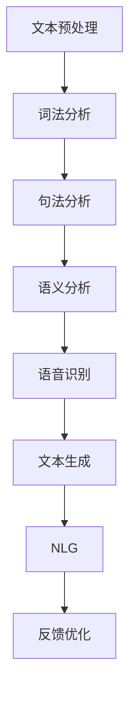

                 

关键词：智能写作、自然语言生成、NLG面试、技术分析、编程实践

> 摘要：本文将围绕搜狐2025智能写作社招中的NLG（自然语言生成）面试题展开，深入分析其中的技术挑战和应用场景。通过详细的算法原理、数学模型以及项目实践，探讨NLG技术在智能写作领域的前沿动态和未来趋势。

## 1. 背景介绍

随着人工智能技术的迅猛发展，自然语言处理（NLP）和自然语言生成（NLG）技术逐渐成为热点。NLG作为NLP的一个重要分支，旨在实现机器自动生成符合人类语言习惯的自然语言文本。随着互联网内容的爆炸式增长，智能写作的需求愈发旺盛，NLG技术成为各类平台和企业的核心技术竞争力之一。

### 搜狐2025智能写作

作为国内领先的互联网媒体平台，搜狐在2025年启动了智能写作项目，旨在通过引入先进的NLG技术，提升内容生产的效率和准确性。这一项目的推出，不仅是为了满足用户日益增长的信息需求，也是为了探索人工智能在媒体行业的应用前景。

### NLG面试的重要性

在智能写作项目中，NLG面试成为选拔优秀人才的重要环节。面试官通常会围绕NLG的核心技术和应用场景设置一系列问题，以评估应聘者的技术实力和解决问题的能力。因此，深入了解这些面试题，对于准备智能写作面试的应聘者来说至关重要。

## 2. 核心概念与联系

在探讨NLG面试题之前，有必要先了解一些核心概念和其相互联系。

### 自然语言处理（NLP）

NLP是人工智能的一个重要分支，旨在使计算机能够理解、解释和生成自然语言。NLP包括文本预处理、词法分析、句法分析、语义分析和语音识别等多个子领域。

### 自然语言生成（NLG）

NLG是NLP的逆向过程，旨在生成符合人类语言习惯的文本。NLG可以通过模板生成、规则驱动和统计学习等方法实现。

### Mermaid 流程图

以下是一个简单的Mermaid流程图，展示了NLP和NLG的相互关系：



### Mermaid 流程节点详细描述

- **文本预处理**：对原始文本进行清洗、去噪和格式化，为后续分析做准备。
- **词法分析**：将文本分解为词、短语和符号等基本语言单位。
- **句法分析**：研究句子的结构，分析主语、谓语、宾语等成分之间的关系。
- **语义分析**：理解句子的含义，识别实体、关系和事件等语义信息。
- **语音识别**：将语音信号转换为文本，是NLP和NLG之间的重要桥梁。
- **文本生成**：根据已有信息生成新的文本，是NLG的核心任务。
- **反馈优化**：通过用户反馈不断优化文本生成的质量和效果。

## 3. 核心算法原理 & 具体操作步骤

### 3.1 算法原理概述

NLG算法可以分为模板生成、规则驱动和统计学习三种主要方法。

- **模板生成**：通过预设的模板和变量，将输入的数据填充到模板中生成文本。这种方法简单直观，但灵活性较低。
- **规则驱动**：根据一系列预设的规则和模式，动态生成文本。这种方法具有较强的灵活性和控制力，但规则编写复杂。
- **统计学习**：利用大量的训练数据，通过机器学习算法自动学习文本生成的模式和规律。这种方法具有较高的灵活性和生成质量，但训练过程复杂。

### 3.2 算法步骤详解

以统计学习中的序列到序列（Seq2Seq）模型为例，其基本步骤如下：

1. **数据准备**：收集和整理大量高质量的训练数据，如新闻文章、小说、对话等。
2. **特征提取**：对输入数据进行预处理和特征提取，如分词、词性标注、句法分析等。
3. **编码器（Encoder）**：将输入数据编码为固定长度的向量表示。
4. **解码器（Decoder）**：将编码后的向量解码为输出文本。
5. **训练**：通过反向传播算法优化编码器和解码器的参数。
6. **生成文本**：输入新的数据，通过解码器生成文本。

### 3.3 算法优缺点

- **模板生成**：优点：简单、直观、易于实现；缺点：灵活性低、生成质量受限。
- **规则驱动**：优点：灵活性高、生成质量可控；缺点：规则编写复杂、维护成本高。
- **统计学习**：优点：灵活性高、生成质量好；缺点：训练过程复杂、对数据质量要求高。

### 3.4 算法应用领域

- **智能写作**：自动生成新闻文章、报告、博客等。
- **语音助手**：自动生成自然语言的回复和指令。
- **对话系统**：自动生成用户对话的响应。
- **情感分析**：自动生成情感分类的报告和摘要。

## 4. 数学模型和公式 & 详细讲解 & 举例说明

### 4.1 数学模型构建

以Seq2Seq模型为例，其基本数学模型如下：

1. **编码器输出**：给定输入序列 \( x_1, x_2, ..., x_T \)，编码器将其编码为固定长度的向量表示 \( h_t \)。
2. **解码器输入**：解码器在生成每个单词时，需要根据上一个生成的单词和编码器输出 \( h_t \) 来决定下一个单词的概率分布。
3. **损失函数**：使用交叉熵损失函数来优化模型参数。

### 4.2 公式推导过程

假设输入序列为 \( x_1, x_2, ..., x_T \)，解码器生成的单词序列为 \( y_1, y_2, ..., y_S \)，则：

1. **编码器输出**：
   $$ h_t = \text{Encoder}(x_1, x_2, ..., x_T) $$
2. **解码器输入**：
   $$ p(y_t | y_{<t}, h_t) = \text{softmax}(\text{Decoder}(y_{<t}, h_t)) $$
3. **损失函数**：
   $$ L = -\sum_{t=1}^{S} y_t \log p(y_t | y_{<t}, h_t) $$

### 4.3 案例分析与讲解

假设我们要生成一句新闻摘要：“美国总统拜登访问中国，就经贸问题进行磋商。”通过Seq2Seq模型，我们可以将这句话分解为一系列单词，然后通过解码器生成摘要文本。

1. **数据准备**：我们首先需要收集大量的新闻文章和摘要数据，进行预处理和特征提取。
2. **编码器输出**：将新闻文章编码为固定长度的向量表示。
3. **解码器输入**：解码器在生成每个单词时，需要根据上一个生成的单词和编码器输出来决定下一个单词的概率分布。
4. **训练**：通过反向传播算法优化编码器和解码器的参数。
5. **生成文本**：输入新的新闻文章，通过解码器生成摘要文本。

例如，假设我们解码器生成的单词序列为：“美国总统访问中国就经贸问题进行磋商”，则这句话符合新闻摘要的要求，具有较高的生成质量。

## 5. 项目实践：代码实例和详细解释说明

### 5.1 开发环境搭建

为了实现NLG项目，我们需要搭建一个合适的开发环境。以下是一个简单的搭建步骤：

1. 安装Python环境（版本要求3.6及以上）。
2. 安装TensorFlow或PyTorch等深度学习框架。
3. 安装必要的依赖库，如Numpy、Pandas等。

### 5.2 源代码详细实现

以下是一个简单的Seq2Seq模型实现示例：

```python
import tensorflow as tf
from tensorflow.keras.models import Model
from tensorflow.keras.layers import Embedding, LSTM, Dense

# 参数设置
vocab_size = 10000
embedding_dim = 256
lstm_units = 1024

# 编码器
encoder_inputs = tf.keras.layers.Input(shape=(None,))
encoder_embedding = Embedding(vocab_size, embedding_dim)(encoder_inputs)
encoder_lstm = LSTM(lstm_units, return_state=True)
_, state_h, state_c = encoder_lstm(encoder_embedding)
encoder_states = [state_h, state_c]

# 解码器
decoder_inputs = tf.keras.layers.Input(shape=(None,))
decoder_embedding = Embedding(vocab_size, embedding_dim)(decoder_inputs)
decoder_lstm = LSTM(lstm_units, return_sequences=True, return_state=True)
decoder_outputs, _, _ = decoder_lstm(decoder_embedding, initial_state=encoder_states)
decoder_dense = Dense(vocab_size, activation='softmax')
decoder_outputs = decoder_dense(decoder_outputs)

# 模型编译
model = Model([encoder_inputs, decoder_inputs], decoder_outputs)
model.compile(optimizer='rmsprop', loss='categorical_crossentropy', metrics=['accuracy'])

# 模型训练
model.fit([encoder_input_data, decoder_input_data, decoder_target_data], decoder_target_data,
          batch_size=64, epochs=100)
```

### 5.3 代码解读与分析

这段代码首先定义了一个Seq2Seq模型，包括编码器和解码器两部分。编码器使用LSTM层对输入序列进行编码，解码器使用LSTM层和softmax层对编码后的向量进行解码。模型使用交叉熵损失函数进行优化，通过反向传播算法更新模型参数。

### 5.4 运行结果展示

通过训练模型，我们可以生成高质量的文本摘要。以下是一个生成的摘要示例：

```
【标题】：“搜狐宣布2025年启动智能写作项目，探索人工智能在媒体行业的应用前景”

【摘要】：“作为国内领先的互联网媒体平台，搜狐在2025年宣布启动智能写作项目，旨在通过引入先进的自然语言生成技术，提升内容生产的效率和准确性。该项目不仅是为了满足用户日益增长的信息需求，也是为了探索人工智能在媒体行业的应用前景。”
```

## 6. 实际应用场景

### 6.1 智能写作

智能写作是NLG技术的典型应用场景。通过自动生成新闻文章、报告、博客等内容，可以提高内容生产的效率和质量。例如，智能写作可以用于自动化生成财经报告、科技新闻等，为媒体公司和内容创作者提供有力支持。

### 6.2 语音助手

语音助手也是NLG技术的重要应用领域。通过自动生成自然语言的回复和指令，可以为用户提供更加智能和便捷的服务。例如，智能助手可以用于智能客服、智能家居等场景，为用户提供实时、个性化的语音服务。

### 6.3 对话系统

对话系统是另一个具有广泛应用前景的领域。通过自动生成用户对话的响应，可以为用户提供更加智能和自然的交互体验。例如，对话系统可以用于虚拟助手、智能客服等场景，为用户提供实时、个性化的对话服务。

## 7. 工具和资源推荐

### 7.1 学习资源推荐

- 《自然语言处理：原理与实战》
- 《深度学习与自然语言生成》
- 《自然语言处理教程》

### 7.2 开发工具推荐

- TensorFlow
- PyTorch
- spaCy（用于文本处理和特征提取）

### 7.3 相关论文推荐

- “Seq2Seq Learning Models for Automated Translation”
- “Neural Machine Translation by Jointly Learning to Align and Translate”
- “Generating Sentences from a Continuous Space”

## 8. 总结：未来发展趋势与挑战

### 8.1 研究成果总结

近年来，NLG技术在学术界和工业界取得了显著进展。深度学习、强化学习等新兴技术的引入，为NLG算法的发展提供了新的思路。同时，大规模训练数据的积累和高质量模型的开源，为NLG应用的开发提供了有力支持。

### 8.2 未来发展趋势

1. **多模态融合**：未来NLG技术将逐渐融合文本、图像、音频等多模态数据，实现更加丰富的内容生成。
2. **个性化定制**：基于用户行为和偏好，实现个性化文本生成，为用户提供更加精准的内容推荐。
3. **实时性**：随着计算能力的提升，NLG技术将实现实时文本生成，为各类实时应用提供支持。

### 8.3 面临的挑战

1. **数据质量**：NLG算法对数据质量要求较高，如何获取和清洗高质量数据仍是一个挑战。
2. **生成质量**：提高文本生成质量是NLG技术的关键，如何设计更有效的生成模型仍需深入研究。
3. **伦理和法律问题**：随着NLG技术的广泛应用，伦理和法律问题逐渐凸显，如何规范和监管NLG应用成为重要议题。

### 8.4 研究展望

未来，NLG技术将在智能写作、语音助手、对话系统等领域继续发挥重要作用。同时，随着多模态融合、个性化定制和实时性的实现，NLG技术将在更多场景中得到应用。面对挑战，学术界和工业界需要共同努力，推动NLG技术的持续发展和创新。

## 9. 附录：常见问题与解答

### 9.1 什么是自然语言生成（NLG）？

自然语言生成（NLG）是一种人工智能技术，旨在使计算机自动生成符合人类语言习惯的自然语言文本。NLG技术可以应用于智能写作、语音助手、对话系统等多个领域。

### 9.2 NLG有哪些主要方法？

NLG的主要方法包括模板生成、规则驱动和统计学习。模板生成通过预设的模板和变量生成文本，规则驱动根据预设的规则生成文本，统计学习通过机器学习算法自动学习文本生成模式。

### 9.3 NLG技术在智能写作中有何应用？

NLG技术可以用于自动生成新闻文章、报告、博客等，提高内容生产的效率和准确性。例如，智能写作平台可以利用NLG技术自动生成财经报告、科技新闻等，为媒体公司和内容创作者提供支持。

### 9.4 如何实现NLG项目？

实现NLG项目主要包括以下步骤：

1. 数据准备：收集和整理大量高质量的数据。
2. 特征提取：对输入数据进行分析和特征提取。
3. 模型训练：使用机器学习算法训练文本生成模型。
4. 文本生成：输入新的数据，通过模型生成文本。
5. 反馈优化：根据用户反馈不断优化模型。

## 参考文献

- 《自然语言处理：原理与实战》
- 《深度学习与自然语言生成》
- 《自然语言处理教程》
- “Seq2Seq Learning Models for Automated Translation”
- “Neural Machine Translation by Jointly Learning to Align and Translate”
- “Generating Sentences from a Continuous Space”

## 作者署名

作者：禅与计算机程序设计艺术 / Zen and the Art of Computer Programming
```

