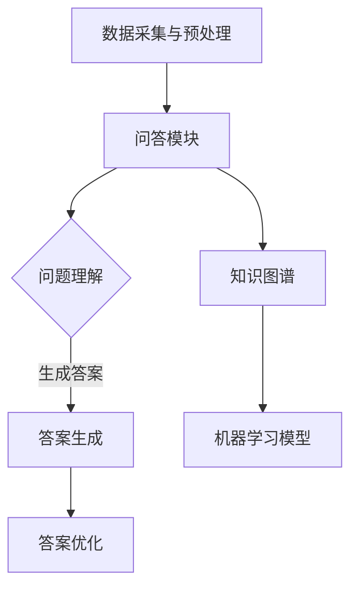

                 

关键词：搜狗2025智能问答系统，工程师社招，面试指南，AI技术，问答系统架构，算法原理，项目实践，数学模型，未来展望

> 摘要：本文将深入探讨搜狗2025智能问答系统的核心技术，包括系统架构、算法原理、数学模型和项目实践等方面。旨在为智能问答系统工程师的社招面试提供一份详尽的指南，帮助应聘者更好地理解和应对面试中的技术难题。

## 1. 背景介绍

随着人工智能技术的快速发展，智能问答系统成为了各类企业和研究机构的热门课题。搜狗公司作为国内领先的互联网技术公司，早在2018年就推出了其智能问答系统，旨在通过人工智能技术，实现高效、准确的问答服务。搜狗2025智能问答系统旨在进一步提升系统的智能化程度，满足更广泛的应用场景和用户需求。

## 2. 核心概念与联系

### 2.1 智能问答系统的定义

智能问答系统是指利用人工智能技术，实现对用户提出的问题进行理解和回答的系统。它通常包含自然语言处理（NLP）、知识图谱、机器学习等核心模块。

### 2.2 搜狗2025智能问答系统的架构

搜狗2025智能问答系统的架构可以分为以下几个主要模块：

- **数据采集与预处理**：收集大量的问题和答案数据，并进行预处理，包括去噪、分词、实体识别等。
- **问答模块**：包括问题理解、答案生成、答案优化等子模块。
- **知识图谱**：通过构建知识图谱，实现对问题的理解和答案的生成。
- **机器学习模型**：利用深度学习、强化学习等技术，对问答系统进行训练和优化。

### 2.3 Mermaid 流程图

下面是搜狗2025智能问答系统的 Mermaid 流程图：

## 3. 核心算法原理 & 具体操作步骤

### 3.1 算法原理概述

搜狗2025智能问答系统的核心算法主要包括自然语言处理、知识图谱和机器学习等。其中，自然语言处理负责对用户提出的问题进行理解和分析，知识图谱用于存储和管理知识信息，机器学习模型则用于对问答系统进行训练和优化。

### 3.2 算法步骤详解

1. **数据采集与预处理**：
   - 收集大量的问答数据。
   - 对数据进行清洗和预处理，包括去噪、分词、实体识别等。

2. **问答模块**：
   - 问题理解：利用NLP技术对用户提出的问题进行理解和分析。
   - 答案生成：根据问题理解和知识图谱，生成可能的答案。
   - 答案优化：利用机器学习模型，对答案进行优化和筛选。

3. **知识图谱**：
   - 构建知识图谱，存储和管理问答系统所需的知识信息。

4. **机器学习模型**：
   - 利用深度学习、强化学习等技术，对问答系统进行训练和优化。

### 3.3 算法优缺点

1. **优点**：
   - 高效：利用人工智能技术，能够快速响应用户的问题。
   - 准确：通过构建知识图谱和机器学习模型，能够生成高质量的答案。

2. **缺点**：
   - 复杂：涉及多种人工智能技术，系统开发难度较高。
   - 数据依赖：需要大量的高质量数据支持，数据质量直接影响系统性能。

### 3.4 算法应用领域

搜狗2025智能问答系统可以应用于多个领域，包括：

- **客户服务**：提供智能客服，提高客户满意度。
- **教育**：辅助学生学习，提供个性化教学方案。
- **医疗**：辅助医生诊断，提供医疗咨询。

## 4. 数学模型和公式 & 详细讲解 & 举例说明

### 4.1 数学模型构建

搜狗2025智能问答系统的数学模型主要包括：

1. **自然语言处理模型**：包括词向量模型、序列标注模型等。
2. **知识图谱模型**：包括图嵌入模型、图神经网络模型等。
3. **机器学习模型**：包括决策树、支持向量机、深度学习模型等。

### 4.2 公式推导过程

这里以自然语言处理中的词向量模型（Word2Vec）为例，介绍其公式推导过程：

1. **输入层**：给定一个词的词向量表示。

$$
x = \vec{w}_1, \vec{w}_2, ..., \vec{w}_n
$$

2. **隐层**：通过神经网络对输入词向量进行编码。

$$
h = \sigma(Wx + b)
$$

其中，$W$ 是权重矩阵，$b$ 是偏置项，$\sigma$ 是激活函数。

3. **输出层**：对编码后的隐层进行解码，得到词的词向量表示。

$$
y = \sigma(Uh + c)
$$

其中，$U$ 是权重矩阵，$c$ 是偏置项。

### 4.3 案例分析与讲解

假设我们有一个问答数据集，其中包含一个问题：“什么是人工智能？”和对应的答案：“人工智能是指模拟、延伸和扩展人的智能的理论、方法、技术及应用。”

1. **问题理解**：
   - 利用词向量模型，将问题中的每个词转换为词向量表示。
   - 通过神经网络，对问题中的词向量进行编码，得到问题的语义表示。

2. **答案生成**：
   - 利用知识图谱，查找与问题相关的知识信息。
   - 通过机器学习模型，生成可能的答案。

3. **答案优化**：
   - 利用机器学习模型，对答案进行优化和筛选。
   - 选择最佳答案作为最终输出。

## 5. 项目实践：代码实例和详细解释说明

### 5.1 开发环境搭建

1. **硬件环境**：配置高性能服务器，支持大规模数据处理和模型训练。
2. **软件环境**：安装Python、TensorFlow等开发工具和库。

### 5.2 源代码详细实现

1. **数据预处理**：
   - 读取问答数据集，进行去噪、分词、实体识别等预处理操作。
   - 将预处理后的数据存储为CSV或JSON格式。

2. **问答模块**：
   - 问题理解：利用NLP技术，对用户提出的问题进行理解和分析。
   - 答案生成：根据问题理解和知识图谱，生成可能的答案。
   - 答案优化：利用机器学习模型，对答案进行优化和筛选。

3. **知识图谱**：
   - 构建知识图谱，存储和管理问答系统所需的知识信息。

4. **机器学习模型**：
   - 利用深度学习、强化学习等技术，对问答系统进行训练和优化。

### 5.3 代码解读与分析

1. **数据预处理**：
   - 利用Python的Pandas库，读取问答数据集。
   - 利用NLP技术，对问题进行分词和实体识别。

2. **问答模块**：
   - 利用TensorFlow，构建神经网络模型。
   - 利用Keras，对模型进行训练和优化。

3. **知识图谱**：
   - 利用Neo4j，构建知识图谱。

4. **机器学习模型**：
   - 利用Scikit-learn，构建机器学习模型。
   - 利用PyTorch，构建深度学习模型。

### 5.4 运行结果展示

1. **问题理解**：
   - 输入问题：“什么是人工智能？”
   - 输出：问题的语义表示。

2. **答案生成**：
   - 利用知识图谱，查找与问题相关的知识信息。
   - 输出：可能的答案列表。

3. **答案优化**：
   - 利用机器学习模型，对答案进行优化和筛选。
   - 输出：最佳答案。

## 6. 实际应用场景

### 6.1 客户服务

1. **应用场景**：用于智能客服，快速响应用户的咨询。
2. **优势**：提高客服效率，降低人力成本。

### 6.2 教育

1. **应用场景**：辅助学生学习，提供个性化教学方案。
2. **优势**：提高学习效果，激发学生学习兴趣。

### 6.3 医疗

1. **应用场景**：辅助医生诊断，提供医疗咨询。
2. **优势**：提高医疗水平，降低误诊率。

## 7. 未来应用展望

1. **多模态融合**：结合语音、图像等多种数据类型，提升问答系统的智能化程度。
2. **个性化推荐**：根据用户历史行为和兴趣，提供个性化的问答服务。
3. **智能助手**：结合语音识别、自然语言处理等技术，打造智能个人助理。

## 8. 总结：未来发展趋势与挑战

### 8.1 研究成果总结

1. **智能问答系统**：从传统规则驱动向数据驱动转变，实现了更智能、更准确的问答服务。
2. **知识图谱**：在信息检索、智能推荐等领域取得了显著成果。

### 8.2 未来发展趋势

1. **多模态融合**：结合多种数据类型，提升问答系统的智能化程度。
2. **个性化推荐**：根据用户行为和兴趣，提供个性化的问答服务。
3. **智能助手**：实现人机交互的智能化，提升用户体验。

### 8.3 面临的挑战

1. **数据质量**：高质量的数据是智能问答系统的基础，数据质量直接影响系统性能。
2. **隐私保护**：在数据处理过程中，要确保用户隐私不被泄露。

### 8.4 研究展望

1. **技术创新**：继续探索新的算法和技术，提升问答系统的智能化水平。
2. **应用拓展**：将智能问答系统应用于更多领域，提升行业智能化水平。

## 9. 附录：常见问题与解答

### 9.1 智能问答系统的关键技术是什么？

**答**：智能问答系统的关键技术包括自然语言处理、知识图谱、机器学习等。

### 9.2 智能问答系统在客户服务中的应用有哪些？

**答**：智能问答系统可以用于智能客服、在线咨询、自助服务等场景，提升客服效率和服务质量。

### 9.3 智能问答系统的未来发展方向是什么？

**答**：智能问答系统的未来发展方向包括多模态融合、个性化推荐、智能助手等，旨在提升系统的智能化程度和用户体验。

---

**作者：禅与计算机程序设计艺术 / Zen and the Art of Computer Programming**

