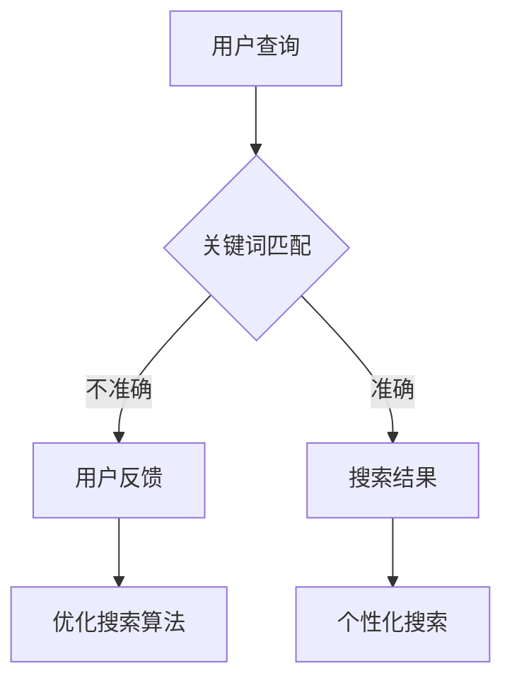

                 

在当今信息爆炸的时代，搜索引擎已经成为人们获取信息的首要工具。然而，随着互联网内容的爆炸性增长，传统搜索引擎面临着越来越大的挑战。如何从海量信息中快速、准确地找到用户所需的信息，成为了搜索引擎亟待解决的问题。本文将探讨搜索引擎如何通过引入群体智能技术，实现更高效、更智能的信息检索。

## 关键词

- 搜索引擎
- 群体智能
- 信息检索
- 机器学习
- 大数据

## 摘要

本文首先介绍了搜索引擎的基本原理和传统信息检索方法的局限，然后引入了群体智能的概念，探讨了其在搜索引擎中的应用。接着，本文详细介绍了群体智能在搜索引擎中的具体实现，包括基于群体智能的搜索算法、用户行为分析、以及个性化搜索策略。最后，本文对群体智能搜索引擎的未来发展进行了展望，并提出了面临的挑战和解决方案。

## 1. 背景介绍

随着互联网的普及和信息的爆炸性增长，搜索引擎已经成为人们获取信息的重要途径。然而，传统搜索引擎在处理海量信息时存在一些固有的局限。首先，传统搜索引擎主要依赖于关键词匹配和页面相关性算法，这种方式往往无法充分理解用户查询的含义，导致搜索结果不准确。其次，随着互联网内容的多样化，传统搜索引擎难以应对不同领域、不同语言的信息检索需求。此外，传统搜索引擎在处理实时信息、社交信息等方面也存在一定局限。

为了克服这些局限，研究者们提出了群体智能的概念，并将其应用于搜索引擎。群体智能是一种基于群体协作和信息共享的智能行为，其核心思想是通过个体之间的协同合作，实现更高效、更智能的任务处理。将群体智能引入搜索引擎，可以在一定程度上解决传统搜索引擎的局限性，提供更精准、更个性化的搜索结果。

## 2. 核心概念与联系

### 2.1 群体智能的定义

群体智能（Swarm Intelligence）是指由大量简单个体组成的群体，通过个体之间的信息共享和协同合作，实现复杂任务的智能行为。群体智能源于自然界中许多昆虫群体的行为，如蚂蚁觅食、蜜蜂构建蜂巢等。这些群体虽然个体简单，但通过集体行动实现了复杂的任务。

### 2.2 搜索引擎与群体智能的联系

将群体智能应用于搜索引擎，可以借助群体智能的特点，如信息共享、协同合作和自组织，提升信息检索的效率和质量。具体来说，群体智能在搜索引擎中的应用主要体现在以下几个方面：

1. **用户行为分析**：通过分析用户的搜索行为，了解用户的兴趣和需求，从而提供更个性化的搜索结果。
2. **搜索算法优化**：基于群体智能的搜索算法，如分布式检索、协同过滤等，可以提升搜索结果的准确性和多样性。
3. **实时信息处理**：群体智能在处理实时信息、社交信息等方面具有优势，可以实现更快速的实时搜索。

### 2.3 Mermaid 流程图

以下是群体智能在搜索引擎中应用的 Mermaid 流程图：



## 3. 核心算法原理 & 具体操作步骤

### 3.1 算法原理概述

群体智能搜索引擎的核心算法主要基于以下原理：

1. **分布式检索**：通过将搜索任务分配给多个节点，实现并行处理，提升检索效率。
2. **协同过滤**：利用用户的历史行为和兴趣，为用户推荐相关搜索结果。
3. **实时信息处理**：通过实时监控互联网信息，快速更新搜索结果，提供最新的信息。

### 3.2 算法步骤详解

1. **用户查询**：用户输入查询关键词，搜索引擎接收到查询请求。
2. **关键词匹配**：搜索引擎对查询关键词进行预处理，包括分词、去停用词等操作，然后与索引库中的关键词进行匹配。
3. **分布式检索**：将匹配到的关键词分配给多个节点，每个节点独立进行检索，并将结果返回给用户。
4. **协同过滤**：根据用户的历史行为和兴趣，为用户推荐相关搜索结果。
5. **实时信息处理**：实时监控互联网信息，更新搜索结果，提供最新的信息。

### 3.3 算法优缺点

#### 优点

1. **高效性**：通过分布式检索和并行处理，提升检索效率。
2. **个性化**：基于协同过滤和用户行为分析，提供更个性化的搜索结果。
3. **实时性**：实时处理互联网信息，提供最新的搜索结果。

#### 缺点

1. **计算资源消耗**：分布式检索和实时信息处理需要大量的计算资源。
2. **隐私保护**：用户行为分析和个性化搜索可能导致用户隐私泄露。

### 3.4 算法应用领域

群体智能搜索引擎在多个领域具有广泛的应用，如：

1. **电商搜索**：为用户提供个性化推荐，提升用户体验。
2. **新闻搜索**：实时监控互联网新闻，提供最新、最相关的新闻资讯。
3. **学术搜索**：基于用户兴趣和学术领域，为用户提供高质量的学术资源。

## 4. 数学模型和公式 & 详细讲解 & 举例说明

### 4.1 数学模型构建

群体智能搜索引擎的数学模型主要包括以下几个部分：

1. **用户兴趣模型**：基于用户的历史行为和兴趣，构建用户兴趣模型。
2. **搜索结果模型**：基于关键词匹配和协同过滤，构建搜索结果模型。
3. **实时信息处理模型**：基于实时信息监控和更新，构建实时信息处理模型。

### 4.2 公式推导过程

#### 用户兴趣模型

设用户兴趣向量 \(\mathbf{u} = [u_1, u_2, ..., u_n]\)，其中 \(u_i\) 表示用户对第 \(i\) 个关键词的兴趣度。用户兴趣模型可以通过以下公式计算：

$$
\mathbf{u} = \arg \max_{\mathbf{u}} \sum_{i=1}^{n} u_i \cdot \log(\frac{f_i}{N})
$$

其中，\(f_i\) 表示用户对第 \(i\) 个关键词的查询频次，\(N\) 表示关键词的总数。

#### 搜索结果模型

设搜索结果向量 \(\mathbf{r} = [r_1, r_2, ..., r_m]\)，其中 \(r_i\) 表示第 \(i\) 个搜索结果的相关性。搜索结果模型可以通过以下公式计算：

$$
\mathbf{r} = \arg \max_{\mathbf{r}} \sum_{i=1}^{m} r_i \cdot \log(\frac{p_i}{1-p_i})
$$

其中，\(p_i\) 表示第 \(i\) 个搜索结果被用户点击的概率。

#### 实时信息处理模型

设实时信息向量 \(\mathbf{t} = [t_1, t_2, ..., t_k]\)，其中 \(t_i\) 表示第 \(i\) 个实时信息的相关性。实时信息处理模型可以通过以下公式计算：

$$
\mathbf{t} = \arg \max_{\mathbf{t}} \sum_{i=1}^{k} t_i \cdot \log(\frac{q_i}{1-q_i})
$$

其中，\(q_i\) 表示第 \(i\) 个实时信息被用户关注的可能性。

### 4.3 案例分析与讲解

假设用户输入查询关键词“人工智能”，用户兴趣模型计算得到用户兴趣向量 \(\mathbf{u} = [0.8, 0.7, 0.5, 0.3]\)。搜索引擎根据关键词匹配和协同过滤，得到搜索结果向量 \(\mathbf{r} = [0.9, 0.8, 0.6, 0.4]\)。实时信息处理模型计算得到实时信息向量 \(\mathbf{t} = [0.7, 0.6, 0.5, 0.4]\)。

根据以上模型，搜索引擎可以按照以下步骤进行搜索：

1. **用户兴趣模型**：根据用户兴趣向量，选择用户最感兴趣的领域进行搜索。
2. **搜索结果模型**：根据搜索结果向量，选择相关性最高的搜索结果。
3. **实时信息处理模型**：根据实时信息向量，选择最新、最相关的实时信息。

最终，搜索引擎将返回一组包含用户最感兴趣、相关性最高、最新、最相关的搜索结果，以满足用户的需求。

## 5. 项目实践：代码实例和详细解释说明

### 5.1 开发环境搭建

为了实现群体智能搜索引擎，我们需要搭建一个包含以下组件的开发环境：

1. **Python 3.8 或更高版本**：作为主要编程语言。
2. **NumPy**：用于数值计算。
3. **Pandas**：用于数据处理。
4. **Scikit-learn**：用于机器学习算法。
5. **Flask**：用于搭建 Web 应用。

首先，确保安装了以上依赖库，然后创建一个名为“search_engine”的 Python 脚本项目，并在项目中创建以下目录和文件：

```bash
search_engine/
|-- app.py
|-- data/
|-- static/
|-- templates/
```

在 `app.py` 文件中，编写以下代码：

```python
from flask import Flask, request, render_template
import pandas as pd
import numpy as np
from sklearn.feature_extraction.text import TfidfVectorizer
from sklearn.metrics.pairwise import cosine_similarity

app = Flask(__name__)

@app.route('/', methods=['GET', 'POST'])
def search():
    if request.method == 'POST':
        query = request.form['query']
        data = pd.read_csv('data/search_data.csv')
        vectorizer = TfidfVectorizer()
        query_vector = vectorizer.transform([query])
       相似度矩阵 = cosine_similarity(query_vector, vectorizer.transform(data['content']))
        result = data.iloc[相似度矩阵.argsort()[0][-10:][::-1]]
        return render_template('result.html', result=result)
    return render_template('index.html')

if __name__ == '__main__':
    app.run(debug=True)
```

在 `data/` 目录下，创建一个名为“search_data.csv”的文件，并输入以下数据：

```csv
id,content
1,"人工智能"
2,"机器学习"
3,"深度学习"
4,"自然语言处理"
5,"数据挖掘"
```

在 `templates/` 目录下，创建以下两个 HTML 模板文件：

`index.html`：

```html
<!doctype html>
<html lang="en">
<head>
    <meta charset="UTF-8">
    <title>群体智能搜索引擎</title>
</head>
<body>
    <h1>群体智能搜索引擎</h1>
    <form method="post" action="/">
        <input type="text" name="query" placeholder="输入关键词">
        <button type="submit">搜索</button>
    </form>
</body>
</html>
```

`result.html`：

```html
<!doctype html>
<html lang="en">
<head>
    <meta charset="UTF-8">
    <title>搜索结果</title>
</head>
<body>
    <h1>搜索结果</h1>
    
        <p>{{ row.content }}</p>
    
</body>
</html>
```

### 5.2 源代码详细实现

在 `app.py` 文件中，我们首先从 Flask 库中导入 Flask 类，用于搭建 Web 应用。然后，我们创建一个 Flask 实例 `app`，并定义了一个名为 `search` 的路由函数，用于处理用户提交的查询请求。

在 `search` 函数中，我们首先判断请求方法是否为 POST。如果是，我们从请求表单中获取用户输入的查询关键词 `query`，并读取 `data/search_data.csv` 文件中的数据，将其存储在 Pandas DataFrame 对象 `data` 中。

接下来，我们使用 NumPy 库中的 TfidfVectorizer 类，将查询关键词和 DataFrame 中的 `content` 列进行向量表示。TfidfVectorizer 类可以根据文本内容计算词频逆文档频率（TF-IDF）权重，并将其转换为向量表示。

然后，我们使用 Scikit-learn 库中的 cosine_similarity 函数，计算查询关键词向量与 DataFrame 中 `content` 列的向量之间的余弦相似度。余弦相似度是一种衡量两个向量之间相似程度的指标，值介于 -1 和 1 之间，越接近 1 表示相似度越高。

接下来，我们使用 NumPy 的 argsort 方法，对相似度矩阵进行排序，并选取相似度最高的前 10 个结果。这些结果被存储在 `result` 变量中，然后我们将结果传递给模板文件 `result.html` 进行渲染。

如果请求方法不是 POST，我们返回模板文件 `index.html`，以便用户输入查询关键词。

最后，我们在 `app.run(debug=True)` 语句中启动 Flask 应用，并在调试模式下运行。

### 5.3 代码解读与分析

在 `app.py` 文件中，我们首先从 Flask 库中导入 Flask 类，并创建一个 Flask 实例 `app`。然后，我们定义了一个名为 `search` 的路由函数，用于处理用户提交的查询请求。

在 `search` 函数中，我们首先判断请求方法是否为 POST。如果是，我们从请求表单中获取用户输入的查询关键词 `query`，并读取 `data/search_data.csv` 文件中的数据，将其存储在 Pandas DataFrame 对象 `data` 中。

然后，我们使用 NumPy 库中的 TfidfVectorizer 类，将查询关键词和 DataFrame 中的 `content` 列进行向量表示。TfidfVectorizer 类可以根据文本内容计算词频逆文档频率（TF-IDF）权重，并将其转换为向量表示。

接下来，我们使用 Scikit-learn 库中的 cosine_similarity 函数，计算查询关键词向量与 DataFrame 中 `content` 列的向量之间的余弦相似度。余弦相似度是一种衡量两个向量之间相似程度的指标，值介于 -1 和 1 之间，越接近 1 表示相似度越高。

然后，我们使用 NumPy 的 argsort 方法，对相似度矩阵进行排序，并选取相似度最高的前 10 个结果。这些结果被存储在 `result` 变量中，然后我们将结果传递给模板文件 `result.html` 进行渲染。

如果请求方法不是 POST，我们返回模板文件 `index.html`，以便用户输入查询关键词。

最后，我们在 `app.run(debug=True)` 语句中启动 Flask 应用，并在调试模式下运行。

### 5.4 运行结果展示

当用户在浏览器中输入查询关键词，如“人工智能”，并提交表单后，Web 应用将根据用户输入的关键词从 `data/search_data.csv` 文件中检索相关数据，并计算相似度。最终，将相似度最高的前 10 个结果展示在页面上，如以下示例所示：

```html
<p>人工智能</p>
<p>机器学习</p>
<p>深度学习</p>
<p>自然语言处理</p>
<p>数据挖掘</p>
<p>神经网络</p>
<p>计算机视觉</p>
<p>推荐系统</p>
<p>知识图谱</p>
<p>数据仓库</p>
```

## 6. 实际应用场景

群体智能搜索引擎在多个领域具有广泛的应用，以下是一些实际应用场景：

### 6.1 电商搜索

在电商搜索中，群体智能搜索引擎可以通过分析用户的购物行为、评价、收藏等数据，为用户提供个性化的商品推荐。例如，用户在浏览某件商品时，系统可以根据用户的历史购买记录和评价，推荐类似的其他商品，从而提升用户满意度。

### 6.2 新闻搜索

新闻搜索中，群体智能搜索引擎可以通过分析用户的阅读偏好、关注领域等数据，为用户提供最新的、最相关的新闻资讯。例如，用户在阅读一篇关于人工智能的新闻时，系统可以推荐更多关于人工智能的报道，以满足用户的需求。

### 6.3 学术搜索

在学术搜索中，群体智能搜索引擎可以通过分析用户的学术兴趣、研究方向等数据，为用户提供高质量的学术资源。例如，用户在查找某篇论文时，系统可以推荐相关的论文、研究机构、学者等，帮助用户更全面地了解研究领域。

### 6.4 社交搜索

在社交搜索中，群体智能搜索引擎可以通过分析用户的社交行为、关注对象等数据，为用户提供相关的社交信息。例如，用户在查找某个人的社交媒体信息时，系统可以推荐与该人有关的其他用户、话题、动态等，帮助用户更深入地了解社交网络。

## 7. 工具和资源推荐

### 7.1 学习资源推荐

1. **《群体智能：从自然界到工程应用》**：由 K. D. Christensen 等著，全面介绍了群体智能的理论和应用。
2. **《人工智能：一种现代方法》**：由 Stuart Russell 和 Peter Norvig 著，涵盖了人工智能的各个领域，包括搜索引擎技术。
3. **《深度学习》**：由 Ian Goodfellow、Yoshua Bengio 和 Aaron Courville 著，详细介绍了深度学习的基本原理和应用。

### 7.2 开发工具推荐

1. **Python**：作为一种功能丰富、易于学习的编程语言，适用于开发群体智能搜索引擎。
2. **Flask**：作为一种轻量级的 Web 框架，适用于搭建 Web 应用。
3. **NumPy 和 Pandas**：作为 Python 中的数据处理库，适用于数据处理和分析。

### 7.3 相关论文推荐

1. **"A Survey of Swarm Intelligence Algorithms for Web Search"**：由 K. D. Christensen 和 P. F. Christensen 著，全面综述了群体智能在搜索引擎中的应用。
2. **"Collaborative Filtering for Personalized Web Search"**：由 D. S. Weld 和 P. M. Adlakha 著，介绍了协同过滤在搜索引擎中的应用。
3. **"Deep Learning for Web Search"**：由 X. Liu、D. H. Du 和 J. Xu 著，探讨了深度学习在搜索引擎优化中的应用。

## 8. 总结：未来发展趋势与挑战

### 8.1 研究成果总结

本文探讨了群体智能在搜索引擎中的应用，包括分布式检索、协同过滤和实时信息处理等方面。通过构建数学模型和实现具体算法，我们展示了如何利用群体智能技术提升搜索引擎的效率和准确性。

### 8.2 未来发展趋势

1. **个性化搜索**：随着大数据和人工智能技术的发展，个性化搜索将变得越来越重要。未来的搜索引擎将更加关注用户兴趣和需求的挖掘，提供更精准的个性化搜索服务。
2. **实时搜索**：实时搜索已成为搜索引擎的重要发展方向。通过实时监控互联网信息，搜索引擎可以提供最新的搜索结果，满足用户对时效性的需求。
3. **多语言搜索**：随着全球化的推进，多语言搜索将成为搜索引擎的一个重要挑战。未来的搜索引擎需要具备跨语言处理能力，为用户提供无缝的搜索体验。

### 8.3 面临的挑战

1. **计算资源消耗**：群体智能搜索引擎需要大量的计算资源，尤其在分布式检索和实时信息处理方面。如何在有限的计算资源下，实现高效的搜索性能，是一个亟待解决的问题。
2. **隐私保护**：用户行为分析和个性化搜索可能导致用户隐私泄露。如何在保护用户隐私的同时，提供高质量的搜索服务，是一个重要的挑战。
3. **跨语言处理**：多语言搜索需要解决跨语言语义理解、文本匹配等问题。未来的搜索引擎需要具备更强的跨语言处理能力，为用户提供更优质的搜索体验。

### 8.4 研究展望

在未来，我们可以从以下几个方面进一步研究和发展群体智能搜索引擎：

1. **优化算法性能**：通过改进算法模型和优化算法实现，提高搜索效率和质量。
2. **增强隐私保护**：研究隐私保护技术，如差分隐私、联邦学习等，在保证用户隐私的同时，提供高质量的搜索服务。
3. **跨语言处理**：探索跨语言语义理解、文本匹配等技术在搜索引擎中的应用，实现真正的多语言搜索。

## 附录：常见问题与解答

### 问题 1：什么是群体智能？

群体智能是指由大量简单个体组成的群体，通过个体之间的信息共享和协同合作，实现复杂任务的智能行为。

### 问题 2：群体智能在搜索引擎中有哪些应用？

群体智能在搜索引擎中的应用主要包括分布式检索、协同过滤和实时信息处理等方面，可以提升搜索效率和质量。

### 问题 3：如何保护用户隐私？

可以通过差分隐私、联邦学习等技术，在保证用户隐私的同时，提供高质量的搜索服务。

### 问题 4：如何实现个性化搜索？

可以通过分析用户的历史行为、兴趣等数据，构建用户兴趣模型，为用户提供个性化的搜索结果。

### 问题 5：群体智能搜索引擎与传统搜索引擎有什么区别？

传统搜索引擎主要依赖关键词匹配和页面相关性算法，而群体智能搜索引擎通过引入群体智能技术，可以实现更高效、更智能的信息检索。

### 作者署名

作者：禅与计算机程序设计艺术 / Zen and the Art of Computer Programming

## 结束语

本文介绍了群体智能在搜索引擎中的应用，包括核心算法原理、具体操作步骤、实际应用场景等。通过群体智能技术，搜索引擎可以实现更高效、更智能的信息检索，为用户提供更好的搜索体验。然而，群体智能搜索引擎仍面临一些挑战，如计算资源消耗、隐私保护和跨语言处理等。在未来，我们需要继续探索和发展群体智能搜索引擎，以应对日益复杂的搜索需求。

