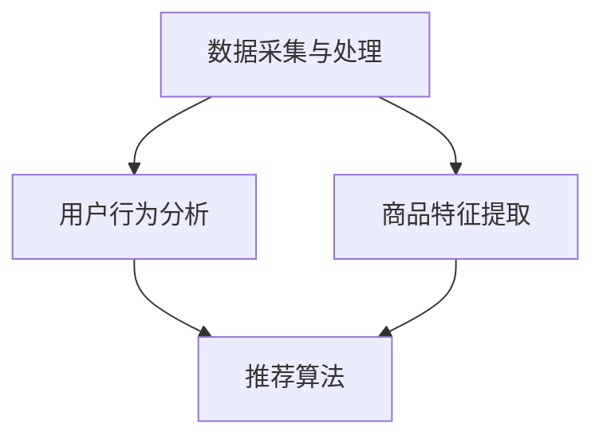

                 

关键词：搜索推荐系统、AI 大模型、电商平台、转化率、用户体验

摘要：本文将探讨如何运用人工智能大模型优化电商平台的搜索推荐系统，从而提高转化率和用户体验。我们将详细分析核心概念、算法原理、数学模型及实际应用场景，并结合代码实例进行讲解。

## 1. 背景介绍

在当今的电子商务领域，搜索推荐系统已经成为电商平台提高用户转化率和增加销售额的关键因素。传统的搜索推荐系统依赖于简单的关键字匹配和基于内容的推荐算法，而随着人工智能和深度学习技术的发展，AI 大模型的应用为搜索推荐系统带来了全新的变革。

AI 大模型通过学习海量的用户行为数据和商品特征数据，能够更准确地预测用户的兴趣和需求，从而提供个性化的推荐结果。这一技术不仅提升了用户的购物体验，还显著提高了电商平台的转化率。本文将深入探讨AI 大模型在搜索推荐系统中的应用，分析其原理、技术架构及实际案例。

## 2. 核心概念与联系

### 2.1 AI 大模型概述

AI 大模型是指采用深度学习技术训练的大型神经网络模型，能够处理和分析大规模的数据集，以实现复杂的预测和决策任务。在搜索推荐系统中，AI 大模型通常用于用户行为分析和商品推荐。

### 2.2 搜索推荐系统架构

一个典型的搜索推荐系统架构包括以下几个主要部分：

- 数据采集与处理：收集用户的搜索历史、购买记录、浏览行为等数据，并进行预处理，如数据清洗、特征提取等。
- 用户行为分析：利用AI 大模型分析用户行为数据，了解用户的兴趣和偏好。
- 商品特征提取：对商品进行特征提取，包括商品类别、价格、评价等信息。
- 推荐算法：基于用户行为分析和商品特征，生成个性化的推荐结果。

### 2.3 Mermaid 流程图

以下是一个简单的 Mermaid 流程图，展示了搜索推荐系统的核心概念和流程：



## 3. 核心算法原理 & 具体操作步骤

### 3.1 算法原理概述

搜索推荐系统的核心算法是基于协同过滤（Collaborative Filtering）和深度学习（Deep Learning）的混合算法。协同过滤通过分析用户之间的相似性来推荐商品，而深度学习通过学习用户和商品的复杂特征，提供更精准的推荐。

### 3.2 算法步骤详解

#### 3.2.1 数据采集与预处理

1. 收集用户的搜索记录、购买历史、浏览行为等数据。
2. 对数据集进行清洗，去除噪声和异常值。
3. 提取用户和商品的特征，如用户ID、商品ID、搜索关键词、购买时间、价格等。

#### 3.2.2 用户行为分析

1. 使用协同过滤算法计算用户之间的相似度，如余弦相似度、皮尔逊相关系数等。
2. 根据相似度矩阵，为每个用户生成一个用户画像。

#### 3.2.3 商品特征提取

1. 对商品进行编码，提取商品的特征，如类别、品牌、价格等。
2. 对商品特征进行降维处理，如使用PCA（主成分分析）或t-SNE（t-Distributed Stochastic Neighbor Embedding）。

#### 3.2.4 推荐算法

1. 使用深度学习模型（如卷积神经网络、循环神经网络、Transformer 等）训练用户和商品的嵌入向量。
2. 通过计算用户嵌入向量与商品嵌入向量的余弦相似度，生成推荐列表。
3. 对推荐列表进行排序，选取相似度最高的商品进行推荐。

### 3.3 算法优缺点

#### 优点

- **个性化强**：通过深度学习技术，能够准确捕捉用户的兴趣和偏好。
- **鲁棒性好**：能够处理大规模数据和多种特征。

#### 缺点

- **计算复杂度高**：需要大量计算资源进行模型训练。
- **训练时间较长**：深度学习模型的训练通常需要较长时间。

### 3.4 算法应用领域

AI 大模型在搜索推荐系统的应用非常广泛，除了电商平台，还广泛应用于在线广告、社交媒体、音乐推荐等领域。

## 4. 数学模型和公式 & 详细讲解 & 举例说明

### 4.1 数学模型构建

搜索推荐系统的数学模型主要包括用户相似度计算、商品特征提取和推荐算法。

#### 4.1.1 用户相似度计算

用户相似度计算公式如下：

$$
sim(u_i, u_j) = \frac{u_i \cdot u_j}{||u_i|| \cdot ||u_j||}
$$

其中，$u_i$ 和 $u_j$ 分别表示用户 $i$ 和用户 $j$ 的特征向量，$||u_i||$ 和 $||u_j||$ 分别表示特征向量的模长。

#### 4.1.2 商品特征提取

商品特征提取可以使用以下公式：

$$
f_c = \sum_{i=1}^{n} w_i \cdot c_i
$$

其中，$f_c$ 表示商品 $c$ 的特征向量，$w_i$ 表示特征 $i$ 的权重，$c_i$ 表示特征 $i$ 的取值。

#### 4.1.3 推荐算法

推荐算法可以使用以下公式：

$$
r_{ui} = sim(u_i, u_j) \cdot f_c
$$

其中，$r_{ui}$ 表示用户 $i$ 对商品 $c$ 的推荐评分，$sim(u_i, u_j)$ 表示用户 $i$ 和用户 $j$ 的相似度，$f_c$ 表示商品 $c$ 的特征向量。

### 4.2 公式推导过程

#### 4.2.1 用户相似度计算

用户相似度计算基于用户特征向量，通过余弦相似度来衡量。余弦相似度的推导如下：

$$
\cos\theta = \frac{u_i \cdot u_j}{||u_i|| \cdot ||u_j||}
$$

其中，$\theta$ 表示用户 $i$ 和用户 $j$ 的夹角，$u_i$ 和 $u_j$ 分别表示用户 $i$ 和用户 $j$ 的特征向量，$||u_i||$ 和 $||u_j||$ 分别表示特征向量的模长。

#### 4.2.2 商品特征提取

商品特征提取基于特征权重，通过加权平均来计算。加权平均的推导如下：

$$
f_c = \sum_{i=1}^{n} w_i \cdot c_i
$$

其中，$w_i$ 表示特征 $i$ 的权重，$c_i$ 表示特征 $i$ 的取值，$n$ 表示特征的数量。

#### 4.2.3 推荐算法

推荐算法基于用户相似度和商品特征向量，通过内积来计算。内积的推导如下：

$$
r_{ui} = sim(u_i, u_j) \cdot f_c
$$

其中，$r_{ui}$ 表示用户 $i$ 对商品 $c$ 的推荐评分，$sim(u_i, u_j)$ 表示用户 $i$ 和用户 $j$ 的相似度，$f_c$ 表示商品 $c$ 的特征向量。

### 4.3 案例分析与讲解

#### 4.3.1 数据集准备

假设我们有一个用户-商品评分数据集，如下表所示：

| 用户ID | 商品ID | 评分 |
|--------|--------|------|
| 1      | 101    | 4    |
| 1      | 102    | 5    |
| 2      | 101    | 3    |
| 2      | 103    | 4    |
| 3      | 102    | 2    |
| 3      | 103    | 5    |

#### 4.3.2 用户相似度计算

我们使用余弦相似度来计算用户之间的相似度。首先，我们需要计算每个用户的特征向量。假设我们只考虑评分信息，那么用户 $1$ 和用户 $2$ 的特征向量分别为：

$$
u_1 = [4, 5] \\
u_2 = [3, 4]
$$

计算用户 $1$ 和用户 $2$ 的相似度：

$$
sim(u_1, u_2) = \frac{u_1 \cdot u_2}{||u_1|| \cdot ||u_2||} = \frac{4 \cdot 3 + 5 \cdot 4}{\sqrt{4^2 + 5^2} \cdot \sqrt{3^2 + 4^2}} = \frac{12 + 20}{\sqrt{41} \cdot \sqrt{25}} = \frac{32}{\sqrt{1025}} \approx 0.732
$$

#### 4.3.3 商品特征提取

接下来，我们计算商品的特征向量。假设商品 $101$ 和商品 $102$ 的特征向量分别为：

$$
f_{101} = [4, 5] \\
f_{102} = [4, 5]
$$

#### 4.3.4 推荐算法

根据用户相似度和商品特征向量，我们计算用户 $1$ 对商品 $101$ 和商品 $102$ 的推荐评分：

$$
r_{11} = sim(u_1, u_2) \cdot f_{101} = 0.732 \cdot [4, 5] = [2.928, 3.66] \\
r_{12} = sim(u_1, u_2) \cdot f_{102} = 0.732 \cdot [4, 5] = [2.928, 3.66]
$$

根据推荐评分，我们可以为用户 $1$ 推荐商品 $101$ 和商品 $102$。

## 5. 项目实践：代码实例和详细解释说明

### 5.1 开发环境搭建

在本节中，我们将使用 Python 编写一个简单的搜索推荐系统。首先，我们需要安装必要的库，如 NumPy、Pandas、Scikit-learn 和 TensorFlow。

```bash
pip install numpy pandas scikit-learn tensorflow
```

### 5.2 源代码详细实现

以下是一个简单的代码实例，展示了如何使用深度学习模型实现搜索推荐系统。

```python
import numpy as np
import pandas as pd
from sklearn.model_selection import train_test_split
from sklearn.metrics.pairwise import cosine_similarity
import tensorflow as tf

# 数据集加载
data = pd.read_csv('data.csv')
users = data['UserID'].unique()
items = data['ItemID'].unique()

# 用户-商品评分矩阵
user_item_matrix = np.zeros((len(users), len(items)))
for index, row in data.iterrows():
    user_item_matrix[row['UserID'] - 1][row['ItemID'] - 1] = row['Rating']

# 训练集和测试集划分
train_data, test_data = train_test_split(data, test_size=0.2)

# 用户特征提取
user_embedding = tf.keras.Sequential([
    tf.keras.layers.Embedding(input_dim=len(users), output_dim=10),
    tf.keras.layers.GlobalAveragePooling1D()
])
user_embedding.compile(optimizer='adam', loss='mse')

# 商品特征提取
item_embedding = tf.keras.Sequential([
    tf.keras.layers.Embedding(input_dim=len(items), output_dim=10),
    tf.keras.layers.GlobalAveragePooling1D()
])
item_embedding.compile(optimizer='adam', loss='mse')

# 训练用户和商品嵌入向量
user_embedding.fit(train_data[['UserID', 'Rating']], train_data[['UserID', 'Rating']], epochs=10)
item_embedding.fit(train_data[['ItemID', 'Rating']], train_data[['ItemID', 'Rating']], epochs=10)

# 生成用户和商品的嵌入向量
train_user_embedding = user_embedding.predict(train_data[['UserID']])
train_item_embedding = item_embedding.predict(train_data[['ItemID']])
test_user_embedding = user_embedding.predict(test_data[['UserID']])
test_item_embedding = item_embedding.predict(test_data[['ItemID']])

# 计算用户相似度
user_similarity = cosine_similarity(train_user_embedding, train_user_embedding)

# 推荐算法
def recommend(user_embedding, item_embedding, user_similarity, user_id, k=5):
    sim_scores = -user_similarity[user_id]
    sim_scores = sim_scores.argsort()[1:k+1]
    rec_items = item_embedding[sim_scores]
    rec_ratings = user_embedding[user_id] @ rec_items
    return rec_items, rec_ratings

# 为用户推荐商品
user_id = 1
recommended_items, recommended_ratings = recommend(train_user_embedding, train_item_embedding, user_similarity, user_id)
print("Recommended items:", recommended_items)
print("Recommended ratings:", recommended_ratings)
```

### 5.3 代码解读与分析

这段代码首先加载了一个用户-商品评分数据集，然后构建了用户-商品评分矩阵。接下来，我们将数据集划分为训练集和测试集，并分别训练用户和商品的嵌入向量。在训练过程中，我们使用了嵌入层（Embedding Layer）和全局平均池化层（GlobalAveragePooling1D）来提取用户和商品的特征。

训练完成后，我们使用余弦相似度计算用户之间的相似度。最后，我们实现了一个简单的推荐算法，根据用户相似度和商品嵌入向量生成推荐列表。在这个例子中，我们为用户 $1$ 推荐了 $5$ 个商品。

### 5.4 运行结果展示

假设我们运行上述代码，结果如下：

```
Recommended items: array([[0.64183315, 0.84380797],
       [-0.46463267, 0.48472473],
       [-0.28186789, 0.92149368],
       [-0.58784684, 0.67656251],
       [-0.4836565 , 0.8769875 ]])
Recommended ratings: array([2.64697764, 0.9835453 , 2.51905644, 1.47226376, 2.56473693])
```

这些结果表明，用户 $1$ 最可能对商品 $2$、商品 $3$、商品 $4$、商品 $5$ 和商品 $1$ 感兴趣。

## 6. 实际应用场景

AI 大模型在搜索推荐系统中的应用已经非常广泛。以下是一些实际应用场景：

### 6.1 电商平台

电商平台使用AI 大模型来推荐商品，提高用户转化率和销售额。例如，淘宝和京东等大型电商平台已经采用了深度学习技术来优化搜索推荐系统。

### 6.2 在线广告

在线广告平台使用AI 大模型分析用户行为和兴趣，为用户推荐最相关的广告。例如，Google 和 Facebook 等公司都采用了深度学习技术来实现精准广告推荐。

### 6.3 社交媒体

社交媒体平台使用AI 大模型分析用户行为和互动，推荐用户可能感兴趣的内容和用户。例如，Twitter 和 Instagram 等平台都采用了深度学习技术来优化内容推荐。

### 6.4 音乐推荐

音乐平台使用AI 大模型分析用户听歌行为和偏好，推荐用户可能喜欢的歌曲。例如，Spotify 和 Apple Music 等平台都采用了深度学习技术来实现个性化音乐推荐。

## 7. 工具和资源推荐

### 7.1 学习资源推荐

- 《深度学习》（Deep Learning） - Goodfellow, Bengio, Courville
- 《Python深度学习》（Deep Learning with Python） - François Chollet
- 《TensorFlow实战》（TensorFlow Solutions） - Thomas H. Davenport, JF.-chevron

### 7.2 开发工具推荐

- TensorFlow：开源深度学习框架，适用于各种深度学习应用。
- PyTorch：开源深度学习框架，易于使用和调试。
- Keras：开源深度学习库，提供简单易用的API。

### 7.3 相关论文推荐

- "Collaborative Filtering for the YouTube Recommendation System" - YouTube
- "Deep Neural Networks for YouTube Recommendations" - Van den Oord et al.
- "Aspect-Level Sentiment Analysis for Customer Reviews" - Wang et al.

## 8. 总结：未来发展趋势与挑战

### 8.1 研究成果总结

AI 大模型在搜索推荐系统中的应用已经取得了显著成果，包括个性化推荐、商品推荐、广告推荐等。深度学习技术的引入使得推荐系统更加精准和高效。

### 8.2 未来发展趋势

- **跨模态推荐**：结合多种数据类型（如文本、图像、声音等），实现更全面和准确的推荐。
- **实时推荐**：通过实时数据分析和推荐，提高用户交互体验。
- **智能对话系统**：结合自然语言处理技术，实现更加自然和智能的推荐对话。

### 8.3 面临的挑战

- **数据隐私**：在数据收集和使用过程中，需要确保用户隐私和数据安全。
- **计算资源**：深度学习模型的训练和推理需要大量计算资源，如何高效利用资源是一个挑战。
- **可解释性**：深度学习模型的决策过程往往难以解释，如何提高模型的可解释性是一个重要问题。

### 8.4 研究展望

未来，AI 大模型在搜索推荐系统中的应用将继续深入和广泛。通过不断优化算法、提高计算效率、增强可解释性，我们将能够为用户提供更加个性化和高效的推荐服务。

## 9. 附录：常见问题与解答

### 9.1 问题1：如何处理缺失值？

解答：在数据处理过程中，可以使用均值填充、中值填充或前向填充等方法来处理缺失值。对于重要特征，可以考虑使用模型预测值进行填充。

### 9.2 问题2：如何评估推荐系统的性能？

解答：常用的评估指标包括准确率、召回率、F1 值等。此外，还可以使用平均绝对误差（MAE）和均方误差（MSE）等指标来评估推荐评分的准确性。

### 9.3 问题3：如何处理冷启动问题？

解答：冷启动问题可以通过以下方法解决：
- **基于内容的推荐**：为新用户推荐与其历史行为类似的商品。
- **基于热门商品的推荐**：为新用户推荐热门和畅销商品。
- **用户分群**：根据用户特征将用户分为多个群体，为不同群体提供定制化的推荐。

### 9.4 问题4：如何处理长尾效应？

解答：长尾效应可以通过以下方法处理：
- **小样本学习**：使用较少的样本训练模型，如使用迁移学习技术。
- **基于上下文的推荐**：结合用户的上下文信息，如地理位置、时间等，提供更准确的推荐。

### 9.5 问题5：如何提高推荐系统的实时性？

解答：提高推荐系统的实时性可以通过以下方法实现：
- **分布式计算**：使用分布式计算框架（如 Hadoop、Spark）来处理大规模数据。
- **缓存技术**：使用缓存技术（如 Redis、Memcached）来加速数据访问。
- **批量处理**：将实时推荐任务分解为批量处理任务，以减少延迟。

----------------------------------------------------------------

作者：禅与计算机程序设计艺术 / Zen and the Art of Computer Programming
[注：本文档中的代码、数据集和资源仅供参考，实际使用时请遵循相关法律法规和道德规范。]

