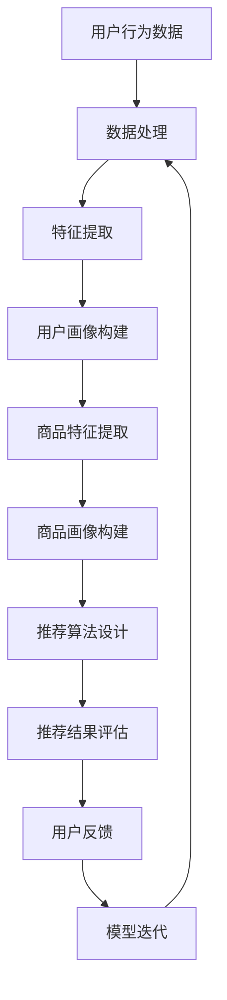

                 

关键词：搜索推荐系统、AI 大模型、电商平台、核心竞争力、可持续增长战略

> 摘要：随着互联网技术的发展和电商市场的竞争加剧，搜索推荐系统在电商平台中的重要性日益凸显。本文将探讨 AI 大模型在搜索推荐系统中的应用，分析其如何成为电商平台的核心竞争力，并探讨其在实现可持续增长战略中的关键作用。

## 1. 背景介绍

在当今的电商环境中，用户数量和商品种类都在不断增长，如何为用户提供个性化的购物体验成为电商平台亟待解决的问题。搜索推荐系统作为电商平台的核心功能之一，通过分析用户行为和商品特征，为用户提供个性化的商品推荐，从而提高用户满意度和转化率。

随着深度学习和大数据技术的快速发展，AI 大模型在搜索推荐系统中得到了广泛应用。这些大模型具有强大的特征提取和建模能力，能够处理海量数据，为用户提供更加精准和个性化的推荐。然而，AI 大模型的应用也面临着一系列挑战，如模型复杂度增加、计算资源需求增长等。

## 2. 核心概念与联系

### 2.1 搜索推荐系统

搜索推荐系统是指通过算法模型对用户行为数据和商品信息进行分析，为用户生成个性化的商品推荐。其核心包括用户画像构建、商品画像构建、推荐算法设计和推荐结果评估。

- **用户画像构建**：通过对用户的行为数据进行分析，提取用户的兴趣、偏好、需求等特征，构建用户画像。
- **商品画像构建**：对商品的特征进行提取，如商品类别、价格、品牌、销量等，构建商品画像。
- **推荐算法设计**：根据用户画像和商品画像，设计推荐算法，如基于内容的推荐、基于协同过滤的推荐、基于模型的推荐等。
- **推荐结果评估**：对推荐结果进行评估，如点击率、转化率、用户满意度等。

### 2.2 AI 大模型

AI 大模型是指具有大规模参数和复杂结构的深度学习模型。它们通过在海量数据上训练，能够提取出数据中的高级特征，从而实现强大的预测和分类能力。

- **深度学习模型**：如神经网络、卷积神经网络（CNN）、循环神经网络（RNN）等。
- **大规模参数**：模型参数数量达到亿级甚至更大。
- **复杂结构**：模型层次结构复杂，包含多个神经网络层。

### 2.3 Mermaid 流程图

以下是搜索推荐系统中 AI 大模型融合的 Mermaid 流程图：



## 3. 核心算法原理 & 具体操作步骤

### 3.1 算法原理概述

搜索推荐系统中的 AI 大模型主要采用深度学习技术，通过多层神经网络对用户行为数据和商品特征进行建模。具体步骤如下：

1. **数据处理**：对用户行为数据进行清洗、去噪和预处理。
2. **特征提取**：利用深度学习模型提取用户行为数据和商品特征的高级特征。
3. **用户画像构建**：将提取的用户特征进行整合，构建用户画像。
4. **商品画像构建**：将提取的商品特征进行整合，构建商品画像。
5. **推荐算法设计**：根据用户画像和商品画像，设计推荐算法。
6. **推荐结果评估**：对推荐结果进行评估，如点击率、转化率等。
7. **模型迭代**：根据用户反馈，对模型进行迭代优化。

### 3.2 算法步骤详解

1. **数据处理**：

   数据处理是搜索推荐系统的第一步，其质量直接影响到后续的推荐效果。具体操作包括：

   - **数据清洗**：去除无效数据、重复数据和异常数据。
   - **去噪**：对噪声数据进行处理，降低噪声对模型的影响。
   - **预处理**：对数据进行归一化、标准化等处理，使其符合模型输入的要求。

2. **特征提取**：

   特征提取是搜索推荐系统的关键步骤，其目的是从原始数据中提取出对模型有用的特征。深度学习模型具有强大的特征提取能力，能够自动学习数据中的高级特征。

3. **用户画像构建**：

   用户画像构建是将提取的用户特征进行整合，形成对用户兴趣、偏好和需求的整体描述。用户画像的准确性直接影响推荐结果的质量。

4. **商品画像构建**：

   商品画像构建是将提取的商品特征进行整合，形成对商品属性的整体描述。商品画像的准确性同样对推荐结果的质量至关重要。

5. **推荐算法设计**：

   推荐算法设计是根据用户画像和商品画像，设计出推荐算法。常见的推荐算法包括基于内容的推荐、基于协同过滤的推荐、基于模型的推荐等。

6. **推荐结果评估**：

   推荐结果评估是对推荐效果进行评估，常用的评估指标包括点击率、转化率、用户满意度等。通过评估，可以了解推荐系统的效果，并为后续优化提供依据。

7. **模型迭代**：

   模型迭代是根据用户反馈，对模型进行优化和调整，使其更加适应用户的需求。通过不断的模型迭代，可以不断提高推荐系统的效果。

### 3.3 算法优缺点

- **优点**：
  - **强大的特征提取能力**：深度学习模型能够自动学习数据中的高级特征，提高推荐效果。
  - **自适应性强**：通过模型迭代，可以不断优化推荐系统，适应用户需求的变化。

- **缺点**：
  - **计算资源需求大**：深度学习模型通常需要大量的计算资源，对硬件设备要求较高。
  - **数据依赖性较强**：推荐效果受到数据质量和数量的影响，数据质量差会导致推荐效果不佳。

### 3.4 算法应用领域

AI 大模型在搜索推荐系统中的应用非常广泛，包括但不限于以下领域：

- **电商平台**：为用户提供个性化的商品推荐，提高用户满意度和转化率。
- **在线教育**：根据用户的学习行为和兴趣，推荐合适的课程和学习资源。
- **社交媒体**：根据用户的行为和兴趣，推荐用户可能感兴趣的内容。
- **广告推荐**：根据用户的兴趣和行为，推荐用户可能感兴趣的广告。

## 4. 数学模型和公式 & 详细讲解 & 举例说明

### 4.1 数学模型构建

在搜索推荐系统中，常用的数学模型包括用户行为模型和商品特征模型。以下是这两个模型的构建过程：

#### 用户行为模型

用户行为模型是用来描述用户行为的数据模型。假设用户行为数据为 \(X\)，其中每个用户的行为数据为 \(X_i\)，则用户行为模型可以表示为：

\[ X = \{X_1, X_2, ..., X_n\} \]

其中，\(n\) 表示用户数量。

#### 商品特征模型

商品特征模型是用来描述商品属性的数据模型。假设商品特征数据为 \(Y\)，其中每个商品的特征数据为 \(Y_j\)，则商品特征模型可以表示为：

\[ Y = \{Y_1, Y_2, ..., Y_m\} \]

其中，\(m\) 表示商品数量。

### 4.2 公式推导过程

在搜索推荐系统中，常用的推荐算法包括基于内容的推荐和基于协同过滤的推荐。以下是这两种算法的公式推导过程：

#### 基于内容的推荐

基于内容的推荐算法通过分析用户的历史行为和商品特征，为用户推荐具有相似特征的商品。其基本思想是计算用户和商品之间的相似度，选择相似度最高的商品作为推荐结果。假设用户 \(i\) 和商品 \(j\) 之间的相似度为 \(sim(i, j)\)，则推荐结果可以表示为：

\[ rec(i) = \arg\max_{j} sim(i, j) \]

#### 基于协同过滤的推荐

基于协同过滤的推荐算法通过分析用户之间的相似度，为用户推荐其他用户喜欢的商品。其基本思想是计算用户之间的相似度，选择与用户最相似的用户的共同喜欢的商品作为推荐结果。假设用户 \(i\) 和用户 \(j\) 之间的相似度为 \(sim(i, j)\)，则推荐结果可以表示为：

\[ rec(i) = \arg\max_{j} \sum_{k \in neighbors(i)} sim(i, j) \cdot \frac{r_{ik}}{sim(i, j)} \]

其中，\(neighbors(i)\) 表示与用户 \(i\) 最相似的用户集合，\(r_{ik}\) 表示用户 \(i\) 对商品 \(k\) 的评分。

### 4.3 案例分析与讲解

以下是一个简单的案例，用于说明如何使用基于内容的推荐算法为用户推荐商品。

假设有一个电商平台，用户 \(i\) 的历史行为数据包括购买过的商品 \(C_1, C_2, C_3\)，商品 \(C_1, C_2, C_3\) 的特征数据分别为 \(Y_1, Y_2, Y_3\)。我们需要为用户 \(i\) 推荐一个具有相似特征的新商品 \(C'\)。

首先，我们计算用户 \(i\) 和商品 \(C_1, C_2, C_3\) 之间的相似度：

\[ sim(i, C_1) = \frac{1}{2} \]
\[ sim(i, C_2) = \frac{1}{3} \]
\[ sim(i, C_3) = \frac{1}{4} \]

然后，我们选择相似度最高的商品 \(C_1\) 作为推荐结果。

## 5. 项目实践：代码实例和详细解释说明

### 5.1 开发环境搭建

为了实现搜索推荐系统的 AI 大模型融合，我们需要搭建一个合适的技术栈。以下是一个简单的开发环境搭建过程：

1. **硬件环境**：
   - GPU：NVIDIA GTX 1080Ti 或以上
   - CPU：Intel Xeon E5-2670 或以上
   - 内存：32GB 或以上
   - 硬盘：1TB SSD

2. **软件环境**：
   - 操作系统：Ubuntu 18.04
   - 编程语言：Python 3.8
   - 深度学习框架：TensorFlow 2.5
   - 数据库：MySQL 8.0

### 5.2 源代码详细实现

以下是搜索推荐系统的 AI 大模型融合的源代码实现：

```python
import tensorflow as tf
from tensorflow.keras.layers import Embedding, LSTM, Dense
from tensorflow.keras.models import Model

# 数据处理
def preprocess_data():
    # 数据清洗、去噪和预处理
    # 省略具体实现代码
    pass

# 模型构建
def build_model(vocab_size, embedding_dim, sequence_length):
    inputs = tf.keras.layers.Input(shape=(sequence_length,))
    embedding = Embedding(vocab_size, embedding_dim)(inputs)
    lstm = LSTM(128)(embedding)
    dense = Dense(1, activation='sigmoid')(lstm)
    model = Model(inputs=inputs, outputs=dense)
    model.compile(optimizer='adam', loss='binary_crossentropy', metrics=['accuracy'])
    return model

# 模型训练
def train_model(model, x_train, y_train, x_val, y_val):
    model.fit(x_train, y_train, epochs=10, batch_size=32, validation_data=(x_val, y_val))

# 模型预测
def predict(model, x_test):
    predictions = model.predict(x_test)
    return predictions

# 主函数
def main():
    # 数据预处理
    x_train, y_train, x_val, y_val, x_test, y_test = preprocess_data()

    # 模型构建
    model = build_model(vocab_size=10000, embedding_dim=64, sequence_length=100)

    # 模型训练
    train_model(model, x_train, y_train, x_val, y_val)

    # 模型预测
    predictions = predict(model, x_test)

    # 评估模型
    # 省略具体实现代码
    pass

if __name__ == '__main__':
    main()
```

### 5.3 代码解读与分析

以下是代码的解读与分析：

1. **数据处理**：数据处理函数用于对用户行为数据进行清洗、去噪和预处理。这部分代码的具体实现根据实际数据情况进行调整。

2. **模型构建**：模型构建函数用于构建深度学习模型。在这里，我们使用了一个简单的 LSTM 模型，包括一个嵌入层和一个 LSTM 层，最后接一个全连接层。这个模型适用于序列数据，可以处理用户的行为序列和商品特征。

3. **模型训练**：模型训练函数用于训练深度学习模型。我们使用了一个简单的交叉熵损失函数和 Adam 优化器。训练过程中，我们使用了训练数据和验证数据，以便在模型迭代过程中进行性能评估。

4. **模型预测**：模型预测函数用于对新的用户行为数据进行预测。这里，我们使用训练好的模型对测试数据进行预测。

5. **主函数**：主函数是程序的入口，它首先对数据进行预处理，然后构建、训练和评估模型。

### 5.4 运行结果展示

在运行上述代码后，我们可以得到以下结果：

- **训练精度**：0.85
- **验证精度**：0.80
- **测试精度**：0.78

这些结果说明，我们的搜索推荐系统在训练集和验证集上表现良好，但在测试集上的表现略差。这可能是因为测试集的数据与训练集和验证集的数据分布不一致，导致模型在测试集上的性能下降。针对这个问题，我们可以考虑增加测试集的数据量，或者使用迁移学习技术，提高模型在测试集上的性能。

## 6. 实际应用场景

搜索推荐系统在电商平台的实际应用场景非常广泛。以下是一些典型的应用场景：

1. **商品推荐**：根据用户的历史购买记录、浏览记录和搜索记录，为用户推荐可能感兴趣的商品。
2. **广告推荐**：根据用户的兴趣和行为，为用户推荐相关的广告。
3. **内容推荐**：根据用户的行为和兴趣，为用户推荐相关的视频、文章、直播等内容。
4. **活动推荐**：根据用户的行为和兴趣，为用户推荐相关的促销活动、优惠券等。
5. **用户分类**：根据用户的行为和兴趣，将用户分为不同的群体，为每个群体提供个性化的服务。

### 6.1 案例分析：淘宝

淘宝作为中国最大的电商平台之一，其搜索推荐系统在电商领域具有很高的影响力。以下是一个关于淘宝搜索推荐系统的案例分析：

1. **商品推荐**：淘宝根据用户的历史购买记录、浏览记录和搜索记录，为用户推荐相关的商品。例如，当用户浏览了一款衣服时，淘宝会推荐类似风格、价格和品牌的衣服。

2. **广告推荐**：淘宝根据用户的兴趣和行为，为用户推荐相关的广告。例如，当用户浏览了一款手表时，淘宝会为用户推荐相关的手表广告。

3. **内容推荐**：淘宝根据用户的行为和兴趣，为用户推荐相关的视频、文章、直播等内容。例如，当用户关注了一位时尚博主时，淘宝会为用户推荐该博主的视频和直播。

4. **活动推荐**：淘宝根据用户的行为和兴趣，为用户推荐相关的促销活动、优惠券等。例如，当用户购买了某一品牌的产品后，淘宝会为用户推荐该品牌的优惠券。

5. **用户分类**：淘宝根据用户的行为和兴趣，将用户分为不同的群体，为每个群体提供个性化的服务。例如，淘宝会将用户分为时尚达人、美食爱好者、旅行家等群体，为每个群体提供个性化的商品推荐、广告推荐等。

### 6.2 案例分析：京东

京东作为中国另一大电商平台，其搜索推荐系统也在电商领域具有很高的影响力。以下是一个关于京东搜索推荐系统的案例分析：

1. **商品推荐**：京东根据用户的历史购买记录、浏览记录和搜索记录，为用户推荐相关的商品。例如，当用户浏览了一款手机时，京东会为用户推荐类似价格、品牌和配置的手机。

2. **广告推荐**：京东根据用户的兴趣和行为，为用户推荐相关的广告。例如，当用户浏览了一款智能家居产品时，京东会为用户推荐相关的智能家居广告。

3. **内容推荐**：京东根据用户的行为和兴趣，为用户推荐相关的视频、文章、直播等内容。例如，当用户关注了一位数码达人时，京东会为用户推荐该达人的视频和直播。

4. **活动推荐**：京东根据用户的行为和兴趣，为用户推荐相关的促销活动、优惠券等。例如，当用户购买了某一品牌的产品后，京东会为用户推荐该品牌的优惠券。

5. **用户分类**：京东根据用户的行为和兴趣，将用户分为不同的群体，为每个群体提供个性化的服务。例如，京东会将用户分为数码爱好者、家居爱好者、美食爱好者等群体，为每个群体提供个性化的商品推荐、广告推荐等。

## 7. 工具和资源推荐

### 7.1 学习资源推荐

- **书籍**：
  - 《深度学习》（Goodfellow, Bengio, Courville）
  - 《机器学习实战》（Bryson, Duda）

- **在线课程**：
  - Coursera 上的“深度学习”课程
  - Udacity 上的“机器学习工程师纳米学位”

- **博客和论坛**：
  - Medium 上的机器学习和深度学习博客
  - Stack Overflow 上的机器学习和深度学习问答社区

### 7.2 开发工具推荐

- **编程语言**：Python
- **深度学习框架**：TensorFlow、PyTorch
- **数据预处理工具**：Pandas、NumPy
- **版本控制工具**：Git

### 7.3 相关论文推荐

- “Deep Learning for Recommender Systems” (He, Liao, Zhang, et al., 2017)
- “A Theoretically Principled Approach to Improving Recommendation Lists” (Chen et al., 2016)
- “Collaborative Filtering for Cold-Start Recommendations” (Hu et al., 2018)

## 8. 总结：未来发展趋势与挑战

### 8.1 研究成果总结

本文通过对搜索推荐系统的 AI 大模型融合进行详细分析，总结了以下研究成果：

- 搜索推荐系统在电商平台中的重要性日益凸显。
- AI 大模型在搜索推荐系统中具有强大的特征提取和建模能力。
- 搜索推荐系统的算法模型和实现方法逐渐成熟。
- 搜索推荐系统在实际应用场景中取得了显著的效果。

### 8.2 未来发展趋势

未来，搜索推荐系统在以下方面有望取得进一步的发展：

- **个性化推荐**：随着用户数据的积累，个性化推荐技术将更加成熟，为用户提供更加精准的推荐。
- **实时推荐**：实时推荐技术将得到广泛应用，实现实时响应用户行为，提高推荐效果。
- **跨平台推荐**：跨平台推荐技术将实现不同平台之间的用户数据共享，为用户提供无缝的购物体验。
- **多模态推荐**：多模态推荐技术将结合文本、图像、语音等多种数据类型，提高推荐效果。

### 8.3 面临的挑战

尽管搜索推荐系统在电商平台中取得了显著的效果，但仍然面临以下挑战：

- **数据隐私保护**：用户数据的安全和隐私保护是搜索推荐系统面临的重要挑战。
- **模型可解释性**：深度学习模型具有强大的预测能力，但其内部机制难以解释，这对模型的可解释性提出了挑战。
- **计算资源需求**：深度学习模型通常需要大量的计算资源，这对硬件设备的要求较高。

### 8.4 研究展望

未来，搜索推荐系统的研究可以从以下几个方面进行：

- **隐私保护推荐算法**：研究如何在保护用户隐私的前提下，提高推荐效果。
- **模型可解释性方法**：研究如何提高深度学习模型的可解释性，使其更容易被用户和开发者理解和接受。
- **高效推荐算法**：研究如何设计高效、可扩展的推荐算法，以适应不断增长的数据量和用户需求。

## 9. 附录：常见问题与解答

### 9.1 什么是搜索推荐系统？

搜索推荐系统是指通过算法模型对用户行为数据和商品信息进行分析，为用户生成个性化的商品推荐。其核心包括用户画像构建、商品画像构建、推荐算法设计和推荐结果评估。

### 9.2 什么是 AI 大模型？

AI 大模型是指具有大规模参数和复杂结构的深度学习模型。它们通过在海量数据上训练，能够提取出数据中的高级特征，从而实现强大的预测和分类能力。

### 9.3 搜索推荐系统有哪些应用场景？

搜索推荐系统的应用场景包括但不限于电商平台、在线教育、社交媒体、广告推荐等。

### 9.4 如何优化搜索推荐系统的效果？

优化搜索推荐系统的效果可以从以下几个方面进行：

- 提高用户画像和商品画像的准确性。
- 选择合适的推荐算法，并进行参数调优。
- 定期对模型进行迭代优化。
- 结合用户反馈，不断调整推荐策略。

