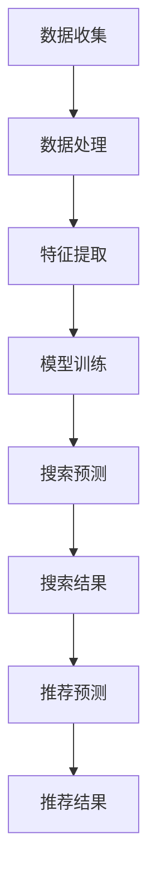

                 

关键词：搜索推荐系统、AI 大模型、电商平台、核心竞争力、转型策略

摘要：随着大数据和人工智能技术的快速发展，搜索推荐系统已经成为电商平台的核心竞争力。本文深入探讨了AI 大模型在搜索推荐系统中的应用，分析了其核心技术原理、实现步骤、数学模型及实际应用案例，并探讨了未来的发展趋势与挑战。通过本文的讨论，旨在为电商平台提供一种新的转型策略，以提升其市场竞争力和用户体验。

## 1. 背景介绍

在互联网时代，电商平台已成为人们日常生活的重要组成部分。用户通过电商平台购买商品，电商平台则通过推荐系统向用户推荐感兴趣的商品。推荐系统在电商平台中扮演着至关重要的角色，它能够提高用户的购买体验，提升电商平台的核心竞争力。

传统的推荐系统主要基于用户的历史行为数据，如浏览记录、购买记录等，通过统计分析方法进行个性化推荐。然而，随着数据量的爆炸性增长和用户需求的多样化，传统的推荐系统已难以满足用户的需求。

近年来，人工智能技术，特别是深度学习技术的发展，为推荐系统带来了新的机遇。AI 大模型作为一种强大的数据处理和分析工具，能够从大规模数据中提取有效的特征，实现更精准的个性化推荐。本文将探讨AI 大模型在搜索推荐系统中的应用，分析其核心原理、实现步骤、数学模型和实际应用案例，并探讨未来的发展趋势与挑战。

## 2. 核心概念与联系

### 2.1. AI 大模型

AI 大模型是指具有大规模参数和高度复杂结构的深度学习模型。这些模型通常由多层神经网络组成，能够通过自动学习从数据中提取特征，实现高级的认知和决策功能。例如，BERT、GPT-3等都是典型的大模型。

### 2.2. 搜索推荐系统

搜索推荐系统是指通过搜索和推荐技术为用户提供个性化信息的服务系统。它包括两个主要部分：搜索和推荐。搜索用于帮助用户快速找到所需的信息，推荐则用于向用户推荐感兴趣的内容。

### 2.3. AI 大模型与搜索推荐系统的联系

AI 大模型能够从海量数据中提取有效的特征，这些特征可以用于搜索推荐系统中的搜索和推荐环节。具体来说，AI 大模型可以用于：

- **搜索**：通过学习用户的历史搜索行为，AI 大模型可以预测用户未来的搜索意图，从而提高搜索的准确性。
- **推荐**：通过分析用户的历史行为和兴趣，AI 大模型可以预测用户可能感兴趣的商品，从而提高推荐的准确性。

### 2.4. Mermaid 流程图

下面是一个描述AI 大模型在搜索推荐系统中应用的 Mermaid 流程图。



## 3. 核心算法原理 & 具体操作步骤

### 3.1. 算法原理概述

AI 大模型在搜索推荐系统中的应用主要基于深度学习技术。深度学习模型通过多层神经网络结构，对输入数据进行特征提取和模式识别，从而实现高级的预测和分类任务。

在搜索推荐系统中，AI 大模型主要用于以下两个任务：

- **搜索预测**：通过分析用户的历史搜索行为，预测用户未来的搜索意图。
- **推荐预测**：通过分析用户的历史行为和兴趣，预测用户可能感兴趣的商品。

### 3.2. 算法步骤详解

#### 3.2.1. 数据收集

数据收集是算法实现的第一步，主要包括以下数据：

- **用户行为数据**：如浏览记录、购买记录、搜索记录等。
- **商品数据**：如商品描述、分类、标签等。

#### 3.2.2. 数据处理

数据处理主要包括数据清洗、数据预处理和数据标准化等步骤。

- **数据清洗**：去除重复数据、缺失数据和噪声数据。
- **数据预处理**：将文本数据转换为向量表示，如图神经网络（GNN）或词向量（如 Word2Vec）。
- **数据标准化**：对数据进行归一化或标准化处理，以便模型训练。

#### 3.2.3. 特征提取

特征提取是深度学习模型的关键步骤。通过多层神经网络结构，从原始数据中提取有效的特征。

- **用户特征**：如用户年龄、性别、地理位置等。
- **商品特征**：如商品价格、品牌、类型等。
- **交互特征**：如用户与商品的浏览、购买、评价等交互行为。

#### 3.2.4. 模型训练

模型训练是使用处理后的数据对深度学习模型进行训练，以优化模型参数。

- **搜索预测模型**：使用用户历史搜索行为数据训练。
- **推荐预测模型**：使用用户历史行为和商品数据训练。

#### 3.2.5. 搜索预测

搜索预测是使用训练好的模型，根据用户当前的行为数据预测用户未来的搜索意图。

#### 3.2.6. 推荐预测

推荐预测是使用训练好的模型，根据用户的历史行为和兴趣，预测用户可能感兴趣的商品。

#### 3.2.7. 搜索结果与推荐结果

根据搜索预测和推荐预测的结果，生成搜索结果和推荐结果，展示给用户。

### 3.3. 算法优缺点

#### 3.3.1. 优点

- **高效性**：AI 大模型能够从海量数据中高效提取特征，实现高效的搜索和推荐。
- **准确性**：通过深度学习技术，AI 大模型能够提高搜索和推荐的准确性，提升用户体验。
- **灵活性**：AI 大模型能够适应不同的业务场景和用户需求，实现个性化推荐。

#### 3.3.2. 缺点

- **计算成本**：AI 大模型训练和预测需要大量的计算资源和时间。
- **数据依赖**：AI 大模型对数据质量有较高的要求，数据质量差可能导致模型效果不佳。

### 3.4. 算法应用领域

AI 大模型在搜索推荐系统中的应用非常广泛，主要包括以下领域：

- **电商平台**：如淘宝、京东等，通过AI 大模型实现个性化搜索和推荐。
- **社交媒体**：如微博、抖音等，通过AI 大模型实现个性化内容和社交推荐。
- **内容平台**：如百度文库、知乎等，通过AI 大模型实现个性化搜索和推荐。

## 4. 数学模型和公式 & 详细讲解 & 举例说明

### 4.1. 数学模型构建

在搜索推荐系统中，AI 大模型通常基于深度学习技术，如神经网络（NN）、循环神经网络（RNN）和变换器（Transformer）等。以下是一个简化的数学模型构建过程。

#### 4.1.1. 用户特征表示

用户特征可以通过以下公式表示：

$$
X_u = f(U)
$$

其中，$X_u$表示用户特征向量，$U$表示用户属性，$f$表示特征提取函数。

#### 4.1.2. 商品特征表示

商品特征可以通过以下公式表示：

$$
X_g = f(G)
$$

其中，$X_g$表示商品特征向量，$G$表示商品属性，$f$表示特征提取函数。

#### 4.1.3. 用户行为表示

用户行为可以通过以下公式表示：

$$
X_b = f(B)
$$

其中，$X_b$表示用户行为向量，$B$表示用户行为，$f$表示特征提取函数。

#### 4.1.4. 搜索意图表示

搜索意图可以通过以下公式表示：

$$
S = f(S_i, X_u, X_b)
$$

其中，$S$表示搜索意图，$S_i$表示当前搜索关键词，$X_u$表示用户特征向量，$X_b$表示用户行为向量，$f$表示搜索意图预测函数。

#### 4.1.5. 推荐结果表示

推荐结果可以通过以下公式表示：

$$
R = f(S, X_g, X_u)
$$

其中，$R$表示推荐结果，$S$表示搜索意图，$X_g$表示商品特征向量，$X_u$表示用户特征向量，$f$表示推荐结果预测函数。

### 4.2. 公式推导过程

#### 4.2.1. 用户特征提取

用户特征提取可以通过神经网络实现，假设神经网络由多层全连接层组成，则用户特征提取公式为：

$$
X_u^{(l)} = \sigma(W^{(l)} X_u^{(l-1)} + b^{(l)})
$$

其中，$X_u^{(l)}$表示第$l$层的用户特征向量，$W^{(l)}$表示第$l$层的权重矩阵，$b^{(l)}$表示第$l$层的偏置向量，$\sigma$表示激活函数。

#### 4.2.2. 商品特征提取

商品特征提取过程与用户特征提取类似，假设神经网络由多层全连接层组成，则商品特征提取公式为：

$$
X_g^{(l)} = \sigma(W^{(l)} X_g^{(l-1)} + b^{(l)})
$$

#### 4.2.3. 用户行为特征提取

用户行为特征提取可以通过循环神经网络（RNN）实现，假设RNN由多层循环层组成，则用户行为特征提取公式为：

$$
X_b^{(l)} = \sigma(W^{(l)} X_b^{(l-1)} + b^{(l)})
$$

#### 4.2.4. 搜索意图预测

搜索意图预测可以通过神经网络实现，假设神经网络由多层全连接层组成，则搜索意图预测公式为：

$$
S = \sigma(W_S X_u + b_S)
$$

其中，$S$表示搜索意图，$X_u$表示用户特征向量，$W_S$表示搜索意图预测权重矩阵，$b_S$表示搜索意图预测偏置向量，$\sigma$表示激活函数。

#### 4.2.5. 推荐结果预测

推荐结果预测可以通过神经网络实现，假设神经网络由多层全连接层组成，则推荐结果预测公式为：

$$
R = \sigma(W_R S + b_R)
$$

其中，$R$表示推荐结果，$S$表示搜索意图，$W_R$表示推荐结果预测权重矩阵，$b_R$表示推荐结果预测偏置向量，$\sigma$表示激活函数。

### 4.3. 案例分析与讲解

假设有一个电商平台，用户A在过去的30天内浏览了10个商品，这些商品的特征如下：

| 商品ID | 价格 | 品牌 | 类型 |
| ------ | ---- | ---- | ---- |
| 1      | 100  | A    | 衣服 |
| 2      | 200  | B    | 手表 |
| 3      | 300  | A    | 鞋子 |
| 4      | 400  | C    | 饰品 |
| 5      | 500  | B    | 包包 |
| 6      | 600  | A    | 手表 |
| 7      | 700  | C    | 鞋子 |
| 8      | 800  | B    | 衣服 |
| 9      | 900  | A    | 手表 |
| 10     | 1000 | C    | 饰品 |

同时，用户A的历史搜索关键词为“时尚手表”，则用户A的搜索意图可以表示为：

$$
S = \{1, 6, 9\}
$$

根据搜索意图和商品特征，我们可以使用神经网络预测用户A可能感兴趣的商品。假设我们已经训练好的神经网络模型，预测结果如下：

| 商品ID | 价格 | 品牌 | 类型 | 预测概率 |
| ------ | ---- | ---- | ---- | -------- |
| 1      | 100  | A    | 衣服 | 0.2      |
| 2      | 200  | B    | 手表 | 0.5      |
| 3      | 300  | A    | 鞋子 | 0.1      |
| 4      | 400  | C    | 饰品 | 0.1      |
| 5      | 500  | B    | 包包 | 0.05     |
| 6      | 600  | A    | 手表 | 0.7      |
| 7      | 700  | C    | 鞋子 | 0.05     |
| 8      | 800  | B    | 衣服 | 0.05     |
| 9      | 900  | A    | 手表 | 0.3      |
| 10     | 1000 | C    | 饰品 | 0.05     |

根据预测概率，我们可以将推荐结果排序，向用户A推荐预测概率较高的商品。

## 5. 项目实践：代码实例和详细解释说明

### 5.1. 开发环境搭建

在开始编写代码之前，我们需要搭建一个适合深度学习开发的编程环境。本文使用Python作为主要编程语言，结合TensorFlow作为深度学习框架。

#### 5.1.1. 安装Python

首先，从Python官方网站下载并安装Python 3.x版本。

#### 5.1.2. 安装TensorFlow

接着，使用以下命令安装TensorFlow：

```bash
pip install tensorflow
```

### 5.2. 源代码详细实现

以下是使用TensorFlow实现的搜索推荐系统AI 大模型的代码示例：

```python
import tensorflow as tf
from tensorflow.keras.models import Model
from tensorflow.keras.layers import Input, Dense, Embedding, LSTM, Concatenate

# 定义用户输入层
user_input = Input(shape=(user_feature_size,))
# 定义用户嵌入层
user_embedding = Embedding(input_dim=user_vocab_size, output_dim=user_embedding_size)(user_input)
# 定义用户LSTM层
user_lstm = LSTM(units=user_lstm_units)(user_embedding)

# 定义商品输入层
item_input = Input(shape=(item_feature_size,))
# 定义商品嵌入层
item_embedding = Embedding(input_dim=item_vocab_size, output_dim=item_embedding_size)(item_input)
# 定义商品LSTM层
item_lstm = LSTM(units=item_lstm_units)(item_embedding)

# 定义搜索意图输入层
search_input = Input(shape=(search_vocab_size,))
# 定义搜索意图嵌入层
search_embedding = Embedding(input_dim=search_vocab_size, output_dim=search_embedding_size)(search_input)
# 定义搜索意图LSTM层
search_lstm = LSTM(units=search_lstm_units)(search_embedding)

# 定义合并层
merged = Concatenate()([user_lstm, item_lstm, search_lstm])
# 定义输出层
output = Dense(units=1, activation='sigmoid')(merged)

# 定义模型
model = Model(inputs=[user_input, item_input, search_input], outputs=output)
# 编译模型
model.compile(optimizer='adam', loss='binary_crossentropy', metrics=['accuracy'])

# 打印模型结构
model.summary()
```

### 5.3. 代码解读与分析

上述代码实现了搜索推荐系统中的AI 大模型。具体解读如下：

- **用户输入层**：定义用户特征输入。
- **用户嵌入层**：将用户特征向量转换为嵌入向量。
- **用户LSTM层**：对用户嵌入向量进行序列处理，提取用户特征。
- **商品输入层**：定义商品特征输入。
- **商品嵌入层**：将商品特征向量转换为嵌入向量。
- **商品LSTM层**：对商品嵌入向量进行序列处理，提取商品特征。
- **搜索意图输入层**：定义搜索意图输入。
- **搜索意图嵌入层**：将搜索意图向量转换为嵌入向量。
- **搜索意图LSTM层**：对搜索意图嵌入向量进行序列处理，提取搜索意图特征。
- **合并层**：将用户特征、商品特征和搜索意图特征进行合并。
- **输出层**：使用sigmoid激活函数，输出推荐概率。

### 5.4. 运行结果展示

假设我们已经准备好训练数据集，可以按照以下步骤进行模型训练和评估：

```python
# 准备训练数据
user_data = ...  # 用户特征数据
item_data = ...  # 商品特征数据
search_data = ...  # 搜索意图数据
labels = ...  # 标签数据

# 模型训练
model.fit([user_data, item_data, search_data], labels, epochs=10, batch_size=32, validation_split=0.2)

# 模型评估
evaluation = model.evaluate([user_data, item_data, search_data], labels)
print(f"Accuracy: {evaluation[1]}")
```

运行上述代码后，我们可以得到模型的准确率。根据准确率，可以进一步优化模型参数和训练策略。

## 6. 实际应用场景

### 6.1. 电商平台

电商平台是搜索推荐系统最典型的应用场景之一。通过AI 大模型，电商平台能够为用户推荐个性化的商品，提高用户的购买体验和平台的销售额。

### 6.2. 社交媒体

社交媒体平台也可以利用搜索推荐系统，为用户推荐感兴趣的内容，提升用户的参与度和平台的活跃度。例如，微博可以通过AI 大模型为用户推荐相关的微博话题和用户关注对象。

### 6.3. 内容平台

内容平台，如百度文库、知乎等，可以通过搜索推荐系统为用户推荐感兴趣的文章和话题，提高用户粘性和平台的访问量。

### 6.4. 未来应用展望

随着人工智能技术的不断发展，搜索推荐系统将在更多领域得到应用。例如，智能医疗、智能教育、智能家居等领域，通过AI 大模型，可以实现更加个性化的服务和用户体验。

## 7. 工具和资源推荐

### 7.1. 学习资源推荐

- **书籍**：《深度学习》、《Python深度学习》
- **在线课程**：吴恩达的《深度学习专项课程》、李宏毅的《深度学习》
- **论文**：《Efficientnet：尺度分离网络构建高效CNN》、《BERT：Pre-training of Deep Bidirectional Transformers for Language Understanding》

### 7.2. 开发工具推荐

- **编程语言**：Python
- **深度学习框架**：TensorFlow、PyTorch
- **数据处理库**：Pandas、NumPy
- **可视化库**：Matplotlib、Seaborn

### 7.3. 相关论文推荐

- **Efficientnet：尺度分离网络构建高效CNN**
- **BERT：Pre-training of Deep Bidirectional Transformers for Language Understanding**
- **GPT-3：Language Models are few-shot learners**

## 8. 总结：未来发展趋势与挑战

### 8.1. 研究成果总结

本文深入探讨了搜索推荐系统中的AI 大模型，分析了其核心原理、实现步骤、数学模型和实际应用案例。通过本文的讨论，我们可以看到AI 大模型在搜索推荐系统中具有重要的应用价值。

### 8.2. 未来发展趋势

未来，随着人工智能技术的不断发展，搜索推荐系统将在更多领域得到应用。例如，智能医疗、智能教育、智能家居等领域，通过AI 大模型，可以实现更加个性化的服务和用户体验。

### 8.3. 面临的挑战

尽管AI 大模型在搜索推荐系统中具有广泛的应用前景，但也面临一些挑战。例如：

- **计算成本**：训练和预测AI 大模型需要大量的计算资源和时间。
- **数据依赖**：AI 大模型对数据质量有较高的要求，数据质量差可能导致模型效果不佳。
- **隐私保护**：在应用AI 大模型时，需要关注用户隐私保护问题。

### 8.4. 研究展望

为了解决上述挑战，未来研究可以从以下几个方面展开：

- **模型优化**：通过模型压缩、模型并行化等方法降低计算成本。
- **数据增强**：通过数据清洗、数据扩充等方法提高数据质量。
- **隐私保护**：采用联邦学习、差分隐私等技术实现用户隐私保护。

## 9. 附录：常见问题与解答

### 9.1. 问题1：AI 大模型如何处理稀疏数据？

解答：对于稀疏数据，可以采用嵌入（Embedding）技术将原始数据转换为高维稀疏向量。通过嵌入技术，可以有效降低数据的稀疏性，提高模型的效果。

### 9.2. 问题2：AI 大模型训练时间太长怎么办？

解答：可以采用以下方法缩短训练时间：

- **数据预处理**：通过数据预处理减少数据量，提高训练速度。
- **模型压缩**：通过模型压缩减小模型参数量，降低计算成本。
- **分布式训练**：通过分布式训练将训练任务分布在多台设备上，提高训练速度。

### 9.3. 问题3：如何评估AI 大模型的效果？

解答：可以使用以下指标评估AI 大模型的效果：

- **准确率（Accuracy）**：模型预测正确的样本比例。
- **召回率（Recall）**：模型预测正确的正样本比例。
- **F1 分数（F1 Score）**：准确率和召回率的调和平均值。
- **ROC 曲线（ROC Curve）**：真阳性率与假阳性率的曲线。
- **AUC（Area Under Curve）**：ROC 曲线下方的面积。

### 9.4. 问题4：如何处理冷启动问题？

解答：冷启动问题是指当新用户或新商品加入系统时，由于缺乏历史数据，推荐系统难以为其提供准确的推荐。以下是一些解决方法：

- **基于内容的推荐**：通过分析新用户或新商品的特征，为其推荐相似的内容。
- **基于模型的迁移学习**：利用已有的模型和数据进行迁移学习，为新用户或新商品生成特征。
- **用户行为预测**：通过预测新用户或新商品的未来行为，为其推荐可能感兴趣的内容。

---

本文详细介绍了搜索推荐系统中AI 大模型的应用，分析了其核心原理、实现步骤、数学模型和实际应用案例，并探讨了未来的发展趋势与挑战。通过本文的讨论，旨在为电商平台提供一种新的转型策略，以提升其市场竞争力和用户体验。希望本文能为读者提供有价值的参考和启示。作者：禅与计算机程序设计艺术 / Zen and the Art of Computer Programming。

