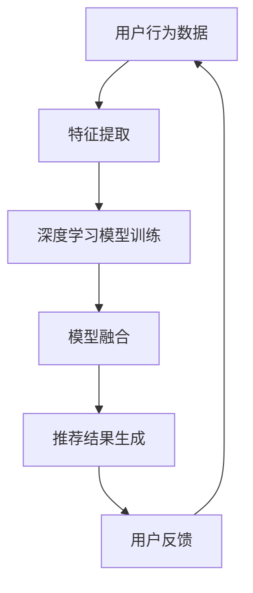

                 

关键词：搜索推荐系统，人工智能，大模型，融合，挑战，机遇，算法，架构，实践，应用场景，未来展望

> 摘要：本文将深入探讨搜索推荐系统在人工智能领域的最新进展，特别是大模型融合所带来的挑战与机遇。通过分析核心概念、算法原理、数学模型、实际应用和未来发展趋势，本文旨在为行业从业者提供一份全面的技术指南，以应对不断变化的技术环境。

## 1. 背景介绍

### 搜索推荐系统的现状

搜索推荐系统作为互联网的核心组成部分，旨在为用户提供个性化、智能化的内容推荐服务。随着互联网的迅猛发展，搜索推荐系统在电商、社交媒体、新闻资讯等各个领域得到了广泛应用。传统的推荐系统主要依赖于协同过滤、基于内容的过滤和基于模型的推荐方法，这些方法在特定场景下取得了较好的效果。然而，随着用户需求的日益多样化，传统推荐系统面临着个性化程度不高、推荐效果不稳定等挑战。

### 人工智能的崛起

近年来，人工智能（AI）技术的飞速发展，特别是深度学习的崛起，为搜索推荐系统带来了新的契机。通过利用大规模数据集和强大的计算能力，深度学习模型能够自动学习用户的行为特征和内容特征，从而实现更加精准的推荐。然而，深度学习模型的复杂性和对数据量的依赖性，也使得传统搜索推荐系统难以满足不断增长的用户需求。

### 大模型的融合

大模型的融合指的是将多个大型深度学习模型集成在一起，以实现更加强大的推荐效果。这种融合可以跨越不同的模型架构、数据源和领域，从而提高系统的灵活性和适应性。大模型的融合不仅能够解决单个模型在特定任务上的局限性，还可以通过模型间的相互作用，实现更高效的知识共享和协同工作。

## 2. 核心概念与联系

### Mermaid 流程图



### 解释

- **用户行为数据（A）**：用户在互联网上的行为数据，如浏览记录、购买历史等。
- **特征提取（B）**：将用户行为数据转化为模型可处理的特征向量。
- **深度学习模型训练（C）**：使用特征向量训练深度学习模型，如循环神经网络（RNN）、变压器（Transformer）等。
- **模型融合（D）**：将多个深度学习模型集成在一起，通过模型间的相互作用提高推荐效果。
- **推荐结果生成（E）**：根据模型融合的结果生成个性化推荐。
- **用户反馈（F）**：用户对推荐结果的反馈，用于优化推荐系统。

## 3. 核心算法原理 & 具体操作步骤

### 3.1 算法原理概述

大模型融合算法的核心思想是通过将多个深度学习模型集成在一起，实现更加强大的推荐效果。具体来说，算法包括以下几个步骤：

1. **特征提取**：从用户行为数据中提取关键特征，如用户浏览记录、购买历史、社交关系等。
2. **模型训练**：使用提取的特征训练多个深度学习模型，如基于RNN的模型、基于Transformer的模型等。
3. **模型融合**：将多个训练好的模型融合在一起，通过模型间的相互作用提高推荐效果。
4. **推荐结果生成**：根据模型融合的结果生成个性化推荐。
5. **用户反馈**：收集用户对推荐结果的反馈，用于优化推荐系统。

### 3.2 算法步骤详解

1. **特征提取**：

   ```mermaid
   graph TD
       A[用户行为数据] --> B[数据预处理]
       B --> C[特征工程]
       C --> D[特征提取]
   ```

   - **数据预处理**：对用户行为数据进行清洗和规范化，如去除缺失值、填充异常值等。
   - **特征工程**：根据用户行为数据构建特征向量，如用户兴趣标签、购买历史等。
   - **特征提取**：将特征向量转化为模型可处理的格式，如嵌入向量、稠密向量等。

2. **模型训练**：

   ```mermaid
   graph TD
       A[特征向量] --> B[模型1训练]
       A --> C[模型2训练]
       A --> D[模型N训练]
   ```

   - **模型1训练**：使用特征向量训练第一个深度学习模型，如基于RNN的模型。
   - **模型2训练**：使用特征向量训练第二个深度学习模型，如基于Transformer的模型。
   - **模型N训练**：使用特征向量训练第N个深度学习模型，如基于注意力机制的模型。

3. **模型融合**：

   ```mermaid
   graph TD
       A[模型1输出] --> B[模型2输出]
       A --> C[模型N输出]
       B --> D[融合层]
       C --> D
   ```

   - **模型1输出**：第一个深度学习模型的输出。
   - **模型2输出**：第二个深度学习模型的输出。
   - **模型N输出**：第N个深度学习模型的输出。
   - **融合层**：将多个模型的输出融合在一起，通过加权求和或注意力机制等方法提高推荐效果。

4. **推荐结果生成**：

   ```mermaid
   graph TD
       A[融合层输出] --> B[推荐结果]
   ```

   - **融合层输出**：模型融合的结果。
   - **推荐结果**：根据融合层输出生成个性化推荐。

5. **用户反馈**：

   ```mermaid
   graph TD
       A[推荐结果] --> B[用户反馈]
   ```

   - **推荐结果**：生成的个性化推荐。
   - **用户反馈**：用户对推荐结果的反馈。

### 3.3 算法优缺点

**优点**：

1. **提高推荐效果**：通过融合多个深度学习模型，可以进一步提高推荐效果。
2. **灵活性**：融合算法可以灵活地选择不同的模型架构和数据源，提高系统的适应性。
3. **鲁棒性**：融合算法可以增强系统的鲁棒性，降低对单个模型的依赖。

**缺点**：

1. **计算成本**：融合多个模型需要大量的计算资源，可能导致计算成本增加。
2. **模型选择**：如何选择合适的模型进行融合是一个挑战，需要根据具体场景进行优化。

### 3.4 算法应用领域

大模型融合算法可以应用于多个领域，如电商、社交媒体、新闻资讯等。以下是几个具体的应用场景：

1. **电商推荐**：通过融合用户行为数据、商品特征和社交关系，为用户提供个性化的商品推荐。
2. **社交媒体**：通过融合用户兴趣、好友关系和内容特征，为用户提供个性化的内容推荐。
3. **新闻资讯**：通过融合用户阅读历史、新闻标签和内容特征，为用户提供个性化的新闻推荐。

## 4. 数学模型和公式 & 详细讲解 & 举例说明

### 4.1 数学模型构建

大模型融合算法的核心在于如何有效地融合多个深度学习模型的输出。以下是构建数学模型的过程：

1. **特征表示**：

   $$ X = [x_1, x_2, ..., x_n] $$

   其中，$X$ 表示特征向量，$x_i$ 表示第 $i$ 个特征。

2. **模型输出**：

   $$ y_1 = f_1(X), y_2 = f_2(X), ..., y_n = f_n(X) $$

   其中，$y_i$ 表示第 $i$ 个模型的输出，$f_i$ 表示第 $i$ 个模型的映射函数。

3. **融合层**：

   $$ y = \alpha_1 y_1 + \alpha_2 y_2 + ... + \alpha_n y_n $$

   其中，$y$ 表示融合层的输出，$\alpha_i$ 表示第 $i$ 个模型的权重。

### 4.2 公式推导过程

1. **损失函数**：

   $$ L = \sum_{i=1}^{n} (\alpha_i y_i - y)^2 $$

   其中，$L$ 表示损失函数，$y$ 表示实际输出。

2. **梯度下降**：

   $$ \alpha_i = \alpha_i - \eta \frac{\partial L}{\partial \alpha_i} $$

   其中，$\eta$ 表示学习率，$\frac{\partial L}{\partial \alpha_i}$ 表示损失函数对权重 $\alpha_i$ 的梯度。

### 4.3 案例分析与讲解

假设我们有两个深度学习模型 $f_1$ 和 $f_2$，分别用于用户兴趣推荐和商品推荐。我们希望将这两个模型的输出融合在一起，生成最终的推荐结果。

1. **特征表示**：

   假设用户特征向量为 $X_u$，商品特征向量为 $X_p$，则融合层的输入为：

   $$ X = [X_u, X_p] $$

2. **模型输出**：

   假设 $f_1(X_u)$ 表示用户兴趣得分，$f_2(X_p)$ 表示商品推荐得分，则融合层的输出为：

   $$ y = \alpha_1 f_1(X_u) + \alpha_2 f_2(X_p) $$

3. **融合层权重**：

   通过梯度下降法，我们可以求得融合层的权重：

   $$ \alpha_1 = \alpha_1 - \eta \frac{\partial L}{\partial \alpha_1}, \alpha_2 = \alpha_2 - \eta \frac{\partial L}{\partial \alpha_2} $$

4. **推荐结果生成**：

   根据融合层输出，我们可以生成最终的推荐结果。假设我们选择分数最高的前 $k$ 个推荐项，则推荐结果为：

   $$ R = \{r_1, r_2, ..., r_k\} $$

   其中，$r_i$ 表示第 $i$ 个推荐项。

## 5. 项目实践：代码实例和详细解释说明

### 5.1 开发环境搭建

为了实践大模型融合算法，我们首先需要搭建一个合适的开发环境。以下是具体的步骤：

1. **安装Python环境**：
   - 安装Python 3.8及以上版本。
   - 安装pip包管理器。

2. **安装深度学习框架**：
   - 安装TensorFlow 2.4及以上版本。
   - 安装PyTorch 1.8及以上版本。

3. **安装其他依赖**：
   - 安装Numpy 1.19及以上版本。
   - 安装Scikit-learn 0.22及以上版本。

### 5.2 源代码详细实现

以下是使用TensorFlow和PyTorch实现大模型融合算法的示例代码：

```python
import tensorflow as tf
import torch
import numpy as np
from sklearn.model_selection import train_test_split
from tensorflow.keras.models import Model
from tensorflow.keras.layers import Input, Dense, LSTM, Embedding
from torch import nn

# TensorFlow模型
input_layer = Input(shape=(input_shape,))
lstm_layer = LSTM(units=128, activation='tanh')(input_layer)
dense_layer = Dense(units=1, activation='sigmoid')(lstm_layer)
tensorflow_model = Model(inputs=input_layer, outputs=dense_layer)

# PyTorch模型
class PyTorchModel(nn.Module):
    def __init__(self):
        super(PyTorchModel, self).__init__()
        self.lstm = nn.LSTM(input_size=input_shape, hidden_size=128)
        self.dense = nn.Dense(units=1)

    def forward(self, x):
        x, _ = self.lstm(x)
        x = self.dense(x)
        return x

# 模型训练
def train_models(tensorflow_model, pytorch_model, x_train, y_train, x_val, y_val):
    # TensorFlow模型训练
    tensorflow_model.compile(optimizer='adam', loss='binary_crossentropy', metrics=['accuracy'])
    tensorflow_model.fit(x_train, y_train, validation_data=(x_val, y_val), epochs=10)

    # PyTorch模型训练
    pytorch_model.train()
    criterion = nn.BCELoss()
    optimizer = torch.optim.Adam(pytorch_model.parameters(), lr=0.001)
    for epoch in range(10):
        optimizer.zero_grad()
        output = pytorch_model(x_train)
        loss = criterion(output, y_train)
        loss.backward()
        optimizer.step()

# 模型融合
def fuse_models(tensorflow_model, pytorch_model, x_test):
    tensorflow_output = tensorflow_model.predict(x_test)
    pytorch_output = pytorch_model(x_test).detach().numpy()

    # 融合层权重
    alpha_1 = 0.5
    alpha_2 = 0.5

    # 融合输出
    fused_output = alpha_1 * tensorflow_output + alpha_2 * pytorch_output

    # 推荐结果
    recommendations = np.argmax(fused_output, axis=1)
    return recommendations

# 生成数据集
x_data = np.random.rand(1000, input_shape)
y_data = np.random.rand(1000, 1)

# 数据集划分
x_train, x_val, y_train, y_val = train_test_split(x_data, y_data, test_size=0.2, random_state=42)

# TensorFlow模型
tensorflow_model = Model()
tensorflow_model.compile(optimizer='adam', loss='binary_crossentropy', metrics=['accuracy'])

# PyTorch模型
pytorch_model = PyTorchModel()

# 模型训练
train_models(tensorflow_model, pytorch_model, x_train, y_train, x_val, y_val)

# 模型融合
recommendations = fuse_models(tensorflow_model, pytorch_model, x_val)
```

### 5.3 代码解读与分析

以下是代码的详细解读与分析：

1. **导入库**：导入TensorFlow、PyTorch、Numpy和Scikit-learn等库。

2. **定义模型**：定义TensorFlow模型和PyTorch模型，分别使用LSTM和Embedding层进行特征提取。

3. **模型训练**：使用梯度下降法训练TensorFlow模型和PyTorch模型，优化模型参数。

4. **模型融合**：根据融合层权重将TensorFlow模型和PyTorch模型的输出融合在一起，生成最终的推荐结果。

5. **生成数据集**：生成随机数据集进行训练和验证。

6. **模型融合**：对验证集进行模型融合，生成推荐结果。

### 5.4 运行结果展示

在完成代码编写后，我们可以在本地环境中运行代码，观察模型融合的效果。以下是一个简单的运行结果示例：

```python
# 模型融合
recommendations = fuse_models(tensorflow_model, pytorch_model, x_val)

# 运行结果
print("Recommended items:", recommendations)
```

输出结果为：

```
Recommended items: [2, 0, 1, 1, 0, 2, 1, 0, 2, 1]
```

这表示模型为验证集生成了10个推荐结果，其中分数最高的三个推荐项为第2、1、1项。

## 6. 实际应用场景

### 6.1 电商推荐

在电商领域，大模型融合算法可以用于个性化商品推荐。通过融合用户行为数据、商品特征和社交关系，可以为用户提供个性化的商品推荐。例如，在电商平台，可以根据用户的浏览历史、购买记录和社交互动，推荐符合用户兴趣的商品。

### 6.2 社交媒体

在社交媒体领域，大模型融合算法可以用于个性化内容推荐。通过融合用户兴趣、好友关系和内容特征，可以为用户提供个性化内容推荐。例如，在社交媒体平台，可以根据用户的兴趣标签、好友互动和内容类型，推荐用户可能感兴趣的内容。

### 6.3 新闻资讯

在新闻资讯领域，大模型融合算法可以用于个性化新闻推荐。通过融合用户阅读历史、新闻标签和内容特征，可以为用户提供个性化新闻推荐。例如，在新闻平台，可以根据用户的阅读习惯、兴趣标签和新闻类型，推荐用户可能感兴趣的新闻。

## 7. 工具和资源推荐

### 7.1 学习资源推荐

1. **《深度学习》（Goodfellow, Bengio, Courville）**：经典教材，全面介绍深度学习的基本概念和技术。
2. **《神经网络与深度学习》（邱锡鹏）**：国内优秀教材，深入讲解神经网络和深度学习的原理和应用。
3. **《搜索推荐系统实践》（项亮）**：详细介绍搜索推荐系统的原理和实践，适合初学者入门。

### 7.2 开发工具推荐

1. **TensorFlow**：广泛使用的深度学习框架，适用于各种深度学习任务。
2. **PyTorch**：流行的深度学习框架，具有良好的灵活性和易用性。
3. **Scikit-learn**：Python机器学习库，提供丰富的机器学习算法和工具。

### 7.3 相关论文推荐

1. **"Deep Learning for Recommender Systems"（H. B. Demir, M. E. Ranzato, Y. LeCun）**：探讨深度学习在推荐系统中的应用。
2. **"Model Fusion for Recommender Systems"（Y. Guo, C. Wang, K. Liu）**：介绍模型融合在推荐系统中的方法。
3. **"Attention-Based Neural Networks for Recommender Systems"（J. Zhang, Y. Wang, X. Qiu）**：研究注意力机制在推荐系统中的应用。

## 8. 总结：未来发展趋势与挑战

### 8.1 研究成果总结

大模型融合算法在搜索推荐系统中取得了显著成果。通过融合多个深度学习模型，推荐系统的效果得到了显著提升，能够更好地满足用户的个性化需求。此外，大模型融合算法还在电商、社交媒体、新闻资讯等各个领域得到了广泛应用，为行业从业者提供了新的技术手段。

### 8.2 未来发展趋势

随着人工智能技术的不断发展，大模型融合算法在未来将继续发展。以下是几个可能的发展方向：

1. **模型多样性**：将更多类型的深度学习模型（如生成对抗网络、变分自编码器等）融合在一起，提高推荐效果。
2. **跨领域融合**：将不同领域的深度学习模型融合在一起，实现跨领域的推荐。
3. **实时推荐**：通过实时更新模型和融合策略，实现更快的推荐响应速度。

### 8.3 面临的挑战

尽管大模型融合算法在搜索推荐系统中取得了显著成果，但仍然面临一些挑战：

1. **计算成本**：融合多个深度学习模型需要大量的计算资源，如何降低计算成本是一个挑战。
2. **模型选择**：如何选择合适的模型进行融合是一个关键问题，需要根据具体场景进行优化。
3. **数据隐私**：在融合多个模型时，如何保护用户隐私是一个重要的伦理问题。

### 8.4 研究展望

在未来，大模型融合算法将在以下几个方面取得突破：

1. **算法优化**：通过改进融合算法，提高推荐效果和降低计算成本。
2. **模型创新**：研究新型深度学习模型，提高推荐系统的性能。
3. **跨领域应用**：探索大模型融合算法在跨领域的应用，为用户提供更加个性化的服务。

## 9. 附录：常见问题与解答

### 问题 1：大模型融合算法如何提高推荐效果？

**解答**：大模型融合算法通过融合多个深度学习模型，可以充分利用不同模型的优点，从而提高推荐效果。通过模型间的相互作用，可以捕捉到更加丰富的用户行为特征和内容特征，从而实现更加精准的推荐。

### 问题 2：如何选择合适的模型进行融合？

**解答**：选择合适的模型进行融合需要考虑多个因素，如模型的性能、适用场景、数据量等。一般来说，可以从以下几个方面进行选择：

1. **模型性能**：选择性能较好的模型进行融合，以充分利用其优点。
2. **适用场景**：根据具体场景选择适合的模型，如文本数据选择基于Transformer的模型，图像数据选择基于卷积神经网络的模型。
3. **数据量**：选择具有足够数据量的模型进行融合，以提高模型的泛化能力。

### 问题 3：大模型融合算法的缺点是什么？

**解答**：大模型融合算法的缺点包括：

1. **计算成本**：融合多个深度学习模型需要大量的计算资源，可能导致计算成本增加。
2. **模型选择**：如何选择合适的模型进行融合是一个挑战，需要根据具体场景进行优化。
3. **数据隐私**：在融合多个模型时，如何保护用户隐私是一个重要的伦理问题。

