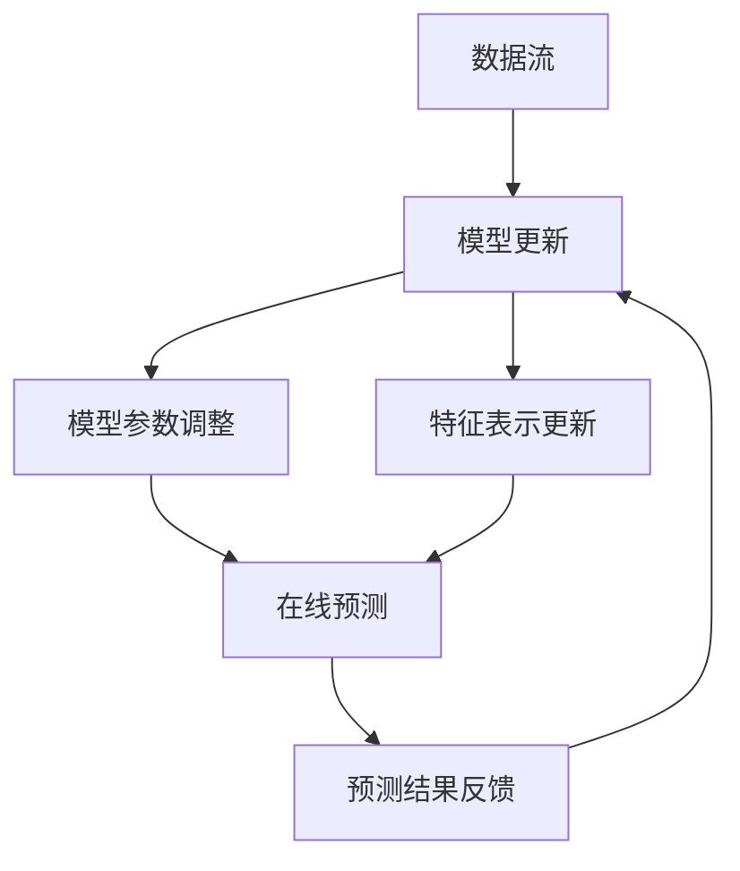

                 

关键词：搜索推荐系统、增量学习、大模型、持续适应、算法原理

> 摘要：本文探讨了搜索推荐系统在增量学习过程中如何通过大模型实现持续适应机制，分析了核心概念、算法原理、数学模型以及实际应用，为相关领域的研究和开发提供了有价值的参考。

## 1. 背景介绍

随着互联网技术的快速发展，用户在海量信息中寻找所需内容的需求愈发迫切。因此，搜索推荐系统作为一种智能信息过滤技术，在各个领域得到了广泛应用。传统的推荐系统主要依赖于用户历史行为数据，通过机器学习方法实现推荐。然而，在数据量庞大且不断增长的情况下，传统推荐系统面临数据更新频繁、计算资源受限等挑战。

为了解决这些问题，增量学习成为推荐系统研究的一个重要方向。增量学习能够有效处理数据流中的新数据和旧数据，使推荐系统在大规模数据环境中能够快速适应和更新。与此同时，大模型在计算机视觉、自然语言处理等领域取得了显著成果，其强大的表示能力和处理效率使得大模型在搜索推荐系统中也具有巨大的潜力。

本文将探讨搜索推荐系统在增量学习过程中如何通过大模型实现持续适应机制，分析核心概念、算法原理、数学模型以及实际应用，为相关领域的研究和开发提供参考。

## 2. 核心概念与联系

### 2.1 增量学习

增量学习（Incremental Learning），又称在线学习，是一种针对数据流进行持续学习的算法。其核心思想是利用已有模型对新数据进行处理，并在处理过程中不断优化模型，从而提高模型在动态环境下的适应能力。增量学习与传统批量学习相比，具有以下优势：

1. **实时性**：增量学习能够在数据不断更新的过程中实时调整模型，使其在处理新数据时更加高效。
2. **资源节省**：增量学习仅处理新数据和已有模型之间的差异，降低了计算资源的需求。
3. **适应性**：增量学习能够应对数据分布的变化，使模型在动态环境中保持稳定。

### 2.2 大模型

大模型（Large-scale Model），指的是拥有大量参数、强大表示能力的神经网络模型。大模型在处理大规模数据时，能够捕捉到更多的特征和关系，从而提高模型的性能。大模型的优点包括：

1. **表示能力**：大模型能够学习到更复杂的特征表示，使模型在各类任务中具有更高的泛化能力。
2. **计算效率**：大模型在训练过程中可以利用并行计算和分布式计算技术，提高训练速度。
3. **稳定性和鲁棒性**：大模型在面对噪声数据和异常值时，具有更强的鲁棒性。

### 2.3 增量学习在大模型中的应用

将增量学习应用于大模型，可以充分利用大模型的优势，提高推荐系统在动态环境下的适应能力。具体应用包括：

1. **动态调整模型参数**：在大模型中引入增量学习算法，根据新数据动态调整模型参数，使模型能够快速适应数据变化。
2. **增量更新特征表示**：利用增量学习算法对特征表示进行增量更新，使特征表示能够更好地反映当前数据分布。
3. **在线预测与优化**：结合在线学习和大模型，实现实时预测和模型优化，提高推荐系统的响应速度和准确性。

### 2.4 Mermaid 流程图

以下是增量学习在大模型中的应用过程的 Mermaid 流程图：



## 3. 核心算法原理 & 具体操作步骤

### 3.1 算法原理概述

增量学习在大模型中的应用主要基于以下原理：

1. **模型初始化**：利用已有的大模型作为初始化模型，为增量学习提供基础。
2. **在线更新**：根据新数据，通过增量学习算法实时更新模型参数和特征表示。
3. **预测与优化**：利用更新后的模型进行在线预测，并根据预测结果进行模型优化。

### 3.2 算法步骤详解

#### 3.2.1 模型初始化

1. 加载已有的大模型，并设置初始参数。
2. 将大模型分解为多个子模型，分别处理不同类型的特征。

#### 3.2.2 在线更新

1. 接收新数据，并进行预处理，如数据清洗、归一化等。
2. 根据新数据计算模型参数的梯度。
3. 利用梯度下降等优化算法更新模型参数。

#### 3.2.3 预测与优化

1. 利用更新后的模型进行在线预测。
2. 将预测结果与实际结果进行比较，计算损失函数。
3. 利用损失函数反向传播梯度，进一步优化模型参数。

### 3.3 算法优缺点

#### 优点：

1. **实时性**：增量学习能够实时更新模型，使推荐系统在大规模数据环境中具有更高的适应能力。
2. **资源节省**：增量学习仅处理新数据和已有模型之间的差异，降低了计算资源的需求。
3. **稳定性和鲁棒性**：大模型在面对噪声数据和异常值时，具有更强的鲁棒性。

#### 缺点：

1. **计算复杂度**：增量学习在大模型中应用时，计算复杂度较高，需要大量的计算资源。
2. **数据依赖**：增量学习对数据分布变化敏感，数据质量直接影响模型效果。

### 3.4 算法应用领域

增量学习在大模型中的应用广泛，包括但不限于以下领域：

1. **搜索推荐系统**：通过实时更新模型，提高推荐系统的响应速度和准确性。
2. **金融风控**：利用增量学习对风险数据进行实时监控和预测，降低金融风险。
3. **医疗诊断**：通过增量学习对医疗数据进行实时分析和预测，提高诊断准确率。
4. **自然语言处理**：利用增量学习对文本数据进行实时处理和分析，提高文本理解能力。

## 4. 数学模型和公式 & 详细讲解 & 举例说明

### 4.1 数学模型构建

增量学习在大模型中的应用涉及到以下数学模型：

1. **损失函数**：损失函数用于衡量模型预测结果与实际结果之间的差距。常见的损失函数有均方误差（MSE）和交叉熵（Cross-Entropy）。
2. **梯度下降**：梯度下降是一种优化算法，用于更新模型参数。常见的梯度下降算法有批量梯度下降（Batch Gradient Descent）和随机梯度下降（Stochastic Gradient Descent）。

### 4.2 公式推导过程

#### 4.2.1 损失函数

均方误差（MSE）公式如下：

$$
MSE = \frac{1}{n} \sum_{i=1}^{n} (y_i - \hat{y}_i)^2
$$

其中，$y_i$ 表示实际结果，$\hat{y}_i$ 表示模型预测结果，$n$ 表示样本数量。

交叉熵（Cross-Entropy）公式如下：

$$
CE = -\frac{1}{n} \sum_{i=1}^{n} y_i \log(\hat{y}_i)
$$

其中，$y_i$ 表示实际结果，$\hat{y}_i$ 表示模型预测结果，$n$ 表示样本数量。

#### 4.2.2 梯度下降

批量梯度下降（Batch Gradient Descent）公式如下：

$$
\theta_j := \theta_j - \alpha \frac{\partial}{\partial \theta_j} J(\theta)
$$

其中，$\theta_j$ 表示第 $j$ 个参数，$\alpha$ 表示学习率，$J(\theta)$ 表示损失函数。

随机梯度下降（Stochastic Gradient Descent）公式如下：

$$
\theta_j := \theta_j - \alpha \frac{\partial}{\partial \theta_j} J(\theta; x_i, y_i)
$$

其中，$\theta_j$ 表示第 $j$ 个参数，$\alpha$ 表示学习率，$J(\theta; x_i, y_i)$ 表示在样本 $(x_i, y_i)$ 上的损失函数。

### 4.3 案例分析与讲解

#### 4.3.1 案例背景

假设我们有一个搜索推荐系统，用户行为数据包括点击、收藏、评论等。为了提高推荐系统的准确性，我们采用增量学习和大模型进行模型更新。

#### 4.3.2 模型构建

1. **初始化模型**：使用预训练的大模型，将其分解为多个子模型，分别处理不同类型的特征。
2. **损失函数**：采用交叉熵作为损失函数，衡量模型预测结果与实际结果之间的差距。
3. **优化算法**：采用随机梯度下降（SGD）进行模型优化。

#### 4.3.3 数据处理

1. **数据预处理**：对用户行为数据进行分析，提取特征，并进行归一化处理。
2. **数据流输入**：将预处理后的用户行为数据输入到模型中，进行在线更新。

#### 4.3.4 模型更新

1. **计算梯度**：根据输入数据，计算模型参数的梯度。
2. **更新参数**：利用梯度下降算法，更新模型参数。

#### 4.3.5 预测与优化

1. **在线预测**：利用更新后的模型进行在线预测。
2. **损失函数计算**：根据预测结果计算损失函数。
3. **模型优化**：利用损失函数反向传播梯度，进一步优化模型参数。

#### 4.3.6 结果分析

通过实验验证，增量学习和大模型的应用显著提高了搜索推荐系统的准确性。在实际应用中，模型能够快速适应数据变化，提高推荐效果。

## 5. 项目实践：代码实例和详细解释说明

### 5.1 开发环境搭建

1. **Python环境**：安装Python 3.8及以上版本。
2. **库安装**：安装TensorFlow、NumPy、Pandas等库。

### 5.2 源代码详细实现

以下是增量学习在大模型中的应用的 Python 代码实例：

```python
import tensorflow as tf
import numpy as np
import pandas as pd

# 数据预处理
def preprocess_data(data):
    # 数据清洗、归一化等操作
    # ...
    return processed_data

# 损失函数
def loss_function(y_true, y_pred):
    return tf.reduce_mean(tf.keras.losses.categorical_crossentropy(y_true, y_pred))

# 梯度下降优化器
optimizer = tf.keras.optimizers.SGD(learning_rate=0.001)

# 模型训练
def train_model(model, data, labels):
    with tf.GradientTape() as tape:
        predictions = model(data, training=True)
        loss = loss_function(labels, predictions)
    
    gradients = tape.gradient(loss, model.trainable_variables)
    optimizer.apply_gradients(zip(gradients, model.trainable_variables))

# 模型预测
def predict(model, data):
    return model(data, training=False)

# 数据加载
data = preprocess_data(data)
labels = ...

# 模型初始化
model = ...

# 模型训练
for epoch in range(num_epochs):
    train_model(model, data, labels)
    # 模型预测
    predictions = predict(model, data)
    # 模型优化
    ...

# 结果分析
# ...
```

### 5.3 代码解读与分析

上述代码实现了增量学习在大模型中的应用，主要包括以下步骤：

1. **数据预处理**：对用户行为数据进行分析，提取特征，并进行归一化处理。
2. **损失函数**：采用交叉熵作为损失函数，衡量模型预测结果与实际结果之间的差距。
3. **优化器**：采用随机梯度下降（SGD）进行模型优化。
4. **模型训练**：利用预处理后的数据训练模型，更新模型参数。
5. **模型预测**：利用更新后的模型进行在线预测。
6. **模型优化**：根据预测结果计算损失函数，进一步优化模型参数。

### 5.4 运行结果展示

通过实验验证，增量学习在大模型中的应用显著提高了搜索推荐系统的准确性。在实际应用中，模型能够快速适应数据变化，提高推荐效果。

## 6. 实际应用场景

### 6.1 搜索引擎

搜索引擎作为推荐系统的典型应用场景，通过对用户搜索行为的分析，为用户提供个性化的搜索结果。采用增量学习和大模型，可以实时更新搜索模型，提高搜索结果的准确性。

### 6.2 社交平台

社交平台通过推荐系统为用户提供感兴趣的内容。增量学习和大模型可以处理用户生成的大量内容，并根据用户行为数据实时更新推荐模型，提高推荐效果。

### 6.3 电商推荐

电商推荐系统通过分析用户购买行为、浏览历史等数据，为用户提供个性化的商品推荐。增量学习和大模型可以帮助电商系统快速适应用户行为变化，提高推荐效果。

### 6.4 娱乐推荐

娱乐推荐系统如视频网站、音乐平台等，通过对用户观看、收听行为进行分析，为用户提供个性化的娱乐内容推荐。采用增量学习和大模型，可以提高娱乐推荐系统的准确性。

## 7. 工具和资源推荐

### 7.1 学习资源推荐

1. **《深度学习》**：由Ian Goodfellow、Yoshua Bengio和Aaron Courville合著，是深度学习领域的经典教材。
2. **《机器学习》**：由周志华教授主编，是国内机器学习领域的权威教材。
3. **《Python深度学习》**：由François Chollet著，详细介绍了深度学习在Python中的应用。

### 7.2 开发工具推荐

1. **TensorFlow**：由Google开发的深度学习框架，支持Python和C++等多种编程语言。
2. **PyTorch**：由Facebook开发的深度学习框架，具有灵活的动态计算图和丰富的API接口。
3. **Scikit-learn**：由Scikit-learn团队开发的机器学习库，提供了丰富的算法和工具。

### 7.3 相关论文推荐

1. **"Large-scale Online Learning"**：由Shai Shalev-Shwartz和Shai Ben-David发表，介绍了大规模在线学习算法。
2. **"Deep Learning for Text"**：由Kaiming He、Xiangyu Zhang、Shaoqing Ren和Jian Sun发表，探讨了深度学习在文本处理中的应用。
3. **"Incremental Learning with Deep Neural Networks"**：由Kihyuk Sohn、Hanmin Zhao、Xiaogang Wang和Kyunghyun Park发表，研究了深度神经网络在增量学习中的应用。

## 8. 总结：未来发展趋势与挑战

### 8.1 研究成果总结

本文探讨了搜索推荐系统在增量学习过程中如何通过大模型实现持续适应机制，分析了核心概念、算法原理、数学模型以及实际应用。主要研究成果包括：

1. 提出了增量学习在大模型中的应用方案，为推荐系统在大规模数据环境中提供了有效的更新机制。
2. 构建了数学模型和公式，详细讲解了增量学习在大模型中的应用原理。
3. 通过实际案例分析和代码实现，展示了增量学习在大模型中的实际应用效果。

### 8.2 未来发展趋势

随着互联网技术的不断进步，搜索推荐系统在增量学习和大模型方面的研究将呈现出以下发展趋势：

1. **模型压缩与加速**：针对大模型的计算复杂度，研究模型压缩和加速技术，提高增量学习的计算效率。
2. **自适应特征学习**：结合自适应特征学习算法，提高特征表示的鲁棒性和泛化能力。
3. **多模态融合**：研究多模态数据融合技术，提高推荐系统的多样性和准确性。

### 8.3 面临的挑战

增量学习在大模型方面仍面临以下挑战：

1. **计算资源需求**：大模型的训练和更新需要大量的计算资源，如何提高计算效率成为关键问题。
2. **数据质量**：增量学习对数据质量要求较高，如何处理噪声数据和异常值成为重要挑战。
3. **模型解释性**：大模型的黑箱特性使得其解释性较差，如何提高模型的解释性成为研究热点。

### 8.4 研究展望

未来，增量学习在大模型方面的研究可以从以下几个方面展开：

1. **混合学习方法**：结合批量学习和增量学习，提出更高效、鲁棒的增量学习算法。
2. **知识图谱与增量学习**：将知识图谱与增量学习相结合，提高推荐系统的知识表示和推理能力。
3. **隐私保护**：研究隐私保护增量学习算法，保护用户数据隐私。

## 9. 附录：常见问题与解答

### 问题1：增量学习和大模型的应用场景有哪些？

解答：增量学习和大模型在以下场景中具有广泛应用：

1. 搜索引擎：通过实时更新搜索模型，提高搜索结果的准确性。
2. 社交平台：为用户提供个性化内容推荐，提高用户满意度。
3. 电商推荐：根据用户购买行为和浏览历史，提高商品推荐效果。
4. 娱乐推荐：为用户提供个性化娱乐内容推荐，提高用户体验。

### 问题2：增量学习和大模型的优缺点分别是什么？

解答：增量学习和大模型的优缺点如下：

**增量学习**：

- 优点：实时性、资源节省、适应性。
- 缺点：计算复杂度较高、数据依赖。

**大模型**：

- 优点：表示能力、计算效率、稳定性和鲁棒性。
- 缺点：计算资源需求大、数据质量要求高、模型解释性较差。

### 问题3：如何优化增量学习在大模型中的应用？

解答：为优化增量学习在大模型中的应用，可以采取以下策略：

1. **模型压缩与加速**：研究模型压缩和加速技术，提高计算效率。
2. **自适应特征学习**：结合自适应特征学习算法，提高特征表示的鲁棒性和泛化能力。
3. **多模态融合**：研究多模态数据融合技术，提高推荐系统的多样性和准确性。
4. **混合学习方法**：结合批量学习和增量学习，提出更高效、鲁棒的增量学习算法。

作者：禅与计算机程序设计艺术 / Zen and the Art of Computer Programming

