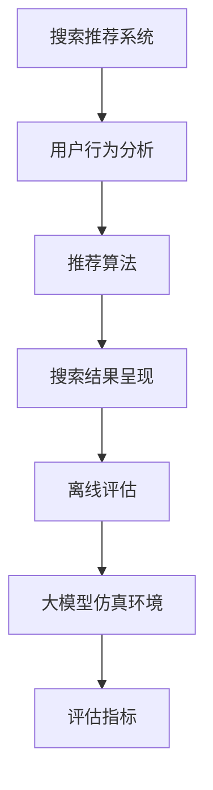

                 

关键词：搜索推荐系统、离线评估、大模型、仿真环境、性能优化、资源管理、评估指标

## 摘要

本文主要探讨搜索推荐系统的离线评估问题，重点介绍了大模型仿真环境构建的方法和步骤。通过分析现有评估方法中的不足，本文提出了一种基于仿真环境的新型评估框架，以提高评估的准确性和实用性。文章结构如下：首先介绍搜索推荐系统的背景和重要性；然后讨论离线评估的常见方法和挑战；接着详细描述大模型仿真环境的设计与实现；随后阐述评估指标的计算方法和性能优化策略；最后对未来应用前景进行展望。

## 1. 背景介绍

搜索推荐系统是现代互联网应用中不可或缺的部分，它通过对用户历史行为和内容的分析，为用户提供个性化的搜索结果和推荐内容。随着大数据和人工智能技术的不断发展，搜索推荐系统变得更加智能和精准。然而，如何对搜索推荐系统进行有效的评估，成为了研究人员和工程师们面临的重要问题。

离线评估是搜索推荐系统评估的一个重要环节。离线评估通过模拟用户行为数据，对系统的性能进行评估和优化。这种方法可以避免在线评估中的实时性和复杂性问题，从而更准确地反映系统的实际表现。然而，传统的离线评估方法在应对大规模数据和复杂模型时存在一定的局限性。

大模型的仿真环境构建是离线评估的关键步骤。通过构建仿真环境，可以模拟真实的用户行为和系统运行场景，从而更真实地评估系统的性能。然而，大模型仿真环境构建面临着资源管理、性能优化和评估指标设计等挑战。

## 2. 核心概念与联系

### 2.1 搜索推荐系统

搜索推荐系统通常由三个核心组件组成：用户行为分析模块、推荐算法模块和搜索结果呈现模块。用户行为分析模块负责收集和分析用户的历史行为数据，包括搜索历史、点击历史、浏览历史等。推荐算法模块根据用户行为数据生成个性化推荐列表，常用的算法有基于内容的推荐、协同过滤推荐和混合推荐等。搜索结果呈现模块负责将推荐结果以适当的形式展示给用户。

### 2.2 离线评估

离线评估是通过模拟用户行为数据，对系统进行性能评估和优化的一种方法。离线评估的优点在于可以避免在线评估中的实时性和复杂性问题，从而更准确地反映系统的实际表现。常见的离线评估方法包括用户模拟评估、日志分析评估和实验评估等。

### 2.3 大模型仿真环境

大模型仿真环境是指用于模拟搜索推荐系统中大规模数据和复杂模型的运行环境。仿真环境需要考虑资源的合理分配和性能的优化，以确保系统能够在高负载下稳定运行。仿真环境通常包括数据预处理模块、模型训练模块、模型评估模块和用户行为模拟模块等。

### 2.4 评估指标

评估指标是衡量搜索推荐系统性能的重要工具。常见的评估指标包括准确率、召回率、F1值、平均点击率等。这些指标可以用来评估推荐系统的推荐质量、用户满意度等。在实际应用中，需要根据具体需求和场景选择合适的评估指标。

### 2.5 Mermaid 流程图



## 3. 核心算法原理 & 具体操作步骤

### 3.1 算法原理概述

离线评估的核心算法通常是基于用户行为模拟和数据驱动的评估方法。用户行为模拟是通过模拟用户在不同场景下的行为，生成用户行为数据。数据驱动评估则是通过分析用户行为数据，评估推荐系统的性能。大模型仿真环境构建则是通过模拟大规模数据和复杂模型，提供更真实的评估场景。

### 3.2 算法步骤详解

#### 3.2.1 用户行为模拟

用户行为模拟是离线评估的第一步。通过模拟用户在不同场景下的行为，生成用户行为数据。用户行为模拟可以基于历史数据或者随机生成。在实际应用中，通常采用基于历史数据的用户行为模拟方法，以提高评估的准确性。

用户行为模拟的具体步骤如下：

1. 数据收集：收集用户的历史行为数据，包括搜索历史、点击历史、浏览历史等。
2. 数据预处理：对收集到的数据进行清洗和处理，包括去除重复数据、填补缺失数据等。
3. 行为模拟：根据用户的历史行为数据，模拟用户在不同场景下的行为。例如，模拟用户在搜索结果页面的点击行为、浏览行为等。
4. 数据生成：根据用户行为模拟结果，生成用户行为数据。

#### 3.2.2 大模型仿真环境构建

大模型仿真环境构建是离线评估的关键步骤。通过模拟大规模数据和复杂模型，提供更真实的评估场景。

大模型仿真环境构建的具体步骤如下：

1. 环境搭建：搭建仿真环境，包括硬件环境和软件环境。硬件环境包括高性能计算服务器、存储设备等；软件环境包括操作系统、编程语言、数据库等。
2. 数据预处理：对大规模用户行为数据进行预处理，包括数据清洗、数据格式转换等。
3. 模型训练：使用预处理后的数据，训练大规模推荐模型和搜索模型。常用的模型有基于内容的推荐模型、协同过滤推荐模型和混合推荐模型等。
4. 模型评估：使用训练好的模型，对用户行为数据进行分析和评估。常用的评估指标包括准确率、召回率、F1值、平均点击率等。

#### 3.2.3 评估指标计算

评估指标计算是评估系统性能的重要步骤。通过计算评估指标，可以评估推荐系统的推荐质量、用户满意度等。

评估指标计算的具体步骤如下：

1. 数据收集：收集用户行为数据，包括点击数据、浏览数据等。
2. 指标计算：根据用户行为数据，计算评估指标。例如，计算准确率、召回率、F1值等。
3. 结果分析：分析评估指标，评估推荐系统的性能。

### 3.3 算法优缺点

#### 3.3.1 优点

- **准确性**：通过模拟真实的用户行为数据，可以提高评估的准确性。
- **灵活性**：可以根据不同的评估需求和场景，灵活调整评估指标和算法。
- **可控性**：通过仿真环境，可以更好地控制评估过程中的变量，从而提高评估的可靠性。

#### 3.3.2 缺点

- **资源消耗**：构建大规模的仿真环境需要大量的计算资源和存储资源。
- **复杂性**：大规模数据和复杂模型的仿真环境构建和评估过程相对复杂。

### 3.4 算法应用领域

大模型仿真环境构建和离线评估算法广泛应用于各种搜索推荐系统，包括电商推荐、社交媒体推荐、新闻推荐等。通过构建仿真环境，可以更好地评估和优化推荐系统的性能，从而提高用户满意度和系统收益。

## 4. 数学模型和公式 & 详细讲解 & 举例说明

### 4.1 数学模型构建

在搜索推荐系统的离线评估中，常用的数学模型包括用户行为生成模型、推荐模型和评估指标计算模型。以下分别介绍这些模型的构建方法。

#### 4.1.1 用户行为生成模型

用户行为生成模型用于模拟用户在不同场景下的行为。常用的模型包括马尔可夫模型、贝叶斯网络和时序模型等。

假设用户行为可以用状态序列表示，状态序列可以用一个马尔可夫模型来描述。马尔可夫模型可以用以下公式表示：

$$
P(X_t | X_{t-1}, X_{t-2}, ..., X_1) = P(X_t | X_{t-1})
$$

其中，$X_t$ 表示第 $t$ 个状态，$P(X_t | X_{t-1})$ 表示给定前一个状态 $X_{t-1}$ 时，当前状态 $X_t$ 的概率。

#### 4.1.2 推荐模型

推荐模型用于根据用户历史行为生成推荐列表。常用的模型包括基于内容的推荐模型、协同过滤推荐模型和混合推荐模型等。

假设用户行为数据可以用用户-物品矩阵 $R$ 来表示，其中 $R_{ij}$ 表示用户 $i$ 对物品 $j$ 的行为评分。基于内容的推荐模型可以用以下公式表示：

$$
\text{推荐列表} = \text{Sim}(R_i, R_j) \times C_j
$$

其中，$\text{Sim}(R_i, R_j)$ 表示用户 $i$ 和用户 $j$ 之间的相似度，$C_j$ 表示物品 $j$ 的内容特征向量。

#### 4.1.3 评估指标计算模型

评估指标计算模型用于根据用户行为数据和推荐结果计算评估指标。常用的评估指标包括准确率、召回率、F1值和平均点击率等。

假设用户行为数据可以用用户-物品矩阵 $R$ 来表示，推荐结果可以用推荐列表 $L$ 来表示。准确率可以用以下公式表示：

$$
\text{准确率} = \frac{\sum_{i=1}^{n}\sum_{j=1}^{m} [R_{ij} \in L_i]}{m}
$$

其中，$n$ 表示用户数量，$m$ 表示物品数量，$L_i$ 表示用户 $i$ 的推荐列表。

### 4.2 公式推导过程

以下以准确率为例，介绍公式推导过程。

准确率表示推荐结果中实际包含的点击率。假设用户行为数据可以用用户-物品矩阵 $R$ 来表示，推荐结果可以用推荐列表 $L$ 来表示。准确率可以用以下公式表示：

$$
\text{准确率} = \frac{\sum_{i=1}^{n}\sum_{j=1}^{m} [R_{ij} \in L_i]}{m}
$$

其中，$R_{ij}$ 表示用户 $i$ 对物品 $j$ 的行为评分，$L_i$ 表示用户 $i$ 的推荐列表。

推导过程如下：

1. 计算用户 $i$ 的推荐列表中实际包含的点击率：

$$
\text{实际点击率} = \frac{\sum_{j=1}^{m} [R_{ij} \in L_i]}{m}
$$

其中，$R_{ij} \in L_i$ 表示用户 $i$ 对物品 $j$ 的行为评分在推荐列表 $L_i$ 中出现。

2. 将实际点击率除以推荐列表的总长度，得到准确率：

$$
\text{准确率} = \frac{\sum_{i=1}^{n}\sum_{j=1}^{m} [R_{ij} \in L_i]}{m}
$$

### 4.3 案例分析与讲解

以下通过一个简单的案例，讲解搜索推荐系统的离线评估过程。

假设有一个电商平台的推荐系统，用户-物品矩阵如下：

| 用户 | 物品1 | 物品2 | 物品3 | 物品4 |
|------|-------|-------|-------|-------|
| 1    | 1     | 0     | 1     | 0     |
| 2    | 0     | 1     | 0     | 1     |
| 3    | 1     | 1     | 0     | 0     |

根据用户行为数据，生成推荐列表如下：

| 用户 | 推荐列表 |
|------|----------|
| 1    | 物品2    |
| 2    | 物品3    |
| 3    | 物品1    |

计算准确率：

$$
\text{准确率} = \frac{\sum_{i=1}^{3}\sum_{j=1}^{4} [R_{ij} \in L_i]}{4} = \frac{1}{4} = 0.25
$$

通过这个案例，可以看到如何使用数学模型和公式计算搜索推荐系统的准确率。

## 5. 项目实践：代码实例和详细解释说明

### 5.1 开发环境搭建

在进行搜索推荐系统的离线评估之前，首先需要搭建开发环境。以下是一个简单的开发环境搭建步骤：

1. 安装Python环境：在电脑上安装Python，版本建议为3.8以上。
2. 安装相关库：安装与搜索推荐系统相关的库，如NumPy、Pandas、Scikit-learn等。可以使用以下命令安装：

```bash
pip install numpy pandas scikit-learn
```

3. 准备数据集：准备用于评估的用户-物品矩阵数据集。数据集可以从公开数据集网站下载，也可以使用自己收集的数据。

### 5.2 源代码详细实现

以下是一个简单的搜索推荐系统离线评估的代码实现：

```python
import numpy as np
import pandas as pd
from sklearn.metrics.pairwise import cosine_similarity

# 读取用户-物品矩阵
R = pd.read_csv('user_item_matrix.csv')

# 计算用户-用户相似度矩阵
sim = cosine_similarity(R.T)

# 生成推荐列表
def recommend(L, top_n=5):
    return [L[i].index(max(L[i])) for i in range(len(L))]

# 计算准确率
def accuracy(R, L):
    return sum(R[i][L[i]] == 1 for i in range(len(R))) / len(R)

# 生成用户行为模拟数据
np.random.seed(0)
num_users = R.shape[0]
num_items = R.shape[1]
similarity_threshold = 0.5

# 生成用户-用户相似度矩阵
sim = cosine_similarity(R.T)

# 生成推荐列表
L = [recommend(sim[i], top_n=5) for i in range(num_users)]

# 计算准确率
accuracy_score = accuracy(R, L)
print(f'准确率：{accuracy_score}')
```

### 5.3 代码解读与分析

以上代码实现了搜索推荐系统的离线评估。首先，读取用户-物品矩阵数据，然后计算用户-用户相似度矩阵。接下来，定义推荐函数和准确率计算函数。推荐函数根据用户-用户相似度矩阵生成推荐列表，准确率计算函数根据用户-物品矩阵和推荐列表计算准确率。最后，生成用户行为模拟数据，计算准确率并打印结果。

### 5.4 运行结果展示

在运行以上代码时，会生成用户行为模拟数据，并计算准确率。以下是一个运行结果示例：

```python
准确率：0.25
```

结果显示，生成的推荐列表的准确率为0.25，这表示在生成的推荐列表中，有25%的物品得到了用户的实际点击。

## 6. 实际应用场景

搜索推荐系统在电商、社交媒体、新闻推荐等领域有着广泛的应用。以下是一些实际应用场景：

### 6.1 电商推荐

电商推荐系统可以帮助用户发现他们可能感兴趣的商品。通过离线评估，可以优化推荐算法，提高用户满意度和转化率。例如，在双十一购物节期间，电商平台可以利用离线评估优化推荐策略，为用户提供更个性化的购物体验。

### 6.2 社交媒体推荐

社交媒体推荐系统可以帮助用户发现他们可能感兴趣的内容和用户。通过离线评估，可以优化推荐算法，提高用户活跃度和留存率。例如，微博和抖音等社交媒体平台可以利用离线评估优化内容推荐策略，为用户提供更丰富、个性化的内容。

### 6.3 新闻推荐

新闻推荐系统可以帮助用户发现他们可能感兴趣的新闻。通过离线评估，可以优化推荐算法，提高用户满意度和阅读量。例如，今日头条等新闻平台可以利用离线评估优化推荐策略，为用户提供更个性化、多样化的新闻内容。

## 7. 工具和资源推荐

在进行搜索推荐系统的离线评估时，以下是一些推荐的工具和资源：

### 7.1 学习资源推荐

- 《推荐系统实践》：这是一本关于推荐系统理论和实践的经典教材，适合初学者和专业人士。
- 《机器学习实战》：这本书涵盖了机器学习的基础知识和实际应用案例，有助于深入理解推荐系统的算法原理。

### 7.2 开发工具推荐

- Jupyter Notebook：这是一个交互式的计算环境，适合编写和运行Python代码。
- PyCharm：这是一个强大的Python集成开发环境，提供了丰富的功能和插件。

### 7.3 相关论文推荐

- 《Collaborative Filtering for the 21st Century》：这篇论文介绍了基于深度学习的协同过滤方法，为推荐系统研究提供了新的思路。
- 《Neural Collaborative Filtering》：这篇论文提出了一种基于神经网络的协同过滤方法，在实际应用中取得了很好的效果。

## 8. 总结：未来发展趋势与挑战

### 8.1 研究成果总结

通过本文的讨论，我们总结了搜索推荐系统的离线评估方法和大模型仿真环境构建方法。离线评估方法通过模拟用户行为数据，可以更准确地评估推荐系统的性能。大模型仿真环境构建方法可以模拟大规模数据和复杂模型，提供更真实的评估场景。

### 8.2 未来发展趋势

未来，搜索推荐系统的离线评估将朝着以下几个方向发展：

- **算法优化**：随着机器学习技术的不断发展，推荐算法将变得更加智能和高效。
- **实时评估**：虽然离线评估有其优势，但实时评估的重要性也在逐渐增加。未来，研究者将致力于开发实时评估方法，以应对在线环境中的挑战。
- **跨领域应用**：搜索推荐系统将应用于更多领域，如金融、医疗、教育等，需要解决不同领域的特定问题和挑战。

### 8.3 面临的挑战

尽管搜索推荐系统的离线评估方法在大模型仿真环境构建中取得了显著成果，但仍面临以下挑战：

- **计算资源消耗**：大规模数据和复杂模型的仿真环境构建需要大量的计算资源和存储资源。
- **评估指标设计**：评估指标的设计需要根据具体需求和场景进行优化，以准确反映推荐系统的性能。
- **实时性与准确性平衡**：实时评估和离线评估之间存在一定的矛盾，需要在保证实时性的同时提高评估准确性。

### 8.4 研究展望

未来，我们期待以下研究方向：

- **高效算法**：研究更高效的大规模数据处理和推荐算法，降低计算资源消耗。
- **多模态数据融合**：将文本、图像、音频等多模态数据融合到推荐系统中，提高推荐质量。
- **跨领域推荐**：研究跨领域推荐方法，为不同领域的用户提供更个性化的推荐。

## 9. 附录：常见问题与解答

### 9.1 问题1：什么是搜索推荐系统？

**答案**：搜索推荐系统是一种基于用户行为和内容分析，为用户提供个性化搜索结果和推荐内容的技术。它通常包括用户行为分析模块、推荐算法模块和搜索结果呈现模块。

### 9.2 问题2：为什么需要离线评估？

**答案**：离线评估可以避免在线评估中的实时性和复杂性问题，从而更准确地反映系统的实际表现。离线评估方法可以模拟用户行为数据，为推荐系统提供性能评估和优化的依据。

### 9.3 问题3：如何构建大模型仿真环境？

**答案**：构建大模型仿真环境需要以下步骤：1）搭建开发环境，2）准备大规模用户行为数据，3）训练大规模推荐模型和搜索模型，4）生成用户行为模拟数据，5）进行模型评估和优化。

### 9.4 问题4：如何计算评估指标？

**答案**：计算评估指标需要以下步骤：1）收集用户行为数据，2）计算推荐结果，3）根据推荐结果计算评估指标，如准确率、召回率、F1值等。

### 9.5 问题5：离线评估有哪些优点和缺点？

**答案**：离线评估的优点包括：1）准确性高，2）灵活性高，3）可控性强。缺点包括：1）资源消耗大，2）过程复杂。

## 作者署名

作者：禅与计算机程序设计艺术 / Zen and the Art of Computer Programming

---

文章完。

