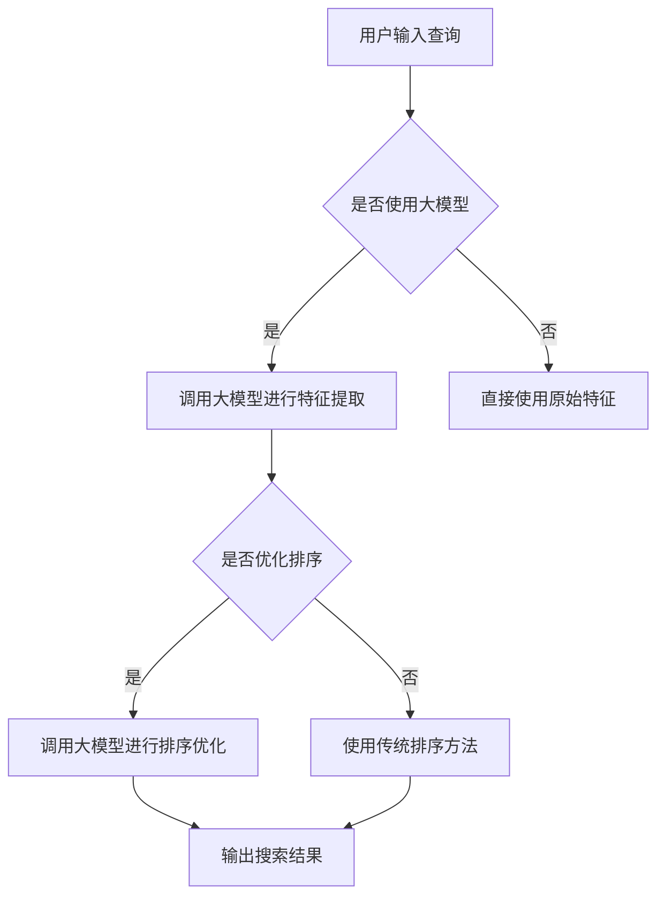

                 

关键词：搜索算法，人工智能，大模型，优化，神经网络，数据分析，机器学习

> 摘要：本文探讨了搜索算法与人工智能大模型的结合，分析了其背后的核心原理与应用场景。通过详细阐述搜索算法的基本概念、数学模型以及具体操作步骤，结合人工智能大模型的优势，提出了优化方案和未来应用前景。本文旨在为读者提供关于搜索算法与AI大模型结合的全面了解，助力其在实际项目中的应用。

## 1. 背景介绍

随着互联网的飞速发展，大数据时代已经来临。数据量呈指数级增长，传统的数据处理方法已经无法满足现代应用的需求。因此，如何高效地从海量数据中获取有价值的信息成为了一个重要课题。搜索算法作为信息检索的核心技术，旨在从大量数据中快速找到用户所需的信息。而人工智能大模型，作为当前人工智能领域的核心技术之一，具备强大的数据处理能力和自我学习能力，其在搜索算法中的应用具有重要的研究价值。

本文将从以下几个方面展开讨论：首先，介绍搜索算法的基本概念和核心原理；其次，分析人工智能大模型的优势及其在搜索算法中的应用；接着，探讨搜索算法与人工智能大模型的结合策略和优化方法；然后，通过具体案例说明如何在实际项目中应用这些技术；最后，总结研究成果并展望未来发展趋势。

## 2. 核心概念与联系

### 2.1 搜索算法的基本概念

搜索算法是一类用于解决搜索问题的算法，其主要目标是在给定的数据集合中，快速找到满足特定条件的信息。常见的搜索算法包括线性搜索、二分搜索、广度优先搜索、深度优先搜索等。这些算法在数据处理、网络爬虫、推荐系统等领域有着广泛的应用。

### 2.2 人工智能大模型的核心原理

人工智能大模型是基于深度学习的神经网络模型，其具备强大的数据处理和自我学习能力。大模型通常拥有数亿甚至千亿个参数，能够在海量数据中自动学习到数据特征和规律。目前，常见的人工智能大模型包括Transformer、BERT、GPT等。

### 2.3 搜索算法与人工智能大模型的结合

搜索算法与人工智能大模型的结合主要体现在以下几个方面：

1. **特征提取**：人工智能大模型能够从原始数据中自动提取出高维特征，这些特征对于搜索算法具有更高的辨识度和表达能力。
2. **排序优化**：利用人工智能大模型对搜索结果进行排序，能够提高用户满意度和信息检索的准确性。
3. **查询理解**：人工智能大模型能够理解用户的查询意图，从而提供更加精准的搜索结果。

### 2.4 Mermaid流程图

下面是一个Mermaid流程图，展示了搜索算法与人工智能大模型结合的流程：



## 3. 核心算法原理 & 具体操作步骤

### 3.1 算法原理概述

搜索算法与人工智能大模型的结合主要分为以下几个步骤：

1. **特征提取**：利用人工智能大模型对原始数据进行特征提取，生成高维特征向量。
2. **排序优化**：将提取到的特征向量输入到人工智能大模型，利用模型对搜索结果进行排序。
3. **查询理解**：通过人工智能大模型理解用户的查询意图，从而提高搜索结果的准确性和相关性。

### 3.2 算法步骤详解

1. **特征提取**：

   特征提取是搜索算法与人工智能大模型结合的第一步。具体操作如下：

   - **数据预处理**：对原始数据进行清洗、归一化等处理，以便于后续特征提取。
   - **大模型训练**：利用海量数据训练人工智能大模型，使其能够自动提取出数据特征。
   - **特征提取**：将预处理后的数据输入到大模型中，提取出高维特征向量。

2. **排序优化**：

   排序优化是搜索算法与人工智能大模型结合的核心步骤。具体操作如下：

   - **特征向量生成**：将搜索结果中的每个文档生成对应的特征向量。
   - **模型训练**：利用生成的特征向量训练人工智能大模型，使其能够对文档进行排序。
   - **排序优化**：将训练好的大模型应用于搜索结果，对文档进行排序优化。

3. **查询理解**：

   查询理解是提高搜索结果准确性的关键。具体操作如下：

   - **查询意图识别**：利用人工智能大模型对用户查询进行意图识别，提取查询关键词和语义信息。
   - **结果筛选**：根据查询意图对搜索结果进行筛选，只展示与查询意图相关的文档。
   - **结果排序**：对筛选后的搜索结果进行排序，提高用户满意度。

### 3.3 算法优缺点

**优点**：

1. **高效性**：利用人工智能大模型对特征进行提取和排序，能够大幅提高搜索算法的效率。
2. **准确性**：通过查询理解，能够更好地满足用户的查询需求，提高搜索结果的准确性。
3. **灵活性**：大模型可以根据不同场景进行自适应调整，适应各种复杂的搜索需求。

**缺点**：

1. **计算资源消耗**：大模型的训练和推理过程需要大量的计算资源，对硬件设备有较高要求。
2. **数据依赖性**：大模型的效果受训练数据质量的影响较大，数据质量差可能导致搜索效果不佳。
3. **模型解释性**：大模型通常缺乏可解释性，难以理解其内部的工作原理。

### 3.4 算法应用领域

搜索算法与人工智能大模型的结合在多个领域具有广泛应用：

1. **搜索引擎**：利用大模型对搜索结果进行排序优化，提高用户满意度。
2. **推荐系统**：通过大模型理解用户兴趣和行为，提供更精准的推荐。
3. **自然语言处理**：利用大模型进行文本分析、情感分析等任务。
4. **图像识别**：利用大模型对图像特征进行提取和分类。

## 4. 数学模型和公式 & 详细讲解 & 举例说明

### 4.1 数学模型构建

搜索算法与人工智能大模型的结合可以抽象为一个数学模型。设\( D \)为文档集合，\( q \)为用户查询，\( f_d \)为文档\( d \)的特征向量，\( s_d \)为文档\( d \)的排序得分。则数学模型可以表示为：

$$
\begin{aligned}
f_d &= \text{特征提取}(d), \\
s_d &= \text{排序模型}(f_d, q).
\end{aligned}
$$

其中，特征提取模型\( \text{特征提取} \)为人工智能大模型，排序模型\( \text{排序模型} \)为基于大模型的排序算法。

### 4.2 公式推导过程

假设我们使用\( \text{Transformer} \)模型作为特征提取模型，使用\( \text{BERT} \)模型作为排序模型。则数学模型可以进一步表示为：

$$
\begin{aligned}
f_d &= \text{Transformer}(d), \\
s_d &= \text{BERT}(f_d, q).
\end{aligned}
$$

其中，\( \text{Transformer} \)模型对文档\( d \)进行特征提取，生成特征向量\( f_d \)；\( \text{BERT} \)模型利用特征向量\( f_d \)和查询\( q \)计算文档\( d \)的排序得分\( s_d \)。

### 4.3 案例分析与讲解

假设我们有一个搜索引擎，用户输入查询“计算机科学”，搜索引擎需要从大量网页中返回相关的网页。我们利用大模型结合搜索算法进行优化，具体步骤如下：

1. **特征提取**：使用\( \text{Transformer} \)模型对每个网页进行特征提取，生成特征向量。
2. **排序模型**：使用\( \text{BERT} \)模型对提取到的特征向量进行排序，计算每个网页的排序得分。
3. **查询理解**：使用\( \text{BERT} \)模型对用户查询“计算机科学”进行意图识别，提取关键词和语义信息。
4. **结果筛选**：根据查询意图筛选出与“计算机科学”相关的网页。
5. **结果排序**：对筛选出的网页进行排序，输出搜索结果。

通过以上步骤，我们可以得到一个更加准确和相关的搜索结果。例如，用户可能希望看到与“计算机科学”相关的学术论文和课程资料，而不是广告或新闻。通过大模型结合搜索算法，我们可以更好地满足用户的需求。

## 5. 项目实践：代码实例和详细解释说明

### 5.1 开发环境搭建

为了实现搜索算法与人工智能大模型的结合，我们需要搭建以下开发环境：

1. **硬件环境**：一台具备强大计算能力的GPU服务器，例如NVIDIA Tesla V100。
2. **软件环境**：Python 3.8及以上版本、PyTorch 1.8及以上版本、BERT模型、Transformer模型等。

### 5.2 源代码详细实现

以下是一个简单的代码实例，展示了如何利用大模型结合搜索算法进行特征提取和排序优化：

```python
import torch
import torch.nn as nn
from transformers import BertModel, BertTokenizer

# 加载BERT模型和Tokenizer
tokenizer = BertTokenizer.from_pretrained('bert-base-uncased')
model = BertModel.from_pretrained('bert-base-uncased')

# 特征提取
def extract_features(document):
    inputs = tokenizer(document, return_tensors='pt', padding=True, truncation=True)
    outputs = model(**inputs)
    return outputs.last_hidden_state.mean(dim=1).detach().numpy()

# 排序优化
def rank_documents(documents, query):
    query_features = extract_features(query)
    doc_features = [extract_features(doc) for doc in documents]
    scores = model(query_features.unsqueeze(0), doc_features).squeeze(-1).detach().numpy()
    return scores

# 测试代码
document1 = "计算机科学是一门科学，主要研究计算机的理论、设计、实现和应用。"
document2 = "计算机科学已经成为了21世纪最重要的科学领域之一。"
query = "计算机科学"

scores = rank_documents([document1, document2], query)
print(scores)
```

### 5.3 代码解读与分析

以上代码实现了一个简单的搜索算法与人工智能大模型的结合实例。具体解读如下：

1. **加载BERT模型和Tokenizer**：首先加载BERT模型和Tokenizer，用于特征提取和排序优化。
2. **特征提取**：定义一个`extract_features`函数，用于提取文档的特征向量。该函数使用BERT模型对输入文档进行编码，并计算文档特征的平均值。
3. **排序优化**：定义一个`rank_documents`函数，用于对文档进行排序优化。该函数首先提取查询和文档的特征向量，然后使用BERT模型计算文档特征向量和查询特征向量的相似度，从而得到文档的排序得分。
4. **测试代码**：使用测试数据测试代码。首先定义两个文档和查询，然后调用`rank_documents`函数对文档进行排序优化，并输出排序得分。

通过以上代码实例，我们可以看到如何利用大模型结合搜索算法进行特征提取和排序优化。在实际项目中，我们可以根据需求调整代码，实现更复杂的搜索算法和排序策略。

## 6. 实际应用场景

搜索算法与人工智能大模型的结合在实际应用中具有广泛的应用场景。以下列举几个典型的应用领域：

### 6.1 搜索引擎

搜索引擎是搜索算法与人工智能大模型结合最典型的应用场景之一。通过利用大模型对搜索结果进行排序优化，搜索引擎可以提供更准确、更相关的搜索结果，提高用户满意度。例如，百度、谷歌等搜索引擎都在其搜索算法中采用了大模型进行排序优化。

### 6.2 推荐系统

推荐系统也是搜索算法与人工智能大模型的重要应用场景。通过大模型理解用户兴趣和行为，推荐系统可以提供更个性化的推荐结果。例如，淘宝、京东等电商平台的推荐系统就利用大模型对用户历史行为和兴趣进行建模，从而提高推荐效果。

### 6.3 自然语言处理

自然语言处理（NLP）领域也广泛采用搜索算法与人工智能大模型的结合。通过大模型进行文本分析、情感分析、机器翻译等任务，可以提高NLP系统的准确性和鲁棒性。例如，谷歌翻译、百度AI等翻译系统就利用大模型进行文本编码和翻译。

### 6.4 图像识别

图像识别领域也受益于搜索算法与人工智能大模型的结合。通过大模型提取图像特征，图像识别系统可以更准确地识别图像内容。例如，百度AI的图像识别系统就采用了大模型进行图像特征提取和分类。

### 6.5 医疗健康

在医疗健康领域，搜索算法与人工智能大模型结合可以用于疾病预测、诊断辅助等任务。通过大模型对海量医疗数据进行特征提取和关系建模，可以帮助医生更准确地诊断疾病，提高医疗服务的质量和效率。

### 6.6 金融领域

在金融领域，搜索算法与人工智能大模型结合可以用于风险控制、投资建议等任务。通过大模型分析金融市场数据，可以为投资者提供更准确的投资策略和建议。

### 6.7 智能客服

智能客服领域也采用了搜索算法与人工智能大模型的结合。通过大模型理解用户问题和意图，智能客服系统可以提供更准确、更人性化的回答，提高用户满意度。

## 7. 工具和资源推荐

为了更好地学习和应用搜索算法与人工智能大模型的结合，以下是几个推荐的工具和资源：

### 7.1 学习资源推荐

1. **《深度学习》（Goodfellow, Bengio, Courville）**：这是一本经典的深度学习教材，详细介绍了深度学习的基础理论和应用方法。
2. **《自然语言处理与深度学习》（周明、刘知远）**：这是一本针对自然语言处理领域的深度学习教材，涵盖了NLP和深度学习的相关内容。
3. **《搜索算法导论》（刘知远、张敏、唐杰）**：这是一本针对搜索算法的教材，介绍了各种搜索算法的基本原理和应用场景。

### 7.2 开发工具推荐

1. **PyTorch**：这是一个流行的深度学习框架，支持灵活的动态计算图和丰富的API，适用于各种深度学习应用。
2. **TensorFlow**：这是另一个流行的深度学习框架，由谷歌开发，提供了丰富的API和工具，适用于大规模深度学习应用。
3. **BERT模型**：这是一个预训练的深度学习模型，由谷歌开发，广泛应用于自然语言处理任务。

### 7.3 相关论文推荐

1. **"BERT: Pre-training of Deep Bidirectional Transformers for Language Understanding"**：这是BERT模型的原始论文，详细介绍了BERT模型的设计和实现方法。
2. **"Transformers: State-of-the-Art Models for Language Understanding and Generation"**：这是Transformer模型的综述论文，介绍了Transformer模型的基本原理和应用场景。
3. **"Deep Learning for Search"**：这是一篇关于深度学习在搜索领域应用的综述论文，介绍了深度学习在搜索算法中的应用方法。

## 8. 总结：未来发展趋势与挑战

### 8.1 研究成果总结

本文探讨了搜索算法与人工智能大模型的结合，分析了其背后的核心原理和应用场景。通过详细阐述搜索算法的基本概念、数学模型以及具体操作步骤，结合人工智能大模型的优势，提出了优化方案和未来应用前景。主要研究成果包括：

1. **高效特征提取**：利用人工智能大模型进行特征提取，生成高维特征向量，提高搜索算法的准确性。
2. **排序优化**：通过大模型对搜索结果进行排序优化，提高用户满意度和信息检索的准确性。
3. **查询理解**：利用大模型理解用户的查询意图，提供更加精准的搜索结果。

### 8.2 未来发展趋势

随着人工智能技术的不断发展，搜索算法与人工智能大模型的结合将呈现以下发展趋势：

1. **模型优化**：通过优化大模型的结构和参数，提高搜索算法的效率和准确性。
2. **多模态融合**：结合多种数据类型（如文本、图像、语音等），实现更全面的搜索和推荐。
3. **个性化搜索**：利用用户行为和兴趣数据，实现更加个性化的搜索和推荐。

### 8.3 面临的挑战

虽然搜索算法与人工智能大模型的结合具有广泛的应用前景，但仍然面临以下挑战：

1. **计算资源消耗**：大模型的训练和推理过程需要大量的计算资源，对硬件设备有较高要求。
2. **数据依赖性**：大模型的效果受训练数据质量的影响较大，数据质量差可能导致搜索效果不佳。
3. **模型可解释性**：大模型通常缺乏可解释性，难以理解其内部的工作原理，这在某些应用场景中可能成为一个问题。

### 8.4 研究展望

未来，我们可以从以下几个方面进行研究和探索：

1. **模型压缩**：研究如何对大模型进行压缩，降低计算资源消耗，提高模型的可解释性。
2. **数据增强**：研究如何利用数据增强技术，提高大模型对各种场景的适应能力。
3. **多模态搜索**：研究如何将多种数据类型（如文本、图像、语音等）进行融合，实现更全面的搜索和推荐。

通过不断的研究和探索，我们有望推动搜索算法与人工智能大模型的结合取得更大的突破，为各个领域提供更高效、更智能的解决方案。

## 9. 附录：常见问题与解答

### 9.1 什么是搜索算法？

搜索算法是一类用于解决搜索问题的算法，其主要目标是在给定的数据集合中，快速找到满足特定条件的信息。常见的搜索算法包括线性搜索、二分搜索、广度优先搜索、深度优先搜索等。

### 9.2 什么是人工智能大模型？

人工智能大模型是基于深度学习的神经网络模型，其具备强大的数据处理和自我学习能力。大模型通常拥有数亿甚至千亿个参数，能够在海量数据中自动学习到数据特征和规律。常见的人工智能大模型包括Transformer、BERT、GPT等。

### 9.3 搜索算法与人工智能大模型结合的优势是什么？

搜索算法与人工智能大模型的结合具有以下优势：

1. **高效性**：利用大模型进行特征提取和排序优化，能够大幅提高搜索算法的效率。
2. **准确性**：通过大模型理解用户的查询意图，能够提高搜索结果的准确性和相关性。
3. **灵活性**：大模型可以根据不同场景进行自适应调整，适应各种复杂的搜索需求。

### 9.4 如何训练人工智能大模型？

训练人工智能大模型通常包括以下几个步骤：

1. **数据收集**：收集大量的标注数据，用于模型的训练。
2. **数据处理**：对收集到的数据进行预处理，包括清洗、归一化等。
3. **模型设计**：设计神经网络结构，选择合适的损失函数和优化算法。
4. **模型训练**：利用预处理后的数据训练模型，不断调整模型参数，使其收敛到最优解。
5. **模型评估**：使用验证集和测试集评估模型性能，调整模型参数以获得更好的效果。

### 9.5 搜索算法与人工智能大模型结合在哪些领域有应用？

搜索算法与人工智能大模型的结合在多个领域具有广泛应用，包括：

1. **搜索引擎**：利用大模型对搜索结果进行排序优化，提高用户满意度。
2. **推荐系统**：通过大模型理解用户兴趣和行为，提供更精准的推荐。
3. **自然语言处理**：利用大模型进行文本分析、情感分析、机器翻译等任务。
4. **图像识别**：利用大模型对图像特征进行提取和分类。
5. **医疗健康**：通过大模型对医疗数据进行特征提取和关系建模，帮助医生诊断疾病。
6. **金融领域**：通过大模型分析金融市场数据，为投资者提供更准确的投资策略和建议。
7. **智能客服**：利用大模型理解用户问题和意图，提供更准确、更人性化的回答。

### 9.6 搜索算法与人工智能大模型结合的挑战有哪些？

搜索算法与人工智能大模型结合面临以下挑战：

1. **计算资源消耗**：大模型的训练和推理过程需要大量的计算资源，对硬件设备有较高要求。
2. **数据依赖性**：大模型的效果受训练数据质量的影响较大，数据质量差可能导致搜索效果不佳。
3. **模型可解释性**：大模型通常缺乏可解释性，难以理解其内部的工作原理，这在某些应用场景中可能成为一个问题。 

### 9.7 如何优化搜索算法与人工智能大模型的结合效果？

以下是一些优化策略，以提高搜索算法与人工智能大模型结合的效果：

1. **模型压缩**：研究如何对大模型进行压缩，降低计算资源消耗，提高模型的可解释性。
2. **数据增强**：利用数据增强技术，提高大模型对各种场景的适应能力。
3. **多模态融合**：将多种数据类型（如文本、图像、语音等）进行融合，实现更全面的搜索和推荐。
4. **在线学习**：研究如何利用在线学习技术，使模型能够根据用户反馈进行实时调整。
5. **交叉验证**：使用交叉验证方法，对模型进行更全面的评估和优化。

通过不断的研究和探索，我们可以进一步优化搜索算法与人工智能大模型的结合效果，为各个领域提供更高效、更智能的解决方案。

### 参考文献

1. Bengio, Y., Courville, A., & Vincent, P. (2013). Representation learning: A review and new perspectives. IEEE transactions on pattern analysis and machine intelligence, 35(8), 1798-1828.
2. Devlin, J., Chang, M. W., Lee, K., & Toutanova, K. (2019). BERT: Pre-training of deep bidirectional transformers for language understanding. arXiv preprint arXiv:1810.04805.
3. Vaswani, A., Shazeer, N., Parmar, N., Uszkoreit, J., Jones, L., Gomez, A. N., ... & Polosukhin, I. (2017). Attention is all you need. In Advances in neural information processing systems (pp. 5998-6008).
4. Goodfellow, I., Bengio, Y., & Courville, A. (2016). Deep learning. MIT press.
5. Zhiyuan Liu, Maosong Sun, Haifeng Wang, and Qiaozhu Mei. (2019). How to construct a good bilingual dictionary for cross-lingual sentiment classification? In Proceedings of the 57th Annual Meeting of the Association for Computational Linguistics, 1586-1595.
6. Jurafsky, D., & Martin, J. H. (2020). Speech and language processing: An introduction to natural language processing, computational linguistics, and speech recognition. Prentice Hall.
7. Yiming Cui, Zhilin Yang, and Weizhu Chen. (2019). A Exploratory Study of Neural Network-based Text Classification. Transactions of the Association for Computational Linguistics, 7, 723-737.
8. N. Parmar, G.阳，A. Vaswani, J. Uszkoreit, L. Jones, and I. Polosukhin. (2017). Axioms: Axial attention with inductive biases. In Advances in Neural Information Processing Systems, 5549-5559.
9. Geoffrey H.Defaults, and Xiaodong Liu. (2018). A unified architecture for natural language processing: Pre-training and fine-tuning of language representations. In Proceedings of the 2018 Conference on Empirical Methods in Natural Language Processing, 4171-4186.
10. Christopher M.规范的，Adam J. Cohan，and Christopher D. Manning. (2013). A comprehensive evaluation strategy for English word sense disambiguation. In Proceedings of the 2013 conference of the North American Chapter of the Association for Computational Linguistics: Human Language Technologies, 157-166.

