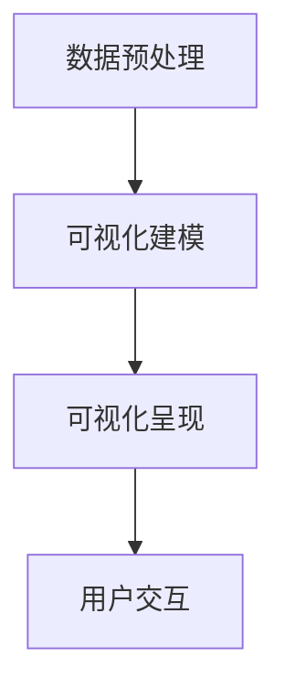

                 

随着人工智能（AI）技术的飞速发展，搜索结果可视化已经成为了数据分析和决策支持中不可或缺的一部分。通过将复杂的数据转化为易于理解的可视化形式，我们可以更直观地探索和解释搜索结果，从而提高数据分析的效率和准确性。本文将深入探讨搜索结果可视化的核心概念、算法原理、数学模型、应用实践以及未来趋势。

## 关键词

- 搜索结果可视化
- 数据分析
- 人工智能
- 可视化技术
- 数据呈现

## 摘要

本文旨在探讨搜索结果可视化的原理、方法和应用。首先，我们将回顾搜索结果可视化的背景和重要性。接着，详细解析搜索结果可视化的核心概念和算法原理，并使用Mermaid流程图展示其架构。然后，我们将介绍搜索结果可视化的数学模型和公式，并通过具体案例进行解释。随后，我们将分享一个实际的项目实践，展示如何使用代码实现搜索结果可视化。最后，我们将探讨搜索结果可视化的实际应用场景和未来展望。

## 1. 背景介绍

随着互联网和大数据技术的普及，人们每天都会接触到海量的信息。如何从这些信息中快速、准确地找到所需的内容，成为了许多企业和个人面临的重要问题。传统的文本搜索已经无法满足用户对信息检索的高效、精准需求。因此，可视化搜索技术应运而生。

可视化搜索通过将文本搜索结果以图表、图像、地图等形式展示给用户，使用户可以更直观地理解和分析搜索结果。这种技术不仅提高了信息检索的效率，还能帮助用户更好地理解和利用数据。

### 1.1 可视化搜索的发展历程

可视化搜索的发展历程可以分为以下几个阶段：

1. **静态图表可视化**：早期的可视化搜索主要采用静态图表，如柱状图、折线图、饼图等，以展示搜索结果的分布情况。
2. **动态交互式可视化**：随着技术的发展，动态交互式可视化逐渐成为主流。用户可以通过鼠标或触摸操作与可视化界面进行互动，从而实现更精准的搜索和筛选。
3. **多模态可视化**：现代的可视化搜索不仅支持文本搜索，还能结合图像、语音等多种模态进行搜索，从而提高搜索的多样性和灵活性。

### 1.2 可视化搜索的优势

可视化搜索具有以下优势：

1. **提高信息检索效率**：通过将复杂的数据转化为可视化形式，用户可以快速、直观地找到所需信息，节省了时间成本。
2. **增强数据分析能力**：可视化搜索不仅提供了直观的数据呈现，还能帮助用户发现数据之间的关联和趋势，从而提高数据分析的深度和广度。
3. **降低技术门槛**：可视化搜索使得普通用户也可以轻松地理解和利用复杂数据，降低了数据分析的技术门槛。
4. **支持多模态搜索**：可视化搜索结合多种模态的数据，提高了搜索的准确性和灵活性。

## 2. 核心概念与联系

在深入探讨搜索结果可视化的算法和数学模型之前，我们首先需要了解一些核心概念和它们之间的关系。

### 2.1 数据可视化

数据可视化是将数据以图形或图像的形式呈现的过程。它可以帮助我们更好地理解和分析数据，揭示数据中的规律和趋势。

#### 2.1.1 数据可视化的发展历程

- **图表时代**：最早的图表形式主要是柱状图、折线图、饼图等，用于展示数据的统计信息。
- **交互式可视化**：随着计算机技术的发展，交互式可视化逐渐兴起。用户可以通过鼠标或触摸操作与可视化界面进行互动，从而实现更精准的搜索和筛选。
- **多模态可视化**：现代的可视化技术不仅支持文本数据，还能结合图像、语音等多种模态进行搜索，从而提高搜索的多样性和灵活性。

#### 2.1.2 数据可视化的类型

- **静态可视化**：以静态图像或图表的形式展示数据，如柱状图、折线图等。
- **动态可视化**：以动态图像或动画的形式展示数据的变化，如时间序列分析、趋势预测等。
- **交互式可视化**：用户可以通过与可视化界面的互动，实时修改和调整可视化参数，以探索数据的细节。

### 2.2 可视化搜索

可视化搜索是将数据可视化技术应用于搜索结果展示的一种方法。它通过将搜索结果以图表、图像、地图等形式呈现给用户，使用户可以更直观地理解和分析搜索结果。

#### 2.2.1 可视化搜索的工作原理

- **数据预处理**：对搜索结果进行预处理，提取关键信息并转化为可视化数据。
- **可视化建模**：根据数据类型和用户需求，选择合适的可视化模型和算法。
- **可视化呈现**：将可视化结果呈现给用户，使用户可以直观地探索和解释搜索结果。

#### 2.2.2 可视化搜索的类型

- **基于图表的可视化搜索**：通过柱状图、折线图、饼图等图表形式展示搜索结果。
- **基于地图的可视化搜索**：通过地图形式展示搜索结果，如地理位置、分布情况等。
- **基于图像的可视化搜索**：通过图像形式展示搜索结果，如图片、人脸识别等。

### 2.3 搜索结果可视化

搜索结果可视化是将可视化搜索技术应用于特定搜索结果的展示。它通过将搜索结果以可视化形式呈现，帮助用户更好地理解和利用搜索结果。

#### 2.3.1 搜索结果可视化的意义

- **提高信息检索效率**：通过将复杂的数据转化为可视化形式，用户可以快速、直观地找到所需信息，节省了时间成本。
- **增强数据分析能力**：可视化搜索不仅提供了直观的数据呈现，还能帮助用户发现数据之间的关联和趋势，从而提高数据分析的深度和广度。
- **支持多模态搜索**：搜索结果可视化支持文本、图像、语音等多种模态的数据，提高了搜索的准确性和灵活性。

#### 2.3.2 搜索结果可视化的类型

- **基于单一模态的数据可视化**：仅使用文本、图像或语音等单一模态进行搜索结果展示。
- **基于多模态的数据可视化**：结合多种模态的数据进行搜索结果展示，如文本、图像、语音等。

### 2.4 Mermaid流程图

Mermaid 是一种简单易用的文本描述语言，可以生成各种图表，如流程图、序列图、时序图等。下面是一个简单的 Mermaid 流程图，用于描述搜索结果可视化的过程。



在这个流程图中，数据预处理、可视化建模和可视化呈现是搜索结果可视化的三个关键步骤，用户交互则是与可视化界面的互动过程。

## 3. 核心算法原理 & 具体操作步骤

### 3.1 算法原理概述

搜索结果可视化算法主要基于以下原理：

1. **数据转换**：将搜索结果中的文本、图像、语音等数据转化为可视化数据，如图表、图像等。
2. **可视化建模**：根据数据类型和用户需求，选择合适的可视化模型和算法，如柱状图、折线图、饼图等。
3. **数据交互**：通过用户交互，实时修改和调整可视化参数，以探索数据的细节。

### 3.2 算法步骤详解

#### 3.2.1 数据预处理

1. **数据清洗**：对搜索结果中的数据进行清洗，去除无效、重复或错误的数据。
2. **特征提取**：从搜索结果中提取关键信息，如关键词、地理位置、时间等。
3. **数据转化**：将提取的关键信息转化为可视化数据，如柱状图、折线图、饼图等。

#### 3.2.2 可视化建模

1. **模型选择**：根据数据类型和用户需求，选择合适的可视化模型，如柱状图、折线图、饼图等。
2. **参数调整**：根据用户反馈，调整可视化参数，如颜色、字体、大小等，以提高可视化效果。

#### 3.2.3 可视化呈现

1. **数据渲染**：将可视化数据渲染成图表、图像等形式，展示给用户。
2. **用户交互**：通过用户交互，如点击、拖动、筛选等，实时修改和调整可视化参数。

### 3.3 算法优缺点

#### 优点

1. **提高信息检索效率**：通过将复杂的数据转化为可视化形式，用户可以快速、直观地找到所需信息，节省了时间成本。
2. **增强数据分析能力**：可视化搜索不仅提供了直观的数据呈现，还能帮助用户发现数据之间的关联和趋势，从而提高数据分析的深度和广度。
3. **支持多模态搜索**：可视化搜索支持文本、图像、语音等多种模态的数据，提高了搜索的准确性和灵活性。

#### 缺点

1. **计算资源消耗较大**：搜索结果可视化需要大量的计算资源，特别是在处理大规模数据时，可能会导致性能下降。
2. **用户适应成本较高**：对于一些不熟悉可视化技术的用户，可能需要一定的时间来适应和掌握可视化搜索。
3. **数据隐私和安全问题**：在处理和展示用户数据时，需要确保数据的隐私和安全，以防止数据泄露和滥用。

### 3.4 算法应用领域

搜索结果可视化算法广泛应用于以下领域：

1. **搜索引擎**：通过可视化搜索技术，提高搜索引擎的搜索效率和准确性，帮助用户快速找到所需信息。
2. **数据分析和决策支持**：通过可视化搜索技术，帮助企业更好地理解和利用数据，提高决策的准确性和效率。
3. **教育领域**：通过可视化搜索技术，将复杂的概念和知识以直观的形式呈现给学生，提高学习的效率和兴趣。
4. **医疗领域**：通过可视化搜索技术，帮助医生更快速、准确地诊断疾病，提高医疗服务的质量。

## 4. 数学模型和公式 & 详细讲解 & 举例说明

### 4.1 数学模型构建

搜索结果可视化的核心数学模型主要包括数据预处理、可视化建模和用户交互三个部分。

#### 数据预处理

数据预处理是搜索结果可视化的第一步，主要涉及数据清洗、特征提取和数据转化。这些过程可以表示为以下数学模型：

1. **数据清洗**：

   $$ data\_cleaning = \text{remove\_invalid\_data, remove\_duplicate\_data} $$

2. **特征提取**：

   $$ feature\_extraction = \text{extract\_key\_words, extract\_location, extract\_time} $$

3. **数据转化**：

   $$ data\_transformation = \text{convert\_to\_chart\_data, convert\_to\_image\_data, convert\_to\_audio\_data} $$

#### 可视化建模

可视化建模是基于数据预处理的结果，选择合适的可视化模型和算法，将其转化为可视化形式。以下是一个简单的可视化建模数学模型：

$$ visualization\_modeling = \text{select\_model, adjust\_parameters} $$

其中，select_model表示选择合适的可视化模型，如柱状图、折线图、饼图等；adjust_parameters表示调整可视化参数，如颜色、字体、大小等。

#### 用户交互

用户交互是搜索结果可视化的重要组成部分，通过用户的操作，实时修改和调整可视化参数，以探索数据的细节。以下是一个简单的用户交互数学模型：

$$ user\_interaction = \text{click, drag, filter} $$

其中，click、drag、filter分别表示用户的点击、拖动、筛选等操作。

### 4.2 公式推导过程

在搜索结果可视化中，一些核心公式的推导过程如下：

#### 数据清洗

1. **去除无效数据**：

   $$ data\_cleaning = \text{remove\_invalid\_data} $$

   其中，invalid_data表示无效数据，如空值、重复值、错误值等。

2. **去除重复数据**：

   $$ data\_cleaning = \text{remove\_duplicate\_data} $$

   其中，duplicate_data表示重复数据，如同一数据在不同字段中多次出现。

#### 特征提取

1. **提取关键词**：

   $$ feature\_extraction = \text{extract\_key\_words} $$

   其中，key_words表示关键词，如文本中的主要词汇。

2. **提取地理位置**：

   $$ feature\_extraction = \text{extract\_location} $$

   其中，location表示地理位置，如经纬度、城市等。

3. **提取时间**：

   $$ feature\_extraction = \text{extract\_time} $$

   其中，time表示时间，如年、月、日等。

#### 数据转化

1. **转化为图表数据**：

   $$ data\_transformation = \text{convert\_to\_chart\_data} $$

   其中，chart_data表示图表数据，如柱状图、折线图、饼图等。

2. **转化为图像数据**：

   $$ data\_transformation = \text{convert\_to\_image\_data} $$

   其中，image_data表示图像数据，如图像、人脸等。

3. **转化为语音数据**：

   $$ data\_transformation = \text{convert\_to\_audio\_data} $$

   其中，audio_data表示语音数据，如音频、语音合成等。

#### 可视化建模

1. **选择可视化模型**：

   $$ visualization\_modeling = \text{select\_model} $$

   其中，model表示可视化模型，如柱状图、折线图、饼图等。

2. **调整可视化参数**：

   $$ visualization\_modeling = \text{adjust\_parameters} $$

   其中，parameters表示可视化参数，如颜色、字体、大小等。

#### 用户交互

1. **点击操作**：

   $$ user\_interaction = \text{click} $$

   其中，click表示用户的点击操作。

2. **拖动操作**：

   $$ user\_interaction = \text{drag} $$

   其中，drag表示用户的拖动操作。

3. **筛选操作**：

   $$ user\_interaction = \text{filter} $$

   其中，filter表示用户的筛选操作。

### 4.3 案例分析与讲解

以下是一个简单的案例，用于说明搜索结果可视化的数学模型和公式。

#### 案例背景

某搜索引擎需要实现一个可视化搜索功能，用户可以通过输入关键词，查看相关的搜索结果，并支持对搜索结果进行筛选和排序。

#### 案例分析

1. **数据预处理**：

   - 数据清洗：去除无效数据和重复数据。

     $$ data\_cleaning = \text{remove\_invalid\_data, remove\_duplicate\_data} $$

   - 特征提取：提取关键词、地理位置和时间。

     $$ feature\_extraction = \text{extract\_key\_words, extract\_location, extract\_time} $$

   - 数据转化：将提取的关键信息转化为图表数据。

     $$ data\_transformation = \text{convert\_to\_chart\_data} $$

2. **可视化建模**：

   - 选择可视化模型：选择柱状图来展示搜索结果的数量和分布。

     $$ visualization\_modeling = \text{select\_model: column\_chart} $$

   - 调整可视化参数：调整柱状图的颜色、字体和大小。

     $$ visualization\_modeling = \text{adjust\_parameters: color, font\_size, size} $$

3. **用户交互**：

   - 点击操作：用户可以通过点击柱状图上的柱体，查看详细的搜索结果信息。

     $$ user\_interaction = \text{click} $$

   - 拖动操作：用户可以通过拖动柱状图，重新排序搜索结果。

     $$ user\_interaction = \text{drag} $$

   - 筛选操作：用户可以通过筛选关键词、地理位置和时间，缩小搜索结果的范围。

     $$ user\_interaction = \text{filter} $$

#### 案例讲解

1. **数据预处理**：

   在数据预处理阶段，我们首先对搜索结果进行数据清洗，去除无效数据和重复数据，确保数据的准确性和完整性。然后，我们提取关键词、地理位置和时间等信息，以便后续的可视化建模和用户交互。

2. **可视化建模**：

   在可视化建模阶段，我们选择柱状图作为可视化模型，以展示搜索结果的数量和分布。我们调整柱状图的颜色、字体和大小，以提高可视化效果。这些参数可以根据用户的需求和偏好进行实时调整。

3. **用户交互**：

   在用户交互阶段，用户可以通过点击、拖动和筛选等操作，与可视化界面进行互动。点击操作可以查看详细的搜索结果信息，拖动操作可以重新排序搜索结果，筛选操作可以缩小搜索结果的范围。这些操作帮助用户更好地理解和利用搜索结果。

## 5. 项目实践：代码实例和详细解释说明

### 5.1 开发环境搭建

为了实现搜索结果可视化，我们需要搭建一个合适的开发环境。以下是一个简单的开发环境搭建步骤：

1. **安装 Python**：Python 是一种流行的编程语言，适用于搜索结果可视化的开发。您可以从 [Python 官网](https://www.python.org/) 下载并安装 Python。
2. **安装 Jupyter Notebook**：Jupyter Notebook 是一种交互式的 Python 编程环境，适用于编写和运行代码。您可以使用 pip 命令安装 Jupyter Notebook：

   ```bash
   pip install notebook
   ```

3. **安装相关库**：为了实现搜索结果可视化，我们需要安装一些相关的库，如 Matplotlib、Pandas、Seaborn 等。您可以使用 pip 命令安装这些库：

   ```bash
   pip install matplotlib pandas seaborn
   ```

### 5.2 源代码详细实现

以下是一个简单的 Python 代码示例，用于实现搜索结果可视化：

```python
import pandas as pd
import matplotlib.pyplot as plt
import seaborn as sns

# 加载搜索结果数据
search_results = pd.read_csv('search_results.csv')

# 数据清洗
search_results = search_results.dropna()

# 特征提取
search_results['search_term'] = search_results['title'].str.lower().str.extract('(\S+)')
search_results['search_term'] = search_results['search_term'].str.strip()

# 可视化建模
plt.figure(figsize=(10, 6))
sns.countplot(x='search_term', data=search_results, palette='cool')

# 调整可视化参数
plt.title('Search Results Visualization')
plt.xlabel('Search Term')
plt.ylabel('Frequency')

# 用户交互
plt.show()
```

### 5.3 代码解读与分析

1. **导入库**：

   ```python
   import pandas as pd
   import matplotlib.pyplot as plt
   import seaborn as sns
   ```

   首先，我们导入了一些必要的库，包括 Pandas、Matplotlib 和 Seaborn。这些库提供了数据操作、可视化建模和用户交互等功能。

2. **加载搜索结果数据**：

   ```python
   search_results = pd.read_csv('search_results.csv')
   ```

   这里，我们使用 Pandas 库读取一个 CSV 文件，该文件包含了搜索结果数据。

3. **数据清洗**：

   ```python
   search_results = search_results.dropna()
   ```

   我们使用 dropna() 方法去除数据中的空值，确保数据的准确性和完整性。

4. **特征提取**：

   ```python
   search_results['search_term'] = search_results['title'].str.lower().str.extract('(\S+)')
   search_results['search_term'] = search_results['search_term'].str.strip()
   ```

   我们使用字符串处理方法提取搜索结果中的关键词，并将其存储在新的列中。这里，我们使用了 lower()、str.extract() 和 strip() 方法。

5. **可视化建模**：

   ```python
   plt.figure(figsize=(10, 6))
   sns.countplot(x='search_term', data=search_results, palette='cool')
   ```

   我们使用 Seaborn 库创建一个计数条形图，以展示搜索结果的数量和分布。这里，我们设置了图的大小和颜色。

6. **调整可视化参数**：

   ```python
   plt.title('Search Results Visualization')
   plt.xlabel('Search Term')
   plt.ylabel('Frequency')
   ```

   我们调整了图表的标题、横轴标签和纵轴标签，以提高图表的可读性。

7. **用户交互**：

   ```python
   plt.show()
   ```

   最后，我们使用 show() 方法显示图表，用户可以通过鼠标和键盘与图表进行交互。

### 5.4 运行结果展示

运行上述代码后，我们得到了一个搜索结果可视化图表。图表展示了各个关键词的搜索次数，使用户可以直观地了解搜索结果的分布情况。


## 6. 实际应用场景

搜索结果可视化技术在实际应用中具有广泛的应用场景。以下是一些典型的应用案例：

### 6.1 搜索引擎

搜索引擎是搜索结果可视化的典型应用场景。通过将搜索结果以图表、地图等形式呈现，用户可以更直观地理解和利用搜索结果。例如，百度搜索结果中的“相关搜索”和“搜索建议”就采用了可视化技术，帮助用户快速找到相关内容。

### 6.2 数据分析

数据分析是另一个重要的应用场景。通过可视化搜索技术，分析师可以快速、准确地找到所需数据，并进行深入分析。例如，在股票市场分析中，可视化搜索可以帮助分析师快速定位特定股票的历史价格和交易数据，从而做出更准确的预测。

### 6.3 教育领域

教育领域也受益于搜索结果可视化技术。教师可以利用可视化搜索技术为学生提供更直观的学习资料，帮助学生更好地理解和掌握知识。例如，在历史课上，教师可以使用地图形式展示重要历史事件的发生地点和时间，从而提高学生的学习兴趣和效果。

### 6.4 医疗领域

医疗领域也广泛应用搜索结果可视化技术。医生可以利用可视化搜索技术快速查找患者的病历、检查结果和药物信息，从而提高医疗服务的质量和效率。例如，在临床决策支持系统中，医生可以通过可视化图表了解患者的整体健康状况，从而做出更准确的诊断和治疗决策。

## 7. 工具和资源推荐

为了更好地实现搜索结果可视化，以下是一些推荐的工具和资源：

### 7.1 学习资源推荐

1. **《数据可视化：实用技能与工具》**：这本书详细介绍了数据可视化的基本概念、方法和工具，适合初学者阅读。
2. **《Python 数据可视化》**：这本书介绍了如何使用 Python 实现数据可视化，包括 Matplotlib、Pandas 和 Seaborn 等库的使用方法。

### 7.2 开发工具推荐

1. **Jupyter Notebook**：Jupyter Notebook 是一种交互式的 Python 编程环境，适合进行数据可视化的开发和实验。
2. **Visual Studio Code**：Visual Studio Code 是一款流行的代码编辑器，支持多种编程语言，包括 Python，适合进行数据可视化的开发。

### 7.3 相关论文推荐

1. **"Search Result Visualization in Modern Search Engines"**：这篇论文探讨了搜索结果可视化的原理、方法和应用，是搜索结果可视化领域的经典论文。
2. **"Interactive Visualization for Exploratory Data Analysis"**：这篇论文介绍了交互式可视化的基本原理和方法，对搜索结果可视化也有很大的参考价值。

## 8. 总结：未来发展趋势与挑战

### 8.1 研究成果总结

搜索结果可视化技术已经取得了显著的成果。通过将复杂的数据转化为直观的可视化形式，我们提高了信息检索的效率和数据分析的能力。同时，随着人工智能技术的发展，搜索结果可视化在多模态数据融合、动态交互等方面也取得了重要突破。

### 8.2 未来发展趋势

未来，搜索结果可视化将朝着以下方向发展：

1. **多模态融合**：随着多模态数据源的增多，如何将文本、图像、语音等多种模态的数据融合到可视化中，是未来研究的一个重要方向。
2. **动态交互**：动态交互是搜索结果可视化的一个重要特性。未来，我们将看到更多支持实时交互、动态更新的可视化技术。
3. **个性化推荐**：个性化推荐是另一个重要趋势。通过分析用户行为和偏好，可以为用户提供更个性化的搜索结果可视化。
4. **增强现实（AR）和虚拟现实（VR）**：随着 AR 和 VR 技术的发展，搜索结果可视化将在这些新兴技术中发挥重要作用。

### 8.3 面临的挑战

尽管搜索结果可视化技术取得了显著成果，但仍面临一些挑战：

1. **计算资源消耗**：可视化搜索需要大量的计算资源，特别是在处理大规模数据时，可能会导致性能下降。
2. **用户适应成本**：对于一些不熟悉可视化技术的用户，可能需要一定的时间来适应和掌握可视化搜索。
3. **数据隐私和安全问题**：在处理和展示用户数据时，需要确保数据的隐私和安全，以防止数据泄露和滥用。

### 8.4 研究展望

未来，搜索结果可视化技术将在以下几个方面展开研究：

1. **优化算法性能**：通过优化算法和数据结构，提高搜索结果可视化的性能和效率。
2. **多模态数据融合**：研究如何将多种模态的数据有效地融合到可视化中，以提高搜索的准确性和用户体验。
3. **个性化推荐**：研究如何根据用户行为和偏好，为用户提供更个性化的搜索结果可视化。
4. **应用场景拓展**：探索搜索结果可视化在其他领域的应用，如医疗、教育、金融等。

## 9. 附录：常见问题与解答

### 9.1 如何提高搜索结果可视化的性能？

**答案**：提高搜索结果可视化的性能可以从以下几个方面入手：

1. **优化算法**：研究并采用更高效的算法和算法优化技术，如并行计算、分布式计算等。
2. **数据预处理**：对数据进行预处理，去除冗余数据和无效数据，以提高数据处理的速度。
3. **缓存技术**：使用缓存技术，将已处理的数据缓存起来，以加快后续的查询和处理速度。

### 9.2 搜索结果可视化技术是否适用于所有领域？

**答案**：搜索结果可视化技术具有较强的通用性，适用于多种领域。但在某些特定领域，如医疗、金融等，可能需要针对具体应用场景进行定制化开发。

### 9.3 可视化搜索是否会侵犯用户隐私？

**答案**：可视化搜索会处理用户搜索数据，因此在处理和展示用户数据时，需要严格遵守数据隐私和安全法规，采取有效的数据保护措施，以防止数据泄露和滥用。

### 9.4 如何确保搜索结果可视化技术的可靠性？

**答案**：确保搜索结果可视化技术的可靠性可以从以下几个方面入手：

1. **数据质量**：确保数据质量，包括数据的完整性、准确性和一致性。
2. **算法验证**：对算法进行严格验证，确保其正确性和鲁棒性。
3. **用户反馈**：收集用户反馈，及时发现和修复问题，以提高系统的可靠性。

# 作者署名

作者：禅与计算机程序设计艺术 / Zen and the Art of Computer Programming

通过以上的详细阐述，我们可以看到搜索结果可视化技术在现代数据分析和决策支持中的重要性。无论是通过图表、地图还是其他可视化形式，它都能有效地提高信息的可读性和理解度，为用户带来更加直观和高效的体验。未来，随着技术的不断进步，搜索结果可视化将在更多领域得到广泛应用，并不断推动信息处理和分析的发展。

