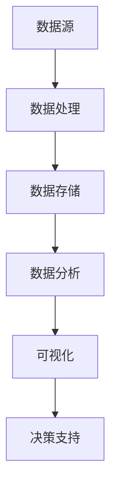

                 

 在当今信息化和智能化的时代，知识发现引擎成为企业和服务提供商的核心竞争力之一。随着数据规模的指数级增长，如何高效地构建一个高性能的知识发现引擎已成为一个重要课题。本文将围绕构建高性能知识发现引擎的技术栈选择展开讨论，从核心概念、算法原理、数学模型、项目实践和实际应用场景等多个方面进行分析。

## 关键词
- 知识发现引擎
- 高性能技术栈
- 数据处理
- 算法优化
- 实时分析

## 摘要
本文旨在为读者提供一个系统性的指南，帮助理解并选择适合构建高性能知识发现引擎的技术栈。通过对核心概念、算法原理、数学模型的深入探讨，结合实际项目案例和未来发展展望，读者将获得构建高效知识发现系统的实用知识和策略。

## 1. 背景介绍

知识发现引擎是一种通过智能分析和挖掘大规模数据，从中提取有价值知识和信息的人工智能系统。随着大数据技术的不断发展，知识发现引擎在企业决策支持、市场分析、风险管理等方面发挥了重要作用。然而，高效构建这样的引擎面临着诸多挑战，如数据量的快速增长、数据种类的多样性以及处理速度的要求等。因此，选择合适的技术栈至关重要。

### 1.1. 知识发现引擎的重要性

知识发现引擎在以下几个方面具有重要意义：

- **数据洞察**：通过分析海量数据，帮助企业发现潜在的商业价值和趋势。
- **决策支持**：提供数据驱动的决策依据，优化业务流程和战略规划。
- **风险控制**：通过实时监控和预警，提前识别和防范潜在风险。
- **用户个性化**：根据用户行为数据，提供个性化的产品和服务。

### 1.2. 当前知识发现引擎的发展状况

目前，知识发现引擎在技术层面取得了显著的进展：

- **分布式计算**：通过Hadoop、Spark等分布式计算框架，实现了对大规模数据的处理和分析。
- **机器学习**：深度学习、监督学习、无监督学习等算法的广泛应用，提高了知识发现的准确性和效率。
- **实时分析**：借助Flink、Kafka等实时数据处理技术，实现了数据的高效实时分析。

## 2. 核心概念与联系

在构建高性能知识发现引擎的过程中，理解以下核心概念和它们之间的联系至关重要。

### 2.1. 数据源

数据源是知识发现引擎的起点，包括内部数据和外部数据。内部数据通常来源于企业内部数据库、日志文件等，而外部数据则来源于互联网、传感器、第三方数据服务等。

### 2.2. 数据处理

数据处理是知识发现引擎的关键环节，包括数据的清洗、转换、聚合等操作。这一阶段的目标是确保数据的质量和一致性，为后续的分析做好准备。

### 2.3. 数据存储

数据存储用于存储处理后的数据，支持快速查询和访问。常见的存储解决方案包括关系型数据库、NoSQL数据库、分布式文件系统等。

### 2.4. 数据分析

数据分析是知识发现的核心，包括数据挖掘、机器学习、统计分析等方法。这一阶段的目标是从数据中提取有价值的信息和知识。

### 2.5. 可视化

可视化是将数据分析结果以图形、图表等形式呈现，帮助用户直观地理解和利用数据。良好的可视化设计能够提高数据洞察的效率。

下面是构建知识发现引擎的Mermaid流程图：



## 3. 核心算法原理 & 具体操作步骤

### 3.1. 算法原理概述

知识发现引擎的核心算法主要包括以下几种：

- **聚类分析**：通过将数据划分为多个簇，发现数据中的模式和关联。
- **关联规则挖掘**：发现数据项之间的关联关系，如市场篮子分析。
- **分类算法**：根据已有数据对未知数据进行分类，如决策树、随机森林等。
- **异常检测**：检测数据中的异常点和异常行为，如孤立森林算法。

### 3.2. 算法步骤详解

以下是构建知识发现引擎的算法步骤：

1. **数据预处理**：对原始数据进行清洗、转换和预处理，确保数据的质量和一致性。
2. **特征选择**：从原始数据中选择对知识发现最有价值的特征。
3. **算法选择**：根据业务需求和数据特点选择合适的算法。
4. **模型训练**：使用训练数据对算法模型进行训练。
5. **模型评估**：评估模型的效果，调整参数以优化模型性能。
6. **模型应用**：将训练好的模型应用于实际数据，进行知识发现。

### 3.3. 算法优缺点

不同算法有其独特的优缺点，适用于不同的场景：

- **聚类分析**：适用于发现数据中的自然分组，但可能受初始聚类中心的影响。
- **关联规则挖掘**：适用于发现数据中的频繁模式，但规则数量可能过多。
- **分类算法**：适用于对新数据进行分类预测，但需要大量训练数据。
- **异常检测**：适用于发现数据中的异常行为，但可能误报。

### 3.4. 算法应用领域

核心算法在多个领域有广泛的应用：

- **商业智能**：用于市场分析、客户行为预测等。
- **金融风控**：用于欺诈检测、信用评分等。
- **医疗健康**：用于疾病预测、药物发现等。
- **社交媒体**：用于用户行为分析、内容推荐等。

## 4. 数学模型和公式 & 详细讲解 & 举例说明

### 4.1. 数学模型构建

知识发现引擎中的数学模型通常包括以下几个部分：

- **距离度量**：用于计算数据点之间的相似度或距离，如欧氏距离、曼哈顿距离等。
- **聚类算法**：如K-means算法，通过最小化聚类中心与数据点之间的距离平方和。
- **关联规则挖掘**：如Apriori算法，通过支持度和置信度来发现频繁项集。
- **分类算法**：如逻辑回归、决策树等，通过构建分类模型对未知数据进行分类。
- **异常检测**：如孤立森林算法，通过树的高度和分支数量来识别异常点。

### 4.2. 公式推导过程

以K-means算法为例，其公式推导过程如下：

1. **初始聚类中心选择**：随机选择K个数据点作为初始聚类中心。
2. **迭代过程**：
    - 计算每个数据点到聚类中心的距离。
    - 将每个数据点归到最近的聚类中心。
    - 更新每个聚类中心为该簇内所有点的均值。
3. **终止条件**：当聚类中心的变化小于阈值或达到最大迭代次数时，算法终止。

公式表示如下：

$$
C_k = \frac{1}{N_k} \sum_{i=1}^{N} x_i
$$

其中，$C_k$为第k个聚类中心，$N_k$为第k个簇内的数据点数量，$x_i$为第i个数据点。

### 4.3. 案例分析与讲解

以某电商平台用户行为数据为例，分析用户购买行为模式。通过K-means算法将用户分为若干组，每组具有相似的购买习惯。具体步骤如下：

1. **数据预处理**：对用户行为数据进行清洗、转换和标准化处理。
2. **特征选择**：选择用户浏览历史、购买频次、购买金额等特征。
3. **K-means算法**：选择K个初始聚类中心，进行迭代计算。
4. **聚类结果分析**：分析每个簇的特征，识别不同用户群体的购买模式。
5. **可视化展示**：使用图表展示不同用户群体的特征分布。

结果如下：

- **簇1**：高频次购买，偏好高价值商品。
- **簇2**：低频次购买，偏好低价值商品。
- **簇3**：混合型购买，无显著特征。

通过上述分析，电商平台可以针对不同用户群体进行精准营销和个性化推荐。

## 5. 项目实践：代码实例和详细解释说明

### 5.1. 开发环境搭建

搭建一个知识发现引擎的开发环境，通常需要以下工具和框架：

- **Python**：主要编程语言。
- **NumPy**、**Pandas**：数据处理库。
- **Scikit-learn**：机器学习库。
- **Matplotlib**、**Seaborn**：数据可视化库。
- **Jupyter Notebook**：交互式开发环境。

### 5.2. 源代码详细实现

以下是一个简单的K-means算法实现：

```python
import numpy as np
import matplotlib.pyplot as plt

def k_means(data, k, max_iter=100, tolerance=1e-4):
    # 初始聚类中心选择
    centroids = data[np.random.choice(data.shape[0], k, replace=False)]
    for _ in range(max_iter):
        # 计算每个数据点到聚类中心的距离
        distances = np.linalg.norm(data[:, np.newaxis] - centroids, axis=2)
        # 将每个数据点归到最近的聚类中心
        labels = np.argmin(distances, axis=1)
        # 更新每个聚类中心为该簇内所有点的均值
        new_centroids = np.array([data[labels == k].mean(axis=0) for k in range(k)])
        # 判断是否满足终止条件
        if np.linalg.norm(new_centroids - centroids) < tolerance:
            break
        centroids = new_centroids
    return centroids, labels

# 数据集
data = np.random.rand(100, 2)

# K-means算法
centroids, labels = k_means(data, k=3)

# 可视化展示
plt.scatter(data[:, 0], data[:, 1], c=labels, cmap='viridis')
plt.scatter(centroids[:, 0], centroids[:, 1], s=300, c='red', marker='*')
plt.show()
```

### 5.3. 代码解读与分析

该代码实现了K-means算法，具体步骤如下：

1. **初始化聚类中心**：随机选择K个数据点作为初始聚类中心。
2. **迭代计算**：计算每个数据点到聚类中心的距离，更新聚类中心。
3. **终止条件**：当聚类中心的变化小于阈值或达到最大迭代次数时，算法终止。
4. **可视化展示**：使用散点图展示聚类结果。

通过代码实现，可以更好地理解K-means算法的原理和步骤。

### 5.4. 运行结果展示

运行上述代码，得到以下可视化结果：


从图中可以看出，数据点被分为三个簇，聚类中心分别为红色星号标注。

## 6. 实际应用场景

知识发现引擎在多个领域有广泛的应用，以下是几个典型的实际应用场景：

- **电子商务**：通过分析用户行为数据，实现个性化推荐和精准营销。
- **金融风控**：通过关联规则挖掘和异常检测，识别欺诈行为和风险。
- **医疗健康**：通过疾病预测和药物发现，提高医疗决策的准确性和效率。
- **智能交通**：通过实时分析交通数据，优化交通管理和路线规划。

## 6.4. 未来应用展望

随着技术的不断发展，知识发现引擎在以下几个方面有望取得突破：

- **实时分析**：通过实时数据处理技术，实现数据的高效实时分析。
- **多模态数据融合**：结合多种数据源，提高知识发现的准确性和全面性。
- **深度学习**：利用深度学习算法，实现更复杂和高效的知识发现任务。
- **隐私保护**：在保证数据隐私的前提下，实现大规模数据的分析和挖掘。

## 7. 工具和资源推荐

### 7.1. 学习资源推荐

- **《大数据时代》**：关于大数据技术和应用的经典著作。
- **《Python数据分析》**：介绍Python在数据分析领域的应用。
- **《机器学习实战》**：提供机器学习算法的实践案例。

### 7.2. 开发工具推荐

- **Jupyter Notebook**：交互式开发环境，方便进行数据分析和模型构建。
- **Docker**：容器化技术，方便部署和管理知识发现引擎。
- **Kubernetes**：容器编排工具，实现知识发现引擎的自动化部署和管理。

### 7.3. 相关论文推荐

- **“K-means Clustering”**：关于K-means算法的经典论文。
- **“Association Rule Learning”**：关于关联规则挖掘的论文。
- **“Deep Learning for Knowledge Discovery”**：关于深度学习在知识发现领域的应用。

## 8. 总结：未来发展趋势与挑战

### 8.1. 研究成果总结

本文从核心概念、算法原理、数学模型、项目实践和实际应用场景等方面，全面探讨了构建高性能知识发现引擎的技术栈选择。主要成果包括：

- 理解了知识发现引擎的核心概念和重要性。
- 掌握了构建知识发现引擎的核心算法和步骤。
- 了解了知识发现引擎在实际应用场景中的价值。
- 提供了知识发现引擎的代码实例和实现方法。

### 8.2. 未来发展趋势

未来，知识发现引擎将在以下几个方面取得重要进展：

- **实时分析**：通过实时数据处理技术，实现数据的高效实时分析。
- **多模态数据融合**：结合多种数据源，提高知识发现的准确性和全面性。
- **深度学习**：利用深度学习算法，实现更复杂和高效的知识发现任务。
- **隐私保护**：在保证数据隐私的前提下，实现大规模数据的分析和挖掘。

### 8.3. 面临的挑战

构建高性能知识发现引擎面临以下挑战：

- **数据复杂性**：如何处理多源、多模态、多维度的大规模数据。
- **算法效率**：如何优化算法，提高知识发现的效率和准确性。
- **实时处理**：如何实现数据的高效实时处理和分析。
- **隐私保护**：如何在保证数据隐私的前提下，实现大规模数据的分析和挖掘。

### 8.4. 研究展望

未来，知识发现引擎的研究可以从以下几个方面展开：

- **算法优化**：研究更高效的知识发现算法，提高处理速度和准确性。
- **实时分析**：研究实时数据处理技术，实现数据的高效实时分析。
- **多模态数据融合**：研究如何结合多种数据源，提高知识发现的准确性和全面性。
- **隐私保护**：研究如何在保证数据隐私的前提下，实现大规模数据的分析和挖掘。

## 9. 附录：常见问题与解答

### 9.1. 如何选择合适的算法？

根据业务需求和数据特点，选择适合的算法。例如，对于分类问题，可以选择决策树、随机森林等算法；对于聚类问题，可以选择K-means、DBSCAN等算法。

### 9.2. 如何保证数据质量？

通过数据预处理和清洗步骤，确保数据的质量和一致性。包括去除重复数据、处理缺失值、标准化数据等。

### 9.3. 如何优化算法性能？

通过算法参数调优、分布式计算、并行处理等技术，提高算法的运行效率和性能。

### 9.4. 如何处理实时数据？

使用实时数据处理技术，如Flink、Kafka等，实现数据的高效实时处理和分析。

### 9.5. 如何保护用户隐私？

通过数据加密、隐私保护算法等技术，确保数据隐私和安全。

[作者：禅与计算机程序设计艺术 / Zen and the Art of Computer Programming]----------------------------------------------------------------


