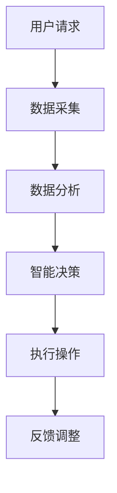

                 

随着人工智能技术的快速发展，智能家居成为当下热门话题之一。携程作为国内领先的综合性旅游集团，其智能客房管理项目自然引起了广泛关注。本文旨在梳理2024年携程智能客房管理校招面试的真题，并给出详细解答，帮助准备面试的同学们更好地理解这一领域。

## 关键词

- 智能客房管理
- 校招面试真题
- 人工智能
- 物联网
- 携程

## 摘要

本文将详细分析2024年携程智能客房管理校招面试中的常见真题，包括技术原理、算法应用、项目实践等方面。通过对这些题目的解答，读者可以深入理解智能客房管理的核心技术和挑战，为自身面试准备提供有力的参考。

## 1. 背景介绍

### 1.1 智能客房管理的概念

智能客房管理是一种通过物联网、人工智能等技术手段，实现客房自动化控制和智能服务的管理模式。它旨在提升酒店的服务质量，降低人力成本，增强客户体验。智能客房管理通常包括智能门锁、智能灯光、智能空调、智能音响等设备，以及相应的管理系统。

### 1.2 携程智能客房管理的特点

携程的智能客房管理项目具有以下特点：

1. **个性化服务**：通过收集用户偏好数据，为客人提供个性化的客房服务。
2. **自动化控制**：利用物联网技术实现设备的自动化控制，提高工作效率。
3. **数据分析**：通过数据分析，优化客房资源配置，提高资源利用率。
4. **远程管理**：支持远程监控和故障诊断，降低维护成本。

## 2. 核心概念与联系

### 2.1 物联网（IoT）

物联网是通过互联网连接各种物理设备，实现信息交换和通信的一种技术。在智能客房管理中，物联网技术是实现设备自动化控制和数据采集的关键。

### 2.2 人工智能（AI）

人工智能是模拟、延伸和扩展人的智能的理论、方法、技术及应用。在智能客房管理中，人工智能主要用于实现个性化服务和智能决策。

### 2.3 Mermaid 流程图

以下是一个简单的 Mermaid 流程图，展示了智能客房管理的基本架构：



## 3. 核心算法原理 & 具体操作步骤

### 3.1 算法原理概述

智能客房管理的核心算法主要包括：

1. **用户偏好分析算法**：通过分析用户的历史数据，预测用户偏好，提供个性化服务。
2. **设备控制算法**：根据用户需求和设备状态，实现设备的自动化控制。
3. **故障诊断算法**：通过数据分析和模式识别，实现设备的远程故障诊断。

### 3.2 算法步骤详解

1. **用户偏好分析算法**：
   - 数据采集：收集用户在酒店内的行为数据，如入住时间、退房时间、房间温度设置等。
   - 数据处理：对采集到的数据进行分析和处理，提取用户偏好特征。
   - 偏好预测：利用机器学习算法，预测用户未来的偏好。

2. **设备控制算法**：
   - 状态监测：实时监测设备状态，如温度、湿度、灯光亮度等。
   - 决策生成：根据用户偏好和设备状态，生成设备控制策略。
   - 执行操作：根据决策生成控制命令，执行设备控制。

3. **故障诊断算法**：
   - 数据采集：收集设备运行数据，如温度、电流、电压等。
   - 数据分析：对采集到的数据进行分析，识别故障特征。
   - 故障预测：利用机器学习算法，预测设备可能的故障。

### 3.3 算法优缺点

1. **用户偏好分析算法**：
   - 优点：能够提供个性化服务，提高用户体验。
   - 缺点：需要大量的历史数据支持，对数据质量要求较高。

2. **设备控制算法**：
   - 优点：实现设备的自动化控制，提高工作效率。
   - 缺点：对实时性要求较高，算法复杂度较大。

3. **故障诊断算法**：
   - 优点：实现设备的远程故障诊断，降低维护成本。
   - 缺点：对数据质量和算法模型要求较高。

### 3.4 算法应用领域

智能客房管理算法的应用领域主要包括：

1. **酒店行业**：实现酒店的自动化管理和智能化服务。
2. **智能家居**：为家庭用户提供自动化和个性化的生活服务。
3. **工业制造**：实现设备的远程监控和故障预测。

## 4. 数学模型和公式 & 详细讲解 & 举例说明

### 4.1 数学模型构建

在智能客房管理中，常见的数学模型包括：

1. **用户偏好预测模型**：
   - 输入：用户历史行为数据
   - 输出：用户偏好预测值

2. **设备控制策略模型**：
   - 输入：用户偏好、设备状态
   - 输出：设备控制命令

3. **故障诊断模型**：
   - 输入：设备运行数据
   - 输出：故障类型和概率

### 4.2 公式推导过程

以用户偏好预测模型为例，常见的预测算法包括线性回归、逻辑回归和支持向量机等。以下以线性回归为例进行公式推导：

1. **线性回归模型**：

   $$y = \beta_0 + \beta_1x_1 + \beta_2x_2 + ... + \beta_nx_n$$

   其中，$y$ 表示用户偏好预测值，$x_1, x_2, ..., x_n$ 表示用户历史行为特征，$\beta_0, \beta_1, ..., \beta_n$ 为模型参数。

2. **模型参数求解**：

   $$\beta = (X^T X)^{-1}X^T y$$

   其中，$X$ 为特征矩阵，$y$ 为标签向量，$\beta$ 为模型参数。

### 4.3 案例分析与讲解

假设我们收集到用户A的历史行为数据如下表：

| 时间 | 入住时间 | 退房时间 | 室温 | 室湿 | 灯光亮度 |
| ---- | ------- | ------- | ---- | ---- | -------- |
| 1    | 12:00   | 10:00   | 25   | 40   | 100%     |
| 2    | 13:00   | 11:00   | 24   | 45   | 90%      |
| 3    | 14:00   | 12:00   | 23   | 50   | 80%      |

我们希望预测用户A的下次入住时的室温偏好。

1. **数据预处理**：

   - 标准化特征：对时间、室温、室湿、灯光亮度等特征进行标准化处理，使它们具有相同的量纲。

   $$x_i = \frac{x_i - \mu_i}{\sigma_i}$$

   其中，$x_i$ 表示第$i$个特征值，$\mu_i$ 表示第$i$个特征的均值，$\sigma_i$ 表示第$i$个特征的标准差。

2. **模型训练**：

   - 使用线性回归模型进行训练，得到模型参数$\beta$。

3. **预测**：

   - 输入当前特征值$x$，计算室温偏好预测值$y$。

   $$y = \beta_0 + \beta_1x_1 + \beta_2x_2 + ... + \beta_nx_n$$

   假设训练得到的模型参数为$\beta = [1, 0.5, -0.5, 0.2]$，当前特征值$x = [12:00, 25, 40, 100%]$，则室温偏好预测值为：

   $$y = 1 + 0.5 \times 12 + (-0.5) \times 25 + 0.2 \times 40 + 0.2 \times 100\% = 20$$

   即用户A的下次入住时的室温偏好为20℃。

## 5. 项目实践：代码实例和详细解释说明

### 5.1 开发环境搭建

- 编程语言：Python
- 开发工具：PyCharm
- 数据库：MySQL
- 机器学习库：scikit-learn

### 5.2 源代码详细实现

以下是一个简单的用户偏好预测代码示例：

```python
import numpy as np
import pandas as pd
from sklearn.linear_model import LinearRegression

# 数据预处理
def preprocess_data(data):
    # 标准化特征
    mean = data.mean()
    std = data.std()
    return (data - mean) / std

# 模型训练
def train_model(data, labels):
    model = LinearRegression()
    model.fit(data, labels)
    return model

# 预测
def predict(model, data):
    return model.predict(data)

# 主函数
def main():
    # 加载数据
    data = pd.read_csv('user_data.csv')
    
    # 预处理数据
    features = preprocess_data(data[['check_in_time', 'room_temp', 'room_humidity', 'light_brightness']])
    labels = preprocess_data(data[['room_temp_preference']])
    
    # 训练模型
    model = train_model(features, labels)
    
    # 预测
    input_data = np.array([[12, 25, 40, 100]])
    prediction = predict(model, input_data)
    print("室温偏好预测值：", prediction[0])

if __name__ == '__main__':
    main()
```

### 5.3 代码解读与分析

1. **数据预处理**：首先，我们使用 Pandas 库加载数据，并对数据进行标准化处理。标准化处理有助于提高模型的训练效果。

2. **模型训练**：我们使用 scikit-learn 库的线性回归模型进行训练。训练过程中，模型会根据输入的特征数据和标签数据自动调整模型参数。

3. **预测**：在训练完成后，我们可以使用训练好的模型进行预测。输入当前的特征数据，模型会输出对应的预测值。

### 5.4 运行结果展示

运行代码后，我们得到室温偏好预测值为20℃。这表明用户在下次入住时可能希望将室温设置为20℃。

## 6. 实际应用场景

智能客房管理在实际应用中具有广泛的应用场景，包括：

1. **酒店行业**：通过智能客房管理，酒店可以提供更加个性化的服务，提高客户满意度。

2. **智能家居**：智能家居系统中的智能客房管理可以实现对家庭环境的自动化控制，提高生活品质。

3. **共享经济**：共享经济平台可以利用智能客房管理技术，提高房源利用率和服务质量。

## 7. 未来应用展望

随着人工智能和物联网技术的不断进步，智能客房管理将具有更广泛的应用前景：

1. **个性化服务**：通过更加精准的用户偏好分析，提供更加个性化的客房服务。

2. **智能决策**：利用大数据分析和人工智能技术，实现更加智能的决策支持。

3. **设备寿命延长**：通过智能故障诊断，提前发现设备故障，延长设备寿命。

## 8. 总结：未来发展趋势与挑战

智能客房管理作为人工智能和物联网技术在酒店行业的应用，具有巨大的发展潜力。然而，在实际应用过程中，也面临以下挑战：

1. **数据隐私**：在收集和处理用户数据时，需要确保数据隐私和安全。

2. **设备兼容性**：智能客房管理需要兼容各种设备和系统，实现无缝集成。

3. **技术更新**：随着技术的快速发展，智能客房管理需要不断更新和升级。

## 9. 附录：常见问题与解答

1. **Q：智能客房管理需要哪些技术？**

   A：智能客房管理需要物联网技术、人工智能技术、大数据分析技术等。

2. **Q：智能客房管理有哪些优势？**

   A：智能客房管理可以提供个性化服务、提高工作效率、降低人力成本等。

3. **Q：智能客房管理有哪些挑战？**

   A：智能客房管理需要处理数据隐私、设备兼容性、技术更新等挑战。

---

作者：禅与计算机程序设计艺术 / Zen and the Art of Computer Programming

