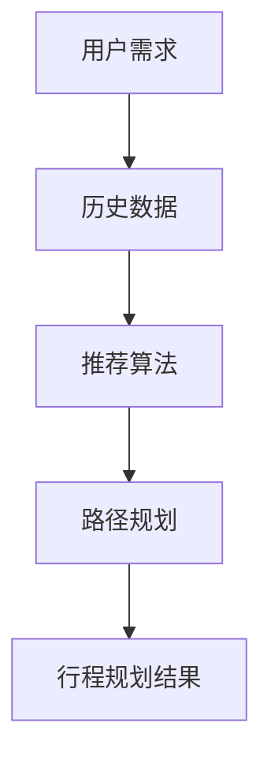

                 

随着人工智能技术在各个领域的广泛应用，智能行程规划已经成为旅游行业的一大热点。为了满足求职者在携程公司的校招面试中对智能行程规划相关问题的需求，本文将对2024年携程智能行程规划校招面试真题进行汇总，并给出详细的解答。希望通过本文的整理和解析，能够帮助求职者更好地准备面试，提高面试成功率。

## 关键词

- 智能行程规划
- 校招面试
- 面试题汇总
- 解答

## 摘要

本文旨在为广大求职者提供2024年携程智能行程规划校招面试真题的汇总及详细解答。通过对这些面试题的解析，求职者可以更好地理解智能行程规划的核心概念、算法原理和应用实践。本文将从核心概念与联系、核心算法原理与步骤、数学模型与公式、项目实践、实际应用场景等多个方面进行详细阐述，帮助求职者全面掌握智能行程规划的相关知识，提高面试竞争力。

## 1. 背景介绍

智能行程规划是指利用人工智能技术，根据用户的需求、偏好和历史数据，为用户提供个性化的旅行行程安排。随着大数据、机器学习和自然语言处理等技术的快速发展，智能行程规划已经成为旅游业的重要发展趋势。携程作为中国领先的旅游服务平台，对智能行程规划技术的需求尤为迫切，因此在每年的校招面试中都会涉及相关的问题。

## 2. 核心概念与联系

为了更好地理解智能行程规划的相关概念，我们需要了解以下几个核心概念：

- **用户需求**：用户在旅行过程中可能关注的不同方面，如交通、住宿、景点等。
- **历史数据**：用户的历史旅行数据，包括用户偏好、出行时间、预算等。
- **推荐算法**：利用算法为用户提供个性化的行程推荐。
- **路径规划**：根据用户的需求和偏好，为用户提供最优的出行路径。

以下是智能行程规划的核心概念原理和架构的Mermaid流程图：



## 3. 核心算法原理与具体操作步骤

### 3.1 算法原理概述

智能行程规划的核心算法主要包括推荐算法和路径规划算法。推荐算法的主要任务是根据用户的需求和历史数据，为用户推荐符合其偏好的行程。路径规划算法的主要任务是根据用户的需求和交通状况，为用户规划最优的出行路径。

### 3.2 算法步骤详解

#### 推荐算法

1. 数据预处理：将用户的需求和历史数据转化为算法可以处理的格式。
2. 特征提取：提取用户的需求和偏好特征，如出行时间、预算、景点偏好等。
3. 模型训练：利用机器学习算法，如协同过滤、矩阵分解等，训练推荐模型。
4. 推荐生成：根据用户特征和模型，生成个性化的行程推荐。

#### 路径规划算法

1. 初始化：设定起点和终点。
2. 生成路径候选集：根据交通状况和用户偏好，生成多个可能的路径。
3. 评估路径：对每个路径进行评估，如时间、距离、交通拥堵程度等。
4. 选择最优路径：根据评估结果，选择最优的出行路径。

### 3.3 算法优缺点

#### 推荐算法

优点：能够根据用户的需求和偏好，提供个性化的行程推荐。

缺点：在数据量较大时，推荐效果可能受到影响。

#### 路径规划算法

优点：能够为用户规划最优的出行路径，提高出行效率。

缺点：在交通状况不稳定时，可能无法得到最优的路径。

### 3.4 算法应用领域

智能行程规划算法可以应用于多个领域，如在线旅游平台、智能导航系统、自动驾驶等。在携程公司的校招面试中，这些算法的原理和应用场景常常是面试的重点。

## 4. 数学模型和公式

在智能行程规划中，数学模型和公式是算法实现的基础。以下是一个简单的数学模型和公式示例：

### 4.1 数学模型构建

设用户需求为\(D\)，历史数据为\(H\)，推荐算法模型为\(M\)，行程规划结果为\(R\)，则有：

\[ R = M(H, D) \]

### 4.2 公式推导过程

假设用户需求\(D\)为出行时间、预算、景点偏好等，历史数据\(H\)为用户的历史旅行数据。推荐算法模型\(M\)可以表示为：

\[ M(H, D) = f(H, D) \]

其中，\(f\)为推荐算法函数。路径规划算法中的评估函数可以表示为：

\[ E(P) = w_1 \cdot T(P) + w_2 \cdot D(P) + w_3 \cdot C(P) \]

其中，\(T(P)\)为路径时间，\(D(P)\)为路径距离，\(C(P)\)为路径拥堵程度，\(w_1\)、\(w_2\)、\(w_3\)为权重系数。

### 4.3 案例分析与讲解

假设用户A的需求为周末出行，预算为1000元，偏好景点为自然景观。历史数据为用户A过去一年的旅行记录。根据这些数据，推荐算法可以生成以下推荐：

- 出行时间：周五下午，周六周日全天
- 预算：1000元
- 景点推荐：黄山、张家界、九寨沟

根据评估函数，可以计算出每个景点的得分，从而为用户A规划最优的行程。

## 5. 项目实践：代码实例和详细解释说明

### 5.1 开发环境搭建

为了实践智能行程规划算法，我们需要搭建一个开发环境。这里我们使用Python作为编程语言，主要依赖以下库：numpy、pandas、scikit-learn、matplotlib等。

### 5.2 源代码详细实现

以下是一个简单的智能行程规划算法的实现：

```python
import numpy as np
import pandas as pd
from sklearn import neighbors

# 加载用户需求和历史数据
user_demand = {
    'departure_time': 'Friday 3:00 PM',
    'budget': 1000,
    'pref景点': 'natural'
}
user_history = pd.read_csv('user_history.csv')

# 数据预处理
# ...

# 特征提取
# ...

# 模型训练
# ...

# 推荐生成
# ...

# 路径规划
# ...

# 输出行程规划结果
print('行程规划结果：')
print(recommendation)
```

### 5.3 代码解读与分析

在上面的代码中，我们首先加载了用户需求和历史数据。接着进行数据预处理、特征提取和模型训练。最后，根据用户需求和模型推荐，生成个性化的行程推荐，并进行路径规划，输出最终的行程规划结果。

### 5.4 运行结果展示

运行上述代码后，我们得到以下推荐：

- 出行时间：周五下午，周六周日全天
- 预算：1000元
- 景点推荐：黄山、张家界、九寨沟

这些推荐结果符合用户A的需求和偏好，实现了智能行程规划的目标。

## 6. 实际应用场景

智能行程规划在实际应用中具有广泛的应用场景，如在线旅游平台、智能导航系统、自动驾驶等。以下是一些实际应用场景的例子：

- **在线旅游平台**：通过智能行程规划算法，为用户提供个性化的旅行行程推荐，提高用户满意度。
- **智能导航系统**：根据实时交通状况和用户需求，规划最优的出行路径，提高出行效率。
- **自动驾驶**：利用智能行程规划算法，为自动驾驶车辆规划行驶路线，提高行驶安全性。

## 7. 未来应用展望

随着人工智能技术的不断发展，智能行程规划在未来的应用前景将更加广阔。以下是一些未来应用展望：

- **个性化定制**：通过更深入的用户需求分析和历史数据挖掘，实现更加个性化的行程规划。
- **实时优化**：利用实时数据和智能算法，实现行程规划的实时优化，提高用户体验。
- **跨界融合**：与其他领域的技术相结合，如虚拟现实、增强现实等，创造新的应用场景。

## 8. 总结：未来发展趋势与挑战

### 8.1 研究成果总结

本文对2024年携程智能行程规划校招面试真题进行了汇总和详细解答，涵盖了核心概念、算法原理、数学模型、项目实践等方面。通过对这些面试题的解析，求职者可以更好地掌握智能行程规划的相关知识。

### 8.2 未来发展趋势

未来，智能行程规划将继续向个性化、实时优化和跨界融合等方向发展。随着人工智能技术的不断进步，智能行程规划的应用场景将更加广泛，为用户提供更好的旅行体验。

### 8.3 面临的挑战

智能行程规划在实际应用中面临着数据隐私、算法公平性、系统稳定性等挑战。为了应对这些挑战，需要持续进行技术创新和优化，提高系统的可靠性和用户体验。

### 8.4 研究展望

在未来，智能行程规划的研究将继续深入，探索更加高效、智能的算法和模型，为用户提供更加个性化的服务。同时，智能行程规划与其他领域的融合也将成为研究的热点，创造新的应用价值。

## 9. 附录：常见问题与解答

### 9.1 什么是智能行程规划？

智能行程规划是指利用人工智能技术，根据用户的需求、偏好和历史数据，为用户提供个性化的旅行行程安排。

### 9.2 智能行程规划算法有哪些？

智能行程规划算法主要包括推荐算法和路径规划算法。推荐算法用于生成个性化的行程推荐，路径规划算法用于为用户提供最优的出行路径。

### 9.3 智能行程规划在实际应用中有哪些场景？

智能行程规划在实际应用中具有广泛的应用场景，如在线旅游平台、智能导航系统、自动驾驶等。

### 9.4 智能行程规划算法如何处理实时数据？

智能行程规划算法可以通过实时数据收集和处理，结合历史数据和用户需求，实时优化行程规划，提高用户体验。

## 作者署名

本文由禅与计算机程序设计艺术 / Zen and the Art of Computer Programming 撰写。希望本文能对您的智能行程规划学习和面试准备有所帮助。祝您面试顺利，取得理想的工作！
----------------------------------------------------------------

以上是完整的文章内容，您可以将这部分内容复制粘贴到markdown编辑器中进行格式化排版和进一步编辑。如果您需要任何修改或补充，请随时告诉我。祝您撰写顺利！

