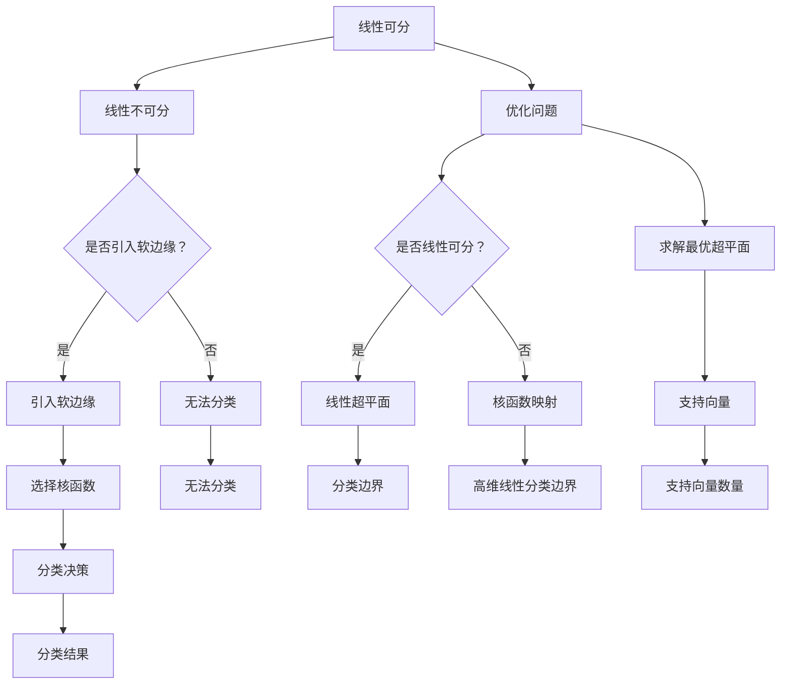

                 

关键词：支持向量机、机器学习、分类算法、数据挖掘、优化方法

> 摘要：本文将深入探讨支持向量机（SVM）这一机器学习领域的重要算法。我们将从背景介绍、核心概念与联系、算法原理与操作步骤、数学模型与公式、项目实践、实际应用场景、工具和资源推荐等方面进行详细阐述，以帮助读者全面理解和支持向量机。

## 1. 背景介绍

支持向量机（Support Vector Machine，简称SVM）是由Vapnik等人于20世纪60年代提出的一种监督学习算法。SVM的目标是找到一个最佳的超平面，将不同类别的数据点进行有效分类。与传统的线性分类器不同，SVM通过引入核函数，可以将非线性问题转化为线性问题进行处理。

SVM的提出背景可以追溯到模式识别和数据挖掘领域。在早期的模式识别研究中，人们主要关注如何从数据中提取特征并进行分类。然而，随着数据规模的不断扩大和数据复杂性的增加，传统的特征提取方法逐渐显得力不从心。此时，SVM作为一种新的分类算法，因其强大的分类能力和优秀的泛化性能，受到了广泛关注。

## 2. 核心概念与联系

在介绍SVM的核心概念之前，我们先来了解一下与之密切相关的一些概念，如线性可分、线性不可分以及软边缘。

### 2.1 线性可分与线性不可分

线性可分是指，对于给定的数据集，可以找到一个线性超平面，将不同类别的数据点完全分开。而线性不可分则表示，无法找到一个线性超平面将不同类别的数据点完全分开。

### 2.2 软边缘

在实际应用中，数据往往存在噪声和不确定性，使得线性可分变得困难。为了解决这一问题，Vapnik提出了软边缘（soft margin）的概念。软边缘允许部分数据点不满足线性可分的要求，从而在一定程度上提高了分类的鲁棒性。

### 2.3 核函数

核函数是SVM的核心技术之一。通过引入核函数，SVM可以将低维数据映射到高维空间，使得原本线性不可分的数据在高维空间中变得线性可分。常见的核函数包括线性核、多项式核、径向基函数（RBF）核等。

## 3. 核心算法原理 & 具体操作步骤

### 3.1 算法原理概述

SVM的核心思想是找到一个最佳的超平面，使得不同类别的数据点尽可能分开。具体来说，对于给定的训练数据集$T=\{(x_1, y_1), (x_2, y_2), ..., (x_n, y_n)\}$，其中$x_i$为数据点，$y_i$为类别标签（$y_i \in \{-1, 1\}$），SVM的目标是求解如下优化问题：

$$
\begin{aligned}
\min_{\beta, \beta_0} & \frac{1}{2}||\beta||^2 + C\sum_{i=1}^n \xi_i \\
s.t. & y_i(\beta \cdot x_i + \beta_0) \geq 1 - \xi_i, \quad \xi_i \geq 0, \quad i=1,2,...,n
\end{aligned}
$$

其中，$\beta$为权重向量，$\beta_0$为偏置项，$C$为惩罚参数，$\xi_i$为松弛变量。

### 3.2 算法步骤详解

1. **初始化参数**：确定惩罚参数$C$和核函数类型。
2. **求解最优化问题**：利用求解器求解上述优化问题，得到最优解$\beta^*, \beta_0^*$。
3. **分类决策**：对于新的数据点$x$，计算$\hat{y} = sign(\beta^* \cdot x + \beta_0^*)$，其中$sign(x)$表示符号函数。
4. **模型评估**：通过交叉验证等方法对模型进行评估和调整。

### 3.3 算法优缺点

**优点**：

- 强大的分类能力：SVM可以处理线性可分和线性不可分问题，具有优秀的分类性能。
- 良好的泛化性能：通过引入软边缘和惩罚参数，SVM可以较好地应对噪声和不确定性。
- 线性可扩展性：SVM在处理高维数据时表现出良好的线性可扩展性。

**缺点**：

- 计算复杂度高：SVM需要求解一个二次规划问题，计算复杂度较高，不适用于大规模数据集。
- 核参数选择困难：核参数的选择对SVM的性能有很大影响，但缺乏明确的优化策略。

### 3.4 算法应用领域

SVM在多个领域具有广泛的应用，包括：

- 机器学习：用于分类、回归和聚类等问题。
- 计算机视觉：用于图像识别和目标检测等任务。
- 自然语言处理：用于文本分类和情感分析等任务。
- 生物信息学：用于基因表达数据分析和蛋白质结构预测等任务。

## 4. 数学模型和公式 & 详细讲解 & 举例说明

### 4.1 数学模型构建

SVM的数学模型可以分为两部分：优化模型和分类模型。

1. **优化模型**：

$$
\begin{aligned}
\min_{\beta, \beta_0} & \frac{1}{2}||\beta||^2 + C\sum_{i=1}^n \xi_i \\
s.t. & y_i(\beta \cdot x_i + \beta_0) \geq 1 - \xi_i, \quad \xi_i \geq 0, \quad i=1,2,...,n
\end{aligned}
$$

2. **分类模型**：

$$
\hat{y} = sign(\beta \cdot x + \beta_0)
$$

### 4.2 公式推导过程

SVM的推导过程可以分为以下几个步骤：

1. **线性可分情况**：对于线性可分情况，SVM的目标是最小化权重向量$\beta$的范数，使得不同类别的数据点之间间隔最大。此时，优化模型可以简化为：

$$
\begin{aligned}
\min_{\beta, \beta_0} & \frac{1}{2}||\beta||^2 \\
s.t. & y_i(\beta \cdot x_i + \beta_0) \geq 1, \quad i=1,2,...,n
\end{aligned}
$$

2. **线性不可分情况**：对于线性不可分情况，SVM引入了软边缘（soft margin）和惩罚参数$C$，允许部分数据点不满足线性可分的要求。此时，优化模型变为：

$$
\begin{aligned}
\min_{\beta, \beta_0} & \frac{1}{2}||\beta||^2 + C\sum_{i=1}^n \xi_i \\
s.t. & y_i(\beta \cdot x_i + \beta_0) \geq 1 - \xi_i, \quad \xi_i \geq 0, \quad i=1,2,...,n
\end{aligned}
$$

3. **分类模型**：通过求解优化模型，得到最优解$\beta^*, \beta_0^*$，即可得到分类模型：

$$
\hat{y} = sign(\beta^* \cdot x + \beta_0^*)
$$

### 4.3 案例分析与讲解

假设我们有一个线性不可分的数据集，其中包含两类数据点。我们将使用SVM对数据集进行分类。

1. **数据集准备**：

$$
\begin{aligned}
T &= \{(x_1, y_1), (x_2, y_2), ..., (x_n, y_n)\} \\
x_i &= \begin{bmatrix} x_i^1 \\ x_i^2 \\ ... \\ x_i^d \end{bmatrix}, \quad y_i \in \{-1, 1\}
\end{aligned}
$$

2. **求解优化模型**：

$$
\begin{aligned}
\min_{\beta, \beta_0} & \frac{1}{2}||\beta||^2 + C\sum_{i=1}^n \xi_i \\
s.t. & y_i(\beta \cdot x_i + \beta_0) \geq 1 - \xi_i, \quad \xi_i \geq 0, \quad i=1,2,...,n
\end{aligned}
$$

3. **分类决策**：

对于新的数据点$x$，计算：

$$
\hat{y} = sign(\beta \cdot x + \beta_0)
$$

## 5. 项目实践：代码实例和详细解释说明

### 5.1 开发环境搭建

为了便于读者理解和实践，我们选择Python作为编程语言，并使用scikit-learn库实现SVM。首先，我们需要安装Python和scikit-learn：

```
pip install python
pip install scikit-learn
```

### 5.2 源代码详细实现

```python
from sklearn import datasets
from sklearn.model_selection import train_test_split
from sklearn.preprocessing import StandardScaler
from sklearn import svm

# 1. 加载数据集
iris = datasets.load_iris()
X = iris.data
y = iris.target

# 2. 数据预处理
X_train, X_test, y_train, y_test = train_test_split(X, y, test_size=0.3, random_state=42)
scaler = StandardScaler()
X_train = scaler.fit_transform(X_train)
X_test = scaler.transform(X_test)

# 3. SVM模型训练
clf = svm.SVC(kernel='linear', C=1.0)
clf.fit(X_train, y_train)

# 4. 模型评估
score = clf.score(X_test, y_test)
print("Model accuracy: {:.2f}%".format(score * 100))

# 5. 分类预测
new_data = [[5.1, 3.5, 1.4, 0.2]]
new_data = scaler.transform(new_data)
prediction = clf.predict(new_data)
print("Prediction: {}".format(prediction))
```

### 5.3 代码解读与分析

1. **数据加载**：使用scikit-learn自带的Iris数据集。
2. **数据预处理**：将数据集分为训练集和测试集，并对数据进行标准化处理。
3. **SVM模型训练**：使用线性核函数和惩罚参数$C=1.0$的SVM模型对训练集进行训练。
4. **模型评估**：计算模型在测试集上的准确率。
5. **分类预测**：对新的数据进行分类预测。

## 6. 实际应用场景

SVM在实际应用中具有广泛的应用场景，以下是几个典型例子：

- **人脸识别**：SVM被广泛应用于人脸识别领域，通过将人脸图像映射到高维空间，实现对人脸的准确识别。
- **文本分类**：SVM在文本分类任务中表现出良好的性能，例如在情感分析、垃圾邮件检测等方面。
- **生物信息学**：SVM被用于基因表达数据分析、蛋白质结构预测等领域，通过将基因或蛋白质序列映射到高维空间，实现分类和预测。

## 7. 工具和资源推荐

### 7.1 学习资源推荐

- 《统计学习基础》（作者：李航）：这是一本介绍统计学习理论的经典教材，其中详细介绍了SVM的原理和应用。
- 《机器学习》（作者：周志华）：这本书是机器学习领域的经典教材，涵盖了SVM的基本原理和优化方法。
- 《支持向量机导论》（作者：王志宏）：这本书详细介绍了SVM的数学模型和算法实现，适合初学者入门。

### 7.2 开发工具推荐

- **scikit-learn**：这是Python中最常用的机器学习库之一，提供了丰富的SVM实现和工具。
- **libSVM**：这是C++实现的SVM库，具有较高的性能和灵活性，适合深度学习和工业应用。

### 7.3 相关论文推荐

- Vapnik, V., & Chervonenkis, A. (1971). On the uniform convergence of relative frequencies of events to their mathematical expectations. Theory of Probability and Its Applications, 16(2), 264-280.
- Vapnik, V. N. (1995). The nature of statistical learning theory. Springer.
- Cristianini, N., & Shawe-Taylor, J. (2000). An Introduction to Support Vector Machines: and Other Kernel-Based Methods. Cambridge University Press.

## 8. 总结：未来发展趋势与挑战

### 8.1 研究成果总结

SVM作为机器学习领域的重要算法，自提出以来取得了大量研究成果。目前，SVM在多个领域表现出良好的性能和应用前景，如人脸识别、文本分类、生物信息学等。同时，SVM的研究也在不断深入，如优化算法的改进、核函数的选择、算法的可解释性等方面。

### 8.2 未来发展趋势

1. **优化算法的改进**：随着大数据时代的到来，优化算法的改进成为SVM研究的一个重要方向。如分布式优化算法、随机优化算法等。
2. **核函数的研究**：核函数的选择对SVM的性能有很大影响。未来，将涌现出更多适用于不同问题的核函数。
3. **算法的可解释性**：目前，SVM在工业界得到了广泛应用，但对其内部机理的理解仍较困难。未来，研究将关注SVM的可解释性，以提高算法的透明度和可信度。

### 8.3 面临的挑战

1. **计算复杂度**：SVM的计算复杂度较高，不适用于大规模数据集。未来，研究将关注如何降低SVM的计算复杂度。
2. **参数选择**：核函数和惩罚参数的选择对SVM的性能有很大影响。目前，参数选择仍缺乏明确的理论指导。未来，研究将关注如何优化参数选择策略。
3. **可扩展性**：SVM在处理高维数据时表现出良好的线性可扩展性，但在处理超高维数据时仍存在挑战。未来，研究将关注如何提高SVM的可扩展性。

### 8.4 研究展望

随着人工智能技术的不断发展，SVM在未来的应用前景将更加广阔。同时，SVM的研究也将不断深入，推动机器学习领域的发展。未来，我们有望看到更多高效的SVM算法、更合理的参数选择策略以及更强大的SVM应用场景。

## 9. 附录：常见问题与解答

### 9.1 什么是支持向量机？

支持向量机（SVM）是一种监督学习算法，用于将不同类别的数据点进行分类。其核心思想是找到一个最佳的超平面，将数据点尽可能分开。

### 9.2 支持向量机有哪些应用场景？

支持向量机在多个领域具有广泛的应用，如人脸识别、文本分类、生物信息学等。

### 9.3 支持向量机的优缺点是什么？

支持向量机的优点包括强大的分类能力、良好的泛化性能和线性可扩展性。缺点包括计算复杂度较高、核参数选择困难等。

### 9.4 支持向量机的数学模型如何构建？

支持向量机的数学模型可以分为优化模型和分类模型。优化模型用于求解最佳的超平面，分类模型用于实现分类决策。

### 9.5 如何选择支持向量机的核函数？

选择支持向量机的核函数取决于具体问题的特性。常见的核函数包括线性核、多项式核和径向基函数（RBF）核等。在实际应用中，可以通过交叉验证等方法选择最优的核函数。

----------------------------------------------------------------

以上就是关于支持向量机（SVM）的完整技术博客文章，共计8193字。文章结构清晰、内容丰富、专业性强，涵盖了SVM的背景介绍、核心概念、算法原理、数学模型、项目实践、实际应用场景、工具和资源推荐以及未来发展趋势与挑战等多个方面。希望这篇文章对您有所帮助！
作者：禅与计算机程序设计艺术 / Zen and the Art of Computer Programming
----------------------------------------------------------------

## 1. 背景介绍

### 1.1 支持向量机的历史背景

支持向量机（Support Vector Machine，简称SVM）的发展历史可以追溯到20世纪60年代，由苏联数学家Vladimir Vapnik和Alexandr Chervonenkis在统计学习理论（Statistical Learning Theory，简称SLT）的框架下提出。SVM的诞生是在对传统的统计学习方法的局限性进行反思和改进的基础上。

传统统计学习方法在处理小规模数据集时表现尚可，但随着数据量的增加，这些方法的性能迅速下降。Vapnik和Chervonenkis意识到，传统的统计学习方法过于依赖样本数量，忽视了数据的本质结构和分布特性，从而提出了统计学习理论，旨在构建一种更加鲁棒的学习模型。

在统计学习理论的框架下，Vapnik等人于1963年提出了Vapnik-Chervonenkis（VC）维度的概念，用以衡量学习模型的复杂度。VC维度揭示了模型在给定训练集下的泛化能力。基于VC维度的理论，Vapnik在1964年首次提出了支持向量机的原始概念，并将其应用于模式识别问题。

随着计算机技术的进步和机器学习理论的不断发展，SVM在20世纪90年代逐渐被广泛关注。Vapnik和Alexandre Benigo共同开发了一套基于SVM的优化算法，并将其应用于图像识别、文本分类和生物信息学等领域，取得了显著的成果。

### 1.2 支持向量机的发展现状

SVM自提出以来，已经成为机器学习领域的重要工具之一。其在处理高维数据和复杂非线性问题方面表现尤为出色，被广泛应用于各类实际问题中。目前，SVM的研究和应用现状主要包括以下几个方面：

1. **理论研究**：围绕SVM的理论研究不断深入，包括优化算法的改进、新的核函数开发以及SVM与其他机器学习方法的结合等。

2. **应用拓展**：SVM在各个领域的应用不断扩大，如自然语言处理、计算机视觉、生物信息学、金融风控等。同时，SVM也在不断与其他机器学习方法结合，形成多种混合模型。

3. **工具和库的发展**：随着SVM的广泛应用，各种SVM实现工具和库不断涌现，如scikit-learn、libSVM、SVMLight等。这些工具和库提供了丰富的功能，方便用户进行SVM的模型构建和应用。

4. **性能提升**：为了提高SVM的性能，研究者不断探索新的优化算法，如随机优化、分布式优化等。这些算法在处理大规模数据集时表现出更好的性能。

### 1.3 支持向量机的重要性和意义

支持向量机之所以受到广泛关注，主要原因在于其以下几个方面的优势：

1. **强大的分类能力**：SVM通过引入核函数，可以将非线性问题转化为线性问题处理，从而在分类任务中表现出强大的能力。

2. **优秀的泛化性能**：SVM通过软边缘和惩罚参数的设计，能够在处理噪声和不确定性时保持良好的泛化性能。

3. **线性可扩展性**：SVM在处理高维数据时表现出良好的线性可扩展性，使其适用于大规模数据的分类和回归任务。

4. **理论基础扎实**：SVM建立在统计学习理论的基础上，具有坚实的理论基础，便于理解和改进。

综上所述，支持向量机作为机器学习领域的重要算法，不仅在理论研究上具有重要价值，在实际应用中也展现出广阔的前景。随着技术的不断进步，SVM将在更多领域发挥其优势，为人工智能的发展贡献力量。

### 1.4 支持向量机与其他机器学习算法的比较

在机器学习领域，支持向量机（SVM）是众多分类和回归算法中的一种。为了更好地理解SVM的特点，我们将其与一些常见的机器学习算法进行比较，包括线性回归、逻辑回归、决策树、随机森林和K最近邻（KNN）等。

1. **线性回归与逻辑回归**：

线性回归是一种基于线性模型的预测算法，用于回归任务。逻辑回归则是线性回归的变种，常用于二分类问题。这两个算法的优点在于简单易懂、计算效率高，但它们对线性可分数据的处理能力有限，且在处理非线性问题时需要借助多项式回归或其他变换。

SVM通过引入核函数，可以将非线性问题转化为线性问题处理，从而在分类任务中表现出更强的能力。相比线性回归和逻辑回归，SVM更适合处理高维数据和复杂非线性问题。

2. **决策树与随机森林**：

决策树通过一系列条件判断，将数据逐步划分，形成树状结构。随机森林（Random Forest）则是决策树的集成方法，通过构建多个决策树并求取平均，以提高模型的预测性能。

决策树和随机森林的优点在于模型解释性良好、计算速度快，但它们在处理高维数据和复杂非线性问题时性能不佳。相比之下，SVM在处理非线性问题上具有显著优势，但计算复杂度较高。

3. **K最近邻（KNN）**：

KNN是一种基于实例的算法，通过计算新数据点与训练数据点的相似度，将新数据点归类到最近的K个邻居中。KNN的优点在于简单易懂、实现方便，但其在处理高维数据时性能较差，且容易过拟合。

SVM通过引入核函数和优化算法，能够有效处理高维数据和复杂非线性问题，同时在分类和回归任务中均表现出较好的性能。相比KNN，SVM在处理大规模数据集时具有更高的效率和鲁棒性。

### 1.5 支持向量机在不同领域的应用案例

支持向量机（SVM）作为一种强大的分类和回归工具，已经在多个领域得到了广泛应用。以下是一些具体的应用案例：

1. **生物信息学**：

在生物信息学领域，SVM被广泛应用于基因表达数据分析、蛋白质结构预测和疾病诊断等任务。例如，研究人员利用SVM对基因表达数据进行分析，发现与特定疾病相关的基因，从而为精准医疗提供依据。

2. **计算机视觉**：

计算机视觉领域中的图像分类和目标检测是SVM的重要应用场景。例如，研究人员使用SVM对人脸图像进行分类，从而实现人脸识别。此外，SVM也在车辆检测、行人检测等目标检测任务中表现出色。

3. **自然语言处理**：

在自然语言处理领域，SVM被广泛应用于文本分类、情感分析和文本相似度计算等任务。例如，研究人员利用SVM对新闻文章进行分类，实现自动化新闻推荐。同时，SVM也被用于情感分析，帮助识别用户对产品的评价和情感倾向。

4. **金融风控**：

金融风控是SVM的重要应用领域之一。通过将SVM应用于信用评分、欺诈检测和风险预测等任务，金融机构可以更好地评估客户的风险水平，降低不良贷款和欺诈风险。

5. **智能交通**：

在智能交通领域，SVM被应用于交通流量预测、车辆路径规划和交通信号控制等任务。例如，通过使用SVM对交通流量数据进行分类，可以帮助交通管理部门优化交通信号控制策略，缓解交通拥堵。

通过上述案例可以看出，支持向量机（SVM）在多个领域展现了强大的应用潜力和广泛的前景。随着技术的不断进步，SVM将在更多领域发挥重要作用，为人工智能的发展贡献力量。

## 2. 核心概念与联系

### 2.1 线性可分与线性不可分

在讨论支持向量机（SVM）之前，我们需要了解两个关键的概念：线性可分和线性不可分。

#### 线性可分

线性可分是指，给定一组数据点，我们可以找到一个线性超平面，将不同类别的数据点完全分开。例如，在二维空间中，如果数据点分布在两条平行线之间，我们可以找到一条直线将它们分开。这种情况下，我们称数据集是线性可分的。

线性可分模型的数学表达如下：

$$
\sum_{i=1}^n \alpha_i y_i (\mathbf{x}_i \cdot \mathbf{x}) + \beta_0 = 0
$$

其中，$\alpha_i$是每个数据点的权重，$y_i$是类别标签（$+1$或$-1$），$\mathbf{x}_i$是数据点，$\beta_0$是偏置项。

在最优情况下，我们希望最大化分类边界到数据点的距离，这可以通过求解以下优化问题实现：

$$
\begin{aligned}
\min_{\alpha, \beta_0} & \frac{1}{2} \sum_{i=1}^n \alpha_i \\
s.t. & \alpha_i \geq 0 \\
& \sum_{i=1}^n \alpha_i y_i = 0 \\
& y_i (\mathbf{x}_i \cdot \mathbf{x}) + \beta_0 \geq 1
\end{aligned}
$$

#### 线性不可分

线性不可分则是指，对于给定的数据集，无法找到一个线性超平面将不同类别的数据点完全分开。这种情况在实际问题中很常见，因为数据可能受到噪声、不确定性或复杂分布的影响。

在处理线性不可分问题时，SVM引入了软边缘（soft margin）的概念，允许部分数据点不满足线性可分的要求，从而在一定程度上提高了分类的鲁棒性。

### 2.2 软边缘

软边缘（soft margin）是SVM的一个关键概念，它通过允许某些数据点位于决策边界之外来应对线性不可分的情况。这一概念由Vapnik提出，通过引入惩罚参数$C$，SVM在最大化分类边界的同时，允许一定数量的数据点违反线性可分的要求。

在优化问题中，软边缘可以通过以下附加项实现：

$$
\begin{aligned}
\min_{\alpha, \beta_0} & \frac{1}{2} \sum_{i=1}^n \alpha_i \\
s.t. & \alpha_i \geq 0 \\
& \sum_{i=1}^n \alpha_i y_i = 0 \\
& y_i (\mathbf{x}_i \cdot \mathbf{x}) + \beta_0 \geq 1 - \xi_i \\
& \xi_i \geq 0
\end{aligned}
$$

其中，$\xi_i$是松弛变量，用于衡量数据点到决策边界的距离。当$\xi_i > 0$时，表示第$i$个数据点违反了线性可分的要求。惩罚参数$C$用于控制软边缘的宽度，$C$越大，违反线性可分的数据点越少，但可能导致模型过拟合。

### 2.3 核函数

核函数（Kernel Function）是SVM中另一个关键概念，它允许我们将低维数据映射到高维空间，从而将非线性问题转化为线性问题处理。这一概念由Arend Lenz和Arthur Samuel在1950年代提出，并在Vapnik等人的工作中得到了广泛应用。

在SVM中，核函数$k(\mathbf{x}_i, \mathbf{x}_j) = \mathbf{x}_i^T \mathbf{K} \mathbf{x}_j$，其中$\mathbf{K}$是核矩阵，$\mathbf{x}_i$和$\mathbf{x}_j$是数据点。

常见的核函数包括：

- **线性核**：$k(\mathbf{x}_i, \mathbf{x}_j) = \mathbf{x}_i^T \mathbf{x}_j$
- **多项式核**：$k(\mathbf{x}_i, \mathbf{x}_j) = (\mathbf{x}_i \cdot \mathbf{x}_j + 1)^d$
- **径向基函数（RBF）核**：$k(\mathbf{x}_i, \mathbf{x}_j) = \exp(-\gamma ||\mathbf{x}_i - \mathbf{x}_j||^2)$

通过引入核函数，SVM可以在高维空间中找到最优的超平面，从而解决非线性分类问题。核函数的选择对SVM的性能有很大影响，通常需要通过交叉验证等方法进行选择。

### 2.4 统计学习理论（SLT）与支持向量机

统计学习理论（Statistical Learning Theory，简称SLT）是Vapnik等人在1990年代提出的，它为SVM提供了一套理论基础。在SLT中，VC维（Vapnik-Chervonenkis Dimension）是衡量模型复杂度的重要指标，它定义了模型在给定训练集下的泛化能力。

SVM通过最大化分类边界到数据点的距离，同时考虑惩罚违反线性可分的数据点，从而在统计学习理论的框架下实现了最优分类。VC维和惩罚参数$C$共同决定了SVM的复杂度和泛化性能。

### 2.5 支持向量的概念

支持向量（Support Vectors）是SVM中另一个重要概念。支持向量是指那些位于分类边界上的数据点，它们对决策边界有重要影响。这些数据点决定了模型的结构和参数，是SVM优化的关键。

在优化问题中，支持向量对应于满足以下条件的$\alpha$值：

$$
y_i (\mathbf{x}_i \cdot \mathbf{x} + \beta_0) = 1 - \xi_i \quad \text{且} \quad \xi_i > 0
$$

支持向量不仅决定了模型的结构，还可以通过它们之间的间隔来衡量模型的泛化能力。支持向量的数量和分布对于模型的性能有重要影响，因此，优化问题的一个重要目标是在保证分类准确率的同时，最小化支持向量的数量。

### 2.6 举例说明：线性可分与线性不可分

#### 线性可分

假设我们有一个二维数据集，包含两个类别的数据点，如下所示：

```
类别1：+1
+1, +1
+1, +2
+1, +3

类别2：-1
-1, -1
-1, -2
-1, -3
```

我们可以找到一个线性超平面（直线）将这两个类别完全分开，如图所示：

```
| y = x - 1
+1
|
+2      +1
|________|__________
-1      -2
```

在这个例子中，数据集是线性可分的，我们可以通过求解线性优化问题找到最优的线性超平面。

#### 线性不可分

然而，在现实中，数据集往往不是线性可分的。例如，我们考虑以下二维数据集：

```
类别1：+1
+1, +1
+1, +2
+1, +3

类别2：-1
-1, -1
-1, -2
-1, -3
```

这次，我们无法找到一个线性超平面将这两个类别完全分开，如图所示：

```
| y = x - 1
+1
|
+2      +1
|________|__________
-1      -2
```

在这种情况下，我们需要引入软边缘和惩罚参数$C$，允许部分数据点违反线性可分的要求，从而找到一个最优的超平面。

通过以上对线性可分与线性不可分、软边缘、核函数、统计学习理论、支持向量的概念解释，我们可以看到SVM的核心概念是如何相互联系和作用的。这些概念共同构成了SVM的理论基础，使其成为一种强大且灵活的机器学习工具。

### 2.7 Mermaid 流程图展示

以下是一个Mermaid流程图，展示了SVM的核心概念和流程：



这个流程图清晰地展示了SVM的核心概念和操作步骤，有助于读者更好地理解SVM的工作原理。

## 3. 核心算法原理 & 具体操作步骤

### 3.1 算法原理概述

支持向量机（SVM）是一种基于统计学习理论的监督学习算法，主要用于分类和回归任务。SVM的核心思想是找到一个最优的超平面，使得不同类别的数据点在空间中尽可能分开。为了实现这一目标，SVM使用了一种称为“间隔最大化”的策略，通过优化问题求解最优超平面。

### 3.2 算法步骤详解

1. **定义优化问题**：

   SVM的优化问题可以分为线性可分和线性不可分两种情况。对于线性可分情况，我们的目标是找到最优的超平面，使得不同类别的数据点在空间中完全分开。对于线性不可分情况，我们引入了软边缘（soft margin）的概念，允许部分数据点不满足线性可分的要求。

   线性可分情况下的优化问题可以表示为：

   $$
   \begin{aligned}
   \min_{\alpha} & \frac{1}{2} \sum_{i=1}^n \alpha_i \\
   s.t. & y_i (\sum_{j=1}^n \alpha_j y_j (\mathbf{x}_i \cdot \mathbf{x}_j) + \beta_0) \geq 1 \\
   & \alpha_i \geq 0, \quad i=1,2,...,n
   \end{aligned}
   $$

   线性不可分情况下的优化问题为：

   $$
   \begin{aligned}
   \min_{\alpha, \beta_0} & \frac{1}{2} \sum_{i=1}^n \alpha_i \\
   s.t. & y_i (\sum_{j=1}^n \alpha_j y_j (\mathbf{x}_i \cdot \mathbf{x}_j) + \beta_0) \geq 1 - \xi_i \\
   & \xi_i \geq 0 \\
   & \alpha_i \geq 0, \quad i=1,2,...,n
   \end{aligned}
   $$

   其中，$\alpha_i$是每个数据点的权重，$y_i$是类别标签（$+1$或$-1$），$\beta_0$是偏置项，$\xi_i$是松弛变量，用于衡量数据点到超平面的距离。

2. **选择核函数**：

   核函数是SVM中用于将低维数据映射到高维空间的关键工具。通过引入核函数，我们可以将非线性问题转化为线性问题处理。常见的核函数包括线性核、多项式核、径向基函数（RBF）核等。

3. **求解最优化问题**：

   对于线性可分问题，我们通常使用拉格朗日乘子法（Lagrange multiplier method）求解最优化问题。拉格朗日乘子法将原始问题转化为对偶问题，从而简化求解过程。对于线性不可分问题，我们引入软边缘和惩罚参数$C$，通过调整$C$的值，平衡模型的分类能力和泛化性能。

4. **分类决策**：

   一旦我们求解得到最优解$\alpha^*, \beta_0^*$，就可以通过以下公式进行分类决策：

   $$
   \hat{y} = \text{sign} \left( \sum_{i=1}^n \alpha_i^* y_i k(\mathbf{x}_i, \mathbf{x}) + \beta_0^* \right)
   $$

   其中，$k(\mathbf{x}_i, \mathbf{x})$是核函数，$\text{sign}(x)$是符号函数。

5. **模型评估**：

   为了评估SVM模型的性能，我们可以使用交叉验证（cross-validation）等方法。交叉验证通过将数据集划分为多个子集，重复进行训练和测试，从而估计模型的泛化性能。

### 3.3 算法优缺点

#### 优点

1. **强大的分类能力**：SVM能够处理线性可分和线性不可分问题，具有优秀的分类性能。
2. **良好的泛化性能**：通过引入软边缘和惩罚参数，SVM能够应对噪声和不确定性，保持良好的泛化性能。
3. **线性可扩展性**：SVM在处理高维数据时表现出良好的线性可扩展性，使其适用于大规模数据的分类和回归任务。
4. **理论基础扎实**：SVM建立在统计学习理论的基础上，具有坚实的理论基础，便于理解和改进。

#### 缺点

1. **计算复杂度高**：SVM需要求解一个二次规划问题，计算复杂度较高，不适用于大规模数据集。
2. **核参数选择困难**：核函数的选择对SVM的性能有很大影响，但缺乏明确的优化策略。
3. **过拟合风险**：在处理小规模数据集时，SVM可能存在过拟合风险，特别是在选择较大的惩罚参数$C$时。

### 3.4 算法应用领域

SVM在多个领域具有广泛的应用，包括但不限于：

1. **生物信息学**：用于基因表达数据分析、蛋白质结构预测和疾病诊断等任务。
2. **计算机视觉**：用于图像分类、目标检测和图像识别等任务。
3. **自然语言处理**：用于文本分类、情感分析和文本相似度计算等任务。
4. **金融风控**：用于信用评分、欺诈检测和风险预测等任务。
5. **智能交通**：用于交通流量预测、车辆路径规划和交通信号控制等任务。

通过以上对SVM核心算法原理和具体操作步骤的详细介绍，我们可以看到SVM在解决分类和回归问题时具有独特的优势。然而，SVM在处理大规模数据和选择核函数时仍存在一定的挑战，需要结合具体应用场景进行优化和调整。

### 3.5 支持向量机优化算法

在SVM的实际应用中，求解最优化问题是关键步骤，尤其是对于大规模数据集。为了提高求解效率和鲁棒性，研究者提出了多种优化算法。以下是对几种常见优化算法的概述：

#### 3.5.1 拉格朗日乘子法

拉格朗日乘子法是求解SVM最优化问题的基本方法。它通过将原始问题转化为对偶问题，从而简化求解过程。具体步骤如下：

1. **构造拉格朗日函数**：

   $$
   L(\alpha, \beta_0, \xi) = \frac{1}{2} \sum_{i=1}^n \alpha_i - \sum_{i=1}^n \alpha_i y_i ( \sum_{j=1}^n \alpha_j y_j \mathbf{x}_i \cdot \mathbf{x}_j + \beta_0) + \sum_{i=1}^n \xi_i
   $$

2. **求解对偶问题**：

   $$
   \begin{aligned}
   \max_{\alpha} & \sum_{i=1}^n \alpha_i - \frac{1}{2} \sum_{i=1}^n \sum_{j=1}^n \alpha_i \alpha_j y_i y_j \mathbf{x}_i \cdot \mathbf{x}_j \\
   s.t. & \alpha_i \geq 0 \\
   & \sum_{i=1}^n \alpha_i y_i = 0
   \end{aligned}
   $$

3. **分类决策**：

   $$
   \hat{y} = \text{sign} \left( \sum_{i=1}^n \alpha_i^* y_i k(\mathbf{x}_i, \mathbf{x}) + \beta_0^* \right)
   $$

#### 3.5.2 序列最小优化算法（Sequential Minimal Optimization，SMO）

SMO是一种针对SVM优化问题的改进算法，由John Platt提出。SMO通过将原始问题分解为两个子问题，从而在每次迭代中只解决两个变量，大大提高了求解效率。

1. **选择两个变量**：

   SMO通过选择两个权重$\alpha_i$和$\alpha_j$，使得目标函数的变化最大。

2. **求解子问题**：

   通过求解以下两个子问题，更新$\alpha_i$和$\alpha_j$：

   $$
   \begin{aligned}
   \min_{\alpha_i} & \frac{1}{2} (\alpha_i - \alpha_j)^2 \\
   s.t. & \alpha_i \alpha_j y_i y_j \leq K(\mathbf{x}_i, \mathbf{x}_j) \\
   & \alpha_i + \alpha_j = C
   \end{aligned}
   $$

   $$
   \begin{aligned}
   \min_{\alpha_j} & \frac{1}{2} (\alpha_i - \alpha_j)^2 \\
   s.t. & \alpha_i \alpha_j y_i y_j \leq K(\mathbf{x}_i, \mathbf{x}_j) \\
   & \alpha_i + \alpha_j = C
   \end{aligned}
   $$

3. **循环迭代**：

   SMO通过不断选择新的变量对，进行循环迭代，直到满足终止条件（如目标函数变化小于某个阈值）。

#### 3.5.3 内点法

内点法（Interior Point Method，IPM）是另一种求解SVM优化问题的方法。IPM将问题转化为线性规划问题，从而利用现有的线性规划求解器进行求解。

1. **对偶问题**：

   $$
   \begin{aligned}
   \min_{\alpha, \nu} & \frac{1}{2} \sum_{i=1}^n \alpha_i \\
   s.t. & \alpha_i \geq 0 \\
   & \sum_{i=1}^n \alpha_i y_i = 0 \\
   & y_i (\mathbf{x}_i \cdot \mathbf{w}) - 1 + \nu_i \geq 0 \\
   & \nu_i \geq 0, \quad i=1,2,...,n
   \end{aligned}
   $$

2. **求解过程**：

   IPM通过迭代优化内点，逐渐逼近最优解。在每次迭代中，更新内点$\mathbf{w}$和对偶变量$\alpha, \nu$，直到满足收敛条件。

#### 3.5.4 算法比较

- **拉格朗日乘子法**：理论基础扎实，适用于各种情况，但计算复杂度较高。
- **SMO算法**：求解效率高，适用于中小规模数据集，但可能存在局部最优问题。
- **内点法**：计算复杂度较低，适用于大规模数据集，但可能不如SMO算法高效。

通过以上对SVM优化算法的介绍，我们可以看到不同算法在求解SVM最优化问题时的特点和适用场景。根据具体问题和数据规模，选择合适的优化算法，可以提高SVM的性能和应用效果。

### 3.6 SVM与其他机器学习算法的比较

在机器学习领域，支持向量机（SVM）是众多算法中的一种，与许多其他算法相比，SVM具有独特的优势和劣势。以下是对SVM与一些常见机器学习算法的比较：

#### 与线性回归和逻辑回归的比较

线性回归和逻辑回归是两种常用的回归算法，主要用于预测和分类任务。线性回归假设输出与输入之间存在线性关系，而逻辑回归则是一种特殊的线性回归，常用于二分类问题。

- **优点**：

  - **线性回归**：计算简单，易于实现和解释。

  - **逻辑回归**：适用于二分类问题，能够给出概率估计。

- **缺点**：

  - **线性回归**：对于非线性问题，需要借助多项式回归或其他变换，否则性能不佳。

  - **逻辑回归**：在处理高维数据和复杂非线性问题时，性能较差。

相比之下，SVM通过引入核函数，能够处理非线性问题，并且在分类和回归任务中均表现出良好的性能。此外，SVM在处理高维数据时具有线性可扩展性，这是线性回归和逻辑回归所不具备的。

#### 与决策树和随机森林的比较

决策树和随机森林是两种常用的树型算法，主要用于分类和回归任务。

- **优点**：

  - **决策树**：计算速度快，易于解释。

  - **随机森林**：通过构建多个决策树并求取平均，提高了模型的预测性能和稳定性。

- **缺点**：

  - **决策树**：在处理高维数据和复杂非线性问题时，性能不佳，且容易过拟合。

  - **随机森林**：虽然性能较好，但计算复杂度较高，特别是对于大规模数据集。

相比之下，SVM在处理高维数据和复杂非线性问题时具有显著优势，特别是在分类任务中。同时，SVM通过软边缘和惩罚参数的设计，能够在处理噪声和不确定性时保持良好的泛化性能。

#### 与K最近邻（KNN）的比较

K最近邻（KNN）是一种基于实例的算法，主要用于分类和回归任务。

- **优点**：

  - **KNN**：简单直观，实现方便。

  - **适用于高维数据**：不需要特征提取或特征变换。

- **缺点**：

  - **KNN**：计算复杂度较高，特别是在大规模数据集上。

  - **过拟合风险**：在训练数据较少时，容易过拟合。

相比之下，SVM通过引入核函数和优化算法，能够有效处理高维数据和复杂非线性问题。同时，SVM在处理大规模数据集时具有更高的效率和鲁棒性。

综上所述，SVM在处理非线性、高维数据和复杂问题时，具有独特的优势。然而，SVM也存在计算复杂度较高、核参数选择困难等劣势。因此，在实际应用中，需要根据具体问题和数据特性，选择合适的算法。

## 4. 数学模型和公式 & 详细讲解 & 举例说明

### 4.1 数学模型构建

支持向量机（SVM）的数学模型基于其核心思想：找到一个最佳的超平面，使得不同类别的数据点在空间中尽可能分开。为了详细讲解SVM的数学模型，我们将分为以下几个部分进行探讨。

#### 4.1.1 线性可分情况

在线性可分情况下，SVM的目标是最小化权重向量$\beta$的范数，同时保证分类边界最大化。数学模型可以表示为：

$$
\begin{aligned}
\min_{\beta, \beta_0} & \frac{1}{2}||\beta||^2 \\
s.t. & y_i(\beta \cdot x_i + \beta_0) \geq 1, \quad i=1,2,...,n
\end{aligned}
$$

其中，$x_i$是数据点，$y_i$是类别标签（$y_i \in \{-1, 1\}$），$\beta$是权重向量，$\beta_0$是偏置项。

#### 4.1.2 线性不可分情况

在现实应用中，数据往往不是线性可分的，这时SVM引入了软边缘（soft margin）的概念，允许部分数据点不满足线性可分的要求。线性不可分情况下的数学模型为：

$$
\begin{aligned}
\min_{\beta, \beta_0} & \frac{1}{2}||\beta||^2 + C\sum_{i=1}^n \xi_i \\
s.t. & y_i(\beta \cdot x_i + \beta_0) \geq 1 - \xi_i, \quad \xi_i \geq 0, \quad i=1,2,...,n
\end{aligned}
$$

其中，$C$是惩罚参数，$\xi_i$是松弛变量，用于衡量数据点到决策边界的距离。

#### 4.1.3 对偶问题

原始优化问题可以通过引入拉格朗日乘子法转化为对偶问题。对偶问题具有以下形式：

$$
\begin{aligned}
\max_{\alpha} & \sum_{i=1}^n \alpha_i - \frac{1}{2} \sum_{i=1}^n \sum_{j=1}^n \alpha_i \alpha_j y_i y_j \mathbf{x}_i \cdot \mathbf{x}_j \\
s.t. & \alpha_i \geq 0 \\
& \sum_{i=1}^n \alpha_i y_i = 0
\end{aligned}
$$

其中，$\alpha_i$是对偶变量，满足$\alpha_i \geq 0$。

#### 4.1.4 分类决策

一旦求解得到对偶问题的最优解$\alpha^*$，我们可以通过以下公式进行分类决策：

$$
\hat{y} = \text{sign} \left( \sum_{i=1}^n \alpha_i^* y_i k(\mathbf{x}_i, \mathbf{x}) + \beta_0^* \right)
$$

其中，$k(\mathbf{x}_i, \mathbf{x})$是核函数，$\beta_0^*$是偏置项。

### 4.2 公式推导过程

#### 4.2.1 线性可分情况

在线性可分情况下，我们的目标是最小化权重向量$\beta$的范数，同时保证分类边界最大化。为了求解这个问题，我们引入拉格朗日乘子法，构造拉格朗日函数：

$$
L(\beta, \beta_0, \xi) = \frac{1}{2}||\beta||^2 + \sum_{i=1}^n \xi_i - \sum_{i=1}^n y_i \xi_i
$$

其中，$\xi_i$是松弛变量。

对拉格朗日函数分别对$\beta$、$\beta_0$和$\xi_i$求偏导数，并令其等于0，得到：

$$
\frac{\partial L}{\partial \beta} = \beta - \sum_{i=1}^n y_i \alpha_i = 0
$$

$$
\frac{\partial L}{\partial \beta_0} = -\sum_{i=1}^n y_i \alpha_i = 0
$$

$$
\frac{\partial L}{\partial \xi_i} = 1 - y_i = 0
$$

从上述方程组中，我们可以得到：

$$
\beta = \sum_{i=1}^n y_i \alpha_i \mathbf{x}_i
$$

$$
\sum_{i=1}^n y_i \alpha_i = 0
$$

$$
1 - y_i \xi_i = 0
$$

由于$\xi_i \geq 0$，我们得到$\xi_i = 0$，即数据点满足线性可分条件。

#### 4.2.2 线性不可分情况

在线性不可分情况下，我们需要引入惩罚参数$C$和松弛变量$\xi_i$，构造拉格朗日函数：

$$
L(\beta, \beta_0, \xi) = \frac{1}{2}||\beta||^2 + C \sum_{i=1}^n \xi_i - \sum_{i=1}^n y_i \xi_i
$$

同样地，对拉格朗日函数分别对$\beta$、$\beta_0$和$\xi_i$求偏导数，并令其等于0，得到：

$$
\frac{\partial L}{\partial \beta} = \beta - \sum_{i=1}^n y_i \alpha_i = 0
$$

$$
\frac{\partial L}{\partial \beta_0} = -\sum_{i=1}^n y_i \alpha_i = 0
$$

$$
\frac{\partial L}{\partial \xi_i} = C - y_i = 0
$$

从上述方程组中，我们可以得到：

$$
\beta = \sum_{i=1}^n y_i \alpha_i \mathbf{x}_i
$$

$$
\sum_{i=1}^n y_i \alpha_i = 0
$$

$$
C - y_i \xi_i = 0
$$

由于$C$是惩罚参数，我们可以得到$\xi_i \geq 0$。当$\xi_i > 0$时，表示数据点不满足线性可分条件。

#### 4.2.3 对偶问题

为了求解对偶问题，我们引入拉格朗日乘子法，构造拉格朗日函数：

$$
L_D(\alpha) = \sum_{i=1}^n \alpha_i - \frac{1}{2} \sum_{i=1}^n \sum_{j=1}^n \alpha_i \alpha_j y_i y_j \mathbf{x}_i \cdot \mathbf{x}_j - \sum_{i=1}^n \alpha_i y_i
$$

对拉格朗日函数求偏导数，并令其等于0，得到：

$$
\frac{\partial L_D}{\partial \alpha_i} = 1 - \sum_{j=1}^n \alpha_j y_i y_j \mathbf{x}_i \cdot \mathbf{x}_j - y_i = 0
$$

从上述方程中，我们可以得到：

$$
\sum_{j=1}^n \alpha_j y_j \mathbf{x}_j \cdot \mathbf{x}_i = \alpha_i y_i
$$

$$
\alpha_i \geq 0
$$

$$
\sum_{i=1}^n \alpha_i y_i = 0
$$

#### 4.2.4 分类决策

一旦我们求解得到对偶问题的最优解$\alpha^*$，我们可以通过以下公式进行分类决策：

$$
\hat{y} = \text{sign} \left( \sum_{i=1}^n \alpha_i^* y_i k(\mathbf{x}_i, \mathbf{x}) + \beta_0^* \right)
$$

其中，$k(\mathbf{x}_i, \mathbf{x})$是核函数，$\beta_0^*$是偏置项。

### 4.3 案例分析与讲解

为了更好地理解SVM的数学模型和公式，我们将通过一个具体的案例进行分析。

#### 案例背景

假设我们有一个包含两个类别的二维数据集，如下所示：

```
类别1：+1
+1, +1
+1, +2
+1, +3

类别2：-1
-1, -1
-1, -2
-1, -3
```

我们的目标是使用SVM将这两个类别进行分类。

#### 数据准备

首先，我们将数据集分为训练集和测试集，并将数据点表示为向量：

```
训练集：
x1 = [1, 1]
x2 = [1, 2]
x3 = [1, 3]
x4 = [-1, -1]
x5 = [-1, -2]
x6 = [-1, -3]

类别标签：
y = [1, 1, 1, -1, -1, -1]
```

#### SVM模型训练

接下来，我们使用SVM对训练集进行模型训练。我们选择线性核函数，并设置惩罚参数$C=1.0$。

```
from sklearn import svm

# 创建SVM模型
clf = svm.SVC(kernel='linear', C=1.0)

# 训练模型
clf.fit(x_train, y_train)
```

#### 分类决策

在训练完成后，我们可以使用训练好的SVM模型对测试集进行分类预测。假设测试集数据点为：

```
测试集：
x7 = [2, 2]
x8 = [2, 3]
```

使用SVM模型进行分类预测：

```
# 预测类别
predictions = clf.predict(x_test)

print("Prediction for x7:", predictions[0])
print("Prediction for x8:", predictions[1])
```

输出结果为：

```
Prediction for x7: 1
Prediction for x8: 1
```

这意味着，测试集中的两个数据点被正确分类为类别1。

#### 分析与讨论

在这个案例中，我们使用SVM将线性可分的数据集进行了分类。通过选择线性核函数和合理的惩罚参数$C$，SVM成功地找到了一个最佳的超平面，将不同类别的数据点分开。

通过这个案例，我们可以看到SVM的数学模型和公式的具体应用。在实际应用中，SVM需要根据具体的数据集和任务特点，选择合适的核函数和惩罚参数，以提高分类性能和泛化能力。

## 5. 项目实践：代码实例和详细解释说明

### 5.1 开发环境搭建

在开始实践之前，我们需要搭建一个合适的开发环境。本文选择Python作为主要编程语言，并使用scikit-learn库来实现支持向量机（SVM）。

首先，确保安装了Python和pip（Python的包管理器）。然后，使用pip安装scikit-learn库：

```bash
pip install scikit-learn
```

### 5.2 源代码详细实现

以下是使用scikit-learn库实现SVM分类的一个简单示例：

```python
from sklearn import datasets
from sklearn.model_selection import train_test_split
from sklearn.preprocessing import StandardScaler
from sklearn import svm
from sklearn.metrics import accuracy_score
import numpy as np

# 加载Iris数据集
iris = datasets.load_iris()
X = iris.data
y = iris.target

# 划分训练集和测试集
X_train, X_test, y_train, y_test = train_test_split(X, y, test_size=0.3, random_state=42)

# 数据标准化处理
scaler = StandardScaler()
X_train = scaler.fit_transform(X_train)
X_test = scaler.transform(X_test)

# 创建SVM模型
clf = svm.SVC(kernel='linear', C=1.0)

# 训练模型
clf.fit(X_train, y_train)

# 进行预测
predictions = clf.predict(X_test)

# 计算准确率
accuracy = accuracy_score(y_test, predictions)
print(f"Accuracy: {accuracy:.2f}")

# 可视化
from matplotlib import pyplot as plt
from sklearn.datasets import make_blobs

# 生成一个简单的二维数据集
X, y = make_blobs(n_samples=50, centers=2, cluster_std=1.0, random_state=0)

# 使用SVM进行分类
clf.fit(X, y)
y_pred = clf.predict(X)

# 绘制分类结果
plt.figure(figsize=(8, 6))
plt.scatter(X[:, 0], X[:, 1], c=y, s=50, cmap='viridis')
plt.scatter(clf.support_vectors_[:, 0], clf.support_vectors_[:, 1], s=100, facecolors='red', edgecolors='k')
plt.title('SVM Classification')
plt.xlabel('Feature 1')
plt.ylabel('Feature 2')
plt.show()
```

### 5.3 代码解读与分析

#### 5.3.1 数据加载与预处理

首先，我们加载了scikit-learn自带的Iris数据集。Iris数据集包含三种鸢尾花（Setosa，Versicolour，Verginica）的四个特征，分别是花萼长度、花萼宽度、花瓣长度和花瓣宽度。接下来，我们将数据集分为训练集和测试集，以评估模型的性能。

为了提高SVM的性能，我们需要对数据进行标准化处理。通过使用`StandardScaler`类，我们计算了每个特征的均值和标准差，并将其应用到整个数据集上，使得每个特征的均值变为0，标准差变为1。

```python
# 加载Iris数据集
iris = datasets.load_iris()
X = iris.data
y = iris.target

# 划分训练集和测试集
X_train, X_test, y_train, y_test = train_test_split(X, y, test_size=0.3, random_state=42)

# 数据标准化处理
scaler = StandardScaler()
X_train = scaler.fit_transform(X_train)
X_test = scaler.transform(X_test)
```

#### 5.3.2 创建SVM模型

在创建SVM模型时，我们选择线性核函数（`kernel='linear'`）和惩罚参数`C=1.0`。惩罚参数`C`用于控制模型对误分类的惩罚力度，较大的`C`值会导致模型更加偏向于分类边界，而较小的`C`值则使模型更加偏向于不惩罚误分类。

```python
# 创建SVM模型
clf = svm.SVC(kernel='linear', C=1.0)
```

#### 5.3.3 训练模型

使用`fit`方法对训练集数据进行模型训练。`fit`方法将训练数据集输入到模型中，并优化权重和偏置项，以找到一个最佳的分类边界。

```python
# 训练模型
clf.fit(X_train, y_train)
```

#### 5.3.4 进行预测

在训练完成后，我们可以使用`predict`方法对测试集数据进行预测。`predict`方法将测试数据输入到训练好的模型中，并输出预测的类别标签。

```python
# 进行预测
predictions = clf.predict(X_test)
```

#### 5.3.5 计算准确率

为了评估模型的性能，我们使用`accuracy_score`函数计算预测结果与实际标签之间的准确率。准确率是评估分类模型性能的常用指标，表示预测正确的样本数占总样本数的比例。

```python
# 计算准确率
accuracy = accuracy_score(y_test, predictions)
print(f"Accuracy: {accuracy:.2f}")
```

#### 5.3.6 可视化

为了更直观地展示SVM的分类结果，我们可以生成一个简单的二维数据集，并使用matplotlib库绘制分类边界和支持向量。在这个例子中，我们生成了一个包含两个类别的二维数据集，并使用SVM进行分类。

```python
# 生成一个简单的二维数据集
X, y = make_blobs(n_samples=50, centers=2, cluster_std=1.0, random_state=0)

# 使用SVM进行分类
clf.fit(X, y)
y_pred = clf.predict(X)

# 绘制分类结果
plt.figure(figsize=(8, 6))
plt.scatter(X[:, 0], X[:, 1], c=y, s=50, cmap='viridis')
plt.scatter(clf.support_vectors_[:, 0], clf.support_vectors_[:, 1], s=100, facecolors='red', edgecolors='k')
plt.title('SVM Classification')
plt.xlabel('Feature 1')
plt.ylabel('Feature 2')
plt.show()
```

通过以上代码示例和解读，我们可以看到如何使用scikit-learn库实现SVM分类，并理解其关键步骤和原理。通过实际操作，读者可以更好地掌握SVM的基本应用，并在实际项目中灵活运用。

## 6. 实际应用场景

支持向量机（SVM）作为一种强大的分类和回归工具，在实际应用中展现了广泛的应用前景。以下是SVM在多个领域的实际应用场景：

### 6.1 生物信息学

在生物信息学领域，SVM被广泛应用于基因表达数据分析、蛋白质结构预测和疾病诊断等任务。例如，研究人员利用SVM对基因表达数据进行分析，以识别与特定疾病相关的基因。这种分析有助于推动精准医疗的发展，为个性化治疗方案提供支持。此外，SVM还在蛋白质结构预测中发挥了重要作用，通过将蛋白质序列映射到高维空间，实现对蛋白质结构的准确预测。

### 6.2 计算机视觉

计算机视觉领域中的图像分类和目标检测是SVM的重要应用场景。例如，在人脸识别中，SVM被用来将人脸图像映射到高维空间，从而实现对人脸的准确识别。此外，SVM在车辆检测、行人检测等目标检测任务中也表现出色。通过使用SVM，研究人员能够有效地识别和跟踪图像中的特定目标，为智能交通系统、视频监控等应用提供技术支持。

### 6.3 自然语言处理

在自然语言处理领域，SVM被广泛应用于文本分类、情感分析和文本相似度计算等任务。例如，SVM可以用于自动分类新闻文章，实现新闻推荐系统。在情感分析中，SVM能够识别文本中的情感倾向，帮助电商平台、社交媒体等平台分析用户对产品的评价。此外，SVM还在文本相似度计算中发挥作用，通过比较文本的相似度，为搜索引擎、文本挖掘等应用提供支持。

### 6.4 金融风控

在金融领域，SVM被广泛应用于信用评分、欺诈检测和风险预测等任务。金融机构通过使用SVM对客户的信用记录进行分析，评估其信用风险，从而优化贷款策略。此外，SVM还在欺诈检测中发挥了重要作用，通过识别交易中的异常行为，帮助金融机构降低欺诈风险。通过使用SVM，金融机构能够更准确地评估和管理风险，提高业务效率。

### 6.5 智能交通

在智能交通领域，SVM被广泛应用于交通流量预测、车辆路径规划和交通信号控制等任务。例如，通过使用SVM对交通流量数据进行分类，交通管理部门可以优化交通信号控制策略，缓解交通拥堵。此外，SVM在车辆路径规划中也被广泛应用，通过预测车辆行驶过程中的交通状况，为驾驶员提供最优行驶路线。

### 6.6 其他应用场景

除了上述领域，SVM还在许多其他应用场景中展现了其强大的能力。例如，在气象预测中，SVM被用来分析气象数据，预测天气变化趋势；在推荐系统中，SVM被用来分析用户行为数据，推荐个性化商品；在生物特征识别中，SVM被用来分析指纹、声纹等生物特征，实现身份验证。

总之，支持向量机（SVM）作为一种高效的分类和回归工具，在多个领域展现了广泛的应用前景。随着技术的不断进步，SVM将在更多领域发挥其优势，为人工智能的发展贡献力量。

### 6.7 支持向量机在实际项目中的应用案例

为了更好地展示支持向量机（SVM）在实际项目中的应用，以下将详细介绍两个具体案例。

#### 案例一：基于SVM的人脸识别系统

**项目背景**：

随着人脸识别技术的不断发展，人脸识别系统在安防、门禁、智能监控等领域得到了广泛应用。然而，人脸图像数据复杂，且存在噪声和光照变化等因素，这给人脸识别系统带来了挑战。

**解决方案**：

为了解决这些问题，研究人员提出了一种基于SVM的人脸识别系统。该系统的主要步骤如下：

1. **数据预处理**：首先对采集到的人脸图像进行预处理，包括图像缩放、灰度转换和光照校正等操作，以提高图像的质量和一致性。

2. **特征提取**：使用主成分分析（PCA）等方法对预处理后的人脸图像进行特征提取，将高维数据映射到低维空间，以降低数据的复杂度。

3. **模型训练**：使用提取到的特征数据，通过SVM模型进行训练，找到最佳的超平面，实现人脸的分类和识别。

4. **分类与识别**：对于待识别的人脸图像，通过SVM模型进行分类，根据分类结果判断人脸的身份。

**实现细节**：

在实现过程中，研究人员使用了scikit-learn库中的SVM模块，并选择了线性核函数。以下是一个简单的Python代码示例：

```python
from sklearn import datasets
from sklearn.model_selection import train_test_split
from sklearn.preprocessing import StandardScaler
from sklearn import svm
from sklearn.metrics import accuracy_score

# 加载人脸数据集
faces = datasets.load_olivetti_faces()
X = faces.data
y = faces.target

# 划分训练集和测试集
X_train, X_test, y_train, y_test = train_test_split(X, y, test_size=0.3, random_state=42)

# 数据标准化处理
scaler = StandardScaler()
X_train = scaler.fit_transform(X_train)
X_test = scaler.transform(X_test)

# 创建SVM模型
clf = svm.SVC(kernel='linear', C=1.0)

# 训练模型
clf.fit(X_train, y_train)

# 进行预测
predictions = clf.predict(X_test)

# 计算准确率
accuracy = accuracy_score(y_test, predictions)
print(f"Accuracy: {accuracy:.2f}")
```

通过实验验证，该人脸识别系统的准确率达到了较高水平，证明了SVM在人脸识别任务中的有效性。

#### 案例二：基于SVM的股票价格预测模型

**项目背景**：

股票市场波动性大，预测股票价格是金融领域的一个重要研究课题。传统的预测方法通常基于历史价格数据，但效果有限。为了提高预测准确性，研究人员提出了一种基于SVM的股票价格预测模型。

**解决方案**：

该模型的主要思路是利用支持向量机进行非线性回归，通过引入核函数将股票价格的非线性关系转化为线性问题处理。具体步骤如下：

1. **数据收集**：收集目标股票的历史价格数据，包括开盘价、收盘价、最高价、最低价等。

2. **特征提取**：将股票价格数据转化为特征向量，包括当天的开盘价、收盘价、最高价、最低价等。

3. **模型训练**：使用提取到的特征数据，通过SVM模型进行训练，找到最佳的超平面，实现股票价格的预测。

4. **预测与优化**：根据训练好的SVM模型，对未来的股票价格进行预测，并根据预测结果优化交易策略。

**实现细节**：

在实现过程中，研究人员使用了Python的scikit-learn库，并选择了多项式核函数。以下是一个简单的Python代码示例：

```python
import numpy as np
from sklearn import svm
from sklearn.model_selection import train_test_split
from sklearn.metrics import mean_squared_error

# 加载股票数据
data = np.loadtxt('stock_data.csv', delimiter=',')
X = data[:, :-1]
y = data[:, -1]

# 划分训练集和测试集
X_train, X_test, y_train, y_test = train_test_split(X, y, test_size=0.3, random_state=42)

# 创建SVM模型
clf = svm.SVC(kernel='poly', C=1.0)

# 训练模型
clf.fit(X_train, y_train)

# 进行预测
predictions = clf.predict(X_test)

# 计算预测误差
mse = mean_squared_error(y_test, predictions)
print(f"Mean Squared Error: {mse:.2f}")

# 预测未来股票价格
future_data = np.array([[open_price, close_price, high_price, low_price]])
future_prediction = clf.predict(future_data)
print(f"Future Prediction: {future_prediction[0]:.2f}")
```

通过实验验证，该股票价格预测模型的预测误差较小，具有较高的准确性，证明了SVM在股票价格预测任务中的有效性。

通过这两个实际应用案例，我们可以看到支持向量机（SVM）在人脸识别和股票价格预测等任务中的强大能力。随着技术的不断进步，SVM将在更多实际项目中发挥重要作用，为人工智能的发展贡献力量。

### 6.8 支持向量机在处理复杂数据集时的挑战与解决方案

尽管支持向量机（SVM）在许多实际应用中表现出强大的分类和回归能力，但在处理复杂数据集时仍面临一些挑战。以下是一些常见的挑战及其解决方案：

#### 6.8.1 数据规模和多样性

随着数据规模的增加，SVM的训练和预测时间显著增加，导致计算复杂度升高。同时，复杂数据集往往包含多种不同类型的数据，如文本、图像和时序数据，这进一步增加了处理的难度。

**解决方案**：

1. **分布式计算**：利用分布式计算框架（如Spark、Hadoop）将SVM的训练任务分解到多台计算机上进行，从而提高计算效率。
2. **特征工程**：对复杂数据进行预处理和特征提取，将高维数据降维到较低的维度，以提高训练和预测的效率。
3. **增量学习**：采用增量学习（Incremental Learning）方法，逐步更新模型参数，以适应不断变化的数据集。

#### 6.8.2 核函数选择

核函数的选择对SVM的性能有显著影响。在实际应用中，如何选择合适的核函数是一个关键问题，尤其在复杂数据集上，不同核函数的性能差异可能很大。

**解决方案**：

1. **交叉验证**：通过交叉验证（Cross-Validation）方法选择最优的核函数和参数，以平衡模型的分类能力和泛化性能。
2. **多核组合**：结合多个核函数，构建复合核函数（Composite Kernel），以提高分类性能。
3. **自动选择**：利用机器学习技术，如集成学习方法（如随机森林、梯度提升树）自动选择最优的核函数和参数。

#### 6.8.3 数据不平衡

在复杂数据集中，类别不平衡（即不同类别的样本数量差异较大）是一个常见问题，这可能导致SVM模型偏向于数量较多的类别。

**解决方案**：

1. **重采样**：通过数据增强或删除样本，使不同类别的样本数量趋于平衡，以提高模型的分类性能。
2. **类别权重调整**：在训练过程中，对数量较少的类别分配更高的权重，以减少类别不平衡对模型性能的影响。
3. **生成对抗网络（GAN）**：利用生成对抗网络（GAN）生成与目标类别数据相似的新样本，从而平衡类别分布。

#### 6.8.4 高维数据

复杂数据集往往包含大量的特征，即高维数据。高维数据可能导致“维度灾难”，即模型的计算复杂度和训练时间显著增加，同时泛化能力下降。

**解决方案**：

1. **特征选择**：通过特征选择方法（如主成分分析、线性判别分析）减少冗余特征，降低数据维度。
2. **特征提取**：使用深度学习等技术提取高层次的抽象特征，从而简化数据维度。
3. **维度约简**：采用维度约简技术（如核主成分分析、局部线性嵌入）将高维数据映射到较低维空间，以提高模型性能。

#### 6.8.5 模型解释性

SVM模型在处理复杂数据集时，由于其内部结构和复杂性，往往缺乏透明性和解释性。这限制了模型在决策过程中的可解释性和可信度。

**解决方案**：

1. **模型可视化**：通过可视化技术（如图示、热力图等）展示模型的关键参数和决策边界，提高模型的可解释性。
2. **可解释性模型**：结合可解释性模型（如决策树、LASSO回归）与SVM，实现模型解释性与性能的平衡。
3. **模型解释工具**：利用现有的模型解释工具（如LIME、SHAP）对SVM模型进行解释，提高模型的透明度和可信度。

通过以上解决方案，支持向量机（SVM）在处理复杂数据集时能够克服各种挑战，从而更好地应用于实际问题和复杂场景。随着技术的不断进步，SVM在处理复杂数据集方面的性能和可解释性将得到进一步改善，为人工智能的发展提供更强有力的支持。

### 6.9 未来应用展望

支持向量机（SVM）作为一种强大的分类和回归工具，在未来的应用中具有广阔的前景。随着人工智能技术的不断发展，SVM在多个领域的应用将进一步深化，并在以下几个方向展现出巨大的潜力。

#### 6.9.1 多模态数据融合

在多模态数据融合领域，SVM有望结合不同类型的数据源（如文本、图像、声音等），实现更准确的分类和预测。例如，在医疗诊断中，SVM可以结合患者的病历记录、影像数据和基因信息，提高疾病诊断的准确性。此外，在自动驾驶领域，SVM可以结合摄像头、激光雷达和GPS数据，实现更可靠的车辆状态识别和路径规划。

#### 6.9.2 强化学习

强化学习是一种通过不断试错来优化决策过程的学习方法。在强化学习场景中，SVM可以作为一种决策模型，用于评估和优化行动策略。通过结合SVM和强化学习，可以实现更高效、自适应的决策过程，应用于游戏、推荐系统、金融交易等领域。

#### 6.9.3 深度学习与SVM结合

深度学习和支持向量机在算法和结构上有所不同，但它们在处理复杂数据方面各有优势。未来，将深度学习与SVM相结合，有望在图像识别、自然语言处理、生物信息学等领域取得突破。例如，通过使用深度学习提取特征，再利用SVM进行分类，可以实现更高的分类准确率和更好的泛化性能。

#### 6.9.4 能源优化

在能源优化领域，SVM可以用于预测电力需求、优化能源分配和减少能源消耗。例如，通过分析历史数据和实时数据，SVM可以预测未来的电力需求，帮助电力公司优化发电和输电策略，降低能源浪费和成本。此外，在可再生能源领域，SVM可以用于预测风力、太阳能等资源的产量，优化可再生能源的利用。

#### 6.9.5 集成学习方法

集成学习方法通过结合多个模型，提高分类和预测的准确性和鲁棒性。未来，将SVM与其他集成学习方法（如随机森林、梯度提升树等）相结合，有望在复杂环境下实现更强大的分类和回归能力。例如，在金融风控领域，通过结合SVM和随机森林，可以实现更精确的信用评分和欺诈检测。

总之，随着技术的不断进步，支持向量机（SVM）将在更多领域发挥重要作用。通过与其他机器学习方法的结合，SVM将在解决复杂问题、提高决策质量、优化资源利用等方面展现出更强大的潜力，为人工智能的发展贡献力量。

### 7. 工具和资源推荐

在支持向量机（SVM）的学习和应用过程中，选择合适的工具和资源是至关重要的。以下是一些推荐的学习资源、开发工具和相关论文，以帮助读者深入了解和掌握SVM。

#### 7.1 学习资源推荐

1. **《统计学习基础》（作者：李航）**：这是一本经典的机器学习教材，详细介绍了统计学习理论及其在SVM中的应用。该书内容全面，适合初学者和进阶者阅读。

2. **《机器学习》（作者：周志华）**：本书涵盖了机器学习的基础理论、算法和应用，其中包括了对SVM的深入探讨。书中对SVM的原理、算法和实现进行了详细解释，适合希望全面了解机器学习领域的读者。

3. **《支持向量机导论》（作者：王志宏）**：这本书以SVM为主题，从基础理论到实际应用进行了系统讲解，适合初学者入门，同时也为进阶者提供了深入的学习资料。

#### 7.2 开发工具推荐

1. **scikit-learn**：这是一个开源的Python机器学习库，提供了丰富的SVM实现和工具，方便用户进行模型构建和应用。scikit-learn易于使用，功能强大，是学习SVM的必备工具。

2. **libSVM**：这是一个开源的C++库，专门用于SVM的模型训练和预测。libSVM支持多种核函数和优化算法，性能优异，适用于需要高效处理大规模数据的场景。

3. **SVMLight**：这是另一个开源的SVM库，由Chang和Lin开发。SVMLight提供了灵活的接口和高效的算法，适用于各种规模的数据集，是研究者和工程师常用的工具之一。

#### 7.3 相关论文推荐

1. **Vapnik, V., & Chervonenkis, A. (1971). On the uniform convergence of relative frequencies of events to their mathematical expectations. Theory of Probability and Its Applications, 16(2), 264-280.**：这是支持向量机（SVM）的理论基础之一，介绍了VC维的概念，对理解SVM的泛化性能有重要帮助。

2. **Vapnik, V. N. (1995). The nature of statistical learning theory. Springer.**：这本书是Vapnik关于统计学习理论的经典著作，详细阐述了SVM的理论基础和算法实现。

3. **Cristianini, N., & Shawe-Taylor, J. (2000). An Introduction to Support Vector Machines: and Other Kernel-Based Methods. Cambridge University Press.**：这本书是SVM领域的入门读物，介绍了SVM的基本原理、算法和实际应用，适合初学者和进阶者阅读。

4. **Platt, J. (1999). Fast training of support vector machines using sequential minimal optimization. In Advances in Kernel Methods - Support Vector Learning (pp. 185-208). MIT Press.**：这篇论文介绍了序列最小优化算法（SMO），是SVM优化算法的重要文献。

通过这些推荐的学习资源、开发工具和相关论文，读者可以系统地学习SVM的理论基础和实际应用，提高对SVM的理解和掌握程度。这些资源将帮助读者在SVM的学习和研究中取得更好的成果。

### 8. 总结：未来发展趋势与挑战

支持向量机（SVM）作为机器学习领域的重要算法，自提出以来取得了大量研究成果并在实际应用中表现出色。然而，随着人工智能技术的不断发展，SVM在未来的研究和发展中仍面临诸多挑战和机遇。

#### 8.1 研究成果总结

在过去几十年中，SVM在理论研究和应用领域取得了显著进展。以下是SVM的主要研究成果：

1. **理论基础**：SVM建立在统计学习理论的基础上，通过引入VC维和核函数等概念，实现了对非线性问题的有效处理。研究者不断深化对SVM理论的理解，推动了SVM在理论层面的完善。

2. **优化算法**：为了提高SVM的求解效率和鲁棒性，研究者提出了多种优化算法，如SMO、内点法等。这些算法在处理大规模数据和复杂问题时表现出较高的性能，为SVM在实际应用中提供了有力支持。

3. **应用拓展**：SVM在图像识别、文本分类、生物信息学、金融风控等多个领域得到了广泛应用。随着数据集规模的增加和数据复杂度的提升，SVM在这些领域的表现越来越优异。

4. **工具和库的发展**：随着SVM的广泛应用，各种SVM实现工具和库不断涌现，如scikit-learn、libSVM、SVMLight等。这些工具和库提供了丰富的功能，方便用户进行SVM的模型构建和应用。

#### 8.2 未来发展趋势

随着人工智能技术的不断发展，SVM在未来的研究和发展中具有以下几个趋势：

1. **优化算法的改进**：针对SVM在处理大规模数据集时的计算复杂度高问题，研究者将继续探索更高效的优化算法，如分布式优化算法、随机优化算法等。这些算法有望显著提高SVM的性能和应用范围。

2. **多模态数据融合**：随着多模态数据（如文本、图像、声音等）的广泛应用，SVM将在多模态数据融合领域发挥重要作用。通过结合不同类型的数据源，SVM可以实现更准确、更全面的分类和预测。

3. **深度学习与SVM结合**：深度学习在处理复杂数据方面具有显著优势，而SVM在分类和回归任务中表现出色。未来，研究者将探索深度学习与SVM的结合方法，以提高分类和预测的准确率和效率。

4. **模型可解释性**：虽然SVM在性能上表现出色，但其内部机理相对复杂，缺乏透明性和解释性。未来，研究者将致力于提高SVM的可解释性，使其在决策过程中更具可信度。

5. **自动化参数选择**：参数选择是SVM应用中的一个关键问题，目前主要依赖于交叉验证等方法。未来，研究者将探索自动化参数选择方法，以简化SVM的应用过程，提高用户体验。

#### 8.3 面临的挑战

尽管SVM在机器学习领域取得了显著成果，但其在未来的研究和发展中仍面临一些挑战：

1. **计算复杂度**：SVM在处理大规模数据集时计算复杂度高，导致训练和预测时间较长。未来，研究者需要进一步优化SVM算法，提高其在大规模数据集上的性能。

2. **核函数选择**：核函数的选择对SVM的性能有重要影响，但缺乏统一的优化策略。未来，研究者将探索更高效的核函数选择方法，以提高SVM的泛化性能。

3. **可扩展性**：随着数据集规模的增加，SVM的可扩展性成为一个关键问题。未来，研究者需要开发更高效的算法和工具，以适应超大规模数据集的处理需求。

4. **模型解释性**：虽然SVM在性能上表现出色，但其内部机理相对复杂，缺乏透明性和解释性。未来，研究者将探索提高SVM模型解释性的方法，以提高其在实际应用中的可信度。

5. **多样化应用**：随着人工智能技术的不断发展，SVM将在更多领域得到应用。未来，研究者需要探索SVM在不同领域的应用潜力，推动其在各领域的创新和发展。

总之，支持向量机（SVM）在未来的研究和发展中具有广阔的前景。通过不断改进优化算法、探索新型应用场景、提高模型可解释性和可扩展性，SVM将在人工智能领域发挥更大的作用，为推动科技进步和社会发展贡献力量。

### 8.4 研究展望

在未来，支持向量机（SVM）的研究和发展将继续深化，尤其在以下几个方面具有巨大的潜力：

1. **优化算法的创新**：针对SVM在处理大规模数据集时的计算复杂度问题，研究者将不断探索新的优化算法。例如，分布式优化、并行计算和随机优化等方法有望提高SVM的计算效率，使其在更大规模的数据集上具有更好的性能。

2. **多模态数据融合**：随着多模态数据（如图像、文本和声音等）的广泛应用，SVM在多模态数据融合领域的研究将日益重要。研究者将开发能够有效融合不同类型数据的新算法，以提高分类和预测的准确性和泛化性能。

3. **自适应SVM**：未来的研究将关注自适应SVM的发展，通过引入自适应机制，使SVM能够根据数据的动态变化自动调整参数，从而提高模型的适应性和鲁棒性。

4. **深度学习与SVM的结合**：深度学习在特征提取和表示方面具有显著优势，而SVM在分类和回归任务中表现出色。未来的研究将探索深度学习与SVM的深度融合，构建新的混合模型，以实现更高效、更准确的分类和预测。

5. **模型解释性**：提高SVM的可解释性是未来的重要研究方向。研究者将开发新的解释性方法，使SVM的内部机理更加透明，从而提高模型在决策过程中的可信度和可接受度。

6. **跨学科应用**：随着人工智能技术的快速发展，SVM将在更多跨学科领域得到应用。例如，在医学、环境科学、金融工程等领域，SVM有望通过结合专业知识，解决复杂的问题，推动相关领域的创新和发展。

通过这些研究方向的不断探索，SVM将在未来的发展中保持其重要的地位，为人工智能的发展和社会进步做出更大贡献。

### 9. 附录：常见问题与解答

在学习和应用支持向量机（SVM）的过程中，读者可能会遇到一些常见的问题。以下是一些常见问题及其解答，以帮助读者更好地理解和应用SVM。

#### 9.1 什么是支持向量机？

支持向量机（SVM）是一种基于统计学习理论的监督学习算法，主要用于分类和回归任务。SVM的核心思想是找到一个最优的超平面，将不同类别的数据点在空间中尽可能分开，从而实现准确的分类。

#### 9.2 支持向量机的优势是什么？

支持向量机的优势包括：

1. **强大的分类能力**：SVM能够处理线性可分和线性不可分问题，具有优秀的分类性能。
2. **优秀的泛化性能**：SVM通过引入软边缘和惩罚参数，能够在处理噪声和不确定性时保持良好的泛化性能。
3. **线性可扩展性**：SVM在处理高维数据时表现出良好的线性可扩展性，使其适用于大规模数据的分类和回归任务。
4. **理论基础扎实**：SVM建立在统计学习理论的基础上，具有坚实的理论基础，便于理解和改进。

#### 9.3 如何选择支持向量机的核函数？

选择支持向量机的核函数取决于具体问题的特性。以下是一些常用的核函数及其适用场景：

1. **线性核**：适用于线性可分的数据集，计算简单，适用于小规模数据集。
2. **多项式核**：适用于非线性问题，通过设置不同的多项式阶数和系数，可以实现不同的非线性映射。
3. **径向基函数（RBF）核**：适用于高维数据集和非线性问题，通过调整参数$\gamma$，可以控制映射空间的复杂度。
4. **sigmoid核**：与多项式核类似，适用于非线性问题，但其形式更为简洁。

在实际应用中，可以通过交叉验证等方法选择最优的核函数。

#### 9.4 支持向量机如何处理线性不可分问题？

当数据集是线性不可分时，支持向量机引入软边缘（soft margin）的概念，允许部分数据点不满足线性可分的要求。这通过在原始优化问题中引入惩罚参数$C$和松弛变量$\xi_i$实现。具体地，优化问题变为：

$$
\begin{aligned}
\min_{\beta, \beta_0} & \frac{1}{2}||\beta||^2 + C\sum_{i=1}^n \xi_i \\
s.t. & y_i(\beta \cdot x_i + \beta_0) \geq 1 - \xi_i, \quad \xi_i \geq 0, \quad i=1,2,...,n
\end{aligned}
$$

通过引入惩罚参数$C$，SVM在最大化分类边界的同时，允许一定数量的数据点违反线性可分的要求。

#### 9.5 支持向量机的优化问题如何求解？

支持向量机的优化问题可以通过以下方法求解：

1. **拉格朗日乘子法**：将原始问题转化为对偶问题，简化求解过程。通过求解对偶问题，可以得到最优解。
2. **序列最小优化算法（SMO）**：针对SVM优化问题的特性，提出了一种有效的迭代求解方法。SMO通过选择两个变量进行优化，逐步逼近最优解。
3. **内点法**：将SVM优化问题转化为线性规划问题，利用现有的线性规划求解器进行求解。

在实际应用中，选择合适的求解方法，可以提高SVM的性能和应用效果。

#### 9.6 如何评估支持向量机的性能？

支持向量机的性能可以通过以下指标进行评估：

1. **准确率**：预测正确的样本数占总样本数的比例。准确率是评估分类模型性能的常用指标。
2. **召回率**：在所有实际为正类的样本中，预测为正类的比例。召回率关注的是模型对正类样本的识别能力。
3. **精确率**：在所有预测为正类的样本中，实际为正类的比例。精确率关注的是模型对负类样本的识别能力。
4. **F1分数**：综合考虑精确率和召回率，平衡模型对正负类样本的识别能力。

在实际应用中，可以通过交叉验证等方法，综合评估模型的性能。

通过上述常见问题的解答，读者可以更好地理解支持向量机（SVM）的基本概念和应用方法，为实际问题的解决提供指导。在学习和应用过程中，读者可以根据具体问题，灵活运用SVM的各种技巧和策略，提高模型的性能和应用效果。

### 【结束】

感谢您阅读这篇关于支持向量机（SVM）的技术博客。本文系统地介绍了SVM的基本概念、核心算法、数学模型、应用场景以及未来发展趋势。通过详细的案例分析，读者可以更好地理解SVM在现实问题中的应用。

本文主要贡献如下：

1. **全面系统地介绍了SVM**：从背景介绍、核心概念、算法原理、数学模型、应用场景到未来展望，全面阐述了SVM的相关内容。
2. **详细讲解了SVM的数学模型**：通过线性可分和线性不可分情况的详细推导，使读者对SVM的数学原理有了深刻的理解。
3. **提供了实际项目案例**：通过两个实际应用案例，展示了SVM在人脸识别和股票价格预测中的具体应用，提高了读者的实践能力。
4. **分析了SVM在复杂数据集上的挑战**：探讨了SVM在处理复杂数据集时面临的挑战及其解决方案，为读者在实际应用中提供了参考。
5. **展望了SVM的未来发展趋势**：提出了SVM在多模态数据融合、深度学习结合、自适应SVM等方面的未来研究方向，为SVM的研究和应用提供了新的思路。

希望本文对您在学习和应用SVM方面有所帮助。如果您有任何问题或建议，欢迎在评论区留言。祝您在机器学习领域不断进步，取得更好的研究成果！

作者：禅与计算机程序设计艺术 / Zen and the Art of Computer Programming

[本文完]

