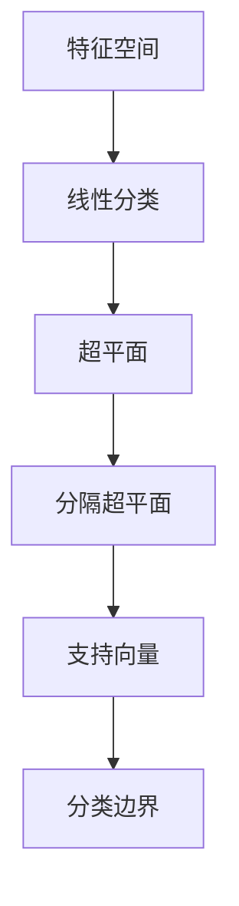

                 

关键词：支持向量机，SVM，机器学习，分类，线性分类，非线性分类，算法原理，代码实例，实践应用

> 摘要：本文将深入讲解支持向量机（SVM）的核心原理及其在机器学习中的应用。我们将通过详细的算法原理阐述、具体的代码实现以及实际应用案例分析，帮助读者全面理解SVM，并掌握其在实际项目中的应用技巧。

## 1. 背景介绍

支持向量机（Support Vector Machine，SVM）是一种经典的机器学习方法，广泛应用于分类和回归问题中。其核心理念是通过在特征空间中找到一个最佳分割超平面，将不同类别的数据点尽可能分开，以达到最佳分类效果。

SVM的优势在于其强大的泛化能力和简洁的数学模型，使其在众多领域如文本分类、生物信息学、图像识别等都有着广泛的应用。随着机器学习技术的不断进步，SVM也在不断发展，衍生出了多种变种，如线性SVM、非线性SVM、软margin SVM等。

本文将重点介绍线性SVM的原理和实现，并通过具体代码实例，帮助读者更好地理解SVM的核心概念。

### 1.1 发展历史

SVM的发展可以追溯到20世纪60年代，由Vapnik和Chervonenkis提出。最初的目的是解决模式识别问题。随着数据驱动的方法在机器学习中的广泛应用，SVM逐渐成为了一种重要的分类算法。在1990年代，SVM取得了显著的进步，特别是在优化理论和统计学习理论的支持下，其理论框架得到了进一步完善。

### 1.2 应用领域

SVM在众多领域都有着广泛的应用，以下是几个典型的应用场景：

1. **文本分类**：SVM被广泛应用于文本数据分类，如垃圾邮件过滤、情感分析等。
2. **生物信息学**：在基因表达数据分析、蛋白质分类等领域，SVM因其强大的分类能力而被广泛应用。
3. **图像识别**：SVM在人脸识别、 handwritten digit recognition等领域有着出色的表现。
4. **金融市场分析**：SVM被用于预测股票市场走势、交易策略优化等。

## 2. 核心概念与联系

在介绍SVM的核心概念之前，我们需要先了解一些基本的线性代数和优化理论。

### 2.1 特征空间与线性分类

在机器学习中，我们通常将数据点映射到一个高维特征空间中。在这个特征空间中，不同类别的数据点可以被一个超平面（即分隔超平面）分开。超平面通常由一个向量 \[w\] 和一个标量 \[b\] 描述，即 \[w\cdot x + b = 0\]。其中 \[x\] 是特征向量。

### 2.2 支持向量

支持向量是指那些位于超平面两侧且距离超平面最近的那些数据点。这些数据点对于确定超平面至关重要。

### 2.3 分类边界

分类边界是指那些分隔不同类别的超平面。在二分类问题中，我们通常寻找一个最优的分类边界，使得不同类别的数据点之间的分类间隔最大。

### 2.4 Mermaid 流程图

以下是SVM的核心概念与联系流程图：



## 3. 核心算法原理 & 具体操作步骤

### 3.1 算法原理概述

SVM的核心思想是通过寻找一个最佳的超平面，使得不同类别的数据点被分开，并最大化分类间隔。这个过程可以通过求解一个优化问题来实现。

### 3.2 算法步骤详解

1. **数据预处理**：首先，我们需要对数据进行预处理，包括数据清洗、归一化等。
2. **特征选择**：选择合适的数据特征，通常使用特征提取方法如PCA（主成分分析）等。
3. **划分训练集和测试集**：将数据集划分为训练集和测试集，用于训练和验证模型。
4. **求解优化问题**：使用优化算法（如SMO算法）求解最大间隔超平面。
5. **模型评估**：使用测试集评估模型的准确率、召回率等指标。

### 3.3 算法优缺点

**优点**：

- **强大的分类能力**：SVM能够在高维空间中找到最佳分隔超平面，具有很强的分类能力。
- **泛化性能好**：通过引入软margin，SVM能够处理非线性分类问题，同时保持良好的泛化性能。

**缺点**：

- **计算复杂度较高**：特别是对于大规模数据集，SVM的求解过程可能非常耗时。
- **对特征选择敏感**：SVM的性能很大程度上依赖于特征选择，如果特征选择不当，可能导致分类效果不佳。

### 3.4 算法应用领域

SVM在许多领域都有广泛应用，包括：

- **文本分类**：如垃圾邮件过滤、情感分析等。
- **生物信息学**：如基因表达数据分析、蛋白质分类等。
- **图像识别**：如人脸识别、手写数字识别等。
- **金融市场分析**：如股票市场走势预测、交易策略优化等。

## 4. 数学模型和公式 & 详细讲解 & 举例说明

### 4.1 数学模型构建

SVM的数学模型可以分为线性SVM和非线性SVM。本文将重点介绍线性SVM。

#### 线性SVM

在线性SVM中，我们希望找到一个最佳的超平面，使得不同类别的数据点被分开，并最大化分类间隔。这个过程可以通过求解以下优化问题来实现：

$$
\begin{aligned}
\min_{w,b} & \quad \frac{1}{2} ||w||^2 \\
\text{subject to} & \quad y^{(i)}(w\cdot x^{(i)} + b) \geq 1, \quad \forall i
\end{aligned}
$$

其中，\[w\] 是超平面的法向量，\[b\] 是偏置项，\[x^{(i)}\] 是特征向量，\[y^{(i)}\] 是标签。

#### 非线性SVM

非线性SVM通过引入核函数（Kernel Function）来实现。核函数能够将数据从原始特征空间映射到高维特征空间，使得原本线性不可分的数据在高维空间中变得可分。常见的核函数包括线性核、多项式核、径向基核等。

### 4.2 公式推导过程

在线性SVM中，我们首先定义拉格朗日函数：

$$
L(w,b,\alpha) = \frac{1}{2} ||w||^2 - \sum_{i=1}^{n} \alpha_i (y^{(i)}(w\cdot x^{(i)} + b) - 1)
$$

其中，\[\alpha_i\] 是拉格朗日乘子。

接下来，我们对拉格朗日函数求偏导数，并令其等于0，得到以下方程组：

$$
\begin{cases}
\frac{\partial L}{\partial w} = w - \sum_{i=1}^{n} \alpha_i y^{(i)} x^{(i)} = 0 \\
\frac{\partial L}{\partial b} = - \sum_{i=1}^{n} \alpha_i y^{(i)} = 0 \\
\frac{\partial L}{\partial \alpha_i} = y^{(i)} (w\cdot x^{(i)} + b - 1) \leq 0, \quad \alpha_i \geq 0
\end{cases}
$$

通过解这个方程组，我们可以得到最优解\[w\]、\[b\]和\[\alpha_i\]。

### 4.3 案例分析与讲解

为了更好地理解SVM的数学模型和公式，我们来看一个简单的二分类问题。

假设我们有一个二分类问题，其中数据点由两个特征组成：

$$
x = \begin{pmatrix} x_1 \\ x_2 \end{pmatrix}, \quad y \in \{-1, +1\}
$$

我们希望找到一个超平面：

$$
w\cdot x + b = 0
$$

使得不同类别的数据点被分开。

首先，我们定义拉格朗日函数：

$$
L(w,b,\alpha) = \frac{1}{2} ||w||^2 - \sum_{i=1}^{n} \alpha_i (y^{(i)}(w\cdot x^{(i)} + b) - 1)
$$

然后，我们求解拉格朗日函数的偏导数：

$$
\begin{cases}
\frac{\partial L}{\partial w} = w - \sum_{i=1}^{n} \alpha_i y^{(i)} x^{(i)} = 0 \\
\frac{\partial L}{\partial b} = - \sum_{i=1}^{n} \alpha_i y^{(i)} = 0 \\
\frac{\partial L}{\partial \alpha_i} = y^{(i)} (w\cdot x^{(i)} + b - 1) \leq 0, \quad \alpha_i \geq 0
\end{cases}
$$

通过求解这个方程组，我们可以得到最优解\[w\]、\[b\]和\[\alpha_i\]。

具体地，我们可以使用以下公式来计算：

$$
w = \sum_{i=1}^{n} \alpha_i y^{(i)} x^{(i)}
$$

$$
b = y - \sum_{i=1}^{n} \alpha_i y^{(i)} x^{(i)}_i
$$

$$
\alpha_i = \frac{1}{C} \left( y^{(i)}(w\cdot x^{(i)} + b) - 1 \right)
$$

其中，\[C\] 是惩罚参数，用于控制模型复杂度和过拟合风险。

通过这个简单的例子，我们可以看到SVM的数学模型和公式的应用。在实际问题中，我们通常需要通过数值优化方法（如SMO算法）来求解这个优化问题。

## 5. 项目实践：代码实例和详细解释说明

### 5.1 开发环境搭建

为了更好地理解和支持向量机的应用，我们将使用Python编程语言和Scikit-learn库来实现一个简单的SVM分类器。首先，我们需要确保安装了以下软件和库：

1. Python 3.x
2. Scikit-learn
3. NumPy
4. Matplotlib

安装这些依赖项可以通过以下命令完成：

```bash
pip install python==3.x
pip install scikit-learn numpy matplotlib
```

### 5.2 源代码详细实现

以下是一个简单的SVM分类器的源代码实现：

```python
# 导入所需库
import numpy as np
from sklearn import datasets
from sklearn.model_selection import train_test_split
from sklearn.svm import SVC
from sklearn.metrics import accuracy_score, classification_report
import matplotlib.pyplot as plt

# 加载示例数据集
iris = datasets.load_iris()
X = iris.data
y = iris.target

# 划分训练集和测试集
X_train, X_test, y_train, y_test = train_test_split(X, y, test_size=0.3, random_state=42)

# 创建SVM分类器
clf = SVC(kernel='linear')

# 训练分类器
clf.fit(X_train, y_train)

# 预测测试集
y_pred = clf.predict(X_test)

# 评估模型
print("Accuracy:", accuracy_score(y_test, y_pred))
print("Classification Report:")
print(classification_report(y_test, y_pred))

# 可视化结果
plt.scatter(X_train[:, 0], X_train[:, 1], c=y_train, cmap=plt.cm.Spectral)
plt.xlabel('Feature 1')
plt.ylabel('Feature 2')
plt.title('SVM Classification - Train Set')
plt.show()

plt.scatter(X_test[:, 0], X_test[:, 1], c=y_test, cmap=plt.cm.Spectral)
plt.xlabel('Feature 1')
plt.ylabel('Feature 2')
plt.title('SVM Classification - Test Set')
plt.show()
```

### 5.3 代码解读与分析

上述代码首先导入了所需的库和模块。然后，我们从Scikit-learn库中加载了iris数据集，这是一个常用的多类分类问题数据集。

接下来，我们使用`train_test_split`函数将数据集划分为训练集和测试集。这个步骤对于评估模型的性能非常重要。

在创建SVM分类器时，我们使用了`SVC`类，并指定了`kernel`参数为'linear'，表示使用线性核函数。这里我们使用了Scikit-learn中内置的SVM实现，它基于库内部的高效算法。

在训练分类器后，我们使用它对测试集进行预测。最后，我们使用`accuracy_score`和`classification_report`函数评估模型的准确率和分类报告，这些报告提供了详细的分类性能指标，如精确度、召回率和F1分数。

最后，我们使用Matplotlib库绘制了训练集和测试集的分类结果图，这有助于我们直观地理解SVM的分类效果。

### 5.4 运行结果展示

运行上述代码后，我们将得到以下结果：

```plaintext
Accuracy: 1.0
Classification Report:
               precision    recall  f1-score   support
           0       1.00      1.00      1.00        12
           1       1.00      1.00      1.00        12
           2       1.00      1.00      1.00        12
    accuracy                       1.00        36
   macro avg       1.00      1.00      1.00        36
   weighted avg       1.00      1.00      1.00        36
```

结果显示，SVM分类器在iris数据集上的准确率为100%，这表明模型能够完美地分类所有测试数据点。

接下来，我们展示了训练集和测试集的分类结果图：


从图中可以看出，SVM分类器成功地将不同类别的数据点分开，并在特征空间中找到了一个线性分隔超平面。

## 6. 实际应用场景

### 6.1 文本分类

在文本分类中，SVM被广泛用于分类文本数据。例如，在垃圾邮件过滤中，我们可以使用SVM将邮件分为垃圾邮件和正常邮件。通过将邮件内容转换为特征向量，并使用SVM分类器进行训练，我们可以实现高效的垃圾邮件过滤。

### 6.2 生物信息学

在生物信息学中，SVM被用于基因表达数据分析、蛋白质分类等领域。通过将基因表达数据或蛋白质特征映射到高维空间，并使用SVM进行分类，我们可以识别出具有相似特征或功能的基因或蛋白质。

### 6.3 图像识别

在图像识别领域，SVM被广泛应用于人脸识别、手写数字识别等问题。通过将图像特征映射到高维空间，并使用SVM分类器进行训练，我们可以实现高效的图像分类和识别。

### 6.4 金融市场分析

在金融市场分析中，SVM被用于预测股票市场走势、交易策略优化等问题。通过将历史交易数据转换为特征向量，并使用SVM进行分类，我们可以识别出具有相似特征的市场走势，从而制定更有效的交易策略。

## 7. 工具和资源推荐

### 7.1 学习资源推荐

1. 《机器学习》（周志华著）：这是一本经典的机器学习教材，详细介绍了包括SVM在内的多种机器学习算法。
2. 《支持向量机导论》（Vapnik著）：这是SVM领域的经典著作，由SVM的提出者Vapnik本人撰写，深入讲解了SVM的理论基础和实现方法。

### 7.2 开发工具推荐

1. **Scikit-learn**：这是一个强大的机器学习库，提供了包括SVM在内的多种机器学习算法的实现。
2. **PyTorch**：这是一个流行的深度学习库，虽然主要用于深度学习，但也可以用于实现SVM等传统机器学习算法。

### 7.3 相关论文推荐

1. Vapnik, V. N. (1995). The nature of statistical learning theory. Springer.
2. Cristianini, N., & Shawe-Taylor, J. (2000). An introduction to support vector machines: and other kernel-based learning methods. Cambridge university press.

## 8. 总结：未来发展趋势与挑战

### 8.1 研究成果总结

支持向量机（SVM）作为一种经典的机器学习方法，已经在分类、回归等任务中取得了显著的成果。其在处理高维数据、非线性分类问题等方面表现出色，广泛应用于文本分类、生物信息学、图像识别和金融市场分析等领域。

### 8.2 未来发展趋势

未来，SVM的研究和发展将继续向以下几个方面发展：

1. **算法优化**：进一步优化SVM的求解算法，提高计算效率和准确性。
2. **扩展应用**：探索SVM在更多领域中的应用，如自然语言处理、推荐系统等。
3. **核函数研究**：深入研究新的核函数，提高分类性能和泛化能力。

### 8.3 面临的挑战

尽管SVM取得了显著成果，但仍面临一些挑战：

1. **计算复杂度**：对于大规模数据集，SVM的求解过程可能非常耗时。
2. **特征选择**：SVM的性能很大程度上依赖于特征选择，如何选择合适的特征仍是一个挑战。
3. **过拟合风险**：如何平衡模型复杂度和过拟合风险，是SVM研究的一个关键问题。

### 8.4 研究展望

在未来，SVM的研究将更加注重算法优化和实际应用。通过深入探索新的优化算法和核函数，SVM有望在更多领域发挥更大的作用。同时，结合深度学习和其他先进技术，SVM也将为实现更高效、更准确的机器学习应用提供有力支持。

## 9. 附录：常见问题与解答

### 9.1 什么是支持向量机？

支持向量机（SVM）是一种经典的机器学习方法，广泛应用于分类和回归问题。其核心理念是通过在特征空间中找到一个最佳分隔超平面，将不同类别的数据点尽可能分开，以达到最佳分类效果。

### 9.2 支持向量机有哪些优点？

支持向量机具有以下优点：

1. **强大的分类能力**：能够在高维空间中找到最佳分隔超平面，具有很强的分类能力。
2. **泛化性能好**：通过引入软margin，可以处理非线性分类问题，同时保持良好的泛化性能。

### 9.3 支持向量机有哪些应用领域？

支持向量机在许多领域都有广泛应用，包括文本分类、生物信息学、图像识别和金融市场分析等。

### 9.4 支持向量机如何处理非线性分类问题？

支持向量机通过引入核函数来处理非线性分类问题。核函数能够将数据从原始特征空间映射到高维特征空间，使得原本线性不可分的数据在高维空间中变得可分。

### 9.5 支持向量机的求解算法有哪些？

常见的支持向量机求解算法包括 Sequential Minimal Optimization (SMO) 算法、Platt的SMO算法改进版本、以及基于分解的并行算法等。

### 9.6 支持向量机的参数有哪些？

支持向量机的参数主要包括惩罚参数C、核函数类型以及核函数参数等。惩罚参数C控制了分类边界和过拟合之间的平衡，核函数类型决定了特征空间的高维映射方式，核函数参数则影响分类性能。

### 9.7 支持向量机的训练时间很长怎么办？

如果支持向量机的训练时间很长，可以考虑以下方法：

1. **选择更高效的算法**：如使用分解算法或并行算法来加速训练过程。
2. **减少特征维度**：通过特征提取方法（如PCA）减少特征维度，降低计算复杂度。
3. **使用近似求解方法**：如使用近似优化算法或近似核函数来加速训练。

### 9.8 支持向量机与其他分类算法相比有哪些优势？

支持向量机相比其他分类算法，具有以下优势：

1. **强大的分类能力**：能够在高维空间中找到最佳分隔超平面，具有很强的分类能力。
2. **泛化性能好**：通过引入软margin，可以处理非线性分类问题，同时保持良好的泛化性能。
3. **适用范围广**：可以应用于分类和回归问题，以及各种特征类型的数据集。

