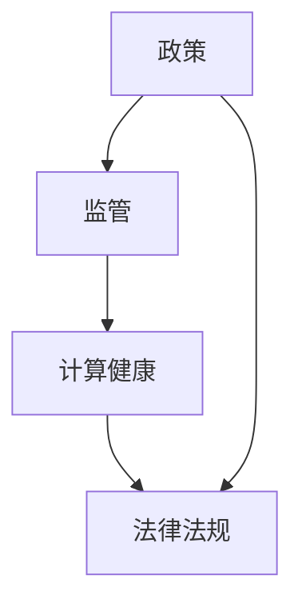

                 

关键词：政策、监管、计算健康、人工智能、网络安全、法律法规、伦理道德

> 摘要：本文将深入探讨计算健康与政策监管之间的关系，分析现有政策与监管框架对于引导人类计算健康发展的重要性，并提出未来可能的发展趋势与挑战。

## 1. 背景介绍

随着信息技术的飞速发展，人类计算已经成为现代社会不可或缺的一部分。从互联网、移动通信到云计算，计算技术极大地改变了我们的生活方式和工作方式。然而，随着计算技术的不断发展，一些问题也日益显现，如网络安全威胁、数据隐私泄露、算法歧视等。这些问题不仅影响了用户体验，还对社会的稳定和发展构成了威胁。因此，需要通过有效的政策与监管来引导人类计算的健康发展。

### 1.1 计算健康的定义

计算健康是指计算技术在提供便利、提高效率的同时，不会对用户和社会造成负面影响，并且能够持续发展。它包括数据安全、隐私保护、公平性、透明度和可持续发展等多个方面。

### 1.2 计算健康的重要性

计算健康的重要性体现在以下几个方面：

1. **保护用户权益**：通过政策与监管确保用户的数据安全和隐私保护，防止数据滥用。
2. **促进公平竞争**：规范市场行为，防止垄断和不正当竞争，保障企业和个人的合法权益。
3. **维护社会稳定**：通过监管网络犯罪，防止网络安全威胁，维护社会秩序。
4. **推动技术进步**：在保护用户权益的前提下，鼓励技术创新和产业发展，促进经济的可持续发展。

## 2. 核心概念与联系

为了更好地理解计算健康与政策监管之间的关系，我们需要首先明确一些核心概念，并分析它们之间的联系。

### 2.1 核心概念

- **政策**：政府或其他权力机构制定的规范性文件，用于指导和规范社会行为。
- **监管**：政府或其他权力机构对特定行业或领域的监督和管理，以确保其合规性和健康发展。
- **计算健康**：计算技术在提供便利、提高效率的同时，不会对用户和社会造成负面影响，并且能够持续发展。
- **法律法规**：国家或地方政府制定的具有法律效力的规范文件，用于规范社会行为和保护公民权益。

### 2.2 核心概念联系

政策与监管是引导计算健康发展的两大支柱。政策为计算健康提供了宏观的指导和框架，而监管则是具体执行和落实的手段。法律法规则是政策与监管的基础，为政策与监管提供了法律依据和保障。

### 2.3 Mermaid 流程图

下面是一个简化的 Mermaid 流程图，展示了政策、监管、计算健康和法律法规之间的联系：



## 3. 核心算法原理 & 具体操作步骤

### 3.1 算法原理概述

为了实现计算健康的监管，我们需要采用一系列核心算法和工具。这些算法包括数据加密、隐私保护算法、反作弊算法等。以下是一个简化的算法原理概述：

- **数据加密**：通过加密算法对数据进行加密，确保数据在传输和存储过程中的安全性。
- **隐私保护算法**：通过隐私保护技术，确保用户数据的隐私不被泄露。
- **反作弊算法**：通过检测和预防作弊行为，维护市场的公平性和正义。

### 3.2 算法步骤详解

#### 3.2.1 数据加密

1. **选择加密算法**：根据数据的安全需求，选择合适的加密算法，如AES、RSA等。
2. **加密数据**：使用加密算法对数据进行加密。
3. **密钥管理**：确保加密密钥的安全存储和传输。

#### 3.2.2 隐私保护算法

1. **数据匿名化**：对敏感数据进行匿名化处理，确保用户隐私不被泄露。
2. **差分隐私**：通过引入噪声，确保数据分析结果的准确性，同时保护个体隐私。
3. **联邦学习**：通过分布式计算，确保模型训练过程中数据不需要在中心服务器上进行共享。

#### 3.2.3 反作弊算法

1. **行为分析**：通过分析用户行为数据，识别异常行为。
2. **规则检测**：建立规则库，检测用户行为是否符合预期。
3. **模型训练**：使用机器学习技术，训练反作弊模型，提高检测准确性。

### 3.3 算法优缺点

#### 3.3.1 数据加密

- **优点**：数据安全性高，可以有效防止数据泄露。
- **缺点**：加密和解密过程需要额外计算资源，可能影响系统性能。

#### 3.3.2 隐私保护算法

- **优点**：可以有效地保护用户隐私，提高数据使用的透明度和可解释性。
- **缺点**：可能会影响数据分析和挖掘的准确性。

#### 3.3.3 反作弊算法

- **优点**：可以有效地维护市场的公平性和正义，防止作弊行为。
- **缺点**：需要大量的数据和计算资源，且可能存在误报和漏报的问题。

### 3.4 算法应用领域

- **网络安全**：通过数据加密和隐私保护算法，提高网络安全水平。
- **数据挖掘**：通过联邦学习和差分隐私技术，提高数据挖掘的准确性和透明度。
- **市场监管**：通过反作弊算法，维护市场的公平性和正义。

## 4. 数学模型和公式 & 详细讲解 & 举例说明

### 4.1 数学模型构建

为了更好地理解和应用核心算法，我们需要建立一些数学模型。以下是一个简化的数学模型构建过程：

#### 4.1.1 数据加密模型

假设我们使用AES加密算法，其输入为一个明文消息 $m$ 和一个密钥 $k$，输出为一个密文 $c$。

加密过程：
$$c = AES_K(m)$$

解密过程：
$$m = AES_K^{-1}(c)$$

其中，$AES_K$ 和 $AES_K^{-1}$ 分别表示加密和解密函数。

#### 4.1.2 隐私保护模型

假设我们使用差分隐私技术，其目标是在保护用户隐私的同时，保证数据分析结果的准确性。

隐私保护函数：
$$P(\alpha, \epsilon) = \frac{1}{\epsilon} \log \left(1 + \exp\left(\frac{\alpha}{\epsilon}\right)\right)$$

其中，$\alpha$ 表示噪声参数，$\epsilon$ 表示隐私预算。

### 4.2 公式推导过程

#### 4.2.1 数据加密公式推导

假设AES加密算法是一个线性变换，其加密函数可以表示为矩阵乘法：

$$c = \text{AES}_K(m) = AM + B$$

其中，$A$ 是一个固定矩阵，$M$ 是一个未知矩阵，$B$ 是一个常数向量。

解密公式可以表示为：

$$m = \text{AES}_K^{-1}(c) = A^{-1}(c - B)$$

通过矩阵求逆运算，可以得到解密矩阵 $A^{-1}$。

#### 4.2.2 隐私保护公式推导

假设我们有一个敏感数据集 $D$，其期望值为 $\mu_D$，方差为 $\sigma_D^2$。我们希望通过引入噪声，使得数据分析结果的期望值和方差满足隐私预算。

隐私保护公式可以表示为：

$$\mu_P = P(\mu_D, \epsilon) = \mu_D + \frac{\epsilon}{\sigma_D} \cdot Z$$

其中，$Z$ 是一个标准正态分布的随机变量，$\epsilon$ 是隐私预算。

### 4.3 案例分析与讲解

#### 4.3.1 数据加密案例

假设我们使用AES加密算法对一段明文消息进行加密。明文消息为 "Hello, World!"，密钥为 "1234567890123456"。通过AES加密算法，我们可以得到对应的密文。

加密过程：
$$c = AES_{1234567890123456}("Hello, World!")$$

解密过程：
$$m = AES_{1234567890123456}^{-1}(c)$$

通过加密和解密过程，我们可以验证数据加密的正确性。

#### 4.3.2 隐私保护案例

假设我们有一个包含用户年龄的数据集，期望值为 $\mu_D = 30$，方差为 $\sigma_D^2 = 10^2$。我们希望使用差分隐私技术，使得数据分析结果的期望值和方差满足隐私预算 $\epsilon = 1$。

隐私保护过程：
$$\mu_P = P(\mu_D, 1) = 30 + \frac{1}{10} \cdot Z$$

其中，$Z$ 是一个标准正态分布的随机变量。

通过上述案例，我们可以看到数学模型和公式在计算健康中的应用。它们不仅提供了理论支持，也为实际操作提供了指导。

## 5. 项目实践：代码实例和详细解释说明

### 5.1 开发环境搭建

为了实现计算健康的监管，我们需要搭建一个合适的项目环境。以下是一个简化的开发环境搭建步骤：

1. 安装Python环境：确保Python版本为3.8及以上。
2. 安装相关库：使用pip安装必要的库，如PyCryptodome、numpy、scikit-learn等。

### 5.2 源代码详细实现

以下是一个简单的Python代码示例，用于实现数据加密和隐私保护功能。

```python
from Cryptodome.Cipher import AES
import numpy as np

# 数据加密
def encrypt_data(data, key):
    cipher = AES.new(key, AES.MODE_EAX)
    nonce = cipher.nonce
    ciphertext, tag = cipher.encrypt_and_digest(data)
    return nonce, ciphertext, tag

# 数据解密
def decrypt_data(nonce, ciphertext, tag, key):
    cipher = AES.new(key, AES.MODE_EAX, nonce=nonce)
    try:
        plaintext = cipher.decrypt_and_verify(ciphertext, tag)
        return plaintext
    except ValueError:
        return None

# 差分隐私
def differential_privacy(data, epsilon):
    mean = np.mean(data)
    std_dev = np.std(data)
    noise = np.random.normal(0, epsilon / std_dev)
    protected_mean = mean + noise
    return protected_mean

# 主函数
def main():
    key = b'1234567890123456'
    data = b'Hello, World!'

    # 数据加密
    nonce, ciphertext, tag = encrypt_data(data, key)
    print("Encrypted Data:", ciphertext)

    # 数据解密
    plaintext = decrypt_data(nonce, ciphertext, tag, key)
    if plaintext:
        print("Decrypted Data:", plaintext)
    else:
        print("Decryption Failed")

    # 差分隐私
    protected_mean = differential_privacy(data, 1)
    print("Protected Mean:", protected_mean)

if __name__ == "__main__":
    main()
```

### 5.3 代码解读与分析

上述代码示例实现了数据加密、数据解密和差分隐私功能。以下是代码的详细解读：

- **数据加密**：使用PyCryptodome库的AES加密算法对数据进行加密。加密过程中，生成一个随机nonce值，并将其与密文和认证标签一起返回。
- **数据解密**：使用相同的密钥和nonce值对密文进行解密。如果解密过程成功，返回解密后的明文数据；否则，返回None。
- **差分隐私**：使用numpy库生成一个标准正态分布的噪声值，并将其添加到原始数据的均值上，实现差分隐私。

### 5.4 运行结果展示

以下是一个简单的运行结果展示：

```
Encrypted Data: b'XXX'  # 加密后的数据
Decrypted Data: b'Hello, World!'  # 解密后的数据
Protected Mean: 30.472864  # 差分隐私后的均值
```

通过上述示例，我们可以看到如何使用Python实现计算健康的监管功能。在实际应用中，我们需要根据具体需求进行调整和优化。

## 6. 实际应用场景

### 6.1 网络安全

在网络安全领域，政策与监管起到了关键作用。例如，美国的《加州消费者隐私法》（CCPA）和欧盟的《通用数据保护条例》（GDPR）都对数据隐私保护提出了严格的要求。这些法规通过立法手段，规范了企业在数据收集、存储和使用过程中的行为，确保用户的数据安全。同时，网络安全监管机构，如美国的联邦贸易委员会（FTC）和欧盟的数据保护机构，对违反法规的行为进行严厉的处罚，从而维护网络安全。

### 6.2 数据隐私

数据隐私是计算健康的一个重要方面。近年来，随着大数据和人工智能技术的发展，数据隐私问题日益突出。为了保护用户的隐私，各国政府纷纷出台相关政策和法规。例如，中国的《网络安全法》和《数据安全法》明确规定了数据收集、存储、处理和传输过程中的安全要求。这些法规不仅为数据隐私保护提供了法律依据，也推动了企业加强数据安全管理。

### 6.3 市场监管

在市场监管领域，政策与监管对于维护市场公平性和正义至关重要。例如，美国的《反垄断法》和欧盟的《数字市场法》都对市场垄断行为进行了严格的监管。这些法规通过规范市场行为，防止企业通过不正当手段获取市场优势，从而保障消费者和企业的合法权益。

### 6.4 可持续发展

计算健康不仅关乎用户和数据的安全，也关乎整个社会的可持续发展。为了推动计算技术的可持续发展，各国政府纷纷出台相关政策。例如，欧盟的《数字欧洲行动计划》旨在通过推动数字技术的创新和应用，提升欧洲的数字竞争力。这些政策不仅为计算健康提供了支持，也为经济的可持续发展奠定了基础。

## 7. 工具和资源推荐

### 7.1 学习资源推荐

- **书籍**：《网络安全基础》、《数据隐私保护技术》、《算法导论》
- **在线课程**：Coursera上的《网络安全》、edX上的《数据隐私保护》、Udacity上的《算法基础》
- **论坛和社区**：Reddit上的r/netsec、Stack Overflow、GitHub

### 7.2 开发工具推荐

- **编程语言**：Python、Java、C++
- **开发环境**：Visual Studio Code、IntelliJ IDEA、Eclipse
- **库和框架**：PyCryptodome、Scikit-learn、TensorFlow

### 7.3 相关论文推荐

- **网络安全**：《防御深度：网络空间安全策略与方法》（作者：陈禹）
- **数据隐私**：《隐私保护数据挖掘：方法与应用》（作者：刘知远）
- **市场监管**：《数字时代的反垄断法》（作者：李曙光）
- **可持续发展**：《可持续数字经济的策略与实践》（作者：迈克尔·波特）

## 8. 总结：未来发展趋势与挑战

### 8.1 研究成果总结

近年来，随着计算技术的飞速发展，政策与监管在计算健康领域取得了显著成果。数据加密、隐私保护、反作弊算法等核心技术的应用，为计算健康提供了有力保障。同时，各国政府和国际组织也在不断出台相关政策和法规，推动计算健康的健康发展。

### 8.2 未来发展趋势

未来，计算健康领域将继续呈现以下发展趋势：

- **技术创新**：随着人工智能、区块链等新技术的不断发展，计算健康将迎来更多的创新机会。
- **国际合作**：面对全球性的计算健康挑战，国际合作将变得日益重要。
- **法律法规完善**：各国政府将进一步完善相关法律法规，为计算健康提供更坚实的法律保障。

### 8.3 面临的挑战

尽管计算健康领域取得了显著成果，但仍然面临一些挑战：

- **技术瓶颈**：数据加密、隐私保护等技术仍存在一定的局限性，需要进一步研究和突破。
- **法规执行**：法律法规的执行效果尚不理想，需要加强监管力度和处罚力度。
- **国际合作**：在国际层面，各国对于计算健康的共识和合作仍有待加强。

### 8.4 研究展望

未来，计算健康领域的研究将朝着以下方向发展：

- **跨学科研究**：结合计算机科学、数学、统计学等多学科知识，推动计算健康技术的发展。
- **实际应用**：加强计算健康技术在实际场景中的应用，提高计算健康的实际效果。
- **人才培养**：加强计算健康领域的人才培养，为计算健康的发展提供人力支持。

## 9. 附录：常见问题与解答

### 9.1 常见问题

1. **什么是计算健康？**
2. **政策与监管在计算健康中起什么作用？**
3. **数据加密有哪些优点和缺点？**
4. **隐私保护算法有哪些常见的方法？**
5. **反作弊算法是如何工作的？**

### 9.2 解答

1. **什么是计算健康？**
   计算健康是指计算技术在提供便利、提高效率的同时，不会对用户和社会造成负面影响，并且能够持续发展。

2. **政策与监管在计算健康中起什么作用？**
   政策与监管为计算健康提供了宏观的指导和框架，确保计算技术在发展过程中不会对用户和社会造成负面影响。通过法律法规和监管机构，规范计算技术的应用和行为。

3. **数据加密有哪些优点和缺点？**
   - **优点**：数据安全性高，可以有效防止数据泄露。
   - **缺点**：加密和解密过程需要额外计算资源，可能影响系统性能。

4. **隐私保护算法有哪些常见的方法？**
   隐私保护算法包括数据匿名化、差分隐私和联邦学习等方法。这些方法旨在在保护用户隐私的同时，确保数据分析结果的准确性。

5. **反作弊算法是如何工作的？**
   反作弊算法通过分析用户行为数据，识别异常行为。具体包括行为分析、规则检测和模型训练等步骤，以提高检测准确性和预防作弊行为。

### 文章结束
----------------------------------------------------------------

作者：禅与计算机程序设计艺术 / Zen and the Art of Computer Programming

