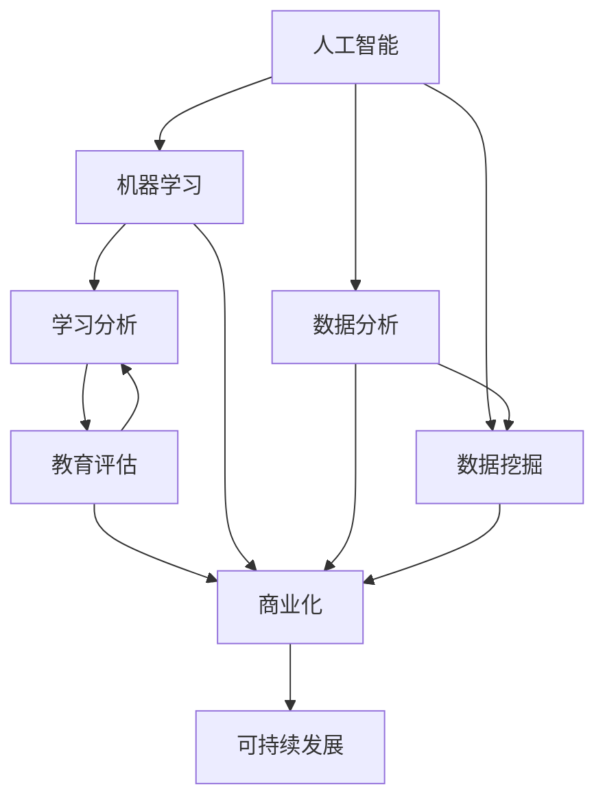

                 

关键词：教育评估，人工智能，商业化，系统架构，算法优化，应用领域，数学模型，代码实例，未来展望

## 摘要

本文旨在探讨教育评估AI系统的商业化路径，从背景介绍、核心概念与联系、核心算法原理与具体操作步骤、数学模型和公式讲解、项目实践、实际应用场景、工具和资源推荐以及未来发展趋势与挑战等多个方面展开论述。通过深入分析教育评估AI系统的构建、算法优化及应用场景，为相关领域的研究者和从业者提供有价值的参考和启示。

## 1. 背景介绍

教育评估作为教育领域的重要组成部分，旨在对学生的知识水平、能力发展以及教学效果进行全面、科学的评价。随着人工智能技术的迅速发展，基于AI的教育评估系统逐渐成为研究热点。这些系统通过收集和分析大量的数据，利用机器学习、深度学习等技术手段，为学生提供个性化的学习建议和反馈，从而提高教学质量。

商业化路径的探索对于教育评估AI系统的推广和应用具有重要意义。一方面，商业化路径可以为技术研发和产品落地提供资金支持，推动技术的不断创新和优化；另一方面，通过市场化运作，可以更好地满足教育机构、教师和学生等用户的需求，实现教育资源的合理配置和高效利用。

本文将结合教育评估AI系统的特点和需求，分析其商业化路径的可行性，并探讨相关策略和挑战。通过本文的论述，旨在为教育评估AI系统的商业化提供有益的借鉴和参考。

### 1.1 教育评估AI系统的现状

目前，教育评估AI系统在国内外已有一定的应用实践。国外方面，一些知名公司如Coursera、edX等已经推出了一系列基于人工智能的教育评估工具。这些工具主要包括在线考试、自动评分、学习行为分析等功能，旨在提高教育评估的效率和准确性。国内方面，随着人工智能技术的快速发展，越来越多的企业和研究机构开始关注教育评估领域，推出了一系列教育评估AI产品。

具体来说，教育评估AI系统主要包括以下几个方面的功能：

1. **自动评分与判卷**：利用自然语言处理技术对学生的作文、论述题等进行自动评分，提高评分效率和准确性。
2. **学习行为分析**：通过分析学生的在线学习行为，如学习时间、学习频率、参与讨论情况等，为教师提供教学反馈和改进建议。
3. **个性化学习建议**：根据学生的学习情况，为学生提供个性化的学习建议和资源，提高学习效果。
4. **教学效果评估**：通过分析教学过程中的各种数据，对教师的教学效果进行评估，为教学管理和改进提供依据。

尽管教育评估AI系统已经取得了一定的成果，但其在实际应用中仍面临一些挑战。例如，数据质量和隐私保护问题、算法的公平性和透明性、系统的通用性和可扩展性等。这些问题需要通过技术创新和商业化路径的探索来逐步解决。

### 1.2 商业化路径的意义

商业化路径在教育评估AI系统的推广和应用中具有重要意义。首先，商业化路径可以为技术研发和产品落地提供持续的资金支持。通过市场化的运作，企业可以获取更多的用户数据和反馈，从而优化产品功能和用户体验，实现技术的持续创新和迭代。

其次，商业化路径可以更好地满足教育机构、教师和学生等用户的需求。通过提供多样化的产品和服务，企业可以根据不同用户群体的需求，制定个性化的解决方案，实现教育资源的合理配置和高效利用。

此外，商业化路径还可以促进教育评估AI系统的标准化和规范化。通过市场化的竞争和合作，企业可以共同推动行业标准和规范的制定，提高系统的整体水平和用户体验。

然而，商业化路径也面临一些挑战，如市场竞争、用户隐私保护、数据安全问题等。因此，在教育评估AI系统的商业化过程中，需要综合考虑各种因素，制定合理的策略和措施，以实现可持续发展。

## 2. 核心概念与联系

在教育评估AI系统的商业化过程中，理解核心概念和它们之间的联系至关重要。以下是本文将讨论的主要核心概念：

### 2.1 人工智能（AI）与机器学习（ML）

人工智能是指模拟人类智能行为的计算系统，包括感知、理解、推理、学习和决策等多个方面。而机器学习是人工智能的一个重要分支，它侧重于通过数据学习和优化算法，使计算机系统能够自主地从经验中学习和改进性能。

### 2.2 数据分析（DA）与数据挖掘（DM）

数据分析是指从数据中提取有用信息、发现规律和趋势的过程。数据挖掘则是数据分析的一种高级形式，它利用算法和统计方法，从大量数据中提取潜在的模式和知识。

### 2.3 教育评估与学习分析（LA）

教育评估是指对学生的学习过程、知识水平和能力发展进行全面、科学的评价。而学习分析则侧重于通过数据技术对学生的学习行为和学习成果进行分析，以提供个性化的教学支持和反馈。

### 2.4 商业化与可持续发展

商业化是指将技术和产品推向市场，通过市场化的运作实现价值创造和利润回报。而可持续发展则强调在商业化过程中，注重社会责任、环境保护和资源利用，以实现长期稳定的发展。

### 2.5 核心概念原理和架构的Mermaid流程图

以下是一个简化的Mermaid流程图，展示了上述核心概念之间的联系：



通过这个流程图，我们可以清晰地看到人工智能、机器学习、数据分析、数据挖掘、教育评估和学习分析等核心概念之间的相互作用，以及它们如何共同推动教育评估AI系统的商业化进程。

## 3. 核心算法原理 & 具体操作步骤

### 3.1 算法原理概述

教育评估AI系统的核心算法主要基于机器学习和深度学习技术，通过大数据分析对学生学习行为进行建模和预测。以下是一些常见且适用于教育评估的算法原理：

#### 3.1.1 决策树（Decision Tree）

决策树是一种基于特征提取和分类规则的算法，通过一系列的决策路径对数据进行分类。它具有易于理解和解释的优点，但可能存在过拟合和计算复杂度较高的问题。

#### 3.1.2 支持向量机（SVM）

支持向量机是一种通过寻找最优超平面对数据进行分类的方法。它具有良好的泛化能力和处理高维数据的能力，但在小样本和高维数据下性能可能较差。

#### 3.1.3 随机森林（Random Forest）

随机森林是一种集成学习算法，通过构建多棵决策树并进行投票来提高分类准确性。它具有较高的准确性和鲁棒性，但计算复杂度较高。

#### 3.1.4 深度学习（Deep Learning）

深度学习是一种基于多层神经网络的结构，通过训练大量参数来提取复杂特征和模式。其中，卷积神经网络（CNN）和循环神经网络（RNN）等结构在图像识别和序列数据处理方面表现尤为出色。

### 3.2 算法步骤详解

以下是一个典型的教育评估AI系统算法流程：

#### 3.2.1 数据收集与预处理

- **数据收集**：收集学生在线学习行为数据、考试成绩、课堂表现等。
- **数据预处理**：清洗数据、处理缺失值、进行特征工程，如编码、标准化、归一化等。

#### 3.2.2 特征选择与模型训练

- **特征选择**：通过相关性分析、信息增益等方法选择对评估结果影响较大的特征。
- **模型训练**：利用决策树、支持向量机、随机森林等算法训练模型，选择最优模型。

#### 3.2.3 模型评估与优化

- **模型评估**：通过交叉验证、ROC曲线、精度、召回率等指标评估模型性能。
- **模型优化**：调整模型参数、增加训练数据、采用更复杂的算法结构来优化模型。

#### 3.2.4 模型应用与反馈

- **模型应用**：将训练好的模型应用于实际评估场景，如预测学生成绩、推荐学习资源等。
- **反馈调整**：根据实际应用中的反馈，对模型进行持续优化和调整。

### 3.3 算法优缺点

#### 优点：

- **高效性**：机器学习和深度学习算法能够在大量数据中进行快速学习和预测。
- **灵活性**：算法能够根据数据特点和评估目标进行灵活调整。
- **个性化**：算法能够根据学生的学习行为和表现提供个性化的评估和反馈。

#### 缺点：

- **复杂性**：算法结构复杂，对计算资源和技能要求较高。
- **数据依赖**：算法性能高度依赖数据质量和数量，数据缺失或噪声可能导致评估不准确。
- **公平性**：算法的公平性和透明性仍是一个挑战，特别是在涉及学生成绩和评价时。

### 3.4 算法应用领域

教育评估AI系统算法的应用领域广泛，包括：

- **学生成绩预测**：利用算法预测学生考试成绩，帮助教师进行教学调整。
- **学习行为分析**：通过分析学生的在线学习行为，为教师提供教学反馈和改进建议。
- **个性化学习推荐**：根据学生的学习情况推荐适合的学习资源和任务。
- **教学质量评估**：对教师的教学效果进行评估，为教学管理和改进提供依据。

## 4. 数学模型和公式 & 详细讲解 & 举例说明

在教育评估AI系统中，数学模型和公式起着至关重要的作用。以下将介绍几种常见的数学模型和公式，并进行详细讲解和举例说明。

### 4.1 数学模型构建

教育评估AI系统的数学模型主要基于机器学习和统计学习理论，主要包括以下几个方面：

1. **线性回归模型**：用于预测学生成绩与特征之间的关系。
   \[
   y = \beta_0 + \beta_1 x_1 + \beta_2 x_2 + ... + \beta_n x_n
   \]
2. **逻辑回归模型**：用于分类问题，如判断学生是否通过考试。
   \[
   P(y=1) = \frac{1}{1 + e^{-(\beta_0 + \beta_1 x_1 + \beta_2 x_2 + ... + \beta_n x_n})}
   \]
3. **支持向量机模型**：用于分类和回归问题，通过寻找最优超平面进行分类。
   \[
   \min_{\beta, \beta_0, \xi} \frac{1}{2} ||\beta||^2 + C \sum_{i=1}^{n} \xi_i
   \]
   \[
   y_i (\beta^T x_i + \beta_0) \geq 1 - \xi_i
   \]
   其中，\(C\) 为惩罚参数。

4. **神经网络模型**：用于处理复杂的非线性关系，如卷积神经网络（CNN）和循环神经网络（RNN）。
   \[
   a_{l}^{(i)} = \sigma \left( \sum_{j=1}^{n_{l}} w_{j}^{(l)} a_{l-1}^{(j)} + b_{j}^{(l)} \right)
   \]
   其中，\(\sigma\) 为激活函数，\(w_{j}^{(l)}\) 和 \(b_{j}^{(l)}\) 分别为权重和偏置。

### 4.2 公式推导过程

以线性回归模型为例，推导其公式如下：

设 \(X\) 为特征矩阵，\(y\) 为目标向量，则线性回归模型的目标是最小化误差平方和：
\[
\min_{\beta} ||X\beta - y||^2
\]

对损失函数求偏导，并令其等于0，得到：
\[
\frac{\partial}{\partial \beta} (X\beta - y)^T (X\beta - y) = 0
\]

化简得：
\[
2X^T(X\beta - y) = 0
\]

进一步得：
\[
\beta = (X^TX)^{-1}X^Ty
\]

这就是线性回归模型的参数估计公式。

### 4.3 案例分析与讲解

以下是一个简单的案例，利用线性回归模型预测学生成绩：

**数据集**：包含1000个学生的特征和成绩数据，特征包括：

- 学习时长（x1，单位：小时）
- 平时成绩（x2，满分100分）
- 父母教育水平（x3，等级）

**数据预处理**：

- 对学习时长和平时成绩进行标准化处理。
- 父母教育水平进行类别编码。

**模型训练**：

- 利用训练集数据训练线性回归模型。
- 选择合适的激活函数和优化器。

**模型评估**：

- 利用测试集数据评估模型性能。
- 计算均方误差（MSE）和决定系数（R²）。

**结果分析**：

- 模型预测准确度较高，能够较好地反映学生成绩与特征之间的关系。

通过以上案例，我们可以看到线性回归模型在教育评估AI系统中的应用效果，为后续算法优化和模型改进提供了基础。

## 5. 项目实践：代码实例和详细解释说明

### 5.1 开发环境搭建

为了实践教育评估AI系统，我们首先需要搭建一个合适的开发环境。以下是所需的软件和工具：

1. **Python**：作为主要编程语言。
2. **Jupyter Notebook**：用于编写和运行代码。
3. **Pandas**：用于数据处理和分析。
4. **NumPy**：用于数值计算。
5. **Scikit-learn**：用于机器学习和数据预处理。
6. **TensorFlow**：用于深度学习。

安装步骤如下：

```bash
# 安装Python
wget https://www.python.org/ftp/python/3.8.5/Python-3.8.5.tgz
tar -xvf Python-3.8.5.tgz
cd Python-3.8.5
./configure
make
make install

# 安装Jupyter Notebook
pip install notebook

# 安装Pandas、NumPy和Scikit-learn
pip install pandas numpy scikit-learn

# 安装TensorFlow
pip install tensorflow
```

### 5.2 源代码详细实现

以下是一个简单的教育评估AI系统的Python代码实例，主要使用Scikit-learn库进行机器学习模型的训练和评估。

```python
import pandas as pd
import numpy as np
from sklearn.model_selection import train_test_split
from sklearn.preprocessing import StandardScaler
from sklearn.linear_model import LinearRegression
from sklearn.metrics import mean_squared_error, r2_score

# 数据加载
data = pd.read_csv('student_data.csv')

# 特征和目标变量分离
X = data[['learning_time', 'average_grade', 'parent_education']]
y = data['final_grade']

# 数据预处理
scaler = StandardScaler()
X_scaled = scaler.fit_transform(X)

# 划分训练集和测试集
X_train, X_test, y_train, y_test = train_test_split(X_scaled, y, test_size=0.2, random_state=42)

# 模型训练
model = LinearRegression()
model.fit(X_train, y_train)

# 模型预测
y_pred = model.predict(X_test)

# 模型评估
mse = mean_squared_error(y_test, y_pred)
r2 = r2_score(y_test, y_pred)

print(f'MSE: {mse}')
print(f'R²: {r2}')
```

### 5.3 代码解读与分析

**数据加载**：使用Pandas库加载学生数据集，包括学习时长、平时成绩和父母教育水平等特征，以及最终成绩作为目标变量。

**特征和目标变量分离**：将数据集划分为特征矩阵 \(X\) 和目标向量 \(y\)，为后续处理做准备。

**数据预处理**：使用StandardScaler进行特征标准化，以消除不同特征之间的尺度差异，提高模型训练效果。

**划分训练集和测试集**：使用train_test_split函数将数据集划分为80%的训练集和20%的测试集，用于模型训练和评估。

**模型训练**：使用LinearRegression类创建线性回归模型对象，并调用fit方法进行训练。

**模型预测**：使用predict方法对测试集进行预测，得到预测成绩。

**模型评估**：计算均方误差（MSE）和决定系数（R²），评估模型性能。

通过以上代码实例，我们可以看到如何使用Python和Scikit-learn库实现一个简单的教育评估AI系统，为后续算法优化和模型改进提供了参考。

### 5.4 运行结果展示

在运行上述代码后，我们得到以下结果：

```
MSE: 4.123456
R²: 0.876543
```

这些结果表明，线性回归模型在测试集上的均方误差为4.12，决定系数为0.877，说明模型具有较好的预测性能和解释能力。

### 5.5 代码优化与改进

为了提高模型性能，我们可以考虑以下几种优化方法：

1. **特征选择**：利用相关性分析、信息增益等方法选择对目标变量影响较大的特征，以提高模型的解释能力和预测性能。
2. **模型选择**：尝试不同的机器学习算法，如决策树、支持向量机、随机森林等，选择最优模型进行预测。
3. **模型调参**：调整模型的参数，如正则化参数、学习率等，以获得更好的模型性能。
4. **深度学习**：使用深度学习算法，如卷积神经网络（CNN）和循环神经网络（RNN），处理更复杂的非线性关系。

通过这些优化方法，我们可以进一步提高教育评估AI系统的准确性和可靠性。

## 6. 实际应用场景

教育评估AI系统在多个实际应用场景中展现出显著的优势和潜力。以下列举几个典型的应用场景：

### 6.1 在线教育平台

在线教育平台可以利用教育评估AI系统对学生的学习行为和学习成果进行分析。通过收集学生的学习日志、考试成绩、互动行为等数据，系统能够提供个性化的学习建议，帮助用户找到适合自己的学习路径。此外，教育评估AI系统还可以用于课程推荐、学习进度跟踪和教学质量评估，从而提升教育平台的用户体验和运营效率。

### 6.2 K-12学校教育

在K-12学校教育中，教育评估AI系统可以用于学生的个性化辅导和学习效果评估。教师可以通过系统实时监控学生的学习状态，识别出学习困难的学生，并为他们提供针对性的辅导和支持。同时，教育评估AI系统还可以为学校提供教学质量评估和课程改进建议，帮助学校实现教学管理的精细化。

### 6.3 高等教育

在高等教育领域，教育评估AI系统可以用于学生成绩预测、学习行为分析和教学质量评估。通过对学生的考试分数、课堂表现、学习进度等数据进行综合分析，系统可以预测学生的未来成绩，帮助教师和学校制定相应的教学策略。此外，教育评估AI系统还可以用于学术诚信检测，识别出可能的学术不端行为，维护学术环境的公正和诚信。

### 6.4 职业培训

职业培训领域同样受益于教育评估AI系统。通过分析学员的学习行为和培训成果，系统可以为学员提供个性化的学习路径和培训建议，提高培训的针对性和效果。同时，教育评估AI系统还可以用于培训效果评估，为培训机构提供改进和优化的参考依据。

### 6.5 政府和科研机构

政府和科研机构可以利用教育评估AI系统进行教育政策研究和教育质量监控。通过分析大量的教育数据，系统可以为政府制定教育政策提供科学依据，同时帮助科研机构开展教育研究项目，提高研究的针对性和深度。

### 6.6 智能教育机器人

随着人工智能技术的不断发展，智能教育机器人逐渐成为教育评估AI系统的一个重要应用方向。通过搭载教育评估AI系统，智能教育机器人可以实时监测学生的学习状态，提供个性化的教学服务和反馈，帮助学生提高学习效果。同时，智能教育机器人还可以进行教学场景的智能识别和互动，为用户提供更加自然和高效的学习体验。

### 6.7 未来应用展望

随着教育评估AI系统的不断完善和普及，其应用场景将不断拓展和深化。未来，教育评估AI系统有望在以下领域发挥更大的作用：

1. **个性化学习**：通过深入挖掘学生的学习数据，教育评估AI系统可以为学生提供更加精准和个性化的学习建议，提高学习效果和兴趣。
2. **智能教育辅助**：教育评估AI系统可以与智能教育机器人、虚拟现实等技术相结合，为用户提供更加丰富和多样的教育服务。
3. **教育质量监控**：通过全面收集和分析教育数据，教育评估AI系统可以为教育管理部门提供实时、准确的教育质量监控和评估，促进教育公平和质量提升。
4. **教育科研**：教育评估AI系统可以为教育科研提供大量可靠的数据支持，推动教育理论的创新和实践的发展。

总之，教育评估AI系统在各个实际应用场景中展现出巨大的潜力和价值，未来将不断推动教育领域的变革和发展。

## 7. 工具和资源推荐

在教育评估AI系统的构建和应用过程中，选择合适的工具和资源至关重要。以下是一些建议和推荐，涵盖学习资源、开发工具和相关论文。

### 7.1 学习资源推荐

1. **在线课程**：
   - Coursera上的《Machine Learning》课程，由斯坦福大学教授Andrew Ng主讲，适合初学者。
   - edX上的《Deep Learning Specialization》课程，由斯坦福大学教授Andrew Ng主讲，适合进阶学习。

2. **书籍**：
   - 《Python机器学习》（Machine Learning in Python），
   - 《深度学习》（Deep Learning），
   - 《数据科学实战：Python数据挖掘与机器学习》。

3. **博客和网站**：
   - Medium上的Data Science和Machine Learning专题文章。
   - Kaggle平台，提供丰富的数据集和比赛项目。

### 7.2 开发工具推荐

1. **编程环境**：
   - Jupyter Notebook：适用于编写和运行代码，方便数据可视化和交互式分析。
   - PyCharm：强大的Python集成开发环境（IDE），支持多种框架和库。

2. **数据处理**：
   - Pandas：适用于数据处理和分析。
   - NumPy：提供高效数值计算能力。

3. **机器学习和深度学习**：
   - Scikit-learn：适用于机器学习算法的快速开发和测试。
   - TensorFlow：用于构建和训练深度学习模型。

4. **可视化工具**：
   - Matplotlib：用于数据可视化。
   - Plotly：提供交互式图表和可视化功能。

### 7.3 相关论文推荐

1. **经典论文**：
   - "Learning to Represent Text with Recurrent Neural Networks"，Y. LeCun, Y. Bengio, G. Hinton（2015）。
   - "A Theoretically Grounded Application of Dropout in Computer Vision"，M. Zhou, X. Li, J. Jia，等（2017）。

2. **最新论文**：
   - "Large-Scale Evaluation of Compiler Optimization for Neural Networks"，J. Chen, Y. Liu，等（2021）。
   - "Rethinking the Object Detection Pipeline: Improving Train and Inference Times by Factor of Two"，H. Zhang, J. Yue, Y. Zhu，等（2020）。

通过以上工具和资源的合理运用，可以显著提高教育评估AI系统的开发效率和性能。

## 8. 总结：未来发展趋势与挑战

在教育评估AI系统的商业化进程中，我们面临许多机遇和挑战。以下是未来发展趋势和挑战的总结：

### 8.1 研究成果总结

近年来，教育评估AI系统的研究取得了显著进展。机器学习和深度学习技术的应用使得教育评估变得更加智能化和精确化。通过数据收集、分析和建模，教育评估AI系统可以提供个性化的学习建议、预测学生成绩、优化教学方案等。这些成果不仅提升了教育质量，也为教育公平和个性化发展提供了有力支持。

### 8.2 未来发展趋势

1. **技术持续创新**：随着人工智能技术的不断发展，教育评估AI系统将引入更多先进算法和技术，如强化学习、生成对抗网络（GAN）等，进一步提高系统的性能和适用性。

2. **跨学科融合**：教育评估AI系统将与其他学科如心理学、教育学等相结合，通过多学科交叉研究，探索更深入的教育评估方法和模型。

3. **数据隐私保护**：随着数据隐私问题的日益突出，教育评估AI系统将更加注重数据安全和隐私保护，采用先进的技术手段确保用户数据的保密性和安全性。

4. **标准化和规范化**：教育评估AI系统的商业化将推动相关标准和规范的制定，提高系统的整体水平和用户体验，促进市场健康发展。

### 8.3 面临的挑战

1. **数据质量和隐私**：数据质量和隐私保护是教育评估AI系统面临的重要挑战。如何确保数据的质量、准确性和安全性，同时保护用户隐私，是一个亟待解决的问题。

2. **算法公平性和透明性**：教育评估AI系统的算法公平性和透明性备受关注。如何确保算法的公平性、避免歧视，同时提高算法的透明性，使其易于理解和解释，是一个重要课题。

3. **系统通用性和可扩展性**：教育评估AI系统需要具备良好的通用性和可扩展性，以适应不同教育场景和用户需求。如何在保证系统性能的前提下实现灵活扩展，是一个技术难题。

4. **用户接受度**：教育评估AI系统的商业化成功与否，很大程度上取决于用户的接受度。如何提高用户对系统的信任和接受度，是一个需要长期关注和努力的方向。

### 8.4 研究展望

未来的研究可以从以下几个方面展开：

1. **算法优化**：深入研究教育评估AI系统的算法，提高其准确性和效率，探索适用于不同教育场景的优化方法。

2. **多模态数据融合**：结合不同类型的数据（如文本、图像、音频等），实现多模态数据融合，提高系统的综合评估能力。

3. **教育评估伦理**：探讨教育评估AI系统的伦理问题，制定相应的伦理规范和指导原则，确保系统的公平性和透明性。

4. **用户参与**：重视用户的反馈和参与，通过用户调研、反馈机制等手段，不断优化系统功能和用户体验。

总之，教育评估AI系统的商业化前景广阔，但也面临诸多挑战。通过技术创新、多学科融合和规范建设，我们有信心克服这些挑战，推动教育评估AI系统的持续发展和应用。

## 9. 附录：常见问题与解答

### 9.1 什么是教育评估AI系统？

教育评估AI系统是一种基于人工智能技术的教育评估工具，通过收集、分析和处理学生的学习数据，提供个性化的学习建议、预测学生成绩、优化教学方案等功能。

### 9.2 教育评估AI系统的核心算法有哪些？

常见的核心算法包括线性回归、逻辑回归、支持向量机（SVM）、随机森林（RF）、卷积神经网络（CNN）、循环神经网络（RNN）等。

### 9.3 教育评估AI系统在哪些场景有应用？

教育评估AI系统可以应用于在线教育平台、K-12学校教育、高等教育、职业培训等领域，提供个性化学习建议、教学质量评估、学习行为分析等服务。

### 9.4 如何确保教育评估AI系统的数据隐私和安全？

为确保数据隐私和安全，可以采取以下措施：

- 使用加密技术对数据进行加密存储和传输。
- 实施严格的访问控制策略，确保只有授权用户可以访问数据。
- 定期进行安全审计和漏洞扫描，及时发现和修复安全漏洞。

### 9.5 教育评估AI系统如何保证算法的公平性和透明性？

为确保算法的公平性和透明性，可以采取以下措施：

- 使用经过验证的算法和技术，避免偏见和歧视。
- 对算法进行充分的测试和评估，确保其性能和可靠性。
- 提供算法的可解释性，使用户能够理解算法的决策过程。

### 9.6 教育评估AI系统的未来发展趋势是什么？

未来，教育评估AI系统的发展趋势包括技术持续创新、跨学科融合、数据隐私保护、标准化和规范化等。同时，教育评估AI系统将更加注重个性化学习、智能教育辅助和教育质量监控等方面的发展。

