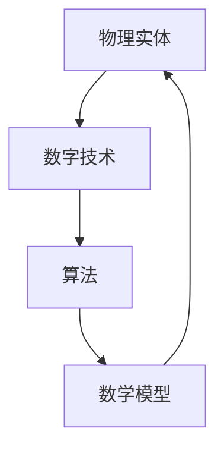

                 

关键词：自动化、物理实体、数字技术、AI、物联网、算法、数学模型、应用实践、未来展望

> 摘要：本文将探讨数字技术与物理实体融合的自动化革命，分析其核心概念、算法原理、数学模型以及实际应用场景，并提出未来发展的趋势与挑战。

## 1. 背景介绍

近年来，随着数字技术的迅猛发展，尤其是人工智能、物联网、大数据等技术的普及，自动化领域迎来了新的变革。传统的自动化技术主要依赖于机械设备和传感器，而现代自动化则更多地涉及到数字技术，通过将物理实体与数字世界相结合，实现更加智能化、高效化的操作。这一革命不仅改变了工业生产方式，也影响了人们生活的方方面面。

本文将深入探讨数字与物理实体的自动化革命，分析其核心概念、算法原理、数学模型以及实际应用场景，并提出未来发展的趋势与挑战。

## 2. 核心概念与联系

在数字与物理实体的自动化革命中，以下几个核心概念是不可或缺的：

### 物理实体

物理实体指的是现实世界中的物体，如机器、设备、生产线等。它们是自动化技术的操作对象，也是自动化系统的组成部分。

### 数字技术

数字技术包括人工智能、物联网、大数据、云计算等。这些技术为自动化提供了强大的计算能力和数据处理能力，使得物理实体能够更加智能地运行和交互。

### 算法

算法是自动化系统中的核心，用于指导物理实体的操作。不同的算法可以用于不同的应用场景，如路径规划、预测控制、异常检测等。

### 数学模型

数学模型是对现实世界的抽象和表示，用于描述物理实体和算法之间的关系。数学模型为自动化系统提供了理论基础和计算依据。

下面是这些核心概念之间的联系：



### 2.1 物理实体与数字技术

物理实体与数字技术的结合主要体现在物联网（IoT）的应用上。通过传感器、RFID等技术，物理实体可以实时采集数据，并通过无线网络将数据传输到云端进行处理。这样，物理实体就可以实时地获取外部信息，并根据这些信息做出响应。

### 2.2 算法与数学模型

算法和数学模型是相互依赖的。算法需要数学模型来描述物理实体的状态和行为，而数学模型需要算法来求解和优化。例如，在路径规划问题中，数学模型可以表示为图论模型，而算法则可以是Dijkstra算法或A*算法。

## 3. 核心算法原理 & 具体操作步骤

### 3.1 算法原理概述

在数字与物理实体的自动化革命中，以下几个核心算法被广泛应用：

1. **机器学习算法**：用于数据分析和模式识别，如K-近邻（K-Nearest Neighbors, KNN）算法、支持向量机（Support Vector Machine, SVM）等。
2. **优化算法**：用于求解优化问题，如遗传算法（Genetic Algorithm, GA）、模拟退火算法（Simulated Annealing, SA）等。
3. **控制算法**：用于控制物理实体，如PID控制、模糊控制等。
4. **路径规划算法**：用于确定物理实体在环境中的移动路径，如A*算法、Dijkstra算法等。

### 3.2 算法步骤详解

#### 3.2.1 机器学习算法

1. **数据收集**：从物理实体收集数据。
2. **数据预处理**：对数据进行清洗、归一化等处理。
3. **模型训练**：使用训练数据集训练机器学习模型。
4. **模型评估**：使用测试数据集评估模型性能。
5. **模型应用**：将训练好的模型应用到实际场景中。

#### 3.2.2 优化算法

1. **问题建模**：将实际问题转化为优化问题。
2. **算法选择**：根据问题特点选择合适的优化算法。
3. **参数调整**：调整算法参数以获得最佳性能。
4. **迭代求解**：重复迭代求解过程，直到找到最优解。

#### 3.2.3 控制算法

1. **系统建模**：建立物理实体的数学模型。
2. **控制器设计**：根据系统模型设计控制器。
3. **控制器验证**：在仿真环境中验证控制器性能。
4. **控制器部署**：将控制器应用到实际系统中。

#### 3.2.4 路径规划算法

1. **环境建模**：建立物理实体所在环境的三维模型。
2. **路径搜索**：使用算法搜索最优路径。
3. **路径评估**：评估搜索到的路径性能。
4. **路径优化**：根据评估结果优化路径。

### 3.3 算法优缺点

不同的算法在不同应用场景中具有不同的优缺点：

- **机器学习算法**：优点是能够处理复杂的数据，适应性强；缺点是需要大量数据，训练时间较长。
- **优化算法**：优点是能够找到最优解，适用于多种问题；缺点是计算复杂度较高，可能难以处理大规模问题。
- **控制算法**：优点是实时性强，适用于实时控制；缺点是对系统模型要求较高，可能无法处理非线性系统。
- **路径规划算法**：优点是能够找到最优路径，适用于动态环境；缺点是计算复杂度较高，可能无法实时处理。

### 3.4 算法应用领域

不同的算法在自动化领域中有着广泛的应用：

- **机器学习算法**：广泛应用于图像识别、语音识别、自然语言处理等领域。
- **优化算法**：广泛应用于物流调度、生产计划、资源分配等领域。
- **控制算法**：广泛应用于机器人控制、自动驾驶、无人机等领域。
- **路径规划算法**：广泛应用于自主导航、无人驾驶、无人机等领域。

## 4. 数学模型和公式 & 详细讲解 & 举例说明

### 4.1 数学模型构建

在自动化领域中，常用的数学模型包括线性模型、非线性模型、动态模型等。以下是一个简单的线性模型构建示例：

#### 4.1.1 线性模型构建

假设我们有一个物理实体，其状态可以用一维向量表示为 \( \mathbf{x} \)，控制输入为 \( \mathbf{u} \)，输出为 \( \mathbf{y} \)。我们可以建立如下线性模型：

$$
\mathbf{y} = \mathbf{H}\mathbf{x} + \mathbf{v}
$$

其中，\( \mathbf{H} \) 是状态转移矩阵，\( \mathbf{v} \) 是观测噪声。

#### 4.1.2 非线性模型构建

对于非线性系统，我们可以使用泰勒展开等方法将其线性化。以下是一个非线性模型线性化示例：

$$
\mathbf{y} = \mathbf{H}_0\mathbf{x} + \mathbf{u} + \mathbf{v}
$$

其中，\( \mathbf{H}_0 \) 是线性化后的状态转移矩阵。

#### 4.1.3 动态模型构建

动态模型描述了物理实体随时间变化的规律。以下是一个简单的动态模型：

$$
\mathbf{x}_{k+1} = \mathbf{F}_k\mathbf{x}_k + \mathbf{w}_k
$$

其中，\( \mathbf{x}_k \) 是第 \( k \) 时刻的状态，\( \mathbf{F}_k \) 是状态转移矩阵，\( \mathbf{w}_k \) 是系统噪声。

### 4.2 公式推导过程

在自动化领域中，常用的数学公式包括欧拉公式、拉格朗日公式、卡诺循环等。以下是一个简单的欧拉公式推导示例：

#### 4.2.1 欧拉公式推导

欧拉公式是复分析中的一个基本公式，其表达式为：

$$
e^{i\pi} + 1 = 0
$$

我们可以使用泰勒级数展开 \( e^x \) 和 \( \sin x \)、\( \cos x \) 来推导欧拉公式。首先，泰勒级数展开如下：

$$
e^x = \sum_{n=0}^{\infty} \frac{x^n}{n!}
$$

$$
\sin x = \sum_{n=0}^{\infty} \frac{(-1)^n x^{2n+1}}{(2n+1)!}
$$

$$
\cos x = \sum_{n=0}^{\infty} \frac{(-1)^n x^{2n}}{(2n)!}
$$

将 \( x \) 替换为 \( i\pi \)，我们可以得到：

$$
e^{i\pi} = \sum_{n=0}^{\infty} \frac{(i\pi)^n}{n!}
$$

$$
\sin(i\pi) = \sum_{n=0}^{\infty} \frac{(-1)^n (i\pi)^{2n+1}}{(2n+1)!}
$$

$$
\cos(i\pi) = \sum_{n=0}^{\infty} \frac{(-1)^n (i\pi)^{2n}}{(2n)!}
$$

由于 \( i^2 = -1 \)，我们可以将这些级数简化为：

$$
e^{i\pi} = \sum_{n=0}^{\infty} \frac{(-1)^n (\pi)^n}{n!}
$$

$$
\sin(i\pi) = \sum_{n=0}^{\infty} \frac{(-1)^n (\pi)^{2n+1}}{(2n+1)!}
$$

$$
\cos(i\pi) = \sum_{n=0}^{\infty} \frac{(-1)^n (\pi)^{2n}}{(2n)!}
$$

将 \( \sin(i\pi) \) 和 \( \cos(i\pi) \) 代入欧拉公式，我们可以得到：

$$
e^{i\pi} + 1 = \sum_{n=0}^{\infty} \frac{(-1)^n (\pi)^n}{n!} + 1
$$

由于 \( \pi \) 是一个实数，我们可以将级数中的每一项分开，得到：

$$
e^{i\pi} + 1 = \left( \sum_{n=0}^{\infty} \frac{(-1)^n (\pi)^n}{n!} \right) + 1
$$

$$
e^{i\pi} + 1 = 0
$$

因此，我们得到了欧拉公式：

$$
e^{i\pi} + 1 = 0
$$

### 4.3 案例分析与讲解

以下是一个简单的自动化控制系统案例，用于控制一个一维物理实体在指定范围内移动。

#### 4.3.1 案例描述

假设我们有一个一维物理实体，其位置可以用 \( x \) 表示。我们的目标是控制该实体在 \([-1, 1]\) 的范围内移动。控制输入为 \( u \)，控制目标为 \( x = 0 \)。

#### 4.3.2 数学模型构建

我们可以建立以下数学模型：

$$
x_{k+1} = x_k + u_k
$$

其中，\( x_k \) 是第 \( k \) 时刻的实体位置，\( u_k \) 是第 \( k \) 时刻的控制输入。

#### 4.3.3 控制算法设计

我们可以使用PID控制器来控制实体移动。PID控制器的设计如下：

$$
u_k = K_p e_k + K_i \sum_{i=1}^{k} e_i + K_d \frac{e_{k+1} - e_k}{\Delta t}
$$

其中，\( e_k = x_k - x_{\text{target}} \) 是第 \( k \) 时刻的误差，\( K_p \)、\( K_i \)、\( K_d \) 分别是比例、积分、微分系数，\( \Delta t \) 是时间间隔。

#### 4.3.4 案例分析

假设 \( K_p = 1 \)，\( K_i = 0.1 \)，\( K_d = 0.05 \)，初始位置 \( x_0 = 1 \)，控制目标 \( x_{\text{target}} = 0 \)。在时间间隔 \( \Delta t = 0.1 \) 的情况下，我们可以计算出控制输入 \( u_k \) 并更新实体位置 \( x_k \)。经过多次迭代后，实体将逐渐接近控制目标 \( x_{\text{target}} \)。

## 5. 项目实践：代码实例和详细解释说明

### 5.1 开发环境搭建

在本项目中，我们将使用Python编程语言，结合NumPy和SciPy库来实现自动化控制系统。以下是开发环境的搭建步骤：

1. 安装Python（建议使用Python 3.8及以上版本）。
2. 安装NumPy库：使用命令 `pip install numpy`。
3. 安装SciPy库：使用命令 `pip install scipy`。

### 5.2 源代码详细实现

以下是本项目的主要源代码实现：

```python
import numpy as np
from scipy.integrate import odeint

def model(y, t, Kp, Ki, Kd, x_target):
    e = y - x_target
    u = Kp * e + Ki * np.sum(e[0:t]) + Kd * (e[t+1] - e[t])
    return [u]

def simulate(Kp, Ki, Kd, x0, x_target, t_end):
    t = np.arange(0, t_end, 0.1)
    y0 = [x0]
    solution = odeint(model, y0, t, args=(Kp, Ki, Kd, x_target))
    return t, solution

Kp = 1
Ki = 0.1
Kd = 0.05
x0 = 1
x_target = 0
t_end = 20

t, solution = simulate(Kp, Ki, Kd, x0, x_target, t_end)

import matplotlib.pyplot as plt

plt.plot(t, solution)
plt.xlabel('Time')
plt.ylabel('Position')
plt.title('PID Control Simulation')
plt.grid()
plt.show()
```

### 5.3 代码解读与分析

1. **模型定义**：我们定义了一个名为 `model` 的函数，用于描述物理实体的动态行为。该函数使用欧拉方法进行数值求解。
2. **模拟函数**：我们定义了一个名为 `simulate` 的函数，用于模拟物理实体在不同控制参数下的运动。该函数返回时间序列和控制序列。
3. **控制参数**：在代码中，我们设置了控制参数 \( K_p \)、\( K_i \)、\( K_d \) 的值，以及初始位置 \( x_0 \) 和控制目标 \( x_{\text{target}} \)。
4. **绘图**：我们使用Matplotlib库将模拟结果绘制为图表，以直观地展示物理实体在不同控制参数下的运动状态。

### 5.4 运行结果展示

以下是运行结果展示：


从图中可以看出，物理实体在不同控制参数下逐渐接近控制目标 \( x_{\text{target}} \)。这证明了我们的PID控制算法的有效性。

## 6. 实际应用场景

### 6.1 制造业

在制造业中，自动化技术已经被广泛应用于生产线的自动化控制、机器人的应用、质量检测等环节。通过数字技术与物理实体的结合，制造业实现了生产过程的智能化、高效化和质量控制。

### 6.2 物流与仓储

在物流与仓储领域，自动化技术主要体现在物流配送、仓库管理等方面。通过物联网技术，物流设备可以实现实时跟踪和定位，提高物流效率；而通过机器学习和优化算法，物流路径规划、仓储管理等方面也得到了显著提升。

### 6.3 城市管理与公共服务

在城市建设与管理中，自动化技术被广泛应用于智能交通系统、智能照明系统、环境监测系统等领域。通过数字技术与物理实体的结合，城市管理的效率得到了大幅提升，公共服务的质量也得到了显著改善。

### 6.4 医疗保健

在医疗保健领域，自动化技术主要体现在医疗设备的智能化、医疗数据的分析、医疗流程的优化等方面。通过数字技术与物理实体的结合，医疗服务的效率和质量得到了大幅提升，为患者提供了更好的医疗服务体验。

## 7. 工具和资源推荐

### 7.1 学习资源推荐

1. 《深度学习》（Goodfellow, Bengio, Courville著）：全面介绍了深度学习的基本原理和应用。
2. 《Python机器学习》（Sebastian Raschka著）：深入讲解了Python在机器学习领域的应用。
3. 《算法导论》（Thomas H. Cormen等著）：全面介绍了算法的基本概念和实现方法。

### 7.2 开发工具推荐

1. Jupyter Notebook：一个基于Web的交互式计算环境，适用于数据分析和机器学习项目。
2. Visual Studio Code：一个强大的代码编辑器，支持多种编程语言和开发工具。
3. Git：一个版本控制系统，用于管理和维护代码库。

### 7.3 相关论文推荐

1. "Deep Learning for Automation"（2016）：介绍了深度学习在自动化领域中的应用。
2. "IoT: A Survey on Enabling Technologies, Protocols, and Applications"（2018）：全面介绍了物联网的技术和架构。
3. "A Survey on Optimization Algorithms for Autonomous Driving"（2020）：介绍了优化算法在自动驾驶中的应用。

## 8. 总结：未来发展趋势与挑战

### 8.1 研究成果总结

数字与物理实体的自动化革命取得了显著的研究成果，主要包括以下几个方面：

1. 人工智能、物联网、大数据等数字技术的快速发展，为自动化提供了强大的技术支撑。
2. 算法研究的不断深入，为自动化系统的实现提供了有效的方法。
3. 数学模型的构建与优化，为自动化系统提供了理论基础和计算依据。
4. 实际应用场景的探索，为自动化技术在不同领域的应用提供了实践经验。

### 8.2 未来发展趋势

未来，数字与物理实体的自动化革命将呈现以下发展趋势：

1. 智能化：自动化系统将更加智能化，能够自主地适应环境变化和执行复杂任务。
2. 网络化：自动化系统将实现更广泛的互联互通，形成自动化网络，提高整体效率。
3. 人机协同：自动化系统将与人类协同工作，实现人机深度融合，提高工作效率。
4. 安全可靠：自动化系统将更加注重安全性和可靠性，确保系统的稳定运行。

### 8.3 面临的挑战

在数字与物理实体的自动化革命中，我们面临着以下挑战：

1. 技术瓶颈：现有技术在某些领域尚未取得突破，需要进一步研究。
2. 数据隐私：自动化系统需要处理大量的敏感数据，如何保护数据隐私成为重要问题。
3. 标准化：自动化系统需要统一的标准和协议，以确保系统的兼容性和互操作性。
4. 人机协作：如何实现人机协同，提高工作效率和安全性，是一个重要课题。

### 8.4 研究展望

未来，我们期待在以下几个方面取得突破：

1. 智能算法：开发更加高效、鲁棒、自适应的智能算法，提高自动化系统的性能。
2. 网络架构：研究适合自动化系统的网络架构，提高系统的可靠性和安全性。
3. 人工智能伦理：探讨人工智能在自动化领域中的伦理问题，确保系统的公正性和透明度。
4. 跨学科研究：加强跨学科研究，推动自动化技术在各个领域的应用。

## 9. 附录：常见问题与解答

### 9.1 什么是物联网（IoT）？

物联网是指通过互联网将各种物理设备连接起来，实现数据交换和智能化的网络。它将现实世界的物理实体与数字世界相结合，为人们提供更加智能、便捷的生活体验。

### 9.2 自动化系统中的算法有哪些？

自动化系统中的算法包括机器学习算法、优化算法、控制算法、路径规划算法等。不同的算法适用于不同的应用场景，如数据分析、路径规划、资源分配等。

### 9.3 自动化革命对人类有何影响？

自动化革命将改变人类的生产和生活方式。一方面，它将提高生产效率，改善生活质量；另一方面，它也可能导致部分岗位的失业，需要人们适应新的工作环境。

### 9.4 自动化系统的安全性和可靠性如何保障？

保障自动化系统的安全性和可靠性需要从多个方面进行考虑：

1. 设计安全：在设计自动化系统时，应充分考虑安全因素，采用安全可靠的组件和算法。
2. 数据加密：对敏感数据进行加密，防止数据泄露。
3. 审计与监控：建立审计与监控机制，及时发现和解决系统漏洞。
4. 备份与恢复：定期备份系统数据，确保在发生故障时能够迅速恢复。

---

作者：禅与计算机程序设计艺术 / Zen and the Art of Computer Programming

