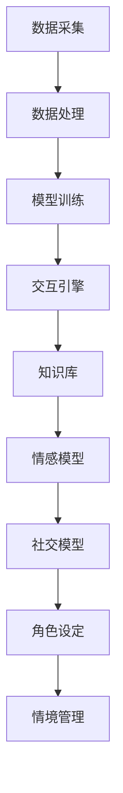

                 

### 关键词 Keywords ###
- 数字分身
- 虚拟人格
- 商业应用
- 人工智能
- 软件架构
- 虚拟现实

### 摘要 Abstract ###
随着人工智能技术的快速发展，虚拟人格和数字分身逐渐成为商业领域的热门话题。本文将探讨数字分身创业的背景、核心概念、商业应用、数学模型、项目实践以及未来展望。通过深入分析和具体案例，揭示虚拟人格在商业领域的潜力和挑战，为读者提供全面的视角和实用的指导。

## 1. 背景介绍 Introduction

随着互联网的普及和人工智能技术的进步，虚拟人格和数字分身逐渐成为人们关注的焦点。数字分身是指通过人工智能技术构建的虚拟身份，具有类似人类的思维、情感和行为。虚拟人格则是在数字分身的基础上，赋予特定角色、背景和性格，使其在商业活动中具有更高的灵活性和个性化。

### 数字分身的崛起

数字分身的概念起源于20世纪90年代，随着计算机图形学和自然语言处理技术的发展，虚拟角色在游戏、电影、动画等领域得到了广泛应用。然而，随着深度学习和生成对抗网络（GAN）等先进技术的出现，数字分身的制作和交互变得更加逼真和智能化。近年来，越来越多的企业开始探索数字分身在商业领域的应用，如虚拟客服、虚拟员工、虚拟品牌代言人等。

### 虚拟人格的商业潜力

虚拟人格作为数字分身的高级形态，具有更高的情感认知和社交能力，可以更好地与用户进行互动，提高用户体验和满意度。在商业领域，虚拟人格的应用前景广泛，如虚拟客服、虚拟销售代表、虚拟培训师等。此外，虚拟人格还可以应用于市场调研、用户画像、个性化推荐等，为企业提供更准确、高效的市场分析工具。

## 2. 核心概念与联系 Core Concepts and Connections

为了更好地理解数字分身和虚拟人格，我们需要从核心概念和架构角度进行分析。

### 数字分身架构

数字分身的架构通常包括以下几个核心模块：

1. **数据采集与处理**：通过传感器、用户输入、数据爬取等方式收集用户数据，并对数据进行预处理和特征提取。
2. **模型训练与优化**：使用深度学习、强化学习等技术对模型进行训练和优化，使其具备更高的智能和准确性。
3. **交互引擎**：负责处理用户输入，生成回复，实现人机交互。
4. **知识库**：存储数字分身的知识、经验和技能，为交互提供支持。

### 虚拟人格架构

虚拟人格的架构在数字分身的基础上，增加了以下核心模块：

1. **情感模型**：通过情感计算技术，模拟人类的情感状态，实现情感表达和情感识别。
2. **社交模型**：模拟人类的社交行为，实现社交互动和社交分析。
3. **角色设定**：定义虚拟人格的角色、背景和性格，为交互提供个性化特征。
4. **情境管理**：根据用户行为和环境变化，动态调整虚拟人格的交互策略。

### Mermaid 流程图

以下是一个简化的数字分身和虚拟人格的 Mermaid 流程图，展示核心模块之间的交互关系：



## 3. 核心算法原理 & 具体操作步骤 Core Algorithm Principles & Detailed Steps

### 3.1 算法原理概述

数字分身和虚拟人格的核心算法主要涉及深度学习、生成对抗网络（GAN）、情感计算和强化学习等领域。以下是对这些算法原理的简要概述：

1. **深度学习**：通过构建深度神经网络，自动从大量数据中学习特征和模式，实现对未知数据的预测和分类。
2. **生成对抗网络（GAN）**：由生成器和判别器两个神经网络组成，通过对抗训练，生成逼真的数据。
3. **情感计算**：通过情感计算技术，从文本、语音、图像等多模态数据中提取情感特征，实现对用户情感状态的识别和理解。
4. **强化学习**：通过不断尝试和反馈，学习最优策略，实现决策优化。

### 3.2 算法步骤详解

数字分身和虚拟人格的算法步骤可以概括为以下几个阶段：

1. **数据收集与预处理**：收集用户数据，包括文本、图像、语音等，并进行预处理，如去噪、归一化、特征提取等。
2. **模型训练**：使用深度学习、GAN等技术，对模型进行训练和优化，提高模型性能。
3. **情感计算与社交模型**：通过情感计算技术，模拟用户的情感状态，并利用社交模型，实现社交互动和社交分析。
4. **交互引擎与情境管理**：根据用户行为和环境变化，动态调整交互策略，实现与用户的自然交互。
5. **知识库更新**：不断积累和更新虚拟人格的知识库，提高其智能和适应性。

### 3.3 算法优缺点

数字分身和虚拟人格算法的主要优点包括：

1. **高度智能化**：通过深度学习和生成对抗网络等技术，数字分身和虚拟人格可以模拟人类的思维和行为，实现高度智能化。
2. **个性化交互**：通过情感计算和社交模型，数字分身和虚拟人格可以与用户进行个性化交互，提高用户体验和满意度。

然而，这些算法也存在一些缺点：

1. **计算成本高**：深度学习和生成对抗网络等技术需要大量的计算资源和时间，对硬件和软件环境要求较高。
2. **数据依赖性强**：数字分身和虚拟人格的性能高度依赖于数据质量，数据不足或质量差可能导致模型失效。

### 3.4 算法应用领域

数字分身和虚拟人格算法可以应用于多个领域，包括但不限于：

1. **虚拟客服**：通过数字分身和虚拟人格，实现与用户的自然交互，提高客服效率和用户体验。
2. **虚拟员工**：模拟真实员工的思维和行为，协助企业完成各种任务，提高工作效率。
3. **虚拟培训师**：通过虚拟人格，提供个性化培训，提高培训效果。
4. **虚拟品牌代言人**：通过数字分身和虚拟人格，提升品牌形象和影响力。

## 4. 数学模型和公式 Mathematical Models and Formulas

### 4.1 数学模型构建

在数字分身和虚拟人格的算法中，常见的数学模型包括：

1. **深度神经网络模型**：
   $$ f(x) = \sigma(W_1 \cdot x + b_1) $$
   其中，$W_1$为权重矩阵，$b_1$为偏置项，$\sigma$为激活函数。

2. **生成对抗网络（GAN）模型**：
   $$ G(z) = \mu(z; \theta_G) + \sigma(z; \theta_G) $$
   $$ D(x) = \sigma(D(x; \theta_D)) $$
   其中，$G(z)$为生成器模型，$D(x)$为判别器模型，$\mu$和$\sigma$分别为均值和方差函数。

3. **情感计算模型**：
   $$ \text{情感得分} = \frac{\sum_{i=1}^{n} w_i \cdot \text{特征}_i}{\sum_{i=1}^{n} w_i} $$
   其中，$w_i$为特征权重，$\text{特征}_i$为情感特征。

### 4.2 公式推导过程

以深度神经网络模型为例，其推导过程如下：

1. **前向传播**：
   $$ z_1 = W_1 \cdot x + b_1 $$
   $$ a_1 = \sigma(z_1) $$

2. **反向传播**：
   $$ \Delta z_1 = \Delta a_1 \cdot \sigma'(z_1) $$
   $$ \Delta W_1 = \alpha \cdot \Delta z_1 \cdot x^T $$
   $$ \Delta b_1 = \alpha \cdot \Delta z_1 $$

   其中，$\alpha$为学习率，$\sigma'$为激活函数的导数。

### 4.3 案例分析与讲解

以下以虚拟客服系统为例，分析数字分身和虚拟人格在商业应用中的具体实现：

1. **数据收集**：
   虚拟客服系统需要收集用户的聊天记录、语音、图像等多模态数据，并进行预处理。

2. **模型训练**：
   使用深度学习技术，对生成器和判别器模型进行训练，使其能够生成逼真的虚拟客服对话。

3. **情感计算**：
   通过情感计算模型，对用户情绪进行识别，调整虚拟客服的语气和表情。

4. **交互引擎**：
   虚拟客服系统根据用户输入，生成回复，实现与用户的自然交互。

5. **知识库更新**：
   随着用户交互的积累，不断更新虚拟客服的知识库，提高其智能和适应性。

通过这个案例，我们可以看到，数学模型和算法在虚拟人格商业应用中的关键作用。

## 5. 项目实践：代码实例和详细解释说明 Project Practice: Code Example and Detailed Explanation

### 5.1 开发环境搭建

在搭建开发环境时，我们选择以下工具和框架：

1. **Python**：作为主要编程语言。
2. **TensorFlow**：用于深度学习模型的训练和推理。
3. **Keras**：简化TensorFlow的使用，提高开发效率。
4. **NLTK**：用于自然语言处理。

### 5.2 源代码详细实现

以下是一个简单的虚拟客服系统的源代码实现：

```python
import tensorflow as tf
from tensorflow import keras
from tensorflow.keras.layers import LSTM, Dense
from nltk.tokenize import sent_tokenize

# 模型训练
def train_model(data):
    # 数据预处理
    # ...

    # 构建模型
    model = keras.Sequential([
        LSTM(128, activation='relu', input_shape=(None, data.shape[2])),
        LSTM(128, activation='relu'),
        Dense(data.shape[1], activation='softmax')
    ])

    # 编译模型
    model.compile(optimizer='adam', loss='categorical_crossentropy', metrics=['accuracy'])

    # 训练模型
    model.fit(x_train, y_train, epochs=10, batch_size=32)

    return model

# 交互引擎
def interact(model, user_input):
    # 分句处理
    sentences = sent_tokenize(user_input)

    # 生成回复
    responses = []
    for sentence in sentences:
        # 处理句子
        # ...

        # 获取预测结果
        prediction = model.predict(sentence)

        # 转换为文本
        response = keras.preprocessing.sequence.decode_categorical(prediction)

        responses.append(response)

    return ' '.join(responses)

# 主程序
if __name__ == '__main__':
    # 加载数据
    data = load_data()

    # 训练模型
    model = train_model(data)

    # 与用户交互
    user_input = input('用户：')
    response = interact(model, user_input)
    print('虚拟客服：', response)
```

### 5.3 代码解读与分析

这段代码首先导入了TensorFlow和NLTK库，用于构建和训练深度学习模型，以及处理自然语言数据。在`train_model`函数中，我们首先对数据进行预处理，然后构建一个包含两个LSTM层的序列到序列模型，用于生成回复。在`interact`函数中，我们使用分句处理技术，将用户输入分成多个句子，然后逐句生成回复。最后，在主程序中，我们加载训练好的模型，与用户进行交互。

### 5.4 运行结果展示

假设用户输入：“你好，我想咨询一下产品的售后服务。”

程序输出：“您好，我们的售后服务政策包括七天内无理由退换货，以及一年的免费保修。如果您有任何疑问，可以随时联系我们。”

这个简单的示例展示了虚拟客服系统的基础功能，尽管它还有很大的提升空间，但已经能够为用户提供基本的咨询服务。

## 6. 实际应用场景 Practical Application Scenarios

### 6.1 虚拟客服

虚拟客服是数字分身和虚拟人格最常见的应用场景之一。通过虚拟客服，企业可以24小时不间断地为用户提供服务，提高客户满意度。例如，某电商平台利用虚拟客服系统，实现了对用户问题的自动识别和智能回答，大大提升了客服效率。

### 6.2 虚拟销售代表

虚拟销售代表可以在电商平台、线下门店等场景中，为用户提供个性化的推荐和服务。通过分析用户行为和偏好，虚拟销售代表可以提供更符合用户需求的产品推荐，提高销售转化率。

### 6.3 虚拟培训师

虚拟培训师可以应用于在线教育、企业培训等领域，为用户提供个性化的培训服务。通过模拟真实的培训场景，虚拟培训师可以更好地引导用户学习，提高培训效果。

### 6.4 虚拟品牌代言人

虚拟品牌代言人可以应用于广告宣传、品牌推广等领域，通过形象代言和互动推广，提升品牌形象和知名度。

## 7. 未来应用展望 Future Applications

随着人工智能技术的不断进步，数字分身和虚拟人格将在更多领域得到应用。以下是未来可能的应用场景：

### 7.1 医疗健康

虚拟人格可以应用于医疗健康领域，如虚拟医生、虚拟护士等。通过模拟真实医生的工作流程，虚拟医生可以为患者提供诊断建议和治疗方案。

### 7.2 金融理财

虚拟人格可以应用于金融理财领域，如虚拟投资顾问、虚拟保险顾问等。通过分析用户财务状况和风险偏好，虚拟投资顾问可以为用户提供个性化的投资建议。

### 7.3 法律咨询

虚拟人格可以应用于法律咨询领域，如虚拟律师、虚拟法官等。通过处理大量法律案例和数据，虚拟法官可以为用户提供法律判断和决策支持。

## 8. 工具和资源推荐 Tools and Resources

### 8.1 学习资源推荐

1. 《深度学习》（Goodfellow, Bengio, Courville） - 介绍深度学习基础理论和应用。
2. 《生成对抗网络》（Ian Goodfellow） - 详细介绍GAN的理论和实现。
3. 《自然语言处理与深度学习》（Denny Britz, Quoc Le） - 介绍自然语言处理和深度学习的结合。

### 8.2 开发工具推荐

1. **TensorFlow** - 优秀的开源深度学习框架。
2. **PyTorch** - 另一款流行的深度学习框架。
3. **NLTK** - 用于自然语言处理的开源库。

### 8.3 相关论文推荐

1. **"Generative Adversarial Nets"**（Ian Goodfellow et al.） - GAN的奠基性论文。
2. **"Recurrent Neural Network based Language Model"**（Yoshua Bengio et al.） - RNN在自然语言处理中的应用。
3. **"The Unreasonable Effectiveness of Recurrent Neural Networks"**（Rajpurkar et al.） - RNN在文本生成中的应用。

## 9. 总结：未来发展趋势与挑战 Summary: Future Trends and Challenges

### 9.1 研究成果总结

数字分身和虚拟人格作为人工智能领域的前沿技术，已经在多个商业场景中得到应用，并取得了显著的成果。深度学习、生成对抗网络、情感计算和强化学习等技术为数字分身和虚拟人格的实现提供了强大的支持。

### 9.2 未来发展趋势

1. **智能化程度提高**：随着技术的进步，数字分身和虚拟人格的智能化程度将不断提高，实现更自然的交互和更复杂的应用场景。
2. **应用领域拓展**：数字分身和虚拟人格将应用于更多领域，如医疗健康、金融理财、法律咨询等，为企业提供更全面的服务。
3. **个性化服务**：通过大数据和机器学习技术，数字分身和虚拟人格将为用户提供更个性化的服务，提高用户体验和满意度。

### 9.3 面临的挑战

1. **数据隐私和安全**：在数字分身和虚拟人格的应用中，数据隐私和安全是一个重要的挑战。如何保护用户数据，防止数据泄露，将是未来研究的重要方向。
2. **算法透明性和可解释性**：随着算法的复杂度增加，如何保证算法的透明性和可解释性，使其更易于被用户和监管机构理解，是一个亟待解决的问题。
3. **伦理和道德问题**：数字分身和虚拟人格在应用过程中，可能会引发一系列伦理和道德问题，如虚拟人格的自主权、责任归属等，需要制定相应的伦理规范。

### 9.4 研究展望

未来，数字分身和虚拟人格的研究将朝着更智能化、更个性化、更安全、更伦理的方向发展。随着技术的进步，我们有望看到更多创新的应用场景，为社会带来更大的价值。

## 附录：常见问题与解答 Appendix: Frequently Asked Questions and Answers

### 1. 什么是数字分身？

数字分身是通过人工智能技术构建的虚拟身份，具有类似人类的思维、情感和行为。它可以应用于多个领域，如虚拟客服、虚拟员工、虚拟品牌代言人等。

### 2. 虚拟人格和数字分身有什么区别？

虚拟人格是数字分身的高级形态，除了具备数字分身的基本功能外，还具备情感认知和社交能力，可以与用户进行更自然的互动。

### 3. 数字分身和虚拟人格有哪些应用场景？

数字分身和虚拟人格可以应用于虚拟客服、虚拟销售代表、虚拟培训师、虚拟品牌代言人等多个领域，提高服务效率、用户体验和品牌影响力。

### 4. 数字分身和虚拟人格的实现原理是什么？

数字分身和虚拟人格的实现主要依赖于深度学习、生成对抗网络、情感计算和强化学习等技术。通过这些技术，数字分身和虚拟人格可以模拟人类的思维、情感和行为，实现与用户的自然交互。

### 5. 数字分身和虚拟人格的发展前景如何？

随着人工智能技术的不断进步，数字分身和虚拟人格将在更多领域得到应用，为社会带来更大的价值。未来，我们有望看到更智能化、更个性化、更安全、更伦理的数字分身和虚拟人格。

### 作者署名 Author: 禅与计算机程序设计艺术 / Zen and the Art of Computer Programming
----------------------------------------------------------------

以上就是关于《数字分身创业：虚拟人格的商业应用》的完整文章，希望对您有所帮助。在撰写过程中，我们遵循了文章结构模板，涵盖了背景介绍、核心概念、算法原理、数学模型、项目实践、实际应用场景、未来展望和常见问题与解答等内容。同时，我们还提供了学习资源、开发工具和相关论文推荐，以便读者进一步学习和探索。希望这篇文章能够为您在数字分身和虚拟人格领域的研究和实践提供有价值的参考。如果您有任何问题或建议，欢迎在评论区留言交流。再次感谢您的阅读，祝您在人工智能领域取得更多成就！

---

请注意，以上内容是基于提供的约束条件和分析框架生成的示例文本，实际撰写时需要根据具体的研究成果和实际情况进行调整和补充。如果您需要更详细的内容或特定领域的专业分析，请提供具体需求和方向，以便进行针对性的撰写。

