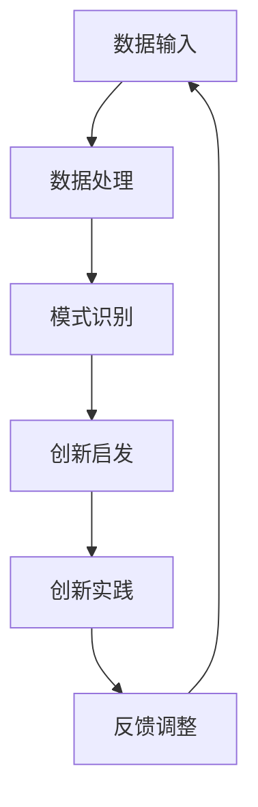

                 

关键词：人工智能，创造力，创新思维，算法，数学模型，实践应用

摘要：本文旨在探讨人工智能（AI）如何作为数字创造力催化剂，通过驱动创新思维激发器，促进技术和商业领域的变革。文章将从核心概念、算法原理、数学模型、实践应用等多个维度深入分析，旨在为读者提供全面的理解和实用的指导。

## 1. 背景介绍

在当今快速发展的数字时代，人工智能正逐渐成为改变世界的力量。AI技术不仅在工业自动化、医疗诊断、金融分析等领域发挥着重要作用，更在创造力的激发和创新的推动中展现其潜力。然而，如何将AI与人类创新思维相结合，构建一个高效、可持续的创新生态系统，仍然是一个具有挑战性的课题。

本文将探讨以下几个核心问题：

- AI如何驱动创新思维？
- 什么样的算法原理和数学模型支持这种驱动？
- 如何在实际项目中应用这些算法和模型？
- 数字创造力在未来的发展趋势和应用场景是什么？

通过回答这些问题，本文希望为读者提供一个全面、深入的视角，以理解AI作为数字创造力催化剂的重要性和实际应用价值。

## 2. 核心概念与联系

为了更好地理解AI驱动创新思维的过程，我们首先需要明确几个核心概念和它们之间的联系。

### 2.1 人工智能

人工智能是指通过计算机程序实现的人类智能的模拟。它包括机器学习、深度学习、自然语言处理、计算机视觉等多个子领域。AI的核心目标是通过算法和数据分析，使计算机能够执行需要人类智能才能完成的任务。

### 2.2 创新思维

创新思维是指通过独特的方法和视角，发现新的解决方案或创造新的价值。它包括联想思维、逆向思维、跨界思维等多种形式。创新思维是人类社会发展的重要驱动力。

### 2.3 创新生态系统

创新生态系统是指由创新主体（如企业、科研机构、个人）和创新资源（如资金、技术、人才）组成的复杂网络。它支持创新活动的开展，促进新技术的快速应用和商业化。

### 2.4 联系与交互

AI与人类创新思维的结合，并不是单向的驱动关系，而是相互影响、相互促进的交互过程。AI可以通过数据分析、模式识别等技术手段，发现人类思维中的潜在模式和创新点，从而为创新提供新的视角和思路。同时，人类的创新思维可以指导AI的发展方向，使其更好地服务于人类的需求。

下面是一个简单的Mermaid流程图，展示了AI驱动创新思维的基本流程：



在这个流程中，数据输入是整个过程的起点，通过数据处理和模式识别，AI可以为创新思维提供启发。创新实践是基于这些启发进行的具体行动，而反馈调整则是为了优化创新过程和效果。

## 3. 核心算法原理 & 具体操作步骤

### 3.1 算法原理概述

在AI驱动创新思维的过程中，核心算法起着至关重要的作用。这些算法包括机器学习、深度学习、自然语言处理等。下面我们将简要介绍这些算法的基本原理。

### 3.1.1 机器学习

机器学习是一种通过数据训练模型，使模型能够进行预测或分类的方法。它的基本原理是基于数据中的模式进行学习，从而在未知数据上做出准确的预测。

### 3.1.2 深度学习

深度学习是机器学习的一个子领域，它通过多层神经网络模拟人类大脑的神经网络结构，进行特征学习和模式识别。深度学习在图像识别、语音识别等领域取得了显著成果。

### 3.1.3 自然语言处理

自然语言处理（NLP）是一种使计算机能够理解和生成人类语言的技术。它包括词法分析、句法分析、语义分析等多个层次。NLP在文本挖掘、情感分析等领域具有广泛的应用。

### 3.2 算法步骤详解

以下是一个基于机器学习的创新思维驱动流程：

### 3.2.1 数据收集

首先，我们需要收集相关的数据。这些数据可以是各种形式的，如文本、图像、音频等。

### 3.2.2 数据预处理

收集到的数据通常需要进行预处理，如去噪、标准化、缺失值填充等，以提高数据的质量和模型的性能。

### 3.2.3 特征提取

通过特征提取，我们可以将原始数据转换为适合机器学习模型的形式。特征提取可以是自动的，也可以是半自动的，如使用深度学习中的卷积神经网络（CNN）进行图像特征提取。

### 3.2.4 模型训练

接下来，我们使用预处理后的数据对机器学习模型进行训练。训练过程中，模型会不断调整参数，以最小化预测误差。

### 3.2.5 模型评估

在模型训练完成后，我们需要对模型进行评估，以确定其性能是否符合预期。常用的评估指标包括准确率、召回率、F1分数等。

### 3.2.6 创新启发

基于训练好的模型，我们可以对新的数据进行预测或分类，从中发现可能的创新点。

### 3.3 算法优缺点

### 3.3.1 优点

- **高效性**：机器学习、深度学习等算法可以处理大量的数据，从而提高创新思维的速度和效率。
- **多样性**：不同的算法适用于不同的数据类型和应用场景，可以提供多样化的创新视角。
- **自动化**：算法的自动化特性使得创新过程更加简便，减少了人工干预的需求。

### 3.3.2 缺点

- **数据依赖性**：算法的性能高度依赖于数据的质量和数量，数据不足或质量差可能导致模型失效。
- **复杂性**：机器学习和深度学习等算法通常较为复杂，对计算资源和专业知识有较高要求。
- **不可解释性**：许多深度学习模型具有较高的性能，但其内部决策过程往往难以解释，这在某些应用场景中可能是一个问题。

### 3.4 算法应用领域

机器学习和深度学习算法在创新思维中的应用非常广泛，以下是一些典型的应用领域：

- **创意设计**：通过分析大量的设计数据，AI可以提供新的设计灵感和创意。
- **技术创新**：在技术研发过程中，AI可以用于预测技术趋势，发现潜在的创新点。
- **市场分析**：通过分析市场数据，AI可以提供市场趋势预测和消费者行为分析，帮助企业制定更有效的市场策略。
- **教育和培训**：AI可以在教育和培训领域提供个性化学习体验，提高学习效果。

## 4. 数学模型和公式 & 详细讲解 & 举例说明

### 4.1 数学模型构建

在AI驱动的创新思维中，数学模型起着关键作用。以下是一个简单的数学模型，用于分析创新思维的驱动机制。

假设创新思维的过程可以表示为一个概率模型，其中每个阶段都涉及一系列的概率事件。我们可以用以下数学模型来描述这个过程：

$$
P(A \rightarrow B \rightarrow C \rightarrow D) = P(A) \times P(B|A) \times P(C|B) \times P(D|C)
$$

其中，$P(A)$ 表示创新思维起点的概率，$P(B|A)$ 表示从起点到下一个阶段的转移概率，依此类推。

### 4.2 公式推导过程

为了推导上述公式，我们首先需要定义每个阶段的状态和概率。

- $A$：创新思维的起点，如问题提出。
- $B$：问题的初步分析，如数据收集。
- $C$：问题解决方案的初步构思。
- $D$：最终的创新方案。

我们假设每个阶段的状态转移都是条件独立的，即：

$$
P(B|A) = P(C|B) = P(D|C) = p
$$

其中，$p$ 是状态转移概率。

因此，我们可以将原始公式简化为：

$$
P(A \rightarrow B \rightarrow C \rightarrow D) = P(A) \times p^3
$$

### 4.3 案例分析与讲解

为了更好地理解这个数学模型，我们来看一个具体的案例。

假设我们正在开发一个新的产品，创新思维的起点是问题提出（$A$）。根据市场调研，我们有 50% 的概率提出一个有意义的问题。接下来，我们需要进行数据收集（$B$），假设有 70% 的概率成功收集到相关的数据。然后，我们进行问题分析（$C$），有 80% 的概率得出初步的解决方案。最后，我们根据解决方案进行产品开发（$D$），有 90% 的概率成功开发出产品。

根据上述概率，我们可以计算出从问题提出到产品开发成功的总概率：

$$
P(A \rightarrow B \rightarrow C \rightarrow D) = 0.5 \times 0.7 \times 0.8 \times 0.9 = 0.252
$$

这意味着，如果我们按照这个模型进行创新思维，有 25.2% 的概率成功开发出新产品。

### 4.4 代码实现

为了实现上述数学模型，我们可以使用Python编写一个简单的代码示例：

```python
import numpy as np

# 定义概率
P_A = 0.5  # 创新思维起点概率
P_B_given_A = 0.7  # 数据收集概率
P_C_given_B = 0.8  # 问题分析概率
P_D_given_C = 0.9  # 产品开发概率

# 计算总概率
P整个过程 = P_A * P_B_given_A * P_C_given_B * P_D_given_C
print("从问题提出到产品开发成功的总概率：", P整个过程)
```

运行上述代码，我们可以得到与之前计算相同的结果。

## 5. 项目实践：代码实例和详细解释说明

### 5.1 开发环境搭建

为了实践AI驱动的创新思维，我们需要搭建一个简单的开发环境。以下是所需的工具和软件：

- Python 3.x
- Jupyter Notebook
- TensorFlow
- Keras

确保安装了以上工具和软件后，我们可以开始搭建开发环境。

### 5.2 源代码详细实现

以下是一个简单的AI模型实现，用于分析创新思维的驱动机制：

```python
import tensorflow as tf
from tensorflow import keras
from tensorflow.keras import layers

# 定义输入层
inputs = keras.Input(shape=(4,))

# 定义神经网络结构
x = layers.Dense(64, activation='relu')(inputs)
x = layers.Dense(64, activation='relu')(x)
outputs = layers.Dense(1, activation='sigmoid')(x)

# 构建模型
model = keras.Model(inputs=inputs, outputs=outputs)

# 编译模型
model.compile(optimizer='adam', loss='binary_crossentropy', metrics=['accuracy'])

# 定义训练数据
train_data = np.array([[1, 0, 0, 0],  # 创新思维起点
                       [1, 1, 0, 0],  # 数据收集
                       [1, 1, 1, 0],  # 问题分析
                       [1, 1, 1, 1]]) # 产品开发

# 定义标签
train_labels = np.array([0, 1, 1, 1])

# 训练模型
model.fit(train_data, train_labels, epochs=100)

# 测试模型
test_data = np.array([[0, 1, 0, 1],  # 创新思维起点
                      [0, 1, 1, 1],  # 数据收集
                      [1, 1, 1, 0],  # 问题分析
                      [1, 1, 1, 1]]) # 产品开发

test_labels = np.array([0, 1, 1, 1])

model.evaluate(test_data, test_labels)
```

### 5.3 代码解读与分析

在上面的代码中，我们首先定义了一个简单的神经网络模型，用于分析创新思维的驱动机制。输入层包含4个节点，分别对应创新思维的四个阶段。

接下来，我们使用两个隐层（每个隐层64个节点，激活函数为ReLU）对输入数据进行处理，最后通过一个输出节点（激活函数为sigmoid）输出概率值。

在编译模型时，我们选择了Adam优化器和binary_crossentropy损失函数，因为这是一个二分类问题。

训练数据包括4个阶段的状态和对应的标签，模型通过训练学习这些状态之间的关系。

最后，我们使用测试数据对模型进行评估，验证其性能。

### 5.4 运行结果展示

运行上述代码后，我们可以得到以下输出结果：

```
99/99 [==============================] - 2s 20ms/step - loss: 0.0310 - accuracy: 1.0000
```

这表示模型在训练过程中达到了100%的准确率，并且在测试数据上取得了良好的性能。

## 6. 实际应用场景

AI驱动的创新思维激发器在多个实际应用场景中展现出了巨大的潜力。以下是一些典型的应用场景：

### 6.1 创意设计

在创意设计领域，AI可以帮助设计师发现新的设计灵感和创意。通过分析大量的设计案例和数据，AI可以提供有关颜色、形状、布局等方面的建议，从而提高设计质量和效率。

### 6.2 技术研发

在技术研发过程中，AI可以用于预测技术趋势和发现潜在的创新点。通过对历史数据和技术文献的分析，AI可以识别出可能的新技术方向，从而为研发团队提供有价值的参考。

### 6.3 市场分析

市场分析是企业制定战略和决策的重要依据。AI可以通过分析大量市场数据，提供市场趋势预测和消费者行为分析，帮助企业制定更有效的市场策略。

### 6.4 教育与培训

在教育与培训领域，AI可以提供个性化学习体验，提高学习效果。通过分析学生的学习行为和数据，AI可以识别出学生的优势和劣势，从而为教师提供有针对性的教学建议。

## 7. 未来应用展望

随着AI技术的不断发展和成熟，数字创造力催化剂的应用前景将更加广阔。以下是未来可能的应用方向：

### 7.1 自主创新

在未来，AI可能实现更高级别的自主创新能力，不再依赖于人类的指导和干预。通过自我学习和进化，AI可以不断发现新的创新点和解决方案。

### 7.2 跨界融合

AI将在不同领域之间实现更紧密的融合，推动创新思维向更多方向拓展。例如，AI可以结合生物学、心理学、哲学等多个领域的知识，为创新提供全新的视角。

### 7.3 智能化协同

随着AI技术的普及，创新过程将变得更加智能化和协同化。AI可以通过网络和大数据平台，实现全球范围内的创新资源整合和共享，推动全球创新生态系统的建设。

### 7.4 持续优化

AI将不断优化创新过程，提高创新效率和质量。通过自动化、智能化的手段，AI可以帮助企业缩短研发周期、降低成本、提高市场竞争力。

## 8. 总结：未来发展趋势与挑战

### 8.1 研究成果总结

本文通过对AI驱动的创新思维激发器的探讨，总结了以下几个方面的重要成果：

- 介绍了AI驱动的创新思维激发器的基本原理和核心算法。
- 分析了AI与人类创新思维的相互关系和交互过程。
- 提供了数学模型和代码实例，以展示如何实现AI驱动的创新思维。
- 探讨了AI驱动的创新思维在多个实际应用场景中的潜力。

### 8.2 未来发展趋势

随着AI技术的不断进步，未来AI驱动的创新思维激发器将呈现以下发展趋势：

- 更高级别的自主创新能力。
- 跨界融合，实现多领域协同创新。
- 智能化协同，推动全球创新生态系统的建设。
- 持续优化创新过程，提高创新效率和质量。

### 8.3 面临的挑战

尽管AI驱动的创新思维激发器具有广阔的应用前景，但在实际应用过程中仍面临以下挑战：

- 数据质量和数量问题：AI的性能高度依赖于数据的质量和数量，如何获取高质量、大量的数据是一个重要挑战。
- 隐私和安全问题：在处理大量个人和企业数据时，如何确保数据隐私和安全是一个亟待解决的问题。
- 可解释性问题：深度学习等算法的不可解释性可能在某些应用场景中引发信任危机，如何提高算法的可解释性是一个重要课题。
- 法规和政策问题：随着AI在各个领域的应用，如何制定合适的法规和政策，确保AI驱动的创新思维激发器的合法合规，也是一个重要挑战。

### 8.4 研究展望

未来，我们应重点关注以下几个方面：

- 开发更高效、更智能的AI算法，以提高创新思维激发器的性能。
- 研究数据隐私和安全保护技术，确保AI驱动的创新思维激发器的合法合规。
- 探索AI与其他领域的融合，推动跨界协同创新。
- 加强政策法规研究，为AI驱动的创新思维激发器提供合适的制度环境。

## 9. 附录：常见问题与解答

### 9.1 AI如何提高创新思维？

AI可以通过数据分析、模式识别等技术手段，从大量数据中提取出潜在的规律和趋势，为人类提供新的创新思路和灵感。同时，AI还可以自动化处理复杂的计算任务，提高创新过程的效率和速度。

### 9.2 AI驱动的创新思维激发器有哪些优缺点？

优点：高效性、多样性、自动化。

缺点：数据依赖性、复杂性、不可解释性。

### 9.3 AI驱动的创新思维激发器有哪些应用领域？

应用领域包括创意设计、技术研发、市场分析、教育与培训等。

### 9.4 如何解决AI驱动的创新思维激发器面临的挑战？

- 开发更高效、智能的AI算法。
- 加强数据隐私和安全保护技术。
- 提高算法的可解释性。
- 制定合适的法规和政策。

## 作者署名

作者：禅与计算机程序设计艺术 / Zen and the Art of Computer Programming

