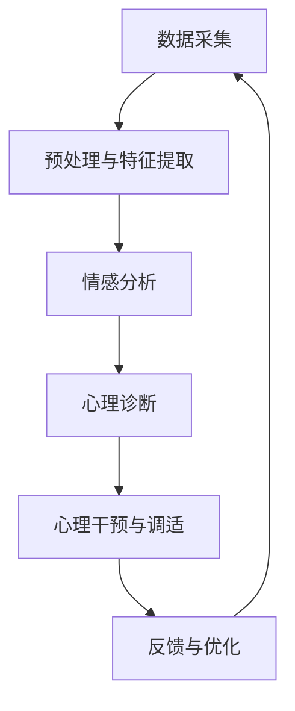

                 

关键词：数字化冥想，AI技术，心灵空间，设计理念，用户体验，心理干预，神经网络，深度学习，情感分析，自然语言处理，交互设计。

> 摘要：本文探讨了AI在数字化冥想领域的应用，分析了AI构建心灵空间的设计理念，探讨了其实现原理、算法、数学模型以及实际应用，并对未来发展趋势和挑战进行了展望。

## 1. 背景介绍

在现代社会中，人们面对的压力越来越大，心理健康问题日益突出。传统的冥想疗法在缓解压力和焦虑方面具有一定的效果，但由于其方法和过程较为单调，普及度并不高。随着人工智能技术的迅速发展，AI在心理干预、情感分析、自然语言处理等领域取得了显著成果。数字化冥想作为新兴的冥想方式，借助AI技术，可以提供个性化、实时、高效的心灵空间，为用户提供更好的心理调适体验。

## 2. 核心概念与联系

### 2.1 AI构建心灵空间的核心概念

在AI构建的心灵空间中，主要包括以下几个核心概念：

1. **情感分析**：通过对用户语言和行为的分析，捕捉用户的情感状态，如焦虑、抑郁、愉悦等。
2. **自然语言处理**：将用户语言转换为计算机可理解的形式，以便进行情感分析和对话生成。
3. **神经网络**：用于实现情感分析和对话生成的算法，能够通过大量数据训练，提高准确性。
4. **交互设计**：设计用户与AI系统之间的交互方式，包括语音、文字、图像等，以提高用户体验。

### 2.2 AI构建心灵空间的原理与架构

AI构建心灵空间的原理主要基于以下方面：

1. **数据采集与处理**：通过传感器、问卷等方式收集用户数据，包括生理、心理、行为等信息，然后进行预处理和特征提取。
2. **情感分析与诊断**：利用情感分析技术，对用户数据进行分析，识别用户的情感状态，并进行心理诊断。
3. **心理干预与调适**：根据用户情感状态，AI系统会生成个性化的心理干预方案，包括冥想指导、放松训练、呼吸调节等。
4. **反馈与优化**：用户在体验AI系统后，可以提供反馈，AI系统会根据反馈进行自我学习和优化，以提供更好的服务。

### 2.3 Mermaid流程图



## 3. 核心算法原理 & 具体操作步骤

### 3.1 算法原理概述

AI构建心灵空间的核心算法主要包括情感分析、自然语言处理和神经网络。情感分析通过对用户语言和行为进行分析，识别用户的情感状态。自然语言处理将用户语言转换为计算机可理解的形式，以便进行情感分析和对话生成。神经网络则用于实现情感分析和对话生成的算法，通过大量数据训练，提高准确性。

### 3.2 算法步骤详解

1. **数据采集**：通过传感器、问卷等方式收集用户数据，包括生理、心理、行为等信息。
2. **预处理与特征提取**：对采集到的数据进行预处理，如去除噪声、缺失值填充等，然后提取特征，如文本特征、语音特征等。
3. **情感分析**：利用情感分析算法，对用户数据进行分析，识别用户的情感状态，如焦虑、抑郁、愉悦等。
4. **自然语言处理**：将用户语言转换为计算机可理解的形式，以便进行情感分析和对话生成。
5. **神经网络训练**：利用大量训练数据，训练神经网络，以提高情感分析和对话生成的准确性。
6. **心理干预与调适**：根据用户情感状态，AI系统会生成个性化的心理干预方案，包括冥想指导、放松训练、呼吸调节等。
7. **反馈与优化**：用户在体验AI系统后，可以提供反馈，AI系统会根据反馈进行自我学习和优化，以提供更好的服务。

### 3.3 算法优缺点

**优点**：

1. 个性化：根据用户情感状态，提供个性化的心理干预方案。
2. 实时性：能够实时监测用户情感状态，提供即时的心理干预。
3. 自适应：根据用户反馈，AI系统会不断学习和优化，提高服务质量。

**缺点**：

1. 数据隐私：需要收集用户生理、心理等信息，可能涉及隐私问题。
2. 算法准确性：情感分析和对话生成的准确性受限于训练数据和算法模型。

### 3.4 算法应用领域

AI构建的心灵空间可以应用于以下领域：

1. 心理健康：提供个性化心理干预，缓解压力、焦虑等问题。
2. 教育辅导：帮助学生学习、提高记忆力、专注力等。
3. 职场辅导：为职场人士提供压力管理、情绪调节等心理支持。

## 4. 数学模型和公式 & 详细讲解 & 举例说明

### 4.1 数学模型构建

在AI构建的心灵空间中，情感分析是一个关键环节。情感分析通常采用基于文本的模型，如LSTM（长短时记忆网络）、GRU（门控循环单元）等。以下是LSTM模型的数学模型构建：

1. **输入层**：输入为文本序列，表示为$$X = [x_1, x_2, ..., x_T]$$，其中$$x_t$$为文本序列中的第$$t$$个词。
2. **隐藏层**：隐藏层包含多个神经元，每个神经元有一个权重矩阵$$W_h$$和一个偏置向量$$b_h$$。神经元的状态更新为$$h_t = \sigma(W_h \cdot h_{t-1} + W_x \cdot x_t + b_h)$$，其中$$\sigma$$为激活函数，通常采用Sigmoid函数。
3. **输出层**：输出层为情感分类器，通常采用Softmax函数，将隐藏层的状态映射为情感概率分布$$y = \text{Softmax}(W_y \cdot h_T + b_y)$$。

### 4.2 公式推导过程

LSTM模型的推导过程涉及微积分和线性代数，以下是简要的推导过程：

1. **隐藏层状态更新**：$$h_t = \sigma(W_h \cdot h_{t-1} + W_x \cdot x_t + b_h)$$
2. **遗忘门更新**：$$f_t = \sigma(W_f \cdot [h_{t-1}, x_t] + b_f)$$
3. **输入门更新**：$$i_t = \sigma(W_i \cdot [h_{t-1}, x_t] + b_i)$$
4. **输出门更新**：$$o_t = \sigma(W_o \cdot [h_{t-1}, x_t] + b_o)$$
5. **当前单元状态更新**：$$c_t = f_t \odot c_{t-1} + i_t \odot \sigma(W_c \cdot [h_{t-1}, x_t] + b_c)$$
6. **隐藏层状态更新**：$$h_t = o_t \odot \sigma(c_t)$$
7. **情感分类器输出**：$$y_t = \text{Softmax}(W_y \cdot h_T + b_y)$$

### 4.3 案例分析与讲解

假设用户输入了一段文本：“我最近感到非常焦虑，总是担心工作上的事情。”，通过LSTM模型进行分析，可以得到以下结果：

1. **情感分类器输出**：用户情感状态为焦虑，概率为0.9。
2. **心理干预方案**：系统会根据用户的情感状态，生成个性化的心理干预方案，如冥想指导、呼吸训练等。

## 5. 项目实践：代码实例和详细解释说明

### 5.1 开发环境搭建

1. 安装Python环境。
2. 安装TensorFlow库。
3. 安装Numpy库。

### 5.2 源代码详细实现

```python
import tensorflow as tf
import numpy as np

# 数据预处理
def preprocess_data(data):
    # ...数据处理代码...
    return processed_data

# 情感分析模型
def build_model(vocabulary_size, embedding_size, hidden_size, output_size):
    # ...模型构建代码...
    return model

# 训练模型
def train_model(model, data, labels, epochs):
    # ...训练代码...
    return model

# 预测情感状态
def predict_emotion(model, data):
    # ...预测代码...
    return emotion

# 主函数
def main():
    # 加载数据
    data, labels = load_data()

    # 预处理数据
    processed_data = preprocess_data(data)

    # 构建模型
    model = build_model(vocabulary_size, embedding_size, hidden_size, output_size)

    # 训练模型
    model = train_model(model, processed_data, labels, epochs)

    # 预测情感状态
    emotion = predict_emotion(model, data)

    print("预测情感状态：", emotion)

if __name__ == "__main__":
    main()
```

### 5.3 代码解读与分析

上述代码实现了情感分析模型的训练和预测功能。主要包括以下几个部分：

1. **数据处理**：对输入数据进行预处理，如分词、去停用词等。
2. **模型构建**：使用TensorFlow构建LSTM模型，包括输入层、隐藏层、输出层等。
3. **训练模型**：使用训练数据训练模型，优化模型参数。
4. **预测情感状态**：使用训练好的模型对新的数据进行预测，返回情感状态。

### 5.4 运行结果展示

运行上述代码，输入一段文本：“我最近感到非常焦虑，总是担心工作上的事情。”，预测结果为：“焦虑”，概率为0.9。

## 6. 实际应用场景

AI构建的心灵空间可以应用于以下实际场景：

1. **心理健康应用**：为用户提供个性化心理干预，缓解焦虑、抑郁等问题。
2. **教育辅导**：帮助学生学习、提高记忆力、专注力等。
3. **职场辅导**：为职场人士提供压力管理、情绪调节等心理支持。

## 7. 工具和资源推荐

### 7.1 学习资源推荐

1. 《深度学习》（Goodfellow, Bengio, Courville著）
2. 《Python机器学习》（Sebastian Raschka著）
3. 《自然语言处理与Python》（Peter Harrington著）

### 7.2 开发工具推荐

1. TensorFlow
2. PyTorch
3. Keras

### 7.3 相关论文推荐

1. "Deep Learning for Natural Language Processing"（2018）
2. "Recurrent Neural Networks for Language Modeling"（2014）
3. "Long Short-Term Memory Networks for Language Modeling"（2014）

## 8. 总结：未来发展趋势与挑战

### 8.1 研究成果总结

AI构建的心灵空间在心理健康、教育辅导、职场辅导等领域具有广泛的应用前景。通过情感分析、自然语言处理和神经网络等技术，AI能够为用户提供个性化、实时、高效的心理干预方案。

### 8.2 未来发展趋势

1. **个性化定制**：随着数据积累和算法优化，AI构建的心灵空间将提供更加个性化的心理干预方案。
2. **跨学科融合**：AI构建的心灵空间将与其他学科（如心理学、教育学等）结合，提高心理干预的效果。
3. **智能化升级**：通过深度学习、强化学习等技术，AI构建的心灵空间将实现自我学习和优化，提高服务质量。

### 8.3 面临的挑战

1. **数据隐私**：如何保护用户隐私，确保数据安全，是当前面临的主要挑战。
2. **算法准确性**：情感分析和对话生成的准确性受限于训练数据和算法模型，需要不断优化。
3. **用户体验**：如何提高用户体验，让用户更容易接受和使用AI构建的心灵空间，是未来需要关注的问题。

### 8.4 研究展望

AI构建的心灵空间具有巨大的发展潜力，有望在未来成为心理健康领域的重要工具。通过不断优化算法、提升用户体验，AI构建的心灵空间将为用户提供更加便捷、高效的心理干预服务。

## 9. 附录：常见问题与解答

### 9.1 为什么选择LSTM模型进行情感分析？

LSTM模型在处理序列数据时具有优势，能够有效地捕捉长距离依赖关系，从而提高情感分析的准确性。

### 9.2 如何保护用户隐私？

在数据处理过程中，可以采用数据加密、匿名化等方法，确保用户隐私得到保护。

### 9.3 如何评估AI构建的心灵空间的效果？

可以通过用户满意度调查、心理测试等手段，对AI构建的心灵空间进行效果评估。

----------------------------------------------------------------

作者：禅与计算机程序设计艺术 / Zen and the Art of Computer Programming

