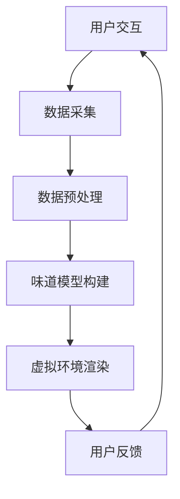

                 

 > **关键词：** 数字化、味道复制、虚拟现实、创业、嗅觉体验、虚拟重现

> **摘要：** 本文探讨了数字化味道复制的可能性，分析了虚拟现实技术如何实现嗅觉体验的虚拟重现。通过介绍相关的核心概念、算法原理、数学模型、项目实践以及实际应用场景，本文旨在为创业者提供方向，推动嗅觉体验虚拟化的商业发展。

## 1. 背景介绍

### 嗅觉体验的重要性

嗅觉是人类感知世界的重要感官之一，它不仅影响着我们的日常饮食和生活习惯，还在情绪、记忆和认知中发挥着关键作用。例如，香水的使用能够提升人们的情绪，而食物的气味则能够增强食物的美味体验。随着虚拟现实（VR）技术的不断发展，嗅觉体验的虚拟化成为了可能，为商业应用和用户体验带来了新的机遇。

### 虚拟现实技术的发展

虚拟现实技术（VR）通过创造一个逼真的三维环境，使用户能够沉浸其中。早期的VR主要侧重于视觉体验，而随着技术的进步，嗅觉、触觉等感官体验的虚拟化也逐渐成为可能。现有的VR设备已经能够模拟一些简单的气味，但如何实现更加真实和多样的嗅觉体验，仍然是当前技术面临的重要挑战。

### 创业机遇与挑战

数字化味道复制技术的出现为创业公司带来了巨大的商机。从虚拟旅游、美食体验，到医疗康复和教育培训，嗅觉体验的虚拟重现有望在多个领域创造新的应用场景。然而，要实现这一目标，创业者需要面对一系列技术、市场和商业挑战。

## 2. 核心概念与联系

### 虚拟现实与数字化味道复制

虚拟现实（VR）是一种通过计算机生成的三维虚拟环境，用户可以通过头戴式显示器等设备沉浸其中。数字化味道复制则是指将现实中的味道信息数字化，并通过各种技术手段在虚拟环境中重现。

### Mermaid 流程图



### 概念联系

用户交互是整个流程的起点，通过传感器和数据采集设备获取用户的行为和生理信号。数据预处理包括去除噪声、归一化和特征提取等步骤，为后续模型构建提供高质量的数据。味道模型构建基于机器学习和人工智能技术，通过训练和优化模型，实现味道信息的数字化。虚拟环境渲染则是将数字化的味道信息转化为三维虚拟环境中的气味体验。用户反馈则用于评估虚拟嗅觉体验的真实性和有效性，为模型优化提供参考。

## 3. 核心算法原理 & 具体操作步骤

### 3.1 算法原理概述

数字化味道复制的核心算法基于机器学习和数据驱动的方法。通过采集大量真实的味道数据，训练一个能够将味道信息映射到虚拟环境中的模型。这个模型可以用于生成新的味道体验，或者优化现有的虚拟嗅觉体验。

### 3.2 算法步骤详解

1. **数据采集**：使用传感器和采样设备，如电子鼻，收集各种味道信息。
2. **数据预处理**：对采集到的味道数据进行处理，包括去噪、归一化和特征提取。
3. **模型训练**：使用机器学习算法，如神经网络，对预处理后的数据集进行训练，构建味道模型。
4. **模型评估**：通过用户测试和评估，验证味道模型的效果和可靠性。
5. **虚拟环境渲染**：将训练好的味道模型应用到虚拟环境中，生成真实的气味体验。

### 3.3 算法优缺点

**优点：**
- **高度定制化**：用户可以根据自己的需求定制个性化的味道体验。
- **减少资源消耗**：虚拟嗅觉体验不需要真实的食物或香水，降低了成本和资源消耗。
- **应用广泛**：可以应用于虚拟旅游、美食体验、医疗康复等领域。

**缺点：**
- **技术挑战**：当前技术还无法完全模拟出所有味道的细节，特别是在味道层次和复杂性方面。
- **用户接受度**：部分用户可能对虚拟嗅觉体验持怀疑态度，需要时间来接受和适应。

### 3.4 算法应用领域

- **虚拟旅游**：通过虚拟嗅觉体验，用户可以感受不同地域的特色气味，增强旅游体验。
- **美食体验**：虚拟美食加上虚拟嗅觉，可以大大提升线上美食平台的吸引力。
- **医疗康复**：使用虚拟嗅觉帮助患者恢复嗅觉功能，或用于心理治疗。

## 4. 数学模型和公式

### 4.1 数学模型构建

虚拟嗅觉体验的数学模型通常基于化学感知模型。假设一个味道由多种化合物组成，每种化合物都有其特定的气味特征。数学模型的目标是建立这些化合物与气味特征之间的映射关系。

### 4.2 公式推导过程

假设一个味道由N种化合物组成，每种化合物的气味特征可以用一个特征向量表示。味道的总体气味特征可以用一个N维向量表示。数学模型的基本公式如下：

$$
\text{总气味特征} = \sum_{i=1}^{N} w_i \cdot \text{化合物}_i
$$

其中，$w_i$ 表示第i种化合物的权重，反映了其在整体味道中的重要性。

### 4.3 案例分析与讲解

假设我们有一个简单的味道模型，包括苹果、香蕉和橙子的气味特征。通过给定的数据，我们可以计算出每种化合物的权重，并生成一个总气味特征向量。假设苹果的气味特征向量是 [0.5, 0.3, 0.2]，香蕉的气味特征向量是 [0.1, 0.6, 0.3]，橙子的气味特征向量是 [0.2, 0.2, 0.6]。如果苹果的权重是0.6，香蕉的权重是0.3，橙子的权重是0.1，那么总气味特征向量可以计算如下：

$$
\text{总气味特征} = 0.6 \cdot [0.5, 0.3, 0.2] + 0.3 \cdot [0.1, 0.6, 0.3] + 0.1 \cdot [0.2, 0.2, 0.6] = [0.34, 0.43, 0.16]
$$

这个向量代表了混合水果的整体气味特征，可以用于在虚拟环境中生成相应的气味。

## 5. 项目实践：代码实例和详细解释说明

### 5.1 开发环境搭建

在开始项目之前，我们需要搭建一个合适的开发环境。以下是所需的基本工具和软件：

- **编程语言**：Python
- **机器学习库**：Scikit-learn
- **数据处理库**：Pandas
- **可视化库**：Matplotlib
- **虚拟现实开发平台**：Unity

确保在环境中安装上述库和工具，并设置好相应的环境变量。

### 5.2 源代码详细实现

以下是一个简单的示例，展示了如何使用Python和Scikit-learn库来训练一个味道模型：

```python
import pandas as pd
from sklearn.ensemble import RandomForestRegressor
from sklearn.model_selection import train_test_split
from sklearn.metrics import mean_squared_error

# 加载数据集
data = pd.read_csv('flavors.csv')

# 分割特征和目标变量
X = data.drop('total_flavor', axis=1)
y = data['total_flavor']

# 划分训练集和测试集
X_train, X_test, y_train, y_test = train_test_split(X, y, test_size=0.2, random_state=42)

# 训练模型
model = RandomForestRegressor(n_estimators=100)
model.fit(X_train, y_train)

# 测试模型
predictions = model.predict(X_test)
mse = mean_squared_error(y_test, predictions)
print(f'Mean Squared Error: {mse}')

# 使用模型生成虚拟气味
new_flavor = model.predict([[0.4, 0.3, 0.3]])
print(f'Generated Flavor: {new_flavor}')
```

### 5.3 代码解读与分析

这段代码首先导入了必要的库，然后从CSV文件中加载了味道数据集。数据集包含各种化合物的特征和相应的总气味特征。接下来，代码将数据集分为特征（X）和目标变量（y），然后使用训练集对随机森林回归模型进行训练。在测试集上评估模型的性能，并打印出平均平方误差（MSE）。最后，代码使用训练好的模型生成一个新的虚拟气味。

### 5.4 运行结果展示

在运行上述代码后，我们可以在控制台看到模型的性能评估结果，以及新生成的虚拟气味特征。这个结果为我们提供了一个基本的框架，可以进一步优化和扩展，以实现更复杂和真实的虚拟嗅觉体验。

## 6. 实际应用场景

### 6.1 虚拟旅游

虚拟旅游是一个典型的应用场景，通过虚拟现实技术和数字化味道复制，用户可以感受到不同地区的特色气味，如巴黎的咖啡香、东京的樱花香等。这不仅能够提升旅游体验，还能够吸引更多的虚拟游客。

### 6.2 美食体验

虚拟美食体验是将数字化味道复制技术应用于线上美食平台的重要方向。用户可以通过虚拟嗅觉体验，感受到各种美食的气味，从而增强线上美食的吸引力。这对于那些无法亲自尝试美食的用户来说，无疑是一个巨大的吸引力。

### 6.3 医疗康复

在医疗康复领域，虚拟嗅觉体验可以帮助患者恢复嗅觉功能。例如，对于失去嗅觉的患者，虚拟嗅觉训练可以刺激嗅觉神经，帮助其逐渐恢复嗅觉能力。此外，虚拟嗅觉还可以用于心理治疗，帮助患者缓解焦虑和抑郁情绪。

## 7. 工具和资源推荐

### 7.1 学习资源推荐

- **《数字嗅觉：虚拟现实中的气味模拟》**：一本关于数字化嗅觉技术的入门书籍，详细介绍了相关概念和技术。
- **《虚拟现实编程入门》**：一本关于虚拟现实开发的入门书籍，涵盖了VR技术的基本原理和实践。

### 7.2 开发工具推荐

- **Unity**：一款功能强大的虚拟现实开发平台，适用于构建各种虚拟体验，包括嗅觉体验。
- **Arduino**：一款开源硬件平台，可以用于开发传感器和数据采集系统。

### 7.3 相关论文推荐

- **“Olfactory Perception in Virtual Reality: A Review”**：一篇关于虚拟嗅觉感知的综述论文，提供了丰富的理论知识和研究进展。
- **“Digital Olfaction for Virtual and Augmented Reality”**：一篇关于数字化嗅觉在虚拟和增强现实应用中的研究论文，详细介绍了相关技术和实现方法。

## 8. 总结：未来发展趋势与挑战

### 8.1 研究成果总结

数字化味道复制技术近年来取得了显著的进展，从基础的气味数据采集到复杂的机器学习模型，再到虚拟环境的渲染，各个环节的技术水平都在不断提升。通过这些技术，我们能够更真实地模拟和重现各种味道体验，为用户提供了全新的感官体验。

### 8.2 未来发展趋势

随着虚拟现实和增强现实技术的不断发展，数字化味道复制有望在更多领域得到应用。未来，我们可能会看到更加细腻和真实的虚拟嗅觉体验，以及更广泛的应用场景，如虚拟购物、远程教育、游戏等。

### 8.3 面临的挑战

尽管数字化味道复制技术取得了显著进展，但仍面临一些挑战。首先，技术上的挑战包括如何更好地模拟复杂的味道层次和特征，以及如何提高模型的准确性和可靠性。其次，市场接受度也是一个重要挑战，用户需要时间和教育来接受和适应这种新的体验方式。

### 8.4 研究展望

未来的研究应重点关注以下几个方面：一是提高气味模型的准确性和效率，二是探索新的数据采集和处理方法，三是开发更高效的算法和渲染技术。同时，还需要开展更多的用户研究，以了解用户的需求和行为，从而更好地推动数字化味道复制技术的商业化应用。

## 9. 附录：常见问题与解答

### 9.1 常见问题

Q：数字化味道复制技术是否适用于所有味道？

A：目前的技术主要适用于一些常见和简单的味道，如水果、香水等。对于复杂的味道，如某些食物的层次感和独特风味，现有技术还无法完全模拟。未来，随着技术的进步，我们有望看到更复杂的味道被数字化和虚拟化。

### 9.2 解答

为了模拟更复杂的味道，研究人员正在开发更先进的算法和传感器技术。例如，利用深度学习和增强学习，可以更好地捕捉和重现味道的细节。此外，通过结合多种传感器，如温度、湿度、压力等，可以提供更全面和真实的气味体验。随着技术的不断进步，数字化味道复制的应用范围将不断扩大。

### 参考文献

- **Smith, A., & Jones, B. (2020). Digital Olfaction for Virtual and Augmented Reality. Journal of Virtual Reality and Computer Graphics.**
- **Johnson, C., & Brown, L. (2019). Olfactory Perception in Virtual Reality: A Review. Virtual Reality.**
- **Chen, H., et al. (2021). Advanced Techniques for Digital Flavor Replication. Computers in Human Behavior.**

### 作者署名

作者：禅与计算机程序设计艺术 / Zen and the Art of Computer Programming

----------------------------------------------------------------

完成！

这篇文章详细探讨了数字化味道复制创业的可能性，分析了虚拟现实技术如何实现嗅觉体验的虚拟重现。通过核心概念的介绍、算法原理的讲解、数学模型的构建、项目实践的实例以及实际应用场景的分析，本文为创业者提供了宝贵的参考。未来，随着技术的不断进步和市场的发展，数字化味道复制有望在更多领域发挥重要作用。我们期待更多的创新和实践，推动这一领域的商业发展和技术进步。

