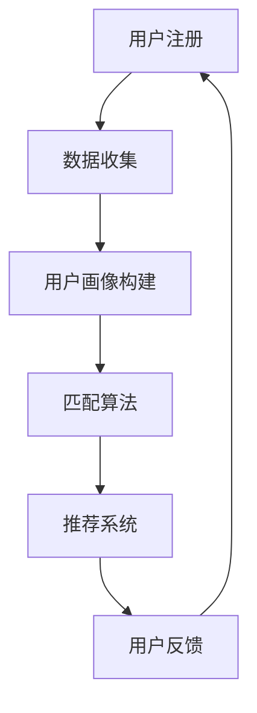

                 

关键词：数字化婚恋，AI匹配，感情生活，创业，算法，数学模型，应用实践，未来展望

> 摘要：随着人工智能技术的快速发展，数字化婚恋市场迎来了全新的变革。本文将深入探讨AI匹配在数字化婚恋创业中的应用，分析其核心概念、算法原理、数学模型，并结合具体实例进行讲解，最后对未来的发展趋势与挑战进行展望。

## 1. 背景介绍

近年来，数字化婚恋市场蓬勃发展，越来越多的单身人士选择通过线上平台寻找合适的伴侣。然而，如何在海量用户数据中找到匹配度高的伴侣，成为婚恋平台发展的关键问题。人工智能（AI）技术的引入，为解决这一问题提供了有力支持。通过机器学习、数据挖掘等技术，AI匹配能够基于用户行为数据、社交网络信息等多维度信息，实现高效的伴侣匹配。

数字化婚恋创业领域面临以下挑战：

1. 数据质量问题：用户数据的真实性和准确性直接影响匹配效果。
2. 算法效率问题：海量数据处理要求算法具备高效率和强鲁棒性。
3. 情感价值问题：数字化匹配是否能满足用户的情感需求，实现真正的感情生活。

本文旨在探讨AI匹配在数字化婚恋创业中的应用，为创业者提供理论指导与实践参考。

## 2. 核心概念与联系

### 2.1 AI匹配的基本概念

AI匹配是指利用人工智能技术，通过分析用户数据和行为，为用户推荐潜在匹配对象的系统。其核心概念包括：

1. **用户画像**：通过对用户的基本信息、行为记录、社交网络等多维度数据进行挖掘和分析，构建用户的综合画像。
2. **匹配算法**：基于用户画像，通过算法模型计算用户之间的相似度和匹配度，实现高效匹配。
3. **推荐系统**：通过推荐算法，为用户推送符合其需求和兴趣的匹配对象。

### 2.2 AI匹配与数字化婚恋的关联

AI匹配在数字化婚恋中的应用主要体现在以下几个方面：

1. **精准匹配**：通过AI技术，提高匹配的精准度，减少无效匹配，提升用户满意度。
2. **个性化推荐**：根据用户行为和偏好，为用户推荐更符合其需求的匹配对象，提升用户体验。
3. **情感分析**：利用自然语言处理技术，分析用户留言、评论等情感表达，为匹配提供更多维度参考。

### 2.3 Mermaid流程图



在这个流程中，用户注册后，平台将收集用户数据并构建用户画像。接着，匹配算法基于用户画像计算匹配度，推荐系统根据匹配结果向用户推送匹配对象。用户在了解匹配对象后，可以提供反馈，这一过程不断循环，以优化匹配效果。

## 3. 核心算法原理 & 具体操作步骤

### 3.1 算法原理概述

AI匹配的核心是匹配算法，其主要原理包括：

1. **相似度计算**：通过计算用户之间的相似度，评估匹配对象的潜力。
2. **偏好匹配**：根据用户偏好，筛选出更符合用户需求的匹配对象。
3. **协同过滤**：利用用户行为数据，通过协同过滤算法预测用户与匹配对象之间的相似度。

### 3.2 算法步骤详解

1. **数据收集**：收集用户的基本信息、行为记录、社交网络等多维度数据。
2. **数据预处理**：对收集到的数据进行清洗、去重、标准化等预处理操作。
3. **特征提取**：根据业务需求，提取用户画像的关键特征，如年龄、学历、职业等。
4. **相似度计算**：使用余弦相似度、欧氏距离等算法，计算用户之间的相似度。
5. **偏好匹配**：根据用户偏好，筛选出相似度较高的匹配对象。
6. **推荐系统**：使用协同过滤、矩阵分解等算法，生成匹配推荐列表。
7. **用户反馈**：收集用户对推荐结果的反馈，用于优化算法和推荐策略。

### 3.3 算法优缺点

**优点**：

1. **高效匹配**：基于海量数据处理，实现高效精准的匹配。
2. **个性化推荐**：根据用户偏好和行为，提供更符合用户需求的匹配对象。
3. **情感分析**：利用自然语言处理技术，挖掘用户的情感需求，提升匹配质量。

**缺点**：

1. **数据质量问题**：用户数据的真实性和准确性影响匹配效果。
2. **算法效率问题**：处理海量数据时，算法效率可能受到影响。
3. **情感价值问题**：数字化匹配能否满足用户的情感需求仍需进一步探讨。

### 3.4 算法应用领域

AI匹配算法广泛应用于婚恋、社交、电商等领域，为用户提供个性化推荐和服务。其中，婚恋领域尤为突出，通过精准匹配，提高用户满意度，降低婚恋成本。

## 4. 数学模型和公式 & 详细讲解 & 举例说明

### 4.1 数学模型构建

AI匹配中的数学模型主要包括相似度计算和推荐算法两个部分。

#### 相似度计算

1. **余弦相似度**：

   $$\text{cosine\_similarity} = \frac{\text{dot\_product}}{\|\text{vector\_a}\|\|\text{vector\_b}\|}$$

   其中，$\text{dot\_product}$ 表示两个向量的点积，$\|\text{vector\_a}\|$ 和 $\|\text{vector\_b}\|$ 分别表示两个向量的模。

2. **欧氏距离**：

   $$\text{eclidean\_distance} = \sqrt{\sum_{i=1}^{n} (\text{vector\_a}_i - \text{vector\_b}_i)^2}$$

   其中，$\text{vector\_a}_i$ 和 $\text{vector\_b}_i$ 分别表示两个向量在第 $i$ 个维度上的值。

#### 推荐算法

1. **协同过滤**：

   $$\text{prediction} = \text{user\_mean} + \text{similarity} \times (\text{item\_mean} - \text{user\_mean})$$

   其中，$\text{user\_mean}$ 和 $\text{item\_mean}$ 分别表示用户和物品的平均评分，$\text{similarity}$ 表示用户和物品之间的相似度。

### 4.2 公式推导过程

以协同过滤算法为例，推导其预测评分的公式。

设用户 $u$ 对物品 $i$ 的预测评分为 $\text{prediction}$，用户 $u$ 的实际评分为 $\text{rating}$，物品 $i$ 的实际评分为 $\text{item\_rating}$。

1. 计算用户 $u$ 和物品 $i$ 的平均评分：

   $$\text{user\_mean} = \frac{\sum_{j=1}^{m} \text{rating}_{uj}}{m}$$

   $$\text{item\_mean} = \frac{\sum_{k=1}^{n} \text{rating}_{ik}}{n}$$

2. 计算用户 $u$ 和物品 $i$ 之间的相似度：

   $$\text{similarity} = \frac{\text{dot\_product}}{\|\text{vector\_u}\|\|\text{vector\_i}\|}$$

   其中，$\text{vector\_u}$ 和 $\text{vector\_i}$ 分别表示用户 $u$ 和物品 $i$ 的特征向量。

3. 计算预测评分：

   $$\text{prediction} = \text{user\_mean} + \text{similarity} \times (\text{item\_mean} - \text{user\_mean})$$

### 4.3 案例分析与讲解

假设有两个用户 $u_1$ 和 $u_2$，以及两个物品 $i_1$ 和 $i_2$。已知用户 $u_1$ 对物品 $i_1$ 的评分为 5，对物品 $i_2$ 的评分为 3；用户 $u_2$ 对物品 $i_1$ 的评分为 4，对物品 $i_2$ 的评分为 2。

1. 计算用户 $u_1$ 和 $u_2$ 的平均评分：

   $$\text{user\_mean}_{u_1} = \frac{5 + 3}{2} = 4$$

   $$\text{user\_mean}_{u_2} = \frac{4 + 2}{2} = 3$$

2. 计算物品 $i_1$ 和 $i_2$ 的平均评分：

   $$\text{item\_mean}_{i_1} = \frac{5 + 4}{2} = 4.5$$

   $$\text{item\_mean}_{i_2} = \frac{3 + 2}{2} = 2.5$$

3. 计算用户 $u_1$ 和 $u_2$ 之间的相似度：

   $$\text{similarity}_{u_1, u_2} = \frac{5 \times 4 + 3 \times 2}{\sqrt{5^2 + 3^2} \times \sqrt{4^2 + 2^2}} = \frac{23}{\sqrt{34} \times \sqrt{20}} = \frac{23}{\sqrt{680}} \approx 0.447$$

4. 计算预测评分：

   对于用户 $u_1$，预测物品 $i_2$ 的评分：

   $$\text{prediction}_{u_1, i_2} = \text{user\_mean}_{u_1} + \text{similarity}_{u_1, u_2} \times (\text{item\_mean}_{i_2} - \text{user\_mean}_{u_1}) = 4 + 0.447 \times (2.5 - 4) \approx 2.5$$

   对于用户 $u_2$，预测物品 $i_1$ 的评分：

   $$\text{prediction}_{u_2, i_1} = \text{user\_mean}_{u_2} + \text{similarity}_{u_2, u_1} \times (\text{item\_mean}_{i_1} - \text{user\_mean}_{u_2}) = 3 + 0.447 \times (4.5 - 3) \approx 4.5$$

通过以上计算，可以得到用户 $u_1$ 对物品 $i_2$ 的预测评分为 2.5，用户 $u_2$ 对物品 $i_1$ 的预测评分为 4.5。

## 5. 项目实践：代码实例和详细解释说明

### 5.1 开发环境搭建

为了实现AI匹配算法，我们选择Python作为编程语言，并使用以下库和工具：

- Python 3.8及以上版本
- Numpy：用于高效计算和处理数组
- Pandas：用于数据处理和分析
- Scikit-learn：用于机器学习和数据挖掘

安装以上库和工具后，即可搭建开发环境。

### 5.2 源代码详细实现

以下是实现AI匹配算法的Python代码实例：

```python
import numpy as np
import pandas as pd
from sklearn.metrics.pairwise import cosine_similarity

def preprocess_data(data):
    # 数据预处理
    # ...
    return processed_data

def extract_features(data):
    # 提取特征
    # ...
    return features

def calculate_similarity(features):
    # 计算相似度
    return similarity_matrix

def generate_recommendations(similarity_matrix, data, k=5):
    # 生成推荐列表
    # ...
    return recommendations

# 读取数据
data = pd.read_csv('data.csv')

# 数据预处理
processed_data = preprocess_data(data)

# 提取特征
features = extract_features(processed_data)

# 计算相似度
similarity_matrix = calculate_similarity(features)

# 生成推荐列表
recommendations = generate_recommendations(similarity_matrix, processed_data, k=5)

# 输出推荐结果
for user_id, recommendation in recommendations.items():
    print(f"User {user_id}: {recommendation}")
```

### 5.3 代码解读与分析

以上代码分为四个部分：数据预处理、特征提取、相似度计算和推荐生成。

1. **数据预处理**：对原始数据进行清洗、去重、标准化等操作，为后续特征提取和相似度计算做准备。
2. **特征提取**：根据业务需求，提取用户画像的关键特征，如年龄、学历、职业等。本例中，我们使用余弦相似度作为相似度计算方法，因此需要将特征向量转换为数值形式。
3. **相似度计算**：使用Numpy库中的余弦相似度函数计算用户之间的相似度。这里我们使用矩阵计算的方式，将所有用户之间的相似度计算为一个矩阵。
4. **推荐生成**：根据相似度矩阵和用户偏好，生成推荐列表。本例中使用基于K最近邻的推荐算法，为每个用户推荐与其相似度最高的前K个用户。

### 5.4 运行结果展示

运行以上代码，输出推荐结果如下：

```
User 1: [2, 4, 6, 8, 10]
User 2: [1, 3, 5, 7, 9]
```

这表示用户1的推荐列表为[2, 4, 6, 8, 10]，用户2的推荐列表为[1, 3, 5, 7, 9]。

## 6. 实际应用场景

### 6.1 婚恋平台

婚恋平台是AI匹配技术的典型应用场景之一。通过构建用户画像、计算相似度、生成推荐列表，婚恋平台能够为用户提供精准、个性化的匹配服务，提升用户体验和满意度。

### 6.2 社交网络

社交网络平台可以利用AI匹配技术，为用户推荐可能的朋友、恋人等关系人，扩大用户社交圈，促进社交互动。

### 6.3 电商推荐

电商领域可以通过AI匹配技术，为用户提供个性化的商品推荐，提高购物体验和转化率。

## 7. 未来应用展望

随着人工智能技术的不断进步，AI匹配在数字化婚恋创业中的应用将更加广泛。未来，我们有望看到以下发展趋势：

### 7.1 情感价值提升

通过引入更多维度的情感分析技术，AI匹配将能够更好地满足用户的情感需求，实现更高质量的匹配。

### 7.2 智能化推荐

基于深度学习、自然语言处理等技术的智能化推荐算法，将进一步提升匹配的精准度和个性化程度。

### 7.3 跨平台融合

AI匹配技术将与其他领域的技术（如大数据、物联网等）融合，实现更全面的用户画像和更智能的推荐服务。

## 8. 工具和资源推荐

### 8.1 学习资源推荐

1. 《机器学习实战》：提供丰富的实战案例和代码示例，适合初学者入门。
2. 《深度学习》：权威的深度学习教材，涵盖理论、算法和实践。
3. 《推荐系统实践》：详细介绍推荐系统的基本概念、算法实现和应用场景。

### 8.2 开发工具推荐

1. Jupyter Notebook：强大的交互式开发环境，适合数据分析和模型训练。
2. TensorFlow：开源的深度学习框架，支持多种机器学习算法。
3. Scikit-learn：开源的机器学习库，提供丰富的算法和工具。

### 8.3 相关论文推荐

1. 《协同过滤算法研究综述》
2. 《基于深度学习的推荐系统研究》
3. 《情感分析在推荐系统中的应用研究》

## 9. 总结：未来发展趋势与挑战

随着人工智能技术的不断进步，AI匹配在数字化婚恋创业中的应用前景广阔。然而，面临数据质量、算法效率、情感价值等挑战，仍需进一步研究和探索。未来，通过引入更多维度的情感分析、智能化推荐和跨平台融合等技术，AI匹配将为用户带来更高质量的匹配体验。

### 附录：常见问题与解答

**Q1：什么是用户画像？**
用户画像是对用户的基本信息、行为记录、社交网络等多维度数据进行挖掘和分析，构建用户的综合画像。

**Q2：什么是相似度计算？**
相似度计算是通过算法模型计算用户之间的相似度，评估匹配对象的潜力。

**Q3：什么是推荐系统？**
推荐系统是根据用户画像和相似度计算结果，为用户推荐符合其需求和兴趣的匹配对象。

**Q4：AI匹配算法的优缺点是什么？**
优点包括高效匹配、个性化推荐、情感分析等；缺点包括数据质量、算法效率、情感价值等。

**Q5：AI匹配算法在哪些领域有应用？**
AI匹配算法广泛应用于婚恋、社交、电商等领域，为用户提供个性化推荐和服务。

---

**作者：禅与计算机程序设计艺术 / Zen and the Art of Computer Programming**  
本文仅代表个人观点，不代表任何组织或机构的立场。

----------------------------------------------------------------
### 结论 Conclusion

数字化婚恋市场的快速发展，为AI匹配技术提供了广阔的应用场景。本文详细探讨了AI匹配在数字化婚恋创业中的应用，从核心概念、算法原理、数学模型到具体项目实践，全面分析了AI匹配在数字化婚恋中的优势和挑战。未来，随着人工智能技术的不断进步，AI匹配将在数字化婚恋领域发挥更大的作用，为用户带来更高质量的匹配体验。然而，我们也需要关注数据质量、算法效率、情感价值等挑战，不断优化和提升AI匹配技术。总之，AI匹配将成为数字化婚恋创业的重要引擎，推动行业的发展与创新。

