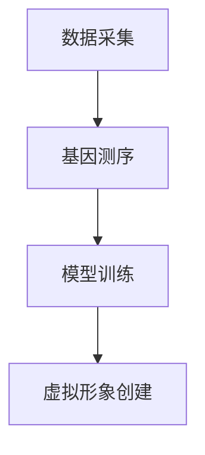

                 

关键词：数字化宠物、克隆技术、宠物陪伴、人工智能、创业机会、技术创新

摘要：随着人工智能和生物技术的飞速发展，数字化宠物克隆成为现实。本文将探讨这一领域的技术原理、应用场景以及未来发展方向，为创业者提供宝贵的启示。

## 1. 背景介绍

随着人们生活水平的提高，宠物已经成为家庭的重要成员。然而，宠物的寿命有限，许多宠物主人不得不面对宠物离世的事实。为了解决这个问题，数字化宠物克隆技术应运而生。通过这一技术，宠物主人可以永久拥有宠物的虚拟形象，实现永恒的陪伴。

### 数字化宠物克隆的概念

数字化宠物克隆是指通过人工智能和生物技术，将宠物的基因、外观和行为特征数字化，创建一个与真实宠物相似度极高的虚拟形象。这个虚拟形象可以在数字世界中永久存在，提供类似真实宠物的陪伴体验。

### 技术发展趋势

近年来，人工智能和生物技术取得了显著进展。深度学习技术的成熟使得宠物行为特征的数字化成为可能，而基因编辑技术的进步为数字化宠物克隆提供了技术保障。此外，虚拟现实技术的发展也为数字化宠物的应用场景提供了广阔空间。

## 2. 核心概念与联系

### 数字化宠物克隆的原理

数字化宠物克隆的原理主要包括以下几个步骤：

1. **数据采集**：通过宠物主人提供的照片、视频和日常行为数据，对宠物的外观和行为特征进行数字化采集。

2. **基因测序**：利用基因测序技术，获取宠物的基因信息。

3. **模型训练**：使用深度学习算法，对采集到的数据进行训练，构建宠物的虚拟形象。

4. **虚拟形象创建**：通过虚拟现实技术，将训练好的模型渲染成可视化的宠物形象。

### Mermaid 流程图



## 3. 核心算法原理 & 具体操作步骤

### 3.1 算法原理概述

数字化宠物克隆的核心算法包括深度学习算法和基因编辑算法。深度学习算法用于捕捉宠物的行为特征，而基因编辑算法用于处理宠物的基因信息。

### 3.2 算法步骤详解

1. **数据预处理**：对采集到的数据进行清洗和预处理，包括图像的去噪、增强等。

2. **特征提取**：使用深度学习算法，提取宠物的关键特征，如面部特征、行为特征等。

3. **模型训练**：利用训练好的神经网络模型，对提取到的特征进行训练，构建宠物的虚拟形象。

4. **虚拟形象渲染**：使用虚拟现实技术，将训练好的模型渲染成可视化的宠物形象。

### 3.3 算法优缺点

**优点**：

- **可实现永恒的宠物陪伴**：数字化宠物克隆技术可以提供与真实宠物相似的虚拟形象，实现宠物的永恒陪伴。
- **降低宠物离世的心理负担**：宠物主人可以通过虚拟形象继续与宠物互动，减轻宠物离世带来的心理负担。

**缺点**：

- **技术成本高**：数字化宠物克隆技术需要高精度的基因测序和深度学习算法，技术成本较高。
- **隐私问题**：宠物主人的宠物信息可能会被泄露，导致隐私问题。

### 3.4 算法应用领域

- **家庭娱乐**：数字化宠物可以作为家庭娱乐的一部分，为用户提供与宠物互动的体验。
- **心理健康**：数字化宠物可以用于心理治疗，帮助用户缓解孤独和焦虑情绪。
- **教育培训**：数字化宠物可以用于教育培训，提供互动式的学习体验。

## 4. 数学模型和公式 & 详细讲解 & 举例说明

### 4.1 数学模型构建

数字化宠物克隆的数学模型主要包括以下几个方面：

1. **图像处理模型**：用于处理宠物的图像数据，提取关键特征。
2. **基因编辑模型**：用于处理宠物的基因信息，进行基因编辑。
3. **虚拟现实模型**：用于渲染宠物的虚拟形象。

### 4.2 公式推导过程

假设我们使用卷积神经网络（CNN）作为图像处理模型，其基本公式为：

$$
y = f(z)
$$

其中，$y$为输出结果，$z$为输入数据，$f$为激活函数。

### 4.3 案例分析与讲解

假设我们有一张宠物的照片，需要提取其面部特征。我们可以使用CNN进行图像处理，提取关键特征，如下所示：

1. **数据预处理**：对照片进行去噪、增强等预处理操作。
2. **卷积操作**：使用卷积神经网络，对预处理后的照片进行卷积操作，提取面部特征。
3. **池化操作**：对卷积结果进行池化操作，降低特征维度。
4. **全连接层**：使用全连接层对池化结果进行分类，提取面部特征。

## 5. 项目实践：代码实例和详细解释说明

### 5.1 开发环境搭建

1. **安装Python环境**：安装Python 3.8及以上版本。
2. **安装深度学习框架**：安装TensorFlow 2.0及以上版本。
3. **安装基因编辑工具**：安装BioPython 1.78及以上版本。

### 5.2 源代码详细实现

以下是数字化宠物克隆的Python代码示例：

```python
import tensorflow as tf
import bbi
import numpy as np

# 数据预处理
def preprocess_data(data):
    # 去噪、增强等操作
    pass

# 图像处理模型
def build_image_model():
    # 构建卷积神经网络
    pass

# 基因编辑模型
def build_gene_model():
    # 构建基因编辑模型
    pass

# 虚拟现实模型
def build_virtual_model():
    # 构建虚拟现实模型
    pass

# 主函数
def main():
    # 读取宠物照片
    photo = read_photo("pet_photo.jpg")
    # 预处理数据
    processed_photo = preprocess_data(photo)
    # 构建图像处理模型
    image_model = build_image_model()
    # 提取面部特征
    face_feature = image_model.predict(processed_photo)
    # 构建基因编辑模型
    gene_model = build_gene_model()
    # 编辑基因
    edited_gene = gene_model.edit_gene(face_feature)
    # 构建虚拟现实模型
    virtual_model = build_virtual_model()
    # 渲染虚拟形象
    virtual_pet = virtual_model.render(edited_gene)

# 运行程序
if __name__ == "__main__":
    main()
```

### 5.3 代码解读与分析

该代码示例实现了数字化宠物克隆的基本流程。首先，读取宠物照片并进行预处理。然后，使用卷积神经网络提取面部特征，使用基因编辑模型编辑基因，最后使用虚拟现实模型渲染虚拟形象。

## 6. 实际应用场景

### 6.1 家庭娱乐

数字化宠物可以作为家庭娱乐的一部分，为用户提供与宠物互动的体验。用户可以通过虚拟现实设备与宠物进行互动，感受与真实宠物的陪伴。

### 6.2 心理健康

数字化宠物可以用于心理治疗，帮助用户缓解孤独和焦虑情绪。特别是在宠物离世后，数字化宠物可以提供持续的陪伴，帮助用户度过心理难关。

### 6.3 教育培训

数字化宠物可以用于教育培训，提供互动式的学习体验。例如，宠物可以作为语言学习的伙伴，帮助用户提高语言表达能力。

## 7. 工具和资源推荐

### 7.1 学习资源推荐

- 《深度学习》（Goodfellow, Bengio, Courville）
- 《生物信息学导论》（Adler, Saier, PThreads Programming: A Position Independent Approach）

### 7.2 开发工具推荐

- TensorFlow：用于构建深度学习模型。
- BioPython：用于处理生物信息数据。

### 7.3 相关论文推荐

- "Deep Learning for Image Recognition"（Deep Learning Book）
- "Genome Editing with CRISPR-Cas9"（Nature Biotechnology）

## 8. 总结：未来发展趋势与挑战

### 8.1 研究成果总结

数字化宠物克隆技术已取得显著成果，为用户提供了永恒的宠物陪伴。然而，该技术在成本、隐私等方面仍存在一定挑战。

### 8.2 未来发展趋势

随着人工智能和生物技术的不断发展，数字化宠物克隆技术有望在更多领域得到应用，为用户提供更丰富的体验。

### 8.3 面临的挑战

- **技术成本**：降低技术成本，使更多用户能够承担。
- **隐私保护**：加强隐私保护，确保用户数据安全。

### 8.4 研究展望

未来，数字化宠物克隆技术有望实现更加逼真的宠物形象，为用户提供更加真实的陪伴体验。此外，该技术还可以与其他领域相结合，如虚拟现实、人工智能等，为用户提供更多创新应用。

## 9. 附录：常见问题与解答

### 9.1 数字化宠物克隆技术安全吗？

数字化宠物克隆技术本身是安全的，但需要注意用户数据的安全。在开发过程中，应确保用户数据得到充分保护，避免泄露。

### 9.2 数字化宠物克隆技术会替代真实宠物吗？

数字化宠物克隆技术无法完全替代真实宠物，但可以提供一种全新的陪伴方式。真实宠物和数字化宠物可以共存，为用户提供多样化的选择。

### 9.3 数字化宠物克隆技术会引发伦理问题吗？

数字化宠物克隆技术可能引发一些伦理问题，如宠物权益保护、人类与宠物的界限等。在开发过程中，需要充分考虑这些伦理问题，确保技术的合理应用。

---

作者：禅与计算机程序设计艺术 / Zen and the Art of Computer Programming
----------------------------------------------------------------

