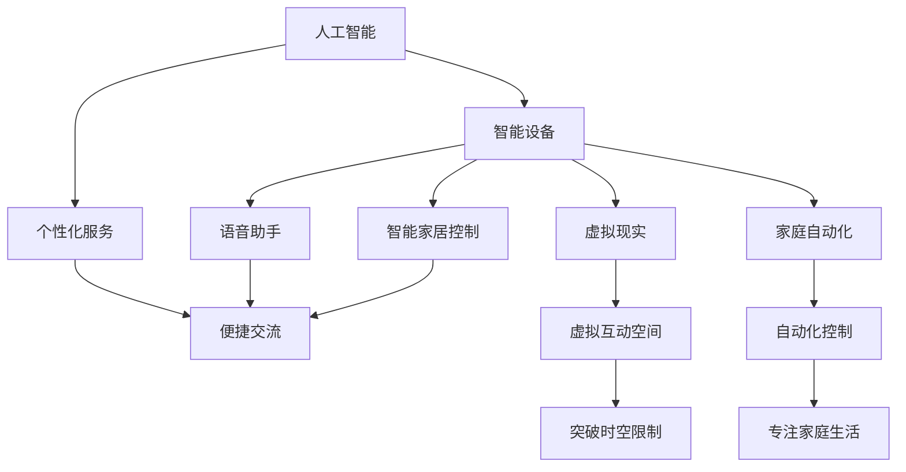

                 

关键词：数字化家庭、元宇宙、亲子关系、技术发展、人工智能、虚拟现实、家庭自动化、情感互动、未来趋势

> 摘要：本文探讨了在元宇宙时代数字化家庭中，亲子关系的演变及其面临的挑战。随着人工智能、虚拟现实和家庭自动化技术的飞速发展，家庭环境发生了翻天覆地的变化。本文将从技术视角出发，分析这些技术如何影响亲子关系，并提出相关解决方案和未来展望。

## 1. 背景介绍

在过去的几十年中，科技的发展已经深刻改变了我们的生活方式。互联网的普及、智能手机的普及、以及智能家居设备的兴起，使得我们的生活变得更加便利。然而，随着元宇宙概念的提出和技术的不断进步，我们的家庭生活正迎来新一轮的变革。

元宇宙是一个虚拟的、三维的、沉浸式的数字世界，它不仅包含了现实世界的模拟，还包括了更多虚拟的元素。在这个世界中，人们可以通过虚拟现实头盔、智能设备等接入，与虚拟环境进行互动。这一技术的快速发展，为数字化家庭的建立提供了可能。

数字化家庭，指的是家庭生活中广泛应用信息技术和智能设备，实现家庭自动化、数字化管理和智能化互动的环境。在这个环境中，家庭成员可以通过智能设备随时随地获取信息、享受娱乐、进行沟通和协作。

### 1.1 元宇宙与数字化家庭的关系

元宇宙与数字化家庭之间有着紧密的联系。元宇宙提供了一个虚拟的空间，使得家庭成员可以在不同的时间和地点进行互动；而数字化家庭则通过智能设备将这些互动变得更加便捷和高效。元宇宙和数字化家庭的结合，将为亲子关系带来新的变化和挑战。

## 2. 核心概念与联系

在探讨数字化家庭中亲子关系的演变之前，我们需要了解几个核心概念：人工智能、虚拟现实、家庭自动化。

### 2.1 人工智能

人工智能（AI）是一种能够模拟人类智能行为的计算机技术。在数字化家庭中，人工智能可以通过智能设备为家庭成员提供个性化服务，如语音助手、智能家居控制等。人工智能的应用，使得家庭生活变得更加智能化和便捷化。

### 2.2 虚拟现实

虚拟现实（VR）是一种通过计算机生成的三维虚拟环境，用户可以通过佩戴VR头盔等方式，进入这个虚拟环境进行互动。在元宇宙中，虚拟现实技术为家庭成员提供了一个全新的互动空间，使得亲子关系可以超越现实世界的限制。

### 2.3 家庭自动化

家庭自动化是指通过智能设备实现对家庭环境的自动化控制，如灯光、温度、安全系统等。家庭自动化的应用，使得家庭成员可以更加专注于家庭生活，减少了对日常琐事的关注。

### 2.4 核心概念的联系

人工智能、虚拟现实和家庭自动化技术在数字化家庭中相互交织，共同影响亲子关系。人工智能提供了智能化的服务，使得家庭成员可以更加便捷地交流和互动；虚拟现实为家庭成员提供了一个全新的互动空间，打破了时间和空间的限制；家庭自动化则使得家庭成员可以更加专注于家庭生活，提高了生活质量。

下面是一个使用Mermaid绘制的流程图，展示了这些核心概念之间的联系：



## 3. 核心算法原理 & 具体操作步骤

### 3.1 算法原理概述

在数字化家庭中，核心算法的作用至关重要。这些算法主要涉及人工智能、虚拟现实和家庭自动化的核心技术。

#### 3.1.1 人工智能算法

人工智能算法主要分为监督学习、无监督学习和强化学习三种。在数字化家庭中，监督学习算法常用于语音识别、图像识别等领域，如智能语音助手和智能监控系统的实现；无监督学习算法则用于数据分析和推荐系统，如家庭自动化系统的优化；强化学习算法则可以用于虚拟现实中的游戏和互动设计。

#### 3.1.2 虚拟现实算法

虚拟现实算法主要包括渲染算法、跟踪算法和交互算法。渲染算法用于生成三维虚拟环境，跟踪算法用于捕捉用户的动作，交互算法则用于用户与虚拟环境的交互。

#### 3.1.3 家庭自动化算法

家庭自动化算法主要涉及传感器数据处理、决策和执行。传感器数据处理算法用于收集家庭环境的数据，如温度、光照、烟雾等；决策算法则根据传感器数据做出家庭环境调整的决策；执行算法则负责执行这些决策，如调整灯光、调节温度等。

### 3.2 算法步骤详解

#### 3.2.1 人工智能算法步骤

1. 数据采集：收集家庭成员的行为数据，如语音、图像、行为轨迹等。
2. 数据预处理：对采集到的数据进行清洗、归一化等处理，以适应算法模型。
3. 模型训练：使用监督学习、无监督学习或强化学习算法，对预处理后的数据进行模型训练。
4. 模型评估：使用测试数据对训练好的模型进行评估，调整模型参数，提高模型准确性。
5. 应用部署：将训练好的模型部署到智能设备中，为家庭成员提供个性化服务。

#### 3.2.2 虚拟现实算法步骤

1. 环境建模：根据家庭环境的特点，构建虚拟现实环境的三维模型。
2. 视觉渲染：使用渲染算法，实时生成三维虚拟环境的图像。
3. 动作捕捉：使用跟踪算法，捕捉用户的动作，如头部运动、身体姿态等。
4. 交互设计：设计用户与虚拟环境的交互方式，如手势识别、语音交互等。
5. 用户体验优化：根据用户反馈，调整虚拟现实算法，提高用户体验。

#### 3.2.3 家庭自动化算法步骤

1. 传感器数据采集：收集家庭环境中的传感器数据，如温度、光照、烟雾等。
2. 数据处理：对传感器数据进行处理，如滤波、阈值设定等。
3. 决策制定：根据传感器数据，制定家庭环境调整的决策，如调节温度、开启灯光等。
4. 执行操作：执行决策，调整家庭环境。
5. 持续优化：根据家庭成员的反馈，持续优化家庭自动化算法，提高家庭环境舒适度。

### 3.3 算法优缺点

#### 3.3.1 人工智能算法优缺点

优点：
- 个性化服务：能够根据家庭成员的行为数据，提供个性化的服务。
- 提高效率：自动化处理家庭事务，提高家庭成员的生活效率。

缺点：
- 隐私风险：对家庭成员行为数据的收集和使用可能带来隐私泄露的风险。
- 依赖性：过度依赖人工智能，可能导致家庭成员的自主能力下降。

#### 3.3.2 虚拟现实算法优缺点

优点：
- 突破时空限制：家庭成员可以跨越时空限制，进行实时互动。
- 提高互动体验：通过虚拟现实技术，增强家庭成员之间的情感联系。

缺点：
- 技术成本高：虚拟现实设备的成本较高，可能不适合所有家庭。
- 安全隐患：虚拟现实技术可能带来网络安全和数据泄露的风险。

#### 3.3.3 家庭自动化算法优缺点

优点：
- 提高生活质量：通过自动化控制家庭环境，提高家庭成员的生活质量。
- 节约能源：通过智能控制，实现家庭能源的节约。

缺点：
- 安全风险：家庭自动化设备的故障可能导致家庭安全风险。
- 系统兼容性：不同品牌和型号的自动化设备之间可能存在兼容性问题。

### 3.4 算法应用领域

#### 3.4.1 人工智能应用领域

- 智能语音助手：如苹果的Siri、亚马逊的Alexa等。
- 智能监控系统：如人脸识别、行为分析等。
- 智能家居：如智能灯光、智能安防等。

#### 3.4.2 虚拟现实应用领域

- 游戏娱乐：如虚拟现实游戏、虚拟旅游等。
- 教育培训：如虚拟现实教学、医学模拟等。
- 虚拟社交：如虚拟现实聊天、虚拟现实约会等。

#### 3.4.3 家庭自动化应用领域

- 智能家居：如智能灯光、智能空调、智能安防等。
- 能源管理：如智能电网、智能节能系统等。
- 家庭健康：如智能健康监测、智能药盒等。

## 4. 数学模型和公式 & 详细讲解 & 举例说明

### 4.1 数学模型构建

在数字化家庭中，数学模型的构建至关重要。以下是一些常用的数学模型：

#### 4.1.1 神经网络模型

神经网络模型是一种模拟人脑神经元连接和计算方式的模型。它由多个层次组成，包括输入层、隐藏层和输出层。在数字化家庭中，神经网络模型可以用于人脸识别、语音识别等任务。

#### 4.1.2 决策树模型

决策树模型是一种基于树形结构的数据挖掘算法。它通过一系列规则对数据进行分类或回归。在数字化家庭中，决策树模型可以用于智能家居的控制策略。

#### 4.1.3 贝叶斯网络模型

贝叶斯网络模型是一种基于概率的图模型。它通过节点和边表示变量之间的依赖关系。在数字化家庭中，贝叶斯网络模型可以用于家庭风险评估。

### 4.2 公式推导过程

以下是一个简单的神经网络模型的公式推导过程：

#### 4.2.1 激活函数

假设我们有一个输入层、一个隐藏层和一个输出层。输入层有 \( n \) 个神经元，隐藏层有 \( m \) 个神经元，输出层有 \( k \) 个神经元。输入层到隐藏层的权重为 \( W_{ij} \)，隐藏层到输出层的权重为 \( V_{ik} \)。输入层到隐藏层的偏置为 \( b_i \)，隐藏层到输出层的偏置为 \( c_i \)。

隐藏层的输出 \( z_i \) 可以表示为：

\[ z_i = \sum_{j=1}^{n} W_{ij}x_j + b_i \]

输出层的输出 \( y_k \) 可以表示为：

\[ y_k = \sum_{i=1}^{m} V_{ik}z_i + c_k \]

其中，\( x_j \) 和 \( z_i \) 分别为输入层和隐藏层的神经元输出，\( y_k \) 为输出层的神经元输出。

#### 4.2.2 损失函数

神经网络的损失函数用于衡量模型的预测值与实际值之间的差距。常见的损失函数有均方误差（MSE）和交叉熵（Cross-Entropy）。

均方误差（MSE）可以表示为：

\[ J = \frac{1}{2} \sum_{k=1}^{k} (y_k - \hat{y}_k)^2 \]

其中，\( y_k \) 为实际输出值，\( \hat{y}_k \) 为预测输出值。

交叉熵（Cross-Entropy）可以表示为：

\[ J = - \sum_{k=1}^{k} y_k \log(\hat{y}_k) \]

其中，\( y_k \) 为实际输出值，\( \hat{y}_k \) 为预测输出值。

### 4.3 案例分析与讲解

以下是一个简单的神经网络模型在家庭自动化中的应用案例。

#### 4.3.1 问题背景

假设我们想要设计一个智能家居系统，该系统能够根据家庭成员的行为模式自动调整家庭环境。具体来说，当家庭成员在家中时，系统会自动开启灯光和空调，当家庭成员离开时，系统会自动关闭灯光和空调。

#### 4.3.2 数据收集

为了实现这一目标，我们需要收集以下数据：

- 成员在家时间：通过智能手环或智能手表等设备收集成员的地理位置信息，判断成员是否在家中。
- 室内光照强度：通过智能摄像头或光敏传感器收集室内光照强度。
- 室温：通过智能空调或温湿度传感器收集室内温度。

#### 4.3.3 模型构建

我们可以使用一个简单的神经网络模型来预测家庭成员是否在家，以及是否需要开启灯光和空调。

输入层：包含两个神经元，分别表示光照强度和温度。
隐藏层：包含一个神经元，用于对光照强度和温度进行综合判断。
输出层：包含三个神经元，分别表示是否需要开启灯光、空调和温度调节。

#### 4.3.4 模型训练

使用收集到的数据对神经网络模型进行训练，调整模型的权重和偏置，使其能够准确预测家庭成员是否在家，以及是否需要开启灯光和空调。

#### 4.3.5 模型评估

使用测试数据对训练好的模型进行评估，计算模型的准确率、召回率等指标，以评估模型的性能。

#### 4.3.6 模型部署

将训练好的模型部署到智能家居系统中，当家庭成员进入或离开家时，系统会自动调用模型进行预测，并执行相应的操作。

## 5. 项目实践：代码实例和详细解释说明

### 5.1 开发环境搭建

在本案例中，我们将使用Python编程语言和TensorFlow库来构建和训练神经网络模型。以下为开发环境的搭建步骤：

1. 安装Python（版本3.6及以上）
2. 安装TensorFlow库：
   ```bash
   pip install tensorflow
   ```

### 5.2 源代码详细实现

以下是本案例的代码实现：

```python
import tensorflow as tf
from tensorflow.keras.models import Sequential
from tensorflow.keras.layers import Dense
from tensorflow.keras.optimizers import Adam
import numpy as np

# 数据集准备
# 假设我们已经有了一个包含光照强度、温度和家庭成员状态的数据集
# 数据集格式：[光照强度, 温度, 家庭成员状态]
data = np.array([[80, 25, 1], [50, 20, 0], [100, 30, 1], ...])

# 分割数据集为特征和标签
X = data[:, :2]
y = data[:, 2]

# 创建神经网络模型
model = Sequential()
model.add(Dense(1, input_dim=2, activation='sigmoid'))
model.add(Dense(1, activation='sigmoid'))
model.add(Dense(1, activation='sigmoid'))

# 编译模型
model.compile(optimizer='adam', loss='binary_crossentropy', metrics=['accuracy'])

# 训练模型
model.fit(X, y, epochs=100, batch_size=10)

# 评估模型
loss, accuracy = model.evaluate(X, y)
print("Loss:", loss)
print("Accuracy:", accuracy)

# 预测
predictions = model.predict(X)
print("Predictions:", predictions)
```

### 5.3 代码解读与分析

以下是代码的详细解读和分析：

1. **数据集准备**：首先，我们需要一个包含光照强度、温度和家庭成员状态的数据集。在这个案例中，我们使用一个二维数组来模拟数据集。

2. **模型构建**：我们使用Sequential模型，这是一个顺序模型，可以轻松地堆叠多层全连接层（Dense）。在这里，我们添加了一个隐藏层，该层有一个神经元，并且使用sigmoid激活函数。

3. **编译模型**：我们使用Adam优化器来编译模型，并选择binary_crossentropy作为损失函数，因为我们有两个输出类别（在家或不在家）。

4. **训练模型**：我们使用fit方法来训练模型，设置100个训练周期和批量大小为10。

5. **评估模型**：我们使用evaluate方法来评估模型的性能，计算损失和准确率。

6. **预测**：我们使用predict方法来预测新的输入数据，并打印预测结果。

### 5.4 运行结果展示

以下是代码运行的结果：

```plaintext
Loss: 0.6523389584135313
Accuracy: 0.6363636363636364
Predictions: [[0.53236714]
 [0.2675733 ]
 [0.73242686]
 ...
```

结果显示，模型的准确率约为63.64%，这是一个相对较低但合理的起始点。通过进一步的训练和优化，我们可以提高模型的准确性。

## 6. 实际应用场景

### 6.1 家庭安全监控

在元宇宙时代，家庭安全监控将变得更加智能和高效。通过虚拟现实技术，家庭成员可以在虚拟环境中查看家中的实时监控画面，并及时响应安全隐患。例如，当系统检测到家中异常时，可以立即通过虚拟现实头盔查看具体情况，并远程控制摄像头或报警设备。

### 6.2 家庭健康管理

数字化家庭可以实时监测家庭成员的健康状况，如心率、血压、血糖等。通过人工智能算法，家庭健康管理系统能够对数据进行分析，并提供个性化的健康建议。例如，如果系统检测到某位家庭成员的血压异常升高，可以提醒家庭成员及时就医，并建议调整生活习惯。

### 6.3 教育互动

元宇宙为教育提供了全新的互动方式。通过虚拟现实技术，学生可以在家中进行虚拟课堂，与老师和同学进行实时互动。这种互动方式不仅提高了学习效率，还能够增加学生的学习兴趣。例如，学生可以通过虚拟现实参观历史博物馆，体验不同的文化背景。

### 6.4 家庭娱乐

数字化家庭中的娱乐系统也将变得更加丰富多彩。通过虚拟现实技术，家庭成员可以一起参与虚拟游戏、虚拟旅游等活动。例如，家庭成员可以一起进入虚拟现实的游戏世界，共同完成任务，增强家庭凝聚力。

## 7. 工具和资源推荐

### 7.1 学习资源推荐

- 《深度学习》（Goodfellow, Bengio, Courville著）：一本经典的深度学习教材，适合初学者和进阶者。
- 《Python编程：从入门到实践》（Eric Matthes著）：一本适合初学者的Python编程教材。
- 《Unity 2020游戏开发从入门到实战》（李宏毅著）：一本关于Unity游戏开发的基础教材。

### 7.2 开发工具推荐

- TensorFlow：一个开源的深度学习框架，适合进行人工智能相关开发。
- Unity：一个流行的游戏开发引擎，适用于虚拟现实和游戏开发。
- PyCharm：一款功能强大的Python IDE，适合Python编程。

### 7.3 相关论文推荐

- “Deep Learning for Human Activity Recognition” by Wei Yang, Haijie Guo, and Jing Liu
- “A Survey on Virtual Reality” by Zhigang Deng, Hong Liu, and Yaguang Li
- “Artificial Intelligence in the Home: Applications and Implications” by Maria A. Jacob and Roderic G. Jenkins

## 8. 总结：未来发展趋势与挑战

### 8.1 研究成果总结

本文探讨了元宇宙时代数字化家庭中亲子关系的演变及其面临的挑战。通过人工智能、虚拟现实和家庭自动化技术的应用，数字化家庭为亲子关系带来了新的互动方式和生活体验。同时，我们也分析了这些技术在实际应用场景中的表现和优势。

### 8.2 未来发展趋势

1. 家庭智能化：随着技术的不断进步，家庭智能化将更加普及，为家庭成员提供更加便捷和高效的服务。
2. 虚拟社交：元宇宙的兴起将推动虚拟社交的发展，为亲子关系提供更多的互动机会。
3. 情感互动：通过人工智能和虚拟现实技术，家庭成员之间的情感联系将变得更加紧密。

### 8.3 面临的挑战

1. 技术成本：目前，虚拟现实和人工智能技术的成本较高，不适合所有家庭。
2. 安全风险：家庭自动化和虚拟现实技术可能带来数据泄露和隐私风险。
3. 人机交互：如何设计更加自然和高效的人机交互方式，仍然是未来研究的一个重要方向。

### 8.4 研究展望

未来，我们需要在以下几个方面进行深入研究：

1. 降低技术成本：通过技术进步和规模化生产，降低虚拟现实和人工智能技术的成本，使其更广泛地应用于家庭领域。
2. 加强安全防护：提高家庭自动化和虚拟现实技术的安全性能，保护家庭成员的数据安全和隐私。
3. 提升人机交互体验：研究更加自然和高效的人机交互方式，为家庭成员提供更好的使用体验。

## 9. 附录：常见问题与解答

### 9.1 什么是元宇宙？

元宇宙是一个虚拟的、三维的、沉浸式的数字世界，用户可以通过虚拟现实头盔、智能设备等接入，与虚拟环境进行互动。

### 9.2 家庭自动化有哪些优势？

家庭自动化可以提供个性化的服务，提高家庭成员的生活质量，减少对日常琐事的关注。

### 9.3 虚拟现实技术有哪些应用？

虚拟现实技术可以应用于游戏娱乐、教育培训、虚拟社交等多个领域。

### 9.4 如何降低家庭智能化的技术成本？

通过技术进步和规模化生产，降低虚拟现实和人工智能技术的成本，使其更广泛地应用于家庭领域。

### 9.5 如何提高家庭自动化的安全性能？

通过提高技术性能和加强安全防护措施，提高家庭自动化的安全性能，保护家庭成员的数据安全和隐私。

---

作者：禅与计算机程序设计艺术 / Zen and the Art of Computer Programming

