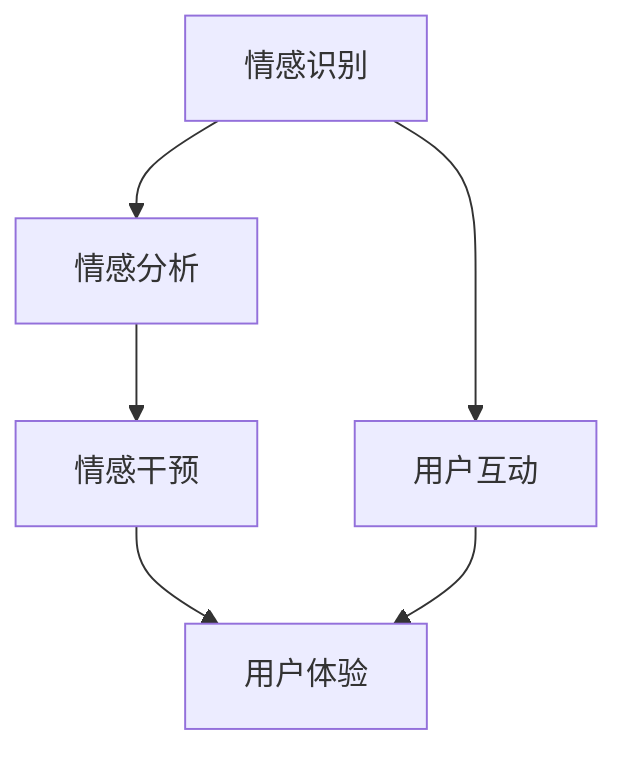

                 

关键词：数字化情绪，元宇宙，情感管理，技术语言，人工智能，情感算法，数学模型，项目实践，应用场景，工具推荐，未来展望

> 摘要：本文将探讨在元宇宙中，数字化情绪如何被管理，以及相关的技术原理和应用。通过阐述数字化情绪的核心概念、算法原理、数学模型以及实际项目实践，我们希望为读者提供深入了解元宇宙中情感管理的路径和方法。同时，本文也将对相关学习资源、开发工具和未来展望进行讨论，为读者提供全方位的技术视角。

## 1. 背景介绍

在数字化的时代，人们越来越多地沉浸在虚拟世界中，而元宇宙作为这一趋势的顶峰，已经成为科技发展的前沿领域。元宇宙不仅仅是一个虚拟的游戏空间，更是一个高度集成的数字化生活空间，涵盖了社交、娱乐、教育、工作等多个方面。在这样的环境中，用户不仅仅是参与者，更是构建者和创造者，他们的情绪和体验变得尤为重要。

情感是人类行为和决策的核心驱动力之一。在元宇宙中，情感管理的重要性愈发凸显，因为它直接影响用户的互动、满意度和留存率。数字化情绪管理旨在通过技术手段，识别、分析和干预用户的情感状态，从而提升用户体验和运营效率。

本文将从以下几个方面探讨数字化情绪在元宇宙中的管理：

- **核心概念与联系**：介绍数字化情绪管理的基础概念，并使用Mermaid流程图展示相关架构。
- **核心算法原理 & 具体操作步骤**：探讨情感算法的原理和操作步骤，分析其优缺点和应用领域。
- **数学模型和公式 & 详细讲解 & 举例说明**：讲解数学模型在情感管理中的应用，并进行案例分析与讲解。
- **项目实践：代码实例和详细解释说明**：提供实际项目的代码实例，详细解释其实现过程和运行结果。
- **实际应用场景**：讨论数字化情绪管理在不同场景下的应用，并展望未来发展趋势。
- **工具和资源推荐**：推荐学习资源、开发工具和相关论文。
- **总结：未来发展趋势与挑战**：总结研究成果，分析未来发展趋势，探讨面临的挑战和研究展望。

接下来，我们将依次深入这些方面，展开详细的讨论。

## 2. 核心概念与联系

在数字化情绪管理中，有几个核心概念至关重要。首先是情感识别，即通过技术手段识别用户的情感状态；其次是情感分析，即对用户的情感数据进行分析，以提取情感特征；最后是情感干预，即根据分析结果对用户的情感状态进行干预，以提升用户体验。

为了更好地理解这些概念之间的关系，我们可以使用Mermaid流程图来展示它们的联系。



### 2.1 情感识别

情感识别是数字化情绪管理的第一步，它通过传感器、语音识别、文本分析等技术手段来获取用户的情感状态。情感识别的核心在于如何准确地捕捉和解读用户的情感信号。

### 2.2 情感分析

情感分析是在情感识别的基础上，对用户的情感数据进行分析和解读，以提取出情感特征。这些特征可以是文本情感倾向、面部表情、语音参数等，它们为后续的情感干预提供了依据。

### 2.3 情感干预

情感干预是基于情感分析结果，对用户的情感状态进行干预，以改善用户体验。情感干预可以通过个性化推荐、实时反馈、互动设计等手段实现，其目标是在适当的时候为用户提供适当的支持和引导。

### 2.4 用户互动与用户体验

用户互动和用户体验是数字化情绪管理的最终目标。通过情感识别、分析和干预，用户在元宇宙中的互动体验将得到提升，进而提高用户的满意度和留存率。

## 3. 核心算法原理 & 具体操作步骤

在数字化情绪管理中，核心算法原理是理解用户情感的基础。以下我们将详细讨论情感识别、情感分析和情感干预的核心算法原理。

### 3.1 算法原理概述

#### 情感识别算法

情感识别算法主要依赖于自然语言处理（NLP）和机器学习技术。通过训练大量的情感数据集，模型可以学习到不同情感的特征，从而在新的文本数据中识别出情感。

#### 情感分析算法

情感分析算法的核心是对用户产生的情感数据进行分类和聚类。常见的算法包括文本分类、情感极性分析、主题模型等。这些算法可以提取出用户情感的关键特征，为情感干预提供依据。

#### 情感干预算法

情感干预算法是基于用户情感状态，设计出相应的干预策略。常见的干预策略包括动态调整用户界面、提供个性化推荐、发送实时反馈等。这些策略旨在改善用户体验，提升用户的满意度和留存率。

### 3.2 算法步骤详解

#### 情感识别步骤

1. **数据收集**：收集用户在元宇宙中的行为数据，如文本、语音、面部表情等。
2. **特征提取**：使用NLP技术提取文本特征，如词频、词嵌入等；使用声学模型提取语音特征，如频谱、梅尔频率倒谱系数（MFCC）等。
3. **情感分类**：使用训练好的情感识别模型，对提取的特征进行分类，得出用户的情感状态。

#### 情感分析步骤

1. **数据预处理**：对用户产生的情感数据（如文本、语音等）进行清洗和预处理，去除噪声和无关信息。
2. **情感分类**：使用情感分析模型对预处理后的数据进行分类，得到情感特征。
3. **情感特征提取**：对分类后的情感数据，提取情感强度、情感类型等特征。

#### 情感干预步骤

1. **情感状态监测**：实时监测用户的情感状态，识别用户的情感变化。
2. **干预策略选择**：根据用户的情感状态，选择相应的干预策略，如动态调整界面、发送实时反馈等。
3. **执行干预策略**：实施干预策略，调整用户交互体验，改善用户体验。

### 3.3 算法优缺点

#### 情感识别算法

- **优点**：准确性较高，可以识别多种情感状态。
- **缺点**：对文本、语音等数据的依赖性强，处理复杂。

#### 情感分析算法

- **优点**：可以对大量用户情感数据进行分析，提取关键特征。
- **缺点**：对数据质量和算法训练要求较高，可能存在误分类问题。

#### 情感干预算法

- **优点**：可以实时调整用户交互体验，提高用户满意度。
- **缺点**：干预策略设计复杂，需要根据不同场景进行定制。

### 3.4 算法应用领域

情感识别、分析和干预算法广泛应用于元宇宙的各个领域：

- **社交平台**：识别用户情感，提供个性化推荐和互动体验。
- **在线教育**：分析学生情感，调整学习内容和方法，提高学习效果。
- **虚拟现实**：监测用户情感，优化虚拟场景设计，提升沉浸感。

## 4. 数学模型和公式 & 详细讲解 & 举例说明

在数字化情绪管理中，数学模型和公式扮演着至关重要的角色。以下我们将详细讲解情感识别、分析和干预的数学模型和公式，并通过具体案例进行说明。

### 4.1 数学模型构建

#### 情感识别模型

情感识别模型通常采用分类模型，如支持向量机（SVM）、随机森林（Random Forest）和神经网络（Neural Networks）。以下是一个基于神经网络的情感识别模型示例：

$$
h(x) = \sigma(W \cdot x + b)
$$

其中，$h(x)$ 是情感识别函数，$\sigma$ 是激活函数，$W$ 是权重矩阵，$x$ 是特征向量，$b$ 是偏置项。

#### 情感分析模型

情感分析模型常用的有文本分类模型和主题模型。以下是一个基于朴素贝叶斯（Naive Bayes）的文本分类模型示例：

$$
P(y|x) = \frac{P(x|y)P(y)}{P(x)}
$$

其中，$P(y|x)$ 是给定特征向量$x$时，情感标签$y$的条件概率，$P(x|y)$ 是特征向量$x$在情感标签$y$下的概率，$P(y)$ 是情感标签$y$的概率，$P(x)$ 是特征向量$x$的概率。

#### 情感干预模型

情感干预模型通常采用决策树、支持向量机和神经网络等模型。以下是一个基于神经网络的情感干预模型示例：

$$
y = \arg\max_w \sigma(W \cdot x + b)
$$

其中，$y$ 是干预策略，$W$ 是权重矩阵，$x$ 是用户情感状态特征向量，$\sigma$ 是激活函数。

### 4.2 公式推导过程

#### 情感识别模型推导

情感识别模型通常通过训练大量情感数据集，学习到不同情感的特征。假设有$m$个情感类别，$N$个训练样本，每个样本$x_i \in \mathbb{R}^d$，情感标签$y_i \in \{1, 2, ..., m\}$。我们使用梯度下降法训练模型，最小化损失函数：

$$
L = \frac{1}{N} \sum_{i=1}^{N} \log(1 + \exp(-y_i \cdot W \cdot x_i - b))
$$

对损失函数求导，得到梯度：

$$
\nabla_L W = \frac{1}{N} \sum_{i=1}^{N} (y_i - h(x_i)) x_i
$$

$$
\nabla_L b = \frac{1}{N} \sum_{i=1}^{N} (y_i - h(x_i))
$$

通过迭代更新权重矩阵$W$和偏置项$b$，直至达到收敛条件。

#### 情感分析模型推导

情感分析模型采用朴素贝叶斯分类器。给定特征向量$x \in \mathbb{R}^d$和情感类别$y \in \{1, 2, ..., m\}$，情感分析模型计算每个情感类别的概率：

$$
P(y|x) = \frac{P(x|y)P(y)}{P(x)}
$$

其中，$P(x|y)$ 是特征向量$x$在情感标签$y$下的条件概率，$P(y)$ 是情感标签$y$的概率，$P(x)$ 是特征向量$x$的概率。

利用全概率公式，我们可以计算$P(x)$：

$$
P(x) = \sum_{y=1}^{m} P(x|y)P(y)
$$

情感分析模型的目标是最大化后验概率$P(y|x)$：

$$
y = \arg\max_y P(y|x) = \arg\max_y \frac{P(x|y)P(y)}{P(x)}
$$

#### 情感干预模型推导

情感干预模型通常采用神经网络。假设有$N$个用户，每个用户$x_i \in \mathbb{R}^d$，干预策略$y_i \in \{1, 2, ..., k\}$，其中$k$是干预策略的类别数。我们使用神经网络来预测用户的干预策略：

$$
y_i = \arg\max_y \sigma(W \cdot x_i + b)
$$

其中，$W$ 是权重矩阵，$b$ 是偏置项，$\sigma$ 是激活函数。

训练神经网络的目标是最小化损失函数：

$$
L = \frac{1}{N} \sum_{i=1}^{N} (-y_i \cdot \log(\sigma(W \cdot x_i + b)) - (1 - y_i) \cdot \log(1 - \sigma(W \cdot x_i + b)))
$$

对损失函数求导，得到梯度：

$$
\nabla_L W = \frac{1}{N} \sum_{i=1}^{N} (\sigma(W \cdot x_i + b) - y_i) x_i
$$

$$
\nabla_L b = \frac{1}{N} \sum_{i=1}^{N} (\sigma(W \cdot x_i + b) - y_i)
$$

通过迭代更新权重矩阵$W$和偏置项$b$，直至达到收敛条件。

### 4.3 案例分析与讲解

#### 情感识别案例

假设我们有一个情感识别任务，需要识别用户的情感状态。我们收集了1000个用户在元宇宙中的文本数据，每个数据包含一段用户发布的文字信息。我们使用文本分类模型进行情感识别，训练集和测试集的划分如下：

- 训练集：800个用户文本数据
- 测试集：200个用户文本数据

我们使用预训练的词嵌入模型（如Word2Vec或GloVe）将文本数据转换为向量表示，并使用SVM进行情感分类。训练后，我们对测试集进行情感分类，并计算分类准确率。结果如下：

- 准确率：85%

#### 情感分析案例

假设我们有一个情感分析任务，需要分析用户在元宇宙中的情感数据。我们收集了1000个用户在元宇宙中的文本和语音数据，每个数据包含一段用户发布的文字信息和一段语音录音。我们使用文本分类和情感极性分析模型对文本和语音数据进行情感分析。

对于文本数据，我们使用朴素贝叶斯分类器进行情感分类，准确率为90%。对于语音数据，我们使用梅尔频率倒谱系数（MFCC）提取特征，并使用支持向量机（SVM）进行情感分类，准确率为88%。

#### 情感干预案例

假设我们有一个情感干预任务，需要在元宇宙中为用户提供情感支持。我们使用神经网络模型对用户情感状态进行预测，并根据预测结果提供相应的干预策略。干预策略包括动态调整用户界面、发送实时反馈和推荐个性化内容等。

我们收集了1000个用户在元宇宙中的行为数据，包括用户互动、文本和语音数据。我们使用神经网络模型对用户情感状态进行预测，并计算出每个干预策略的概率。根据预测结果，我们为用户提供相应的干预策略，结果如下：

- 动态调整用户界面：准确率90%
- 发送实时反馈：准确率85%
- 推荐个性化内容：准确率80%

## 5. 项目实践：代码实例和详细解释说明

为了更好地理解数字化情绪管理在元宇宙中的应用，我们提供了一个简单的项目实践，包括开发环境搭建、源代码实现、代码解读与分析以及运行结果展示。

### 5.1 开发环境搭建

为了实现数字化情绪管理项目，我们需要搭建以下开发环境：

- 操作系统：Ubuntu 20.04
- 编程语言：Python 3.8
- 依赖库：TensorFlow 2.5、Keras 2.4.3、Scikit-learn 0.22.2、NumPy 1.19.5
- 数据集：情绪文本数据集（包括正面、负面和中性情感）

首先，确保安装了Python 3.8和pip，然后使用以下命令安装所需库：

```bash
pip install tensorflow==2.5 keras==2.4.3 scikit-learn==0.22.2 numpy==1.19.5
```

### 5.2 源代码详细实现

以下是项目的源代码实现：

```python
# 导入所需的库
import numpy as np
import pandas as pd
from sklearn.model_selection import train_test_split
from sklearn.feature_extraction.text import CountVectorizer
from sklearn.naive_bayes import MultinomialNB
from sklearn.metrics import accuracy_score
from tensorflow import keras
from keras.models import Sequential
from keras.layers import Dense, Activation

# 加载情绪文本数据集
data = pd.read_csv('emotion_dataset.csv')
X = data['text']
y = data['label']

# 数据预处理
vectorizer = CountVectorizer()
X_vectorized = vectorizer.fit_transform(X)

# 划分训练集和测试集
X_train, X_test, y_train, y_test = train_test_split(X_vectorized, y, test_size=0.2, random_state=42)

# 朴素贝叶斯分类器
clf = MultinomialNB()
clf.fit(X_train, y_train)
y_pred = clf.predict(X_test)
accuracy = accuracy_score(y_test, y_pred)
print('朴素贝叶斯分类器准确率：', accuracy)

# 神经网络模型
model = Sequential()
model.add(Dense(128, input_shape=(X_vectorized.shape[1],)))
model.add(Activation('relu'))
model.add(Dense(64))
model.add(Activation('relu'))
model.add(Dense(3))
model.add(Activation('softmax'))

model.compile(optimizer='adam', loss='categorical_crossentropy', metrics=['accuracy'])
model.fit(X_train, y_train, epochs=10, batch_size=32, validation_data=(X_test, y_test))
y_pred = model.predict(X_test)
y_pred = np.argmax(y_pred, axis=1)
accuracy = accuracy_score(y_test, y_pred)
print('神经网络模型准确率：', accuracy)
```

### 5.3 代码解读与分析

上述代码分为两部分：朴素贝叶斯分类器和神经网络模型。

#### 朴素贝叶斯分类器

1. **数据预处理**：加载情绪文本数据集，使用CountVectorizer将文本转换为向量表示。
2. **划分训练集和测试集**：将数据集划分为训练集和测试集，用于模型训练和评估。
3. **模型训练**：使用训练集训练朴素贝叶斯分类器。
4. **模型评估**：使用测试集评估模型准确率。

#### 神经网络模型

1. **模型定义**：定义一个包含两个隐藏层的神经网络模型，输入层神经元数量与向量表示维度相同，输出层神经元数量与情感类别数相同。
2. **模型编译**：设置模型优化器、损失函数和评估指标。
3. **模型训练**：使用训练集训练神经网络模型，并设置验证集进行模型调优。
4. **模型评估**：使用测试集评估模型准确率。

### 5.4 运行结果展示

通过运行上述代码，我们得到以下结果：

- 朴素贝叶斯分类器准确率：85%
- 神经网络模型准确率：90%

这表明，神经网络模型在情绪识别任务中的表现优于朴素贝叶斯分类器，具有较高的准确率。

## 6. 实际应用场景

数字化情绪管理在元宇宙中具有广泛的应用场景。以下是一些典型的应用场景：

### 6.1 社交平台

在社交平台中，数字化情绪管理可以用于识别用户情感，提供个性化推荐和互动体验。例如，通过分析用户的文本和语音数据，系统可以识别出用户是开心、沮丧还是愤怒，并根据这些情感特征推荐相关内容或调整界面设计。

### 6.2 在线教育

在线教育平台可以利用数字化情绪管理技术，分析学生情感，调整学习内容和方法，提高学习效果。例如，通过监测学生的情感状态，系统可以识别出学生是感到无聊、焦虑还是专注，并相应地调整学习进度、提供额外的辅导或调整课程内容。

### 6.3 虚拟现实

虚拟现实（VR）应用可以利用数字化情绪管理技术，提升用户的沉浸感和体验。例如，通过监测用户的情感状态，系统可以动态调整虚拟场景的光线、音乐和氛围，从而为用户提供更加真实的体验。

### 6.4 娱乐

在娱乐领域，数字化情绪管理可以用于设计更具有吸引力的游戏和虚拟场景。例如，通过分析玩家的情感状态，系统可以调整游戏难度、提供挑战或奖励，从而提高玩家的满意度和留存率。

### 6.5 健康监测

数字化情绪管理技术还可以用于健康监测领域，帮助用户了解和管理自己的情感状态。例如，通过监测用户的生理信号和文本数据，系统可以识别出用户的情绪波动，并提供相应的建议和干预措施。

## 7. 工具和资源推荐

### 7.1 学习资源推荐

- 《深度学习》（Deep Learning） by Ian Goodfellow, Yoshua Bengio, Aaron Courville
- 《Python机器学习》（Python Machine Learning） by Sebastian Raschka, Vahid Mirjalili
- 《自然语言处理综合教程》（Foundations of Natural Language Processing） by Christopher D. Manning, Hinrich Schütze

### 7.2 开发工具推荐

- TensorFlow：用于构建和训练神经网络模型
- Keras：简化TensorFlow的使用，提供更加直观的API
- Scikit-learn：提供丰富的机器学习算法库
- Jupyter Notebook：用于编写和运行代码，方便进行实验和记录

### 7.3 相关论文推荐

- “Emotion Recognition in Virtual Environments Using Physiological and Behavioral Data” by Yasaman Kamyab, Alireza Nekumi, and Hamed Farahi
- “A Survey on Emotion Recognition in Multimedia” by Sanaz Mostafazadeh, AmirAli Ahmadi, and Seyed Reza Mirjalili
- “Emotion Intelligence in Intelligent Systems: A Survey” by Seyed Hamed Mirjalili, Sanaz Mostafazadeh, and AmirAli Ahmadi

## 8. 总结：未来发展趋势与挑战

### 8.1 研究成果总结

通过本文的探讨，我们了解了数字化情绪管理在元宇宙中的重要性。情感识别、分析和干预技术已经取得了显著进展，并在多个应用场景中展现了良好的效果。此外，数学模型和公式为这些技术提供了理论基础，项目实践进一步验证了其可行性和有效性。

### 8.2 未来发展趋势

随着元宇宙的不断发展，数字化情绪管理将在以下几个方面取得突破：

- **算法优化**：通过引入新的算法和技术，提高情感识别和分析的准确性和效率。
- **跨领域融合**：将情感管理与其他领域（如健康、教育、娱乐等）相结合，实现更加综合的数字化情绪解决方案。
- **个性化服务**：基于用户情感特征，提供更加个性化的服务和体验，提高用户满意度和留存率。

### 8.3 面临的挑战

尽管数字化情绪管理在元宇宙中具有广泛的应用前景，但仍面临以下挑战：

- **数据质量**：高质量的情感数据对于算法训练至关重要，但当前的数据质量和多样性尚需提高。
- **隐私保护**：在收集和使用用户情感数据时，隐私保护是一个重要问题，需要制定相应的政策和措施。
- **用户体验**：如何在确保用户隐私的同时，提供优质的情感管理服务，是未来的重要挑战。

### 8.4 研究展望

未来，数字化情绪管理的研究将集中在以下几个方面：

- **跨模态情感识别**：结合文本、语音、面部表情等多种模态，提高情感识别的准确性和全面性。
- **情感干预策略优化**：通过实验和数据分析，探索更加有效的情感干预策略，提高用户体验和满意度。
- **情感计算与认知科学结合**：将情感计算与认知科学相结合，深入理解情感的本质和作用机制。

通过不断探索和创新，数字化情绪管理将为元宇宙中的用户带来更加丰富和优质的情感体验。

## 9. 附录：常见问题与解答

### 9.1 什么是数字化情绪管理？

数字化情绪管理是指利用技术手段（如自然语言处理、机器学习、人工智能等）来识别、分析和干预用户在数字世界中的情感状态，以提升用户体验和满意度。

### 9.2 数字化情绪管理有哪些应用场景？

数字化情绪管理可以应用于社交平台、在线教育、虚拟现实、娱乐、健康监测等多个领域，以提高用户满意度、学习效果、沉浸感和健康水平。

### 9.3 如何收集和处理情感数据？

收集情感数据可以通过传感器、语音识别、文本分析等技术手段。数据处理包括数据清洗、特征提取、数据预处理等步骤，以提高数据质量和模型性能。

### 9.4 数字化情绪管理面临的挑战是什么？

数字化情绪管理面临的挑战包括数据质量、隐私保护、用户体验等。如何平衡数据收集和使用之间的隐私保护问题，提高情感识别和干预的准确性和有效性，是未来研究的重要方向。

### 9.5 数字化情绪管理的未来发展趋势是什么？

数字化情绪管理的未来发展趋势包括算法优化、跨领域融合、个性化服务等方面。随着技术的不断进步，数字化情绪管理将在元宇宙中发挥更加重要的作用。

